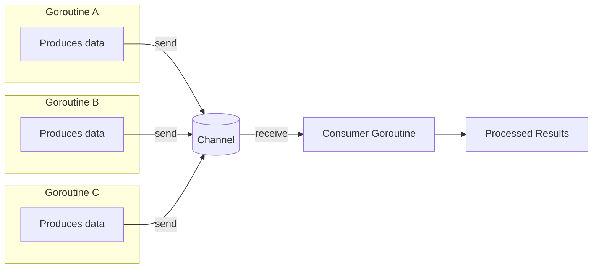
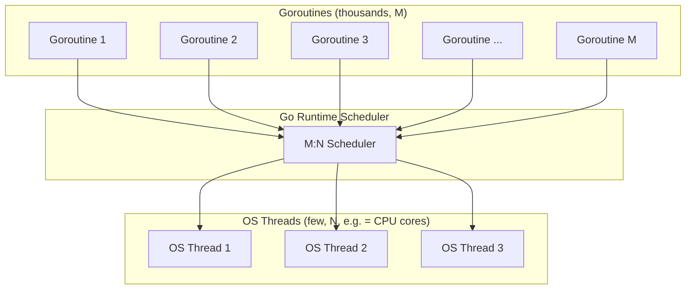

## Go and Simplicity-Focused Concurrency

### Overview

Go (also called Golang) is a statically-typed, compiled language created at Google by Robert Griesemer, Rob Pike, and Ken Thompson, and released publicly in 2009. It was designed explicitly to address pain points its creators experienced with large-scale software engineering at Google: slow build times, unwieldy dependency management, and languages (C++ in particular) whose feature richness had grown to the point of hindering readability and onboarding. Go's guiding philosophy is **radical simplicity**: a small, orthogonal set of language features, fast compilation, and built-in tooling, paired with a concurrency model designed to be approachable rather than expert-only.

Where C++ pursued expressive power and Rust pursued compile-time-proven safety, Go's central trade-off is different: favor a small language surface and straightforward mental model, even if that means omitting features (generics were absent for a decade, there is no classical inheritance, no exceptions) that other languages consider essential.

### Design Philosophy: Simplicity Over Expressiveness

Go deliberately omits many features common in other modern languages:

- No classical class-based inheritance (composition via embedding instead).
- No exceptions (explicit multi-value error returns instead).
- No operator overloading.
- No implicit type conversions.
- Minimal generics (added only in Go 1.18, in 2022, after extensive debate).

**[Inference]** These omissions are frequently described by Go's creators and community as intentional trade-offs favoring code readability and consistency across large teams and codebases over individual expressiveness; this is a stated design philosophy rather than a universally-agreed-upon technical necessity, and reasonable disagreement exists among language designers about the right balance between simplicity and expressive power.

### Basic Syntax

```go
package main

import "fmt"

func main() {
    name := "World"
    fmt.Println("Hello,", name)
}
```

- `:=` performs type-inferred declaration and assignment in one step.
- Every Go file belongs to a `package`; `package main` with a `func main()` defines an executable entry point.
- Imports are explicit and unused imports are a **compile error**, not just a warning — reflecting Go's general intolerance for dead or ambiguous code.

### Explicit Multi-Value Error Handling

Rather than exceptions, Go functions conventionally return an error as an additional return value, which the caller is expected to check explicitly:

```go
package main

import (
    "errors"
    "fmt"
)

func divide(a, b float64) (float64, error) {
    if b == 0 {
        return 0, errors.New("division by zero")
    }
    return a / b, nil
}

func main() {
    result, err := divide(10, 0)
    if err != nil {
        fmt.Println("Error:", err)
        return
    }
    fmt.Println("Result:", result)
}
```

This pattern — `result, err := someFunc(); if err != nil { ... }` — appears pervasively throughout idiomatic Go code. **[Inference]** This verbosity is a frequently cited criticism of Go by developers coming from exception-based languages, though Go's designers have defended it as making control flow and failure points explicit and visible at every call site rather than hidden in a separate exception-propagation path; whether this trade-off is net-positive is a matter of ongoing debate rather than settled fact.

### Goroutines: Lightweight Concurrency

Go's signature feature is the **goroutine** — a function that executes concurrently with the rest of the program, managed by the Go runtime rather than the operating system directly.

```go
package main

import (
    "fmt"
    "time"
)

func sayHello(name string) {
    fmt.Println("Hello,", name)
}

func main() {
    go sayHello("Alice")   // launches a goroutine
    go sayHello("Bob")     // launches another goroutine

    time.Sleep(100 * time.Millisecond)  // wait for goroutines to finish (simplified example)
    fmt.Println("Main function done")
}
```

The `go` keyword is the entirety of the syntax needed to launch concurrent execution — a deliberate contrast to the more verbose thread-management APIs of C++ (`std::thread`) or the async/await ceremony of languages like JavaScript or Rust.

**Goroutines vs. OS threads:**

| Aspect | OS Thread | Goroutine |
| --- | --- | --- |
| Initial stack size | Typically 1–8 MB (fixed) | ~2 KB (grows dynamically) |
| Managed by | Operating system | Go runtime scheduler |
| Creation cost | Relatively expensive | Very lightweight |
| Typical scale | Hundreds to low thousands | Hundreds of thousands+ feasible |
| Context switching | OS-level, higher overhead | Runtime-level, lower overhead |

**[Unverified]** Exact goroutine memory and performance figures vary by Go version and workload; the commonly cited "~2KB initial stack" figure reflects general documentation and community benchmarks rather than a fixed guarantee across all Go releases, and should be verified against the specific Go version in use for capacity-planning purposes.

### Channels: Communicating Sequential Processes

Go's concurrency model is built on Tony Hoare's **Communicating Sequential Processes (CSP)** paradigm, summarized by Go's own often-quoted proverb:

> "Do not communicate by sharing memory; instead, share memory by communicating."

**Channels** are typed conduits through which goroutines send and receive values, providing synchronization implicitly through the act of communication itself, rather than requiring separate manual locks in the common case.

```go
package main

import "fmt"

func worker(id int, jobs <-chan int, results chan<- int) {
    for j := range jobs {
        results <- j * 2
    }
}

func main() {
    jobs := make(chan int, 5)
    results := make(chan int, 5)

    for w := 1; w <= 3; w++ {
        go worker(w, jobs, results)
    }

    for j := 1; j <= 5; j++ {
        jobs <- j
    }
    close(jobs)

    for a := 1; a <= 5; a++ {
        fmt.Println(<-results)
    }
}
```

- `chan int` declares a channel carrying `int` values.
- `<-chan` and `chan<-` denote receive-only and send-only channel directions in function signatures, letting the compiler enforce intended data flow direction.
- Sending (`ch <- value`) and receiving (`<-ch`) on an **unbuffered** channel blocks until both sender and receiver are ready, providing built-in synchronization without explicit locks.

### Goroutine and Channel Communication Model



### The `select` Statement

`select` allows a goroutine to wait on multiple channel operations simultaneously, proceeding with whichever is ready first — analogous in spirit to a `switch` statement, but for concurrent channel operations:

```go
package main

import (
    "fmt"
    "time"
)

func main() {
    ch1 := make(chan string)
    ch2 := make(chan string)

    go func() {
        time.Sleep(1 * time.Second)
        ch1 <- "from ch1"
    }()
    go func() {
        time.Sleep(2 * time.Second)
        ch2 <- "from ch2"
    }()

    for i := 0; i < 2; i++ {
        select {
        case msg1 := <-ch1:
            fmt.Println("Received:", msg1)
        case msg2 := <-ch2:
            fmt.Println("Received:", msg2)
        }
    }
}
```

### Synchronization Primitives: `sync` Package

While channels are the idiomatic default, Go also provides traditional lower-level primitives (`sync.Mutex`, `sync.WaitGroup`, `sync.Once`) for cases where shared-memory synchronization is more natural than message-passing:

```go
package main

import (
    "fmt"
    "sync"
)

func main() {
    var wg sync.WaitGroup
    var mu sync.Mutex
    counter := 0

    for i := 0; i < 100; i++ {
        wg.Add(1)
        go func() {
            defer wg.Done()
            mu.Lock()
            counter++
            mu.Unlock()
        }()
    }

    wg.Wait()
    fmt.Println("Final counter:", counter)
}
```

`sync.WaitGroup` provides a simple counter-based mechanism to wait for a collection of goroutines to finish — a common alternative to channel-based coordination when the goroutines don't need to exchange data, only signal completion.

### The Go Scheduler: M:N Threading

Go's runtime implements an **M:N scheduler** — M goroutines are multiplexed onto N OS threads, managed cooperatively by the runtime rather than requiring a dedicated OS thread per goroutine.



This scheduling model is what makes launching hundreds of thousands of goroutines practical, in contrast to OS threads, whose per-thread memory and context-switching overhead makes such scale impractical on most systems. **Behavioral note**: The exact scheduling behavior (work-stealing details, GOMAXPROCS interaction with available CPU cores) is an internal runtime implementation detail that has evolved across Go versions; specific scheduling guarantees should be verified against the Go version's documentation rather than assumed fixed.

### The Race Detector

Unlike Rust, Go does not prevent data races at compile time — channels and `sync.Mutex` are conventions the programmer must apply correctly, not compiler-enforced guarantees. To help catch races that do occur, Go ships a built-in **race detector**:

```bash
go run -race main.go
go test -race ./...
```

This is a runtime instrumentation tool (using Google's ThreadSanitizer-based approach) that flags concurrent unsynchronized memory access during execution, rather than proving safety statically. **[Unverified]** The race detector's coverage is limited to code paths actually exercised during the instrumented run — it cannot guarantee the complete absence of race conditions in paths untested during that particular execution, a limitation inherent to dynamic analysis tools generally.

### Comparison: Go's Concurrency vs. Alternatives

| Language | Concurrency Primitive | Safety Guarantee | Overhead |
| --- | --- | --- | --- |
| Go | Goroutines + channels | Convention-based (race detector helps, not compile-enforced) | Very low (lightweight goroutines) |
| Rust | Threads + ownership/`Send`/`Sync` traits | Compile-time enforced (data races are compile errors) | Low, but no lightweight goroutine equivalent by default |
| Java | Threads + `synchronized`/locks | Convention-based (runtime detection tools exist) | Higher (OS-backed threads, though virtual threads narrow this) |
| C++ | `std::thread` + mutexes/atomics | Convention-based, manual | Low, but historically more verbose/manual |

### Built-In Tooling as Part of the Simplicity Philosophy

Go's simplicity philosophy extends beyond the language itself into its tooling, all bundled with the standard distribution rather than left to third-party ecosystem fragmentation:

```bash
go fmt ./...      # canonical, non-negotiable code formatting
go vet ./...      # static analysis for suspicious constructs
go test ./...     # built-in test runner, no external framework required
go build          # compiles to a single static binary
go mod tidy       # dependency management
```

`gofmt` in particular is notable for eliminating formatting debates entirely within Go teams: there is exactly one canonical formatting, enforced by tooling rather than convention or style guides — a direct expression of the language's broader "there should be one obvious way" ethos.

### Generics: A Deliberately Delayed Addition

Go famously shipped without generics for its first decade, a decision its designers defended as avoiding the complexity costs (in both language design and compiler implementation) generics have historically introduced elsewhere. Generics were eventually added in **Go 1.18** (2022) via type parameters:

```go
package main

import "fmt"

func Sum[T int | float64](nums []T) T {
    var total T
    for _, n := range nums {
        total += n
    }
    return total
}

func main() {
    ints := []int{1, 2, 3, 4}
    floats := []float64{1.5, 2.5, 3.5}

    fmt.Println(Sum(ints))
    fmt.Println(Sum(floats))
}
```

**[Inference]** The long delay and eventual addition of generics is often cited as an example of Go's design process prioritizing getting a feature right (and avoiding unnecessary complexity) over shipping it quickly; whether the resulting generics design fully satisfies use cases that motivated third-party workarounds during the pre-1.18 era is a matter on which practitioner opinions vary, and should not be treated as a settled consensus.

### Key Points

- Go's central design trade-off is simplicity: a deliberately small language (no inheritance, no exceptions, minimal generics for a decade) intended to keep large codebases readable and consistent across teams.
- Goroutines are lightweight, runtime-managed concurrent functions, cheap enough to launch in the hundreds of thousands, unlike OS threads.
- Channels implement CSP-style "share memory by communicating," providing synchronization through message-passing as the idiomatic default, though traditional `sync` primitives remain available.
- Go's M:N scheduler multiplexes many goroutines onto few OS threads, enabling its concurrency model's low overhead.
- Unlike Rust, Go does not prevent data races at compile time; the `-race` detector is a runtime, coverage-dependent safety net rather than a static guarantee.
- Built-in tooling (`gofmt`, `go vet`, `go test`) is treated as part of the language's simplicity philosophy, reducing ecosystem fragmentation and stylistic debate.

### Related Topics

- Go's `interface` system and structural typing (duck typing at compile time)
- Composition over inheritance: struct embedding in Go
- The `context` package for cancellation and deadline propagation across goroutines
- Comparing CSP (Go) to actor-model concurrency (Erlang/Elixir) and async/await (Rust, JavaScript)
- Go modules and dependency management in depth
- Error handling patterns beyond basic `if err != nil` (wrapped errors, `errors.Is`/`errors.As`)
- Go's garbage collector design and low-latency tuning