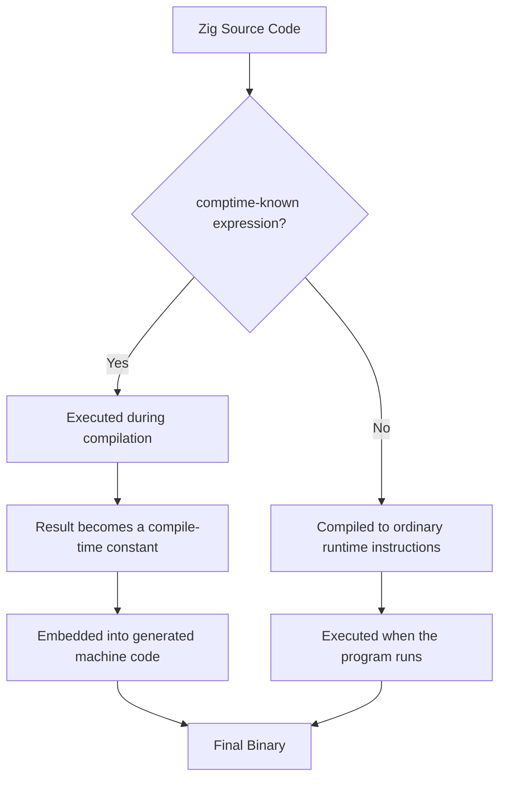

## Zig and Explicit Systems Programming

### Overview

Zig is a systems programming language created by Andrew Kelley, with initial development beginning around 2015 and its first tagged release in 2016. It positions itself as a modern alternative to C, sharing C's goals of manual memory control and minimal runtime overhead, but built around a philosophy of radical **explicitness**: no hidden control flow, no hidden memory allocations, no hidden function calls, and no preprocessor macros or textual substitution. Where C++ and Rust each add substantial abstraction layers (templates/classes/exceptions, or ownership/traits/borrow-checking respectively) on top of a C-like base, Zig's guiding principle is deliberately closer to "there should be no behavior in this code that isn't visible in this code" — a reaction against both C's undefined-behavior pitfalls and the perceived complexity of C++'s feature accumulation.

Zig is still a comparatively young and evolving language. **[Unverified]** As of this writing, Zig has not yet reached a 1.0 stable release, meaning language syntax and standard library APIs have continued to change between versions; specific syntax shown here should be verified against the version of the Zig compiler actually in use, since breaking changes between releases have been common during this pre-1.0 period.

### Core Philosophy: "No Hidden Control Flow, No Hidden Allocations"

Zig's design manifesto is frequently summarized by a small set of explicit rules:

- **No hidden control flow**: there is no operator overloading, no exceptions, and no destructors that run implicitly — every jump, return, or error path is visible in the source text at the call site.
- **No hidden memory allocations**: the standard library never allocates memory silently on the programmer's behalf; any function that needs to allocate accepts an explicit `Allocator` parameter.
- **No preprocessor, no macros**: metaprogramming is done through the language itself (via `comptime`), not textual substitution, avoiding the debugging opacity C macros can introduce.
- **A single obvious way to do a given thing** where practical, reducing the "many idioms for the same task" surface area that accumulates in older, larger languages.

This philosophy positions Zig as a direct critique of specific pain points in both C (undefined behavior, macro opacity) and C++ (implicit constructors/destructors, operator overloading, exception-based control flow that can jump through many stack frames invisibly).

### Basic Syntax

```zig
const std = @import("std");

pub fn main() void {
    std.debug.print("Hello, {s}!\n", .{"World"});
}
```

- `@import` is a compiler builtin (prefixed with `@`), not a preprocessor directive — it is resolved by the compiler itself as part of normal compilation, not textual inclusion.
- `const` and `var` distinguish immutable and mutable bindings, similar in spirit to Rust.
- Functions declare an explicit return type (`void` here) with no implicit inference of return type.

### Explicit Memory Allocation

Reflecting the "no hidden allocations" principle, essentially all memory-allocating operations in Zig require the caller to explicitly pass an `Allocator`:

```zig
const std = @import("std");

pub fn main() !void {
    var gpa = std.heap.GeneralPurposeAllocator(.{}){};
    defer _ = gpa.deinit();
    const allocator = gpa.allocator();

    const buffer = try allocator.alloc(u8, 100);
    defer allocator.free(buffer);

    @memset(buffer, 0);
    std.debug.print("Allocated {d} bytes\n", .{buffer.len});
}
```

This is a deliberate contrast to languages where allocation is implicit (e.g., a `String` or `Vec` growing behind the scenes, or a garbage collector reclaiming memory transparently). In Zig, every allocation is visible as an explicit `allocator.alloc(...)` call, and every corresponding deallocation is the programmer's explicit responsibility — but unlike raw C, Zig provides `defer` (below) to make that responsibility easier to discharge correctly.

### `defer` and `errdefer`: Explicit but Ergonomic Cleanup

Zig's `defer` statement schedules code to run when the current scope exits, addressing C's error-prone manual cleanup without introducing C++-style implicit destructors:

```zig
const std = @import("std");

pub fn processFile(allocator: std.mem.Allocator, path: []const u8) !void {
    const file = try std.fs.cwd().openFile(path, .{});
    defer file.close();  // guaranteed to run when function returns, any exit path

    const buffer = try allocator.alloc(u8, 1024);
    defer allocator.free(buffer);

    _ = try file.readAll(buffer);
    std.debug.print("Read file successfully\n", .{});
}
```

`errdefer` is a refinement that runs only if the function returns an **error**, useful for unwinding partially-completed work without needing manual duplication of cleanup logic across every possible error path:

```zig
fn createResource(allocator: std.mem.Allocator) !*Resource {
    const resource = try allocator.create(Resource);
    errdefer allocator.destroy(resource);  // only runs if a later step fails

    try resource.initialize();  // if this fails, errdefer above cleans up 'resource'
    return resource;
}
```

Crucially, `defer` and `errdefer` are still **textually visible** at their call site — unlike C++ destructors, which run implicitly based on an object's type without any corresponding line of code at the point of cleanup, Zig requires the programmer to write the cleanup instruction explicitly, even though its *execution* is deferred.

### Error Handling: Error Unions, No Exceptions

Zig has no exceptions. Instead, functions that can fail return an **error union type** (`!T`, read as "error union of some error set and `T`"), and errors must be explicitly handled or propagated:

```zig
const std = @import("std");

const MathError = error{
    DivisionByZero,
    Overflow,
};

fn divide(a: i32, b: i32) MathError!i32 {
    if (b == 0) {
        return MathError.DivisionByZero;
    }
    return @divTrunc(a, b);
}

pub fn main() void {
    const result = divide(10, 0) catch |err| {
        std.debug.print("Error occurred: {}\n", .{err});
        return;
    };
    std.debug.print("Result: {d}\n", .{result});
}
```

The `try` keyword is explicit sugar for "propagate this error to my caller if one occurs" — but unlike an exception throw, it is visible at every single call site where it's used, rather than an invisible possibility lurking in any function call:

```zig
fn compute() !i32 {
    const x = try divide(10, 2);  // 'try' makes error propagation visible here
    return x * 2;
}
```

### `comptime`: Compile-Time Execution as Metaprogramming

Rather than a textual preprocessor (C) or a separate template language (C++), Zig unifies metaprogramming with the language itself via `comptime` — ordinary Zig code that executes **during compilation**, operating on types as first-class values.

```zig
const std = @import("std");

fn max(comptime T: type, a: T, b: T) T {
    return if (a > b) a else b;
}

pub fn main() void {
    std.debug.print("{d}\n", .{max(i32, 3, 7)});
    std.debug.print("{d}\n", .{max(f64, 2.5, 1.5)});
}
```

Here, `T` is a **type**, passed as a normal compile-time-known function argument — generics in Zig are simply regular functions that happen to take `type` as a parameter and execute at compile time, rather than a distinct templating syntax layered on top of the language (as in C++) or a separate trait/concept system (as in Rust). This is a direct expression of the "one obvious way" philosophy: the same function-call syntax used for runtime code is reused for compile-time generic code.

### Compile-Time vs. Runtime Execution Flow



### No Hidden Control Flow: Consequences

Because Zig has no operator overloading and no exceptions, reading a Zig function's body is intended to give a programmer a complete picture of every possible control-flow path without needing to inspect type definitions elsewhere or trace an invisible exception-propagation chain:

```zig
// In C++, "a + b" might silently call an overloaded operator+
// with arbitrary, possibly expensive, user-defined behavior.
// In Zig, arithmetic operators work only on numeric types —
// there is no way to redefine what '+' means for a custom struct.

const Vector2 = struct {
    x: f32,
    y: f32,

    fn add(self: Vector2, other: Vector2) Vector2 {
        return Vector2{ .x = self.x + other.x, .y = self.y + other.y };
    }
};

pub fn main() void {
    const a = Vector2{ .x = 1, .y = 2 };
    const b = Vector2{ .x = 3, .y = 4 };
    const c = a.add(b);  // explicit method call, not an overloaded '+'
    _ = c;
}
```

### Cross-Compilation as a First-Class Feature

Zig treats cross-compilation as a built-in, "just works" capability rather than a complex separate toolchain configuration step — a practical consequence of its explicitness philosophy applied to build tooling, since the compiler bundles its own copies of common C/C++ standard library targets:

```bash
zig build-exe main.zig -target x86_64-linux-gnu
zig build-exe main.zig -target aarch64-macos
zig build-exe main.zig -target wasm32-wasi
```

**[Inference]** Zig's cross-compilation support is frequently cited by its community as one of its most immediately practical advantages over C/C++ toolchains, since it avoids the historically fragmented and platform-specific setup C/C++ cross-compilation has often required; the precise scope of target platforms and library compatibility supported should be verified against current documentation for any specific deployment target, since coverage has continued to expand across releases.

### Zig as a C/C++ Build Tool and Interop Layer

A distinctive aspect of Zig's ecosystem role is that its compiler can also function as a drop-in C/C++ compiler (`zig cc`, `zig c++`) and supports direct interoperability with C code without a separate binding-generation step for many cases:

```zig
const c = @cImport({
    @cInclude("stdio.h");
});

pub fn main() void {
    _ = c.printf("Hello from C stdio, called from Zig!\n");
}
```

`@cImport` parses a C header directly and exposes its declarations as ordinary Zig symbols, reflecting the language's general preference for solving problems (like C interop) through its own compiler mechanisms rather than requiring an external tool or separate glue-code-generation step.

### Comparison: Zig vs. C vs. Rust on Explicitness

| Aspect | C | Zig | Rust |
| --- | --- | --- | --- |
| Memory allocation | Implicit via library calls (`malloc`) | Explicit `Allocator` parameter required | Implicit (owned types allocate internally) |
| Error handling | Sentinel values / errno (easy to ignore) | Error unions + mandatory `try`/`catch` | `Result`/`Option`, compiler-enforced handling |
| Generics/metaprogramming | Preprocessor macros (textual, opaque) | `comptime` (real code, type-checked) | Traits + generics (compile-time monomorphization) |
| Memory safety guarantee | None (programmer trusted) | None by default (safety checks in Debug/ReleaseSafe modes) | Compile-time enforced via borrow checker |
| Operator overloading | Not supported | Not supported (by design) | Supported via traits |
| Undefined behavior | Present (signed overflow, etc.) | Illegal behavior is caught in safety-checked build modes | Minimized via ownership model; `unsafe` isolates the rest |

**Behavioral note**: Zig's safety checks (e.g., array bounds checking, integer overflow detection) are controlled by build mode (`Debug`, `ReleaseSafe`, `ReleaseFast`, `ReleaseSmall`) — some checks present in `Debug`/`ReleaseSafe` are stripped in `ReleaseFast` for performance, meaning the same source code can exhibit different runtime safety behavior depending on compilation flags; this should be verified against the specific build mode used for any deployed binary rather than assumed constant across modes.

### Build System: `build.zig`

Rather than relying on an external build tool (Make, CMake for C/C++), Zig projects define their build logic in ordinary Zig code, executed by the compiler itself:

```zig
const std = @import("std");

pub fn build(b: *std.Build) void {
    const exe = b.addExecutable(.{
        .name = "myapp",
        .root_source_file = b.path("src/main.zig"),
        .target = b.standardTargetOptions(.{}),
        .optimize = b.standardOptimizeOption(.{}),
    });
    b.installArtifact(exe);
}
```

This reflects the same underlying principle applied at the build-tooling layer: rather than introducing a separate declarative or macro-based build language (as Make or CMake do), Zig reuses the language itself, so build logic is subject to the same type-checking and explicitness as application code.

### Key Points

- Zig's core philosophy is explicitness: no hidden control flow, no hidden memory allocations, no preprocessor/macros, aiming to make source code a complete and honest description of program behavior.
- Memory allocation is never implicit — nearly all allocating standard-library functions require an explicit `Allocator` argument passed by the caller.
- `defer`/`errdefer` provide C++-destructor-like cleanup ergonomics while remaining textually visible at their call site, unlike implicit destructor invocation.
- Error handling uses explicit error union types (`!T`) and the `try`/`catch` keywords rather than exceptions, keeping every failure path visible in source code.
- `comptime` unifies metaprogramming and generics with ordinary language syntax, replacing both C's textual macros and C++'s separate template system.
- Zig is a pre-1.0 language with an actively evolving syntax and standard library; version-specific details should be verified against the compiler version actually in use.

### Related Topics

- Zig's build-mode safety model (`Debug`, `ReleaseSafe`, `ReleaseFast`, `ReleaseSmall`) in depth
- `comptime` metaprogramming patterns compared to C++ templates and Rust generics
- Zig's C interoperability (`@cImport`, `zig cc`) for incremental migration from C codebases
- Allocator design patterns in Zig (arena allocators, fixed-buffer allocators, general-purpose allocator)
- Comparing explicitness philosophies: Zig vs. Rust's compile-time safety vs. C's minimal runtime
- Zig's package manager and build system (`build.zig`, `build.zig.zon`) in depth
- Error unions and error sets: composing and merging error types across functions