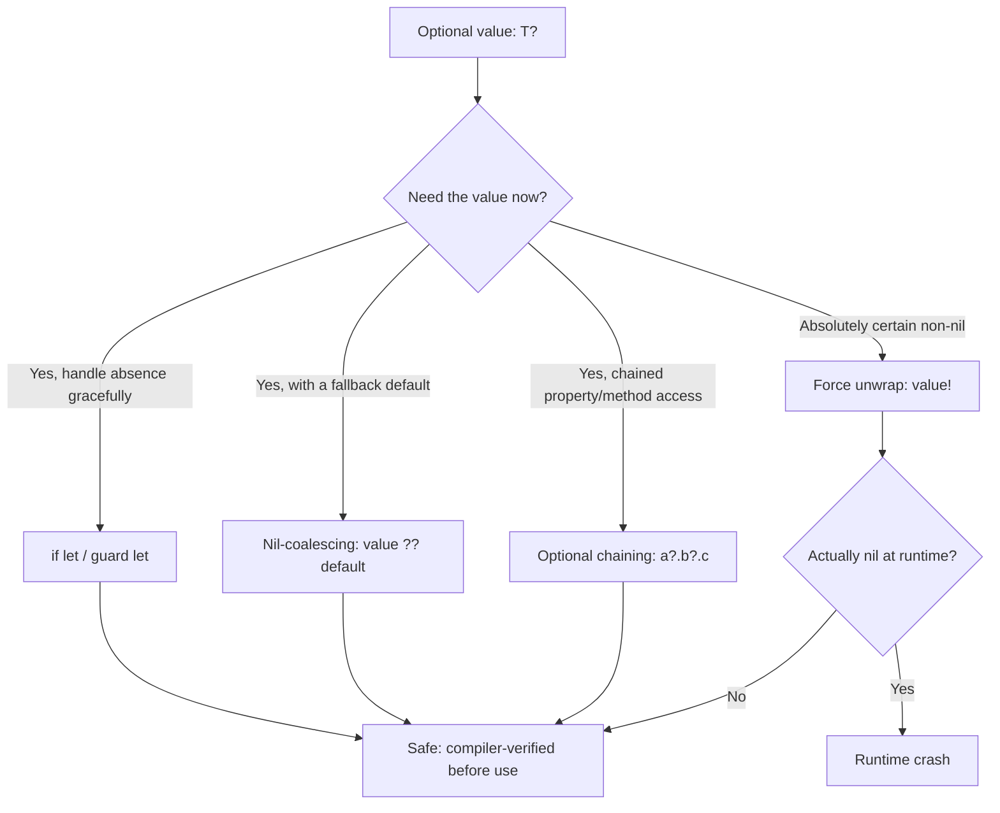

## Swift and Safety in Application Development

### Overview

Swift is a general-purpose, compiled programming language created by Apple, first announced in 2014 as a modern replacement for Objective-C across Apple's platforms (iOS, macOS, watchOS, tvOS), and later open-sourced in 2015 to support broader adoption, including server-side and cross-platform use. Swift's design goal is distinctive relative to the systems languages discussed elsewhere in this series (C, Rust, Zig, Go): rather than targeting low-level OS or embedded work, Swift's central mission is **safety and expressiveness for application-level development**, aiming to eliminate common classes of bugs — null pointer crashes, uninitialized variables, type mismatches, integer overflow — through language design, while still remaining fast enough for performance-sensitive mobile and desktop applications via Apple's LLVM-based compiler toolchain.

Swift's philosophy is often summarized by its own documentation as prioritizing **safety, speed, and expressiveness together**, rather than treating them as competing goals to be traded off, as is more explicitly the case in languages like C (speed over safety) or Python (expressiveness/ease over raw speed).

### Optionals: Eliminating Null Pointer Crashes by Design

Swift's most distinctive safety feature is the **optional type** (`Optional<T>`, written `T?`), which makes the possibility of "no value" an explicit, compiler-tracked part of a variable's type — directly targeting the class of bugs Tony Hoare famously called his "billion-dollar mistake" (the null reference).

```swift
var name: String = "Alice"        // cannot be nil — guaranteed non-optional
var middleName: String? = nil     // may or may not hold a value

// Direct use of an optional without unwrapping is a compile error:
// print(middleName.count)  // COMPILE ERROR

if let unwrapped = middleName {
    print("Middle name: \(unwrapped)")
} else {
    print("No middle name provided")
}
```

Because non-optional types (`String`, `Int`, custom classes without `?`) are **guaranteed by the compiler to never be nil**, a large class of null-dereference crashes common in Objective-C, Java, or C++ simply cannot occur for non-optional values — the compiler refuses to compile code that would attempt to use a possibly-absent value without first proving it has been checked.

### Optional Unwrapping Patterns

Swift provides several syntactic tools for safely working with optionals, each suited to different situations:

```swift
var age: Int? = 25

// 1. Optional binding (if let) — safe, scoped unwrapping
if let unwrappedAge = age {
    print("Age is \(unwrappedAge)")
}

// 2. guard let — early-exit unwrapping, keeps the "happy path" unindented
func processAge(_ age: Int?) {
    guard let validAge = age else {
        print("No age provided")
        return
    }
    print("Processing age: \(validAge)")
}

// 3. Nil-coalescing operator — provide a default value
let displayAge = age ?? 0
print("Display age: \(displayAge)")

// 4. Optional chaining — safely access properties/methods on optionals
struct Address { var city: String }
struct Person { var address: Address? }

let person = Person(address: nil)
let cityLength = person.address?.city.count  // nil if address is nil, no crash

// 5. Force unwrapping — explicit, visible risk acceptance
let forcedAge = age!  // CRASHES at runtime if age is nil — used only when certain
```

Force unwrapping (`!`) is Swift's intentional escape hatch: it is always visible in source code as an explicit `!`, communicating to any reader that the programmer is asserting certainty a value is non-nil, and accepting a runtime crash as the consequence if that assertion is wrong. This mirrors the "make risk visible" philosophy also seen in Zig's `unsafe`-adjacent explicitness and Rust's `unsafe` blocks, though Swift's optionals are the language's *default* safety mechanism rather than an escape hatch from a stronger static system like Rust's borrow checker.

### Optional Handling Decision Flow



### Type Safety and Type Inference

Swift is strongly and statically typed, but uses type inference extensively so explicit annotations are often unnecessary while type safety is still fully enforced at compile time:

```swift
let count = 42          // inferred as Int
let price = 19.99       // inferred as Double
let label = "Total"     // inferred as String

// Implicit type conversions are NOT allowed — this is a compile error:
// let total = count + price  // ERROR: cannot add Int and Double directly

let total = Double(count) + price  // explicit conversion required
```

This mirrors a broader theme across the modern languages surveyed in this series: Swift, like Rust and Zig, refuses **silent, implicit type coercion**, treating it as a source of subtle bugs rather than a convenience — in contrast to more permissive dynamic or loosely-typed languages such as PHP or JavaScript, where implicit coercion is common.

### Value Types vs. Reference Types: `struct` vs. `class`

Swift draws a sharp, safety-relevant distinction between **value types** (`struct`, `enum`) and **reference types** (`class`), which affects how mutation and sharing behave:

```swift
struct Point {          // value type
    var x: Int
    var y: Int
}

class Container {       // reference type
    var value: Int
    init(value: Int) { self.value = value }
}

var p1 = Point(x: 0, y: 0)
var p2 = p1              // COPIED — independent value
p2.x = 100
print(p1.x)               // still 0

let c1 = Container(value: 0)
let c2 = c1               // SHARED reference — same underlying object
c2.value = 100
print(c1.value)            // 100 — c1 and c2 point to the same instance
```

Apple's official Swift guidance and the standard library itself favor `struct` by default (most Swift standard library collection types — `Array`, `Dictionary`, `String` — are value types), reserving `class` for cases requiring shared mutable state or identity. This default-to-value-types stance is a deliberate safety measure: value-type copies eliminate an entire category of bugs stemming from unexpected aliasing, where two variables unexpectedly refer to, and mutate, the same underlying object.

### Automatic Reference Counting (ARC)

Unlike Go or Java's tracing garbage collector, Swift manages reference-type (`class`) memory through **Automatic Reference Counting (ARC)** — the compiler inserts retain/release calls at compile time based on static analysis of ownership, so memory is freed deterministically as soon as the last reference goes out of scope, without a separate garbage-collection pass or runtime GC pauses.

```swift
class Person {
    let name: String
    init(name: String) {
        self.name = name
        print("\(name) is being initialized")
    }
    deinit {
        print("\(name) is being deallocated")
    }
}

func example() {
    let person = Person(name: "Alice")
    print("Using \(person.name)")
}   // 'person' deallocated here — deterministically, at scope exit
```

**Retain cycles**: ARC's main pitfall is the **strong reference cycle** — two objects holding strong references to each other, preventing either's reference count from ever reaching zero:

```swift
class Owner {
    var pet: Pet?
}

class Pet {
    weak var owner: Owner?   // 'weak' breaks the potential cycle
}

var owner: Owner? = Owner()
var pet: Pet? = Pet()
owner?.pet = pet
pet?.owner = owner   // without 'weak' here, this would create a retain cycle
```

The `weak` (and related `unowned`) reference qualifiers exist specifically to let the programmer explicitly break potential cycles — visible, intentional annotations rather than a silent runtime cycle-detection mechanism (which ARC, unlike a tracing garbage collector, does not perform).

### Error Handling: `throws`, `try`, `catch`

Swift uses a typed, exception-like error propagation model, but one that — similar to Zig's `try` and Rust's `?` — must be explicitly marked at every point where an error might propagate, rather than allowing invisible exception propagation through arbitrary call chains:

```swift
enum ValidationError: Error {
    case tooShort
    case tooLong
}

func validate(username: String) throws -> Bool {
    if username.count < 3 {
        throw ValidationError.tooShort
    }
    if username.count > 20 {
        throw ValidationError.tooLong
    }
    return true
}

do {
    let isValid = try validate(username: "ab")
    print("Valid: \(isValid)")
} catch ValidationError.tooShort {
    print("Username is too short")
} catch ValidationError.tooLong {
    print("Username is too long")
} catch {
    print("Unexpected error: \(error)")
}
```

Any function that can throw must be marked `throws` in its signature, and any call site invoking it must be prefixed with `try` — making the possibility of failure visible both at the function's declaration and at every point it is actually called, rather than something a reader must infer from documentation or external knowledge.

### Protocol-Oriented Programming

Swift favors **protocols** (similar to interfaces/traits in other languages) combined with **protocol extensions** as its primary mechanism for shared behavior, a style Apple has explicitly termed "protocol-oriented programming" as an alternative to deep class-inheritance hierarchies:

```swift
protocol Describable {
    func describe() -> String
}

extension Describable {
    func describe() -> String {
        return "A describable object"   // default implementation
    }
}

struct Book: Describable {
    let title: String
    func describe() -> String {
        return "Book: \(title)"
    }
}

struct Rock: Describable {}   // uses the default implementation

let items: [Describable] = [Book(title: "Swift Guide"), Rock()]
for item in items {
    print(item.describe())
}
```

This mirrors the broader industry trend (also visible in Go's interfaces and Rust's traits) away from deep single-inheritance class hierarchies and toward composition of smaller, focused capability contracts — a shift often motivated by the same safety and maintainability concerns driving the other language design choices surveyed in this series.

### Memory Safety Comparison Across Approaches

| Language | Null Safety | Memory Reclamation | Type Coercion | Error Model |
| --- | --- | --- | --- | --- |
| Swift | Optionals (compile-time tracked) | ARC (deterministic, compile-time inserted) | None implicit | `throws`/`try`/`catch`, explicit |
| Rust | `Option<T>` (compile-time tracked) | Ownership/borrow checker (compile-time) | None implicit | `Result<T,E>`, explicit |
| Go | No optionals; `nil` usable on pointers/interfaces | Tracing garbage collector | None implicit | Multi-value return + explicit check |
| Java | No optionals by default (`Optional<T>` opt-in, not enforced) | Tracing garbage collector | Some implicit (numeric widening) | Exceptions (can be invisible in call chain) |
| C | No null safety | Manual (`malloc`/`free`) | Extensive implicit coercion | Sentinel values/errno (easy to ignore) |

**[Inference]** Swift's combination of optionals plus ARC is frequently characterized as a middle ground between Rust's fully compile-time-enforced ownership model (steeper learning curve, no runtime GC-like overhead) and traditional garbage-collected languages like Java or Go (simpler mental model, but less deterministic memory reclamation timing); the appropriateness of this trade-off depends on the specific application domain and should not be treated as a universal ranking of language quality.

### Application-Level Focus: SwiftUI and Declarative Safety

Beyond core language safety, Swift's application-development orientation is reflected in frameworks like **SwiftUI**, which apply similar safety principles to UI construction — using Swift's type system to catch UI-construction errors (mismatched view types, invalid state bindings) at compile time rather than at runtime, a contrast to more dynamically-typed or runtime-configured UI frameworks:

```swift
import SwiftUI

struct ContentView: View {
    @State private var count: Int = 0

    var body: some View {
        VStack {
            Text("Count: \(count)")
            Button("Increment") {
                count += 1
            }
        }
    }
}
```

The `@State` property wrapper and `some View` return type are both compile-time-checked mechanisms ensuring UI state and view composition remain type-safe — reflecting the same underlying philosophy (push correctness checks as early as possible, into the compiler) applied to a domain (UI development) quite different from the systems-level concerns of C, Rust, or Zig.

### Key Points

- Swift's central safety mechanism is the optional type (`T?`), which makes the possibility of "no value" explicit and compiler-tracked, eliminating most null-pointer crashes for non-optional types by construction.
- Force unwrapping (`!`) is Swift's deliberately visible escape hatch, mirroring the "make risk explicit in source" philosophy seen elsewhere in modern systems and application languages.
- Swift distinguishes value types (`struct`, copied on assignment) from reference types (`class`, shared by reference), defaulting to value types to reduce unexpected-aliasing bugs.
- Automatic Reference Counting (ARC) provides deterministic memory reclamation for reference types without a tracing garbage collector, at the cost of requiring explicit `weak`/`unowned` annotations to avoid retain cycles.
- Error handling (`throws`/`try`/`catch`) requires errors to be explicitly marked at both declaration and call sites, avoiding invisible exception propagation.
- Swift's safety-first philosophy extends beyond the core language into frameworks like SwiftUI, applying compile-time correctness checks to application-level domains like UI construction.

### Related Topics

- ARC internals and retain cycle debugging (`weak` vs. `unowned`, memory graph debugging tools)
- Protocol-oriented programming compared to Rust traits and Go interfaces
- SwiftUI's declarative UI model and property wrappers (`@State`, `@Binding`, `@ObservedObject`)
- Swift's concurrency model: `async`/`await` and actors for data-race safety
- Value semantics and copy-on-write optimization in Swift's standard library collections
- Comparing Swift's optionals to Rust's `Option<T>` and Kotlin's nullable types
- Swift Package Manager and cross-platform Swift beyond Apple platforms