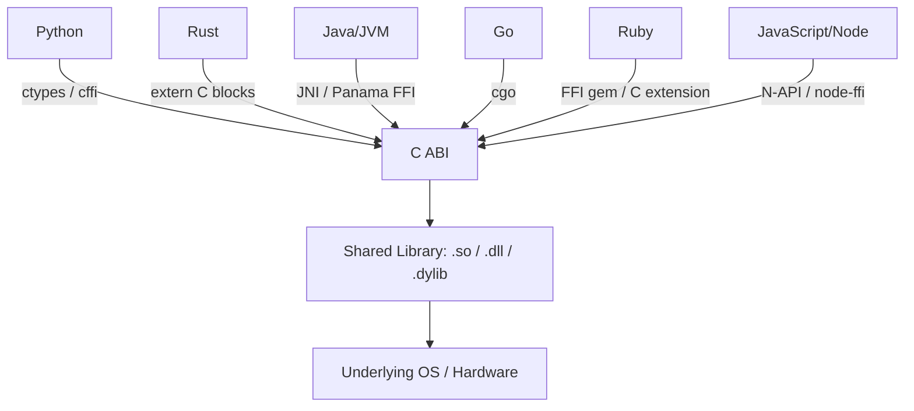
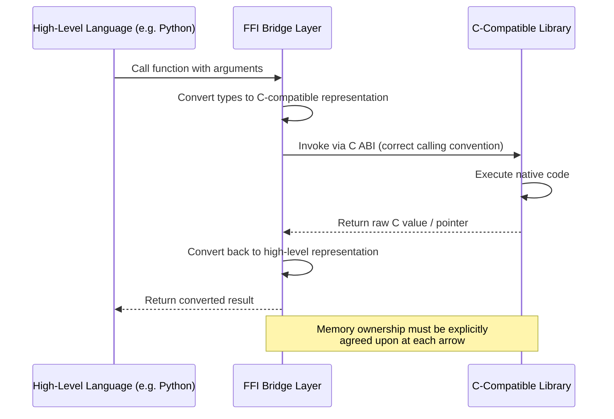

## Foreign Function Interfaces

### Overview

A **Foreign Function Interface (FFI)** is a mechanism that allows code written in one programming language to call, and be called by, code written in another language. FFIs are the practical glue that lets a high-level scripting language leverage a fast C library, lets a systems language expose functionality to a managed runtime, or lets two independently-developed codebases in different languages interoperate without a full rewrite. Because most operating systems, and most performance-critical libraries, expose a C-compatible **ABI (Application Binary Interface)**, C has become the de facto universal interchange format that most FFIs are built around — even when neither side of the interface is actually written in C.

Understanding FFIs requires understanding two related but distinct concepts: the **API** (the source-level function signatures a language exposes) and the **ABI** (the compiled, binary-level calling convention — how arguments are passed in registers/stack, how the stack is laid out, how return values are structured). FFI mismatches are almost always ABI mismatches, not merely syntactic ones.

### Why C Became the Universal Interface

C's ABI is comparatively simple and stable: fixed-size primitive types, a well-defined calling convention per platform, no runtime metadata (no vtables, no garbage collector, no exception unwinding tables required for interoperability), and no name mangling complications beyond what the compiler applies (which can itself be disabled via `extern "C"` in C++). This simplicity is precisely why FFIs across nearly every language ecosystem converge on "expose/consume a C-compatible interface," rather than each language pair defining a bespoke bridge.



### The Core Problem: Bridging Different Runtime Models

Each language has a distinct **runtime model** — how it manages memory, represents types, handles errors, and executes code — and an FFI must reconcile these differences at the boundary:

| Concern | Typical Challenge at the FFI Boundary |
| --- | --- |
| Memory management | Who owns a pointer passed across the boundary — caller or callee? Who frees it? |
| Type representation | A managed-language string (with length metadata) vs. a C null-terminated `char*` |
| Error handling | Exceptions in one language cannot generally propagate across an FFI boundary safely |
| Garbage collection | GC-managed objects may move in memory; their addresses cannot be safely handed to C without pinning |
| Calling conventions | Argument passing order/location (registers vs. stack) must match exactly between caller and callee |
| Struct layout | Field order, padding, and alignment must match exactly on both sides |

**Behavioral note**: Because FFI correctness depends on precise agreement about memory ownership, type layout, and calling convention, mismatches often do not produce an immediate compile-time or even load-time error — they can manifest as memory corruption, crashes, or silently wrong values that appear only under specific conditions (particular struct sizes, particular platforms, particular optimization levels). This class of bug should be treated as inherently harder to detect than ordinary same-language type errors, and any FFI boundary code deserves correspondingly more careful testing.

### Example: Python Calling C via `ctypes`

Python's standard library `ctypes` module allows calling into compiled shared libraries without writing any C extension code:

```python
import ctypes

# Load a shared library (platform-specific extension: .so, .dylib, .dll)
libm = ctypes.CDLL("libm.so.6")  # standard math library, Linux example

# Declare argument and return types explicitly — ctypes does NOT infer them
libm.sqrt.argtypes = [ctypes.c_double]
libm.sqrt.restype = ctypes.c_double

result = libm.sqrt(16.0)
print(result)  # 4.0
```

Explicitly declaring `argtypes` and `restype` is not optional convenience — without it, `ctypes` assumes `int` arguments and an `int` return type by default, which silently produces incorrect results (or crashes) for any function with a different actual signature. This is a direct illustration of the ABI-matching problem: Python has no way to introspect the true signature of a compiled C function, so the programmer must supply that information manually and correctly.

### Example: C Calling Into a Compiled Rust Library

Rust can expose functions with a C-compatible ABI using the `extern "C"` qualifier and `#[no_mangle]` to prevent Rust's default name-mangling from obscuring the symbol name:

```rust
// lib.rs — compiled as a C-compatible shared/static library

#[no_mangle]
pub extern "C" fn add(a: i32, b: i32) -> i32 {
    a + b
}
```

```c
// main.c — consuming the Rust function from C

#include <stdio.h>

extern int add(int a, int b);  // declares the foreign function's signature

int main(void) {
    int result = add(3, 4);
    printf("Result: %d\n", result);
    return 0;
}
```

`#[no_mangle]` is necessary because Rust, like C++, mangles function names by default (encoding type information into the symbol name to support features like generics and overloading) — without disabling this, the linker would be unable to resolve `add` from the C side, since it would be looking for the literal symbol name `add`, not Rust's mangled equivalent.

### Example: Go Calling C via `cgo`

Go's `cgo` tool allows embedding C code directly alongside Go source and calling it as if it were a Go package:

```go
package main

/*
#include <stdio.h>
#include <stdlib.h>

void greet(const char* name) {
    printf("Hello from C, %s!\n", name);
}
*/
import "C"
import "unsafe"

func main() {
    name := C.CString("Gopher")
    defer C.free(unsafe.Pointer(name))  // C-allocated memory needs manual free
    C.greet(name)
}
```

This example illustrates a common and important FFI pattern: `C.CString` allocates memory using C's allocator, which Go's garbage collector does **not** know about or manage — so the programmer must explicitly `free` it, exactly as in a pure C program, even though the surrounding code is otherwise garbage-collected Go. This is representative of a broader rule: **memory allocated by one side of an FFI boundary should generally be freed by that same side**, using that side's own deallocation mechanism, to avoid mismatched allocator errors.

### Struct Layout and `#[repr(C)]`

When passing structured data (not just primitives) across an FFI boundary, both sides must agree on exact memory layout — field order, padding, and alignment. Languages with their own internal, potentially-optimized layout rules (like Rust, which may reorder struct fields for efficiency by default) must explicitly opt into C-compatible layout:

```rust
#[repr(C)]  // forces C-compatible field ordering and alignment, disabling Rust's optimization freedom
pub struct Point {
    pub x: f64,
    pub y: f64,
}

#[no_mangle]
pub extern "C" fn distance(a: Point, b: Point) -> f64 {
    ((a.x - b.x).powi(2) + (a.y - b.y).powi(2)).sqrt()
}
```

```c
// C side — must declare the struct with matching field order and types
struct Point {
    double x;
    double y;
};

extern double distance(struct Point a, struct Point b);
```

Without `#[repr(C)]`, the Rust compiler is free to reorder `Point`'s fields for its own internal optimization purposes, which would silently produce a struct whose memory layout does not match what the C side expects — a class of bug that can be extremely difficult to diagnose, since it may work correctly for some struct shapes and fail only for others depending on the compiler's internal layout decisions.

### FFI Data Flow and Ownership Diagram



### Java/JVM: JNI and the Newer Panama/FFM API

The Java Native Interface (JNI) has historically been the primary mechanism for JVM languages to call native code, though it is widely regarded as verbose and error-prone due to its manual reference-management requirements and its distinct, JVM-specific calling conventions rather than a direct C ABI mapping.

```java
public class NativeMath {
    static {
        System.loadLibrary("nativemath");  // loads a compiled .so/.dll
    }

    public native int add(int a, int b);  // declares the native method signature

    public static void main(String[] args) {
        NativeMath nm = new NativeMath();
        System.out.println(nm.add(3, 4));
    }
}
```

**[Unverified]** More recent JDK versions have introduced a newer Foreign Function & Memory API (sometimes referred to informally by its incubating project name, "Project Panama") intended to replace JNI with a more direct, less boilerplate-heavy mechanism for calling native code and managing off-heap memory; the exact API surface, stability status (preview vs. finalized), and minimum JDK version required should be verified against current JDK documentation, since this area has continued to evolve across recent JDK release cycles.

### Common FFI Pitfalls

- **Ownership ambiguity**: Neither side knows who is responsible for freeing a passed pointer, leading to double-frees or leaks.
- **Lifetime mismatches**: A pointer to memory that a garbage collector may move or reclaim is handed to native code that assumes a stable address — a class of bug particularly relevant when GC-managed languages call into native code without pinning the memory first.
- **Calling convention mismatches**: Especially relevant on Windows, where `__cdecl` and `__stdcall` differ in stack-cleanup responsibility; declaring the wrong convention on either side can corrupt the stack.
- **String encoding differences**: C's null-terminated `char*` versus length-prefixed strings (common in Rust, Go, many managed languages) versus differing text encodings (UTF-8 vs. UTF-16, the latter common on Windows APIs) require explicit conversion at the boundary.
- **Struct layout drift**: As shown above, any language with its own internal struct-layout optimization must be explicitly told to use C-compatible layout for any type crossing the boundary.
- **Exception/panic propagation**: Rust panics, C++ exceptions, and Java exceptions generally cannot safely unwind across an FFI boundary into a different language's runtime; most language FFI guidance requires catching such conditions at the boundary and converting them into an error code or similar C-compatible failure signal before crossing.

### WebAssembly as a Modern FFI-Adjacent Target

WebAssembly (Wasm) introduces a related but distinct interoperability model: rather than a direct in-process C ABI call, Wasm modules run in a sandboxed linear memory space, and the **Wasm Component Model** / **WASI** interface types are an emerging effort to standardize richer, safer cross-language interfaces than the raw C ABI allows (e.g., safely passing strings and structured data without manual pointer/length bookkeeping at every call site). **[Unverified]** The maturity and adoption level of the Component Model specifically should be verified against current WebAssembly community group documentation, as this area has been under active, evolving standardization.

### When FFI Is (and Isn't) the Right Tool

**FFI is commonly justified when:**

- Reusing a mature, heavily-optimized native library (e.g., a scripting language calling into a C-based numerical or cryptography library) rather than reimplementing it.
- Incrementally migrating a codebase from one language to another, allowing old and new code to coexist and call each other during transition.
- Exposing a systems-language library's functionality to multiple higher-level language ecosystems through one shared C-compatible core.

**FFI introduces costs worth weighing against these benefits:**

- Marshaling overhead: converting data representations at the boundary is not free, and for very fine-grained, frequently-called functions this overhead can dominate.
- Loss of safety guarantees: memory-safe languages (Rust, Swift, Java) generally cannot enforce their safety guarantees across an FFI boundary into unsafe native code — the boundary itself typically requires an `unsafe`-marked or otherwise explicitly trusted region.
- Debugging difficulty: crashes originating in native code often produce less informative stack traces or error messages in the calling high-level language's tooling.
- Build and distribution complexity: shipping a project that depends on a native library adds platform-specific compilation and packaging requirements that a pure-language dependency would not.

### Key Points

- FFIs let code in different languages interoperate, almost universally by converging on a C-compatible ABI as the shared interchange format, due to C's comparatively simple and stable binary interface.
- FFI correctness depends on both sides agreeing precisely on type representation, struct layout, calling convention, and memory ownership — mismatches often manifest as runtime corruption rather than compile-time errors.
- A general ownership rule of thumb is that memory allocated by one side of the boundary should be freed by that same side, using its own allocator, to avoid mismatched-allocator bugs.
- Language-specific mechanisms exist to force C-compatible representations where a language's default internal layout or naming would otherwise be incompatible (e.g., Rust's `#[repr(C)]` and `#[no_mangle]`).
- Exceptions, panics, and garbage-collector-managed memory generally cannot safely cross an FFI boundary unmodified; boundary code typically must convert these into C-compatible error codes or explicitly pin/copy memory first.
- FFI is a deliberate trade-off: it enables reuse of mature native libraries and incremental migration, at the cost of marshaling overhead, reduced safety guarantees at the boundary, and added build/distribution complexity.

### Related Topics

- ABI stability and calling conventions across platforms (`cdecl`, `stdcall`, System V AMD64, ARM AAPCS)
- Memory ownership patterns at FFI boundaries: opaque handles, callback-based cleanup, reference counting across languages
- WebAssembly's Component Model and WASI interface types as an FFI alternative
- Rust's `bindgen` and `cbindgen` tools for automatic FFI binding generation
- Garbage collector interaction with native code: pinning, handles, and GC-safe points
- Python's `cffi` and `PyO3` as alternatives to `ctypes` for native extension development
- Security implications of FFI boundaries: memory-safety guarantees lost at `unsafe`/native crossings