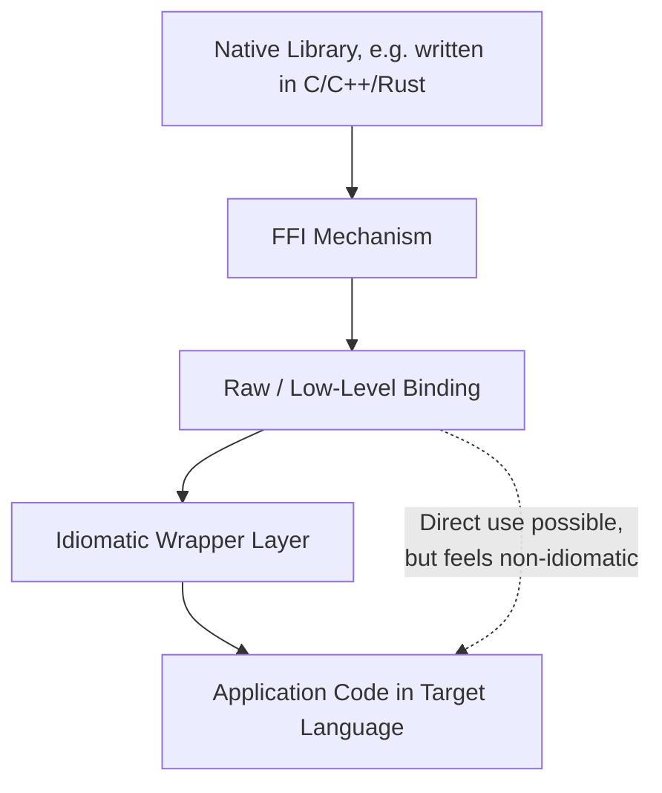
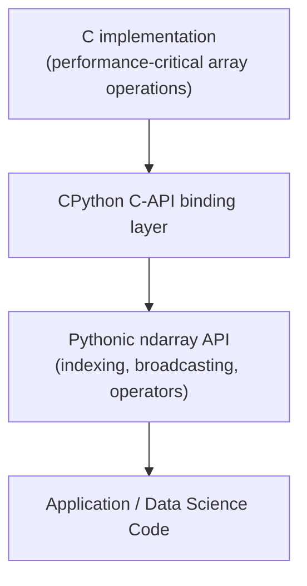

## Language Bindings and Wrappers

### Overview

A **language binding** is a layer of code that exposes a library or system originally written in one language to be usable idiomatically from another language. Where a Foreign Function Interface (FFI) is the low-level *mechanism* that allows one language to call into another's compiled code, a binding is the *product* built on top of that mechanism — a curated, often hand-crafted or generated API surface that lets consumers use a native library without directly handling raw pointers, manual memory management, or C-style calling conventions themselves. Bindings are what most developers actually interact with; the FFI machinery underneath is typically an implementation detail the binding is specifically designed to hide.

The relationship can be summarized simply: **FFI is the bridge; a binding is the building constructed on top of that bridge**, designed to feel native to the language it's built for.

### Bindings vs. Wrappers: A Terminology Distinction

These terms are often used loosely and somewhat interchangeably, but carry a useful distinction in careful usage:

- A **binding** typically refers to the raw, often mechanically-generated mapping of a native library's functions and types into a target language — frequently a fairly direct, low-level translation that still closely mirrors the original library's API shape.
- A **wrapper** typically refers to a higher-level, hand-designed layer built *on top of* raw bindings, reshaping the API to feel idiomatic in the target language (e.g., converting C-style error codes into exceptions or `Result` types, converting manual resource-cleanup calls into RAII/destructors, or replacing verbose function names with more conventional method calls).

**[Inference]** This binding/wrapper distinction is a widely-used convention in developer discourse and library documentation, but is not a strictly standardized or universally-applied terminology — some ecosystems and projects use the terms interchangeably, or apply "binding" to what this section calls a "wrapper," so the specific terminology used by any given project's documentation should be treated as authoritative for that project rather than assumed to match this framing exactly.



### Why Bindings Exist: The Idiomatic Gap

Raw FFI calls typically expose the native library's conventions directly — C-style error codes, manual pointer/memory management, primitive types without richer abstractions. A binding/wrapper closes this "idiomatic gap" so consumers can use the library the way they'd use any other library native to their language.

**Example: raw C-style error handling vs. a wrapped, idiomatic equivalent**

```python
# Raw binding style — mirrors the C library's error-code convention directly
result = lib.parse_config("config.txt")
if result.error_code != 0:
    print(f"Error code: {result.error_code}")
else:
    use_config(result.value)

# Idiomatic wrapper style — converts the C convention into a Pythonic exception
try:
    config = parse_config("config.txt")  # raises ConfigParseError internally
    use_config(config)
except ConfigParseError as e:
    print(f"Failed to parse config: {e}")
```

The wrapper version hides the underlying error-code-checking convention entirely, replacing it with `try`/`except` — the mechanism a Python developer already expects and reaches for by default, rather than requiring them to learn and manually replicate the native library's own error-handling idiom throughout their codebase.

### Generated vs. Hand-Written Bindings

Bindings are produced through two broad approaches, each with distinct trade-offs:

| Approach | Description | Trade-offs |
| --- | --- | --- |
| **Automatically generated** | A tool parses the native library's headers/type definitions and mechanically produces binding code | Fast to produce, stays in sync with library updates, but often low-level and non-idiomatic without further wrapping |
| **Hand-written** | A developer manually designs the binding/wrapper API to be idiomatic | Higher quality API design, better error handling and documentation, but slower to produce and must be manually kept in sync with upstream changes |

Many mature projects use a **hybrid approach**: an automatically generated raw binding layer as a foundation, with a hand-written idiomatic wrapper layered on top — combining the maintainability of generation with the usability of hand-crafted design.

### Example: Rust's `bindgen` for Generating Raw Bindings

`bindgen` is a widely-used Rust tool that parses C/C++ header files and automatically generates corresponding raw Rust FFI declarations, eliminating the error-prone manual work of hand-transcribing function signatures and struct layouts:

```rust
// build.rs — invoked automatically during compilation

fn main() {
    let bindings = bindgen::Builder::default()
        .header("wrapper.h")   // the C header to generate bindings from
        .generate()
        .expect("Unable to generate bindings");

    bindings
        .write_to_file("src/bindings.rs")
        .expect("Couldn't write bindings");
}
```

The generated `bindings.rs` file typically contains raw, direct translations of the C API — correct, but often not idiomatic Rust (e.g., raw pointers instead of references, C-style return codes instead of `Result<T, E>`). Most projects using `bindgen` then write a separate, hand-crafted "safe wrapper" module on top of these raw generated bindings, exposing only the idiomatic, safety-checked API to the rest of the codebase.

### Example: Python's `cffi` vs. Hand-Written C Extensions

Python offers multiple approaches to binding native code, illustrating the generated-vs-hand-written spectrum within a single ecosystem:

```python
# cffi — declarative, closer to "generated binding" in spirit
from cffi import FFI

ffi = FFI()
ffi.cdef("""
    double sqrt(double x);
""")
libm = ffi.dlopen("libm.so.6")
print(libm.sqrt(16.0))  # 4.0
```

```c
// A hand-written CPython C extension (excerpt) — full manual control
// over the Python-facing API, at the cost of significantly more boilerplate
static PyObject* py_sqrt(PyObject* self, PyObject* args) {
    double x;
    if (!PyArg_ParseTuple(args, "d", &x)) {
        return NULL;
    }
    return PyFloat_FromDouble(sqrt(x));
}
```

**[Inference]** In general practitioner usage, `cffi`- and `ctypes`-style approaches are typically favored for quickly wrapping an existing native library with modest binding code, while hand-written C extensions (or higher-level generator tools like `pybind11` for C++) are more often favored when deeper integration with Python's object model, richer type conversions, or maximum performance are required; the right choice depends on the specific library and performance requirements involved rather than one approach being universally superior.

### Example: `pybind11` — A Wrapper-Generation Library for C++

`pybind11` occupies a middle position: it's a C++ header-only library that lets a C++ developer write binding code directly in C++, using template metaprogramming to automatically handle much of the Python/C++ type conversion, rather than requiring raw CPython C-API calls:

```cpp
#include <pybind11/pybind11.h>

int add(int a, int b) {
    return a + b;
}

PYBIND11_MODULE(example, m) {
    m.doc() = "Example module";
    m.def("add", &add, "A function that adds two numbers");
}
```

```python
import example
print(example.add(3, 4))  # 7
```

This is a good illustration of a **wrapper-generation library**: `pybind11` doesn't parse headers automatically like `bindgen`, but it does dramatically reduce the boilerplate a developer would otherwise need to hand-write against the raw CPython C API, occupying a middle ground between fully automatic generation and fully manual wrapping.

### Idiomatic Transformation Patterns Common Across Bindings

Regardless of the specific language pair, well-designed bindings and wrappers tend to apply a recurring set of transformations to make a native API feel natural in the target language:

- **Error codes → exceptions or `Result`/`Option` types**: converting C-style integer return codes into the target language's native error-handling idiom.
- **Manual resource cleanup → RAII/destructors/garbage collection**: wrapping raw handles so that resource cleanup happens automatically according to the target language's own lifetime rules (e.g., a Python object's `__del__`, a C++ destructor, Rust's `Drop` trait), rather than requiring the caller to remember an explicit `close()`/`free()` call.
- **C-style naming conventions → target-language naming conventions**: e.g., converting `snake_case` C function names into `camelCase` methods for a Java binding, or grouping loose C functions into an object-oriented class structure.
- **Raw pointers/buffers → richer native types**: converting a raw `char*` and length into a proper managed string type; converting a raw array pointer into a native list/vector/array type.
- **Global/free functions → methods on objects**: reorganizing a flat C API (where every function takes a handle as its first argument, e.g., `library_do_thing(handle, ...)`) into idiomatic object-oriented or module-based structure (`handle.do_thing(...)`).

### Example: Full Transformation From Raw C Library to Idiomatic Wrapper

```c
// Native C library being wrapped (conceptual)
typedef struct Connection Connection;

Connection* connection_open(const char* host, int port);
int connection_send(Connection* conn, const char* data);
void connection_close(Connection* conn);
```

```python
# Idiomatic Python wrapper built on top of raw ctypes/cffi bindings

class Connection:
    def __init__(self, host: str, port: int):
        self._handle = _lib.connection_open(host.encode(), port)
        if not self._handle:
            raise ConnectionError(f"Could not connect to {host}:{port}")

    def send(self, data: str) -> None:
        result = _lib.connection_send(self._handle, data.encode())
        if result != 0:
            raise IOError("Send failed")

    def close(self) -> None:
        if self._handle:
            _lib.connection_close(self._handle)
            self._handle = None

    def __enter__(self):
        return self

    def __exit__(self, exc_type, exc_val, exc_tb):
        self.close()  # automatic cleanup, Pythonic context-manager idiom

# Usage feels entirely native to Python — no raw handles or manual free() calls visible
with Connection("example.com", 8080) as conn:
    conn.send("Hello, server")
```

Note how the wrapper's `__enter__`/`__exit__` (Python's context-manager protocol) replaces the raw library's manual `connection_close()` call — the underlying C function is still invoked, but the *obligation* to remember calling it has been shifted from every caller of the wrapper into a single, centrally-implemented cleanup path, closely mirroring the same underlying principle behind Rust's `Drop`, C++'s RAII destructors, and Swift's `deinit`.

### Wrapping Layers Across a Real Ecosystem: NumPy as an Example

**[Inference]** NumPy, a widely-used Python numerical computing library, is commonly cited as an illustrative example of the multi-layer binding pattern: its performance-critical inner loops are implemented in C, exposed to Python through a binding layer, with an idiomatic, Pythonic array API (`ndarray`, broadcasting, vectorized operations) layered on top — this general architecture is well documented, though exact internal implementation details have evolved across NumPy versions and should be verified against current NumPy source/documentation for specifics rather than assumed fixed.



### Cross-Language Binding Generators: A Broader Landscape

| Tool/Library | Language Pair | Approach |
| --- | --- | --- |
| `bindgen` | C/C++ → Rust | Automatic, parses headers, generates raw bindings |
| `cbindgen` | Rust → C | Automatic, generates a C header from Rust `extern "C"` code |
| `pybind11` | C++ ↔ Python | Header-only library, hand-written binding code with automatic type conversion |
| SWIG | C/C++ → many languages (Python, Java, C#, Ruby, etc.) | Automatic, interface-file-driven, targets multiple languages from one spec |
| JNA / JNI | C → Java | JNI is manual/low-level; JNA (Java Native Access) is a higher-level, more automatic alternative |
| `cxx` | Rust ↔ C++ | Generates safe bidirectional bindings with compile-time signature verification |
| WebIDL / wasm-bindgen | Rust/C++ → WebAssembly/JavaScript | Generates bindings for calling between Wasm modules and JavaScript |

**[Unverified]** The relative popularity, maintenance status, and feature completeness of these specific tools shifts over time as ecosystems evolve; current adoption levels and any given tool's supported language/version matrix should be verified against its current documentation and repository activity before adopting it for a new project, rather than assumed static.

### Maintenance Burden: The Ongoing Cost of Bindings

A binding is not a one-time artifact — it is an ongoing maintenance commitment, since:

- The underlying native library may change its API across versions, requiring the binding to be regenerated or manually updated to match.
- New target-language versions may deprecate the specific FFI mechanisms the binding relies on.
- Platform-specific binary compatibility (different OSes, CPU architectures) often requires separately-built and tested binding artifacts per target platform.

This ongoing cost is a key factor in deciding whether to depend on an existing community-maintained binding versus writing and maintaining a custom one: a well-maintained, actively-updated community binding generally represents lower long-term cost than a bespoke one only the depending project is responsible for keeping current.

### Key Points

- A binding exposes a native library's functionality to another language; a wrapper (often built atop a raw binding) reshapes that exposure to feel idiomatic in the target language — though the two terms are frequently used loosely and interchangeably in practice.
- Bindings can be automatically generated (fast, stays in sync with the library, but often low-level) or hand-written (idiomatic, better designed, but slower to produce and maintain) — many mature projects combine both approaches in layers.
- Common idiomatic transformations include converting error codes to exceptions/`Result` types, converting manual cleanup calls to RAII/destructor-based cleanup, and reorganizing flat C-style APIs into object-oriented structures.
- Tools like `bindgen`, `pybind11`, and SWIG each occupy different points on the automatic-generation-to-hand-written spectrum, and different points on the raw-binding-to-idiomatic-wrapper spectrum.
- A binding is an ongoing maintenance commitment, not a one-time artifact, since both the native library and the target language's own FFI mechanisms can change over time.
- Well-designed application code typically depends only on the idiomatic wrapper layer, keeping the raw binding and FFI mechanics as an internal implementation detail hidden from the rest of the codebase.

### Related Topics

- Foreign Function Interfaces in depth: ABI compatibility and memory ownership across boundaries
- `bindgen` and `cbindgen` workflows for Rust/C interoperability in detail
- SWIG's interface-file-driven approach to multi-language binding generation
- Designing idiomatic error-handling translation layers across language boundaries
- Versioning and maintaining community-maintained language bindings over time
- WebAssembly bindings for browser/JavaScript interoperability (`wasm-bindgen`, WebIDL)
- Case study: NumPy's C-to-Python binding architecture in depth