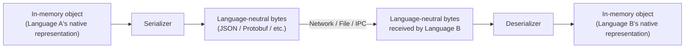
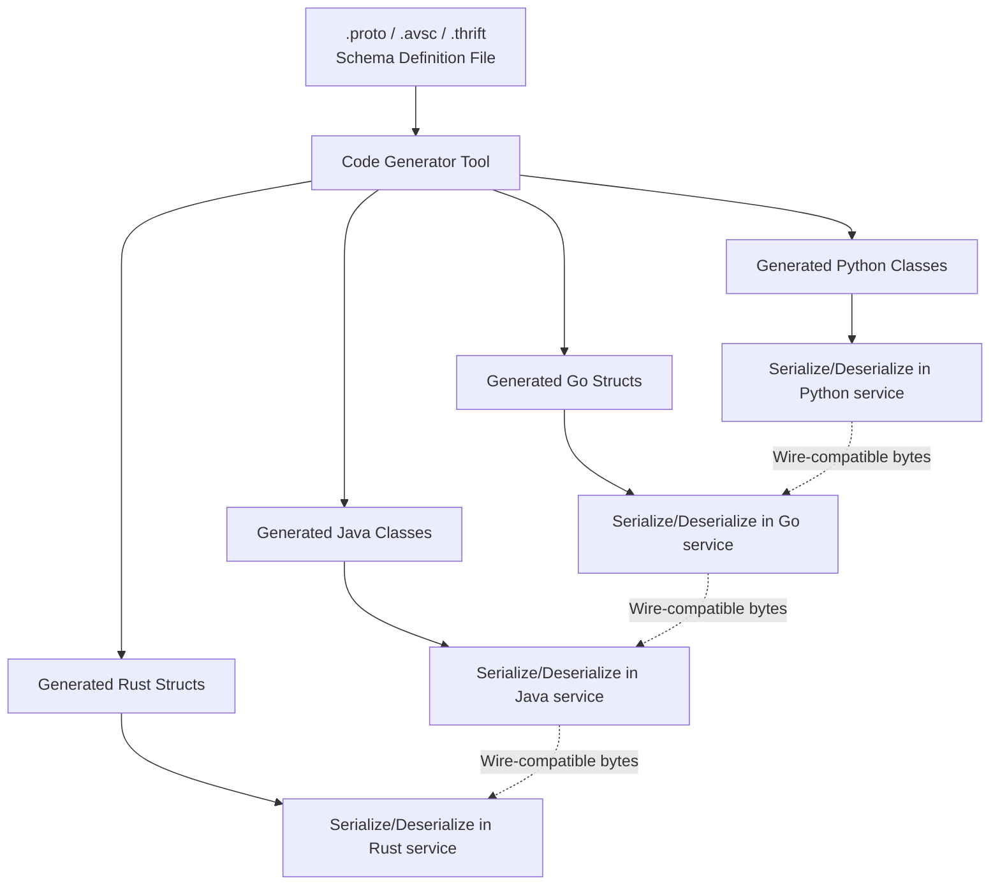

## Cross-Language Data Serialization

### Overview

**Serialization** is the process of converting an in-memory data structure into a format that can be stored, transmitted, or reconstructed later — either by the same program or, in the cross-language case that concerns this topic, by a program written in an entirely different language. **Deserialization** is the reverse process: reconstructing an in-memory structure from that stored/transmitted representation. Cross-language serialization is what allows a Python service to send structured data to a Go service, a JavaScript frontend to consume data produced by a Java backend, or a Rust binary to persist data later read by a C++ program — without either side needing to share source code, memory layout, or even a common runtime.

Where the previous topics in this series (FFI, bindings) concerned making function *calls* across a language boundary within a single running process, serialization concerns moving *data* across a boundary — often across process boundaries, network boundaries, or time (writing now, reading later) — where no shared memory or direct function-call mechanism is available at all.

### The Core Problem: A Shared, Language-Neutral Contract

Every programming language represents data differently in memory — different struct layouts, different string encodings, different handling of optional/nullable fields, different numeric type ranges. Cross-language serialization solves this by defining a **language-neutral schema or format** that any language's serializer/deserializer can independently implement, so long as each side agrees on the same contract.



### Text-Based Formats: Human-Readable, Widely Supported

**JSON (JavaScript Object Notation)** is the dominant text-based, cross-language serialization format, originating from JavaScript's object literal syntax but standardized as a language-independent format supported natively or via libraries in essentially every modern language.

```json
{
  "name": "Alice",
  "age": 30,
  "active": true,
  "tags": ["admin", "verified"],
  "address": null
}
```

```python
import json

data = {"name": "Alice", "age": 30, "active": True}
serialized = json.dumps(data)          # Python dict -> JSON string
restored = json.loads(serialized)       # JSON string -> Python dict
```

```javascript
const data = { name: "Alice", age: 30, active: true };
const serialized = JSON.stringify(data);   // JS object -> JSON string
const restored = JSON.parse(serialized);    // JSON string -> JS object
```

JSON's strengths are human-readability, near-universal language support, and simplicity; its costs are relatively larger message size (verbose text, repeated field names in every record) and the absence of a strictly-enforced schema — a JSON payload's structure is only as consistent as the producing code makes it, since JSON itself does not define or enforce field types or required fields.

**YAML** and **TOML** occupy a similar text-based, human-readable niche, generally favored for configuration files rather than high-throughput data interchange, offering more readable syntax (comments, less punctuation) at the cost of parser complexity relative to JSON.

### Binary Formats: Compact, Fast, Often Schema-Driven

Binary serialization formats trade human-readability for smaller message size and faster parse/serialize performance, and frequently pair with an explicit schema definition that both sides compile against.

**Protocol Buffers (Protobuf)**, developed by Google, is a widely-used schema-driven binary format:

```protobuf
// person.proto — the language-neutral schema definition
syntax = "proto3";

message Person {
    string name = 1;
    int32 age = 2;
    bool active = 3;
    repeated string tags = 4;
}
```

From this single `.proto` schema file, a code generator produces native classes/structs for each target language:

```python
# Generated Python code usage (conceptual)
person = person_pb2.Person(name="Alice", age=30, active=True)
serialized_bytes = person.SerializeToString()

restored = person_pb2.Person()
restored.ParseFromString(serialized_bytes)
```

```go
// Generated Go code usage (conceptual)
person := &pb.Person{Name: "Alice", Age: 30, Active: true}
data, err := proto.Marshal(person)

var restored pb.Person
err = proto.Unmarshal(data, &restored)
```

Because both the Python and Go code above are generated from the *same* `.proto` schema, the two languages are guaranteed to agree on field numbers, types, and encoding — eliminating an entire class of cross-language mismatch bugs that can occur with untyped, schema-less formats like raw JSON, where two independently-written serializers could subtly disagree about field names or types.

### Schema-Driven Serialization Workflow



### Comparison of Common Serialization Formats

| Format | Type | Schema Required | Human-Readable | Typical Use Case |
| --- | --- | --- | --- | --- |
| JSON | Text | No (schema-less) | Yes | Web APIs, config files, logging |
| XML | Text | Optional (XSD/DTD) | Yes | Legacy enterprise systems, document markup |
| Protocol Buffers | Binary | Yes (`.proto`) | No | High-performance RPC (gRPC), microservices |
| Apache Avro | Binary | Yes (schema embedded or referenced) | No | Big data pipelines, schema evolution scenarios |
| Apache Thrift | Binary | Yes (`.thrift`) | No | Cross-language RPC frameworks |
| MessagePack | Binary | No (schema-less) | No | Compact JSON-like binary alternative |
| CBOR | Binary | No (schema-less) | No | IoT/constrained environments, JSON-compatible binary |
| Cap'n Proto | Binary | Yes | No | Zero-copy deserialization, extreme performance needs |

**[Inference]** The choice among these formats generally reflects a trade-off between human-readability/debuggability (favoring JSON) and performance/type-safety/message-size (favoring schema-driven binary formats like Protobuf or Avro); the "correct" choice depends heavily on the specific system's throughput requirements, debugging needs, and existing ecosystem, and should not be treated as a fixed ranking independent of context.

### Schema Evolution: Handling Change Over Time

A central challenge in cross-language serialization is **schema evolution** — how a data format changes over time without breaking compatibility between services that update at different times (a common reality in distributed systems where not every service can be redeployed simultaneously).

Protobuf's approach illustrates common evolution rules:

```protobuf
// Version 1
message Person {
    string name = 1;
    int32 age = 2;
}

// Version 2 — adding a field is backward-compatible
message Person {
    string name = 1;
    int32 age = 2;
    string email = 3;   // new field, old readers simply ignore it
}
```

- **Adding a new field** with a new field number is generally safe: old code deserializing new data simply ignores the unrecognized field; new code deserializing old data gets a default value for the missing field.
- **Removing or renaming a field** (or reusing a field number for a different purpose) is generally unsafe and can cause silent data corruption or misinterpretation, since old and new consumers might disagree about what a given field number means.
- **Changing a field's type** is generally unsafe unless the format's specification explicitly documents that specific type change as compatible (some are, many are not).

**Behavioral note**: The exact compatibility rules (which changes are safe, which are breaking) differ across serialization formats and even across versions of the same format's specification; any specific compatibility claim should be verified against the current documentation for the format and version actually in use, rather than assumed to generalize from one format to another.

### RPC Frameworks Built on Serialization: gRPC

**gRPC**, also developed by Google, layers a full remote-procedure-call framework on top of Protocol Buffers, illustrating how serialization formats are frequently the foundation for higher-level cross-language communication systems rather than an end in themselves:

```protobuf
// service definition — also part of the .proto schema
service Greeter {
    rpc SayHello (HelloRequest) returns (HelloReply);
}

message HelloRequest {
    string name = 1;
}

message HelloReply {
    string message = 1;
}
```

From this single schema, gRPC's code generators produce both the serialization code (as with plain Protobuf) *and* client/server networking stub code in each target language — meaning a Go client can call a Python server's method as though it were a local function call, with Protobuf handling the underlying cross-language data serialization transparently underneath the RPC abstraction.

### Text vs. Binary Trade-off Illustrated

The same data, roughly compared for size and readability across formats:



```
JSON (44 bytes, human-readable):
{"name":"Alice","age":30,"active":true}

Protobuf (approximate, binary — not human-readable):
0x0A 0x05 'Alice' 0x10 0x1E 0x18 0x01
```

**[Unverified]** Exact byte-size comparisons between formats depend heavily on the specific data shape, field name lengths, and format version/configuration used; the general directional claim that schema-driven binary formats produce smaller payloads than schema-less text formats for equivalent data is well-established, but specific percentage or byte-count comparisons should be measured for the actual data and formats in question rather than assumed from a generic example.

### Language-Specific Native Serialization: A Cautionary Contrast

It is worth explicitly distinguishing cross-language formats from **language-native serialization** mechanisms — such as Python's `pickle`, Java's built-in `Serializable` interface, or Ruby's `Marshal` — which serialize objects using that language's own internal representation conventions rather than a language-neutral schema.

```python
import pickle

data = {"name": "Alice", "age": 30}
serialized = pickle.dumps(data)   # Python-specific binary format
restored = pickle.loads(serialized)  # only reliably readable by Python
```

These native mechanisms are generally **not suitable for cross-language interchange** — they are tied to the producing language's internal object model and are frequently version-specific even within that same language. They also carry a well-documented security caveat: deserializing untrusted data with formats like `pickle` can execute arbitrary code as part of the deserialization process itself, since these formats can encode not just data but instructions for reconstructing arbitrary objects, including their initialization logic. Cross-language formats like JSON or Protobuf are comparatively safer in this respect, since deserializing them (correctly implemented) produces only plain data structures, not arbitrary executable behavior — though implementation bugs in any deserializer, cross-language or not, can still introduce vulnerabilities, so this should not be treated as an absolute guarantee independent of the specific library implementation used.

### Serialization and FFI/Bindings: A Complementary Relationship

Cross-language serialization and the FFI/binding mechanisms covered earlier in this series solve related but distinct problems, and are frequently used together in real systems:

| Mechanism | Solves | Typical Scope |
| --- | --- | --- |
| FFI | Calling a function across a language boundary within one process | In-process, same machine, shared memory |
| Bindings/Wrappers | Making that FFI call feel idiomatic in the calling language | In-process, same machine |
| Serialization | Moving data across a boundary with no shared memory | Cross-process, cross-network, cross-time (persisted data) |

A microservices architecture, for example, typically has no FFI relationship between its Python and Go services at all — they run as entirely separate processes, possibly on separate machines — and instead rely purely on serialization (often via gRPC/Protobuf, or JSON over HTTP) to exchange data, since there is no shared memory space for an FFI-style direct function call to operate within.

### Key Points

- Cross-language serialization converts in-memory data into a language-neutral format so programs in different languages, processes, or machines can exchange structured data without sharing memory or source code.
- Text-based formats (JSON, YAML) favor human-readability and universal support; binary formats (Protobuf, Avro, Thrift) favor compact size, parsing speed, and schema-driven type safety, at the cost of readability.
- Schema-driven formats generate native code for each target language from a single shared schema file, guaranteeing agreement on field types and structure across languages — schema-less formats like JSON rely entirely on independently-written serializers agreeing by convention.
- Schema evolution (adding, removing, or changing fields over time) has well-defined but format-specific compatibility rules; adding new fields is commonly safe, while removing or reusing field identifiers commonly is not.
- Language-native serialization mechanisms (Python's `pickle`, Java's `Serializable`) are unsuitable for cross-language interchange and carry documented security risks when deserializing untrusted input, unlike well-implemented cross-language formats.
- Serialization and FFI/bindings solve complementary problems: FFI enables in-process cross-language function calls, while serialization enables cross-process, cross-network, or cross-time data exchange where no shared memory exists.

### Related Topics

- gRPC and Protocol Buffers in depth: service definitions, streaming RPCs, and code generation workflows
- Schema evolution strategies and versioning best practices across Avro, Protobuf, and Thrift
- Security risks of insecure deserialization (`pickle`, Java `Serializable`) and mitigation strategies
- MessagePack, CBOR, and other schema-less binary formats compared to JSON
- Designing versioned, backward-compatible APIs for distributed, multi-language systems
- Apache Avro's schema-embedded approach versus Protobuf's separately-compiled schema approach
- Performance benchmarking methodology for comparing serialization formats in a specific system