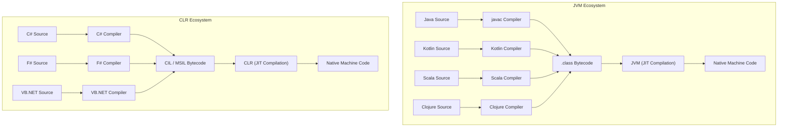
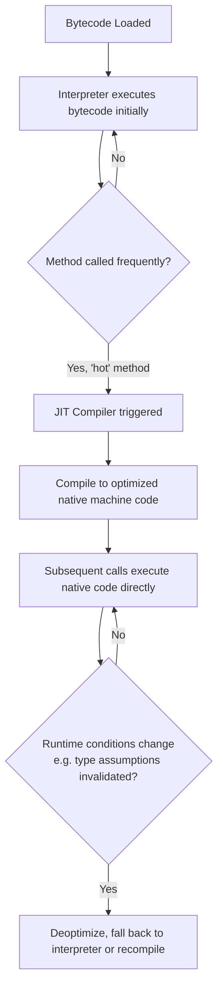

## Virtual Machine Ecosystems: JVM and CLR

### Overview

A **virtual machine (VM)** in this context refers to a **process virtual machine** — a software layer that provides a standardized runtime environment on top of which compiled programs execute, abstracting away the underlying operating system and hardware differences. The two most influential and widely-deployed examples are the **Java Virtual Machine (JVM)**, introduced by Sun Microsystems in 1995 as the runtime for Java, and the **Common Language Runtime (CLR)**, introduced by Microsoft in 2002 as part of the .NET Framework. Both share a foundational design philosophy: compile source code not directly to native machine code, but to an intermediate, platform-neutral **bytecode**, which the VM then interprets or compiles to native code at runtime.

Critically, both the JVM and CLR were explicitly designed from the outset as **multi-language platforms** — not single-language runtimes that happen to be reused, but ecosystems intended to host many source languages compiling to the same intermediate representation, sharing the same runtime services (garbage collection, type system, standard library) regardless of which source language originally produced the bytecode.

### The Bytecode Abstraction

Both ecosystems separate the compilation process into two stages: source language to bytecode, and bytecode to native machine code (the latter typically performed just-in-time, at runtime).



This shared-bytecode design is what enables genuine multi-language interoperability within each ecosystem: a Kotlin class can directly extend a Java class, a C# method can directly call an F# library, because both compile to the same intermediate bytecode format and target the same underlying object model — there is no FFI-style boundary or serialization step required between languages within the same VM ecosystem, unlike the cross-language mechanisms covered earlier in this series.

### JVM Bytecode: `.class` Files

Java source compiles to `.class` files containing JVM bytecode — a stack-based instruction set designed to be compact, verifiable, and platform-independent:

```java
public class HelloWorld {
    public static void main(String[] args) {
        System.out.println("Hello, World!");
    }
}
```

```bash
javac HelloWorld.java    # produces HelloWorld.class (bytecode)
java HelloWorld          # JVM loads and executes the bytecode
```

The resulting `.class` file contains bytecode instructions (`invokevirtual`, `getstatic`, `areturn`, etc.) that are identical regardless of the CPU architecture or operating system running the JVM — the "write once, run anywhere" principle Sun originally marketed Java around, with the JVM itself (not the compiled program) being the platform-specific component that must be built for each target OS/architecture.

### CLR Intermediate Language: CIL/MSIL

The CLR's equivalent intermediate representation is **Common Intermediate Language (CIL)**, also historically called MSIL (Microsoft Intermediate Language):

```csharp
public class HelloWorld
{
    public static void Main(string[] args)
    {
        System.Console.WriteLine("Hello, World!");
    }
}
```

```bash
csc HelloWorld.cs        # produces HelloWorld.exe/.dll containing CIL
dotnet HelloWorld.dll    # CLR loads and JIT-compiles the CIL
```

**[Unverified]** .NET's platform scope has changed substantially since the CLR's original introduction — the original .NET Framework was Windows-only, while the more recent, actively-developed ".NET" (formerly ".NET Core") is cross-platform; the exact current platform support matrix, supported OS versions, and relationship between "CLR" terminology and the modern runtime naming should be verified against current Microsoft documentation, since this area has undergone significant rebranding and architectural change over the platform's history.

### Multi-Language Interoperability Within a VM Ecosystem

Because languages targeting the same VM compile to the same bytecode and share the same underlying type system, cross-language calls within a single ecosystem require no special binding or FFI layer — they work the same way a call between two classes written in the *same* language would:

```kotlin
// Kotlin class
class Greeter {
    fun greet(name: String): String = "Hello, $name!"
}
```

```java
// Java code directly using the Kotlin class — no binding layer needed
public class Main {
    public static void main(String[] args) {
        Greeter greeter = new Greeter();
        System.out.println(greeter.greet("World"));  // works directly
    }
}
```

```fsharp
// F# module
module MathUtils
let square x = x * x
```

```csharp
// C# code directly calling the F# function — same underlying CIL, no binding needed
int result = MathUtils.square(5);
```

This is a fundamentally different interoperability model from the FFI/serialization approaches discussed earlier in this series: rather than crossing a boundary between two entirely separate runtimes (as with Python calling C, or two microservices exchanging Protobuf messages), languages within the same VM ecosystem share one runtime, one garbage collector, one object model, and one set of standard library types.

### Shared Runtime Services

Both the JVM and CLR provide a common set of runtime services to every language targeting them, regardless of source language:

| Service | JVM | CLR |
| --- | --- | --- |
| Memory management | Garbage collector (multiple algorithms: G1, ZGC, Shenandoah, etc.) | Garbage collector (generational, tracing) |
| Type system | Shared object model (`java.lang.Object` root) | Common Type System (CTS), shared `System.Object` root |
| JIT compilation | HotSpot JIT (interpreter + tiered compilation) | RyuJIT (tiered compilation) |
| Exception handling | Shared exception hierarchy (`Throwable`) | Shared exception hierarchy (`System.Exception`) |
| Standard library | Java Class Library, usable from any JVM language | .NET Base Class Library (BCL), usable from any CLR language |
| Threading model | Native OS threads (plus newer lightweight virtual threads) | Native OS threads (plus `Task`-based async model) |

**Behavioral note**: Specific garbage collector algorithms, JIT tiering strategies, and threading primitives available have evolved substantially across JVM and CLR versions over time (for example, newer JVM releases have introduced additional garbage collector options and lightweight concurrency primitives); the specific feature set and default behavior should be verified against the exact runtime version in use rather than assumed constant across releases.

### Major Languages in Each Ecosystem

| JVM Languages | Notable Characteristics |
| --- | --- |
| Java | The JVM's original and most widely-used language; verbose but stable, explicit OOP |
| Kotlin | Designed by JetBrains; more concise syntax, null-safety features, official Android language |
| Scala | Combines object-oriented and functional programming paradigms, strong type inference |
| Clojure | A Lisp dialect emphasizing immutability and functional programming on the JVM |
| Groovy | Dynamically-typed, scripting-oriented, historically popular for build tooling (Gradle) |

| CLR Languages | Notable Characteristics |
| --- | --- |
| C# | The CLR's primary and most widely-used language; general-purpose, modern OOP with functional features |
| F# | A functional-first language on the CLR, influenced by OCaml |
| VB.NET | Evolution of Visual Basic, retained largely for legacy codebase continuity |
| PowerShell | While primarily a shell/scripting environment, built on top of the CLR object model |

### Just-In-Time (JIT) Compilation

Both VMs typically execute bytecode initially via interpretation, then progressively compile "hot" (frequently-executed) code paths to native machine code at runtime — a strategy intended to combine bytecode's portability with performance approaching that of ahead-of-time-compiled native code for the parts of a program that matter most.



**[Inference]** JIT compilation is frequently described as allowing a VM-based language to eventually match or approach native ahead-of-time-compiled language performance for long-running, "warmed up" processes, since the JIT can specialize compiled code based on actual observed runtime type and branch behavior in ways an ahead-of-time compiler working only from static source cannot; however, this comes at the cost of a "warm-up" period during which performance is lower than steady-state, and the specific performance characteristics for any given workload should be benchmarked rather than assumed, since results vary significantly by workload shape and runtime version.

### Ahead-of-Time (AOT) Compilation as an Alternative

Both ecosystems have also developed AOT compilation options — compiling bytecode directly to native machine code before deployment, rather than relying on runtime JIT compilation — primarily to address startup-time and memory-footprint concerns in contexts like serverless functions or containerized microservices, where JIT warm-up cost is comparatively more significant relative to total process lifetime.

**[Unverified]** Specific AOT tooling (such as GraalVM Native Image for the JVM ecosystem, or .NET's Native AOT) has continued to evolve in terms of feature completeness, supported language subsets, and performance characteristics; the current maturity, limitations (such as reduced reflection support common to AOT-compiled managed code), and applicable use cases should be verified against current documentation for the specific tool and version being considered, rather than assumed comparable to standard JIT-based execution in all respects.

### Bytecode Verification and Sandboxing

A historically significant design goal of both VMs, particularly the JVM given its original web-applet distribution model, is **bytecode verification** — the VM checks loaded bytecode for structural validity and type safety *before* execution, rejecting malformed or unsafe bytecode rather than allowing it to run and potentially corrupt memory or violate the VM's safety guarantees.

This verification step is part of why VM-hosted languages can generally offer stronger memory-safety guarantees than languages compiling directly to native machine code without such a runtime check — a buffer overrun or invalid memory access that would be undefined behavior in C is, in a well-implemented JVM or CLR bytecode verifier, either statically rejected at load time or converted into a well-defined runtime exception (such as `IndexOutOfBoundsException`) rather than memory corruption.

### Comparison: VM Ecosystems vs. Native Compilation vs. Interpreted Scripting

| Approach | Examples | Portability | Typical Performance Profile | Memory Safety |
| --- | --- | --- | --- | --- |
| VM bytecode + JIT | Java/Kotlin (JVM), C#/F# (CLR) | High (bytecode is platform-neutral; VM itself is platform-specific) | Near-native after warm-up, GC pauses possible | Enforced by VM (bounds checks, verified bytecode) |
| Native ahead-of-time compilation | C, C++, Rust, Go | Low (binary is platform/architecture-specific) | Consistently high, no warm-up | Language-dependent (C: none; Rust: compile-time enforced) |
| Interpreted scripting | Python, Ruby, PHP (without JIT) | High (source/bytecode-lite is platform-neutral) | Generally lower than JIT/native for CPU-bound work | Enforced by interpreter runtime |

**[Inference]** This table presents general tendencies rather than fixed rules — for instance, some scripting languages have their own JIT-compiling implementations (e.g., PyPy for Python) that substantially change their performance profile relative to a standard interpreter, and specific benchmarked performance for any given workload depends heavily on the exact runtime, version, and code characteristics involved rather than the broad category alone.

### Ecosystem-Level Benefits of the Shared-VM Model

The practical value of the JVM and CLR's multi-language design extends beyond individual interoperability calls, into organizational and ecosystem-level advantages:

- **Gradual language adoption**: A team can introduce Kotlin or F# incrementally alongside an existing Java or C# codebase, since both compile to the same bytecode and can call each other directly, without a rewrite or FFI boundary.
- **Shared tooling investment**: Debuggers, profilers, build tools, and monitoring/observability agents built for the JVM or CLR generally work across all languages targeting that VM, rather than needing separate tooling per source language.
- **Shared library ecosystem**: A library published for one JVM language is generally directly usable from any other JVM language (and similarly for the CLR), rather than requiring separate per-language ports or bindings.

### Key Points

- The JVM and CLR are process virtual machines that compile source languages to a shared, platform-neutral bytecode (JVM bytecode / CIL), executed via a combination of interpretation and just-in-time compilation to native code.
- Both were explicitly designed as multi-language platforms: languages targeting the same VM (Java/Kotlin/Scala/Clojure on the JVM; C#/F#/VB.NET on the CLR) can call each other directly with no FFI or binding layer, since they share one runtime, garbage collector, and object model.
- This differs fundamentally from the FFI and serialization mechanisms discussed earlier in this series, which bridge genuinely separate runtimes; VM ecosystem languages instead share a single runtime by design.
- Bytecode verification allows both VMs to enforce memory-safety guarantees (bounds checking, type safety) at the runtime level, converting what would be undefined behavior in a language like C into well-defined, catchable exceptions.
- JIT compilation trades an initial "warm-up" period for the ability to specialize compiled native code based on actual observed runtime behavior; AOT compilation tooling exists in both ecosystems as an alternative optimized for fast startup and lower memory footprint.
- The shared-VM model provides ecosystem-level benefits beyond individual interoperability: gradual multi-language adoption, shared tooling, and a shared library ecosystem usable across all languages targeting the same VM.

### Related Topics

- Garbage collection algorithms in depth: generational collection, G1, ZGC, and CLR's collector design
- GraalVM and polyglot VM technology: running JVM, JavaScript, Python, and native code within one runtime
- .NET's evolution from Framework to Core to modern .NET, and cross-platform CLR implementations
- JIT compilation internals: tiered compilation, inline caching, and deoptimization
- Kotlin/Java interoperability patterns and null-safety bridging at the JVM boundary
- Comparing WebAssembly to traditional VM bytecode as a portable execution target
- Bytecode verification and the historical Java applet security sandbox model