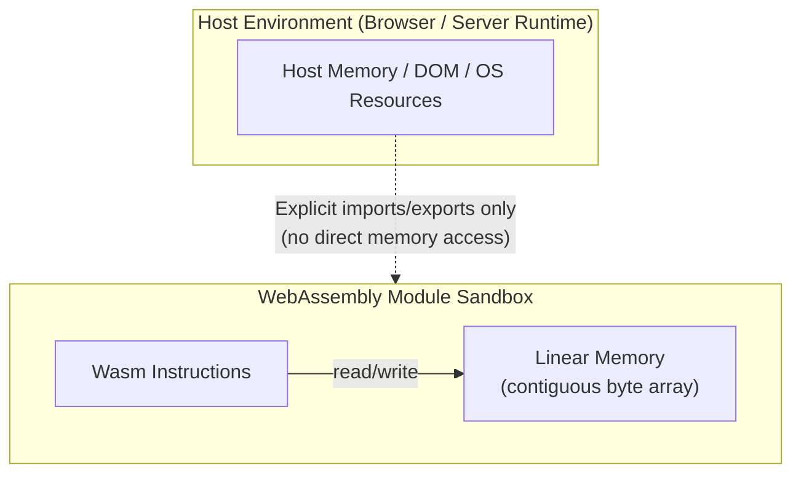
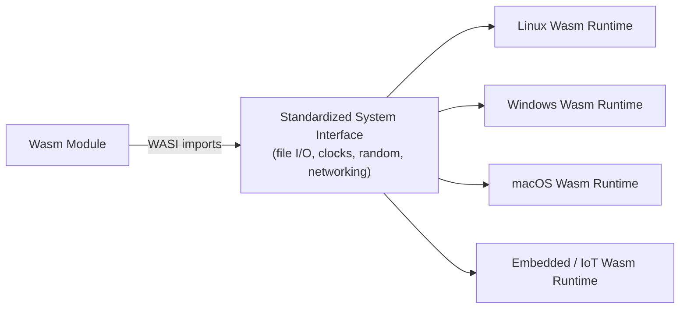

## WebAssembly as a Compilation Target

### Overview

**WebAssembly (Wasm)** is a binary instruction format designed as a portable compilation target for high-level languages, originally created to enable near-native performance for web applications running in the browser, and first reaching a stable, widely-supported 1.0 specification in 2017 through collaboration among Mozilla, Google, Microsoft, and Apple. Unlike the JVM and CLR bytecode formats discussed previously in this series — each historically tied to its own specific runtime and originally designed around one or a small family of source languages — WebAssembly was designed from the outset as a **low-level, language-agnostic compilation target**, intended to be produced by compilers for many existing languages (C, C++, Rust, Go, and others) rather than being paired with a single primary source language of its own.

WebAssembly's core design goals are commonly summarized as: near-native execution speed, a compact binary format suited for fast transmission and loading, a memory-safe sandboxed execution model, and portability across browsers, operating systems, and — increasingly — non-browser environments entirely.

### Why WebAssembly Exists: The Problem It Solves

Before WebAssembly, browsers executed only JavaScript. For computationally intensive tasks (video/audio codecs, games, CAD/3D applications, scientific computing, cryptography), JavaScript's dynamically-typed, garbage-collected execution model imposed performance ceilings that were difficult to overcome purely through JIT optimization, and offered no practical path for reusing the vast existing ecosystem of performance-critical C/C++ libraries in a web context.

WebAssembly addresses this by providing a **low-level virtual instruction set** — closer in spirit to a portable assembly language than to a high-level bytecode like JVM bytecode — that compilers for existing systems languages could target directly, allowing that existing native code to run in the browser sandbox at speeds much closer to native execution than an interpreted or even JIT-compiled JavaScript equivalent.

```mermaid
flowchart TD
    A[C/C++ Source] -->|Emscripten| W[WebAssembly .wasm Binary]
    B[Rust Source] -->|wasm-pack / rustc target| W
    C[Go Source] -->|GOOS=js GOARCH=wasm| W
    D[AssemblyScript TS-like| -->|asc compiler| W
    E[Swift Source] -->|SwiftWasm toolchain| W

    W --> F[Browser Wasm Runtime]
    W --> G[Server-side Wasm Runtime<br/>Wasmtime, Wasmer, etc.]
    W --> H[Edge / Serverless Platform]
```

### Basic Example: Compiling C to WebAssembly

Using Emscripten, one of the earliest and most widely-used C/C++-to-WebAssembly toolchains:

```c
// add.c
int add(int a, int b) {
    return a + b;
}
```

```bash
emcc add.c -o add.js -s EXPORTED_FUNCTIONS='["_add"]' -s MODULARIZE=1
```

```javascript
// Using the compiled module from JavaScript
const Module = require('./add.js');

Module().then((instance) => {
    const result = instance._add(3, 4);
    console.log(result);  // 7
});
```

This pattern is conceptually similar to the FFI mechanisms discussed earlier in this series — JavaScript is calling into compiled, non-JavaScript code — but rather than calling into a native shared library via an OS-level ABI, it is calling into a WebAssembly module running inside the browser's sandboxed Wasm runtime, with the browser itself mediating the boundary rather than the operating system's dynamic linker.

### Example: Rust Compiled to WebAssembly

Rust has particularly strong WebAssembly tooling support via `wasm-pack` and the `wasm-bindgen` crate, which — echoing the bindings/wrappers topic covered earlier — automatically generates idiomatic JavaScript-facing bindings from Rust code:

```rust
use wasm_bindgen::prelude::*;

#[wasm_bindgen]
pub fn fibonacci(n: u32) -> u64 {
    match n {
        0 => 0,
        1 => 1,
        _ => {
            let (mut a, mut b) = (0u64, 1u64);
            for _ in 2..=n {
                let (next_a, next_b) = (b, a + b);
                a = next_a;
                b = next_b;
            }
            b
        }
    }
}
```

```javascript
import init, { fibonacci } from './pkg/my_wasm_module.js';

async function run() {
    await init();
    console.log(fibonacci(20));  // 6765
}
run();
```

`wasm-bindgen` here plays a role directly analogous to `pybind11` or `bindgen` from the earlier bindings discussion: it automatically generates the JavaScript-facing "glue" code handling type conversion (Rust's `u32`/`u64` to JavaScript numbers, in this case), so the Rust function can be called from JavaScript as though it were a native JavaScript function, without the caller needing to manually manage the underlying Wasm memory or calling convention.

### The Wasm Execution Model: Linear Memory and Sandboxing

A defining architectural feature of WebAssembly is its **linear memory model**: each Wasm module operates within a single, contiguous, sandboxed block of memory (represented as a resizable byte array), which the module can read and write via explicit load/store instructions, but which is entirely isolated from the host environment's own memory unless explicitly exposed through defined import/export interfaces.



This sandboxing is a core safety property, not an incidental implementation detail: a WebAssembly module — even one compiled from a memory-unsafe language like C — **cannot** read or write arbitrary host memory, call arbitrary host system calls, or escape its linear memory region, because the Wasm instruction set itself provides no instructions capable of doing so. Any interaction with the outside world (DOM manipulation, file access, network calls) must go through explicitly defined and host-provided import functions, which the embedding environment controls entirely.

**Behavioral note**: This sandboxing means a C program with a buffer overflow, when compiled to WebAssembly, will typically corrupt memory only *within* its own linear memory region (potentially still causing incorrect behavior of the program itself), rather than being able to compromise the host system directly — this containment property should be understood as a boundary the *WebAssembly runtime* enforces, not a guarantee that the compiled program's own internal logic becomes memory-safe; bugs within the sandboxed program itself are not eliminated by Wasm's sandboxing, only their potential to affect the host outside that sandbox.

### WASI: WebAssembly Beyond the Browser

While WebAssembly originated as a browser technology, its sandboxing and portability properties have driven substantial adoption outside the browser entirely, formalized through the **WebAssembly System Interface (WASI)** — a standardized set of system-call-like interfaces (file access, environment variables, networking) allowing Wasm modules to interact with a host system in a portable, capability-based, and controlled way, independent of any particular operating system's native API.



**[Unverified]** WASI itself has continued to evolve across preview versions (commonly referenced as "WASI Preview 1" and "WASI Preview 2," moving toward the broader WebAssembly Component Model), with differing levels of feature completeness, standardization maturity, and runtime support at any given time; the current state of WASI's specification and which runtimes support which version should be verified against current WebAssembly community documentation rather than assumed stable or complete, since this area has been under active, ongoing standardization work.

### Non-Browser Use Cases

The combination of near-native performance, strong sandboxing, fast startup (no OS process creation overhead), and language-agnostic portability has driven WebAssembly adoption in several non-browser contexts:

- **Serverless/edge computing**: Platforms use Wasm modules as a lightweight, fast-starting alternative to full containers for running untrusted or multi-tenant user code, since Wasm's sandboxing provides strong isolation without the overhead of a full OS-level container or VM.
- **Plugin systems**: Applications embed a Wasm runtime to allow third-party plugins to run in a securely sandboxed environment, regardless of what language the plugin was originally written in — a direct alternative to older, less portable, and less securely-sandboxed native plugin mechanisms.
- **Blockchain/smart contracts**: Some blockchain platforms use Wasm as a deterministic, sandboxed execution environment for smart contract code.
- **Cross-platform native applications**: Some projects use Wasm as a portable intermediate compilation target even for non-web desktop/server applications, leveraging its portability guarantees independent of any specific CPU architecture.

**[Inference]** The relative maturity and production-readiness of WebAssembly for each of these non-browser use cases varies considerably — server-side/edge Wasm runtimes and plugin systems are comparatively more established, while some other proposed use cases remain more exploratory; specific adoption levels and production suitability for any particular use case should be evaluated against current, specific project and runtime documentation rather than treated as uniformly mature across all listed categories.

### Comparison: WebAssembly vs. JVM/CLR Bytecode

| Aspect | WebAssembly | JVM Bytecode / CIL |
| --- | --- | --- |
| Abstraction level | Low-level, close to assembly (stack machine, typed but minimal) | Higher-level (object references, method dispatch, exceptions built in) |
| Primary original target | Browser sandbox | JVM / CLR runtime |
| Memory model | Explicit linear memory (manual, like C) | Managed object heap with garbage collection |
| Language design assumption | Language-agnostic from inception | Originally designed around one primary language (Java / C#), later extended |
| Garbage collection | Not built into the core spec (proposals exist to add native GC support) | Built into the runtime as a core service |
| Typical source languages | C, C++, Rust, Go, and others compiling to a low-level target | Languages designed for or adapted to a managed, object-oriented runtime |

**[Unverified]** WebAssembly's support for languages with their own garbage collectors (such as compiling Java or Kotlin directly to Wasm with native GC support, rather than via a separate embedded interpreter) has been an area of active proposal and development (commonly referenced as the "Wasm GC" proposal); the current standardization and runtime support status for this capability should be verified against current WebAssembly specification documentation, since garbage-collected-language support was historically more limited than for languages like C, C++, and Rust with more explicit, non-GC memory models.

### Interfacing with JavaScript: A Data Serialization Consideration

Because WebAssembly's linear memory model does not natively understand JavaScript's object model (strings, objects, arrays), passing anything beyond simple numeric types between JavaScript and Wasm requires an explicit conversion step — conceptually similar to the cross-language serialization concerns discussed earlier in this series, though operating within a single browser process rather than across a network:

```javascript
// Passing a string to Wasm requires manual encoding into linear memory
const encoder = new TextEncoder();
const bytes = encoder.encode("Hello, Wasm!");

const memory = wasmInstance.exports.memory;
const ptr = wasmInstance.exports.allocate(bytes.length);
new Uint8Array(memory.buffer, ptr, bytes.length).set(bytes);

wasmInstance.exports.process_string(ptr, bytes.length);
```

Tools like `wasm-bindgen` (shown earlier) and Emscripten's binding generators exist specifically to automate this manual memory-marshaling process, generating the necessary encoding/decoding glue code automatically — directly paralleling the role FFI binding-generation tools play for native code, applied instead to the Wasm/JavaScript boundary.

### Performance Characteristics

**[Inference]** WebAssembly execution performance is commonly described as approaching, but not always exactly matching, native ahead-of-time-compiled code performance, since Wasm still requires a compilation step (either ahead-of-time or just-in-time, depending on the runtime) from the Wasm binary format to actual native machine instructions, and does not provide every low-level optimization opportunity (such as certain CPU-specific vectorized instructions) equally across all runtimes and versions; specific performance figures for any given workload should be benchmarked against the actual runtime and Wasm compiler toolchain in use rather than assumed to universally match native performance, since real-world results vary by workload and by which Wasm runtime executes the code.

### Key Points

- WebAssembly is a low-level, binary, language-agnostic compilation target — unlike JVM bytecode or CIL, it was not designed around any single primary source language, but as a portable target for many existing compiled languages.
- Its linear memory model and strict sandboxing mean Wasm modules cannot access host memory or system resources except through explicitly defined import/export interfaces, providing strong isolation even for code compiled from memory-unsafe languages like C.
- WASI extends WebAssembly's portability and sandboxing benefits beyond the browser, standardizing system-interface access for server-side, edge, and plugin-system use cases.
- Compared to JVM/CLR bytecode, WebAssembly operates at a lower abstraction level (closer to assembly, explicit memory management) and historically lacked built-in garbage collection support, though this has been an area of active standardization.
- Passing complex data types (strings, objects) between JavaScript and WebAssembly requires explicit memory marshaling, a concern directly analogous to cross-language serialization and FFI binding generation discussed earlier in this series.
- WebAssembly's combination of sandboxing, portability, and near-native performance has driven adoption well beyond its original browser use case, into serverless computing, plugin systems, and other contexts requiring secure, portable, language-agnostic code execution.

### Related Topics

- The WebAssembly Component Model and interface types for richer cross-language data exchange
- WASI Preview 2 and the standardization of system interfaces beyond the browser
- Wasm GC proposal and its implications for compiling garbage-collected languages to WebAssembly
- Server-side Wasm runtimes in depth: Wasmtime, Wasmer, and their sandboxing/performance trade-offs
- `wasm-bindgen` and Emscripten binding generation compared in detail
- WebAssembly's role in plugin architectures and multi-tenant serverless platforms
- SIMD and threading proposals for WebAssembly performance beyond the original 1.0 specification