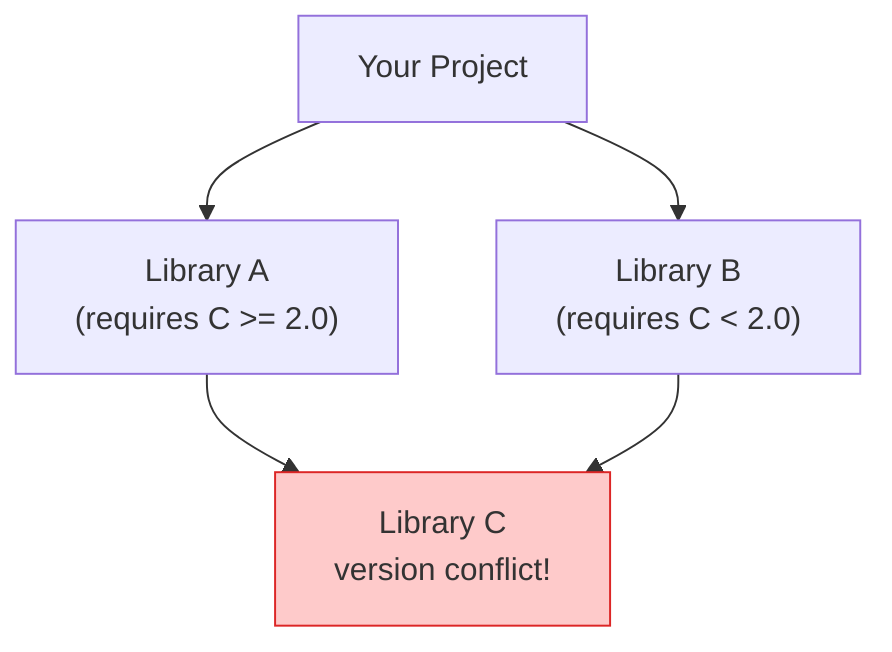
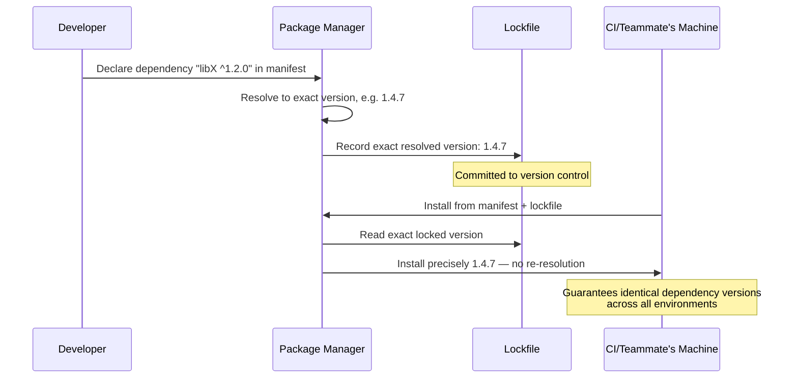

## Package Management Across Language Ecosystems

### Overview


A **package manager** is a tool that automates the process of installing, upgrading, configuring, and removing software libraries and their dependencies for a given programming language or platform. Every major language ecosystem discussed throughout this series — PHP's Composer, Rust's Cargo, Go's module system, C/C++'s more fragmented landscape — has converged on broadly similar solutions to a shared underlying problem: how to let a developer declare "my project depends on library X, version Y" and have that dependency (and everything *it* depends on, transitively) reliably, reproducibly installed, without manual download-and-configure steps.

Comparing package managers across ecosystems reveals both a common core problem (dependency resolution, versioning, distribution) and substantial divergence in how each ecosystem has chosen to solve it — divergence often rooted in each language's historical circumstances, compilation model, and community priorities.

### The Core Problem: Dependency Resolution

At the heart of every package manager is the **dependency resolution problem**: given a project that depends on library A (which requires library C version ≥2.0) and library B (which requires library C version <2.0), can a single, mutually-compatible set of package versions be found that satisfies every stated constraint simultaneously? This is a form of constraint satisfaction that becomes increasingly complex as a dependency graph grows, since transitive dependencies (dependencies of dependencies) can conflict in ways not visible from a project's direct dependency list alone.



Different package managers resolve such conflicts differently: some fail outright and require manual intervention, some allow multiple versions of the same library to coexist within a single dependency tree (isolated from each other), and some use increasingly sophisticated constraint-solving algorithms (similar in spirit to SAT solvers) to find a satisfying version combination automatically wherever one exists.

### Semantic Versioning as a Shared Convention

Most modern package managers, across nearly every language ecosystem, rely on **Semantic Versioning (SemVer)** — a widely-adopted (though not universally enforced) convention for structuring version numbers as `MAJOR.MINOR.PATCH`, where:

- **MAJOR** version increments signal breaking/incompatible API changes.
- **MINOR** version increments signal backward-compatible new functionality.
- **PATCH** version increments signal backward-compatible bug fixes.



```
1.4.2
│ │ └── Patch: bug fixes, no API changes
│ └──── Minor: new features, backward-compatible
└────── Major: breaking changes
```

This shared convention is what allows dependency-constraint syntax like `^1.4.2` (compatible with any `1.x.y` version ≥1.4.2, common in npm) or `~> 1.4` (similar intent, common in Ruby's Bundler) to have broadly consistent meaning across otherwise unrelated package ecosystems — a project can declare it accepts any non-breaking update automatically, trusting that the package author correctly incremented the major version for any actually-breaking change.

**[Inference]** SemVer is best understood as a widely-followed *social convention and discipline* enforced by package-author diligence and community expectation, not a technical guarantee any package manager can automatically verify — a package author can mislabel a breaking change as a minor version bump, and no tooling can universally detect this in advance; the reliability of SemVer-based automatic updates therefore depends significantly on the specific ecosystem's cultural rigor around the convention, which is not identical across all language communities.

### Comparative Survey of Major Package Managers

| Ecosystem | Package Manager | Manifest File | Registry | Lockfile |
| --- | --- | --- | --- | --- |
| PHP | Composer | `composer.json` | Packagist | `composer.lock` |
| JavaScript/Node | npm / Yarn / pnpm | `package.json` | npm registry | `package-lock.json` / `yarn.lock` |
| Python | pip (+ Poetry / uv) | `requirements.txt` / `pyproject.toml` | PyPI | `poetry.lock` / varies |
| Rust | Cargo | `Cargo.toml` | crates.io | `Cargo.lock` |
| Go | Go Modules | `go.mod` | Module proxy (proxy.golang.org) | `go.sum` |
| Ruby | Bundler / RubyGems | `Gemfile` | RubyGems.org | `Gemfile.lock` |
| Java | Maven / Gradle | `pom.xml` / `build.gradle` | Maven Central | Implicit via resolved versions |
| C#/.NET | NuGet | `.csproj` / `packages.config` | NuGet.org | `packages.lock.json` (optional) |
| C/C++ | Historically fragmented (vcpkg, Conan, system package managers) | Varies (`vcpkg.json`, `conanfile.txt`) | Varies by tool | Varies by tool |

### The Lockfile: Reproducibility Across Environments

A **lockfile** records the exact, fully-resolved version of every dependency (direct and transitive) that was actually installed at a given point in time — distinct from the manifest file, which typically records only the *constraints* a project declares (e.g., "any 1.x version") rather than the exact version resolved.



This solves a specific reproducibility problem: without a lockfile, two different installs of the same manifest (declaring `"libX": "^1.2.0"`) performed at different times could resolve to different actual versions if newer compatible releases were published between installs — potentially introducing subtle behavioral differences (or bugs) between a developer's machine, a CI pipeline, and a production deployment, even though the manifest file itself never changed. Lockfiles pin the resolution exactly, so every environment installs identical versions until the lockfile is deliberately regenerated.

### Centralized vs. Decentralized Registries

Package ecosystems differ in how packages are discovered and distributed:

- **Centralized registry model** (npm, PyPI, crates.io, Packagist, RubyGems, Maven Central, NuGet): a single, canonical, language-specific hosting service where package authors publish, and package managers fetch from by default. This model offers strong discoverability and a single point of trust/verification, but also represents a single point of failure and a concentrated target for supply-chain attacks.
- **Decentralized/source-based model**: some ecosystems (notably parts of the Go and C/C++ worlds) instead resolve dependencies directly from version-control source repositories (e.g., a `go.mod` file referencing a specific GitHub repository and commit/tag) rather than requiring publication to a separate centralized package registry.

```go
// go.mod — Go's module system references source repositories directly
module myproject

go 1.22

require (
    github.com/gorilla/mux v1.8.1
    golang.org/x/crypto v0.21.0
)
```

**[Inference]** The trade-offs between centralized and decentralized package distribution are genuinely debated within language-design and developer-tooling communities: centralized registries generally offer easier discovery, more consistent metadata, and centralized points for security scanning/takedown, while decentralized source-based approaches reduce reliance on a single third-party service's continued availability and trustworthiness; neither approach is universally superior, and specific ecosystems have made different choices reflecting different priorities at the time of their design.

### C/C++: The Historically Fragmented Case

Unlike most languages surveyed in this series, C and C++ did not have a single dominant, officially-endorsed package manager for most of their history — a direct consequence of C's minimalist design philosophy (covered earlier in this series) not extending to standardized dependency or build tooling at the language level itself. Instead, the ecosystem relied on a patchwork of approaches:

- **System package managers** (`apt`, `yum`, `brew`, `pacman`) installing shared C/C++ libraries at the OS level, outside any language-specific tool.
- **Vendored/bundled source code**, where a project simply copies a dependency's source directly into its own repository.
- **Build-system-integrated dependency fetching** (e.g., CMake's `FetchContent`).
- More recently, dedicated cross-platform C/C++ package managers such as **vcpkg** (Microsoft) and **Conan**, which have gained substantial adoption as an attempt to bring npm/Cargo-style dependency management to C/C++.

```json
// vcpkg.json — a more modern, manifest-based approach for C/C++
{
    "name": "myproject",
    "version": "1.0.0",
    "dependencies": [
        "fmt",
        "boost-asio",
        { "name": "openssl", "version>=": "3.0.0" }
    ]
}
```

**[Unverified]** The relative adoption levels of vcpkg, Conan, and other C/C++ dependency-management approaches continue to shift, and neither has achieved the near-universal, singular-default status that Cargo holds for Rust or npm holds for JavaScript; current adoption trends and any given tool's feature completeness should be verified against current community surveys and documentation rather than assumed settled, since this remains a comparatively less consolidated area of the C/C++ ecosystem relative to newer languages.

### Security Considerations: Supply-Chain Risk

Centralized package registries, combined with the deeply transitive nature of modern dependency trees (a single direct dependency can pull in dozens or hundreds of transitive dependencies), create a well-documented **software supply-chain attack surface**: a compromised or maliciously-published package can be pulled into thousands of downstream projects automatically, particularly under permissive versioning constraints that auto-accept new compatible releases.

Common mitigations adopted across ecosystems include:

- **Lockfiles** (discussed above), which prevent silent automatic adoption of a newly-published, potentially-compromised version.
- **Checksum/integrity verification**, where the package manager verifies a downloaded package's cryptographic hash matches an expected value recorded in the lockfile, detecting tampering or registry compromise.
- **Provenance and signing initiatives**, where package publishers cryptographically sign releases, allowing consumers to verify a package genuinely originated from its claimed author.
- **Minimal/vetted dependency practices**, an organizational rather than tooling-level mitigation, where teams deliberately limit transitive dependency sprawl and audit new dependencies before adoption.

**[Unverified]** The specific security tooling and provenance standards available (e.g., signing schemes, vulnerability-scanning integration) differ significantly across package ecosystems and continue to evolve; the current state of any particular ecosystem's supply-chain security tooling should be verified against that ecosystem's current documentation and security advisories rather than assumed uniform across languages.

### Monorepo and Workspace Support

Many modern package managers have added explicit support for **workspaces** or **monorepos** — a single repository containing multiple related packages that depend on one another — allowing local, in-repository packages to be linked directly during development without requiring publication to a remote registry for each internal change:

```json
// package.json — npm/Yarn workspace example
{
    "name": "my-monorepo",
    "workspaces": ["packages/*"]
}
```

```toml
# Cargo.toml — Rust workspace example
[workspace]
members = ["core", "cli", "server"]
```

This reflects a convergent, cross-ecosystem recognition that dependency management needs differ meaningfully between "installing an external, independently-versioned library" and "coordinating multiple packages developed together within one organization" — a distinction most mature package managers have eventually addressed, even though it was often not part of their original design.

### Comparative Philosophy: Convention Strength Across Ecosystems

**[Inference]** Package ecosystems differ noticeably in how strongly their tooling enforces (versus merely permits) particular practices — for example, Rust's Cargo and Go's module system are often described as having comparatively strong, centrally-designed conventions with limited fragmentation (largely because both tools were introduced as an integral, official part of their respective languages from a relatively early stage), while JavaScript's ecosystem (npm, Yarn, pnpm existing as competing, only partially-compatible tools) and Python's ecosystem (pip, Poetry, uv, Pipenv, and others coexisting) are often described as more fragmented, partly as a consequence of package management tooling emerging more gradually and from multiple independent community efforts over each language's history. This characterization reflects common practitioner discussion rather than a strict, objectively-measured ranking, and specific fragmentation levels shift over time as tools gain or lose relative adoption.

### Key Points

- Every major language ecosystem's package manager solves the same core problem — dependency resolution across a potentially conflicting, transitive dependency graph — despite substantial differences in specific tooling, registry model, and manifest format.
- Semantic Versioning is a widely-adopted but socially-enforced (not technically guaranteed) convention underlying most compatible-version-range dependency declarations across ecosystems.
- Lockfiles solve the reproducibility problem of ensuring identical dependency versions are installed across different environments and times, distinct from the manifest file's looser version constraints.
- Package distribution models split between centralized registries (npm, PyPI, crates.io) and decentralized, source-repository-based resolution (notably Go), each with different trust, discoverability, and single-point-of-failure trade-offs.
- C/C++ historically lacked a single dominant package manager due to the language's minimalist design philosophy not extending to standardized dependency tooling, relying instead on a fragmented mix of system package managers, vendored source, and more recent tools like vcpkg and Conan.
- Supply-chain security (checksum verification, lockfiles, package signing) has become an increasingly central concern across all package ecosystems, given how deeply transitive dependency trees can propagate a single compromised package to many downstream consumers.

### Related Topics

- Dependency resolution algorithms in depth (SAT-solver-based resolvers vs. simpler heuristic approaches)
- Software supply-chain security: package signing, provenance (SLSA), and vulnerability scanning tooling
- Monorepo tooling and workspace dependency management across ecosystems (Nx, Turborepo, Cargo workspaces)
- Semantic Versioning in practice: common violations and automated compatibility-checking tools
- Comparing npm, Yarn, and pnpm's differing approaches to the same JavaScript ecosystem problem
- vcpkg vs. Conan: a detailed comparison of modern C/C++ dependency management approaches
- Private/internal package registries and enterprise dependency governance practices