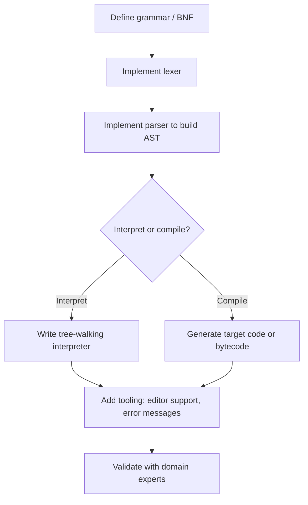

## Internal versus External DSLs

### Definition and Core Distinction

A domain-specific language (DSL) is a language specialized to a particular problem domain, in contrast to a general-purpose programming language (GPL) that is designed for a broad range of tasks. DSLs are typically classified into two categories based on how they are implemented and syntactically expressed: **internal** (also called embedded) DSLs and **external** (also called standalone) DSLs.

An internal DSL is built as a layer on top of an existing host language, reusing that host's parser, compiler or interpreter, and often its type system. An external DSL is a completely separate language with its own custom syntax, requiring a dedicated parser, lexer, and often a dedicated interpreter or compiler.

### Internal DSLs

**Key Points**

- Also called embedded DSLs (EDSLs).
- Written using the syntax and constructs of a host general-purpose language.
- Leverages the host language's existing toolchain: parser, compiler, debugger, editor/IDE support.
- Common in languages with flexible syntax, such as Ruby, Groovy, Scala, Kotlin, Lisp/Clojure, and to a lesser extent Python and JavaScript.

An internal DSL is essentially a carefully designed API or set of conventions in a host language that reads like a specialized language for its domain. Because the host language's compiler processes the DSL code directly, no separate parsing infrastructure is needed. Techniques commonly used to make internal DSLs read naturally include method chaining (fluent interfaces), operator overloading, closures/blocks passed as arguments, and metaprogramming facilities like macros.

**Example**

A build-configuration DSL in Kotlin (used by Gradle's Kotlin DSL) illustrates an internal DSL:

```kotlin
plugins {
    kotlin("jvm") version "1.9.0"
}

dependencies {
    implementation("org.jetbrains.kotlin:kotlin-stdlib")
    testImplementation("junit:junit:4.13.2")
}
```

This code is valid Kotlin. `plugins`, `dependencies`, and `implementation` are ordinary Kotlin functions accepting lambdas with receivers, a language feature that lets the block's body call methods on an implicit receiver object without qualification. The Kotlin compiler parses and type-checks this exactly as it would any other Kotlin file; there is no separate DSL parser.

A Ruby example, similar in spirit to RSpec's testing DSL:

```ruby
describe "Calculator" do
  it "adds two numbers" do
    expect(1 + 1).to eq(2)
  end
end
```

Here `describe` and `it` are regular Ruby methods that accept blocks, and `expect(...).to eq(...)` is a chain of method calls. Ruby's block syntax and permissive method-naming rules make this read close to natural-language specification while remaining plain Ruby underneath.

**Advantages**

- No custom parser or compiler required; the host language toolchain is reused directly.
- Full access to host-language features (variables, loops, conditionals, functions) within the DSL when needed, avoiding the need to reinvent general-purpose constructs.
- Existing IDE support (syntax highlighting, autocompletion, refactoring, debugging) works out of the box or with minimal extension, since the DSL is valid host-language source.
- Easier to evolve incrementally, since it is essentially a library.

**Disadvantages**

- Syntax is constrained by what the host language's grammar permits; domain notation cannot deviate arbitrarily from host-language syntax rules.
- Error messages often reference host-language constructs (e.g., "lambda type mismatch") rather than domain-specific concepts, which can confuse domain experts unfamiliar with the host language.
- Users of the DSL still need at least passing familiarity with the host language's syntax and semantics.
- [Inference] The naturalness of an internal DSL is strongly dependent on the host language's flexibility; languages with rigid syntax (such as Java prior to widespread lambda support) tend to produce more awkward internal DSLs than languages designed with metaprogramming or trailing-closure support in mind.

### External DSLs

**Key Points**

- Also called standalone DSLs.
- Has its own custom grammar, independent of any host language's syntax.
- Requires a dedicated lexer and parser, and typically an interpreter, compiler, or transpiler to translate DSL code into an executable form.
- Common examples include SQL, regular expressions, CSS, YAML-based configuration languages, and build-specification languages like the original (non-Kotlin) Gradle Groovy DSL boundary or Make's syntax.

An external DSL is a language in its own right, syntactically and semantically independent from any general-purpose language. Building one traditionally involves defining a formal grammar (often expressed in Backus–Naur Form or a parser-generator grammar), implementing a lexer to tokenize source text, a parser to build an abstract syntax tree (AST), and a backend that either interprets the AST directly or compiles/transpiles it into another executable form (bytecode, machine code, or source in a GPL).

**Example**

A small external DSL for describing state machines might look like:

```plaintext
state machine TrafficLight {
    state Red -> Green on "timer_expired"
    state Green -> Yellow on "timer_expired"
    state Yellow -> Red on "timer_expired"
    initial Red
}
```

This is not valid syntax in any general-purpose host language; it requires a purpose-built grammar. Implementing it means writing a lexer to recognize tokens like `state`, `machine`, `->`, `on`, and `initial`, a parser that enforces the grammar (e.g., that every `state` transition must specify a source state, target state, and trigger event), and typically code generation that emits an implementation in a GPL (such as Java or C) or a runtime interpreter that executes the state machine directly.

SQL is a widely used, mature external DSL:

```sql
SELECT customer_name, SUM(order_total)
FROM orders
WHERE order_date >= '2026-01-01'
GROUP BY customer_name
HAVING SUM(order_total) > 1000;
```

SQL has its own grammar, keywords, and execution semantics entirely separate from any host GPL, even though it is frequently embedded as strings within GPL source code.

**Advantages**

- Syntax can be designed purely for domain clarity and conciseness, unconstrained by any host language's grammar.
- Can be made accessible to non-programmers (domain experts, analysts, configuration authors) since no general-purpose language knowledge is required.
- Error messages, tooling, and diagnostics can be tailored precisely to domain concepts.
- Easier to enforce domain-specific constraints and validation at the language level (e.g., disallowing unreachable states in a state-machine DSL).

**Disadvantages**

- Requires building and maintaining a parser, and often a compiler/interpreter, which is significantly more implementation effort than an internal DSL.
- Lacks built-in access to general-purpose constructs (loops, functions, variables) unless the language designer explicitly adds them, which risks the DSL growing into an ad hoc, informally specified GPL — a pattern sometimes summarized by Greenspun's Tenth Rule.
- Tooling (editors, debuggers, syntax highlighters) must be built or configured separately, since standard host-language IDEs will not natively understand the new grammar.
- [Inference] The engineering cost of building a robust external DSL — including a complete grammar, useful error recovery, and editor tooling — often exceeds the cost of an equivalent internal DSL, which is why internal DSLs are frequently favored for smaller or short-lived domain needs, while external DSLs are reserved for cases where syntactic freedom or non-programmer accessibility is a hard requirement.

### Comparison

| Aspect | Internal DSL | External DSL |
| --- | --- | --- |
| Syntax freedom | Constrained by host language grammar | Fully custom |
| Implementation effort | Low; reuses host toolchain | High; requires lexer, parser, and backend |
| Tooling (IDE, debugging) | Inherited from host language | Must be built or configured separately |
| Accessibility to non-programmers | Requires host-language familiarity | Can be designed for pure domain readability |
| General-purpose constructs (loops, variables) | Available for free from host language | Must be explicitly designed and implemented |
| Error messages | Often host-language-centric | Can be fully domain-specific |
| Examples | Gradle Kotlin DSL, RSpec, LINQ (C#) | SQL, CSS, regular expressions, YACC grammars |

### Hybrid and Intermediate Approaches

Some systems blend the two categories. A **staged** or **two-level** DSL may present an external-looking syntax to users that is preprocessed or transpiled into an internal DSL construct in a host language, gaining some domain-specific readability while reusing host tooling for the underlying implementation. Language workbenches — tools such as JetBrains MPS or Xtext — are designed specifically to reduce the implementation cost of external DSLs by generating parsers, editors, and IDE support from a grammar specification, narrowing the traditional effort gap between internal and external approaches. [Unverified] The degree to which language workbenches fully close this effort gap in practice varies by project complexity and is not a settled, universally quantified figure.

### Decision Diagram

<svg xmlns="http://www.w3.org/2000/svg" viewBox="0 0 900 460">
<text x="450" y="30" text-anchor="middle" font-size="18" font-weight="bold" fill="#1a1a1a">Choosing Internal vs External DSL (svg_diagram)</text>
<rect x="370" y="55" width="160" height="50" rx="8" fill="#e8eef7" stroke="#3b5b8c" stroke-width="1.5" />
<text x="450" y="85" text-anchor="middle" font-size="13" fill="#1a1a1a">Need a DSL?</text>
<line x1="450" y1="105" x2="450" y2="135" stroke="#555" stroke-width="1.5" />
<polygon points="450,140 445,132 455,132" fill="#555" />
<polygon points="450,140 590,200 450,260 310,200" fill="#fff6e0" stroke="#a8842f" stroke-width="1.5" />
<text x="450" y="196" text-anchor="middle" font-size="12" fill="#1a1a1a">Must be readable</text>
<text x="450" y="212" text-anchor="middle" font-size="12" fill="#1a1a1a">by non-programmers</text>
<text x="450" y="228" text-anchor="middle" font-size="12" fill="#1a1a1a">or need fully custom</text>
<text x="450" y="244" text-anchor="middle" font-size="12" fill="#1a1a1a">syntax/semantics?</text>
<line x1="310" y1="200" x2="150" y2="260" stroke="#555" stroke-width="1.5" />
<text x="205" y="220" font-size="12" fill="#1a1a1a">No</text>
<polygon points="150,260 143,253 153,251" fill="#555" />
<line x1="590" y1="200" x2="750" y2="260" stroke="#555" stroke-width="1.5" />
<text x="700" y="220" font-size="12" fill="#1a1a1a">Yes</text>
<polygon points="750,260 740,251 750,253" fill="#555" />
<rect x="60" y="270" width="200" height="70" rx="8" fill="#e6f5e9" stroke="#2f8c4a" stroke-width="1.5" />
<text x="160" y="298" text-anchor="middle" font-size="13" font-weight="bold" fill="#1a1a1a">Internal DSL</text>
<text x="160" y="316" text-anchor="middle" font-size="11" fill="#1a1a1a">Embed in host language</text>
<text x="160" y="330" text-anchor="middle" font-size="11" fill="#1a1a1a">(e.g., Kotlin, Ruby, Lisp)</text>
<rect x="650" y="270" width="200" height="70" rx="8" fill="#fbe7e7" stroke="#b03a3a" stroke-width="1.5" />
<text x="750" y="298" text-anchor="middle" font-size="13" font-weight="bold" fill="#1a1a1a">External DSL</text>
<text x="750" y="316" text-anchor="middle" font-size="11" fill="#1a1a1a">Build grammar, parser,</text>
<text x="750" y="330" text-anchor="middle" font-size="11" fill="#1a1a1a">and interpreter/compiler</text>
<rect x="30" y="370" width="260" height="70" rx="8" fill="#f0f0f0" stroke="#777" stroke-width="1" />
<text x="160" y="392" text-anchor="middle" font-size="11" fill="#1a1a1a">Low implementation cost,</text>
<text x="160" y="408" text-anchor="middle" font-size="11" fill="#1a1a1a">reuses host tooling,</text>
<text x="160" y="424" text-anchor="middle" font-size="11" fill="#1a1a1a">but syntax is host-constrained</text>
<rect x="620" y="370" width="260" height="70" rx="8" fill="#f0f0f0" stroke="#777" stroke-width="1" />
<text x="750" y="392" text-anchor="middle" font-size="11" fill="#1a1a1a">Higher effort, but maximal</text>
<text x="750" y="408" text-anchor="middle" font-size="11" fill="#1a1a1a">syntactic freedom and</text>
<text x="750" y="424" text-anchor="middle" font-size="11" fill="#1a1a1a">domain-specific tooling</text>
<line x1="160" y1="340" x2="160" y2="370" stroke="#555" stroke-width="1.5" />
<line x1="750" y1="340" x2="750" y2="370" stroke="#555" stroke-width="1.5" />
</svg>

### Implementation Workflow for External DSLs



### Notation Reference

For DSLs concerned with numeric or formal domains, the underlying formal grammar can be summarized in the standard notation:

A context-free grammar $G$ is defined as a 4-tuple:

$$G = (N, \Sigma, P, S)$$

where $N$ is the set of non-terminal symbols, $\Sigma$ is the set of terminal symbols (the DSL's tokens), $P$ is the set of production rules, and $S \in N$ is the start symbol. Both internal and external DSLs are ultimately describable this way, though for an internal DSL, $\Sigma$ and $P$ are inherited wholesale from the host language's own grammar rather than being independently defined.

### Conclusion

The internal-versus-external distinction is fundamentally a trade-off between implementation cost and syntactic freedom. Internal DSLs minimize engineering effort by borrowing a host language's parser, type system, and tooling, at the cost of syntax that must remain valid host-language code. External DSLs allow arbitrary, domain-tailored syntax and can be made accessible to non-programmers, at the cost of building and maintaining a complete language implementation from scratch. Language workbenches and hybrid/staged approaches exist specifically to reduce this cost gap, though the choice ultimately depends on team expertise, target audience, and how far the domain's ideal notation diverges from any available host language's grammar.

**Related Topics**

- Parser generators and lexer generators (e.g., ANTLR, Yacc/Bison, Lex/Flex)
- Language workbenches (JetBrains MPS, Xtext, Spoofax)
- Abstract syntax trees and tree-walking interpreters
- Metaprogramming and macros as internal-DSL enablers (Lisp macros, Rust macros)
- Fluent interfaces and method chaining as a design pattern
- Operator overloading in DSL design
- Grammar formalisms: BNF, EBNF, PEG
- Transpilers and source-to-source compilation
- Greenspun's Tenth Rule and the risks of ad hoc language growth
- Domain modeling and its relationship to DSL design