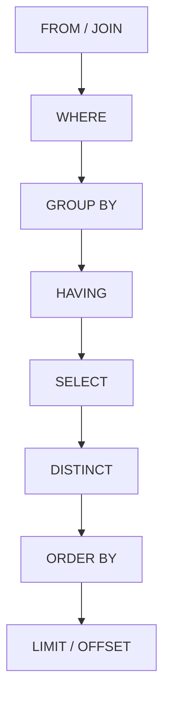

## Query Languages and SQL

### Definition and Purpose

A query language is a specialized language designed to retrieve, filter, and manipulate data held in a data store, most commonly a database. Query languages are a prominent category of external domain-specific language: they have their own grammar, are typically declarative rather than imperative, and are optimized for expressing *what* data is needed rather than *how* to retrieve it step by step. Structured Query Language (SQL) is the most widely used query language, standardized for relational database management systems (RDBMS).

### Declarative versus Imperative Querying

**Key Points**

- SQL is primarily declarative: a query specifies the desired result set, not the retrieval algorithm.
- The database engine's query optimizer determines the actual execution plan (join order, index usage, access paths).
- This contrasts with imperative data access, where a programmer explicitly writes loops, cursors, and conditional logic to traverse records.

In a declarative query, the following statement:

```sql
SELECT name, age FROM employees WHERE department = 'Engineering';
```

expresses only the desired outcome — rows from `employees` where `department` equals `'Engineering'`, projected to the `name` and `age` columns. The database engine independently decides whether to perform a full table scan or use an index on `department`, based on statistics and cost estimation. [Inference] This separation of intent from execution strategy is one of the primary reasons SQL has remained largely stable in surface syntax for decades even as underlying storage engines and optimizers have changed substantially.

### Core SQL Components

SQL is generally divided into sublanguages by function:

**DQL — Data Query Language**

Used to retrieve data. The primary statement is `SELECT`.

```sql
SELECT customer_id, order_total
FROM orders
WHERE order_total > 500
ORDER BY order_total DESC;
```

**DML — Data Manipulation Language**

Used to modify data: `INSERT`, `UPDATE`, `DELETE`.

```sql
INSERT INTO orders (customer_id, order_total, order_date)
VALUES (1042, 799.99, '2026-08-15');

UPDATE orders
SET order_total = 850.00
WHERE order_id = 55231;

DELETE FROM orders
WHERE order_date < '2020-01-01';
```

**DDL — Data Definition Language**

Used to define or alter schema structures: `CREATE`, `ALTER`, `DROP`.

```sql
CREATE TABLE customers (
    customer_id INTEGER PRIMARY KEY,
    name VARCHAR(100) NOT NULL,
    email VARCHAR(255) UNIQUE
);

ALTER TABLE customers ADD COLUMN signup_date DATE;
```

**DCL — Data Control Language**

Used to manage permissions: `GRANT`, `REVOKE`.

```sql
GRANT SELECT, INSERT ON orders TO analyst_role;
REVOKE DELETE ON orders FROM analyst_role;
```

**TCL — Transaction Control Language**

Used to manage transactional boundaries: `BEGIN`, `COMMIT`, `ROLLBACK`.

```sql
BEGIN TRANSACTION;
UPDATE accounts SET balance = balance - 100 WHERE account_id = 1;
UPDATE accounts SET balance = balance + 100 WHERE account_id = 2;
COMMIT;
```

### Relational Algebra Foundations

SQL's theoretical basis is the relational model and relational algebra, formalized by E. F. Codd. Core relational algebra operations map to SQL clauses as follows:

| Relational Algebra Operation | Symbol | SQL Equivalent |
| --- | --- | --- |
| Selection (row filtering) | $\sigma$ | `WHERE` |
| Projection (column selection) | $\pi$ | `SELECT` column list |
| Union | $\cup$ | `UNION` |
| Set difference | $-$ | `EXCEPT` / `MINUS` |
| Cartesian product | $\times$ | `CROSS JOIN` |
| Join | $\bowtie$ | `JOIN ... ON` |
| Rename | $\rho$ | `AS` |

A selection-projection expression in relational algebra:

$$\pi_{name,\ age}(\sigma_{department = 'Engineering'}(employees))$$

corresponds directly to the earlier `SELECT name, age FROM employees WHERE department = 'Engineering'` statement — the projection $\pi$ wraps the selection $\sigma$, mirroring how `SELECT` operates on the filtered result of `WHERE`.

### Joins

**Key Points**

- Joins combine rows from two or more tables based on a related column.
- Common types: `INNER JOIN`, `LEFT (OUTER) JOIN`, `RIGHT (OUTER) JOIN`, `FULL OUTER JOIN`, `CROSS JOIN`.

```sql
SELECT o.order_id, c.name
FROM orders o
INNER JOIN customers c ON o.customer_id = c.customer_id;
```

An `INNER JOIN` returns only rows with matching values in both tables. A `LEFT JOIN` returns all rows from the left table and matched rows from the right table, with `NULL` in right-table columns where no match exists:

```sql
SELECT c.name, o.order_id
FROM customers c
LEFT JOIN orders o ON c.customer_id = o.customer_id;
```

### Join Type Comparison Diagram

<svg xmlns="http://www.w3.org/2000/svg" viewBox="0 0 900 320">
<text x="450" y="28" text-anchor="middle" font-size="18" font-weight="bold" fill="#1a1a1a">SQL Join Types (svg_diagram)</text>
<circle cx="180" cy="150" r="70" fill="#a8c8e8" fill-opacity="0.6" stroke="#3b5b8c" stroke-width="1.5" />
<circle cx="250" cy="150" r="70" fill="#f2c48a" fill-opacity="0.6" stroke="#a8842f" stroke-width="1.5" />
<text x="215" y="235" text-anchor="middle" font-size="12" fill="#1a1a1a">INNER JOIN</text>
<text x="215" y="250" text-anchor="middle" font-size="10" fill="#555">(intersection only)</text>
<circle cx="430" cy="150" r="70" fill="#a8c8e8" stroke="#3b5b8c" stroke-width="1.5" />
<circle cx="500" cy="150" r="70" fill="#f2c48a" fill-opacity="0.35" stroke="#a8842f" stroke-width="1.5" />
<text x="465" y="235" text-anchor="middle" font-size="12" fill="#1a1a1a">LEFT JOIN</text>
<text x="465" y="250" text-anchor="middle" font-size="10" fill="#555">(all of left + matches)</text>
<circle cx="680" cy="150" r="70" fill="#a8c8e8" fill-opacity="0.35" stroke="#3b5b8c" stroke-width="1.5" />
<circle cx="750" cy="150" r="70" fill="#f2c48a" stroke="#a8842f" stroke-width="1.5" />
<text x="715" y="235" text-anchor="middle" font-size="12" fill="#1a1a1a">RIGHT JOIN</text>
<text x="715" y="250" text-anchor="middle" font-size="10" fill="#555">(all of right + matches)</text>
</svg>

### Aggregation and Grouping

```sql
SELECT department, COUNT(*) AS headcount, AVG(salary) AS avg_salary
FROM employees
GROUP BY department
HAVING COUNT(*) > 5
ORDER BY avg_salary DESC;
```

`GROUP BY` partitions rows into groups sharing a common value, aggregate functions (`COUNT`, `SUM`, `AVG`, `MIN`, `MAX`) compute per-group summaries, and `HAVING` filters groups after aggregation — distinct from `WHERE`, which filters individual rows before grouping.

### Query Execution Order

A key conceptual point for SQL learners is that clauses are written in one order but logically executed in another:



This explains why a column alias defined in `SELECT` cannot generally be referenced in the same query's `WHERE` clause: `WHERE` is logically evaluated before `SELECT` runs. [Inference] Understanding this execution order is often the single most useful mental model for debugging unexpected SQL query results, since many apparent "bugs" are actually consequences of clause evaluation order rather than logic errors.

### Subqueries and Common Table Expressions

A subquery nests one query inside another:

```sql
SELECT name
FROM employees
WHERE salary > (SELECT AVG(salary) FROM employees);
```

A Common Table Expression (CTE), introduced with `WITH`, names a temporary result set for readability and potential reuse within a single query:

```sql
WITH high_earners AS (
    SELECT employee_id, salary
    FROM employees
    WHERE salary > 100000
)
SELECT department, COUNT(*)
FROM employees e
JOIN high_earners h ON e.employee_id = h.employee_id
GROUP BY department;
```

Recursive CTEs extend this to hierarchical or graph-like traversal:

```sql
WITH RECURSIVE org_chart AS (
    SELECT employee_id, manager_id, name, 1 AS level
    FROM employees
    WHERE manager_id IS NULL
    UNION ALL
    SELECT e.employee_id, e.manager_id, e.name, oc.level + 1
    FROM employees e
    JOIN org_chart oc ON e.manager_id = oc.employee_id
)
SELECT * FROM org_chart;
```

### Window Functions

Window functions perform calculations across a set of rows related to the current row, without collapsing rows the way `GROUP BY` does.

```sql
SELECT
    name,
    department,
    salary,
    RANK() OVER (PARTITION BY department ORDER BY salary DESC) AS dept_rank
FROM employees;
```

`PARTITION BY` divides rows into windows (here, per department), and `ORDER BY` within `OVER(...)` determines ranking order within each window. Common window functions include `ROW_NUMBER()`, `RANK()`, `DENSE_RANK()`, `LAG()`, `LEAD()`, `SUM() OVER (...)`, and `AVG() OVER (...)`.

### SQL as an External DSL: Design Characteristics

**Key Points**

- SQL has its own dedicated grammar, entirely separate from any general-purpose host language, making it a canonical external DSL.
- It is frequently *embedded* as string literals within GPL source code (Python, Java, JavaScript), which introduces a distinct set of engineering concerns.

Because SQL is typically passed to a database driver as a string, host-language compilers cannot type-check SQL syntax or catch errors at compile time; malformed SQL is only detected at query execution time. This has led to two major mitigation strategies:

1. **Query builders / ORMs** — internal-DSL-style APIs in the host language (e.g., SQLAlchemy in Python, ActiveRecord in Ruby, jOOQ in Java) that construct SQL programmatically, gaining host-language type checking and IDE support at the cost of some SQL expressiveness or an added abstraction layer.
2. **Parameterized queries / prepared statements** — separating the fixed SQL template from user-supplied values, which also serves as the primary defense against SQL injection:

```python
cursor.execute(
    "SELECT * FROM users WHERE username = %s AND status = %s",
    (username, status)
)
```

Here the placeholders (`%s`) are bound separately from the query string, so user input is never concatenated directly into SQL syntax. [Inference] String concatenation of untrusted input directly into SQL text remains one of the most consequential and persistent classes of security vulnerability in software built on relational databases, which is why parameterized queries are treated as a near-universal best practice rather than an optional style choice.

### SQL Dialects and Standardization

**Key Points**

- SQL is standardized by ANSI/ISO (the SQL standard, periodically revised: SQL-92, SQL:1999, SQL:2003, SQL:2011, SQL:2016, and later revisions).
- In practice, database vendors implement dialects with variations and extensions: PostgreSQL, MySQL, Microsoft SQL Server (T-SQL), Oracle (PL/SQL), and SQLite each diverge from strict standard compliance and from each other.

Examples of dialect divergence include differing syntax for limiting result rows (`LIMIT` in PostgreSQL/MySQL versus `TOP` in T-SQL versus `FETCH FIRST` in the ANSI standard), differing string concatenation operators (`||` versus `CONCAT()` versus `+`), and vendor-specific procedural extensions (PL/pgSQL, T-SQL, PL/SQL) for writing stored procedures. [Unverified] The exact degree of feature overlap between any two specific dialect versions changes over time as vendors adopt newer standard revisions, so a precise compatibility matrix would need to be checked against current vendor documentation rather than treated as fixed.

### Non-Relational Query Languages

Not all query languages target relational data. Related but distinct query languages include:

- **XPath / XQuery** — for querying XML document trees.
- **JSONPath / GraphQL** — for querying JSON-structured data; GraphQL additionally allows clients to specify exactly which fields are returned.
- **SPARQL** — for querying RDF triple stores in the context of the Semantic Web.
- **Cypher** — a declarative query language for graph databases such as Neo4j, using ASCII-art-like pattern syntax to express node and relationship patterns.
- **MQL (MongoDB Query Language)** — a document-oriented, JSON-based query interface rather than a textual grammar in the SQL sense.

A brief Cypher example illustrates the pattern-matching style distinct from SQL's tabular approach:

```plaintext
MATCH (a:Person)-[:FRIENDS_WITH]->(b:Person)
WHERE a.name = 'Alice'
RETURN b.name;
```

This expresses graph traversal directly in the query's syntax — matching a path pattern — rather than through explicit join conditions on foreign keys, reflecting a query language design tailored to its underlying data model.

### Conclusion

SQL exemplifies a mature external DSL: it has a dedicated grammar, a declarative execution model backed by relational algebra, and standardized (if imperfectly uniform across vendors) semantics. Its sublanguages — DQL, DML, DDL, DCL, and TCL — cover the full lifecycle of data definition, access control, and manipulation. Because SQL is usually embedded as text within general-purpose host languages rather than compiled alongside them, ecosystem tooling such as ORMs, query builders, and parameterized queries has grown up specifically to bridge the gap between SQL's external-DSL nature and the type safety and tooling expectations of modern host-language development. Beyond the relational world, related query languages (XQuery, SPARQL, Cypher, GraphQL) adapt the same declarative querying philosophy to XML, RDF, graph, and JSON data models respectively.

**Related Topics**

- Relational algebra and relational calculus
- Query optimization and execution plans
- Normalization and database schema design (1NF–BCNF)
- Indexing strategies (B-tree, hash, covering indexes)
- ACID properties and transaction isolation levels
- ORM design patterns and the object-relational impedance mismatch
- SQL injection and query parameterization
- NoSQL data models and query languages (document, key-value, graph, columnar)
- GraphQL schema design versus REST
- Query languages as external DSLs versus SQL-embedding internal DSLs (e.g., LINQ in C#)