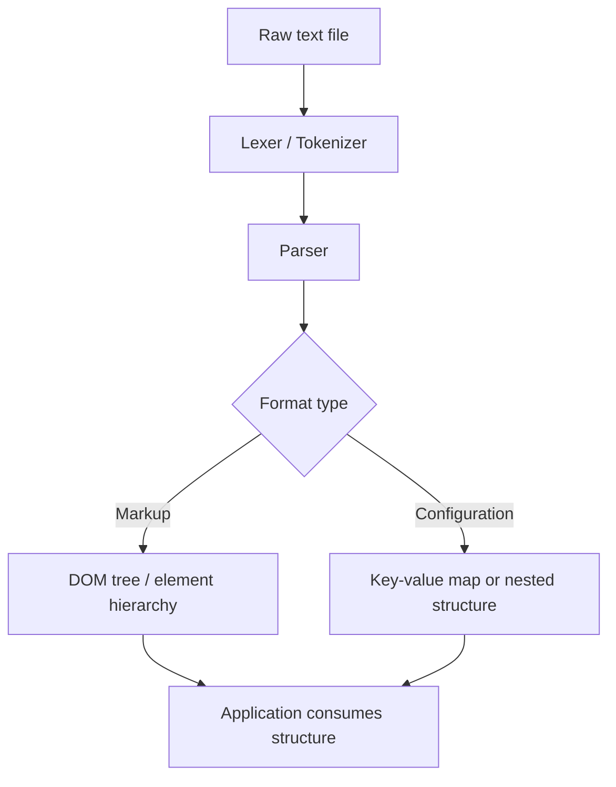

## Markup and Configuration Languages


### Definition and Scope

Markup and configuration languages are text-based formats used to structure, annotate, or configure data and documents, rather than to express computation. Markup languages annotate content with tags or structural markers to convey meaning, formatting, or document structure. Configuration languages express structured settings, parameters, or declarative data for software systems. The two categories overlap substantially: formats like YAML and TOML began primarily as configuration languages, while XML and HTML began as markup languages but are frequently used for configuration as well.

### Markup Languages

**Key Points**

- Markup languages embed annotations ("tags" or "markers") within content to describe structure, semantics, or presentation.
- Distinguished from programming languages by the general absence of control flow (loops, conditionals) in the base specification, though templating extensions often add such constructs.

**HTML (HyperText Markup Language)**

HTML structures documents for web browsers using nested elements:

```html
<article>
  <h1>Article Title</h1>
  <p>This is a <strong>paragraph</strong> with emphasis.</p>
  <ul>
    <li>First item</li>
    <li>Second item</li>
  </ul>
</article>
```

Each element consists of an opening tag, content, and a closing tag (or is self-closing, such as ``). HTML defines semantic and presentational structure but is not Turing-complete on its own; interactivity and computation are delegated to embedded or linked scripting languages such as JavaScript.

**XML (eXtensible Markup Language)**

XML is a general-purpose markup metalanguage: rather than defining a fixed tag vocabulary like HTML, XML lets users define their own tags for arbitrary structured data.

```xml
<?xml version="1.0" encoding="UTF-8"?>
<library>
  <book isbn="978-0134685991">
    <title>Effective Java</title>
    <author>Joshua Bloch</author>
    <year>2018</year>
  </book>
</library>
```

XML supports schema validation through DTD (Document Type Definition) or XML Schema (XSD), namespaces to avoid tag-name collisions across vocabularies, and associated query/transform languages (XPath, XQuery, XSLT). [Inference] XML's verbosity relative to newer formats like JSON is a primary reason its dominance in web-facing data interchange has declined since the early 2000s, even though it remains heavily used in enterprise, document-publishing (e.g., DocBook, OOXML), and configuration contexts (e.g., Maven's `pom.xml`, Android layout files) where schema validation and namespacing are valued.

**Markdown**

Markdown is a lightweight markup language designed to be readable as plain text while converting cleanly to HTML.

```markdown
# Heading

Some **bold** and *italic* text, plus a [link](https://example.com).

- List item one
- List item two
```

Markdown deliberately covers a narrower feature set than HTML or XML, trading expressiveness for human readability of the raw source. [Unverified] Because Markdown was never formally standardized by its original creator, numerous divergent implementations and extensions exist (CommonMark, GitHub Flavored Markdown, MultiMarkdown, and others), and exact feature support varies by renderer — a project's specific Markdown flavor should be checked against its documentation rather than assumed.

### Configuration Languages

**Key Points**

- Configuration languages express settings, parameters, and structured data that software reads at startup or runtime, generally without embedding executable logic.
- Design tensions center on human readability/writability versus machine parseability versus expressive power (e.g., support for comments, references, or computed values).

**JSON (JavaScript Object Notation)**

```json
{
  "name": "example-service",
  "port": 8080,
  "features": ["auth", "logging"],
  "debug": false
}
```

JSON is a minimal, strictly data-only format: objects, arrays, strings, numbers, booleans, and null. It has no native comment syntax and no mechanism for references between values, which is a deliberate simplicity trade-off. JSON's grammar is compact enough to specify formally:

$$\text{value} ::= \text{object} \mid \text{array} \mid \text{string} \mid \text{number} \mid \text{true} \mid \text{false} \mid \text{null}$$

**YAML (YAML Ain't Markup Language)**

```yaml
name: example-service
port: 8080
features:
  - auth
  - logging
debug: false
database:
  host: localhost
  credentials:
    user: admin
    # password loaded from environment at runtime
```

YAML uses indentation-based nesting (similar to Python) rather than explicit braces/brackets, and supports comments (`#`), anchors and aliases for reference/reuse (`&anchor` / `*alias`), and multiple document separation (`---`). YAML is a superset of JSON in terms of data model, meaning valid JSON is generally also valid YAML. [Inference] YAML's reliance on significant whitespace and its large feature surface (multiple string-quoting styles, implicit type coercion of unquoted values) are frequently cited as sources of subtle configuration bugs, which is part of why some projects favor stricter subsets or alternative formats for critical configuration.

**TOML (Tom's Obvious, Minimal Language)**

```toml
name = "example-service"
port = 8080
debug = false

[database]
host = "localhost"

[database.credentials]
user = "admin"

features = ["auth", "logging"]
```

TOML was designed explicitly to map unambiguously onto a hash table data structure, using `[section]` headers for nested tables and `key = value` pairs, aiming for a middle ground between JSON's strictness and YAML's flexibility. It supports comments and native date/time types. TOML is commonly used in Rust's Cargo (`Cargo.toml`) and Python's `pyproject.toml`.

**INI Format**

```ini
[server]
port=8080
debug=false

[database]
host=localhost
user=admin
```

INI is one of the oldest and simplest configuration formats, consisting of `[section]` headers and flat `key=value` pairs. It has no official specification, meaning details such as comment syntax, nested sections, and value typing vary by parser implementation.

### Comparison of Configuration Formats

| Format | Comments | Nesting Style | Native Types | Typical Use Case |
| --- | --- | --- | --- | --- |
| JSON | No | Braces/brackets | string, number, bool, null, array, object | APIs, data interchange |
| YAML | Yes | Indentation | Superset of JSON types + dates | CI/CD pipelines (e.g., GitHub Actions), Kubernetes manifests |
| TOML | Yes | `[section]` headers | string, integer, float, bool, datetime, array | Package/build manifests (Cargo, Python packaging) |
| INI | Varies | `[section]` headers, flat | Untyped (string by default) | Legacy application settings |
| XML | Yes | Nested tags | Untyped by default; typed via schema | Enterprise config, document formats |

### Markup vs. Configuration: A Conceptual Diagram

<svg xmlns="http://www.w3.org/2000/svg" viewBox="0 0 900 400">
<text x="450" y="28" text-anchor="middle" font-size="18" font-weight="bold" fill="#1a1a1a">Markup and Configuration Language Landscape (svg_diagram)</text>
<rect x="60" y="60" width="780" height="300" rx="10" fill="none" stroke="#999" stroke-width="1" stroke-dasharray="4,3" />
<ellipse cx="280" cy="200" rx="200" ry="130" fill="#a8c8e8" fill-opacity="0.35" stroke="#3b5b8c" stroke-width="1.5" />
<text x="280" y="90" text-anchor="middle" font-size="13" font-weight="bold" fill="#1a1a1a">Markup-oriented</text>
<ellipse cx="600" cy="200" rx="200" ry="130" fill="#f2c48a" fill-opacity="0.35" stroke="#a8842f" stroke-width="1.5" />
<text x="600" y="90" text-anchor="middle" font-size="13" font-weight="bold" fill="#1a1a1a">Configuration-oriented</text>

<text x="200" y="170" font-size="13" fill="`#1a1a1a`">HTML</text>

<text x="200" y="200" font-size="13" fill="`#1a1a1a`">Markdown</text>

<text x="200" y="230" font-size="13" fill="`#1a1a1a`">DocBook</text>

<text x="430" y="185" font-size="13" font-weight="bold" fill="`#1a1a1a`">XML</text>

<text x="430" y="215" font-size="11" fill="#555">(shared: markup +</text>

<text x="430" y="230" font-size="11" fill="#555">config, e.g. pom.xml)</text>

<text x="670" y="170" font-size="13" fill="`#1a1a1a`">JSON</text>

<text x="670" y="200" font-size="13" fill="`#1a1a1a`">YAML</text>

<text x="670" y="230" font-size="13" fill="`#1a1a1a`">TOML</text>

<text x="670" y="260" font-size="13" fill="`#1a1a1a`">INI</text>

</svg>

### Templating Layers Over Markup

**Key Points**

- Pure markup and configuration languages typically lack control flow; templating engines add loops, conditionals, and variable substitution on top.
- This produces a layered architecture: a base markup/config format plus a templating DSL that generates it.

Examples include Jinja2 (Python, often generating HTML or YAML), Helm templates (generating Kubernetes YAML manifests), and ERB (Ruby, generating HTML). A Jinja2 example generating HTML:

```jinja2
<ul>

  <li>{{ item.name }} - {{ item.price }}</li>

</ul>
```

This illustrates a recurring pattern in software systems: a strictly declarative, non-Turing-complete data format (HTML) is combined with a separate, Turing-complete templating DSL (Jinja2's control-flow constructs) to allow programmatic generation, while keeping the final output format itself simple and computation-free.

### Schema and Validation Languages

Markup and configuration formats are frequently paired with separate schema languages that formally constrain valid documents:

- **XML Schema (XSD)** and **DTD** — define allowed elements, attributes, and structure for XML documents.
- **JSON Schema** — defines allowed structure, types, and constraints for JSON documents, itself expressed in JSON.
- **RELAX NG** — an alternative schema language for XML, often considered more concise than XSD.

```json
{
  "type": "object",
  "properties": {
    "port": { "type": "integer", "minimum": 1, "maximum": 65535 },
    "debug": { "type": "boolean" }
  },
  "required": ["port"]
}
```

This JSON Schema fragment constrains a configuration document to require a `port` field of integer type within a valid TCP port range, and an optional boolean `debug` field — enabling automated validation of configuration files before an application attempts to load them.

### Parsing Considerations



Both markup and configuration parsers generally follow the same lexer/parser pipeline structure as external DSLs, since these formats are themselves external DSLs specialized for structured data rather than computation. The output differs by convention: markup parsers commonly build a DOM (Document Object Model) — a tree of elements — while configuration parsers commonly build a nested key-value structure directly mapped into the host application's native data types (dictionaries, structs, or objects).

### Security Considerations

**Key Points**

- XML parsers historically have been vulnerable to XML External Entity (XXE) attacks if external entity resolution is not disabled.
- YAML parsers in some languages historically supported unsafe deserialization of arbitrary objects via unrestricted tag resolution, distinct from the safer default "safe load" mode most modern YAML libraries now recommend.

[Inference] These are well-documented historical vulnerability classes rather than universal properties of the formats themselves; behavior depends heavily on the specific parser library, its version, and its configuration defaults, so current security guidance should be checked against the specific library in use rather than assumed from the format alone.

### Conclusion

Markup and configuration languages form a large, practically essential category of external DSLs oriented toward structuring data and content rather than expressing computation. Markup languages (HTML, XML, Markdown) annotate content for structural or presentational meaning, while configuration languages (JSON, YAML, TOML, INI) express settings and structured parameters for software systems, with XML straddling both roles. Across this landscape, recurring design trade-offs appear repeatedly: human readability versus strict parseability, minimalism versus expressive power (comments, references, typed values), and the frequent need to layer a separate Turing-complete templating DSL on top of an otherwise computation-free base format.

**Related Topics**

- Schema validation languages (XSD, JSON Schema, RELAX NG)
- Templating engines (Jinja2, ERB, Handlebars, Helm templates)
- Document Object Model (DOM) and tree-based parsing
- Serialization formats versus markup languages (Protocol Buffers, MessagePack)
- YAML anchors, aliases, and merge keys
- XML namespaces and XSLT transformations
- Static site generators and Markdown-to-HTML pipelines
- Infrastructure-as-code configuration languages (HCL/Terraform)
- Security considerations: XXE attacks and unsafe deserialization
- CommonMark specification and Markdown flavor fragmentation