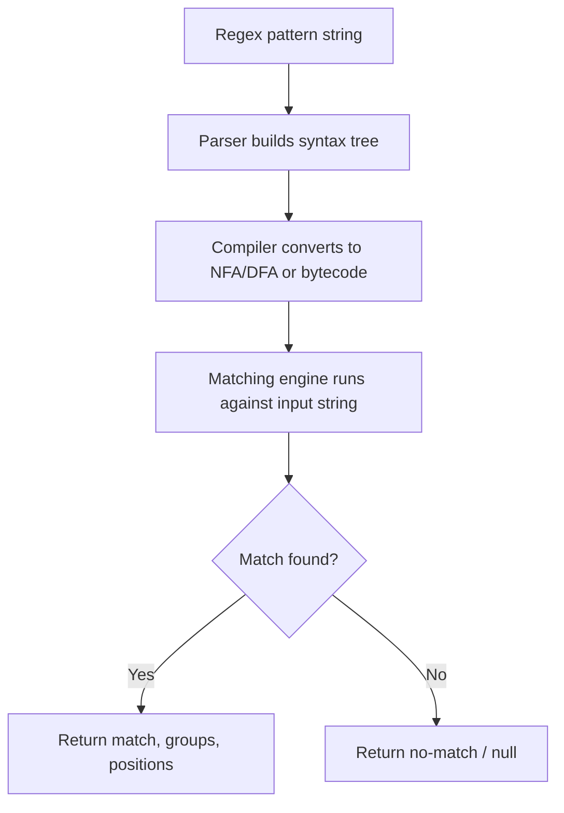

## Regular Expressions as a DSL

### Definition and Classification

A regular expression (regex) is a compact, symbolic language for describing patterns in text, used for matching, searching, and manipulating strings. Regular expressions constitute a canonical example of an external DSL: they possess their own grammar entirely distinct from any host programming language, require dedicated parsing and matching engines, and are almost always embedded as string literals within general-purpose host languages rather than written as native syntax.

### Theoretical Foundation

**Key Points**

- Regular expressions correspond formally to regular languages, the languages recognized by finite automata, as established in formal language theory (part of the Chomsky hierarchy).
- Classical (theoretical) regular expressions support only concatenation, alternation, and Kleene star, and can always be compiled into an equivalent finite automaton.
- Modern practical regex engines add features (backreferences, lookaround) that exceed the formal power of regular languages, technically making them no longer "regular" in the strict theoretical sense.

The formal definition of a regular expression over an alphabet $\Sigma$ is given inductively:

$$R ::= \varnothing \mid \varepsilon \mid a \in \Sigma \mid (R_1 R_2) \mid (R_1 \mid R_2) \mid (R_1)^*$$

where $\varnothing$ matches nothing, $\varepsilon$ matches the empty string, $a$ matches a single alphabet symbol, $(R_1 R_2)$ is concatenation, $(R_1 \mid R_2)$ is alternation, and $(R_1)^*$ is the Kleene star (zero or more repetitions). Every expression built from this grammar corresponds to some regular language, and by Kleene's theorem, every regular language can be recognized by a deterministic finite automaton (DFA) or nondeterministic finite automaton (NFA).

### Core Syntax Elements

**Literal characters and metacharacters**

```plaintext
cat        matches the literal text "cat"
.          matches any single character (except newline, by default)
\d         matches any digit (equivalent to [0-9])
\w         matches any word character ([A-Za-z0-9_])
\s         matches any whitespace character
```

**Quantifiers**

```plaintext
a*         zero or more "a"
a+         one or more "a"
a?         zero or one "a"
a{3}       exactly three "a"
a{2,5}     between two and five "a"
a{2,}      two or more "a"
```

**Character classes**

```plaintext
[abc]      matches "a", "b", or "c"
[^abc]     matches any character except "a", "b", or "c"
[a-z]      matches any lowercase letter
[a-zA-Z0-9] matches any alphanumeric character
```

**Anchors**

```plaintext
^          start of string (or line, in multiline mode)
$          end of string (or line, in multiline mode)
\b         word boundary
```

**Groups and alternation**

```plaintext
(abc)      capturing group matching "abc"
(?:abc)    non-capturing group
a|b        matches "a" or "b"
(?<year>\d{4})   named capturing group
```

### Worked Example

Matching a simplified email address:

```plaintext
^[\w.+-]+@[\w-]+\.[a-zA-Z]{2,}$
```

Breaking this down: `^` anchors to the start; `[\w.+-]+` matches one or more word characters, dots, plus signs, or hyphens (the local part); `@` matches a literal at-sign; `[\w-]+` matches the domain name; `\.` matches a literal dot (escaped, since unescaped `.` means "any character"); `[a-zA-Z]{2,}` matches the top-level domain, requiring at least two letters; `$` anchors to the end. [Inference] Fully RFC-5322-compliant email validation requires a far more elaborate pattern than this simplified version, so patterns like this are best understood as practical approximations rather than complete specifications — a caveat commonly noted in regex tutorials and validation libraries.

### Pattern Matching Flow



### Backreferences and Lookaround

**Key Points**

- Backreferences allow a pattern to refer back to a previously captured group, matching only if the same text repeats.
- Lookahead and lookbehind ("lookaround") allow conditioning a match on surrounding context without including that context in the match itself.
- Both features exceed the expressive power of formally regular languages; a regex engine supporting backreferences can, in principle, match certain non-regular languages.

```plaintext
(\w+)\s+\1        matches a repeated word, e.g. "the the"

foo(?=bar)        matches "foo" only if immediately followed by "bar" (lookahead)
(?<=foo)bar       matches "bar" only if immediately preceded by "foo" (lookbehind)
foo(?!bar)        matches "foo" only if NOT followed by "bar" (negative lookahead)
```

In `foo(?=bar)`, only `"foo"` is included in the match; `"bar"` is checked but not consumed, meaning subsequent matching can still test against the text starting at `"bar"`. [Inference] Because backreference matching is not decidable by a finite automaton in the general case, engines supporting this feature (most PCRE-derived engines) use backtracking algorithms rather than the linear-time automaton simulation used by strictly regular engines, which is the underlying reason backtracking regex engines can exhibit pathological slowdowns on certain crafted inputs.

### Catastrophic Backtracking

**Key Points**

- Certain regex patterns combined with certain inputs cause backtracking engines to explore an exponential number of matching paths.
- This is a well-documented performance and denial-of-service risk class, sometimes referred to as ReDoS (Regular Expression Denial of Service).

A classic problematic pattern:

```plaintext
(a+)+$
```

Against an input like `"aaaaaaaaaaaaaaaaaaaaaaaaaaaaaaaaaaaaaaaaa!"` (many `a`s followed by a non-matching character), a backtracking engine may attempt an exponential number of ways to partition the `a`s between the inner and outer `+` quantifiers before concluding there is no match. [Inference] This behavior is specific to backtracking-based engines; engines built on Thompson's NFA-to-DFA simulation approach (such as RE2 or Rust's `regex` crate) guarantee linear-time matching by construction, precisely because they avoid backtracking, though this typically comes at the cost of not supporting backreferences or arbitrary lookaround. Because pathological behavior depends on the specific engine, pattern, and input, exact performance in any given case should be measured rather than assumed.

### Regex as an Embedded External DSL

**Key Points**

- Regex syntax itself does not vary by host language in its core (POSIX/PCRE-derived) form, but is invoked and embedded differently depending on the host language's own syntax facilities.
- Some languages provide native regex literal syntax; others require regex to be passed as ordinary strings.

JavaScript provides native regex literals, delimited by slashes:

```javascript
const pattern = /^[\w.+-]+@[\w-]+\.[a-zA-Z]{2,}$/;
const isValid = pattern.test("user@example.com");
```

Python treats regex patterns as ordinary strings passed to the `re` module:

```python
import re
pattern = r"^[\w.+-]+@[\w-]+\.[a-zA-Z]{2,}$"
match = re.match(pattern, "user@example.com")
```

Here Python's raw string prefix `r"..."` prevents Python's own string-escaping rules from interfering with regex escape sequences like `\d` or `\.` — an example of friction that arises specifically because the regex DSL is embedded as string data within a host language that has its own independent escaping conventions, rather than a shared syntax.

### Regex Dialect Variation

**Key Points**

- Despite a common conceptual core, regex "flavors" differ in supported syntax, default behaviors, and feature sets.
- Major families include POSIX Basic Regular Expressions (BRE), POSIX Extended Regular Expressions (ERE), PCRE (Perl-Compatible Regular Expressions), and engine-specific variants in Python, JavaScript, Java, .NET, and others.

| Feature | POSIX BRE | POSIX ERE | PCRE | JavaScript |
| --- | --- | --- | --- | --- |
| `+`, `?` quantifiers | Requires escaping (`\+`) | Native | Native | Native |
| Non-capturing groups `(?:...)` | Not supported | Not supported | Supported | Supported |
| Lookahead/lookbehind | Not supported | Not supported | Supported | Supported (lookbehind added later) |
| Named groups | Not supported | Not supported | Supported | Supported |
| Backreferences | Supported | Limited | Supported | Supported |

[Unverified] Exact feature support varies further by specific engine version (e.g., which JavaScript engine, which PCRE version), so precise compatibility should be verified against current documentation for the target runtime rather than treated as fixed across all implementations.

### Regex Engine Architecture Diagram

<svg xmlns="http://www.w3.org/2000/svg" viewBox="0 0 900 380">
<text x="450" y="28" text-anchor="middle" font-size="18" font-weight="bold" fill="#1a1a1a">Two Regex Engine Architectures (svg_diagram)</text>
<rect x="50" y="60" width="380" height="290" rx="10" fill="#e6f5e9" stroke="#2f8c4a" stroke-width="1.5" />
<text x="240" y="90" text-anchor="middle" font-size="14" font-weight="bold" fill="#1a1a1a">Automaton-based (e.g., RE2)</text>
<text x="240" y="120" text-anchor="middle" font-size="11" fill="#1a1a1a">Pattern compiled to DFA/NFA</text>
<text x="240" y="140" text-anchor="middle" font-size="11" fill="#1a1a1a">Simultaneous state exploration</text>
<text x="240" y="160" text-anchor="middle" font-size="11" fill="#1a1a1a">Guaranteed linear-time matching</text>
<text x="240" y="190" text-anchor="middle" font-size="11" fill="#1a1a1a">No backreferences</text>
<text x="240" y="210" text-anchor="middle" font-size="11" fill="#1a1a1a">No arbitrary lookaround</text>
<text x="240" y="240" text-anchor="middle" font-size="11" font-style="italic" fill="#1a1a1a">Immune to catastrophic</text>
<text x="240" y="258" text-anchor="middle" font-size="11" font-style="italic" fill="#1a1a1a">backtracking by design</text>
<rect x="470" y="60" width="380" height="290" rx="10" fill="#fbe7e7" stroke="#b03a3a" stroke-width="1.5" />
<text x="660" y="90" text-anchor="middle" font-size="14" font-weight="bold" fill="#1a1a1a">Backtracking-based (e.g., PCRE)</text>
<text x="660" y="120" text-anchor="middle" font-size="11" fill="#1a1a1a">Pattern compiled to bytecode</text>
<text x="660" y="140" text-anchor="middle" font-size="11" fill="#1a1a1a">Depth-first trial and backtrack</text>
<text x="660" y="160" text-anchor="middle" font-size="11" fill="#1a1a1a">Worst case exponential time</text>
<text x="660" y="190" text-anchor="middle" font-size="11" fill="#1a1a1a">Supports backreferences</text>
<text x="660" y="210" text-anchor="middle" font-size="11" fill="#1a1a1a">Supports lookaround</text>
<text x="660" y="240" text-anchor="middle" font-size="11" font-style="italic" fill="#1a1a1a">Susceptible to ReDoS on</text>
<text x="660" y="258" text-anchor="middle" font-size="11" font-style="italic" fill="#1a1a1a">certain crafted patterns</text>
</svg>

### Practical Applications

**Key Points**

- Text validation (email, phone number, postal code format checks).
- Search-and-replace operations in text editors and command-line tools (`sed`, `grep`, `awk`).
- Tokenization in lexers, often as the first stage of a larger parser for another DSL or programming language.
- Log parsing and data extraction from semi-structured text.

```bash
grep -E '^ERROR' application.log
sed 's/[0-9]\+/NUMBER/g' input.txt
```

The `grep -E` command uses Extended Regular Expressions to filter lines starting with `"ERROR"`; the `sed` command substitutes any run of digits with the literal text `"NUMBER"`, illustrating regex's common role in command-line text processing.

### Limits of Regular Expressions

**Key Points**

- Regular expressions (in the formal sense) cannot match arbitrarily nested structures, such as balanced parentheses or nested HTML/XML tags, because recognizing arbitrary nesting depth requires more computational power than a finite automaton provides (a pumping-lemma argument formally proves this for context-free-but-not-regular languages).
- This is a frequently cited caution against using regex to parse structured formats like HTML or XML, where a proper parser (built for a context-free or richer grammar) is the appropriate tool.

[Inference] The common engineering guidance to avoid parsing HTML with regex follows directly from this formal limitation: HTML nesting is not a regular language, so no regex — regardless of cleverness — can correctly handle arbitrarily nested tags in the general case, even though regex can often handle simple, non-nested, or well-constrained subsets of such text adequately in practice.

### Conclusion

Regular expressions are a compact, theoretically grounded external DSL for pattern matching in text, rooted in finite automata theory but extended in practical engines with features like backreferences and lookaround that exceed strict regularity. Their near-universal embedding as strings within host languages — sometimes softened by native literal syntax, as in JavaScript — makes them a recurring example of the friction between an external DSL's own escaping and syntax rules and those of its host environment. Understanding the distinction between automaton-based and backtracking-based engines is practically important, since it determines both feature availability (backreferences, lookaround) and worst-case performance characteristics (linear-time guarantees versus catastrophic backtracking risk).

**Related Topics**

- Finite automata: DFA versus NFA and Thompson's construction
- The Chomsky hierarchy and formal language classes
- Lexical analysis and tokenization in compiler front-ends
- ReDoS (Regular Expression Denial of Service) mitigation strategies
- POSIX BRE/ERE versus PCRE dialect differences
- Parser combinators as an alternative to regex for structured text
- Context-free grammars and why HTML/XML parsing needs more than regex
- Regex engines: backtracking (PCRE) versus automaton-based (RE2, Rust regex)
- Unicode-aware regex matching and normalization issues
- Regex-based lexer generators (e.g., Lex/Flex)