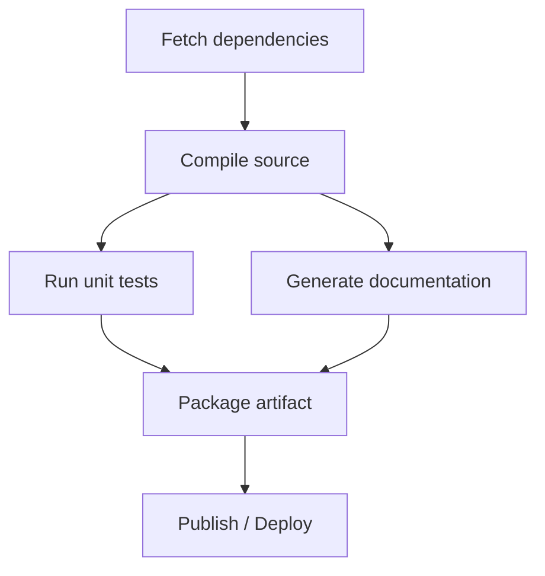

## Build and Configuration DSLs

### Definition and Scope

Build and configuration DSLs are domain-specific languages used to describe how software is compiled, assembled, tested, packaged, and deployed. They occupy a distinct niche from general configuration languages (covered separately) in that they typically encode not just static data but a dependency graph and a build process — specifying tasks, their ordering, and the conditions under which they must be re-executed. Build DSLs span the full internal/external spectrum: some are simple declarative external DSLs, others are Turing-complete internal DSLs embedded in a host language.

### Core Concepts Shared Across Build Systems

**Key Points**

- **Targets/tasks** — named units of work (e.g., "compile", "test", "package").
- **Dependencies** — a directed graph specifying which targets must complete before others run.
- **Incremental rebuilding** — avoiding redundant work by tracking whether inputs have changed since the last build (via timestamps, content hashes, or similar).
- **Declarative vs. imperative task definition** — some systems describe *what* the desired build graph is; others describe *how* to execute build steps procedurally.

A build system's core responsibility is topological execution of a dependency graph: each task runs only after its declared prerequisites have successfully completed, and unrelated tasks may run in parallel.



### Make: The Foundational External Build DSL

**Key Points**

- Make, dating to 1976, is among the earliest and most influential build DSLs.
- Uses a rule-based syntax: `target: prerequisites` followed by a tab-indented recipe (shell commands).
- Determines whether a target needs rebuilding primarily by comparing file modification timestamps.

```makefile
CC = gcc
CFLAGS = -Wall -O2

app: main.o utils.o
	$(CC) $(CFLAGS) -o app main.o utils.o

main.o: main.c utils.h
	$(CC) $(CFLAGS) -c main.c

utils.o: utils.c utils.h
	$(CC) $(CFLAGS) -c utils.c

clean:
	rm -f *.o app
```

Each block declares a target (e.g., `app`), its prerequisites (`main.o utils.o`), and a recipe (the indented shell command) executed only if the target is missing or older than any prerequisite. Make's syntax is a genuine external DSL: its grammar (targets, prerequisites, recipes, variables via `$(VAR)`, pattern rules) has no relationship to any general-purpose host language, and Make ships with its own dedicated parser and execution engine. [Inference] Make's strict reliance on file modification timestamps, rather than content hashing, is a frequently noted limitation, since touching a file without changing its content can trigger unnecessary rebuilds, and, conversely, systems with unreliable or coarse-grained clock resolution can in rare cases fail to detect a real change.

### Ant: XML-Based External Build DSL

Apache Ant, historically significant in the Java ecosystem, expresses build logic using XML as its host markup:

```xml
<project name="example" default="build">
  <target name="compile">
    <javac srcdir="src" destdir="build/classes"/>
  </target>
  <target name="build" depends="compile">
    <jar destfile="build/app.jar" basedir="build/classes"/>
  </target>
</project>
```

Ant's use of XML illustrates a common pattern: a general-purpose markup language (XML) serves as the *host syntax* for an external DSL's grammar, with `<target>`, `<depends>`, and task elements like `<javac>` forming Ant-specific vocabulary layered on top of well-formed XML. [Inference] Ant's XML-based syntax is often cited as verbose relative to later build DSLs, which is one of the reasons subsequent Java-ecosystem build tools (Maven, then Gradle) moved toward more concise or declarative-plus-scripting hybrid approaches.

### Maven: Declarative Configuration with Convention

Maven, also XML-based, shifts emphasis from imperative task scripting toward declarative project description plus a fixed lifecycle:

```xml
<project>
  <modelVersion>4.0.0</modelVersion>
  <groupId>com.example</groupId>
  <artifactId>my-app</artifactId>
  <version>1.0.0</version>
  <dependencies>
    <dependency>
      <groupId>junit</groupId>
      <artifactId>junit</artifactId>
      <version>4.13.2</version>
      <scope>test</scope>
    </dependency>
  </dependencies>
</project>
```

Rather than scripting individual build steps, Maven's `pom.xml` primarily declares *what* the project is (its identity, dependencies, packaging type), and Maven's predefined build lifecycle (`validate`, `compile`, `test`, `package`, `install`, `deploy`) determines *how* those declarations translate into build actions — following the "convention over configuration" philosophy.

### Gradle: Internal DSL Approach

Gradle represents a shift toward internal DSLs, initially built on Groovy and later offering a Kotlin-based DSL, embedding build logic as executable code in a general-purpose host language rather than static XML.

Groovy DSL:

```groovy
plugins {
    id 'java'
}

dependencies {
    implementation 'org.apache.commons:commons-lang3:3.12.0'
    testImplementation 'junit:junit:4.13.2'
}

tasks.register('hello') {
    doLast {
        println 'Hello from a custom Gradle task'
    }
}
```

Kotlin DSL (as introduced in an earlier internal-DSL example, shown here in fuller form):

```kotlin
plugins {
    java
}

dependencies {
    implementation("org.apache.commons:commons-lang3:3.12.0")
    testImplementation("junit:junit:4.13.2")
}

tasks.register("hello") {
    doLast {
        println("Hello from a custom Gradle task")
    }
}
```

Because both are internal DSLs, arbitrary Groovy or Kotlin code (conditionals, loops, functions, custom logic) can be interleaved directly with build declarations — a capability external DSLs like Make or Maven's XML lack without escaping into an embedded scripting section. This flexibility is a double-edged design trade-off: [Inference] the same expressiveness that allows powerful, dynamic build logic also makes Gradle build scripts harder to statically analyze, more prone to accidental complexity, and generally slower to evaluate than a purely declarative format, which is a commonly cited criticism relative to simpler declarative build tools.

### Cargo (Rust): TOML-Based Declarative Configuration

```toml
[package]
name = "example-crate"
version = "0.1.0"
edition = "2021"

[dependencies]
serde = { version = "1.0", features = ["derive"] }
tokio = { version = "1", features = ["full"] }

[dev-dependencies]
criterion = "0.5"
```

Cargo's `Cargo.toml` is purely declarative data (TOML), with no embedded scripting capability by design; build customization instead happens through a separate `build.rs` Rust script when needed, keeping the manifest itself simple and free of arbitrary logic — a deliberate contrast to Gradle's embed-everything approach.

### Bazel/Starlark: A Middle Ground

Bazel uses Starlark, a language specifically designed as a restricted, deterministic subset of Python intended for build configuration:

```python
load("@rules_cc//cc:defs.bzl", "cc_binary")

cc_binary(
    name = "hello_world",
    srcs = ["main.cc"],
    deps = [":utils"],
)

cc_library(
    name = "utils",
    srcs = ["utils.cc"],
    hdrs = ["utils.h"],
)
```

Starlark deliberately omits certain general-purpose features present in Python — including unbounded recursion, arbitrary I/O, and certain dynamic behaviors — specifically to guarantee that build files are deterministic and can be safely parsed, analyzed, and parallelized by build tooling. [Inference] This design represents a deliberate middle ground on the internal/external DSL spectrum: Starlark reuses Python-like syntax (lowering the learning curve, similar to an internal DSL's appeal) while being formally restricted enough to preserve the analyzability and safety guarantees more typical of external DSLs.

### Positioning Build DSLs on the Internal/External Spectrum

<svg xmlns="http://www.w3.org/2000/svg" viewBox="0 0 900 340">
<text x="450" y="28" text-anchor="middle" font-size="18" font-weight="bold" fill="#1a1a1a">Build DSL Spectrum: External to Internal (svg_diagram)</text>
<line x1="80" y1="180" x2="820" y2="180" stroke="#555" stroke-width="2" />
<polygon points="820,180 810,174 810,186" fill="#555" />
<text x="120" y="210" font-size="12" fill="#1a1a1a">More external</text>
<text x="760" y="210" font-size="12" fill="#1a1a1a">More internal</text>
<circle cx="140" cy="180" r="6" fill="#b03a3a" />
<text x="140" y="150" text-anchor="middle" font-size="12" fill="#1a1a1a">Make</text>
<text x="140" y="135" text-anchor="middle" font-size="10" fill="#555">(custom grammar)</text>
<circle cx="290" cy="180" r="6" fill="#b03a3a" />
<text x="290" y="150" text-anchor="middle" font-size="12" fill="#1a1a1a">Ant</text>
<text x="290" y="135" text-anchor="middle" font-size="10" fill="#555">(XML host)</text>
<circle cx="410" cy="180" r="6" fill="#a8842f" />
<text x="410" y="150" text-anchor="middle" font-size="12" fill="#1a1a1a">Maven</text>
<text x="410" y="135" text-anchor="middle" font-size="10" fill="#555">(XML + lifecycle)</text>
<circle cx="530" cy="180" r="6" fill="#a8842f" />
<text x="530" y="150" text-anchor="middle" font-size="12" fill="#1a1a1a">Cargo</text>
<text x="530" y="135" text-anchor="middle" font-size="10" fill="#555">(TOML data)</text>
<circle cx="650" cy="180" r="6" fill="#2f8c4a" />
<text x="650" y="150" text-anchor="middle" font-size="12" fill="#1a1a1a">Bazel/Starlark</text>
<text x="650" y="135" text-anchor="middle" font-size="10" fill="#555">(restricted Python)</text>
<circle cx="770" cy="180" r="6" fill="#3b5b8c" />
<text x="770" y="150" text-anchor="middle" font-size="12" fill="#1a1a1a">Gradle</text>
<text x="770" y="135" text-anchor="middle" font-size="10" fill="#555">(Groovy/Kotlin)</text>

<text x="450" y="260" text-anchor="middle" font-size="11" fill="#555">Position reflects general design emphasis;</text>

<text x="450" y="278" text-anchor="middle" font-size="11" fill="#555">exact placement is illustrative, not a formal classification</text>

</svg>

### CI/CD Pipeline DSLs

**Key Points**

- Continuous integration/continuous deployment systems typically define their own configuration DSL, usually YAML-based, describing pipeline stages, jobs, and triggers.
- These are generally declarative external DSLs, though most support embedded shell scripting within individual steps.

```yaml
name: CI Pipeline

on:
  push:
    branches: [main]

jobs:
  build:
    runs-on: ubuntu-latest
    steps:
      - uses: actions/checkout@v4
      - name: Set up environment
        run: |
          echo "Installing dependencies"
          npm install
      - name: Run tests
        run: npm test
```

This GitHub Actions workflow illustrates the layering pattern seen elsewhere in this domain: the outer structure (`jobs`, `steps`, `on`) is a declarative YAML-based external DSL specific to the CI platform, while the `run:` blocks embed an entirely separate imperative language (shell script) for the actual step logic — two DSLs nested within one file, each governed by different syntax rules.

### Infrastructure-as-Code as a Related Category

Terraform's HashiCorp Configuration Language (HCL) exemplifies a build-adjacent declarative DSL for provisioning infrastructure rather than compiling code:

```hcl
resource "aws_instance" "web_server" {
  ami           = "ami-0c55b159cbfafe1f0"
  instance_type = "t3.micro"

  tags = {
    Name = "WebServer"
  }
}
```

HCL declares desired end-state infrastructure resources; a separate execution engine (`terraform apply`) computes and executes the sequence of API calls needed to reconcile actual infrastructure with the declared state — conceptually similar to how a build system reconciles build outputs with declared build targets, but applied to infrastructure provisioning rather than compilation.

### Design Trade-offs Summary

| System | Host Format | Internal or External | Turing-complete | Primary Domain |
| --- | --- | --- | --- | --- |
| Make | Custom | External | Limited (via shell recipes) | Compilation, general tasks |
| Ant | XML | External (XML-hosted) | Limited (via `\<script\>` tasks) | Java builds |
| Maven | XML | External, declarative | No (plugins provide logic) | Java project lifecycle |
| Gradle | Groovy/Kotlin | Internal | Yes | JVM and polyglot builds |
| Cargo | TOML | External, purely declarative | No (delegates to `build.rs`) | Rust packages |
| Bazel | Starlark | Restricted internal (Python-like) | No (deliberately restricted) | Large-scale, multi-language builds |
| GitHub Actions | YAML | External, declarative | No (delegates to shell steps) | CI/CD pipelines |
| Terraform | HCL | External, declarative | No | Infrastructure provisioning |

### Conclusion

Build and configuration DSLs illustrate the internal/external DSL spectrum in practice more clearly than almost any other software domain, ranging from Make's fully custom external grammar, through XML-hosted external DSLs like Ant and Maven, to Gradle's fully internal embedding in Groovy or Kotlin, with Bazel's Starlark occupying a deliberate middle ground of Python-like syntax under formal restrictions for analyzability. A recurring architectural pattern across nearly all of these tools is layering: a declarative outer DSL describes structure and dependencies, while an inner, often more imperative, language or scripting facility handles step-level logic — visible in Ant's `\<script\>` tasks, GitHub Actions' `run:` blocks, and Terraform's provisioner scripts alike. [Inference] The general industry trajectory across these examples — from purely declarative-but-limited external DSLs toward either restricted internal DSLs (Starlark) or fully embedded internal DSLs (Gradle) — reflects an ongoing tension between the analyzability and safety benefits of restricted external DSLs and the expressiveness demanded by increasingly complex, large-scale build requirements.

**Related Topics**

- Dependency graph resolution and topological sorting
- Incremental build systems and content-addressable caching (e.g., Bazel's remote caching)
- Convention over configuration as a design philosophy
- Starlark language design and its restrictions relative to Python
- Infrastructure-as-code languages (Terraform HCL, Pulumi, AWS CloudFormation)
- Package managers and dependency resolution algorithms (SAT-based resolvers)
- CI/CD pipeline design patterns
- Monorepo build tooling (Bazel, Buck, Nx, Turborepo)
- Reproducible and hermetic builds
- Declarative versus imperative infrastructure provisioning