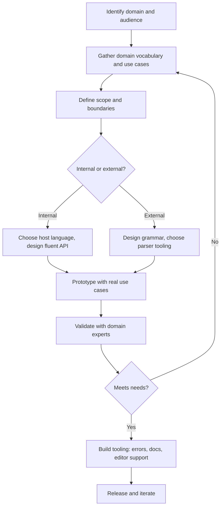
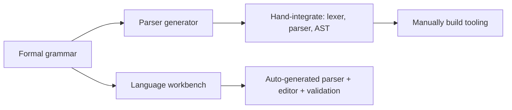

## Designing a Domain-Specific Language


### Overview of the Design Process

Designing a domain-specific language is fundamentally an exercise in scoping: identifying the precise boundaries of a problem domain, determining what vocabulary and abstractions that domain requires, and choosing an implementation strategy (internal versus external) that balances expressiveness, implementation cost, and usability for the intended audience. Unlike general-purpose language design, DSL design is guided primarily by the needs of a specific, often narrow, user base and use case rather than by broad computational generality.

### Design Process Overview



### Step 1: Domain Analysis

**Key Points**

- Identify the target users precisely — domain experts without programming background, programmers within a specific domain, or a mix.
- Catalog the vocabulary, concepts, and recurring patterns already used informally by domain practitioners (in documents, spreadsheets, verbal descriptions).
- Identify the *boundary* of the domain: what the language must express, and — equally important — what it deliberately will not attempt to express.

Domain analysis often draws on techniques from domain modeling more broadly, including interviews with subject-matter experts, review of existing artifacts (existing scripts, spreadsheets, or ad hoc notations already in informal use), and identification of recurring structural patterns. [Inference] A DSL whose scope is too broad tends to converge toward reinventing a general-purpose language poorly, a failure mode often referenced via Greenspun's Tenth Rule; a DSL scoped too narrowly may fail to cover real use cases and force users back into workarounds, so the boundary-setting step is frequently cited as the highest-leverage and most difficult part of DSL design.

### Step 2: Choosing Internal vs. External

The internal/external decision, covered in depth separately, is typically resolved by weighing:

| Factor | Favors Internal | Favors External |
| --- | --- | --- |
| Target audience programming background | Programmers familiar with host language | Non-programmers or mixed audience |
| Available implementation time/resources | Limited | Sufficient for parser/tooling investment |
| Need for arbitrary computation within the DSL | Yes (loops, conditionals needed) | No, or handled by limited constructs |
| Desired syntactic freedom | Constrained is acceptable | Custom notation is important |
| IDE/tooling needs | Can reuse host language tooling | Requires dedicated tooling investment |

### Step 3: Grammar and Vocabulary Design (External DSLs)

**Key Points**

- Define the language's terminals (keywords, literals, operators) and non-terminals (grammatical rules) formally, typically in EBNF or a parser-generator's grammar notation.
- Aim for grammar constructs that map closely onto domain concepts, minimizing the "semantic gap" between how domain experts naturally describe the problem and how the language expresses it.

An illustrative EBNF fragment for a simple scheduling DSL:

```plaintext
schedule    ::= "schedule" identifier "{" rule+ "}"
rule        ::= day_list "->" time_range
day_list    ::= day ("," day)*
day         ::= "Mon" | "Tue" | "Wed" | "Thu" | "Fri" | "Sat" | "Sun"
time_range  ::= time "-" time
time        ::= digit digit ":" digit digit
identifier  ::= letter (letter | digit)*
```

Corresponding example source in this hypothetical DSL:

```plaintext
schedule WeekdayShifts {
    Mon,Tue,Wed,Thu,Fri -> 09:00-17:00
    Sat,Sun -> 10:00-14:00
}
```

This grammar directly encodes domain vocabulary — days, time ranges, schedules — as first-class grammatical constructs, rather than requiring the concept to be expressed indirectly through general-purpose constructs like arrays or conditionals.

### Step 4: API Design (Internal DSLs)

**Key Points**

- Design method and function names to read naturally when chained, often mimicking the phrasing domain experts already use.
- Leverage host-language features specifically suited to fluent syntax: trailing lambdas/blocks, operator overloading, named/optional parameters, extension functions.

A fluent internal DSL design process typically starts from the *desired* call-site syntax and works backward to the API needed to support it. Sketching the desired usage first:

```kotlin
schedule("WeekdayShifts") {
    days(MON, TUE, WED, THU, FRI) hours "09:00-17:00"
    days(SAT, SUN) hours "10:00-14:00"
}
```

then designing the underlying functions and infix operators (`hours` as an infix function, `schedule` accepting a trailing lambda with receiver) to make this syntax valid Kotlin. This "usage-first" design approach is a widely recommended practice specifically for internal DSLs, since the host language's grammar constrains which surface syntaxes are achievable, making it more efficient to validate a syntax sketch against host-language feasibility early rather than after implementing a full underlying API.

### Step 5: Semantic Design

**Key Points**

- Beyond surface syntax, decide execution semantics: is the DSL interpreted directly, or compiled/transpiled to another representation?
- Decide error-handling philosophy: fail fast with precise diagnostics, or attempt best-effort recovery?
- Decide the DSL's relationship to state: is it purely declarative (describing a static structure) or does it support sequential, stateful operations?

[Inference] Semantic ambiguity — situations where valid-looking DSL syntax has an unclear or undefined meaning — is a common source of DSL defects and user confusion, so explicitly enumerating edge cases (overlapping rules, conflicting declarations, missing required fields) during design, rather than discovering them ad hoc during implementation, is widely regarded as good practice, though the specific edge cases will always be domain-dependent.

### Step 6: Tooling and Error Messages

**Key Points**

- For external DSLs, invest early in clear, domain-specific error messages rather than raw parser errors (e.g., "expected token X" is less useful than "shift range for Mon,Tue overlaps with a previously defined rule").
- Editor support — syntax highlighting, autocompletion, inline validation — substantially affects DSL adoption and usability, particularly for external DSLs lacking a host language's existing tooling.
- Language Server Protocol (LSP) implementations allow a single language server to provide editor features across multiple editors/IDEs without per-editor plugin duplication.

Poor error message:

```plaintext
ParseError: unexpected token '->' at line 3, column 22
```

Improved, domain-specific error message:

```plaintext
Error: Overlapping schedule rule for 'Mon' at line 3.
  Previously defined at line 2: Mon,Tue,Wed,Thu,Fri -> 09:00-17:00
  Conflicting rule: Mon -> 08:00-10:00
  Suggestion: remove 'Mon' from one of the overlapping rules.
```

[Inference] The investment required to produce error messages of this quality is often underestimated during initial DSL design, since it requires the parser or interpreter to retain enough contextual information (source locations, prior declarations) to generate a semantically meaningful message rather than a purely syntactic one — this is frequently cited as a major differentiator between DSLs that see strong adoption and those that are abandoned due to poor usability.

### Step 7: Validation with Domain Experts

**Key Points**

- Domain experts, not language designers, are typically the best judges of whether the DSL's vocabulary and abstractions genuinely match the domain's mental model.
- Iterative validation — showing draft syntax to actual practitioners and observing where they hesitate or misuse constructs — surfaces design flaws earlier and more cheaply than post-release feedback.

This step closes the loop back to Step 1's domain analysis, and is often iterative rather than a single one-time review, particularly for external DSLs intended for non-programmer audiences.

### Common Anti-Patterns in DSL Design

**Key Points**

- **Scope creep toward a general-purpose language** — incrementally adding loops, functions, and general computation until the DSL becomes an informally specified, ad hoc, bug-ridden implementation of a subset of an existing GPL (Greenspun's Tenth Rule).
- **Leaky abstraction** — the DSL exposes underlying host-language or implementation details that break the illusion of a purpose-built language, confusing non-programmer users with internal DSLs especially.
- **Premature generality** — designing for hypothetical future use cases not yet validated by real domain needs, at the cost of complexity for current, real use cases.
- **Insufficient error handling** — treating error messages and diagnostics as an afterthought rather than a core design deliverable.
- **Ignoring tooling** — releasing a DSL with no editor support, making adoption difficult even if the language design itself is sound.

### Internal DSL Design Techniques by Host Language Feature

<svg xmlns="http://www.w3.org/2000/svg" viewBox="0 0 900 380">
<text x="450" y="28" text-anchor="middle" font-size="18" font-weight="bold" fill="#1a1a1a">Host Language Features Enabling Internal DSLs (svg_diagram)</text>
<rect x="50" y="60" width="250" height="90" rx="8" fill="#e8eef7" stroke="#3b5b8c" stroke-width="1.5" />
<text x="175" y="88" text-anchor="middle" font-size="13" font-weight="bold" fill="#1a1a1a">Trailing lambdas / blocks</text>
<text x="175" y="110" text-anchor="middle" font-size="11" fill="#1a1a1a">Kotlin, Ruby, Groovy, Swift</text>
<text x="175" y="128" text-anchor="middle" font-size="11" fill="#1a1a1a">Enables nested, scoped syntax</text>
<rect x="325" y="60" width="250" height="90" rx="8" fill="#fff6e0" stroke="#a8842f" stroke-width="1.5" />
<text x="450" y="88" text-anchor="middle" font-size="13" font-weight="bold" fill="#1a1a1a">Operator overloading</text>
<text x="450" y="110" text-anchor="middle" font-size="11" fill="#1a1a1a">C++, Scala, Kotlin, Python</text>
<text x="450" y="128" text-anchor="middle" font-size="11" fill="#1a1a1a">Enables mathematical or symbolic DSLs</text>
<rect x="600" y="60" width="250" height="90" rx="8" fill="#e6f5e9" stroke="#2f8c4a" stroke-width="1.5" />
<text x="725" y="88" text-anchor="middle" font-size="13" font-weight="bold" fill="#1a1a1a">Macros / metaprogramming</text>
<text x="725" y="110" text-anchor="middle" font-size="11" fill="#1a1a1a">Lisp, Clojure, Rust, Elixir</text>
<text x="725" y="128" text-anchor="middle" font-size="11" fill="#1a1a1a">Enables custom syntax transforms</text>
<rect x="50" y="200" width="250" height="90" rx="8" fill="#fbe7e7" stroke="#b03a3a" stroke-width="1.5" />
<text x="175" y="228" text-anchor="middle" font-size="13" font-weight="bold" fill="#1a1a1a">Method chaining</text>
<text x="175" y="250" text-anchor="middle" font-size="11" fill="#1a1a1a">Java, C#, JavaScript, Python</text>
<text x="175" y="268" text-anchor="middle" font-size="11" fill="#1a1a1a">Enables fluent builder-style APIs</text>
<rect x="325" y="200" width="250" height="90" rx="8" fill="#e8eef7" stroke="#3b5b8c" stroke-width="1.5" />
<text x="450" y="228" text-anchor="middle" font-size="13" font-weight="bold" fill="#1a1a1a">Named/default parameters</text>
<text x="450" y="250" text-anchor="middle" font-size="11" fill="#1a1a1a">Python, Kotlin, C#, Swift</text>
<text x="450" y="268" text-anchor="middle" font-size="11" fill="#1a1a1a">Enables readable configuration calls</text>
<rect x="600" y="200" width="250" height="90" rx="8" fill="#fff6e0" stroke="#a8842f" stroke-width="1.5" />
<text x="725" y="228" text-anchor="middle" font-size="13" font-weight="bold" fill="#1a1a1a">Infix functions</text>
<text x="725" y="250" text-anchor="middle" font-size="11" fill="#1a1a1a">Kotlin, Haskell, Scala</text>
<text x="725" y="268" text-anchor="middle" font-size="11" fill="#1a1a1a">Enables natural-language-like phrasing</text>
</svg>

### External DSL Implementation Tooling

**Key Points**

- **Parser generators** (e.g., ANTLR, Yacc/Bison) generate a parser from a formal grammar specification, reducing hand-written parsing code.
- **Parser combinators** (e.g., Parsec in Haskell, nom in Rust) build parsers compositionally from small parsing functions, favored in functional-language ecosystems.
- **Language workbenches** (e.g., JetBrains MPS, Xtext, Spoofax) aim to generate not just a parser but also editor support, syntax highlighting, and validation from a single grammar/language specification, directly targeting the tooling-cost disadvantage of external DSLs.



[Inference] Language workbenches are generally positioned as reducing, though not eliminating, the traditional implementation-cost gap between internal and external DSLs, since substantial effort is still required to define semantics, validation rules, and code generation targets beyond what the workbench automates; the actual time savings vary by project and are not a fixed, universally quoted figure.

### Testing a DSL

**Key Points**

- Test both the language implementation itself (parser correctness, semantic correctness, error message accuracy) and representative programs written in the DSL (does a realistic domain scenario produce the expected behavior).
- Golden-file / snapshot testing is commonly used: run a set of representative DSL source files through the implementation and compare output against previously verified expected results.
- Fuzz testing external DSL parsers can surface crashes or unexpected behavior on malformed or edge-case input.

### A Minimal Worked Example: Designing a Small Internal DSL

To illustrate the process concretely, consider designing a small internal DSL in Python for describing HTTP API test assertions.

**Desired usage (Step 4, usage-first sketch):**

```python
test("GET /users returns 200") \
    .request("GET", "/users") \
    .expect_status(200) \
    .expect_json_contains({"count": 5})
```

**Resulting implementation sketch:**

```python
class ApiTest:
    def __init__(self, description):
        self.description = description
        self.method = None
        self.path = None
        self.assertions = []

    def request(self, method, path):
        self.method = method
        self.path = path
        return self

    def expect_status(self, code):
        self.assertions.append(lambda resp: resp.status_code == code)
        return self

    def expect_json_contains(self, fragment):
        self.assertions.append(lambda resp: fragment.items() <= resp.json().items())
        return self

def test(description):
    return ApiTest(description)
```

Each method returns `self`, enabling the method-chaining pattern central to fluent internal DSLs. This small example demonstrates several of the design steps discussed above in miniature: a narrow, well-scoped domain (HTTP test assertions), a usage-first syntax sketch, and a host-language feature (method chaining) chosen specifically to realize that sketch.

### Conclusion

Designing a domain-specific language is an iterative process centered on precisely scoping a domain, choosing an implementation strategy suited to the target audience and available resources, and — critically — investing in tooling and error diagnostics that are frequently underestimated relative to core language design. Internal DSL design tends to proceed usage-first, sketching desired call-site syntax and then selecting host-language features (method chaining, trailing lambdas, operator overloading, infix functions) capable of realizing it. External DSL design proceeds grammar-first, formally specifying vocabulary and structure before implementing or generating a parser, with language workbenches available to reduce, though not eliminate, the associated tooling burden. Across both approaches, validation against real domain experts and realistic use cases, rather than purely theoretical design, remains the most commonly cited determinant of whether a DSL succeeds in practical adoption.

**Related Topics**

- Domain modeling and requirements elicitation from subject-matter experts
- EBNF and formal grammar specification techniques
- Parser generators (ANTLR, Yacc/Bison) versus parser combinators
- Language workbenches (JetBrains MPS, Xtext, Spoofax)
- Language Server Protocol (LSP) for cross-editor tooling
- Fluent interface and builder design patterns
- Greenspun's Tenth Rule and DSL scope creep
- Error message design and developer experience (DX) in language tooling
- Golden-file/snapshot testing for language implementations
- Metaprogramming and macro systems (Lisp, Rust, Elixir)