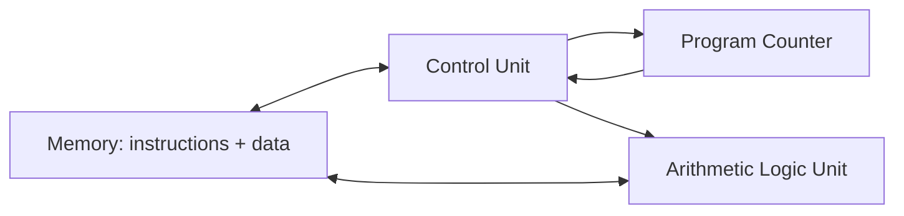

## Von Neumann Architecture Influence on Imperative Languages

### Overview

The von Neumann architecture, first described in a 1945 report by John von Neumann outlining the design of the EDVAC, established a computer model built around a single memory storing both instructions and data, a central processing unit that fetches and executes instructions sequentially, and explicit read/write operations against addressable memory locations. Imperative programming languages — and the broader imperative paradigm of sequential statements, mutable variables, and explicit control flow — are widely understood to have developed in close correspondence with this hardware model, to the extent that the architecture's structural characteristics are frequently cited as directly shaping the conceptual vocabulary of imperative languages.

### Core Components of the Von Neumann Model

**Key Points**

- A single memory store holding both program instructions and data (the "stored-program" concept).
- A central processing unit (CPU) containing an arithmetic-logic unit (ALU) and control unit.
- A program counter tracking the address of the next instruction to execute.
- Sequential instruction fetch-decode-execute cycles.
- Explicit read and write operations against addressable memory locations.



The defining characteristic distinguishing this from earlier computer designs is that instructions and data share the same memory space and are addressed uniformly, meaning a program can, in principle, treat its own instructions as data to be read or modified — a property with deep implications for both the flexibility and the conceptual model of subsequent programming languages.

### The Fetch-Execute Cycle and Sequential Statement Execution

**Key Points**

- The CPU repeatedly fetches an instruction at the address held in the program counter, decodes it, executes it, and advances the program counter.
- This produces an inherently sequential model of computation: one instruction executes, then the next, in an order determined primarily by memory address unless explicitly altered.

Imperative languages mirror this cycle directly in their fundamental execution model: a program is a sequence of statements, executed one after another in order, exactly as the underlying hardware executes a sequence of machine instructions one after another.

```c
int x = 5;
int y = 10;
int sum = x + y;
printf("%d\n", sum);
```

Each line in this C example corresponds conceptually to one or more machine-level operations executed in strict sequence: store a value at an address, store another value at another address, read both, compute, store the result, then invoke output. [Inference] This close correspondence between source-level sequential statements and hardware-level sequential instruction execution is widely regarded as one of the strongest pieces of evidence for direct von Neumann influence on imperative language design, since the statement-by-statement execution model was not an arbitrary language-design choice but a near-direct reflection of how the underlying hardware already operated.

### Mutable Variables as Named Memory Locations

**Key Points**

- A variable in an imperative language corresponds conceptually to a named, addressable memory location that can be read from and written to repeatedly — mirroring the architecture's read/write memory model directly.
- Assignment (`x = x + 1`) is meaningful specifically because the underlying hardware supports overwriting a memory location's contents, discarding the previous value.

```python
counter = 0
counter = counter + 1
counter = counter + 1
print(counter)  # 2
```

The expression `counter = counter + 1` only makes sense as a concept because the machine model permits reading a memory location's current value, computing a new value, and overwriting the same location — an operation with no direct analogue in, for instance, a model of computation without mutable state, such as the lambda calculus, where "variables" denote fixed bindings rather than mutable storage locations. [Inference] This is frequently cited as the central conceptual link between the von Neumann model and imperative languages specifically: the very notion of a "variable" as something that can change value over time, rather than a fixed binding, closely tracks the hardware notion of an addressable memory cell whose contents can be overwritten.

### Explicit Control Flow: Jumps, Loops, and the Program Counter

**Key Points**

- At the machine level, control flow (branching, looping) is implemented by explicitly modifying the program counter — jump and conditional-jump instructions.
- Early imperative languages (notably FORTRAN and BASIC) exposed this directly via the `GOTO` statement, an explicit, unstructured jump to another point in the program.
- Structured programming constructs (`if`/`else`, `while`, `for`) later emerged as higher-level abstractions over the same underlying jump mechanism, restricting arbitrary jumps to well-nested patterns.

Early FORTRAN-style control flow using explicit jumps:

```fortran
10    IF (X .GT. 0) GOTO 30
      X = X + 1
      GOTO 10
30    PRINT *, X
```

This closely mirrors machine-level branching: a conditional jump instruction compares a value and redirects the program counter to a different instruction address, exactly as `GOTO 30` redirects execution to the line labeled `30`. Structured equivalents (as popularized following Edsger Dijkstra's influential critique of unrestricted `GOTO` usage) express the same underlying jump-based control flow through more disciplined syntactic constructs:

```c
while (x <= 0) {
    x = x + 1;
}
printf("%d\n", x);
```

[Inference] Structured control-flow constructs are generally understood as syntactic and disciplinary improvements over raw `GOTO`, intended to make jump-based control flow more readable and less error-prone, rather than as a departure from the underlying jump-based execution model itself — the compiler still typically translates a `while` loop into conditional jump instructions at the machine level.

### The Von Neumann Bottleneck and Its Language-Level Echo

**Key Points**

- The "von Neumann bottleneck," a term popularized by John Backus in his 1977 Turing Award lecture, refers to the limited throughput of the single bus connecting the CPU and memory, which constrains performance regardless of CPU speed since data and instructions must be shuttled through the same channel.
- Backus's lecture specifically argued that conventional imperative languages — which he termed "von Neumann languages" — inherit this bottleneck conceptually: their word-at-a-time, assignment-driven style of computation mirrors the architecture's word-at-a-time data movement, and he proposed functional programming as an alternative less tied to this model.

Backus's critique is a frequently cited historical source for explicitly connecting imperative language design to von Neumann architecture, arguing that assignment statements are essentially "von Neumann bottleneck programming" — each assignment corresponds to moving a single word between the ALU and memory, and a program built from many such assignments reflects the architecture's fundamental data-movement pattern rather than a mathematically motivated model of computation. [Unverified] The precise extent to which Backus's specific terminology ("von Neumann languages") is still actively used in contemporary programming language literature, as opposed to being primarily of historical significance, would need to be checked against current sources rather than assumed.

### Contrast with Non–Von Neumann-Influenced Paradigms

**Key Points**

- Functional programming, rooted in the lambda calculus and Alonzo Church's mathematical model of computation, was developed independently of any specific hardware architecture and emphasizes evaluating expressions rather than executing sequences of state-mutating commands.
- Pure functional languages avoid mutable state and side effects, meaning the notion of a "variable" as an overwritable memory cell — central to imperative languages — does not directly apply in the same way.

```haskell
counter :: Int -> Int
counter n = n + 1

main = print (counter (counter 0))
```

In this Haskell example, `counter` is a mathematical function mapping an input to an output; there is no mutable memory cell being incremented in place, and calling `counter` twice does not "update" any stored value — each call produces a new value from its input. [Inference] The comparative independence of functional programming's theoretical foundation (the lambda calculus, developed in the 1930s, predating electronic stored-program computers) from any specific hardware model is a commonly cited point supporting the broader claim that imperative languages, by contrast, were more directly hardware-influenced — though functional languages are, of course, still ultimately compiled and executed on von Neumann (or von Neumann–derived) hardware in practice, meaning the distinction concerns the conceptual model exposed to the programmer rather than the physical execution substrate.

### Diagram: Correspondence Between Hardware Model and Imperative Constructs

<svg xmlns="http://www.w3.org/2000/svg" viewBox="0 0 900 420">
<text x="450" y="28" text-anchor="middle" font-size="18" font-weight="bold" fill="#1a1a1a">Von Neumann Architecture to Imperative Language Constructs (svg_diagram)</text>
<rect x="50" y="70" width="340" height="310" rx="10" fill="#e8eef7" stroke="#3b5b8c" stroke-width="1.5" />
<text x="220" y="100" text-anchor="middle" font-size="14" font-weight="bold" fill="#1a1a1a">Hardware Model</text>
<rect x="75" y="120" width="290" height="50" rx="6" fill="#ffffff" stroke="#3b5b8c" stroke-width="1" />
<text x="220" y="150" text-anchor="middle" font-size="12" fill="#1a1a1a">Addressable, overwritable memory cells</text>
<rect x="75" y="185" width="290" height="50" rx="6" fill="#ffffff" stroke="#3b5b8c" stroke-width="1" />
<text x="220" y="215" text-anchor="middle" font-size="12" fill="#1a1a1a">Sequential fetch-decode-execute cycle</text>
<rect x="75" y="250" width="290" height="50" rx="6" fill="#ffffff" stroke="#3b5b8c" stroke-width="1" />
<text x="220" y="280" text-anchor="middle" font-size="12" fill="#1a1a1a">Program counter jumps (conditional/unconditional)</text>
<rect x="75" y="315" width="290" height="50" rx="6" fill="#ffffff" stroke="#3b5b8c" stroke-width="1" />
<text x="220" y="345" text-anchor="middle" font-size="12" fill="#1a1a1a">Single shared bus (CPU-memory bottleneck)</text>
<rect x="510" y="70" width="340" height="310" rx="10" fill="#e6f5e9" stroke="#2f8c4a" stroke-width="1.5" />
<text x="680" y="100" text-anchor="middle" font-size="14" font-weight="bold" fill="#1a1a1a">Imperative Language Constructs</text>
<rect x="535" y="120" width="290" height="50" rx="6" fill="#ffffff" stroke="#2f8c4a" stroke-width="1" />
<text x="680" y="150" text-anchor="middle" font-size="12" fill="#1a1a1a">Mutable variables and assignment</text>
<rect x="535" y="185" width="290" height="50" rx="6" fill="#ffffff" stroke="#2f8c4a" stroke-width="1" />
<text x="680" y="215" text-anchor="middle" font-size="12" fill="#1a1a1a">Sequential statement execution</text>
<rect x="535" y="250" width="290" height="50" rx="6" fill="#ffffff" stroke="#2f8c4a" stroke-width="1" />
<text x="680" y="280" text-anchor="middle" font-size="12" fill="#1a1a1a">GOTO, loops, if/else control flow</text>
<rect x="535" y="315" width="290" height="50" rx="6" fill="#ffffff" stroke="#2f8c4a" stroke-width="1" />
<text x="680" y="345" text-anchor="middle" font-size="12" fill="#1a1a1a">Backus's "word-at-a-time" assignment critique</text>
<line x1="365" y1="145" x2="535" y2="145" stroke="#555" stroke-width="1.5" marker-end="url(#arrow)" />
<line x1="365" y1="210" x2="535" y2="210" stroke="#555" stroke-width="1.5" />
<line x1="365" y1="275" x2="535" y2="275" stroke="#555" stroke-width="1.5" />
<line x1="365" y1="340" x2="535" y2="340" stroke="#555" stroke-width="1.5" />
</svg>

### Early Languages Directly Reflecting the Architecture

**Key Points**

- **Assembly language** exposes the von Neumann model almost without abstraction: instructions correspond directly to machine opcodes, and registers/memory addresses are manipulated explicitly.
- **FORTRAN** (1957), among the earliest high-level languages, retained close structural correspondence to sequential machine execution, including explicit `GOTO` and numbered statement labels resembling memory addresses.
- **C** (1972), though higher-level than assembly, is frequently described as a "portable assembly language" precisely because its core model — pointers as addresses, explicit memory access, sequential statements, manual memory management — maps closely onto von Neumann machine semantics.

```asm
MOV R1, #5
MOV R2, #10
ADD R3, R1, R2
STORE R3, [1000]
```

This assembly fragment shows machine-level operations (moving immediate values into registers, adding register contents, storing the result to a memory address) with essentially no abstraction layer between the code and the underlying fetch-execute-store hardware cycle. [Inference] The historical progression from assembly through FORTRAN and C toward higher-level imperative languages is often characterized as a process of adding successive layers of abstraction over the same fundamentally sequential, memory-mutation-based execution model, rather than a departure from that model — a characterization that supports the broader claim of sustained von Neumann influence across the imperative language lineage.

### Object-Oriented Programming as an Extension, Not a Departure

**Key Points**

- Object-oriented languages (C++, Java, Python, C#) retain the imperative core — sequential method bodies, mutable object state, assignment — while adding encapsulation, inheritance, and polymorphism as organizational abstractions layered on top.
- An object's fields are, at the implementation level, still typically addressable memory locations that can be read and overwritten, consistent with the underlying von Neumann model.

```java
class Counter {
    private int value = 0;

    public void increment() {
        this.value = this.value + 1;
    }
}
```

The method body `this.value = this.value + 1` is structurally identical to the earlier procedural assignment examples; object-oriented encapsulation changes how mutable state is organized and accessed (through methods on an object) but does not change the fundamental read-modify-write, sequential-statement execution model inherited from the underlying architecture. [Inference] This is a commonly made observation in language-design discussions: object-oriented programming is generally understood as an organizational and abstraction layer built atop the imperative, von Neumann-influenced execution model, rather than a distinct paradigm independent of it — distinguishing it from paradigms like pure functional programming, which more directly reject the mutable-state model itself.

### Limits and Caveats of the Von Neumann Influence Narrative

**Key Points**

- The claim that imperative languages are "caused by" von Neumann architecture is a widely repeated historical narrative, but the relationship is better understood as a close structural correspondence and mutual reinforcement rather than a strictly linear, one-directional causal chain.
- Modern CPU designs deviate substantially from the simple von Neumann model described in 1945 — including cache hierarchies, out-of-order execution, pipelining, and separate instruction/data caches in a Harvard-influenced modification — while imperative languages have continued largely unchanged in their core conceptual model, indicating the language-level abstraction has become substantially decoupled from precise hardware implementation details.

[Unverified] The exact historical sequence of influence — whether early language designers consciously modeled languages after the architecture, or whether both simply reflected the most natural way to conceptualize the limited-technology stored-program computers of the era — is a matter of historical interpretation better addressed through direct historical scholarship than asserted as settled fact. What is well documented is the structural correspondence itself (sequential execution, mutable addressable state, jump-based control flow) between the architecture and the imperative paradigm, and Backus's own explicit framing of the connection in his widely cited 1977 lecture.

### Conclusion

The von Neumann architecture's core characteristics — a shared memory for instructions and data, sequential fetch-decode-execute cycles, addressable and overwritable memory locations, and jump-based control flow — correspond closely to the foundational constructs of imperative programming languages: sequential statement execution, mutable variables, and explicit control-flow statements such as `GOTO`, `if`/`else`, and loops. This correspondence was made explicit and critically examined by John Backus in his 1977 Turing Award lecture, which described conventional imperative languages as "von Neumann languages" bound to a word-at-a-time, assignment-centric style of computation, and proposed functional programming — rooted in the architecture-independent lambda calculus — as a conceptual alternative. While later paradigms, including structured programming and object-oriented programming, added significant organizational abstraction on top of this foundation, they generally retained rather than replaced the underlying sequential, mutable-state execution model, illustrating the persistence of von Neumann-architecture influence across much of the imperative language lineage even as underlying hardware implementations have grown considerably more complex.

**Related Topics**

- John Backus's 1977 Turing Award lecture and "Can Programming Be Liberated from the von Neumann Style?"
- The lambda calculus as a hardware-independent foundation for functional programming
- Harvard architecture versus von Neumann architecture
- Structured programming and Dijkstra's critique of GOTO
- The stored-program concept and its historical origins (EDVAC report)
- Functional programming's approach to state and immutability
- Assembly language and its relationship to high-level imperative languages
- Object-oriented programming as an abstraction layer over imperative execution
- CPU pipelining, caching, and modern deviations from the simple von Neumann model
- Dataflow and other non-von-Neumann computational models