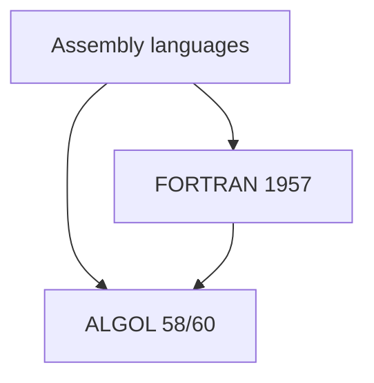
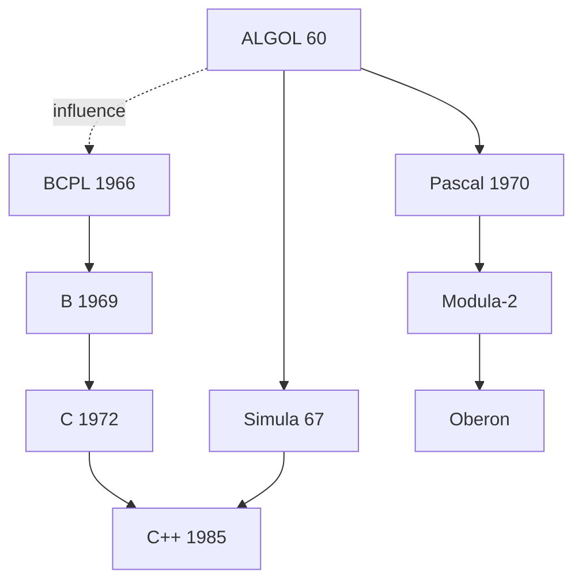
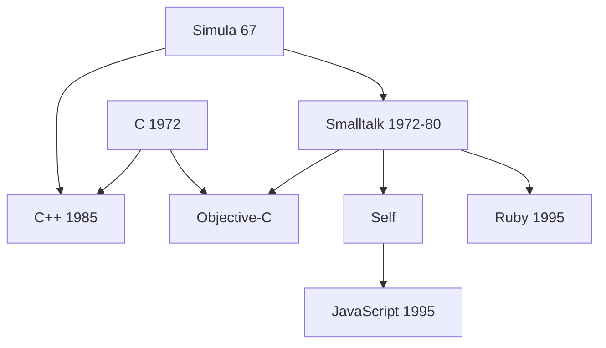
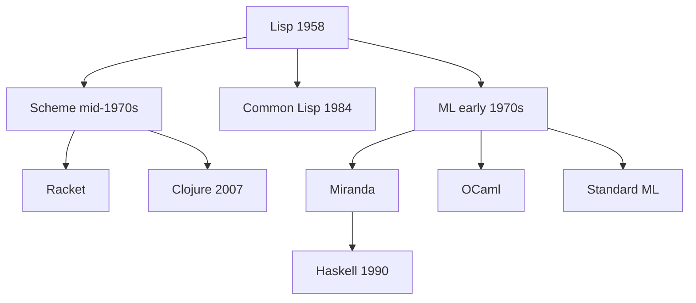
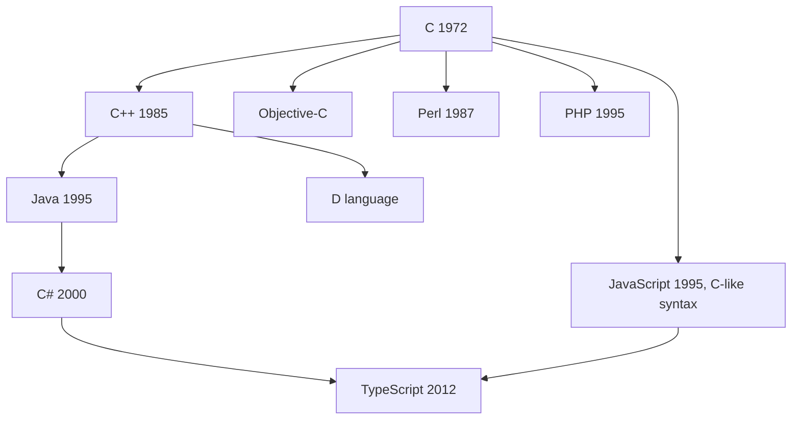
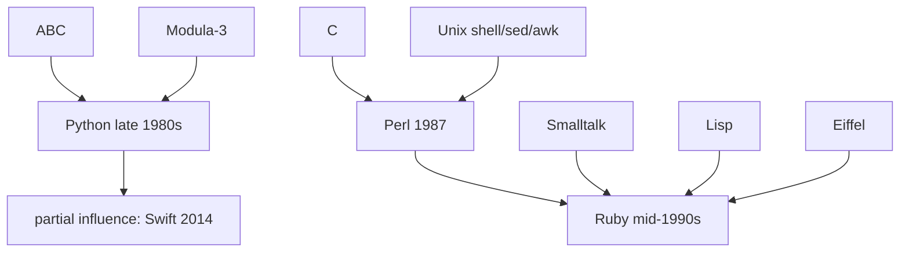

## Historical Language Family Trees

### Purpose and Interpretation of Language Family Trees

A programming language family tree is a diagram or narrative structure showing lineage relationships among languages — which languages directly influenced the design of others, which languages were built as explicit successors or reimplementations, and which independent lineages later converged or cross-pollinated. Unlike biological taxonomy, programming language ancestry is not strictly tree-shaped: a language commonly draws influence from multiple parents simultaneously, making the more accurate structure a directed acyclic graph of influence rather than a strict tree. [Inference] Any family-tree diagram is necessarily a simplification, since language designers typically synthesize ideas from many sources unevenly, and the relative "weight" of a given influence is often a matter of historical interpretation rather than a precisely quantifiable fact.

### The Early Roots: Assembly and FORTRAN

**Key Points**

- Assembly languages (1940s–1950s) provided direct, largely unabstracted control over von Neumann-style hardware and are the practical starting point for nearly all subsequent high-level language lineages.
- FORTRAN (1957), designed by a team led by John Backus at IBM, is widely regarded as the first widely used high-level programming language, targeting scientific and numeric computation.
- ALGOL (1958, revised as ALGOL 60), developed by an international committee, introduced structured block syntax, lexical scoping, and recursive procedures, and is frequently cited as the most influential single ancestor of the broader imperative and procedural language lineage.

### The ALGOL Lineage: Procedural and Structured Languages

**Key Points**

- ALGOL 60's block structure, `begin`/`end` scoping, and formalized syntax (described using Backus-Naur Form, itself named partly for John Backus) directly influenced a large family of subsequent procedural languages.
- COBOL (1959), developed under Grace Hopper's influence for business data processing, drew on some early ALGOL-era ideas but developed largely as a separate, English-like, business-oriented lineage.
- Pascal (1970), designed by Niklas Wirth, was explicitly conceived as a teaching language emphasizing structured programming discipline, directly descended from ALGOL.
- C (1972), designed by Dennis Ritchie at Bell Labs, descended from an earlier language called B (via Ken Thompson), which itself derived from BCPL (Martin Richards, 1966) — a lineage running roughly parallel to, and influenced by, the ALGOL tradition rather than descending directly from it.

The dotted-line influence from ALGOL to BCPL reflects a real but less direct historical relationship compared to the solid direct-descent lines; BCPL's designer drew on structured-programming ideas circulating partly through the ALGOL tradition without BCPL being a direct reimplementation of ALGOL itself.

### The Simula and Smalltalk Lineage: Object-Oriented Roots

**Key Points**

- Simula 67, designed by Ole-Johan Dahl and Kristen Nygaard in Norway, is widely credited as the first language to introduce classes and objects as language constructs, originally in the context of discrete-event simulation.
- Smalltalk (developed at Xerox PARC through the 1970s, principally by Alan Kay, Dan Ingalls, and Adele Goldberg) generalized and popularized object-oriented programming as a comprehensive language philosophy, including concepts like message-passing between objects.
- C++ (Bjarne Stroustrup, early 1980s) combined C's low-level, systems-programming lineage with Simula-derived object-oriented concepts.
- Objective-C combined C with Smalltalk-style messaging syntax and dynamic dispatch.

[Inference] JavaScript's inclusion of prototype-based inheritance, rather than the class-based inheritance more common in the C++/Java branch, is generally attributed to Self's prototype-based object model as a design influence, alongside Scheme's influence on JavaScript's first-class functions — illustrating how a single language can draw from multiple, otherwise fairly distinct, lineages simultaneously.

### The Lisp Lineage: Functional and Symbolic Roots

**Key Points**

- Lisp (John McCarthy, 1958) is among the very oldest high-level languages still in active use in some form, introducing recursion, garbage collection, dynamic typing, and code-as-data (homoiconicity) as foundational concepts, independently of the FORTRAN/ALGOL procedural lineage.
- Scheme (Guy Steele and Gerald Jay Sussman, mid-1970s), a Lisp dialect, emphasized lexical scoping and minimalism.
- ML (Robin Milner and others, early 1970s) introduced a static type system with type inference, seeding a distinct branch of statically typed functional languages.
- Common Lisp (1984) unified numerous divergent Lisp dialects into a single standardized language.

[Inference] The Lisp lineage's influence is frequently described as broader than direct dialect descent alone, since concepts pioneered in Lisp — garbage collection, higher-order functions, recursion as a primary control mechanism, dynamic typing — were subsequently adopted piecemeal into many languages outside the direct Lisp family tree, meaning a strict descent diagram understates Lisp's overall historical influence.

### The C Descendant Explosion

**Key Points**

- C's combination of relatively low-level control with portable, structured high-level syntax led to an unusually large number of direct and indirect descendants across both systems and application programming.
- Java (James Gosling and others, Sun Microsystems, mid-1990s) drew C/C++ syntax while deliberately removing manual memory management (via garbage collection) and multiple inheritance, aiming for platform independence via the JVM.
- C# (Microsoft, early 2000s), designed partly by Anders Hejlsberg, drew heavily on Java's design while integrating ideas from Delphi (also an Hejlsberg design) and later functional-programming features.
- Perl, PHP, and JavaScript each adopted C-like curly-brace syntax while developing largely independent semantic models suited to text processing and web scripting respectively.

### The Scripting and Dynamic Language Cluster

**Key Points**

- Python (Guido van Rossum, late 1980s–1991) drew on ABC (a teaching language emphasizing readability), Modula-3, and Lisp-influenced functional constructs, while introducing significant whitespace as a syntax feature.
- Ruby (Yukihiro Matsumoto, mid-1990s) explicitly synthesized influences from Perl, Smalltalk, Lisp, and Eiffel, aiming for a language optimized for programmer happiness and expressiveness.
- Perl (Larry Wall, 1987) drew heavily on C, shell scripting (sed/awk/sh), and Unix text-processing conventions.

### Consolidated Overview Diagram

<svg xmlns="http://www.w3.org/2000/svg" viewBox="0 0 900 520">
<text x="450" y="26" text-anchor="middle" font-size="18" font-weight="bold" fill="#1a1a1a">Simplified Programming Language Lineage Overview (svg_diagram)</text>
<rect x="380" y="50" width="140" height="36" rx="6" fill="#f0f0f0" stroke="#555" stroke-width="1.5" />
<text x="450" y="73" text-anchor="middle" font-size="12" fill="#1a1a1a">Assembly</text>
<rect x="200" y="110" width="130" height="36" rx="6" fill="#e8eef7" stroke="#3b5b8c" stroke-width="1.5" />
<text x="265" y="133" text-anchor="middle" font-size="12" fill="#1a1a1a">FORTRAN (1957)</text>
<rect x="380" y="110" width="140" height="36" rx="6" fill="#e8eef7" stroke="#3b5b8c" stroke-width="1.5" />
<text x="450" y="133" text-anchor="middle" font-size="12" fill="#1a1a1a">ALGOL 60</text>
<rect x="580" y="110" width="130" height="36" rx="6" fill="#fff6e0" stroke="#a8842f" stroke-width="1.5" />
<text x="645" y="133" text-anchor="middle" font-size="12" fill="#1a1a1a">Lisp (1958)</text>
<rect x="290" y="180" width="120" height="36" rx="6" fill="#e8eef7" stroke="#3b5b8c" stroke-width="1.5" />
<text x="350" y="203" text-anchor="middle" font-size="12" fill="#1a1a1a">Pascal</text>
<rect x="430" y="180" width="120" height="36" rx="6" fill="#e6f5e9" stroke="#2f8c4a" stroke-width="1.5" />
<text x="490" y="203" text-anchor="middle" font-size="12" fill="#1a1a1a">Simula 67</text>
<rect x="580" y="180" width="130" height="36" rx="6" fill="#fff6e0" stroke="#a8842f" stroke-width="1.5" />
<text x="645" y="203" text-anchor="middle" font-size="12" fill="#1a1a1a">Scheme / ML</text>
<rect x="80" y="250" width="120" height="36" rx="6" fill="#fbe7e7" stroke="#b03a3a" stroke-width="1.5" />
<text x="140" y="273" text-anchor="middle" font-size="12" fill="#1a1a1a">BCPL / B</text>
<rect x="220" y="250" width="120" height="36" rx="6" fill="#fbe7e7" stroke="#b03a3a" stroke-width="1.5" />
<text x="280" y="273" text-anchor="middle" font-size="12" fill="#1a1a1a">C (1972)</text>
<rect x="430" y="250" width="120" height="36" rx="6" fill="#e6f5e9" stroke="#2f8c4a" stroke-width="1.5" />
<text x="490" y="273" text-anchor="middle" font-size="12" fill="#1a1a1a">Smalltalk</text>
<rect x="580" y="250" width="130" height="36" rx="6" fill="#fff6e0" stroke="#a8842f" stroke-width="1.5" />
<text x="645" y="273" text-anchor="middle" font-size="12" fill="#1a1a1a">Haskell / OCaml</text>
<rect x="220" y="320" width="120" height="36" rx="6" fill="#fbe7e7" stroke="#b03a3a" stroke-width="1.5" />
<text x="280" y="343" text-anchor="middle" font-size="12" fill="#1a1a1a">C++ (1985)</text>
<rect x="80" y="390" width="120" height="36" rx="6" fill="#fbe7e7" stroke="#b03a3a" stroke-width="1.5" />
<text x="140" y="413" text-anchor="middle" font-size="12" fill="#1a1a1a">Java (1995)</text>
<rect x="220" y="390" width="120" height="36" rx="6" fill="#fbe7e7" stroke="#b03a3a" stroke-width="1.5" />
<text x="280" y="413" text-anchor="middle" font-size="12" fill="#1a1a1a">C# (2000)</text>
<rect x="360" y="390" width="120" height="36" rx="6" fill="#fbe7e7" stroke="#b03a3a" stroke-width="1.5" />
<text x="420" y="413" text-anchor="middle" font-size="12" fill="#1a1a1a">JavaScript</text>
<rect x="500" y="390" width="120" height="36" rx="6" fill="#e6f5e9" stroke="#2f8c4a" stroke-width="1.5" />
<text x="560" y="413" text-anchor="middle" font-size="12" fill="#1a1a1a">Python / Ruby</text>
<rect x="290" y="460" width="130" height="36" rx="6" fill="#f0f0f0" stroke="#555" stroke-width="1.5" />
<text x="355" y="483" text-anchor="middle" font-size="12" fill="#1a1a1a">Kotlin / Swift / Rust</text>
<line x1="450" y1="86" x2="265" y2="110" stroke="#999" stroke-width="1" />
<line x1="450" y1="86" x2="450" y2="110" stroke="#999" stroke-width="1" />
<line x1="450" y1="146" x2="350" y2="180" stroke="#999" stroke-width="1" />
<line x1="450" y1="146" x2="490" y2="180" stroke="#999" stroke-width="1" />
<line x1="645" y1="146" x2="645" y2="180" stroke="#999" stroke-width="1" />
<line x1="140" y1="286" x2="280" y2="250" stroke="#999" stroke-width="1" />
<line x1="280" y1="286" x2="280" y2="320" stroke="#999" stroke-width="1" />
<line x1="490" y1="216" x2="280" y2="320" stroke="#999" stroke-width="1" />
<line x1="280" y1="356" x2="140" y2="390" stroke="#999" stroke-width="1" />
<line x1="280" y1="356" x2="280" y2="390" stroke="#999" stroke-width="1" />
<line x1="280" y1="356" x2="420" y2="390" stroke="#999" stroke-width="1" />
<line x1="140" y1="426" x2="355" y2="460" stroke="#999" stroke-width="1" />
<line x1="280" y1="426" x2="355" y2="460" stroke="#999" stroke-width="1" />
<line x1="560" y1="426" x2="355" y2="460" stroke="#999" stroke-width="1" />
</svg>

### Timeline Reference Table

| Decade | Notable Languages | Primary Contributions |
| --- | --- | --- |
| 1950s | FORTRAN, Lisp, COBOL, ALGOL | High-level syntax, recursion, block structure, business data processing |
| 1960s | BCPL, Simula 67, BASIC | Objects/classes, simplified teaching syntax, portable systems programming roots |
| 1970s | C, Pascal, Smalltalk, ML, Prolog | Systems programming, structured programming, OOP formalization, logic programming, static type inference |
| 1980s | C++, Common Lisp, Erlang, Perl | Multi-paradigm OOP, Lisp standardization, concurrency-oriented design, text processing |
| 1990s | Python, Ruby, Java, JavaScript, Haskell | Readability-focused scripting, platform-independent OOP, web scripting, pure functional programming |
| 2000s | C#, Scala, Go | Managed OOP ecosystems, JVM-hosted functional/OOP hybrid, simplicity-focused concurrency |
| 2010s | Rust, Swift, Kotlin, TypeScript | Memory safety without garbage collection, modern Apple-ecosystem language, JVM interop, typed JavaScript superset |

### Recurring Patterns Across Lineages

**Key Points**

- **Convergent adoption of features**: garbage collection, first-class functions, and pattern matching each originated in one lineage (Lisp, functional languages respectively) and were later adopted across otherwise unrelated lineages (Java's garbage collection, JavaScript's first-class functions, C#/Rust's pattern matching), illustrating that feature adoption crosses lineage boundaries far more freely than syntax does.
- **Reaction-driven design**: many influential languages were explicitly designed as a reaction against a perceived flaw in a predecessor — Pascal against unstructured BASIC/FORTRAN GOTO usage, Java against C++'s complexity and manual memory management, Go against perceived complexity in C++ and Java, Rust against memory-safety issues in C/C++.
- **Multi-parent synthesis becoming the norm over time**: earlier languages (FORTRAN, Lisp, COBOL) drew from comparatively few prior sources, while later languages (Scala, Kotlin, Swift, Rust) typically synthesize ideas deliberately and explicitly from multiple, sometimes quite distinct, lineages (functional and object-oriented, static typing with type inference, systems-level control with high-level ergonomics).

[Inference] This shift toward explicit multi-lineage synthesis in later language design is often attributed to the field's growing shared vocabulary of well-understood, previously validated language features (garbage collection, closures, pattern matching, type inference) which later designers could draw upon directly rather than needing to independently reinvent, though the precise causal weighting of this factor versus others (available tooling, hardware capability growth, changing application domains) is a matter of historical interpretation rather than settled fact.

### Conclusion

Historical programming language family trees are best understood as directed graphs of influence rather than strict biological-style trees, since most influential languages — from C++ through Python to Rust — deliberately synthesize ideas from multiple, often quite distinct, prior lineages rather than descending cleanly from a single parent. Three broad root lineages are commonly identified: the ALGOL/procedural tradition (feeding into Pascal, C, and eventually C++, Java, and C#), the Lisp/functional tradition (feeding into Scheme, ML, Haskell, and influencing dynamic-language features far outside its direct lineage), and the Simula/Smalltalk object-oriented tradition (feeding into C++, Objective-C, and Ruby). Recurring historical patterns — convergent adoption of individual features across otherwise unrelated lineages, and explicit reaction-driven design against a predecessor's perceived shortcomings — appear repeatedly across this history, and are frequently more informative for understanding language evolution than any single strict lineage diagram alone.

**Related Topics**

- ALGOL 60's influence on Backus-Naur Form and formal grammar specification
- The Lisp family: Scheme, Common Lisp, Clojure, and Racket
- Object-oriented programming's Simula and Smalltalk origins
- Functional programming's ML/Haskell lineage and the Hindley-Milner type system
- Convergent evolution of language features (garbage collection, closures, pattern matching)
- Reaction-driven language design (Go versus C++/Java, Rust versus C/C++)
- The Unix and C ecosystem's influence on scripting languages
- Multi-paradigm languages and cross-lineage feature synthesis
- Bytecode-targeted languages and the JVM/.NET CLR ecosystems
- Esoteric and research languages outside mainstream lineages (APL, Forth, Prolog)