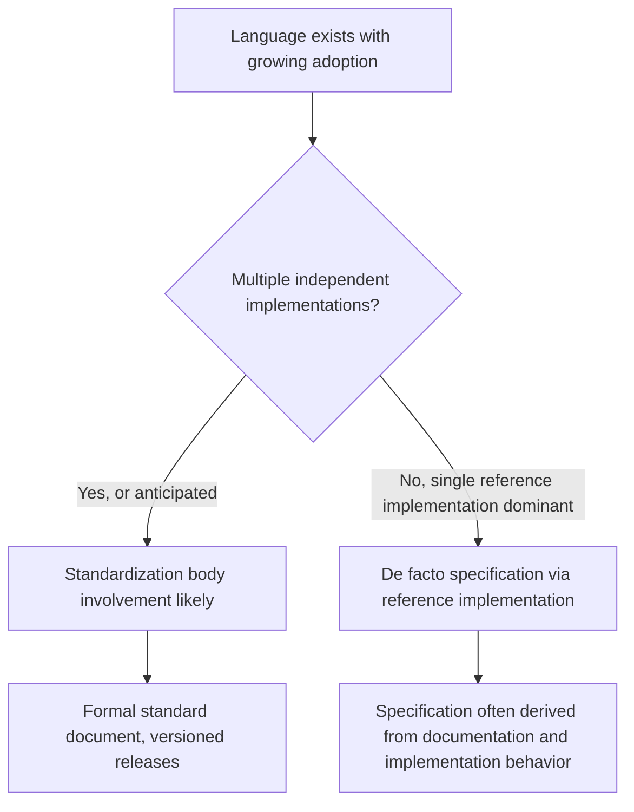
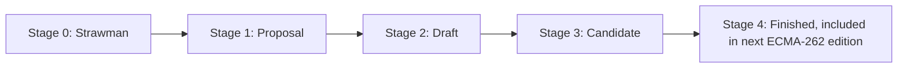

## Standardization Bodies and Language Specifications

### Purpose of Language Standardization

Language standardization is the process by which a programming language's syntax, semantics, and often its standard library are formally documented and ratified by a recognized body, producing a specification that implementations can be measured against. Standardization serves several distinct purposes: enabling multiple independent, interoperable implementations (compilers, interpreters) of the same language; providing a stable contract that code written today will continue to behave predictably under future compliant implementations; and giving vendors, governments, and large organizations assurance that a language is not controlled unilaterally by a single commercial entity.

### Why Some Languages Standardize and Others Do Not

**Key Points**

- Formal standardization is common for languages with broad, multi-vendor implementation ecosystems (C, C++, ECMAScript/JavaScript) or with roots in academic/government procurement requirements (Ada, COBOL, Fortran).
- Many widely used languages remain deliberately unstandardized by a formal international body, instead governed by a single reference implementation and a de facto specification (Python, Ruby, Go, Rust as of common practice).
- [Inference] The decision to formally standardize is generally driven less by a language's technical maturity and more by whether multiple independent, potentially competing implementations exist or are anticipated — formal standardization is primarily valuable as a coordination mechanism between otherwise independent implementers, which is less necessary when one implementation is treated as canonical by the community.



### ISO and ANSI: General-Purpose Standards Bodies

**Key Points**

- The International Organization for Standardization (ISO) publishes formal international standards across many technical domains, including several major programming languages.
- The American National Standards Institute (ANSI) historically played a leading role in early standardization of several languages (notably C), with many ANSI standards later adopted or harmonized with corresponding ISO standards.
- ISO standards for programming languages are typically developed within ISO/IEC JTC 1 (Joint Technical Committee 1, a collaboration between ISO and the International Electrotechnical Commission), specifically its subcommittee SC 22, which covers programming languages, their environments, and system software interfaces.

**C**

C was first formally standardized as ANSI X3.159-1989 (commonly called "ANSI C" or "C89"), later adopted with minor changes as ISO/IEC 9899:1990 ("C90"). Subsequent revisions include C99, C11, C17, and C23, each an ISO/IEC 9899 revision maintained by the ISO working group WG14.

```c
/* Example reflecting C99-introduced features */
#include <stdio.h>

int main(void) {
    for (int i = 0; i < 5; i++) {  // C99: declaration inside for-loop
        printf("%d\n", i);
    }
    return 0;
}
```

Declaring a loop variable directly inside a `for` statement, as shown here, was not permitted under strict C89 and was introduced as a standardized feature in C99 — illustrating how standard revisions formally ratify syntax that may have existed as a non-standard vendor extension beforehand.

**C++**

C++ is standardized by ISO/IEC 14882, maintained by ISO working group WG21. Major revisions are informally named by year: C++98, C++03, C++11, C++14, C++17, C++20, and C++23, with C++11 widely regarded as a particularly significant revision introducing move semantics, lambda expressions, and the `auto` keyword.

```cpp
// C++11 example: lambda expression and auto
auto add = [](int a, int b) { return a + b; };
auto result = add(3, 4);
```

### The ECMA Model: ECMAScript and the TC39 Process

**Key Points**

- ECMA International (originally the European Computer Manufacturers Association) standardizes ECMAScript, the specification underlying JavaScript, as ECMA-262.
- Standardization is carried out by Technical Committee 39 (TC39), composed of representatives from major browser vendors and other stakeholders (Google, Mozilla, Apple, Microsoft, and others), operating through a staged proposal process.
- TC39's staged process (Stage 0 through Stage 4) is notable among language standardization processes for its transparency and its requirement that features generally have at least two independent implementations before reaching the final stage.



A feature at Stage 3 has a complete specification and at least some implementations, but implementers are advised it may still change before Stage 4 finalization. [Inference] This staged, implementation-feedback-driven approach is frequently cited as a notable departure from more purely document-first standardization processes, since it formally incorporates real-world implementation experience as a gating requirement before a feature is finalized, rather than ratifying a specification first and expecting implementations to follow.

### Language-Specific Standards Bodies and Processes

**Python (PEPs — Python Enhancement Proposals)**

Python has no formal ISO or ECMA standard; instead, its evolution is governed by Python Enhancement Proposals (PEPs), design documents proposing new features, processes, or informational guidance, reviewed historically by Guido van Rossum as "Benevolent Dictator For Life" (a role he stepped back from in 2018) and subsequently by an elected Python Steering Council.

```plaintext
PEP 8   — Style Guide for Python Code
PEP 484 — Type Hints
PEP 572 — Assignment Expressions (the "walrus operator")
PEP 703 — Making the Global Interpreter Lock Optional
```

CPython, the original and most widely used Python implementation, functions as the de facto reference implementation; other implementations (PyPy, Jython, IronPython) are expected to match CPython's observable behavior in the absence of a separate formal specification document.

**Java (JCP — Java Community Process)**

Java's evolution is governed by the Java Community Process (JCP), through Java Specification Requests (JSRs), historically overseen by Sun Microsystems and subsequently Oracle following its 2010 acquisition of Sun. The JCP includes an Executive Committee with representatives from multiple organizations, giving Java standardization a more formally multi-stakeholder structure than Python's PEP process, while still differing from ISO/ECMA models in that it remains closely tied to and historically controlled by a single corporate steward.

**Rust (RFC process)**

Rust language changes proceed through a public RFC (Request for Comments) process, with proposals reviewed by language teams and, for significant changes, requiring broad community discussion before acceptance. Rust has no ISO or ECMA-style formal standard; the Rust reference and the rustc compiler's behavior serve as the practical specification, [Unverified] though efforts toward a more formal specification (such as the Ferrocene specification, developed partly for safety-critical and regulatory contexts) exist and their exact current scope and adoption status should be checked against current sources.

**Go**

Go's specification is maintained directly by the Go team (originally at Google) as a relatively concise, continuously updated language specification document, without routing through an external standards body; Go's design process for proposals uses a public GitHub-based proposal review process rather than a formal external committee.

### Ada: A Standardization Process Rooted in Government Procurement

**Key Points**

- Ada was developed in the late 1970s under a U.S. Department of Defense-sponsored competition specifically to consolidate the hundreds of different programming languages then in use across defense software projects into a single standardized language.
- Ada is standardized as ANSI/MIL-STD-1815 and subsequently as ISO/IEC 8652, with revisions known as Ada 83, Ada 95 (notable as the first ISO-standardized object-oriented language), Ada 2005, Ada 2012, and Ada 2022.

[Inference] Ada's standardization history is frequently cited as an unusually strong illustration of standardization driven primarily by procurement and interoperability requirements — the U.S. government's explicit goal of reducing language proliferation across defense contractors — rather than by organic multi-vendor market competition, which is the more common driver behind standards like C or ECMAScript.

### COBOL and Fortran: Early Formal Standardization

**Key Points**

- COBOL was standardized by ANSI beginning in 1968 (and subsequently by ISO), driven substantially by the U.S. federal government's requirement that computer vendors supply COBOL compilers to be eligible for government contracts.
- Fortran has been standardized through successive ANSI/ISO revisions since 1966 (FORTRAN 66), including FORTRAN 77, Fortran 90, Fortran 95, Fortran 2003, Fortran 2008, and Fortran 2018.

[Inference] COBOL's early and unusually strong standardization push is often attributed to a specific historical episode — the U.S. government's 1960s-era leverage over vendor compiler offerings via procurement requirements — making it, alongside Ada, a notable example of government procurement policy as a direct driver of formal language standardization, distinct from the multi-vendor market coordination that motivated later standards like C or ECMAScript.

### Comparison of Standardization Models

| Language | Standardizing Body | Process Name | Formal ISO/ANSI Standard? |
| --- | --- | --- | --- |
| C | ISO/IEC JTC1 SC22 WG14 | Working group revisions | Yes (ISO/IEC 9899) |
| C++ | ISO/IEC JTC1 SC22 WG21 | Working group revisions | Yes (ISO/IEC 14882) |
| JavaScript | ECMA International | TC39 staged proposals | Yes (ECMA-262) |
| Ada | ISO/IEC JTC1 SC22 | Working group revisions | Yes (ISO/IEC 8652) |
| COBOL | ANSI, later ISO | Committee revisions | Yes |
| Fortran | ANSI, later ISO | Committee revisions | Yes |
| Python | Python Software Foundation | PEP process | No formal ISO/ANSI standard |
| Java | Oracle (formerly Sun) | Java Community Process (JSRs) | No formal ISO/ANSI standard |
| Rust | Rust Project | RFC process | No formal ISO/ANSI standard (Ferrocene exists for safety-critical use) |
| Go | Go team | GitHub proposal process | No formal ISO/ANSI standard |

### Diagram: Standardization Process Models Compared

<svg xmlns="http://www.w3.org/2000/svg" viewBox="0 0 900 400">
<text x="450" y="26" text-anchor="middle" font-size="18" font-weight="bold" fill="#1a1a1a">Three Models of Language Governance (svg_diagram)</text>
<rect x="40" y="60" width="260" height="300" rx="10" fill="#e8eef7" stroke="#3b5b8c" stroke-width="1.5" />
<text x="170" y="90" text-anchor="middle" font-size="13" font-weight="bold" fill="#1a1a1a">Formal ISO/ANSI Model</text>
<text x="170" y="120" text-anchor="middle" font-size="11" fill="#1a1a1a">C, C++, Ada, COBOL, Fortran</text>
<text x="170" y="150" text-anchor="middle" font-size="11" fill="#1a1a1a">Multi-vendor working groups</text>
<text x="170" y="175" text-anchor="middle" font-size="11" fill="#1a1a1a">Formal document-first process</text>
<text x="170" y="200" text-anchor="middle" font-size="11" fill="#1a1a1a">Versioned, dated standards</text>
<text x="170" y="225" text-anchor="middle" font-size="11" fill="#1a1a1a">National/international body role</text>
<text x="170" y="260" text-anchor="middle" font-size="11" font-style="italic" fill="#1a1a1a">Strongest legal/procurement</text>
<text x="170" y="278" text-anchor="middle" font-size="11" font-style="italic" fill="#1a1a1a">recognition</text>
<rect x="320" y="60" width="260" height="300" rx="10" fill="#fff6e0" stroke="#a8842f" stroke-width="1.5" />
<text x="450" y="90" text-anchor="middle" font-size="13" font-weight="bold" fill="#1a1a1a">Industry Consortium Model</text>
<text x="450" y="120" text-anchor="middle" font-size="11" fill="#1a1a1a">JavaScript (TC39), Java (JCP)</text>
<text x="450" y="150" text-anchor="middle" font-size="11" fill="#1a1a1a">Multi-stakeholder committees</text>
<text x="450" y="175" text-anchor="middle" font-size="11" fill="#1a1a1a">Staged/implementation-informed</text>
<text x="450" y="200" text-anchor="middle" font-size="11" fill="#1a1a1a">Faster iteration than ISO model</text>
<text x="450" y="225" text-anchor="middle" font-size="11" fill="#1a1a1a">Vendor representation-based</text>
<text x="450" y="260" text-anchor="middle" font-size="11" font-style="italic" fill="#1a1a1a">Balances speed with</text>
<text x="450" y="278" text-anchor="middle" font-size="11" font-style="italic" fill="#1a1a1a">multi-vendor coordination</text>
<rect x="600" y="60" width="260" height="300" rx="10" fill="#e6f5e9" stroke="#2f8c4a" stroke-width="1.5" />
<text x="730" y="90" text-anchor="middle" font-size="13" font-weight="bold" fill="#1a1a1a">Reference-Implementation Model</text>
<text x="730" y="120" text-anchor="middle" font-size="11" fill="#1a1a1a">Python, Rust, Go, Ruby</text>
<text x="730" y="150" text-anchor="middle" font-size="11" fill="#1a1a1a">Single canonical implementation</text>
<text x="730" y="175" text-anchor="middle" font-size="11" fill="#1a1a1a">Community RFC/PEP-style process</text>
<text x="730" y="200" text-anchor="middle" font-size="11" fill="#1a1a1a">Fastest iteration speed</text>
<text x="730" y="225" text-anchor="middle" font-size="11" fill="#1a1a1a">No external body approval needed</text>
<text x="730" y="260" text-anchor="middle" font-size="11" font-style="italic" fill="#1a1a1a">Specification effectively</text>
<text x="730" y="278" text-anchor="middle" font-size="11" font-style="italic" fill="#1a1a1a">defined by implementation behavior</text>
</svg>

### Reading a Formal Specification: Structure and Conventions

**Key Points**

- Formal specifications typically define lexical grammar (tokens), syntactic grammar (valid program structure, often in a BNF/EBNF variant), and semantics (the meaning and required behavior of syntactically valid programs), frequently as separate sections or annexes.
- Specifications commonly distinguish **implementation-defined behavior** (behavior left to the implementation's choice but which must be documented and consistent) from **undefined behavior** (behavior the standard imposes no requirements on whatsoever, permitting an implementation to do anything, including behavior a programmer would consider incorrect).

```c
int x;
int y = x + 1;  // reading uninitialized x: undefined behavior in C
```

Reading an uninitialized automatic variable's value, as `x` here, is a commonly cited example of undefined behavior in the C standard: the standard does not require any particular resulting value or even consistent behavior, and different compilers, optimization levels, or even repeated runs may produce different observable results. [Inference] This distinction between undefined and implementation-defined behavior is frequently identified as one of the more consequential and commonly misunderstood aspects of reading formal language specifications, since many real-world bugs and security vulnerabilities in C and C++ specifically trace back to code inadvertently relying on undefined behavior that happened to "work" under a particular compiler and optimization setting, without being guaranteed to continue working.

### Standardization's Practical Effects

**Key Points**

- **Multiple compliant implementations**: formally standardized languages like C and C++ have multiple independent, competing compiler implementations (GCC, Clang/LLVM, MSVC, and others) that are expected to conform to the same standard, enabling meaningful cross-compiler portability.
- **Conformance testing**: formal standards are sometimes accompanied by conformance test suites intended to verify whether a given implementation correctly follows the specification (e.g., Test262 for ECMAScript, maintained collaboratively as part of the TC39 ecosystem).
- **Slower, more conservative evolution**: [Inference] the multi-stakeholder review and formal ratification process typical of ISO/ANSI and consortium-based standardization generally produces a slower rate of language evolution compared to single-implementation, community-RFC-driven languages, since changes must satisfy the interests and implementation constraints of multiple independent parties rather than a single governing team — though this trade-off is often framed positively, as slower evolution can also mean greater backward-compatibility stability for existing code.

### Conclusion

Programming language standardization spans a spectrum from formal, multi-decade ISO/ANSI processes (C, C++, Ada, COBOL, Fortran) rooted historically in either genuine multi-vendor market coordination or, in cases like Ada and COBOL, explicit government procurement requirements, through industry-consortium models like ECMAScript's TC39 that balance formal rigor with implementation-driven, staged proposal review, to reference-implementation-governed languages (Python, Rust, Go) that forgo formal external standardization entirely in favor of faster, community-RFC-driven iteration around a single canonical implementation. Reading and understanding a formal specification requires attention to its distinct treatment of defined, implementation-defined, and undefined behavior — a distinction with substantial practical consequences, particularly in systems languages like C and C++. The choice of standardization model for a given language generally reflects the specific historical and market conditions under which that language emerged, rather than any single universally superior governance approach.

**Related Topics**

- ISO/IEC JTC1 SC22 working groups and their language-specific committees
- TC39's staged proposal process and Test262 conformance testing
- Undefined behavior, implementation-defined behavior, and unspecified behavior in language specifications
- Python's PEP process and the Python Steering Council
- The Java Community Process (JCP) and Java Specification Requests (JSRs)
- Ada's origins in U.S. Department of Defense procurement policy
- Reference implementations versus formal specifications as sources of language truth
- Conformance test suites and their role in multi-implementation ecosystems
- Backward compatibility policies across standardized versus reference-implementation languages
- The Ferrocene specification and formal specification efforts for safety-critical Rust