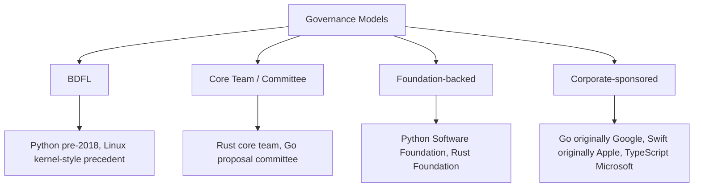
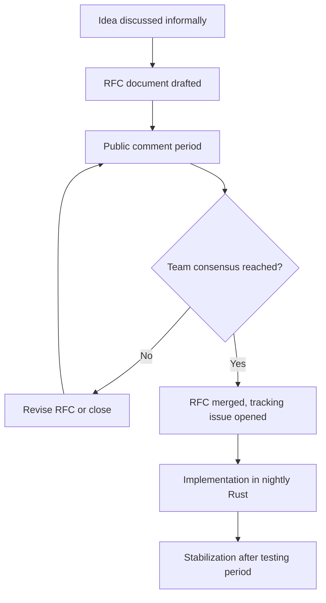
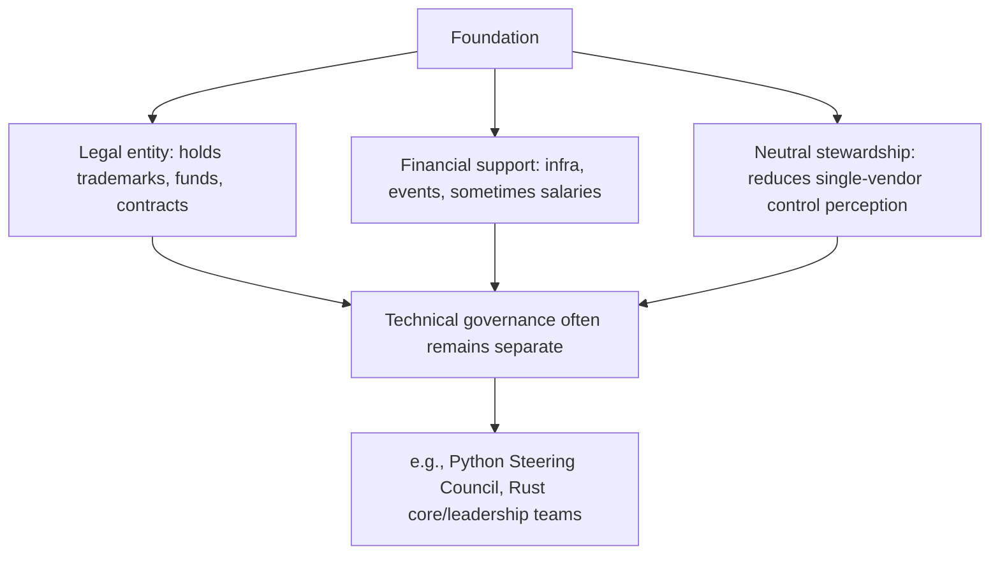
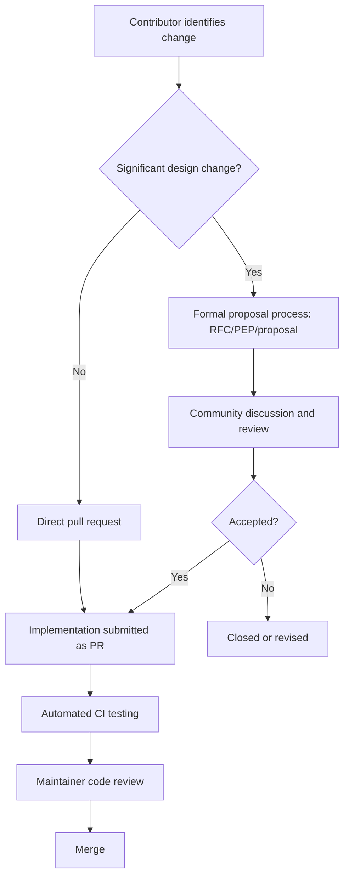

## Open Source Language Development Models

### Overview

An open source language development model refers to the governance structure, contribution process, and decision-making mechanisms by which a programming language's source code, specification, and evolution are managed as an open, publicly accessible project. Unlike closed, single-vendor language development, open source models must address distinctive coordination challenges: how outside contributors propose changes, who holds final decision authority, how consensus (or the absence of it) is resolved, and how commercial and volunteer contributors coexist within the same governance structure.

### Common Governance Structures

**Key Points**

- **Benevolent Dictator For Life (BDFL)** — a single individual, typically the language's original creator, holds ultimate authority over design decisions, with community input but no binding vote.
- **Core team / steering committee** — a small group of maintainers collectively holds decision authority, often through some form of voting or consensus process.
- **Foundation-backed governance** — a nonprofit foundation provides legal, financial, and organizational infrastructure, sometimes holding trademark rights and formal decision authority, sometimes operating primarily as a neutral steward while technical decisions remain with a separate technical committee.
- **Corporate-sponsored open source** — a single company originates and continues to substantially fund and steer the language's development, while making the source code and specification publicly available under an open license.

### The BDFL Model: Python's Historical Example

**Key Points**

- Python operated under a BDFL model with Guido van Rossum holding final authority over accepted or rejected language changes from Python's creation in 1991 until 2018.
- Van Rossum stepped down from the BDFL role in 2018, following community disagreement over PEP 572 (the assignment expression / "walrus operator" proposal), leading to the creation of the Python Steering Council as a replacement governance structure.
- The Python Steering Council consists of five elected members serving fixed terms, replacing single-person authority with a small elected committee while retaining the PEP process for proposing and documenting changes.

[Inference] The BDFL model's principal advantage is generally understood to be decisive, consistent design direction free of prolonged committee deadlock, while its principal risk — illustrated concretely by the circumstances of van Rossum's 2018 departure — is that language evolution becomes dependent on a single individual's availability, judgment, and standing within the community, creating a succession and legitimacy risk that formal committee structures are specifically designed to mitigate.

### The RFC (Request for Comments) Process: Rust as a Detailed Example

**Key Points**

- Rust's RFC process requires substantial language or standard-library changes to be proposed as a written RFC document, publicly discussed, and reviewed by the relevant subject-area team before acceptance.
- Rust's governance is distributed across multiple specialized teams (language team, compiler team, library team, and others), each with authority over RFCs within its domain, rather than concentrated in a single individual or committee covering all decisions.
- The process is designed to surface disagreement and edge cases publicly before a change is implemented, trading slower iteration speed for broader community visibility and buy-in.

[Inference] The RFC model's emphasis on public, written justification before implementation is frequently cited as producing higher-quality, more thoroughly vetted design decisions relative to informally discussed changes, at the cost of a generally slower path from initial idea to shipped feature — a trade-off explicitly accepted as part of Rust's stated design philosophy around stability and careful evolution.

### The Proposal Process: Go's Model

**Key Points**

- Go's language changes are proposed through GitHub issues following a defined proposal template and lifecycle, reviewed by a small group with authority historically concentrated among Go's original designers (Robert Griesemer, Rob Pike, Ken Thompson) and subsequently a broader core team as the project matured.
- Go has historically maintained an unusually strong emphasis on simplicity and backward compatibility (formalized in the Go 1 Compatibility Promise), resulting in a notably conservative rate of language-level change compared to many contemporaries.
- The addition of generics in Go 1.18 (2022) is frequently cited as an example of an unusually long-deliberated language change, having been publicly discussed and debated for several years before acceptance.

[Inference] Go's comparatively slow and conservative evolution is widely attributed to a deliberate design philosophy prioritizing simplicity, tooling stability, and long-term backward compatibility over rapid feature accumulation, rather than to any structural limitation of its proposal process itself — meaning Go's pace of change reflects an explicit governance value choice, not merely a governance mechanism difference from faster-moving peers.

### Foundation-Backed Governance

**Key Points**

- Language foundations typically provide legal entity status (enabling the project to hold funds, trademarks, and enter contracts), financial support (funding infrastructure, events, sometimes core developer salaries), and a degree of vendor-neutral governance intended to reassure adopters that the language is not unilaterally controlled by a single company.
- The Python Software Foundation (PSF) holds trademark rights to "Python" and provides financial and organizational support, while day-to-day technical governance remains separate, held by the Python Steering Council and the broader PEP process.
- The Rust Foundation, established in 2021 with founding corporate members including AWS, Google, Microsoft, Mozilla, and Huawei, was created explicitly to provide organizational and legal infrastructure independent of any single sponsoring company, following Rust's origins as a Mozilla-incubated project.
- The Linux Foundation hosts numerous language-adjacent and infrastructure projects under a similar neutral-stewardship model, though this extends beyond programming languages specifically into broader open source infrastructure.

### Corporate-Sponsored Open Source Languages

**Key Points**

- Some widely used open source languages originated within, and remain substantially steered by, a single corporate sponsor, even while accepting external contributions and operating under an open license.
- Go originated at Google and remains primarily developed by Google-employed engineers, though its governance has incorporated broader community proposal review over time.
- Swift originated at Apple and was open-sourced in 2015; its evolution proceeds through the Swift Evolution process, a public proposal review system, while Apple retains substantial influence, particularly regarding platform integration priorities.
- TypeScript originated at and remains primarily developed by Microsoft, with its design process (of comparable openness to Go's proposal process) publicly documented but final decisions generally resting with the Microsoft-led core team.
- Kotlin originated at and remains primarily developed by JetBrains, with additional stewardship input from the Kotlin Foundation (a joint effort between JetBrains and Google) established particularly in connection with Kotlin's role as an officially supported Android language.

[Inference] Corporate-sponsored open source languages generally offer faster, more resourced development than purely volunteer-driven projects, given dedicated engineering staff funded by the sponsoring company, but this arrangement also concentrates practical decision-making influence with the sponsoring company's priorities even when the formal license and contribution process are fully open — a trade-off between development velocity/resourcing and genuinely distributed governance control that is commonly discussed in open source governance literature, though the degree to which any specific project's community input meaningfully shapes outcomes independent of the sponsoring company varies by project and would need case-by-case assessment rather than a general rule.

### Contribution Workflow Patterns

**Key Points**

- Most open source languages follow some variant of: fork/branch, implement change, submit for review (pull request or patch), automated testing (continuous integration), human review by maintainers, and merge.
- Larger or more impactful changes (new syntax, breaking changes, standard library additions) typically require a more elaborate process (RFC, PEP, Go proposal) before implementation work begins, while smaller changes (bug fixes, minor optimizations, documentation) often proceed through a lighter-weight direct pull-request review process.
- Continuous integration (CI) testing against the language's own test suite is nearly universal practice in modern open source language development, automatically verifying that proposed changes do not break existing behavior before human review is finalized.

### Licensing Considerations

**Key Points**

- Open source language implementations are released under specific licenses (e.g., Python under the PSF License, Rust under a dual MIT/Apache-2.0 license, Go under a BSD-style license) that govern how the source code itself may be used, modified, and redistributed.
- Licensing choice is a distinct concern from governance model — a language can have fully open, permissive licensing while retaining relatively centralized, corporate-controlled decision-making authority, and conversely, a strong multi-stakeholder governance process does not by itself determine license terms.
- [Unverified] Specific current license terms for any given language implementation should be verified against the project's official repository or documentation, since license choices can occasionally change (e.g., through relicensing efforts) and should not be assumed to remain fixed indefinitely.

### Comparison Table

| Language | Origin | Governance Model | Foundation Involvement | Primary Proposal Mechanism |
| --- | --- | --- | --- | --- |
| Python | Guido van Rossum, 1991 | Elected Steering Council (post-2018) | Python Software Foundation | PEP process |
| Rust | Mozilla-incubated, 2010 | Distributed team-based governance | Rust Foundation | RFC process |
| Go | Google, 2009 | Core team, historically founder-led | None dedicated (Google-stewarded) | GitHub proposal process |
| Swift | Apple, 2014 | Core team with community proposal review | Swift.org (Apple-led) | Swift Evolution process |
| TypeScript | Microsoft, 2012 | Microsoft-led core team | None dedicated | Design meeting notes, public issue discussion |
| Kotlin | JetBrains, 2011 | JetBrains-led with Kotlin Foundation input | Kotlin Foundation (JetBrains + Google) | KEEP (Kotlin Evolution and Enhancement Process) |
| Elixir | José Valim, 2012 | Founder-led core team | None dedicated | GitHub issue/proposal discussion |

### Diagram: Governance Model Spectrum

<svg xmlns="http://www.w3.org/2000/svg" viewBox="0 0 900 300">
<text x="450" y="26" text-anchor="middle" font-size="18" font-weight="bold" fill="#1a1a1a">Centralized to Distributed Governance Spectrum (svg_diagram)</text>
<line x1="80" y1="150" x2="820" y2="150" stroke="#555" stroke-width="2" />
<polygon points="820,150 810,144 810,156" fill="#555" />
<text x="120" y="180" font-size="12" fill="#1a1a1a">More centralized</text>
<text x="700" y="180" font-size="12" fill="#1a1a1a">More distributed</text>
<circle cx="140" cy="150" r="6" fill="#b03a3a" />
<text x="140" y="120" text-anchor="middle" font-size="12" fill="#1a1a1a">TypeScript</text>
<text x="140" y="105" text-anchor="middle" font-size="10" fill="#555">(corporate-led)</text>
<circle cx="280" cy="150" r="6" fill="#b03a3a" />
<text x="280" y="120" text-anchor="middle" font-size="12" fill="#1a1a1a">Swift</text>
<text x="280" y="105" text-anchor="middle" font-size="10" fill="#555">(Apple-steered)</text>
<circle cx="420" cy="150" r="6" fill="#a8842f" />
<text x="420" y="120" text-anchor="middle" font-size="12" fill="#1a1a1a">Go</text>
<text x="420" y="105" text-anchor="middle" font-size="10" fill="#555">(Google core team)</text>
<circle cx="560" cy="150" r="6" fill="#a8842f" />
<text x="560" y="120" text-anchor="middle" font-size="12" fill="#1a1a1a">Python</text>
<text x="560" y="105" text-anchor="middle" font-size="10" fill="#555">(elected council)</text>
<circle cx="700" cy="150" r="6" fill="#2f8c4a" />
<text x="700" y="120" text-anchor="middle" font-size="12" fill="#1a1a1a">Rust</text>
<text x="700" y="105" text-anchor="middle" font-size="10" fill="#555">(distributed teams)</text>

<text x="450" y="230" text-anchor="middle" font-size="11" fill="#555">Placement reflects general governance structure emphasis;</text>

<text x="450" y="248" text-anchor="middle" font-size="11" fill="#555">exact positioning is illustrative, not a precise or authoritative ranking</text>

</svg>

### Tensions and Trade-offs in Open Source Language Governance

**Key Points**

- **Speed versus consensus**: single-decision-maker or small-team models generally iterate faster; broader consensus-driven or foundation-mediated models generally produce more widely vetted but slower-moving decisions.
- **Commercial influence versus community control**: corporate-sponsored languages benefit from dedicated engineering resources but raise legitimate questions about how much genuine influence external, non-employee contributors hold over strategic direction.
- **Backward compatibility commitments**: formal governance processes (Go 1 Compatibility Promise, Rust's stability-without-stagnation principle) are often explicitly codified as governance policy, not merely informal practice, precisely because breaking changes have outsized costs across a large, decentralized user base.
- **Succession and continuity risk**: BDFL and founder-led models face an inherent question of what happens if the founding individual becomes unavailable, unwilling to continue, or loses community confidence, as illustrated concretely by Python's 2018 governance transition.

### Conclusion

Open source programming language development spans a range of governance models — from Python's historical BDFL structure (now succeeded by an elected Steering Council) through Rust's distributed, team-based RFC process, to corporate-sponsored languages like Go, Swift, and TypeScript that retain substantial internal-company decision authority even while operating under open licenses and accepting public contributions. These models are not merely bureaucratic variations; they reflect differing trade-offs between decision speed, breadth of community input, resourcing and development velocity, and long-term continuity and succession risk. Foundation-backed structures (the Python Software Foundation, the Rust Foundation, the Kotlin Foundation) typically address legal, financial, and neutral-stewardship needs as a layer separate from day-to-day technical governance, illustrating that formal organizational backing and actual decision-making authority are related but distinct dimensions of a language's overall open source development model.

**Related Topics**

- The Python Steering Council and the 2018 PEP 572 governance transition
- Rust's team-based governance structure and the RFC process in detail
- The Go proposal process and the Go 1 Compatibility Promise
- Corporate open source stewardship versus vendor lock-in concerns
- Software foundations as legal and organizational structures (Apache Software Foundation as a broader comparison)
- Continuous integration practices in large open source language projects
- Licensing models for open source language implementations (MIT, Apache 2.0, BSD, PSF License)
- Community consensus-building mechanisms in distributed open source projects
- Fork governance: what happens when a community disagrees with core maintainers
- Corporate sponsorship models and engineer allocation in open source language teams