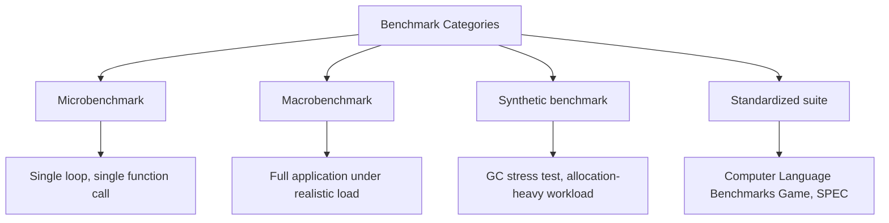
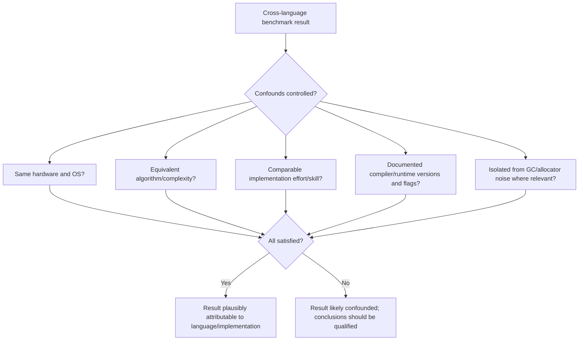

## Benchmarking and Performance Comparison Methods


### Purpose and Scope

Benchmarking in the context of programming languages refers to the systematic measurement of runtime performance, memory usage, compilation speed, or other quantifiable characteristics of language implementations, typically for the purpose of comparison — between languages, between implementations of the same language, or across versions of the same implementation over time. Because performance depends on an unusually large number of interacting factors (the specific workload, hardware, compiler/interpreter version, optimization settings, and measurement methodology itself), rigorous benchmarking is a methodologically demanding discipline, and poorly designed benchmarks are a frequent source of misleading conclusions in public discourse about language performance.

### Categories of Benchmarks

**Key Points**

- **Microbenchmarks** — measure the performance of a small, isolated operation (a single function call, a loop, an arithmetic operation) in tight repetition.
- **Macrobenchmarks / application benchmarks** — measure performance of a complete, realistic application or representative workload (a web server under load, a compiler compiling a real codebase).
- **Synthetic benchmarks** — artificial workloads designed specifically to stress a particular capability (e.g., garbage collector throughput, string concatenation) rather than to represent realistic application behavior.
- **Standardized benchmark suites** — curated collections of benchmark programs intended to provide broadly comparable, reproducible results across implementations (e.g., the Computer Language Benchmarks Game, SPEC benchmark suites).



### Why Microbenchmarks Are Especially Error-Prone

**Key Points**

- Modern compilers and just-in-time (JIT) runtimes perform aggressive optimizations — dead code elimination, constant folding, loop unrolling — that can eliminate the very code a microbenchmark intends to measure if the result is never actually used ("dead code elimination" invalidating the benchmark).
- JIT-compiled languages (Java, C#, JavaScript engines like V8) exhibit a "warm-up" period during which the runtime is still profiling and optimizing code, meaning early-iteration measurements reflect interpreted or minimally optimized execution rather than steady-state performance.
- CPU-level effects — cache warming, branch predictor state, out-of-order execution — mean that a freshly started, isolated loop may not reflect the performance characteristics of the same code running within a larger, realistic program.

```java
// A naive, methodologically flawed microbenchmark
long start = System.nanoTime();
int sum = 0;
for (int i = 0; i < 1000; i++) {
    sum += i * i;
}
long elapsed = System.nanoTime() - start;
System.out.println(elapsed);
```

This example illustrates several common flaws simultaneously: the loop count is small enough that JIT warm-up dominates the measurement; `sum` is computed but never used beyond printing elapsed time, meaning an aggressive optimizer could legally eliminate the loop entirely; and a single measurement provides no information about variance across repeated runs. [Inference] The gap between naively written and methodologically sound microbenchmarks is widely regarded as one of the most common sources of misleading performance claims in informal language comparisons, which is why dedicated benchmarking frameworks (rather than hand-rolled timing code) are generally recommended for any microbenchmark intended to support a real conclusion.

### Dedicated Microbenchmarking Frameworks

**Key Points**

- Frameworks such as JMH (Java Microbenchmark Harness) for the JVM, BenchmarkDotNet for .NET, Google Benchmark for C++, and `criterion` for Rust are specifically designed to address the pitfalls above: they include automatic warm-up phases, multiple measurement iterations with statistical reporting, and safeguards against dead-code elimination (such as explicitly "consuming" a computed result through a blackhole mechanism).

```java
// Conceptual JMH-style benchmark structure (illustrative, not complete syntax)
@Benchmark
public int sumOfSquares(Blackhole blackhole) {
    int sum = 0;
    for (int i = 0; i < 1000; i++) {
        sum += i * i;
    }
    blackhole.consume(sum);
    return sum;
}
```

The `Blackhole.consume(...)` call in JMH-style frameworks exists specifically to prevent the JIT compiler from recognizing that `sum`'s value is unused and eliminating the computation entirely — a direct, purpose-built countermeasure against the dead-code-elimination pitfall described above. [Inference] The existence of dedicated tooling specifically designed to counteract measurement artifacts is itself informative: it reflects an accumulated, well-documented understanding within the performance-engineering community that naive timing code reliably produces misleading results on modern optimizing compilers and JIT runtimes.

### Statistical Rigor in Benchmarking

**Key Points**

- A single timing measurement is generally considered insufficient; repeated measurements (often dozens to hundreds of iterations) allow reporting of central tendency (mean, median) alongside variance (standard deviation, percentiles).
- Percentile reporting (p50/median, p95, p99) is often more informative than mean alone for latency-sensitive workloads, since mean can be skewed by a small number of outlier measurements while percentiles better characterize typical versus worst-case behavior.
- Statistical significance testing (comparing whether an observed difference between two implementations exceeds what could plausibly arise from measurement noise alone) is a recommended but frequently omitted step in informal benchmark comparisons.

$$\bar{x} = \frac{1}{n}\sum_{i=1}^{n} x_i \qquad s = \sqrt{\frac{1}{n-1}\sum_{i=1}^{n}(x_i - \bar{x})^2}$$

The sample mean $\bar{x}$ and sample standard deviation $s$ (using Bessel's correction, the $n-1$ denominator, which corrects for the bias of estimating variance from a sample rather than a full population) are the minimal summary statistics generally expected when reporting benchmark results with any claim to rigor, since a mean reported alone provides no indication of measurement variability or reliability.

### Confounding Variables in Cross-Language Comparisons

**Key Points**

- **Hardware differences** — CPU architecture, cache sizes, memory bandwidth, and thermal throttling behavior can all materially affect results and must be held constant (same machine, same run conditions) for a valid comparison.
- **Implementation maturity and optimization effort** — comparing a heavily hand-optimized implementation in one language against a naively written implementation in another measures programmer effort and implementation quality at least as much as it measures the languages themselves.
- **Algorithm equivalence** — ensuring that compared implementations use genuinely equivalent algorithms (same time complexity, same approach) rather than allowing one language's implementation to benefit from an algorithmically superior approach the comparison did not intend to test.
- **Compiler/runtime version and flags** — optimization level (`-O2` versus `-O0` in C/C++, JIT tiering configuration in JVM/CLR languages) substantially affects results and must be documented and held consistent for comparisons to be meaningful.
- **Standard library and runtime overhead** — some benchmarks inadvertently measure garbage collector behavior, memory allocator characteristics, or standard library implementation quality rather than core language performance characteristics per se.



[Inference] The prevalence of uncontrolled confounding variables is widely regarded as the primary reason informal, publicly circulated "language X is faster than language Y" benchmarks should generally be treated with substantial skepticism unless the methodology, source code, hardware, and versions are fully disclosed and appear to have controlled for the factors above.

### Standardized and Public Benchmark Suites

**Key Points**

- The **Computer Language Benchmarks Game** publishes source code and results for the same small set of algorithmic tasks (e.g., n-body simulation, spectral norm, regex matching) implemented across many languages, with full source code publicly available for inspection.
- **SPEC (Standard Performance Evaluation Corporation)** benchmark suites (e.g., SPECint, SPECfp) are widely used in hardware and compiler performance evaluation, though they are not language-comparison-focused specifically and are more commonly used to compare compiler optimization quality or CPU performance within a fixed language (frequently C/C++ or Fortran).
- **TechEmpower Web Framework Benchmarks** compare web framework and language runtime performance under simulated HTTP load across a large number of frameworks and languages, focusing on realistic request/response workloads rather than isolated computational kernels.

[Inference] Even well-known public benchmark suites carry acknowledged methodological limitations — the Computer Language Benchmarks Game, for instance, has been widely discussed as reflecting implementation authors' varying skill and optimization effort across submissions at least as much as it reflects intrinsic language performance ceilings, since submissions are contributed by different individuals with varying expertise and motivation rather than produced under a single controlled methodology — a limitation the project's own documentation has historically acknowledged to varying degrees.

### Compilation Speed and Developer-Experience Benchmarks

**Key Points**

- Beyond runtime execution speed, compilation/build time is itself a commonly benchmarked characteristic, particularly relevant for developer iteration speed in large codebases.
- Metrics include cold build time (full project build from a clean state), incremental build time (rebuild after a small change), and time-to-first-useful-feedback (e.g., time until a linter or type-checker reports the first error).
- [Inference] Compilation-speed benchmarking faces comparable methodological challenges to runtime benchmarking — codebase size and structure, caching behavior, incremental compilation configuration, and hardware all substantially affect results — meaning single-number claims about "language X compiles faster than language Y" require similar scrutiny regarding methodology as runtime performance claims.

### Memory Usage Benchmarking

**Key Points**

- Memory benchmarks commonly measure peak resident set size (RSS), heap allocation patterns, and garbage collection pause characteristics (frequency, duration, and their distribution across percentiles) rather than a single static memory figure.
- Languages with automatic memory management (garbage-collected languages) introduce additional measurement complexity, since memory usage and pause behavior depend substantially on GC algorithm choice, heap size configuration, and allocation rate of the specific workload — not solely on the language's design.
- Comparing memory usage between a garbage-collected language and a manually managed or ownership-based language (e.g., Java versus Rust) requires care in interpreting results, since the languages make fundamentally different trade-offs (throughput versus determinism, programmer effort versus automatic reclamation) that a single memory-footprint number does not fully capture.

### Presenting Benchmark Results Responsibly

**Key Points**

- Disclosing full methodology — hardware specification, compiler/runtime versions and flags, operating system, exact source code, number of iterations, and statistical treatment — is widely regarded as a minimum requirement for a benchmark result to be evaluated or reproduced by others.
- Reporting variance alongside central tendency (error bars, standard deviation, or percentile ranges) rather than a single point estimate communicates measurement reliability more honestly than a bare average.
- Framing conclusions narrowly to the specific workload and conditions tested, rather than generalizing broadly ("language X is faster than language Y" from a single microbenchmark), is considered good practice, since a benchmark's results are strictly valid only for the specific workload, hardware, and implementation versions actually tested.

### Diagram: Sound Benchmark Design Process

<svg xmlns="http://www.w3.org/2000/svg" viewBox="0 0 900 380">
<text x="450" y="26" text-anchor="middle" font-size="18" font-weight="bold" fill="#1a1a1a">Sound Benchmark Design Checklist (svg_diagram)</text>
<rect x="50" y="60" width="380" height="280" rx="10" fill="#e6f5e9" stroke="#2f8c4a" stroke-width="1.5" />
<text x="240" y="90" text-anchor="middle" font-size="14" font-weight="bold" fill="#1a1a1a">Do</text>
<text x="80" y="120" font-size="12" fill="#1a1a1a">• Use a dedicated benchmarking framework</text>
<text x="80" y="150" font-size="12" fill="#1a1a1a">• Include a warm-up phase for JIT runtimes</text>
<text x="80" y="180" font-size="12" fill="#1a1a1a">• Repeat measurements; report variance</text>
<text x="80" y="210" font-size="12" fill="#1a1a1a">• Prevent dead-code elimination artifacts</text>
<text x="80" y="240" font-size="12" fill="#1a1a1a">• Fix hardware, OS, versions, and flags</text>
<text x="80" y="270" font-size="12" fill="#1a1a1a">• Disclose full methodology and source</text>
<text x="80" y="300" font-size="12" fill="#1a1a1a">• Scope conclusions to the tested workload</text>
<rect x="470" y="60" width="380" height="280" rx="10" fill="#fbe7e7" stroke="#b03a3a" stroke-width="1.5" />
<text x="660" y="90" text-anchor="middle" font-size="14" font-weight="bold" fill="#1a1a1a">Avoid</text>
<text x="500" y="120" font-size="12" fill="#1a1a1a">• Hand-rolled timing with a single run</text>
<text x="500" y="150" font-size="12" fill="#1a1a1a">• Ignoring JIT warm-up effects</text>
<text x="500" y="180" font-size="12" fill="#1a1a1a">• Reporting only a mean with no variance</text>
<text x="500" y="210" font-size="12" fill="#1a1a1a">• Comparing mismatched algorithms</text>
<text x="500" y="240" font-size="12" fill="#1a1a1a">• Mixing hardware or undocumented flags</text>
<text x="500" y="270" font-size="12" fill="#1a1a1a">• Withholding source code or setup details</text>
<text x="500" y="300" font-size="12" fill="#1a1a1a">• Generalizing beyond the tested case</text>
</svg>

### Worked Illustration: Interpreting a Comparison Table

| Language/Runtime | Task | Mean Time (ms) | Std. Dev. (ms) | Notes |
| --- | --- | --- | --- | --- |
| Language A, impl. v1 | N-body simulation, n=1,000,000 | 850 | 12 | Single-threaded, `-O3` |
| Language B, impl. v1 | N-body simulation, n=1,000,000 | 1,240 | 340 | Single-threaded, default flags |
| Language C, impl. v1 | N-body simulation, n=1,000,000 | 910 | 18 | Single-threaded, JIT warm-up excluded |

**Example**

Reading this hypothetical table responsibly involves several observations: Language B's very large standard deviation (340 ms against a mean of 1,240 ms) suggests either measurement instability, insufficient warm-up, or genuine workload-dependent variance, and this result should be treated with more caution than Languages A and C, whose smaller standard deviations suggest more stable, reproducible measurements. The note that Language B used "default flags" while Language A used `-O3` (an explicit optimization flag) is itself a confound: the comparison may be measuring optimization-flag choice as much as intrinsic language performance, and a fairer comparison would use comparably optimized configurations for all three, or explicitly disclose and control for this difference as an intentional variable under study.

### Conclusion

Benchmarking and cross-language performance comparison is a methodologically demanding discipline in which naive approaches — single-run hand-rolled timing code, uncontrolled hardware or compiler-flag differences, and comparisons of mismatched algorithms or implementation effort — reliably produce misleading conclusions, even when conducted with good intentions. Sound practice involves using dedicated benchmarking frameworks purpose-built to counteract JIT warm-up and dead-code-elimination artifacts, reporting statistical variance alongside central tendency rather than a single point estimate, explicitly controlling and disclosing confounding variables (hardware, compiler/runtime versions, optimization flags, algorithmic equivalence), and scoping conclusions narrowly to the specific workload and conditions actually tested rather than generalizing broadly about "which language is faster." Standardized public benchmark suites such as the Computer Language Benchmarks Game and TechEmpower provide useful reference points but carry their own acknowledged methodological limitations, reinforcing that any single benchmark result should generally be treated as one data point within a broader, carefully qualified picture rather than a definitive, general-purpose verdict on language performance.

**Related Topics**

- JIT compilation and warm-up effects in managed runtimes
- Dead-code elimination and compiler optimization pitfalls in microbenchmarking
- Statistical methods for performance measurement (percentiles, significance testing)
- Garbage collection algorithms and their effect on latency/throughput benchmarks
- The Computer Language Benchmarks Game and its methodological critiques
- SPEC benchmark suites and hardware/compiler performance evaluation
- TechEmpower web framework benchmarks and realistic workload testing
- Ahead-of-time versus just-in-time compilation performance characteristics
- Big O complexity analysis versus empirical wall-clock benchmarking
- Reproducibility and open methodology in computer systems research