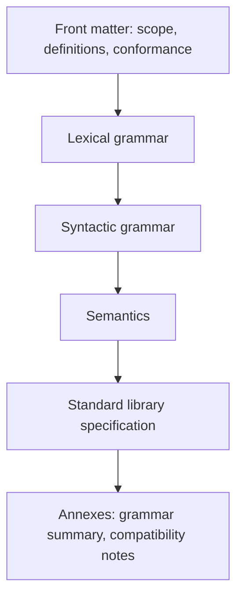
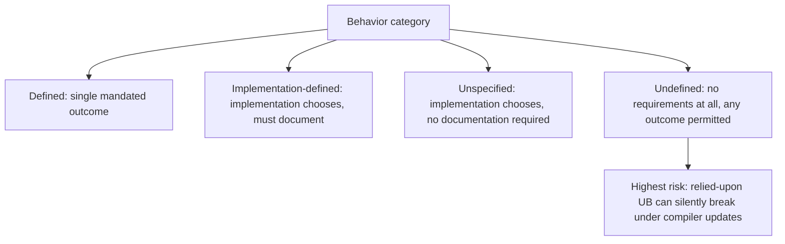
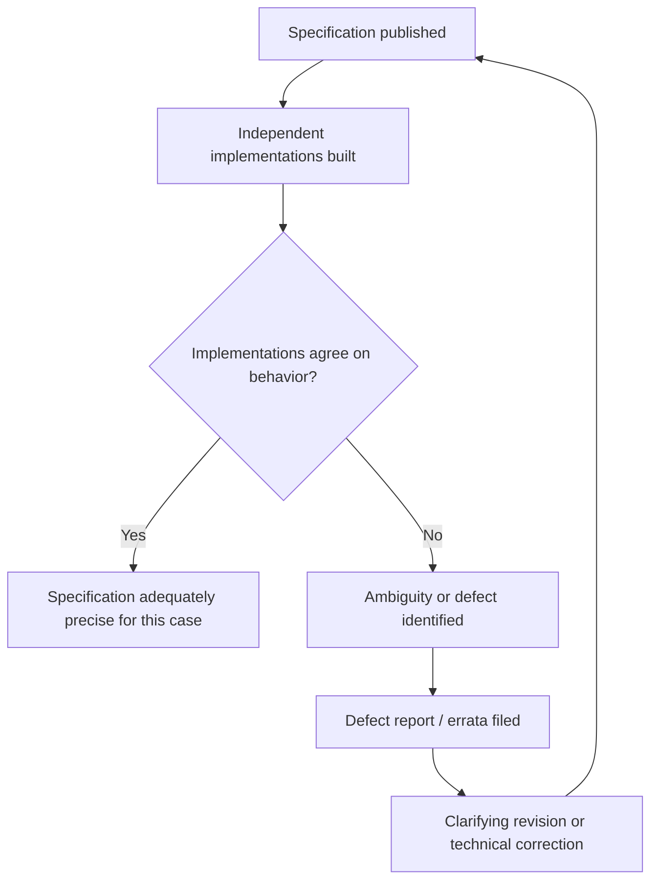

## Reading and Evaluating Language Specification Documents

### Purpose and Audience

A language specification document formally describes a programming language's syntax, semantics, and (often) standard library behavior with enough precision that independent implementers can produce compatible, interoperable implementations. Specifications are written for a distinct audience from tutorials or reference manuals: primarily compiler/interpreter implementers, standards-committee members, and advanced practitioners resolving edge-case questions — not beginners learning the language. Recognizing this intended audience is foundational to reading a specification productively, since specifications deliberately trade the pedagogical clarity of a tutorial for the precision and completeness needed to eliminate ambiguity.

### Structural Anatomy of a Typical Specification

**Key Points**

- **Front matter** — scope, normative references, conformance requirements, and definitions of terms used precisely and consistently throughout the document.
- **Lexical grammar** — rules defining how raw source text is tokenized (identifiers, literals, keywords, whitespace and comment handling).
- **Syntactic grammar** — rules (typically in a BNF/EBNF variant) defining which sequences of tokens constitute valid program structure.
- **Semantics** — the meaning and required runtime behavior of syntactically valid constructs, often the largest and most prose-heavy section.
- **Standard library specification** — for languages that specify one, the required behavior of built-in types, functions, and modules.
- **Annexes/appendices** — often containing grammar summaries, compatibility notes, deprecated feature lists, or implementation-defined behavior catalogs.



### Reading Grammar Notation

**Key Points**

- Most specifications express syntax using a variant of Backus-Naur Form (BNF) or Extended BNF (EBNF), with notational conventions that differ slightly between specifications and must be checked against that document's own conventions section.
- Common EBNF conventions: `::=` or `:` for "is defined as," `|` for alternation, `[...]` or `?` for optional elements, `{...}` or `*` for zero-or-more repetition, and terminal symbols typically shown in a distinct typeface or quoted.

A representative EBNF fragment, using conventions similar to those in several language specifications:

```plaintext
if_statement ::= "if" "(" expression ")" statement
               [ "else" statement ]

expression   ::= term { ("+" | "-") term }

term         ::= factor { ("*" | "/") factor }

factor       ::= identifier | number | "(" expression ")"
```

Reading this grammar: an `if_statement` requires the literal keyword `if`, a parenthesized `expression`, a `statement`, and optionally (indicated by the square brackets) an `else` clause with another `statement`. The `expression` rule shows left-associative repetition — a `term` followed by zero or more `+`/`-` operations against further `term`s — which is how EBNF commonly encodes operator associativity and precedence without needing separate prose explanation, though some specifications supplement grammar with explicit prose precedence tables for clarity.

### Distinguishing Categories of Specified Behavior

**Key Points**

- **Defined behavior** — behavior the specification precisely and completely determines; any conforming implementation must produce the specified result.
- **Implementation-defined behavior** — behavior left to the implementation's discretion, but which the implementation must choose consistently and document (e.g., the exact size of `int` in certain C contexts prior to fixed-width integer types).
- **Unspecified behavior** — behavior where the specification permits a range of outcomes without requiring the implementation to document its specific choice, distinct from implementation-defined behavior in that no documentation obligation exists.
- **Undefined behavior** — behavior for which the specification imposes no requirements whatsoever, permitting any outcome, including behavior a programmer would consider clearly incorrect or unsafe.



**Example**

In the C standard, the evaluation order of function arguments is classically cited as unspecified behavior: `f(g(), h())` does not require the specification to determine whether `g()` or `h()` is called first, and different compilers may legitimately differ, but there is no requirement that a given compiler must document which order it uses (contrasting with implementation-defined behavior's documentation requirement). Meanwhile, signed integer overflow (`INT_MAX + 1` for a signed `int`) is a commonly cited case of undefined behavior in C: the standard imposes no requirement whatsoever on the result, and modern optimizing compilers are legally permitted to assume signed overflow never occurs, sometimes producing surprising results if a program's correctness inadvertently depended on wraparound behavior. [Inference] Failing to distinguish these four categories is widely regarded as one of the most consequential misreadings of a specification, since code that appears to "work" under undefined behavior is not thereby guaranteed correct — a distinction that has caused real, documented security vulnerabilities in systems languages when optimizer behavior changed between compiler versions.

### Conformance and Normative Language

**Key Points**

- Specifications typically use precisely defined keywords — often following conventions similar to IETF RFC 2119 ("MUST," "SHALL," "SHOULD," "MAY," "MUST NOT") — to distinguish mandatory conformance requirements from recommendations or optional permissions.
- A "conforming implementation" is generally defined explicitly within the specification's front matter, often distinguishing strictly conforming programs (using only specified, portable features) from conforming implementations (correctly implementing all mandatory behavior while potentially offering additional extensions).
- Specifications frequently distinguish "normative" content (the actual binding requirements) from "non-normative" or "informative" content (explanatory notes, examples, rationale) that clarifies intent but does not itself impose requirements — a distinction critical for correctly interpreting which parts of the document are legally/technically binding on an implementation.

[Inference] Confusing informative examples or explanatory notes with normative requirements is a plausible and commonly cautioned-against misreading, since specifications often explicitly label illustrative examples as non-normative precisely to prevent implementers from treating a particular example's specific behavior as a binding requirement beyond what the normative prose actually mandates.

### Evaluating a Specification's Precision and Completeness

**Key Points**

- A well-constructed specification should, in principle, allow two independent teams with no communication between them to produce implementations that agree on the observable behavior of any program the specification covers — sometimes informally described as the "two independent implementations" test of specification quality.
- Ambiguity in a specification is generally revealed empirically when independent implementations diverge in behavior for the same input under a plain reading of the document, prompting errata, clarifying revisions, or formal defect reports.
- Standards bodies typically maintain a formal defect-report or errata process (e.g., ISO/IEC defect reports for C++, TC39's process for ECMAScript editorial and technical corrections) through which discovered ambiguities or inconsistencies are tracked and resolved in subsequent revisions.



### Reading Semantics Sections: Operational vs. Denotational Style

**Key Points**

- **Operational semantics** describes meaning by specifying an abstract machine or step-by-step execution model — how a program's state changes as execution proceeds — and is the most common style in mainstream language specifications (C, C++, Java, ECMAScript).
- **Denotational semantics** describes meaning by mapping language constructs to mathematical objects (functions between domains), a style more common in academic formal-methods literature and in specifications for smaller, research-oriented languages than in mainstream industrial specifications.
- **Axiomatic semantics** describes meaning through logical assertions about program state before and after execution (pre-conditions and post-conditions), most commonly encountered in formal verification contexts rather than general-purpose language specifications.

[Unverified] The specific semantic style used by any given specification, and the degree of formality with which it is applied, varies considerably between documents and should be checked directly against that specification's own introductory material rather than assumed from the language's general reputation, since even mainstream specifications vary in how rigorously they apply their chosen style throughout.

### Common Difficulties When Reading Specifications

**Key Points**

- **Terminology precision** — specifications frequently assign precise, narrow technical meanings to ordinary-sounding words (e.g., "object," "value," "type," "expression") that differ subtly from colloquial programming usage, and failing to consult the definitions section is a common source of misreading.
- **Forward and backward cross-references** — a single behavioral question is often answered only by combining requirements scattered across multiple, non-adjacent sections, requiring the reader to actively trace cross-references rather than expecting a single self-contained passage.
- **Grammar ambiguity resolved by prose** — some grammars are formally ambiguous (most famously, the C++ "most vexing parse" and the dangling-else problem in C-family grammars) and rely on supplementary prose disambiguation rules rather than the formal grammar alone.
- **Volume and density** — modern specifications for complex languages can run to hundreds of pages (the C++ standard exceeds 1,500 pages in recent revisions), making comprehensive reading impractical for most purposes; targeted reading guided by an index, table of contents, or specific known section reference is the practical norm rather than linear cover-to-cover reading.

**Example**

The C-family "dangling else" ambiguity illustrates prose-resolved grammar ambiguity directly:

```c
if (a)
    if (b)
        statement1;
    else
        statement2;
```

The grammar alone does not unambiguously determine whether `else` binds to the inner `if (b)` or the outer `if (a)`; specifications resolve this with an explicit prose rule (commonly, "else binds to the nearest unmatched if") rather than relying on the formal grammar to disambiguate the construct on its own — a concrete example of why grammar notation and prose semantics must generally be read together rather than either in isolation.

### Practical Strategies for Productive Specification Reading

**Key Points**

- Start from the definitions/terminology section before attempting to read semantics prose, since technical terms are used precisely and inconsistently-understood terminology is a leading cause of misreading.
- Use the specification's own index, table of contents, or (for digital versions) full-text search to navigate directly to the relevant section for a specific question, rather than attempting linear reading for large specifications.
- Cross-reference community resources — compiler bug trackers, standards-committee mailing list archives, and language-specific Q&A communities — which frequently contain detailed discussion of genuinely ambiguous or commonly misread passages, though such secondary sources should be treated as interpretive aid rather than a substitute for the specification's own normative text.
- When a specific behavior seems surprising or unclear, check explicitly whether it falls into defined, implementation-defined, unspecified, or undefined behavior before concluding the specification is "silent" or "wrong" — many apparent gaps are, in fact, deliberately left open by one of these categories rather than genuine oversights.

### Diagram: A Reading Strategy for a Specific Behavioral Question

<svg xmlns="http://www.w3.org/2000/svg" viewBox="0 0 900 400">
<text x="450" y="26" text-anchor="middle" font-size="18" font-weight="bold" fill="#1a1a1a">Strategy for Resolving a Specification Question (svg_diagram)</text>
<rect x="330" y="55" width="240" height="50" rx="8" fill="#e8eef7" stroke="#3b5b8c" stroke-width="1.5" />
<text x="450" y="85" text-anchor="middle" font-size="12" fill="#1a1a1a">Specific behavioral question</text>
<line x1="450" y1="105" x2="450" y2="130" stroke="#555" stroke-width="1.5" />
<polygon points="450,135 445,127 455,127" fill="#555" />
<rect x="330" y="140" width="240" height="50" rx="8" fill="#fff6e0" stroke="#a8842f" stroke-width="1.5" />
<text x="450" y="163" text-anchor="middle" font-size="12" fill="#1a1a1a">Check definitions section</text>
<text x="450" y="178" text-anchor="middle" font-size="11" fill="#1a1a1a">for precise term meanings</text>
<line x1="450" y1="190" x2="450" y2="215" stroke="#555" stroke-width="1.5" />
<polygon points="450,220 445,212 455,212" fill="#555" />
<rect x="330" y="225" width="240" height="50" rx="8" fill="#fff6e0" stroke="#a8842f" stroke-width="1.5" />
<text x="450" y="248" text-anchor="middle" font-size="12" fill="#1a1a1a">Locate relevant grammar and</text>
<text x="450" y="263" text-anchor="middle" font-size="11" fill="#1a1a1a">semantics sections via index</text>
<line x1="450" y1="275" x2="450" y2="300" stroke="#555" stroke-width="1.5" />
<polygon points="450,305 445,297 455,297" fill="#555" />
<rect x="330" y="310" width="240" height="70" rx="8" fill="#e6f5e9" stroke="#2f8c4a" stroke-width="1.5" />
<text x="450" y="335" text-anchor="middle" font-size="12" fill="#1a1a1a">Classify: defined /</text>
<text x="450" y="352" text-anchor="middle" font-size="12" fill="#1a1a1a">implementation-defined /</text>
<text x="450" y="369" text-anchor="middle" font-size="12" fill="#1a1a1a">unspecified / undefined</text>
</svg>

### Specifications versus Reference Manuals and Tutorials

| Document Type | Primary Audience | Precision Level | Typical Style |
| --- | --- | --- | --- |
| Formal specification | Implementers, standards committees | Highest; aims for unambiguous conformance criteria | Dense prose, formal grammar, normative keywords |
| Reference manual | Experienced practitioners | High, but often less formally rigorous | Organized by feature/API, illustrative examples |
| Tutorial/guide | Learners, newcomers | Lower; prioritizes pedagogical clarity over completeness | Narrative, progressive examples, simplifications |

**Key Points**

- A specification's precision is generally an asset for implementers and a liability for learners; reaching for a specification to learn a language's basics is generally an inefficient and frustrating approach compared to a tutorial or reference manual designed for that purpose.
- Conversely, resolving a genuinely ambiguous or edge-case behavioral question by consulting only tutorials or informal reference material — rather than the specification itself — risks propagating inaccurate simplifications that a tutorial's author made for pedagogical convenience rather than strict correctness.

### Conclusion

Reading a language specification productively requires recognizing it as a distinct genre from tutorials or reference manuals, written primarily for implementers and standards participants and prioritizing unambiguous precision over pedagogical accessibility. Effective reading depends on understanding the document's structural anatomy (lexical grammar, syntactic grammar, semantics, and often a distinct standard library section), correctly interpreting grammar notation conventions specific to that document, and — critically — distinguishing defined, implementation-defined, unspecified, and undefined behavior, since conflating these categories is among the most consequential misreadings a practitioner can make. Practical strategies — starting from definitions, navigating via index rather than linear reading, cross-referencing prose disambiguation for genuinely ambiguous grammars, and treating community discussion as interpretive aid rather than a normative substitute — make the generally dense, cross-referenced structure of formal specifications more tractable for resolving specific, targeted questions than for general language learning.

**Related Topics**

- Undefined behavior, implementation-defined behavior, and unspecified behavior in depth
- BNF and EBNF grammar notation conventions across different specifications
- Operational, denotational, and axiomatic semantics styles
- RFC 2119 normative keyword conventions ("MUST," "SHALL," "SHOULD," "MAY")
- Standards body defect-report and errata processes
- The C++ "most vexing parse" and other grammar ambiguity case studies
- Conformance testing and "two independent implementations" as a specification quality heuristic
- Formal verification and axiomatic reasoning about program correctness
- Compiler explorer tools for empirically probing specification-defined behavior
- Historical specification revisions and their documented rationale (design notes, defect reports)