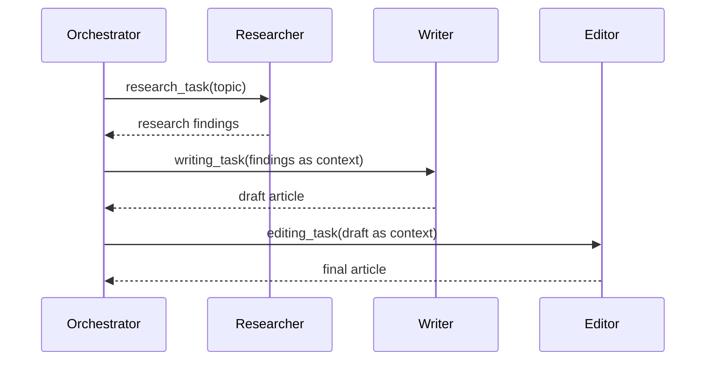

# CrewAI Production Engineering Handbook

> A field manual for engineers building production-grade multi-agent systems.
>
> **Accuracy labels used throughout:**
> - No label = documented behavior or widely confirmed practice
> - `[Inference]` = logically reasoned from known behavior, not independently confirmed
> - `[Recommended]` = engineering judgment, not official guidance
> - `[Experimental]` = active development area, behavior may change
> - `[Unverified]` = no reliable source confirmed; treat with caution

---

## Contents

1. [Mental Models and Framework Philosophy](#1-mental-models-and-framework-philosophy)
2. [CrewAI vs. the Alternatives](#2-crewai-vs-the-alternatives)
3. [Core Primitives](#3-core-primitives)
4. [Project Structure and Repository Organization](#4-project-structure-and-repository-organization)
5. [Agent Design](#5-agent-design)
6. [Task Design](#6-task-design)
7. [Crews: Orchestration Patterns](#7-crews-orchestration-patterns)
8. [Flows: Production Control Plane](#8-flows-production-control-plane)
9. [Memory Architecture](#9-memory-architecture)
10. [Knowledge Management](#10-knowledge-management)
11. [Tool Integration](#11-tool-integration)
12. [MCP Integration](#12-mcp-integration)
13. [Structured Outputs](#13-structured-outputs)
14. [Context Management](#14-context-management)
15. [Prompt Engineering for Agents](#15-prompt-engineering-for-agents)
16. [Delegation and Agent Communication](#16-delegation-and-agent-communication)
17. [Guardrails and Reliability](#17-guardrails-and-reliability)
18. [Human-in-the-Loop](#18-human-in-the-loop)
19. [State Management](#19-state-management)
20. [Observability and Debugging](#20-observability-and-debugging)
21. [Testing and Evaluation](#21-testing-and-evaluation)
22. [Production Deployment](#22-production-deployment)
23. [Scaling Strategies](#23-scaling-strategies)
24. [Cost and Performance Optimization](#24-cost-and-performance-optimization)
25. [Security](#25-security)
26. [Failure Recovery and Reliability Engineering](#26-failure-recovery-and-reliability-engineering)
27. [Anti-Patterns Catalog](#27-anti-patterns-catalog)
28. [Architectural Patterns Reference](#28-architectural-patterns-reference)
29. [Migration and Enterprise Adoption](#29-migration-and-enterprise-adoption)
30. [Case Studies](#30-case-studies)

---

## 1. Mental Models and Framework Philosophy

### 1.1 The Core Insight

CrewAI is built on a deceptively simple observation: the most productive way to solve complex problems with LLMs is not to build a single omniscient agent, but to decompose work into roles—the way a competent engineering organization does.

A senior engineer does not write tests, deploy infrastructure, review PRs, and manage the roadmap simultaneously. They specialize. They hand off. They trust their teammates to do their jobs. CrewAI lets you build software systems that work the same way.

This is not just an analogy. Role specialization in LLM agents produces measurably better outputs because:

- Narrower context = better attention allocation per LLM call
- Explicit role expectations prime the model toward appropriate behavior
- Sequential handoffs create natural quality gates
- Separation of responsibilities makes failures attributable and debuggable

### 1.2 The Two-Axis Model

Every CrewAI system lives on two axes:

```
                    HIGH AUTONOMY
                         │
          Exploratory     │     Full Crew
          Research        │     Collaboration
          (single agent,  │     (multi-agent,
           open-ended)    │      open-ended)
                         │
DETERMINISTIC ───────────┼─────────────── AUTONOMOUS
  (Flow controls         │
   execution path)       │
                         │
          Simple Flow    │     Flow with
          (LLM calls,    │     Embedded Crews
           no agents)    │     (structured+
                         │      intelligent)
                    LOW AUTONOMY
```

**The key architectural decision in every CrewAI project** is where on these axes your system should live, and whether that position should shift across different steps of the same workflow.

### 1.3 Deterministic Backbone, Intelligent Steps

The pattern that emerges from production deployments is consistent: use a **Flow as the deterministic backbone** and deploy Crews (or single agents, or plain LLM calls) only at the steps where intelligence is actually needed.

This pattern, confirmed by production users at scale, has several properties:

- The overall execution path is predictable and auditable
- Business logic that "can't be negotiated" lives in Python, not in prompts
- Failures are attributable—you know exactly which step failed
- Testing is tractable—deterministic paths can be unit-tested; agent steps can be evaluated separately
- Agents operate within bounded contexts, not as free-roaming actors

The failure mode of ignoring this pattern is an agentic system that is:
- Unpredictable at the system level
- Expensive to debug
- Prone to runaway loops
- Impossible to audit for compliance

### 1.4 When Not to Use CrewAI

Before discussing what CrewAI does well, it is worth being direct about when it is the wrong tool.

**Do not reach for CrewAI when:**

- A single LLM call answers the question. Multi-agent adds latency, cost, and complexity with no benefit.
- You need sub-100ms response times. Agent loops have inherent overhead.
- Your task is purely deterministic business logic. Write a function.
- You need deep graph-based state machines with complex branching. LangGraph may be a better fit.
- Your team has no Python background. The abstraction ceiling is lower than it appears.
- You need fine-grained control over every token of every prompt. CrewAI manages internal prompt construction; overriding it at depth is non-trivial.

**Use CrewAI when:**

- Work naturally decomposes into specialist roles with clear handoffs
- Tasks require tool use, research, generation, and validation in sequence
- You need to ship a working multi-agent prototype quickly
- Your organization has business processes that map onto repeatable workflows
- You want deterministic workflow control (Flows) with selective intelligence injection (Crews)
- Your team needs to understand and maintain the system 6 months from now

### 1.5 The 80/20 Architecture Rule

In practice: **80% of your production system should be deterministic code. 20% should be LLM calls.** The 20% is where the intelligence lives. The 80% is what makes it reliable.

Teams that invert this ratio build demos, not production systems.

---

## 2. CrewAI vs. the Alternatives

### 2.1 Comparison Table

| Dimension | CrewAI | LangGraph | AutoGen | OpenAI Agents SDK |
|---|---|---|---|---|
| Primary abstraction | Roles + Tasks | Nodes + Edges | Conversations | Functions + Handoffs |
| LangChain dependency | None (standalone) | Yes | No | No |
| Control style | Crew (autonomous) / Flow (deterministic) | Graph traversal | Conversation turns | Function routing |
| Learning curve | Low-Medium | Medium-High | Medium | Low |
| Production observability | Built-in (AMP) + OSS hooks | Via LangSmith | AgentOps, custom | OpenAI dashboard |
| Performance | Fast (5.76x LangGraph in benchmarks, use with skepticism) | Moderate | Moderate | Fast |
| Config approach | YAML + Python | Python-first | Python-first | Python-first |
| Memory system | Built-in (SQLite + ChromaDB) | Custom (Checkpointers) | Custom | Custom |
| MCP support | Native | Via LangChain | Plugin | Native |
| Enterprise offering | CrewAI AMP | LangSmith + LangServe | Microsoft-backed | OpenAI-backed |
| Best for | Role-based workflows, enterprise automation | Complex graph workflows | Research, conversational agents | OpenAI-native function chaining |

> **[Unverified]**: The "5.76x faster" performance claim comes from CrewAI's own benchmarks on specific QA tasks. Independent benchmarks at your workload may differ significantly. Do not use this figure to make architectural decisions without running your own measurements.

### 2.2 When LangGraph Beats CrewAI

LangGraph is a better choice when:
- Your workflow is genuinely a directed graph with complex conditional branching
- You need fine-grained control over every node's execution and state transitions
- You are deeply embedded in the LangChain ecosystem already
- You need to build workflows that look like state machines more than workflows that look like teams

The trade-off: LangGraph requires more boilerplate and is harder to explain to non-engineers. CrewAI's role-based model is intuitive to anyone who has worked in an organization.

### 2.3 When AutoGen Beats CrewAI

AutoGen is a better choice when:
- Your use case is primarily conversational and research-oriented
- You need agents to have long, free-form conversations before producing output
- You are building systems where agents genuinely need to negotiate with each other
- You are in a Microsoft Azure environment

### 2.4 The Honest Assessment

CrewAI's real advantage is **speed to working system** combined with **operational clarity**. Role-based decomposition is something every engineer understands intuitively, and the YAML configuration approach means non-engineers can read and adjust agent behavior without touching Python.

Its real limitation is that it can encourage over-engineering: the ease of adding a new agent makes it tempting to add agents when functions would suffice.

---

## 3. Core Primitives

### 3.1 The Object Hierarchy

```
Flow (optional deterministic wrapper)
└── Crew
    ├── Agents[]
    │   ├── role
    │   ├── goal
    │   ├── backstory
    │   ├── llm
    │   ├── tools[]
    │   ├── memory
    │   └── knowledge
    ├── Tasks[]
    │   ├── description
    │   ├── expected_output
    │   ├── agent
    │   ├── context[] (dependencies)
    │   ├── output_pydantic
    │   └── guardrail
    └── Process (sequential | hierarchical)
```

### 3.2 Agent

An Agent is an LLM-backed entity with a persistent identity. It has a role, a goal, a backstory, access to tools, and optionally memory and knowledge. Agents are the workers.

**What an agent is NOT**: An agent is not a thread of execution or a process. It is a configuration of (role + goal + backstory + tools) applied to an LLM call. Multiple tasks can run through the same agent in sequence. The "identity" is prompt-level, not runtime-level.

**Key parameters:**

```python
from crewai import Agent, LLM

agent = Agent(
    role="Senior Security Auditor",
    goal="Identify critical vulnerabilities in provided code",
    backstory="""You are a veteran application security engineer with 
    10 years of experience in vulnerability research. You think in 
    attacker mindsets and prioritize findings by exploitability.""",
    llm=LLM(model="anthropic/claude-sonnet-4-6"),
    tools=[code_analysis_tool, cve_lookup_tool],
    max_iter=5,            # Prevent runaway ReAct loops
    max_rpm=10,            # Rate limiting
    verbose=True,
    allow_delegation=False, # Explicit control over delegation
    memory=True,
    reasoning=True,        # Enable chain-of-thought before acting
    inject_date=True,      # Inject current date into context
)
```

### 3.3 Task

A Task is a unit of work assigned to an Agent. It provides context, expectations, and optionally constraints on output format.

**Key insight**: Task quality determines output quality more than agent quality. A well-specified task with a mediocre agent beats a poorly specified task with a strong agent.

```python
from crewai import Task
from pydantic import BaseModel
from typing import List

class VulnerabilityReport(BaseModel):
    critical: List[str]
    high: List[str]
    medium: List[str]
    remediation_priority: List[str]

audit_task = Task(
    description="""
    Analyze the provided Python codebase for security vulnerabilities.
    
    Specifically check for:
    1. SQL injection via string concatenation
    2. Command injection in subprocess calls
    3. Hardcoded credentials or secrets
    4. Insecure deserialization
    5. Path traversal vulnerabilities
    
    The codebase is in: {repo_path}
    Focus on files modified in the last 30 days.
    """,
    expected_output="""
    A structured vulnerability report categorizing findings by severity.
    Each finding must include: file path, line number, vulnerability type,
    evidence, and recommended fix.
    """,
    agent=security_auditor,
    output_pydantic=VulnerabilityReport,
    context=[dependency_scan_task],  # Wait for this task first
)
```

### 3.4 Crew

A Crew is a collection of Agents and Tasks with a defined Process for execution.

```python
from crewai import Crew, Process

crew = Crew(
    agents=[dependency_scanner, security_auditor, report_writer],
    tasks=[scan_task, audit_task, report_task],
    process=Process.sequential,
    memory=True,
    verbose=True,
    max_rpm=30,
    planning=True,  # Pre-execution planning step
    output_log_file="audit_run.log",
)

result = crew.kickoff(inputs={"repo_path": "/src/myapp"})
```

### 3.5 Flow

A Flow is a deterministic execution controller. It uses Python decorators to define steps, and manages state through a Pydantic model.

```python
from crewai.flow.flow import Flow, listen, start, router
from pydantic import BaseModel

class PipelineState(BaseModel):
    repo_url: str = ""
    scan_results: dict = {}
    audit_report: dict = {}
    approved: bool = False
    notification_sent: bool = False

class SecurityPipelineFlow(Flow[PipelineState]):

    @start()
    def clone_repo(self):
        # Deterministic step: clone the repo
        result = clone_repository(self.state.repo_url)
        self.state.scan_results["clone_path"] = result.path
        return result.path

    @listen(clone_repo)
    def run_dependency_scan(self, clone_path: str):
        # Deterministic step: run a dependency scanner
        results = run_safety_check(clone_path)
        self.state.scan_results["dependencies"] = results
        return results

    @listen(run_dependency_scan)
    def run_agent_audit(self, scan_results):
        # Intelligent step: invoke a Crew
        report = SecurityAuditCrew().crew().kickoff(
            inputs={
                "repo_path": self.state.scan_results["clone_path"],
                "dependency_vulnerabilities": scan_results,
            }
        )
        self.state.audit_report = report.pydantic.model_dump()
        return self.state.audit_report

    @router(run_agent_audit)
    def route_by_severity(self):
        if self.state.audit_report.get("critical"):
            return "block_deployment"
        elif self.state.audit_report.get("high"):
            return "require_review"
        return "approve"

    @listen("block_deployment")
    def block_and_notify(self):
        send_alert(self.state.audit_report, severity="critical")
        self.state.approved = False

    @listen("require_review")
    def queue_for_review(self):
        create_review_ticket(self.state.audit_report)

    @listen("approve")
    def mark_approved(self):
        self.state.approved = True
```

### 3.6 Process Types

**Process.sequential** — Tasks execute one after another. The output of each task is available as context to subsequent tasks. This is the correct default for most production workflows.

**Process.hierarchical** — A manager agent (specified or auto-created) delegates tasks to worker agents and synthesizes results. Use when you need dynamic task allocation. Avoid in production unless you have strong reasons: it adds non-determinism and makes debugging harder.

**[Inference]**: A hybrid approach—sequential Flow with individual Crew steps using hierarchical processes where delegation is genuinely needed—gives you the best of both.

---

## 4. Project Structure and Repository Organization

### 4.1 Single-Crew Project (Standard)

For a single workflow or service:

```
my-audit-service/
├── pyproject.toml
├── uv.lock
├── .env                         # Never commit
├── .env.example                 # Commit: documents required vars
├── .gitignore
├── README.md
├── Dockerfile
├── knowledge/                   # Pre-loaded knowledge files
│   ├── security_standards.pdf
│   └── coding_guidelines.md
└── src/
    └── audit_service/
        ├── __init__.py
        ├── main.py              # Entry point (CLI / FastAPI / trigger)
        ├── crew.py              # Crew class definition
        ├── flows/
        │   └── audit_pipeline.py
        ├── config/
        │   ├── agents.yaml
        │   └── tasks.yaml
        └── tools/
            ├── __init__.py
            ├── code_scanner.py
            └── cve_lookup.py
```

### 4.2 Multi-Crew Monorepo (Enterprise)

When you have multiple crews serving different business domains:

```
ai-platform/
├── pyproject.toml               # Workspace root
├── .env.example
├── docker-compose.yml
├── Makefile
├── docs/
│   ├── agents/                  # Agent documentation
│   ├── runbooks/                # Operational runbooks
│   └── architecture/
│
├── shared/                      # Shared across all crews
│   ├── tools/
│   │   ├── __init__.py
│   │   ├── search.py
│   │   ├── database.py
│   │   └── notifications.py
│   ├── llm_config.py            # Centralized LLM configuration
│   ├── guardrails.py            # Shared guardrail functions
│   └── schemas/
│       ├── inputs.py
│       └── outputs.py
│
├── crews/
│   ├── security_audit/
│   │   ├── pyproject.toml
│   │   └── src/security_audit/
│   │       ├── crew.py
│   │       ├── config/
│   │       │   ├── agents.yaml
│   │       │   └── tasks.yaml
│   │       └── tools/
│   │
│   ├── content_pipeline/
│   │   └── src/content_pipeline/
│   │       └── ...
│   │
│   └── data_extraction/
│       └── src/data_extraction/
│           └── ...
│
├── flows/
│   ├── onboarding_flow.py       # Cross-crew orchestration
│   ├── release_pipeline.py
│   └── daily_reports.py
│
└── tests/
    ├── unit/
    │   ├── test_tools.py
    │   └── test_guardrails.py
    ├── integration/
    │   ├── test_crews.py
    │   └── test_flows.py
    └── evals/
        ├── prompts/             # Eval prompts/cases
        └── scripts/             # Evaluation runners
```

### 4.3 Configuration Separation Philosophy

The YAML-first approach CrewAI promotes is not just convention—it encodes a separation of concerns:

| Layer | What Lives Here | Who Owns It |
|---|---|---|
| `agents.yaml` | Role, goal, backstory | Prompt engineers, domain experts |
| `tasks.yaml` | Descriptions, expected outputs | Domain experts, PMs |
| `crew.py` | Wiring, tools, process | Engineers |
| `tools/` | External integrations | Engineers |
| `flows/` | Business logic, routing | Engineers, architects |
| `shared/` | Cross-cutting concerns | Platform team |

This means: **non-engineers can tune agent behavior by editing YAML without touching Python**. In practice, this is enormously valuable during the tuning phase of a project.

### 4.4 Environment Management

```python
# src/my_project/llm_config.py
from crewai import LLM
from functools import lru_cache
import os

@lru_cache(maxsize=None)
def get_primary_llm() -> LLM:
    """Production LLM. Cache to avoid re-initializing per agent."""
    return LLM(
        model=os.environ["PRIMARY_MODEL"],    # e.g. "anthropic/claude-sonnet-4-6"
        temperature=0.1,
        max_tokens=4096,
    )

@lru_cache(maxsize=None)  
def get_fast_llm() -> LLM:
    """Fast/cheap LLM for summarization, classification, guardrails."""
    return LLM(
        model=os.environ["FAST_MODEL"],       # e.g. "anthropic/claude-haiku-4-5"
        temperature=0.0,
        max_tokens=1024,
    )

@lru_cache(maxsize=None)
def get_reasoning_llm() -> LLM:
    """High-capability LLM for complex analysis tasks."""
    return LLM(
        model=os.environ["REASONING_MODEL"],  # e.g. "anthropic/claude-opus-4-6"
        temperature=0.2,
        max_tokens=8192,
    )
```

**`.env.example`** — Always maintain this:

```bash
# LLM Configuration
PRIMARY_MODEL=anthropic/claude-sonnet-4-6
FAST_MODEL=anthropic/claude-haiku-4-5-20251001
REASONING_MODEL=anthropic/claude-opus-4-6
ANTHROPIC_API_KEY=

# Tool API Keys
SERPER_API_KEY=
GITHUB_TOKEN=

# Storage
MEMORY_DB_PATH=./data/memory.db
CHROMA_PERSIST_DIR=./data/chroma

# Observability
CREWAI_TELEMETRY_OPT_OUT=false
AGENTOPS_API_KEY=

# Runtime
MAX_RPM=30
LOG_LEVEL=INFO
```

---

## 5. Agent Design

### 5.1 The Role-Goal-Backstory Triangle

Every agent is defined by three text fields that prime the LLM:

**Role**: The agent's job title and specialty. This should be specific enough to prime relevant knowledge without being so narrow that the agent fails on edge cases.

```yaml
# Too vague
role: "Assistant"

# Too narrow  
role: "Python 3.11 Type Annotation Specialist for Dataclass Fields"

# Good
role: "Senior Backend Engineer specializing in API security"
```

**Goal**: What the agent is trying to achieve in this workflow. Written as a directive.

```yaml
# Weak: too abstract
goal: "Help with code review"

# Strong: outcome-oriented, measurable
goal: "Identify and document all security vulnerabilities in the submitted 
       pull request that could lead to data exposure or unauthorized access.
       Produce actionable findings a developer can act on immediately."
```

**Backstory**: The agent's history, expertise depth, and behavioral tendencies. This is where you shape _how_ the agent thinks, not just _what_ it does.

```yaml
backstory: >
  You are a veteran application security engineer who spent five years
  as a penetration tester before joining the AppSec team. You have a 
  systematic approach: you never dismiss a finding as "low risk" without
  checking the surrounding code for compounding vulnerabilities. You 
  think in attacker mindsets. You are direct—your reports are concise
  and prioritized, not exhaustive lists of everything that could 
  theoretically go wrong.
```

**Why backstory matters**: The backstory does not just prime personality—it shapes reasoning style, risk tolerance, communication style, and what the model pays attention to. An agent with a good backstory behaves consistently across different inputs.

### 5.2 Agent Specialization vs. Generalization

The temptation is to build generalist agents to "reduce agent count." This is almost always wrong for production.

```
GENERALIST AGENT (avoid in production)
role: "AI Assistant"
goal: "Help complete tasks"
tools: [search, write, analyze, code, summarize, translate]

SPECIALIST AGENTS (prefer)
Researcher: search + summarize + validate sources
Writer: structure + draft + format
Analyst: analyze + compute + compare
Reviewer: critique + verify + score
```

**Why specialization wins:**
- Narrower context = better LLM attention allocation
- Smaller tool surface = fewer incorrect tool calls
- Clearer expected_output per task = more consistent results
- Failures are attributable to specific roles
- Agents can be tested and evaluated independently

### 5.3 Agent Creation Decision Tree

```
Does this work require LLM intelligence?
├─ No → Write a Python function. Stop.
└─ Yes → Is this one specific type of task with a clear role?
         ├─ No → Can it be decomposed into clear sub-roles?
         │       ├─ No → Reconsider the problem decomposition
         │       └─ Yes → Create multiple specialist agents
         └─ Yes → Does a similar agent already exist in your library?
                  ├─ Yes → Reuse it (update backstory/tools if needed)
                  └─ No → Create a new specialist agent
```

### 5.4 LLM Assignment Strategy

Not every agent needs your best (most expensive) model. Assign models by task complexity:

| Agent Type | Model Tier | Rationale |
|---|---|---|
| Complex reasoning, synthesis | High-capability | Quality is the bottleneck |
| Research, writing | Mid-tier | Good enough, much cheaper |
| Classification, extraction | Fast/cheap | Deterministic enough |
| Guardrails/validators | Fast/cheap | Yes/no decisions |
| Summarization | Fast/cheap | Token compression, not reasoning |

```python
# crew.py — heterogeneous model assignment
@agent
def research_analyst(self) -> Agent:
    return Agent(
        config=self.agents_config["research_analyst"],
        llm=get_primary_llm(),      # Claude Sonnet — balanced
        tools=[SerperDevTool(), ScrapeWebsiteTool()],
    )

@agent
def senior_synthesizer(self) -> Agent:
    return Agent(
        config=self.agents_config["senior_synthesizer"],
        llm=get_reasoning_llm(),    # Claude Opus — deep analysis
    )

@agent
def output_formatter(self) -> Agent:
    return Agent(
        config=self.agents_config["output_formatter"],
        llm=get_fast_llm(),         # Claude Haiku — simple transformation
    )
```

**[Recommended]**: In a 3-5 agent crew, typically only 1-2 agents need your highest capability model. Running everything through the most capable model is a common and expensive mistake.

### 5.5 Agent Configuration Reference

```python
Agent(
    # Identity (required)
    role="...",
    goal="...",
    backstory="...",
    
    # LLM
    llm=LLM(model="...", temperature=0.1),
    
    # Tools
    tools=[tool1, tool2],
    
    # Behavior controls
    max_iter=5,              # Max ReAct iterations before stopping
    max_rpm=10,              # Rate limit for this agent
    max_execution_time=120,  # Timeout in seconds [Inference: availability may vary]
    
    # Features
    verbose=True,
    memory=True,
    reasoning=True,          # Think before acting (better for complex tasks)
    
    # Date awareness
    inject_date=True,
    date_format="%Y-%m-%d",
    
    # Multimodal
    multimodal=False,        # Set True for vision tasks
    
    # Collaboration
    allow_delegation=False,  # Explicit: default False is safer in production
    
    # Callbacks
    step_callback=my_step_logger,
)
```

---

## 6. Task Design

### 6.1 The Task as Contract

A task is a contract between the orchestration layer and the agent. A well-written task:
- Gives the agent everything it needs to succeed
- Constrains the output format precisely
- Makes it obvious when the task has succeeded
- Does not leave interpretation of "done" to the agent

Poor task design is the #1 source of production failures in CrewAI systems. More on this below.

### 6.2 Task Description Anatomy

A production-quality task description contains:

```yaml
# tasks.yaml
vulnerability_analysis_task:
  description: >
    ## Context
    You are reviewing a pull request for {repo_name}.
    The diff is provided in the attached context from the previous task.
    
    ## Your Job
    Analyze ONLY the changed lines in the diff for security vulnerabilities.
    Do not review unchanged code.
    
    ## What to Check
    1. SQL queries using string concatenation (SQL injection)
    2. User input passed directly to os.system, subprocess, or eval
    3. Secrets, API keys, or passwords hardcoded in the diff
    4. Unsafe file operations without path validation
    5. Missing authentication checks on new endpoints
    
    ## What NOT to Do
    - Do not flag style issues
    - Do not flag performance issues unless they enable DOS attacks
    - Do not suggest architectural improvements
    - Do not repeat findings from the dependency scan (already in context)
    
    ## Output Requirement
    For each finding: file path, line number, vulnerability class,
    severity (critical/high/medium/low), evidence snippet, and
    a concrete remediation with code example.
    
    If no vulnerabilities found, say exactly: "No security vulnerabilities 
    found in the changed code." Do not invent findings.
    
  expected_output: >
    A vulnerability report containing zero or more findings, each with:
    file path, line number, vulnerability class, severity, evidence,
    and remediation. Formatted as the VulnerabilityReport schema.
  
  agent: security_auditor
```

### 6.3 Task Context and Dependencies

Tasks can receive output from other tasks as context:

```python
@task
def dependency_scan_task(self) -> Task:
    return Task(
        config=self.tasks_config["dependency_scan_task"],
        agent=self.dependency_scanner(),
    )

@task
def code_audit_task(self) -> Task:
    return Task(
        config=self.tasks_config["code_audit_task"],
        agent=self.security_auditor(),
        context=[self.dependency_scan_task()],  # Gets dep scan output as context
    )
```

Context is injected as a section in the agent's prompt for the task. This means:
- **Too many context tasks = token bloat**. Be selective.
- Context is the full output of the referenced task, not a summary. Structure outputs that will be used as context to be dense but parseable.
- **[Inference]**: Context chaining creates implicit ordering constraints even in non-sequential processes.

### 6.4 Task Granularity

Tasks that are too large produce inconsistent outputs. Tasks that are too small produce unnecessary overhead.

```
TOO LARGE (one task)
"Research the competitive landscape, write a detailed analysis,
 identify our positioning, create the sales deck, and draft
 the follow-up email sequence."

TOO SMALL (six tasks)
- "Find company X's website"
- "Find company X's pricing"  
- "Find company X's features"
- ... (should be one research task with a search tool)

RIGHT SIZE (three tasks)
- Research task: gather competitive intelligence using search tools
- Analysis task: synthesize findings into positioning matrix
- Communication task: draft deck and email from analysis
```

**Heuristic**: A task should produce one coherent artifact. If you cannot describe the output as a single document, section, decision, or data structure, the task is too large.

### 6.5 Output File vs. Structured Output

For tasks that produce outputs consumed by downstream systems, always use structured outputs (see §13). For tasks producing human-readable artifacts, use `output_file`:

```python
Task(
    description="...",
    expected_output="A polished PDF-ready report...",
    agent=writer,
    output_file="reports/{run_id}/audit_report.md",
)
```

**[Recommended]**: Use `output_file` only for terminal tasks (the final step in a workflow). Intermediate tasks should use structured outputs for reliability.

### 6.6 Task Guardrails

CrewAI supports per-task guardrails that validate output before it proceeds:

```python
from crewai import Task, TaskGuardrail, LLM

def check_report_length(output) -> tuple[bool, str]:
    """Programmatic guardrail: validate without another LLM call."""
    text = output.raw if hasattr(output, 'raw') else str(output)
    word_count = len(text.split())
    if word_count < 200:
        return False, f"Report too short ({word_count} words). Minimum 200 required."
    if word_count > 5000:
        return False, f"Report too long ({word_count} words). Maximum 5000 required."
    return True, ""

audit_report_task = Task(
    description="...",
    expected_output="...",
    agent=report_writer,
    guardrail=check_report_length,  # Function-based guardrail
)

# OR: LLM-as-judge guardrail
audit_report_task = Task(
    description="...",
    expected_output="...",
    agent=report_writer,
    guardrail=TaskGuardrail(
        description="""
        Verify the report:
        1. Contains at least one concrete remediation per finding
        2. Does not mention competitor products
        3. Uses severity levels: critical, high, medium, low only
        4. Does not include personally identifiable information
        """,
        llm=get_fast_llm(),  # Use cheap model for validation
    ),
)
```

---

## 7. Crews: Orchestration Patterns

### 7.1 Sequential Process (Default)

Tasks execute in declaration order. Each task's output is available to subsequent tasks via context dependencies.

```python
@CrewBase
class ContentPipelineCrew:
    agents_config = "config/agents.yaml"
    tasks_config = "config/tasks.yaml"

    @agent
    def researcher(self) -> Agent:
        return Agent(config=self.agents_config["researcher"],
                     llm=get_primary_llm(),
                     tools=[SerperDevTool()])

    @agent
    def writer(self) -> Agent:
        return Agent(config=self.agents_config["writer"],
                     llm=get_primary_llm())

    @agent
    def editor(self) -> Agent:
        return Agent(config=self.agents_config["editor"],
                     llm=get_fast_llm())

    @task
    def research_task(self) -> Task:
        return Task(config=self.tasks_config["research_task"],
                    agent=self.researcher())

    @task
    def writing_task(self) -> Task:
        return Task(config=self.tasks_config["writing_task"],
                    agent=self.writer(),
                    context=[self.research_task()])

    @task
    def editing_task(self) -> Task:
        return Task(config=self.tasks_config["editing_task"],
                    agent=self.editor(),
                    context=[self.writing_task()])

    @crew
    def crew(self) -> Crew:
        return Crew(
            agents=self.agents,
            tasks=self.tasks,
            process=Process.sequential,
            verbose=True,
        )
```



### 7.2 Hierarchical Process

A manager agent dynamically assigns and coordinates tasks. Use when task allocation cannot be determined ahead of time.

```python
@crew
def crew(self) -> Crew:
    return Crew(
        agents=[researcher, analyst, writer, fact_checker],
        tasks=[investigation_task],  # One high-level task
        process=Process.hierarchical,
        manager_llm=get_reasoning_llm(),  # Manager needs the smart model
        verbose=True,
    )
```

**Production trade-offs of hierarchical:**
- Non-deterministic execution path — harder to debug
- Manager agent can make sub-optimal allocation decisions
- Harder to test (different runs may produce different task sequences)
- More expensive (manager uses tokens on delegation decisions)
- Appropriate when: task scope is genuinely unknown upfront, or when worker specialization should be dynamically matched to subtasks

**[Recommended]**: Default to sequential. Only use hierarchical when you can articulate specifically why dynamic allocation is necessary for your use case.

### 7.3 Parallel Task Execution

Tasks with no dependencies on each other can be configured to run in parallel. As of current versions, this requires explicit async kickoff or a Flow wrapper:

```python
# Using async kickoff for parallel crews
import asyncio
from crewai import Crew

async def run_parallel_crews():
    crew_a = SecurityAuditCrew().crew()
    crew_b = PerformanceAuditCrew().crew()
    
    results = await asyncio.gather(
        crew_a.kickoff_async(inputs={"repo": "service-a"}),
        crew_b.kickoff_async(inputs={"repo": "service-a"}),
    )
    return results

# Or via Flow with parallel step definition
class AuditFlow(Flow[AuditState]):

    @start()
    def prepare(self):
        return self.state.repo_url

    @listen(prepare)
    async def security_audit(self, repo_url):
        return await SecurityAuditCrew().crew().kickoff_async(
            inputs={"repo": repo_url}
        )

    @listen(prepare)  # Both listen to same trigger = parallel
    async def performance_audit(self, repo_url):
        return await PerformanceAuditCrew().crew().kickoff_async(
            inputs={"repo": repo_url}
        )
```

### 7.4 Crew Kickoff Patterns

```python
# Synchronous (simple scripts, batch jobs)
result = crew.kickoff(inputs={"topic": "kubernetes security"})

# Async (web services, parallel execution)
result = await crew.kickoff_async(inputs={"topic": "kubernetes security"})

# Batch processing (multiple input sets)
results = crew.kickoff_for_each(
    inputs=[
        {"repo": "service-a"},
        {"repo": "service-b"},
        {"repo": "service-c"},
    ]
)

# Async batch
results = await crew.kickoff_for_each_async(inputs=[...])
```

### 7.5 Planning Mode

When `planning=True`, the crew generates an execution plan before running tasks. This is useful for complex, open-ended tasks:

```python
crew = Crew(
    agents=[...],
    tasks=[...],
    planning=True,
    planning_llm=get_reasoning_llm(),  # Use capable model for planning
)
```

**[Recommended]**: Enable planning only when the task set is genuinely complex or when agents are likely to benefit from coordination context. It adds a non-trivial LLM call overhead.

---

## 8. Flows: Production Control Plane

### 8.1 Why Flows Exist

Crews are powerful but probabilistic. Left entirely autonomous, a multi-agent system can:
- Choose incorrect execution paths based on model variance
- Fail silently by producing plausible-looking wrong outputs
- Loop unexpectedly when agents delegate to each other
- Lose state across steps in complex workflows
- Be difficult to resume after failures

Flows solve this by separating control flow (deterministic Python) from intelligence (LLM calls). The Flow knows the shape of the workflow; the Crews provide the intelligence at specific nodes.

### 8.2 Flow State

Every Flow has a state class (Pydantic model) that persists across all steps:

```python
from pydantic import BaseModel, Field
from typing import Optional, List
from datetime import datetime

class ReportPipelineState(BaseModel):
    # Inputs
    customer_id: str = ""
    report_type: str = ""
    
    # Execution tracking
    run_id: str = Field(default_factory=lambda: uuid4().hex[:8])
    started_at: Optional[datetime] = None
    
    # Step outputs
    raw_data: dict = {}
    analysis: dict = {}
    draft_report: str = ""
    reviewed_report: str = ""
    
    # Control flags
    data_complete: bool = False
    review_passed: bool = False
    human_approved: bool = False
    
    # Error tracking
    errors: List[str] = []
    retry_count: int = 0
```

State is automatically available via `self.state` in every step. State is typed, validated by Pydantic, and—with checkpoint support—can be persisted for resumability.

### 8.3 Flow Decorators Reference

```python
from crewai.flow.flow import Flow, start, listen, router, and_, or_

class MyFlow(Flow[MyState]):

    @start()
    def entry_point(self):
        """Executes first when flow.kickoff() is called."""
        pass

    @listen(entry_point)
    def after_entry(self, entry_result):
        """Executes after entry_point completes."""
        pass

    @listen(or_(step_a, step_b))
    def after_either(self, result):
        """Executes when EITHER step_a OR step_b completes."""
        pass

    @listen(and_(step_a, step_b))
    def after_both(self, results):
        """Executes only when BOTH step_a AND step_b complete."""
        pass

    @router(some_step)
    def conditional_route(self):
        """Returns a string that routes to the matching @listen."""
        if self.state.some_condition:
            return "path_a"
        return "path_b"

    @listen("path_a")
    def handle_path_a(self):
        pass

    @listen("path_b")
    def handle_path_b(self):
        pass
```

### 8.4 Flow Execution Model

```mermaid
flowchart TD
    A[flow.kickoff] --> B[@start: validate_inputs]
    B --> C{@router: check_data_source}
    C -->|"database"| D[@listen database: fetch_from_db]
    C -->|"api"| E[@listen api: fetch_from_api]
    D --> F[@listen and_ d,e OR just d: run_analysis_crew]
    E --> F
    F --> G{@router: check_quality}
    G -->|"pass"| H[@listen pass: generate_report]
    G -->|"fail"| I[@listen fail: request_human_review]
    I --> J[HITL: await approval]
    J --> F
    H --> K[@listen: distribute_report]
```

### 8.5 Flow + Crew Integration

The primary pattern: Flow controls structure, Crews provide intelligence.

```python
class ContentPipelineFlow(Flow[ContentState]):

    @start()
    def initialize(self):
        self.state.started_at = datetime.utcnow()
        return self.state.brief

    @listen(initialize)
    def research_phase(self, brief: str):
        # Crew handles the intelligence
        result = ResearchCrew().crew().kickoff(
            inputs={"topic": brief, "depth": "comprehensive"}
        )
        self.state.research = result.pydantic.model_dump()
        return self.state.research

    @listen(research_phase)
    def validate_research(self, research: dict):
        # Deterministic validation — no LLM needed
        if len(research.get("sources", [])) < 3:
            self.state.errors.append("Insufficient sources")
            return False
        self.state.research_validated = True
        return True

    @router(validate_research)
    def route_after_validation(self):
        if not self.state.research_validated:
            return "research_failed"
        return "research_ok"

    @listen("research_ok")
    def writing_phase(self):
        result = WritingCrew().crew().kickoff(
            inputs={"research": self.state.research}
        )
        self.state.draft = result.raw
        return self.state.draft

    @listen("research_failed")
    def handle_research_failure(self):
        notify_team(self.state.errors)
        raise FlowExecutionError("Research phase failed")
```

### 8.6 Event-Driven Flows

Flows can respond to external events, making them suitable for webhook-triggered or queue-based architectures:

```python
# Triggered by webhook payload
class TicketTriageFlow(Flow[TicketState]):

    @start()
    def receive_ticket(self):
        return self.state.ticket_payload

    @listen(receive_ticket)
    def classify_ticket(self, payload: dict):
        # Single LLM call for classification (no full crew needed)
        classifier = Agent(
            role="Ticket Classifier",
            goal="Classify support tickets",
            llm=get_fast_llm(),
        )
        # ... classify
        self.state.category = result
        return self.state.category

    @router(classify_ticket)
    def route_by_category(self):
        routes = {
            "billing": "billing_crew",
            "technical": "technical_crew",
            "account": "account_crew",
        }
        return routes.get(self.state.category, "general_crew")

    @listen("billing_crew")
    def handle_billing(self):
        return BillingCrew().crew().kickoff(
            inputs={"ticket": self.state.ticket_payload}
        )
    
    # ... other handlers
```

### 8.7 Flow State Persistence and Resumability

For long-running workflows, implement checkpoint save/restore:

```python
import json
from pathlib import Path

class ResumableFlow(Flow[PipelineState]):

    CHECKPOINT_DIR = Path("./checkpoints")

    def save_checkpoint(self, step_name: str):
        """Save state after each critical step."""
        checkpoint_path = self.CHECKPOINT_DIR / f"{self.state.run_id}_{step_name}.json"
        checkpoint_path.parent.mkdir(exist_ok=True)
        checkpoint_path.write_text(self.state.model_dump_json())

    def load_checkpoint(self, run_id: str, step_name: str) -> bool:
        """Restore state from checkpoint if it exists."""
        checkpoint_path = self.CHECKPOINT_DIR / f"{run_id}_{step_name}.json"
        if checkpoint_path.exists():
            data = json.loads(checkpoint_path.read_text())
            self.state = type(self.state)(**data)
            return True
        return False

    @start()
    def begin(self):
        # Try to restore from checkpoint
        if self.load_checkpoint(self.state.run_id, "research_complete"):
            return "skip_to_writing"  # Route past completed steps
        return "start_fresh"
```

> **[Experimental]**: Native Flow checkpoint/restore support is an evolving feature. The pattern above is a manually implemented approach. CrewAI releases (as of v1.14.x) include `checkpoint` capabilities — verify behavior against the current release notes.

---

## 9. Memory Architecture

### 9.1 The Four Memory Layers

CrewAI's memory system has evolved significantly. Current architecture provides a unified `Memory` class with multiple scopes, plus legacy explicit types. Understanding what each layer does prevents common configuration mistakes.

| Layer | Scope | Backend | Production Concern |
|---|---|---|---|
| Short-term | Within a single execution | ChromaDB (vector) | Wiped on container restart |
| Long-term | Across executions | SQLite | Machine-bound; not distributed |
| Entity | Across executions, entity-focused | ChromaDB (vector) | Same as short-term |
| Contextual | Orchestration (not a store) | N/A | Assembles the others for prompt injection |

### 9.2 The Production Memory Problem

The default memory implementation works fine locally. It fails in production because:

1. **Storage is machine-local** — ChromaDB and SQLite write to local filesystem paths
2. **No multi-user isolation** — All users share the same memory stores by default
3. **Container restarts wipe short-term and entity memory** — Local ChromaDB is ephemeral in containers
4. **No distributed access** — Multiple instances of the same crew cannot share memory

**Production solutions:**

```python
# Option A: External vector store for short-term/entity memory
from crewai import Crew
from crewai.memory.storage.rag_storage import RAGStorage

crew = Crew(
    agents=[...],
    tasks=[...],
    memory=True,
    embedder={
        "provider": "openai",
        "config": {"model": "text-embedding-3-small"},
    },
    # Point to persistent, shared storage
    # [Inference]: exact API may vary; check current docs
)

# Option B: Mem0 as external memory provider
# Mem0 provides: persistent storage, per-user isolation, smart extraction
from mem0 import MemoryClient

mem0_client = MemoryClient(api_key=os.environ["MEM0_API_KEY"])
# Wire Mem0 into CrewAI's memory interface (see current Mem0 docs)

# Option C: Custom storage backend
# Implement RAGStorage with your vector DB of choice (Qdrant, pgvector, Weaviate)
```

### 9.3 Memory Configuration in Practice

```python
from crewai import Crew
from crewai.memory import LongTermMemory
from crewai.memory.storage.ltm_sqlite_storage import LTMSQLiteStorage

# Local development (acceptable)
crew = Crew(
    agents=[...],
    tasks=[...],
    memory=True,
    verbose=True,
)

# Production: explicit long-term memory with controlled path
long_term = LongTermMemory(
    storage=LTMSQLiteStorage(
        db_path=os.environ.get("MEMORY_DB_PATH", "./data/memory.db")
    )
)

crew = Crew(
    agents=[...],
    tasks=[...],
    memory=True,
    long_term_memory=long_term,
    embedder={
        "provider": "openai",
        "config": {"model": "text-embedding-3-small"},
    },
)
```

### 9.4 Memory Strategy Decision Framework

```
Does your crew run multiple times on related inputs?
├── No → memory=False (saves tokens, simpler)
└── Yes → Do agents need to avoid re-researching known entities?
           ├── Yes → Enable entity memory
           └── Do they need to improve from past execution outcomes?
                    ├── Yes → Enable long-term memory
                    └── Do multiple users access the same crew?
                             ├── Yes → External memory provider required
                             └── No → Default memory=True is sufficient (dev only)
```

### 9.5 Memory and Token Cost

Every memory retrieval injects text into the agent's context. This has a direct token cost. In high-volume scenarios:

- Measure average tokens added by memory retrieval per task
- Set maximum retrieval limits if the framework supports it
- Consider disabling memory for tasks that do not benefit from it
- Use the fast/cheap LLM for memory-backed tasks where the retrieval is the main value add

---

## 10. Knowledge Management

### 10.1 Knowledge vs. Memory

| | Knowledge | Memory |
|---|---|---|
| Loaded | Before execution (static) | During/after execution (dynamic) |
| Source | Files, databases, docs you provide | Previous crew runs, agent observations |
| Use case | Domain expertise, reference material | Historical context, learned behavior |
| Changes | Updated by you on redeploy | Updated automatically during runs |

### 10.2 Knowledge Sources

```python
from crewai.knowledge.source.pdf_knowledge_source import PDFKnowledgeSource
from crewai.knowledge.source.text_file_knowledge_source import TextFileKnowledgeSource
from crewai.knowledge.source.csv_knowledge_source import CSVKnowledgeSource
from crewai.knowledge.source.string_knowledge_source import StringKnowledgeSource

# PDF documents
security_standards = PDFKnowledgeSource(
    file_paths=["knowledge/owasp_top10.pdf", "knowledge/pci_dss.pdf"],
    metadata={"category": "security_standards", "version": "2024"},
)

# Text files
internal_docs = TextFileKnowledgeSource(
    file_paths=["knowledge/api_guidelines.md", "knowledge/coding_standards.md"],
)

# Dynamic knowledge from string
runtime_context = StringKnowledgeSource(
    content=f"Current deployment environment: {os.environ['DEPLOY_ENV']}\n"
             f"Active compliance frameworks: {get_active_frameworks()}\n",
)

# Assign to agent
agent = Agent(
    role="Compliance Auditor",
    goal="...",
    backstory="...",
    knowledge_sources=[security_standards, internal_docs, runtime_context],
    embedder={
        "provider": "openai",
        "config": {"model": "text-embedding-3-small"},
    },
)
```

### 10.3 Knowledge Management at Scale

For large knowledge bases, the embedding and chunking strategy matters:

```python
# Custom knowledge source with chunking control
from crewai.knowledge.source.base_knowledge_source import BaseKnowledgeSource

class DatabaseKnowledgeSource(BaseKnowledgeSource):
    """Fetch knowledge from a database at runtime."""

    query: str
    
    def load_content(self) -> dict:
        rows = db.execute(self.query).fetchall()
        # Format as text chunks
        chunks = {}
        for row in rows:
            key = f"doc_{row['id']}"
            chunks[key] = f"{row['title']}\n\n{row['content']}"
        return chunks
    
    def add(self) -> None:
        content = self.load_content()
        for doc_id, text in content.items():
            self._save_documents(
                [text],
                metadata={"source": "database", "doc_id": doc_id},
            )
```

**Production consideration**: Knowledge embeddings are created at crew initialization. For large knowledge bases, this adds startup time. Cache the embedding store and share it across crew instances.

---

## 11. Tool Integration

### 11.1 Tool Architecture

Tools are the bridge between agents and the real world. An agent without tools is just an LLM call. Tools give agents the ability to search, read, write, compute, and communicate.

```python
from crewai.tools import BaseTool
from pydantic import BaseModel, Field
from typing import Type

class DatabaseQueryInput(BaseModel):
    """Input schema — forces type validation before tool execution."""
    query: str = Field(description="SQL SELECT query to execute")
    database: str = Field(description="Target database name", default="production")
    limit: int = Field(description="Maximum rows to return", default=100, le=1000)

class DatabaseQueryTool(BaseTool):
    name: str = "database_query"
    description: str = """
    Execute a read-only SQL SELECT query against a specified database.
    Use when you need to retrieve structured data.
    
    Important: Only SELECT queries are allowed. Write operations will be rejected.
    Limit results to what you need — avoid SELECT * on large tables.
    """
    args_schema: Type[BaseModel] = DatabaseQueryInput
    
    def _run(self, query: str, database: str = "production", limit: int = 100) -> str:
        # Validate it's a read-only query
        if not query.strip().upper().startswith("SELECT"):
            return "Error: Only SELECT queries are permitted."
        
        # Inject LIMIT if not present
        if "LIMIT" not in query.upper():
            query = f"{query} LIMIT {limit}"
        
        try:
            results = get_db_connection(database).execute(query).fetchall()
            return format_results_as_markdown(results)
        except Exception as e:
            return f"Query failed: {str(e)}"
```

### 11.2 Tool Design Principles

**1. Write descriptions as if briefing a human professional.**

The description is what the agent reads when deciding whether to use the tool. It must answer:
- What does this tool do?
- When should I use it vs. alternatives?
- What format should my input be in?
- What will the output look like?

**2. Fail loudly and specifically.**

Do not return generic error messages. Return something the agent can act on:

```python
# Bad
return "Error occurred"

# Good
return (
    f"Query failed with: {type(e).__name__}: {e}\n"
    f"Common causes: table name typo, unsupported syntax, permission error.\n"
    f"Attempted query: {query}"
)
```

**3. Return structured, parseable output.**

Agents need to extract information from tool results. Return JSON or well-formatted Markdown, not unstructured text.

**4. Enforce limits and validate inputs.**

Agents can make unexpected tool calls. Build defensive tool implementations:

```python
def _run(self, url: str) -> str:
    # Validate URL scheme
    if not url.startswith(("http://", "https://")):
        return "Error: Only HTTP/HTTPS URLs are supported."
    
    # Block internal URLs (security)
    parsed = urlparse(url)
    if parsed.hostname in INTERNAL_HOSTNAMES or is_private_ip(parsed.hostname):
        return "Error: Cannot access internal/private network addresses."
    
    # Enforce timeout
    response = requests.get(url, timeout=10)
    
    # Truncate large responses
    content = response.text[:MAX_CONTENT_LENGTH]
    if len(response.text) > MAX_CONTENT_LENGTH:
        content += f"\n\n[Content truncated at {MAX_CONTENT_LENGTH} chars]"
    
    return content
```

**5. Use the cheapest approach that works.**

If a task can be done with a deterministic function, do not make it an LLM-backed tool. Tools should be execution primitives, not reasoning agents.

### 11.3 Built-In Tools Reference

CrewAI ships with `crewai-tools` extras. Notable ones:

| Tool | Use Case | Production Note |
|---|---|---|
| `SerperDevTool` | Web search | Requires SERPER_API_KEY |
| `ScrapeWebsiteTool` | Web scraping | Rate limit aggressively |
| `FileReadTool` | Read local files | Sandbox the path |
| `FileWriterTool` | Write local files | Restrict to output directory |
| `GithubSearchTool` | GitHub code search | Token required |
| `CodeInterpreterTool` | Execute Python | Never in prod without sandboxing |
| `PDFSearchTool` | RAG on PDFs | Uses local ChromaDB |
| `BrowserbaseLoadTool` | Browser automation | External service |

### 11.4 Tool Reuse Across Crews

Tools should be defined once and imported across crews:

```python
# shared/tools/search.py
from crewai.tools import BaseTool
from functools import lru_cache

class CompanySearchTool(BaseTool):
    name: str = "company_search"
    description: str = "Search for company information from internal CRM"
    
    def _run(self, company_name: str) -> str:
        return crm_client.search(company_name)

@lru_cache(maxsize=1)
def get_company_search_tool() -> CompanySearchTool:
    """Singleton tool instance — avoids re-initialization overhead."""
    return CompanySearchTool()

# In any crew
from shared.tools.search import get_company_search_tool

@agent
def researcher(self) -> Agent:
    return Agent(
        ...,
        tools=[get_company_search_tool()],
    )
```

---

## 12. MCP Integration

### 12.1 What MCP Gives You

Model Context Protocol standardizes how agents connect to tools and data sources. For CrewAI, MCP integration means you can connect to thousands of pre-built tool servers without writing custom tool implementations.

The value proposition:
- Instant access to integrations (GitHub, Slack, Salesforce, databases, etc.)
- Standardized authentication and schema
- Bidirectional: your Crews can also be exposed as MCP servers to other systems

### 12.2 Using MCP Servers in CrewAI

```python
from crewai import Agent, Task, Crew
from crewai_tools import MCPServerAdapter

# Connect to a local MCP server
def create_crew_with_mcp():
    server_params = {
        "url": "http://localhost:8000/sse",  # SSE transport
        # "command": "npx",                 # Stdio transport
        # "args": ["-y", "@modelcontextprotocol/server-github"],
    }
    
    with MCPServerAdapter(server_params) as mcp_tools:
        # mcp_tools is a list of CrewAI-compatible Tool objects
        # mapping 1:1 to the MCP server's exposed tools
        
        agent = Agent(
            role="GitHub Analyst",
            goal="Analyze repository health and recent activity",
            backstory="...",
            tools=mcp_tools,  # All MCP server tools available
            llm=get_primary_llm(),
        )
        
        task = Task(
            description="Analyze the last 30 days of activity in {repo}",
            expected_output="...",
            agent=agent,
        )
        
        crew = Crew(agents=[agent], tasks=[task])
        return crew.kickoff(inputs={"repo": "crewAIInc/crewAI"})
```

### 12.3 Selective Tool Exposure

Giving an agent access to an entire MCP server's tool catalog causes decision paralysis and increases token cost. Filter tools to what the agent actually needs:

```python
with MCPServerAdapter(server_params) as all_tools:
    # Filter to only the tools this agent should use
    search_tools = [t for t in all_tools if t.name in [
        "search_repositories",
        "get_pull_request",
        "list_commits",
    ]]
    
    github_analyst = Agent(
        ...,
        tools=search_tools,  # Narrow tool surface
    )
```

### 12.4 Bidirectional MCP

CrewAI Enterprise supports exposing your Crews and Flows as MCP servers. This enables:
- Remote agents calling your Crew as a tool
- Desktop applications triggering workflows
- Cross-team agent composition

This is an enterprise feature. The architecture pattern:

```
External Agent (Claude, GPT, etc.)
    │
    │ MCP call: "run_security_audit"
    ▼
CrewAI MCP Server
    │
    ▼
SecurityAuditFlow (your Flow)
    │
    ├── SecurityAuditCrew
    └── ReportGenerationCrew
```

### 12.5 MCP Security Considerations

When using MCP servers:
- Apply least-privilege: only expose tools the agent needs
- Validate all inputs to MCP-connected tools at your wrapper layer
- Do not pass user-controlled data directly to MCP tool parameters without sanitization
- Audit tool call logs — agents may call tools in unexpected sequences
- Set rate limits on MCP tool usage to bound cost

---

## 13. Structured Outputs

### 13.1 Why Structured Outputs Are Non-Negotiable in Production

Unstructured string outputs require fragile parsing. Every downstream system that depends on an agent output is a potential failure point if that output format varies.

```python
# Fragile: agent output format varies
result = crew.kickoff(inputs={...})
report = result.raw  # "Here is the vulnerability report: ..."
# Now you must parse this string... somehow

# Robust: structured output
class VulnerabilityReport(BaseModel):
    findings: List[Finding]
    summary: str
    risk_score: int  # 1-10
    approved_for_deploy: bool

result = crew.kickoff(inputs={...})
report: VulnerabilityReport = result.pydantic
print(report.risk_score)          # Always an int
print(report.approved_for_deploy) # Always a bool
```

### 13.2 Defining Output Schemas

Use Pydantic models for task outputs. Design schemas that are:
- **Complete**: capture all needed information
- **Typed**: use specific types, not str everywhere
- **Flat enough to be parseable**: avoid deeply nested structures that confuse models
- **Well-documented**: use Field(description=...) for clarity

```python
from pydantic import BaseModel, Field
from typing import List, Literal, Optional
from enum import Enum

class SeverityLevel(str, Enum):
    CRITICAL = "critical"
    HIGH = "high"
    MEDIUM = "medium"
    LOW = "low"
    INFORMATIONAL = "informational"

class SecurityFinding(BaseModel):
    id: str = Field(description="Unique finding identifier, e.g. VULN-001")
    file_path: str = Field(description="Relative path to the affected file")
    line_number: Optional[int] = Field(None, description="Specific line number if applicable")
    vulnerability_class: str = Field(description="CWE or OWASP category")
    severity: SeverityLevel
    evidence: str = Field(description="Code snippet or log entry demonstrating the issue")
    remediation: str = Field(description="Concrete fix with example code")
    cve_references: List[str] = Field(default_factory=list, description="Related CVE IDs if known")

class AuditReport(BaseModel):
    repository: str
    audit_date: str = Field(description="ISO 8601 date")
    auditor: str = Field(description="Agent role that produced this report")
    findings: List[SecurityFinding]
    total_findings: int
    blocked_for_deploy: bool = Field(
        description="True if critical findings exist that must be fixed before deployment"
    )
    executive_summary: str = Field(description="2-3 sentence summary for non-technical stakeholders")
```

### 13.3 Wiring Output Schemas to Tasks

```python
# In crew.py
@task
def audit_task(self) -> Task:
    return Task(
        config=self.tasks_config["audit_task"],
        agent=self.security_auditor(),
        output_pydantic=AuditReport,  # Enforces output schema
    )
```

When `output_pydantic` is set, CrewAI:
1. Instructs the agent to produce JSON matching the schema
2. Validates the output against the Pydantic model
3. Returns the parsed object in `result.pydantic`
4. Falls back to `result.raw` if parsing fails

**[Recommended]**: Always check `result.pydantic is not None` before accessing it. If it is None, validation failed and the raw string is in `result.raw`. Log and handle this case explicitly.

```python
result = crew.kickoff(inputs={...})

if result.pydantic is None:
    logger.error(
        "Structured output parsing failed",
        extra={
            "raw_output": result.raw,
            "model": "AuditReport",
        }
    )
    raise OutputParsingError("Agent produced non-conforming output")

report: AuditReport = result.pydantic
```

### 13.4 Output Validation Beyond Schema

Schema validation catches type errors. Content validation catches semantic errors:

```python
def validate_audit_report(report: AuditReport) -> tuple[bool, List[str]]:
    """Additional semantic validation beyond Pydantic schema."""
    errors = []
    
    # Check finding counts match
    if report.total_findings != len(report.findings):
        errors.append(f"total_findings ({report.total_findings}) != len(findings) ({len(report.findings)})")
    
    # Verify blocked_for_deploy is consistent
    has_critical = any(f.severity == SeverityLevel.CRITICAL for f in report.findings)
    if has_critical and not report.blocked_for_deploy:
        errors.append("Critical findings exist but blocked_for_deploy=False — inconsistent")
    
    # Verify each finding has a remediation
    for f in report.findings:
        if len(f.remediation) < 20:
            errors.append(f"Finding {f.id} has insufficient remediation text")
    
    return len(errors) == 0, errors

# In your Flow or post-processing
valid, errors = validate_audit_report(result.pydantic)
if not valid:
    logger.warning("Report failed semantic validation", extra={"errors": errors})
    # Decide: retry, escalate, or accept with warnings
```

---

## 14. Context Management

### 14.1 The Context Window Is Your Most Expensive Resource

Every token in an agent's context window costs money and degrades attention quality. Context management is the difference between a cost-effective production system and a budget-burning demo.

### 14.2 What Fills the Context Window

In a CrewAI agent's prompt, context comes from:

1. **System prompt**: role, goal, backstory, tool descriptions
2. **Task description**: the task text with interpolated inputs
3. **Task context**: outputs from previous tasks marked as context
4. **Memory**: retrieved short-term and entity memory
5. **Knowledge**: retrieved knowledge base chunks
6. **ReAct history**: previous tool calls and results in this task
7. **Guardrail feedback**: if the output failed and needs retry

Each of these grows the window. In long-running agents with many tool calls, the ReAct history alone can exhaust a 200k-token window.

### 14.3 Context Budget Management

```python
# Rough token budget allocation for a complex task
CONTEXT_BUDGET = {
    "system_prompt": 2_000,       # Role + goal + backstory
    "tool_descriptions": 3_000,   # Scales with tool count
    "task_description": 1_500,    # Keep tasks concise
    "context_from_tasks": 5_000,  # Limit context injection
    "memory_retrieval": 2_000,    # Set retrieval limits
    "knowledge": 3_000,           # Filter to relevant chunks
    "react_history_budget": 8_000, # What's left for tool calls
    "output_budget": 4_000,       # Room for the final answer
    # Total: ~28,500 tokens per task
}
```

Strategies to control context:

**1. Structure context outputs to be dense, not verbose.**

If task A's output will be used as context for task B, write task A's expected_output to be information-dense but concise — a structured list or JSON object, not prose.

**2. Limit context task dependencies.**

Every task in `context=[...]` is injected verbatim. Use only the tasks that are actually needed.

**3. Summarize before injecting.**

For long intermediate outputs, add a summarization step before the next major stage:

```python
@task
def summarize_research_task(self) -> Task:
    return Task(
        description="Summarize the research findings in under 500 words, "
                    "preserving all specific claims, numbers, and citations.",
        expected_output="A 400-500 word summary with bullet points.",
        agent=self.summarizer(),
        context=[self.research_task()],  # Takes verbose output...
    )

@task
def analysis_task(self) -> Task:
    return Task(
        description="...",
        agent=self.analyst(),
        context=[self.summarize_research_task()],  # ...uses concise summary
    )
```

**4. Control memory retrieval.**

Disable memory for tasks that do not benefit from it. Not every agent in a crew needs access to all memory.

**5. Filter knowledge chunks.**

If your knowledge base is large, ensure only relevant chunks are retrieved. Use specific, narrow queries to trigger retrieval.

### 14.4 Managing ReAct Loop Depth

The ReAct loop (Reason → Act → Observe) can grow arbitrarily deep if an agent cannot make progress. Control this:

```python
Agent(
    max_iter=5,       # Hard stop after 5 iterations
    max_retry_limit=2, # Retry on tool errors, max 2 times
)
```

**[Recommended]**: Start with `max_iter=5`. Increase only if specific tasks demonstrably need more. Many production teams run `max_iter=3` for simple tasks and `max_iter=8` for complex research tasks.

---

## 15. Prompt Engineering for Agents

### 15.1 The Three Prompt Surfaces

In CrewAI, you write prompts in three places:

| Surface | Format | Controls |
|---|---|---|
| Agent backstory | YAML/Python string | Reasoning style, persona, risk tolerance |
| Task description | YAML/Python string | What to do, constraints, output format hints |
| Tool description | Python string | When and how to use the tool |

All three contribute to agent behavior. Neglecting any one of them produces inconsistent results.

### 15.2 Backstory Prompting Patterns

**The Expert Professional Pattern** (most common):

```yaml
backstory: >
  You are a [TITLE] with [X years / deep] experience in [DOMAIN].
  Your approach is [CHARACTERISTIC_STYLE].
  You are known for [DISTINGUISHING_QUALITY].
  When you encounter [COMMON_EDGE_CASE], you [BEHAVIOR].
  You never [ANTI-BEHAVIOR] without [CONDITION].
```

**The Contrarian Reviewer Pattern** (for quality assurance agents):

```yaml
backstory: >
  You are a senior technical reviewer whose job is to find problems,
  not praise work. You approach every submission with healthy skepticism.
  You look for gaps in logic, missing edge cases, and unstated assumptions.
  You are not harsh—you are precise. Your feedback is specific and 
  actionable. You do not comment on style; you focus on correctness
  and completeness.
```

**The Constrained Expert Pattern** (when you need the agent to stay in its lane):

```yaml
backstory: >
  You are a data extraction specialist. Your ONLY job is to extract
  structured data from the provided text. You do not interpret, analyze,
  judge, or enhance the data. You extract exactly what is there and 
  nothing more. If the information requested is not present, you say
  "NOT FOUND" in that field. You never infer or extrapolate.
```

### 15.3 Task Description Prompting Patterns

**The Bounded Analysis Pattern**:

```yaml
description: >
  ## Input
  {input_data}
  
  ## What You Must Do
  [Specific, verb-first instructions]
  
  ## Constraints
  - Do NOT [anti-behavior]
  - Always [required behavior]
  - If [edge case], then [handling instruction]
  
  ## Output Format
  [Explicit format description, consistent with output_pydantic schema]
```

**The Chain-of-Thought Priming Pattern** (for complex reasoning):

```yaml
description: >
  Before answering, reason through this step by step:
  1. First, identify the key entities involved
  2. Then, determine the relationships between them
  3. Next, consider what information is missing or ambiguous
  4. Finally, form your conclusion based on what is established
  
  Your task: {task_description}
```

**The Example-Driven Pattern** (when format matters precisely):

```yaml
description: >
  Transform the input data into the target format.
  
  Input example:
  {"name": "John Doe", "email": "john@example.com", "joined": "2024-01-15"}
  
  Expected output example:
  User(display_name="John Doe", contact_email="john@example.com",
       member_since=date(2024, 1, 15), status="active")
  
  Now process: {input}
```

### 15.4 Prompt Library Management

For teams with multiple crews, maintain a centralized prompt library:

```
shared/
└── prompts/
    ├── backstories/
    │   ├── researcher.yaml
    │   ├── writer.yaml
    │   ├── reviewer.yaml
    │   └── analyst.yaml
    ├── task_templates/
    │   ├── research_task.yaml
    │   ├── summarization_task.yaml
    │   └── validation_task.yaml
    └── tool_descriptions/
        ├── search_tool.txt
        └── database_tool.txt
```

Treat prompts as code: version control them, review changes, and track the correlation between prompt changes and output quality metrics.

---

## 16. Delegation and Agent Communication

### 16.1 Delegation Mechanics

When `allow_delegation=True`, an agent can ask other agents to complete sub-tasks. This happens through tool calls the framework generates automatically.

**The delegation tool signature** (internal to CrewAI):

```
Delegate work to coworker(task: str, context: str, coworker: str)
Ask question to coworker(question: str, context: str, coworker: str)
```

The delegating agent specifies what it needs, provides context, and names the coworker.

### 16.2 Delegation: When It Helps vs. When It Hurts

**When delegation adds value:**
- A specialist agent needs a capability it does not have
- The delegating agent has context it needs to pass to a specialist
- Human-mirroring: "I need to ask the legal team" is natural in role-based workflows

**When delegation causes problems:**
- Delegation chains (A→B→C→A) create loops
- Agents delegate to avoid the task rather than because another agent is better suited
- Delegation adds ReAct steps = more tokens, more latency
- In hierarchical processes, delegation can create an exponential number of LLM calls

**[Recommended]**: Default to `allow_delegation=False` for all agents in production. Enable it only for specific agents where you have tested and confirmed the delegation pattern. This is especially important in hierarchical crews.

```python
# Explicit delegation policy
@agent
def project_manager(self) -> Agent:
    return Agent(
        config=self.agents_config["project_manager"],
        allow_delegation=True,  # Manager CAN delegate
    )

@agent  
def researcher(self) -> Agent:
    return Agent(
        config=self.agents_config["researcher"],
        allow_delegation=False,  # Worker CANNOT delegate
    )
```

### 16.3 Context Passing Patterns

Context flows between tasks explicitly (via `context=[...]`) or through memory. Do not rely on implicit context.

**Explicit context (preferred)**:

```python
# Task B explicitly receives Task A's output
task_b = Task(
    ...,
    context=[task_a],  # Explicit dependency
)
```

**Structured handoffs (best practice for complex pipelines)**:

When one crew's output is another crew's input, use structured types at the boundary:

```python
# Crew A produces
class ResearchFindings(BaseModel):
    key_facts: List[str]
    sources: List[str]
    confidence_scores: dict

# Crew B consumes
class WritingCrew(CrewBase):
    @task
    def draft_article_task(self) -> Task:
        return Task(
            description="""
            Using the research findings in {research_json}, write an article.
            The findings are pre-validated — treat them as authoritative.
            """,
            ...
        )

# In Flow
@listen(research_phase)
def writing_phase(self, research: ResearchFindings):
    return WritingCrew().crew().kickoff(
        inputs={"research_json": research.model_dump_json()}
    )
```

---

## 17. Guardrails and Reliability

### 17.1 The Reliability Stack

Production agent reliability requires multiple layers:

```
Layer 1: Task guardrails      → Validate output format and content
Layer 2: Agent constraints    → max_iter, timeout, tool limits
Layer 3: Flow routing         → Route to error paths on failures
Layer 4: Tool validation      → Sanitize inputs, handle errors
Layer 5: External validation  → Post-processing checks, LLM-as-judge
Layer 6: Monitoring           → Alert when reliability degrades
```

### 17.2 Guardrail Implementation Patterns

**Pattern A: Programmatic Guardrail (deterministic, fast, cheap)**

```python
from typing import Tuple

def validate_financial_report(output) -> Tuple[bool, str]:
    """Validate financial report without an LLM call."""
    text = output.raw if hasattr(output, "raw") else str(output)
    
    # Check required sections
    required_sections = ["Revenue", "Expenses", "Net Income", "Forecast"]
    missing = [s for s in required_sections if s not in text]
    if missing:
        return False, f"Report missing required sections: {missing}. Please regenerate."
    
    # Check for placeholder text
    placeholders = ["[INSERT", "TODO", "TBD", "PLACEHOLDER"]
    for p in placeholders:
        if p in text.upper():
            return False, f"Report contains placeholder text '{p}'. Complete all sections."
    
    # Check numbers are present
    import re
    if not re.search(r'\$[\d,]+', text):
        return False, "Report contains no financial figures. Include specific numbers."
    
    return True, ""

task = Task(
    ...,
    guardrail=validate_financial_report,
)
```

**Pattern B: LLM-as-Judge (flexible, handles subjective criteria)**

```python
from crewai import TaskGuardrail, LLM

compliance_guardrail = TaskGuardrail(
    description="""
    Review the generated content and verify ALL of the following:
    
    1. Contains no claims that cannot be substantiated (no "always", "never",
       "guaranteed" without evidence)
    2. Does not mention competitor products by name
    3. Cites sources for all statistical claims
    4. Does not include personally identifiable information
    5. Uses approved terminology from the style guide
    
    If any criterion fails, respond: FAIL: [which criterion and why]
    If all pass, respond: PASS
    """,
    llm=LLM(model="anthropic/claude-haiku-4-5-20251001", temperature=0.0),
)

task = Task(
    ...,
    guardrail=compliance_guardrail,
)
```

**Pattern C: Composite (check cheaply first, LLM only if needed)**

```python
def composite_guardrail(output) -> Tuple[bool, str]:
    text = output.raw
    
    # Fast checks first
    if len(text) < 100:
        return False, "Output too short — likely incomplete."
    
    if "I apologize" in text or "I cannot" in text:
        return False, "Agent refused or apologized. Reformulate the task."
    
    # Only run LLM validation if fast checks pass
    from crewai import TaskGuardrail, LLM
    judge = TaskGuardrail(
        description="Verify this output meets quality standards: ...",
        llm=LLM(model="anthropic/claude-haiku-4-5-20251001"),
    )
    
    # [Inference]: calling guardrail programmatically like this may not
    # be the supported API; check current docs for composing guardrails
    return True, ""
```

### 17.3 Guardrail Retry Behavior

When a guardrail returns `(False, message)`:
- The failure message is injected back into the agent's context
- The agent re-attempts the task with the feedback
- This continues until the guardrail passes or `max_iter` is reached
- If `max_iter` is exhausted, the task fails and the Crew raises an exception

Track this in production — repeated guardrail failures on the same task type indicate a prompt engineering problem, not a runtime issue.

### 17.4 Hard Stops

For tasks that must not produce certain content, implement hard stops that bypass the retry mechanism:

```python
import re

HARD_STOP_PATTERNS = [
    r'\b(?:ssn|social security)\s*:?\s*\d{3}-\d{2}-\d{4}',
    r'\b(?:api[_-]?key|apikey)\s*=\s*["\']?[a-z0-9]{20,}',
    r'\bcredit[_-]?card\s*:?\s*\d{4}[- ]\d{4}',
]

def pii_hard_stop(output) -> Tuple[bool, str]:
    text = output.raw
    for pattern in HARD_STOP_PATTERNS:
        if re.search(pattern, text, re.IGNORECASE):
            # Log this as a security event, not just an output failure
            security_logger.critical(
                "PII detected in agent output",
                extra={"task": "...", "pattern": pattern},
            )
            raise SecurityViolationError(
                "Agent output contained PII pattern — execution terminated"
            )
    return True, ""
```

---

## 18. Human-in-the-Loop

### 18.1 HITL Design Philosophy

Human-in-the-loop is not a workaround for unreliable agents — it is a deliberate architectural choice for decisions that carry organizational risk. Design your system to route specific decision points to humans, not to call for humans when agents fail.

### 18.2 HITL at the Task Level

CrewAI supports blocking task execution until a human provides input:

```python
from crewai import Task

approval_task = Task(
    description="""
    Review the proposed financial model and decide whether to proceed.
    
    The model projects: {model_summary}
    Identified risks: {risk_summary}
    
    Required: Your approval or rejection with reason.
    """,
    expected_output="Approved or Rejected with justification.",
    agent=finance_analyst,
    human_input=True,  # Blocks execution for human input
)
```

When `human_input=True`, the crew pauses and prompts for human input via console (default) or a configured interface.

### 18.3 HITL at the Flow Level

More control: implement HITL as an explicit Flow step:

```python
class ApprovalFlow(Flow[ApprovalState]):

    @start()
    def generate_proposal(self):
        result = ProposalCrew().crew().kickoff(inputs={...})
        self.state.proposal = result.pydantic
        return self.state.proposal

    @listen(generate_proposal)
    def request_approval(self, proposal):
        # Send notification (email, Slack, etc.)
        ticket_id = create_approval_ticket(
            title=f"Review Required: {proposal.title}",
            content=proposal.model_dump_json(indent=2),
            approvers=["eng-lead@company.com"],
        )
        self.state.approval_ticket_id = ticket_id
        
        # Poll for approval (or use webhook callback)
        approved, reason = wait_for_approval(ticket_id, timeout_hours=24)
        self.state.approved = approved
        self.state.approval_reason = reason
        return approved

    @router(request_approval)
    def route_after_approval(self):
        return "approved" if self.state.approved else "rejected"

    @listen("approved")
    def execute_approved_plan(self):
        ...

    @listen("rejected")
    def handle_rejection(self):
        notify_team(self.state.approval_reason)
```

### 18.4 HITL Escalation Strategy

Design a clear escalation policy:

```python
class RiskBasedApprovalPolicy:
    
    def requires_human_approval(self, output: AuditReport) -> bool:
        """Determine if human review is required before proceeding."""
        # Always require approval for critical findings
        if any(f.severity == "critical" for f in output.findings):
            return True
        
        # Require approval if confidence is low
        if output.confidence_score < 0.85:
            return True
        
        # Require approval if financial impact exceeds threshold
        if output.estimated_impact_usd > 50_000:
            return True
        
        return False
    
    def get_approver_group(self, output: AuditReport) -> str:
        if any(f.severity == "critical" for f in output.findings):
            return "security-leadership"
        if output.estimated_impact_usd > 100_000:
            return "finance-vp"
        return "team-lead"
```

### 18.5 Gradual Autonomy Pattern

Production teams that succeed with agentic systems do not start with full autonomy. They escalate gradually:

```
Phase 1: 100% human review
          Agent generates output, human reviews and approves everything
          
Phase 2: Selective human review
          Agent output reviewed only when confidence below threshold
          or when flagged by guardrails
          
Phase 3: Spot-check review
          Random 10-20% sampling, plus full review of flagged outputs
          
Phase 4: Exception-only review
          Human review triggered only by escalation rules or failures
          
Phase 5: Monitoring-only
          Human reviews metrics dashboards, not individual outputs
```

**Never skip phases.** Teams that jump from demo to Phase 5 in production discover their failure modes in the worst possible way.

---

## 19. State Management

### 19.1 Flow State as the Source of Truth

In Flow-based architectures, all state lives in the Pydantic state model. This has critical implications:

- **Never store intermediate data in Python variables that outlive a step.** If a step crashes, that data is gone.
- **Write to `self.state` before any point where execution might fail.**
- **State fields should be complete outputs, not partial computations.**

```python
class PipelineState(BaseModel):
    # BAD: intermediate state that can be lost
    # Don't store "I've processed 3/10 records" — that's not recoverable

    # GOOD: store complete, resumable checkpoints
    processed_records: List[ProcessedRecord] = []
    last_successful_batch: int = 0
    failed_batches: List[int] = []
```

### 19.2 State Mutation Patterns

```python
@listen(previous_step)
def process_batch(self, batch_input):
    results = []
    
    for item in batch_input:
        try:
            result = process_item(item)
            results.append(result)
        except ProcessingError as e:
            # Record failures in state, don't lose progress
            self.state.failed_items.append({"item": item, "error": str(e)})
    
    # Write successful results to state atomically
    self.state.processed_items.extend(results)
    self.state.last_processed_batch += 1
    
    return results

@router(process_batch)
def check_batch_health(self):
    failure_rate = len(self.state.failed_items) / max(len(self.state.processed_items), 1)
    
    if failure_rate > 0.3:
        return "high_failure_rate"
    elif self.state.failed_items:
        return "some_failures"
    return "success"
```

### 19.3 State for Multi-Tenant Workflows

When running the same Flow for multiple users or tenants, isolate state per run:

```python
class TenantWorkflowState(BaseModel):
    # Always include tenant isolation
    tenant_id: str
    run_id: str = Field(default_factory=lambda: uuid4().hex)
    user_id: str = ""
    
    # Tenant-specific data
    data: dict = {}
    outputs: dict = {}

# Never share a state instance across tenants
flow_a = MyFlow(state=TenantWorkflowState(tenant_id="acme", ...))
flow_b = MyFlow(state=TenantWorkflowState(tenant_id="corp", ...))
```

---

## 20. Observability and Debugging

### 20.1 What You Need to Observe

A production agent system needs:
- **Traces**: end-to-end execution path for each run
- **Spans**: individual agent and task execution times and token counts
- **Logs**: structured logs with run_id correlation
- **Metrics**: aggregated performance indicators
- **Alerts**: anomaly detection for cost, latency, failure rate

### 20.2 Built-In Observability Hooks

CrewAI's event bus emits events throughout execution:

```python
from crewai.utilities.events import CrewEvent
from crewai.utilities.events.base_event_listener import BaseEventListener

class ProductionEventListener(BaseEventListener):
    
    def on_crew_started(self, event: CrewEvent):
        structured_logger.info("crew_started", extra={
            "crew_id": event.crew_id,
            "run_id": self.run_id,
            "agent_count": len(event.agents),
            "task_count": len(event.tasks),
        })
    
    def on_task_started(self, event):
        self.task_start_times[event.task_id] = time.time()
        structured_logger.info("task_started", extra={
            "task_id": event.task_id,
            "agent": event.agent_role,
            "run_id": self.run_id,
        })
    
    def on_task_completed(self, event):
        duration = time.time() - self.task_start_times.get(event.task_id, 0)
        structured_logger.info("task_completed", extra={
            "task_id": event.task_id,
            "duration_seconds": duration,
            "output_tokens": event.output_tokens,
            "run_id": self.run_id,
        })
    
    def on_tool_use(self, event):
        structured_logger.info("tool_used", extra={
            "tool": event.tool_name,
            "agent": event.agent_role,
            "input_preview": str(event.tool_input)[:200],
            "run_id": self.run_id,
        })
    
    def on_crew_failed(self, event):
        structured_logger.error("crew_failed", extra={
            "error": str(event.error),
            "failed_task": event.failed_task,
            "run_id": self.run_id,
        })
        alert_on_call(event)
```

### 20.3 External Observability Integrations

AgentOps is the most common external observability tool for CrewAI:

```python
import agentops

agentops.init(api_key=os.environ["AGENTOPS_API_KEY"])

# Automatic instrumentation: AgentOps captures all agent events,
# tool calls, token usage, and timing automatically when initialized
# before crew.kickoff()
```

LangFuse works similarly and is suitable for self-hosted environments:

```python
from langfuse import Langfuse

langfuse = Langfuse(
    secret_key=os.environ["LANGFUSE_SECRET_KEY"],
    public_key=os.environ["LANGFUSE_PUBLIC_KEY"],
    host=os.environ["LANGFUSE_HOST"],
)
```

OpenTelemetry support is available for custom tracing pipelines:

```python
from opentelemetry import trace
from opentelemetry.exporter.otlp.proto.grpc.trace_exporter import OTLPSpanExporter
from opentelemetry.sdk.trace import TracerProvider
from opentelemetry.sdk.trace.export import BatchSpanProcessor

provider = TracerProvider()
provider.add_span_processor(BatchSpanProcessor(OTLPSpanExporter()))
trace.set_tracer_provider(provider)
```

### 20.4 Key Metrics to Track

| Metric | Why It Matters | Alert Threshold |
|---|---|---|
| Task success rate | Overall reliability | < 95% |
| Mean tokens per task | Cost indicator | > 2x baseline |
| P95 task latency | User experience | Per-crew SLO |
| Guardrail failure rate | Output quality | > 10% |
| Tool error rate | Integration health | > 5% |
| Max ReAct iterations | Runaway loops | > 80% of max_iter |
| Memory retrieval latency | Context injection overhead | > 500ms |
| Cost per run | Budget adherence | > 2x target |

### 20.5 Debugging Runbook

When a crew produces bad output or fails:

```
1. Check verbose logs for the failing task
   - What was the agent's final response?
   - What tool calls did it make?
   - How many ReAct iterations did it use?

2. Check guardrail logs
   - Did the guardrail fire? How many times?
   - What was the failure message?

3. Reproduce in isolation
   - Run the single failing task with verbose=True
   - Print the full prompt (crew.verbose=True shows this)
   - Check if the task description is ambiguous

4. Check context
   - Was context from previous tasks injected correctly?
   - Is the context too long and causing truncation?

5. Check tool results
   - Did any tool return an error?
   - Did the agent interpret a tool error as valid data?

6. Test with a stronger model
   - Swap to a more capable LLM temporarily
   - If it works, you have a prompt/model mismatch problem
   - If it still fails, the problem is in the task definition
```

### 20.6 Production Logging Setup

```python
import logging
import json
from datetime import datetime

class JSONFormatter(logging.Formatter):
    def format(self, record):
        return json.dumps({
            "timestamp": datetime.utcnow().isoformat(),
            "level": record.levelname,
            "message": record.getMessage(),
            "run_id": getattr(record, "run_id", None),
            "task_id": getattr(record, "task_id", None),
            "agent": getattr(record, "agent", None),
            **{k: v for k, v in record.__dict__.items()
               if k not in logging.LogRecord("").__dict__},
        })

# Configure per-run log files
def configure_run_logging(run_id: str):
    handler = logging.FileHandler(f"logs/{run_id}.jsonl")
    handler.setFormatter(JSONFormatter())
    logging.getLogger("crewai").addHandler(handler)
```

---

## 21. Testing and Evaluation

### 21.1 The Testing Pyramid for Agent Systems

```
           ┌─────────────────┐
           │   E2E / Eval     │  ← Expensive, slow, but catches real problems
           │  (LLM-as-Judge)  │
          ─┴─────────────────┴─
        ┌───────────────────────┐
        │   Integration Tests   │  ← Crew runs with mock tools
        │  (fast, deterministic)│
       ─┴───────────────────────┴─
     ┌─────────────────────────────┐
     │        Unit Tests           │  ← Tools, guardrails, validators
     │   (fast, fully isolated)    │
    ─┴─────────────────────────────┴─
```

### 21.2 Unit Testing Tools and Guardrails

These are pure Python functions — test them like any other code:

```python
# tests/unit/test_guardrails.py
import pytest
from audit_service.guardrails import validate_audit_report
from audit_service.schemas import AuditReport, SecurityFinding, SeverityLevel

def make_report(**overrides) -> AuditReport:
    defaults = {
        "repository": "test/repo",
        "audit_date": "2026-01-01",
        "auditor": "Test Auditor",
        "findings": [],
        "total_findings": 0,
        "blocked_for_deploy": False,
        "executive_summary": "No findings.",
    }
    return AuditReport(**(defaults | overrides))

def test_validate_report_passes_when_counts_match():
    findings = [SecurityFinding(id="V-001", file_path="app.py", 
                                vulnerability_class="CWE-89", severity=SeverityLevel.HIGH,
                                evidence="...", remediation="Use parameterized queries")]
    report = make_report(findings=findings, total_findings=1)
    valid, errors = validate_audit_report(report)
    assert valid is True
    assert errors == []

def test_validate_report_fails_when_counts_mismatch():
    report = make_report(findings=[], total_findings=5)
    valid, errors = validate_audit_report(report)
    assert valid is False
    assert any("total_findings" in e for e in errors)

def test_validate_blocked_for_deploy_consistency():
    findings = [SecurityFinding(id="V-001", file_path="app.py",
                                vulnerability_class="CWE-78", severity=SeverityLevel.CRITICAL,
                                evidence="...", remediation="...")]
    report = make_report(findings=findings, total_findings=1, blocked_for_deploy=False)
    valid, errors = validate_audit_report(report)
    assert valid is False
    assert any("blocked_for_deploy" in e for e in errors)
```

### 21.3 Integration Testing Crews (With Mock Tools)

Mock external tools to test crew orchestration deterministically:

```python
# tests/integration/test_security_audit_crew.py
import pytest
from unittest.mock import patch, MagicMock
from audit_service.crew import SecurityAuditCrew

@pytest.fixture
def mock_serper_tool(monkeypatch):
    mock = MagicMock()
    mock._run.return_value = json.dumps({
        "results": [
            {"title": "CVE-2024-1234", "description": "SQL injection..."},
        ]
    })
    monkeypatch.setattr("crewai_tools.SerperDevTool._run", mock._run)
    return mock

def test_audit_crew_produces_structured_output(mock_serper_tool):
    crew = SecurityAuditCrew()
    result = crew.crew().kickoff(inputs={"repo_path": "tests/fixtures/vulnerable_app"})
    
    assert result.pydantic is not None, "Expected structured output"
    report = result.pydantic
    assert isinstance(report.findings, list)
    assert isinstance(report.blocked_for_deploy, bool)
    assert report.total_findings == len(report.findings)

def test_audit_crew_flags_critical_findings(mock_serper_tool):
    # Fixture contains known-critical vulnerability patterns
    result = SecurityAuditCrew().crew().kickoff(
        inputs={"repo_path": "tests/fixtures/sql_injection_app"}
    )
    report = result.pydantic
    critical = [f for f in report.findings if f.severity == "critical"]
    assert len(critical) >= 1, "Should detect SQL injection as critical"
    assert report.blocked_for_deploy is True
```

### 21.4 Evaluation Framework

For subjective quality assessment, use LLM-as-judge evaluations:

```python
# tests/evals/evaluate_audit_quality.py
from crewai import LLM
import json
from pathlib import Path

EVAL_LLM = LLM(model="anthropic/claude-opus-4-6", temperature=0.0)

EVALUATION_RUBRIC = """
You are evaluating the quality of a security audit report.
Score each dimension 1-5 and provide a one-sentence justification.

Report to evaluate:
{report}

Ground truth vulnerabilities known to be in the code:
{ground_truth}

Evaluate on:
1. Completeness (1-5): Did it find all known vulnerabilities?
2. Accuracy (1-5): Are all findings valid (no false positives)?
3. Actionability (1-5): Is each remediation specific and implementable?
4. Prioritization (1-5): Are severities correctly assigned?

Respond as JSON: {"completeness": int, "accuracy": int, 
                   "actionability": int, "prioritization": int,
                   "justifications": {"completeness": str, ...}}
"""

def evaluate_run(report_path: Path, ground_truth_path: Path) -> dict:
    report = json.loads(report_path.read_text())
    ground_truth = json.loads(ground_truth_path.read_text())
    
    prompt = EVALUATION_RUBRIC.format(
        report=json.dumps(report, indent=2),
        ground_truth=json.dumps(ground_truth, indent=2),
    )
    
    response = EVAL_LLM.call(prompt)
    scores = json.loads(response)
    return scores

def run_eval_suite():
    """Run evaluations across all test cases."""
    test_cases = Path("tests/evals/cases").glob("*.json")
    results = []
    
    for case in test_cases:
        ground_truth = Path(f"tests/evals/ground_truth/{case.name}")
        if not ground_truth.exists():
            continue
        
        # Run the crew
        report = SecurityAuditCrew().crew().kickoff(
            inputs=json.loads(case.read_text())
        )
        
        scores = evaluate_run(
            report_path=Path(f"/tmp/eval_output_{case.stem}.json"),
            ground_truth_path=ground_truth,
        )
        results.append({"case": case.name, **scores})
    
    # Aggregate
    avg_scores = {
        metric: sum(r[metric] for r in results) / len(results)
        for metric in ["completeness", "accuracy", "actionability", "prioritization"]
    }
    
    print(f"Evaluation Results ({len(results)} cases):")
    for metric, score in avg_scores.items():
        print(f"  {metric}: {score:.2f}/5.0")
    
    return avg_scores

if __name__ == "__main__":
    run_eval_suite()
```

### 21.5 Regression Testing

Track output quality over time. When you change prompts, models, or tool implementations, run your eval suite and compare:

```python
# In CI/CD
def test_eval_scores_meet_baseline():
    """Regression test: ensure quality does not degrade below baseline."""
    scores = run_eval_suite()
    
    BASELINES = {
        "completeness": 3.8,
        "accuracy": 4.2,
        "actionability": 4.0,
        "prioritization": 3.9,
    }
    
    for metric, baseline in BASELINES.items():
        assert scores[metric] >= baseline, (
            f"{metric} score {scores[metric]:.2f} fell below baseline {baseline}"
        )
```

---

## 22. Production Deployment

### 22.1 Deployment Patterns

**Pattern A: API Service (FastAPI)**

```python
# src/audit_service/main.py
from fastapi import FastAPI, BackgroundTasks, HTTPException
from pydantic import BaseModel
import uuid

app = FastAPI()

class AuditRequest(BaseModel):
    repo_url: str
    branch: str = "main"
    webhook_url: str | None = None

class AuditResponse(BaseModel):
    run_id: str
    status: str
    message: str

@app.post("/audit", response_model=AuditResponse)
async def trigger_audit(request: AuditRequest, background_tasks: BackgroundTasks):
    run_id = uuid.uuid4().hex[:8]
    
    background_tasks.add_task(
        run_audit_async,
        run_id=run_id,
        repo_url=request.repo_url,
        branch=request.branch,
        webhook_url=request.webhook_url,
    )
    
    return AuditResponse(
        run_id=run_id,
        status="queued",
        message=f"Audit started. Track at /audit/{run_id}/status",
    )

@app.get("/audit/{run_id}/status")
async def get_status(run_id: str):
    status = await get_run_status(run_id)
    if not status:
        raise HTTPException(404, "Run not found")
    return status

@app.get("/audit/{run_id}/result")
async def get_result(run_id: str):
    result = await get_run_result(run_id)
    if not result:
        raise HTTPException(404, "Result not available")
    return result

async def run_audit_async(run_id: str, repo_url: str, branch: str, webhook_url: str | None):
    try:
        await save_run_status(run_id, "running")
        
        flow = SecurityAuditFlow(state=AuditState(
            run_id=run_id,
            repo_url=repo_url,
            branch=branch,
        ))
        result = await flow.kickoff_async()
        
        await save_run_result(run_id, result.model_dump())
        await save_run_status(run_id, "completed")
        
        if webhook_url:
            await send_webhook(webhook_url, {"run_id": run_id, "status": "completed"})
    
    except Exception as e:
        await save_run_status(run_id, "failed", error=str(e))
        logger.exception("Audit run failed", extra={"run_id": run_id})
```

**Pattern B: Queue Worker**

```python
# worker.py — for high-volume, async processing
from redis import Redis
from rq import Worker, Queue

redis_conn = Redis.from_url(os.environ["REDIS_URL"])
queue = Queue("audit_jobs", connection=redis_conn)

def process_audit_job(job_data: dict):
    """RQ worker function."""
    run_id = job_data["run_id"]
    try:
        flow = SecurityAuditFlow(state=AuditState(**job_data))
        result = flow.kickoff()
        
        # Store result
        store_result(run_id, result)
        notify_completion(job_data.get("callback_url"), run_id)
    
    except Exception as e:
        store_failure(run_id, str(e))
        raise  # Let RQ handle retry

if __name__ == "__main__":
    worker = Worker(queues=[queue], connection=redis_conn)
    worker.work()
```

### 22.2 Dockerfile

```dockerfile
FROM python:3.12-slim

WORKDIR /app

# Install uv
RUN pip install uv

# Copy dependency specs
COPY pyproject.toml uv.lock ./

# Install dependencies
RUN uv sync --frozen --no-dev

# Copy application
COPY src/ ./src/
COPY knowledge/ ./knowledge/

# Create data directories
RUN mkdir -p /data/memory /data/chroma /app/logs

# Non-root user
RUN useradd -m -u 1000 appuser && chown -R appuser:appuser /app /data
USER appuser

# Health check
HEALTHCHECK --interval=30s --timeout=10s --start-period=5s \
    CMD curl -f http://localhost:8000/health || exit 1

CMD ["uv", "run", "uvicorn", "audit_service.main:app", \
     "--host", "0.0.0.0", "--port", "8000", "--workers", "2"]
```

### 22.3 Kubernetes Deployment Considerations

CrewAI workers are CPU/network-bound (waiting on LLM API calls), not CPU-compute-bound. Scale horizontally:

```yaml
# k8s/deployment.yaml
apiVersion: apps/v1
kind: Deployment
metadata:
  name: audit-service
spec:
  replicas: 3
  template:
    spec:
      containers:
        - name: audit-service
          image: audit-service:latest
          resources:
            requests:
              memory: "512Mi"
              cpu: "250m"
            limits:
              memory: "2Gi"
              cpu: "1000m"
          env:
            - name: PRIMARY_MODEL
              value: "anthropic/claude-sonnet-4-6"
            - name: ANTHROPIC_API_KEY
              valueFrom:
                secretKeyRef:
                  name: ai-secrets
                  key: anthropic-api-key
          volumeMounts:
            - name: memory-storage
              mountPath: /data/memory
      volumes:
        - name: memory-storage
          persistentVolumeClaim:
            claimName: agent-memory-pvc
```

**Important**: If using built-in memory (SQLite/ChromaDB), you need persistent volumes. Do not use `emptyDir` for memory storage.

### 22.4 CI/CD Pipeline

```yaml
# .github/workflows/deploy.yml
name: Deploy

on:
  push:
    branches: [main]

jobs:
  test:
    runs-on: ubuntu-latest
    steps:
      - uses: actions/checkout@v4
      - uses: astral-sh/setup-uv@v2
      - run: uv sync
      - run: uv run pytest tests/unit/ tests/integration/ -x
      
  eval:
    needs: test
    runs-on: ubuntu-latest
    if: github.ref == 'refs/heads/main'
    steps:
      - uses: actions/checkout@v4
      - uses: astral-sh/setup-uv@v2
      - run: uv sync
      - name: Run evaluation suite
        env:
          ANTHROPIC_API_KEY: ${{ secrets.ANTHROPIC_API_KEY }}
        run: uv run python tests/evals/evaluate_audit_quality.py
      
  deploy:
    needs: [test, eval]
    runs-on: ubuntu-latest
    steps:
      - name: Deploy to production
        run: |
          docker build -t audit-service:${{ github.sha }} .
          # push, deploy, etc.
```

---

## 23. Scaling Strategies

### 23.1 Horizontal Scaling

CrewAI workflows scale horizontally well because each run is largely independent:

```
                    Load Balancer
                    ┌─────────────┐
                    │             │
         ┌──────────┴───────┐ ┌──┴──────────────┐
         │  Worker Instance  │ │  Worker Instance  │
         │  (crew run 1)     │ │  (crew run 2-4)   │
         └──────────┬───────┘ └──┬──────────────--┘
                    │             │
              ┌─────┴─────────────┴──────┐
              │    Shared Infrastructure  │
              │  - Redis (job queue)      │
              │  - PostgreSQL (results)   │
              │  - S3 (artifacts)         │
              │  - External memory (Mem0) │
              └───────────────────────────┘
```

### 23.2 Concurrency Within a Flow

For Flows where multiple steps can run in parallel:

```python
import asyncio

class ParallelAnalysisFlow(Flow[AnalysisState]):

    @start()
    def prepare(self):
        return self.state.input_data

    @listen(prepare)
    async def run_parallel_analyses(self, input_data):
        # Run multiple crews in parallel
        results = await asyncio.gather(
            SecurityAuditCrew().crew().kickoff_async(inputs=input_data),
            PerformanceCrew().crew().kickoff_async(inputs=input_data),
            ComplianceCrew().crew().kickoff_async(inputs=input_data),
        )
        
        sec_report, perf_report, comp_report = results
        self.state.security = sec_report.pydantic
        self.state.performance = perf_report.pydantic
        self.state.compliance = comp_report.pydantic

    @listen(run_parallel_analyses)
    def synthesize_reports(self):
        # Combine all three reports
        return SynthesisCrew().crew().kickoff(
            inputs={
                "security": self.state.security.model_dump_json(),
                "performance": self.state.performance.model_dump_json(),
                "compliance": self.state.compliance.model_dump_json(),
            }
        )
```

### 23.3 Rate Limit Management

LLM provider rate limits are the primary scaling constraint. Strategies:

```python
# Per-crew rate limiting
crew = Crew(
    ...,
    max_rpm=30,  # Requests per minute across all agents in this crew
)

# Per-agent rate limiting
agent = Agent(
    ...,
    max_rpm=10,  # This agent's rate limit
)

# Global rate limiting via LLM config
llm = LLM(
    model="anthropic/claude-sonnet-4-6",
    max_retries=3,
    timeout=60,
)
```

For high-volume scenarios, implement exponential backoff at the LLM integration layer and consider LLM gateway services (Kong AI, Portkey) that provide rate limit management, caching, and model routing.

### 23.4 Caching Strategies

```python
from functools import lru_cache
import hashlib

# Cache tool results for identical inputs
class CachedSearchTool(BaseTool):
    _cache: dict = {}
    
    def _run(self, query: str) -> str:
        cache_key = hashlib.md5(query.encode()).hexdigest()
        
        if cache_key in self._cache:
            return self._cache[cache_key]
        
        result = self._do_search(query)
        self._cache[cache_key] = result
        return result

# Cache knowledge embeddings (avoid re-embedding on every startup)
# Use a shared vector store with persistent embeddings
```

For production at scale, LLM prompt caching (available from providers at the API level) can significantly reduce costs for repeated context patterns.

---

## 24. Cost and Performance Optimization

### 24.1 The Cost Model

Every token costs money. In a multi-agent system, costs multiply:

```
Per-run cost = Σ (agent_calls × tokens_per_call × cost_per_token)

A 3-agent crew with:
- 2,000 input tokens per call
- 500 output tokens per call
- 5 tool calls per agent (each costs ~200 tokens)

= 3 agents × (2,000 + 500 + 5×200) = 3 × 3,500 = 10,500 tokens per run

At $0.003/1k tokens (mid-tier model):
= $0.032 per run

At 100 runs/day = $3.20/day = ~$97/month
At 1,000 runs/day = ~$970/month
```

Track this. It will surprise you.

### 24.2 Cost Reduction Strategies

**1. Right-size models per agent** (biggest impact)

```python
# Before: all agents on Claude Opus (expensive)
all_agents = [Agent(llm=get_reasoning_llm(), ...) for _ in range(5)]

# After: only the reasoning agent uses Opus
summarizer = Agent(llm=get_fast_llm(), ...)      # Haiku: cheap
researcher = Agent(llm=get_primary_llm(), ...)   # Sonnet: balanced
synthesizer = Agent(llm=get_reasoning_llm(), ...) # Opus: only where needed
```

**2. Reduce max_iter aggressively**

```python
# Default max_iter=25 is too high for most tasks
# A single bad run can cost 10x normal
Agent(max_iter=5)  # For most agents
Agent(max_iter=8)  # For complex research agents
```

**3. Prune tool descriptions**

Every tool description is injected into every agent call. Verbose descriptions waste tokens.

```python
# Verbose (wastes tokens)
description = """
This tool allows you to search the web using the Serper API. Serper is a 
third-party web search provider. You can use this tool to find information 
about any topic on the internet. Simply provide a search query string and 
the tool will return the top search results...
"""

# Concise (saves tokens)
description = "Search the web. Input: search query string. Returns: top 5 results with URL and snippet."
```

**4. Limit context injection**

Every task in `context=[]` is injected in full. Use only necessary context.

**5. Use prompt caching**

Some providers cache prefix tokens. If your agent system prompt (role/goal/backstory/tools) is identical across runs, those tokens may be cached at the provider level.

### 24.3 Performance Optimization

| Bottleneck | Diagnosis | Solution |
|---|---|---|
| High task latency | P95 > baseline | Right-size max_iter; reduce context |
| Slow tool calls | Tool timing > 2s average | Add timeout; cache results |
| Memory retrieval slow | > 500ms per retrieval | Reduce corpus size; use faster vector DB |
| Agent startup time | First call slow | Pre-initialize agents; cache LLM clients |
| Parallel runs slow | Queue buildup | Scale workers; add concurrency |

---

## 25. Security

### 25.1 Threat Model for Agent Systems

Agent systems have a unique threat surface:

| Threat | Vector | Mitigation |
|---|---|---|
| Prompt injection | Malicious content in tool results | Input sanitization, output validation |
| Tool abuse | Agent makes unintended tool calls | Tool input validation, audit logging |
| Data exfiltration | Agent writes sensitive data to external tool | Network egress controls, output scanning |
| Credential exposure | API keys in agent output | PII guardrails, output scanning |
| Cost abuse | Agent in runaway loop | max_iter, cost alerts, circuit breakers |
| Indirect prompt injection | Malicious content in web pages agent scrapes | Content sanitization before injection |

### 25.2 Secret Management

```python
# Never: secrets in code
llm = LLM(model="...", api_key="sk-ant-...")

# Never: secrets in YAML committed to repo
# agents.yaml
# api_key: sk-ant-...  ← NEVER

# Always: environment variables
import os
from dotenv import load_dotenv

load_dotenv()  # Load from .env (not in git)
api_key = os.environ["ANTHROPIC_API_KEY"]

# Production: secrets manager
import boto3
def get_secret(secret_name: str) -> str:
    client = boto3.client("secretsmanager")
    response = client.get_secret_value(SecretId=secret_name)
    return response["SecretString"]
```

### 25.3 Tool Security

```python
# Principle of least privilege: tools should do the minimum necessary
class FileReadTool(BaseTool):
    allowed_directory: str = "./outputs"  # Restrict to output dir
    
    def _run(self, filename: str) -> str:
        # Prevent path traversal
        safe_path = Path(self.allowed_directory) / Path(filename).name
        if not safe_path.is_relative_to(self.allowed_directory):
            return f"Error: Path traversal not permitted."
        
        if not safe_path.exists():
            return f"Error: File not found."
        
        return safe_path.read_text()[:MAX_FILE_SIZE]

# Deny list for dangerous operations
FORBIDDEN_COMMANDS = ["rm", "dd", "mkfs", "fdisk", "chmod 777"]

class ShellTool(BaseTool):
    def _run(self, command: str) -> str:
        cmd_parts = shlex.split(command)
        if cmd_parts[0] in FORBIDDEN_COMMANDS:
            return f"Error: Command '{cmd_parts[0]}' is not permitted."
        # ... execute with subprocess, limited environment
```

### 25.4 Output Scanning

Before any agent output leaves your system:

```python
import re

class OutputScanner:
    """Scan agent outputs before they reach external systems."""
    
    SENSITIVE_PATTERNS = [
        (r'sk-ant-[a-zA-Z0-9]{95,}', "Anthropic API key"),
        (r'ghp_[a-zA-Z0-9]{36}', "GitHub token"),
        (r'\b(?:password|passwd|secret|api_key)\s*[:=]\s*\S+', "Credential"),
        (r'\b\d{3}-\d{2}-\d{4}\b', "SSN"),
        (r'\b\d{16}\b', "Possible credit card"),
    ]
    
    def scan(self, text: str) -> list[dict]:
        violations = []
        for pattern, label in self.SENSITIVE_PATTERNS:
            if re.search(pattern, text, re.IGNORECASE):
                violations.append({"type": label, "pattern": pattern})
        return violations
    
    def raise_if_sensitive(self, text: str, context: str = ""):
        violations = self.scan(text)
        if violations:
            security_logger.critical(
                "Sensitive data in agent output",
                extra={"context": context, "violations": violations}
            )
            raise SecurityViolationError(f"Output contains sensitive data: {violations}")
```

### 25.5 Network Security

```python
# Restrict outbound network access from your agent environment
# In Docker: use network policies
# In K8s: use NetworkPolicy resources

# At application level: allowlist external domains
ALLOWED_DOMAINS = {
    "api.anthropic.com",
    "api.openai.com", 
    "serpapi.com",
    "github.com",
    # Your specific integration endpoints
}

class NetworkRestrictedTool(BaseTool):
    def _check_allowed(self, url: str) -> bool:
        from urllib.parse import urlparse
        hostname = urlparse(url).hostname
        return hostname in ALLOWED_DOMAINS
    
    def _run(self, url: str) -> str:
        if not self._check_allowed(url):
            return f"Error: Domain not in allowlist: {urlparse(url).hostname}"
        # Proceed with request
```

---

## 26. Failure Recovery and Reliability Engineering

### 26.1 Failure Taxonomy

| Failure Type | Cause | Recovery Strategy |
|---|---|---|
| LLM API error (5xx) | Provider outage | Retry with backoff; failover model |
| LLM timeout | Long response / network | Timeout + retry; reduce max_tokens |
| Rate limit (429) | Too many requests | Exponential backoff; queue delay |
| Tool error | External service failure | Tool-level retry; graceful degradation |
| Guardrail loop | Agent cannot satisfy constraint | Max retry limit; escalate to human |
| Context overflow | Context exceeds model limit | Summarize; reduce context |
| Structured output failure | Agent produces non-conforming JSON | Retry with explicit format instruction |
| Flow step exception | Unhandled Python exception | Catch + route to error path in Flow |

### 26.2 Retry Architecture

```python
from tenacity import retry, stop_after_attempt, wait_exponential, retry_if_exception_type
import anthropic

class ResilientAgent:
    
    @retry(
        retry=retry_if_exception_type((anthropic.RateLimitError, anthropic.APITimeoutError)),
        wait=wait_exponential(multiplier=1, min=4, max=60),
        stop=stop_after_attempt(5),
    )
    def call_with_retry(self, prompt: str) -> str:
        return self.llm.call(prompt)
```

### 26.3 Circuit Breaker

For tools that call external services:

```python
class CircuitBreaker:
    def __init__(self, failure_threshold=5, recovery_timeout=60):
        self.failures = 0
        self.threshold = failure_threshold
        self.recovery_timeout = recovery_timeout
        self.last_failure_time = None
        self.open = False
    
    def call(self, fn, *args, **kwargs):
        if self.open:
            if time.time() - self.last_failure_time > self.recovery_timeout:
                self.open = False  # Try half-open
            else:
                return "Service temporarily unavailable (circuit open)"
        
        try:
            result = fn(*args, **kwargs)
            self.failures = 0
            return result
        except Exception as e:
            self.failures += 1
            self.last_failure_time = time.time()
            if self.failures >= self.threshold:
                self.open = True
                logger.warning("Circuit breaker opened for external service")
            raise

# Wrap tools with circuit breaker
class ResilientExternalTool(BaseTool):
    _breaker = CircuitBreaker(failure_threshold=5, recovery_timeout=120)
    
    def _run(self, query: str) -> str:
        return self._breaker.call(self._fetch, query)
    
    def _fetch(self, query: str) -> str:
        # Actual external call
        ...
```

### 26.4 Dead Letter Handling

For queue-based workflows, implement dead letter handling:

```python
def process_job(job: dict, max_attempts: int = 3):
    attempt = job.get("attempt", 0) + 1
    
    try:
        result = run_flow(job["payload"])
        mark_job_complete(job["id"], result)
    
    except Exception as e:
        if attempt >= max_attempts:
            # Move to dead letter queue for human review
            dead_letter_queue.enqueue(job | {
                "error": str(e),
                "failed_at": datetime.utcnow().isoformat(),
                "attempt": attempt,
            })
            alert_ops_team(job["id"], str(e))
        else:
            # Re-queue with backoff
            delay = 2 ** attempt * 30  # 60s, 120s, 240s
            job_queue.enqueue_in(delay, process_job, job | {"attempt": attempt})
```

---

## 27. Anti-Patterns Catalog

### AP-1: The Über-Agent

**Description**: A single agent with 15+ tools, a 2,000-word backstory, and tasks that require it to research, analyze, write, validate, and deploy.

**Why it fails**: Context dilution, decision paralysis from large tool set, inconsistent outputs, untestable.

**Fix**: Decompose into specialist agents. Each agent: 2-4 tools maximum, focused role, narrow backstory.

---

### AP-2: The Autonomous Leviathan

**Description**: A Crew with `allow_delegation=True` for all agents, no `max_iter` limits, and no Flow wrapper. "Let the agents figure it out."

**Why it fails**: Agents delegate to each other recursively. Costs spiral. Execution time is unbounded. Debugging is nearly impossible. No audit trail.

**Fix**: Default `allow_delegation=False`. Wrap with a Flow. Set `max_iter=5`. Use hierarchical only when necessary.

---

### AP-3: The Context Firehose

**Description**: Every task marked as context for every other task. `context=[task1, task2, task3, task4, task5]` everywhere.

**Why it fails**: Each context task injects its full output. Token costs multiply. Model attention degrades. You are paying for context the agent ignores.

**Fix**: Only inject context that the agent actually needs. Add summarization tasks as compression stages.

---

### AP-4: The Unstructured Frontier

**Description**: Tasks use `expected_output="A detailed analysis"` and downstream code parses `result.raw` with string operations.

**Why it fails**: Output format varies across runs. Format varies with model version updates. Downstream code breaks randomly.

**Fix**: Always use `output_pydantic` for any output consumed programmatically. Write schemas first, prompts second.

---

### AP-5: The Prompt Monolith

**Description**: Hundreds of lines of instructions in a single task description. "Analyze the code AND check for security vulnerabilities AND verify compliance AND write the report AND create the ticket AND notify the team..."

**Why it fails**: LLMs do not follow 500-word instruction lists reliably. Critical instructions are buried and ignored. Outputs are inconsistent.

**Fix**: One task = one deliverable. Break compound tasks into a pipeline.

---

### AP-6: Memory Cargo Cult

**Description**: `memory=True` set on every crew because "more memory = smarter agents."

**Why it fails**: Memory retrieval adds tokens. Stale memory from previous runs can contradict current inputs. Short-term memory in containers is lost on restart. Long-term memory accumulates without pruning.

**Fix**: Enable memory only when you have a specific reason. Test with memory=False first. Measure the quality improvement vs. token cost.

---

### AP-7: The Validation Gap

**Description**: Crews kick off and results are used directly without any validation. "If the guardrail passes, it must be correct."

**Why it fails**: Guardrails check format. They do not check factual accuracy, business logic correctness, or completeness. A well-formatted wrong answer passes every format guardrail.

**Fix**: Add semantic validation. Add evaluation suites. Add human-in-the-loop for high-stakes outputs. Monitor output quality metrics over time.

---

### AP-8: Local-Only Design

**Description**: CrewAI project designed to run on a developer's laptop, with memory stored in `./data`, knowledge loaded from `./knowledge`, and outputs written to `./outputs`.

**Why it fails**: Fails immediately on container deployment. Memory is lost on restart. No multi-instance support.

**Fix**: Design for distributed deployment from day one. External memory store. S3 or blob storage for artifacts. Configuration via environment variables.

---

### AP-9: The Hierarchical Default

**Description**: Using `Process.hierarchical` everywhere because "manager agent sounds smart."

**Why it fails**: Adds non-determinism. Manager LLM decisions vary across runs. Debugging is harder. Costs more (manager uses tokens on delegation). Harder to test.

**Fix**: Default to `Process.sequential`. Document specifically why you chose hierarchical if you use it.

---

### AP-10: The Ignored Failure

**Description**: Code checks `result.raw` without checking if `result.pydantic` is None. Crew exceptions are caught and logged but execution continues.

**Why it fails**: Silent failures. Downstream systems receive None, empty dict, or malformed data. Data corrupts. Bugs surface far from their origin.

**Fix**: Treat `result.pydantic is None` as a hard error. Do not silently swallow agent failures. Route to error handling in the Flow.

---

## 28. Architectural Patterns Reference

### 28.1 The Researcher-Writer-Editor Triad

The most common and well-validated pattern. Three specialists with clear handoffs.

```
Input → [Researcher] → findings → [Writer] → draft → [Editor] → output
```

Use for: Content creation, report generation, documentation, analysis.

### 28.2 The Quality Gate Pipeline

Sequential processing with explicit validation steps.

```
Input → [Processor] → output → [Validator] → pass/fail
                                    │ fail
                                    ▼
                             [Remediator] → retry
```

Use for: Any pipeline where output quality is critical.

### 28.3 The Multi-Source Synthesis

Parallel collection, centralized synthesis.

```
             ┌→ [Source A Extractor] ─┐
Input ───────┼→ [Source B Extractor] ─┼→ [Synthesizer] → output
             └→ [Source C Extractor] ─┘
```

Use for: Market research, competitive analysis, data aggregation.

### 28.4 The Triage Router

Classification followed by specialized handling.

```
Input → [Classifier] → category → [Specialist A]
                              ├─> [Specialist B]
                              └─> [Specialist C]
```

Use for: Support ticket handling, document routing, event classification.

### 28.5 The Human-Gated Workflow

Agent processing with mandatory human checkpoints.

```
Input → [Agent Phase 1] → [Human Review Gate] → [Agent Phase 2] → output
                                 │
                                 └─ reject → [Revision Agent] → retry
```

Use for: Compliance-sensitive workflows, high-stakes decisions, regulated industries.

### 28.6 The Iterative Refinement Loop

Agent produces output, critic evaluates, repeats until quality threshold met.

```
Input → [Producer] → draft → [Critic] → score
                       ↑                   │ < threshold
                       └─── feedback ──────┘
                                            │ ≥ threshold
                                            ▼
                                         output
```

Use for: Creative writing, complex analysis, optimization tasks.

---

## 29. Migration and Enterprise Adoption

### 29.1 Migration from Other Frameworks

**From LangChain/LangGraph:**
- LangChain tools can often be wrapped as CrewAI tools
- LangGraph graphs map conceptually to CrewAI Flows (steps = nodes, listen = edges)
- Agent logic maps to CrewAI agents with appropriate roles/goals/backstory
- Key difference: explicit state in Pydantic model vs. LangGraph's channel-based state

**From custom LLM pipelines:**
- Identify each LLM call as a candidate task
- Group related calls as crew tasks
- Identify ordering and dependencies → sequential process
- Identify routing logic → Flow routers

### 29.2 Incremental Adoption Strategy

Do not rewrite everything at once. Adopt incrementally:

```
Week 1-2: Single crew for one high-value use case
  → Validate quality, cost, and reliability

Week 3-4: Add observability and evaluation
  → Establish baselines before expanding

Month 2: Add second crew; introduce shared tooling
  → Begin building shared/tools library

Month 3: Introduce Flows for complex pipelines
  → Only for workflows that genuinely need it

Month 4+: Enterprise patterns
  → Shared agent libraries, prompt libraries, eval frameworks
```

### 29.3 Enterprise Adoption Checklist

**Before your first production deployment:**

- [ ] Structured outputs on all tasks consumed programmatically
- [ ] Guardrails on all tasks (programmatic or LLM-as-judge)
- [ ] max_iter set explicitly on all agents
- [ ] allow_delegation=False by default; enabled only where tested
- [ ] External secret management (not .env in production)
- [ ] Observability: structured logs with run_id correlation
- [ ] Cost tracking per run
- [ ] Alerts for cost anomalies and failure rate
- [ ] PII/sensitive data scanning on outputs
- [ ] Error handling with dead letter queue or escalation path
- [ ] Integration tests for each crew
- [ ] Evaluation baseline established
- [ ] HITL gates for high-risk decisions
- [ ] Documentation: what each agent does, what each task produces

**Before scaling beyond MVP:**

- [ ] Persistent memory storage (not local filesystem)
- [ ] Horizontal scaling tested
- [ ] Rate limit strategy documented
- [ ] Canary deployment process
- [ ] Rollback procedure documented
- [ ] On-call runbook for agent failures

---

## 30. Case Studies

### 30.1 Case Study: Sales Outreach Automation (DocuSign-Pattern)

**Problem**: Sales reps spending hours researching each prospect before writing outreach.

**Architecture**:

```python
class SalesOutreachState(BaseModel):
    lead_id: str
    company_name: str
    contact_name: str
    contact_role: str
    
    # Research outputs
    company_profile: dict = {}
    recent_news: List[str] = []
    product_fit_score: float = 0.0
    
    # Composed content
    email_draft: str = ""
    personalization_hooks: List[str] = []
    
    # Quality control
    review_score: float = 0.0
    approved: bool = False

class SalesOutreachFlow(Flow[SalesOutreachState]):

    @start()
    def qualify_lead(self):
        # Deterministic: check CRM for basic qualification
        crm_data = crm_client.get_lead(self.state.lead_id)
        if crm_data["annual_revenue"] < MIN_REVENUE_THRESHOLD:
            return "disqualified"
        return "qualified"

    @router(qualify_lead)
    def route_after_qualify(self):
        return self.state._qualify_result  # Set by qualify step

    @listen("qualified")
    def research_phase(self):
        result = ResearchCrew().crew().kickoff(inputs={
            "company": self.state.company_name,
            "contact_role": self.state.contact_role,
        })
        self.state.company_profile = result.pydantic.profile
        self.state.recent_news = result.pydantic.news
        self.state.product_fit_score = result.pydantic.fit_score
        return result

    @router(research_phase)
    def route_by_fit(self):
        if self.state.product_fit_score < 0.5:
            return "low_fit"
        return "high_fit"

    @listen("high_fit")
    def compose_outreach(self):
        result = OutreachComposerCrew().crew().kickoff(inputs={
            "profile": self.state.company_profile,
            "news": self.state.recent_news,
            "contact": self.state.contact_name,
            "role": self.state.contact_role,
        })
        self.state.email_draft = result.pydantic.email
        self.state.personalization_hooks = result.pydantic.hooks

    @listen(compose_outreach)
    def validate_outreach(self):
        # LLM-as-judge validation
        score = quality_validator.score(self.state.email_draft)
        self.state.review_score = score
        return score

    @router(validate_outreach)
    def route_after_validation(self):
        if self.state.review_score >= 0.85:
            return "auto_approve"
        return "human_review"

    @listen("auto_approve")
    def queue_for_send(self):
        self.state.approved = True
        send_queue.enqueue(self.state.lead_id, self.state.email_draft)

    @listen("human_review")
    def escalate_for_review(self):
        create_review_ticket(
            lead_id=self.state.lead_id,
            draft=self.state.email_draft,
            score=self.state.review_score,
        )
```

**Key decisions**:
- Deterministic qualification before any LLM call (saves cost)
- Research and composition as separate crews (independent testing)
- Quality score gates auto-approve vs. human review
- State preserves everything for audit and retry

### 30.2 Case Study: Automated Security Audit Pipeline

**Problem**: Manual security review of every PR takes 2-4 hours; CI is the bottleneck.

**Architecture**: A Flow triggered by GitHub webhooks, running parallel security analyses and producing a structured report gating deployment.

```python
class PRSecurityState(BaseModel):
    pr_id: int
    repo: str
    diff_url: str
    
    # Parallel analysis results
    sast_findings: List[dict] = []
    dependency_findings: List[dict] = []
    secrets_findings: List[dict] = []
    
    # Synthesized report
    final_report: Optional[AuditReport] = None
    deployment_blocked: bool = False

class PRSecurityFlow(Flow[PRSecurityState]):

    @start()
    def fetch_pr_diff(self):
        diff = github_client.get_pr_diff(
            self.state.repo, self.state.pr_id
        )
        return diff

    @listen(fetch_pr_diff)
    async def run_parallel_scans(self, diff: str):
        # Three crews run in parallel
        sast, deps, secrets = await asyncio.gather(
            SASTAuditCrew().crew().kickoff_async(inputs={"diff": diff}),
            DependencyAuditCrew().crew().kickoff_async(inputs={"diff": diff}),
            SecretsAuditCrew().crew().kickoff_async(inputs={"diff": diff}),
        )
        self.state.sast_findings = sast.pydantic.findings
        self.state.dependency_findings = deps.pydantic.findings
        self.state.secrets_findings = secrets.pydantic.findings

    @listen(run_parallel_scans)
    def synthesize_report(self):
        result = ReportSynthesisCrew().crew().kickoff(inputs={
            "sast": json.dumps(self.state.sast_findings),
            "deps": json.dumps(self.state.dependency_findings),
            "secrets": json.dumps(self.state.secrets_findings),
        })
        self.state.final_report = result.pydantic
        self.state.deployment_blocked = result.pydantic.blocked_for_deploy

    @listen(synthesize_report)
    def post_results(self):
        github_client.post_pr_comment(
            repo=self.state.repo,
            pr_id=self.state.pr_id,
            body=format_pr_comment(self.state.final_report),
        )
        
        if self.state.deployment_blocked:
            github_client.set_status(
                repo=self.state.repo,
                pr_id=self.state.pr_id,
                state="failure",
                description="Security audit: critical findings found",
            )
        else:
            github_client.set_status(
                repo=self.state.repo,
                pr_id=self.state.pr_id,
                state="success",
                description="Security audit: passed",
            )
```

**Outcomes**: PR review time reduced from 2-4 hours to 8-12 minutes. Security team focuses on critical findings only. False positive rate tracked via evaluation suite.

---

## Appendix A: Quick Reference

### A.1 Agent Parameters Cheat Sheet

```python
Agent(
    role=str,                    # Job title + specialty (required)
    goal=str,                    # What to achieve in this workflow (required)
    backstory=str,               # How to think + behave (required)
    llm=LLM(...),                # Model to use
    tools=[],                    # Tool instances
    max_iter=5,                  # Max ReAct loop iterations
    max_rpm=10,                  # Rate limit
    verbose=True,                # Log agent thinking
    memory=True,                 # Enable memory system
    reasoning=True,              # Plan before acting
    allow_delegation=False,      # Control delegation explicitly
    inject_date=True,            # Inject current date
    step_callback=fn,            # Hook on each step
    multimodal=False,            # Enable vision
)
```

### A.2 Task Parameters Cheat Sheet

```python
Task(
    description=str,             # What to do (required)
    expected_output=str,         # What output looks like (required)
    agent=agent,                 # Assigned agent (required)
    context=[task1, task2],      # Tasks whose output is provided
    output_pydantic=MyModel,     # Structured output schema
    output_file="path/file.md",  # Write output to file
    guardrail=fn_or_guardrail,   # Validation function
    human_input=False,           # Block for human input
    async_execution=False,       # Run asynchronously
    callback=fn,                 # Hook on completion
)
```

### A.3 Crew Parameters Cheat Sheet

```python
Crew(
    agents=[],                   # Agent instances (required)
    tasks=[],                    # Task instances (required)
    process=Process.sequential,  # sequential | hierarchical
    memory=True,                 # Enable memory
    verbose=True,                # Log crew thinking
    max_rpm=30,                  # Global rate limit
    planning=False,              # Pre-execution planning
    planning_llm=LLM(...),       # LLM for planning
    manager_llm=LLM(...),        # LLM for hierarchical manager
    output_log_file="run.log",   # Save execution log
)
```

### A.4 Decision Checklist: Crew vs. Flow vs. Function

```
This work needs to be done. Which primitive should I use?

├── Is it purely deterministic (no natural language needed)?
│   └── → Python function. No LLM.
│
├── Does it need one LLM call with no tool use?
│   └── → Direct LLM call. No agent, no crew.
│
├── Does it need one agent with tools to complete a specific task?
│   └── → Single Agent + Single Task. Minimal Crew.
│
├── Does it need multiple specialists with clear role boundaries?
│   └── → Crew with sequential process.
│
├── Does it need complex conditional routing, state persistence,
│   or a mix of deterministic + intelligent steps?
│   └── → Flow, with Crews embedded at intelligent steps.
│
└── Does it need dynamic task allocation based on runtime conditions?
    └── → Flow with hierarchical Crew at specific steps.
        (Only when you have a clear reason for dynamic allocation)
```

---

*This handbook reflects the CrewAI ecosystem as of mid-2026 (framework v1.14.x). The framework evolves rapidly. Verify behavior of specific parameters against current release notes before production use. Items labeled `[Experimental]` are subject to change without notice.*

*Community resources: docs.crewai.com · github.com/crewAIInc/crewAI · learn.crewai.com*