# LangGraph Engineering Handbook
## Designing, Building, Operating, and Scaling Production-Grade AI Agent Systems

**Version 1.0 — June 2026**

> **Scope and Accuracy Notice:** This handbook synthesizes LangGraph's design philosophy, architecture patterns, and engineering practices as of mid-2026. LangGraph is an actively evolving framework. Specific APIs, method signatures, and platform features change across releases. Where behavioral claims are made about LLMs or non-deterministic systems, they are marked `[Inference]` or `[Unverified]` and carry an implicit disclaimer: **LLM behavior cannot be guaranteed.** Treat all architectural guidance as engineering judgment, not specification.

---

## Table of Contents

**Part I — Foundations**
- Chapter 1: Why Graph-Based Orchestration
- Chapter 2: LangGraph's Mental Model
- Chapter 3: State — The Core Abstraction

**Part II — Core Mechanics**
- Chapter 4: Nodes, Edges, and Routing
- Chapter 5: Reducers and State Evolution
- Chapter 6: Checkpointing and Durable Execution
- Chapter 7: Interrupts and Human-in-the-Loop

**Part III — Graph Architecture**
- Chapter 8: Subgraphs and Modularity
- Chapter 9: Multi-Agent Architectures
- Chapter 10: Memory Architectures
- Chapter 11: Tool Integration and MCP

**Part IV — Production Engineering**
- Chapter 12: Prompt Engineering for Graph Nodes
- Chapter 13: Structured Outputs and Reliability
- Chapter 14: Observability and Debugging
- Chapter 15: Testing Agent Systems

**Part V — Scaling and Operations**
- Chapter 16: Repository Organization and Modularity
- Chapter 17: Deployment Strategies
- Chapter 18: Performance and Cost Optimization
- Chapter 19: Security and Reliability

**Part VI — Advanced Architectures**
- Chapter 20: Planner-Worker-Verifier Systems
- Chapter 21: Event-Driven and Long-Running Workflows
- Chapter 22: Enterprise Architecture Patterns

**Part VII — Synthesis**
- Chapter 23: Anti-Patterns and Failure Modes
- Chapter 24: Engineering Checklists and Decision Frameworks
- Chapter 25: Case Studies

---

## Preface

This handbook is not documentation. It is an engineering methodology.

LangGraph is intentionally a low-level orchestration runtime. It does not prescribe how your agents should think, how many you should have, or what your system should do. It gives you a principled substrate — stateful, resumable, observable graph execution — and leaves architecture to you. That deliberate restraint is both its greatest strength and the source of most confusion engineers encounter when they first use it.

This creates a gap. The documentation tells you what the APIs do. It doesn't tell you how to think about your system before you write a single node. It doesn't tell you when a supervisor pattern will collapse under production load, why your state schema will become your biggest technical debt, or how to design a verification loop that doesn't hallucinate itself into an infinite cycle.

That gap is what this handbook fills.

The mental model we're building toward: **LangGraph is a durable execution engine for stateful workflows that may involve language models.** Everything follows from that. Once you stop thinking of it as "a way to chain LLM calls" and start thinking of it as a workflow runtime with a graph-shaped execution model, the right architectural decisions become obvious.

Read this cover to cover once, then use it as a reference. The chapters build deliberately. State management (Chapter 3) must precede reducers (Chapter 5), which must precede checkpointing (Chapter 6). Do not skip to the deployment chapter. The failure modes in production trace almost universally back to misunderstanding earlier fundamentals.

---

# Part I — Foundations

---

## Chapter 1: Why Graph-Based Orchestration

### 1.1 The Problem With Sequential Pipelines

Before LangGraph, most LLM application architectures were sequential pipelines. A user message enters, passes through a retrieval step, gets augmented into a prompt, is sent to an LLM, and the response is returned. This works for simple Q&A. It fails for anything more complex.

The failure modes of sequential pipelines in AI systems are predictable:

**No branching.** Real workflows branch. A support agent that can only escalate by falling off the end of a pipeline cannot choose between refunding, escalating, and closing a ticket based on what it finds.

**No retry logic at the semantic level.** When an LLM output fails validation, a sequential pipeline must restart from scratch or fail. There is no mechanism to re-run only the failed step with corrected context.

**No cycles.** Many valuable agent behaviors are inherently iterative — planning, then acting, then observing, then re-planning. Pipelines have no native cycles.

**No persistence across steps.** If a long pipeline fails at step 7 of 12, you restart from step 1. This is expensive, slow, and unacceptable for workflows that cost dollars per run.

**No human interaction mid-execution.** A pipeline that needs human approval at an intermediate step cannot pause and resume. It either blocks a thread indefinitely or requires architectural gymnastics.

These are not edge cases. They are the normal requirements of production AI agent systems.

### 1.2 Traditional Alternatives and Their Limits

**Workflow engines (Airflow, Prefect, Temporal)** solve the durability and retry problems but were designed for data pipelines, not stateful language model interactions. They have no native concept of an LLM conversation, no first-class support for dynamic branching based on model outputs, and are architecturally heavy for what many AI workloads need.

**Agent frameworks (AutoGen, CrewAI, older LangChain)** solve the agent coordination problem but tend toward opinionated architectures that are difficult to customize. They often abstract too aggressively, making production debugging painful and state management implicit.

**Raw LLM APIs with custom orchestration** are fully flexible but require rebuilding persistence, interrupts, observability, and state management from scratch for every project. This is the "greenfield reimplementation trap."

### 1.3 What Graphs Give You

A directed graph with optional cycles is the right primitive for stateful AI workflows. Here is why:

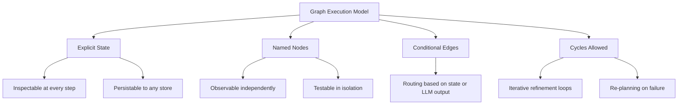

**Explicit state** means every piece of information the system needs to make decisions is named, typed, and present as a data structure — not hidden in local variables, thread memory, or prompt context. This is the single most important design property for debuggability and correctness.

**Named nodes** are independently testable units of behavior. You can unit test a node that calls an LLM, mock the LLM response, and verify the node's state mutation without running the full graph.

**Conditional edges** allow routing decisions to be first-class logic rather than if-statements buried inside pipeline steps. They make control flow visible.

**Cycles** allow iterative refinement, retry loops, re-planning, and any behavior that requires the system to revisit earlier decisions based on new information.

### 1.4 What LangGraph Is — And Is Not

LangGraph is a **low-level orchestration runtime**. This distinction matters enormously.

It is not:
- A prompt framework
- An agent template
- An opinionated "build agents this way" system
- A replacement for application logic

It is:
- A graph execution engine with state as its central concept
- A persistence and checkpointing system
- An interrupt/resume mechanism for human-in-the-loop workflows
- An observability substrate for tracing graph execution

This means LangGraph gives you the machinery to build almost any stateful AI workflow architecture. It also means the architecture is your responsibility. The framework will not protect you from designing a graph that loops forever, accumulates unbounded state, or routes incorrectly based on LLM outputs.

### 1.5 When to Use LangGraph

Use LangGraph when your system requires:

| Requirement | Why LangGraph Fits |
|---|---|
| Multi-step workflows with branching | Conditional edges handle routing natively |
| Human approval at intermediate steps | First-class interrupt/resume support |
| Retries and failure recovery | Checkpointing enables step-level resumption |
| Iterative refinement loops | Cycles are a native construct |
| Long-running workflows (minutes to days) | Durable execution with persistence |
| Multi-agent coordination | Subgraph composition models agent hierarchies |
| Observable, debuggable workflows | Every state transition is traceable |

**When LangGraph may be overkill:**

- Single-turn LLM calls with no branching
- Simple retrieval-augmented generation (RAG) with no iteration
- Stateless API transformation layers
- Workflows where Temporal or Prefect is already established infrastructure

The graph model adds complexity. Don't add it without a reason.

---

## Chapter 2: LangGraph's Mental Model

### 2.1 The Execution Model

LangGraph executes graphs as a series of **steps**. Each step executes one node. Between steps, the framework:

1. Persists the current state to the configured checkpointer
2. Evaluates outgoing edges to determine the next node(s)
3. Optionally pauses execution if an interrupt is configured

This execution model is the foundation of everything. Understanding it precisely prevents an entire class of bugs.

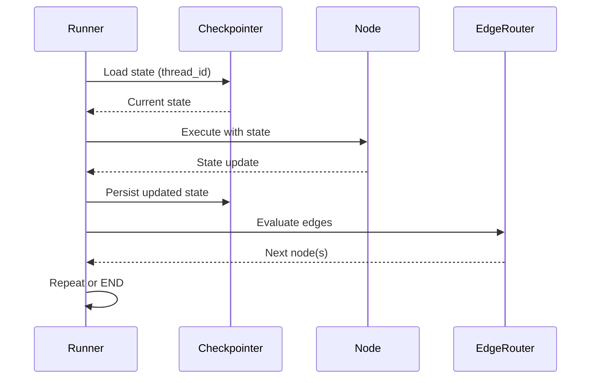

Notice what happens when a node fails: the state has already been persisted at the point before that node ran (because checkpointing happened at the previous step). The system can resume from that checkpoint. This is durable execution.

### 2.2 Thread Identity and Execution Context

Every graph execution runs in the context of a **thread**. A thread is identified by a `thread_id` — a string you provide. All checkpoints, interrupts, and history are scoped to a thread.

This is analogous to a "session" or "run" in other systems. The difference: in LangGraph, a thread is durable. If you crash the process, provide the same `thread_id` to a new execution, and the graph resumes exactly where it left off.

Thread design is an architectural decision, not a framework detail. Threads should correspond to meaningful units of your business domain: a customer support ticket, a code review, a document generation job, a research task. The `thread_id` is the key into your persistence store.

```python
# Thread identity is your responsibility to design
config = {
    "configurable": {
        "thread_id": f"support-ticket-{ticket_id}",  # Domain-meaningful
        # Not: str(uuid4())  # Opaque, non-resumable in practice
    }
}
```

### 2.3 The State-First Mental Model

The most important shift for engineers new to LangGraph: **design your state before you design your nodes.**

In traditional software, you design your functions, then figure out what data they need. In LangGraph, this is backwards. State is the specification of your workflow. Every node is a function that transforms state. Every edge is a function that reads state and returns a destination.

Your state schema is:
- The contract between all nodes
- The persistence format at every checkpoint
- The observable record of everything the workflow has done
- The complete context needed to resume a paused execution

If your state schema is wrong, everything else will be wrong. State design is the primary design activity in LangGraph.

### 2.4 Nodes Are Pure-ish Functions

A LangGraph node should be conceptualized as a function with this signature:

```
State → StateUpdate
```

It receives the current state, performs some computation (which may be I/O-heavy — calling an LLM, querying a database, running a tool), and returns a dictionary of state fields to update.

"Pure-ish" because nodes frequently have side effects (LLM calls are I/O, tool calls mutate external systems). But the node's relationship to the graph state should be pure: it reads state, it returns updates, it does not mutate the state object in place.

This distinction matters for testing. A node that accepts a `state` argument and returns a dict can be tested without a running graph, without a checkpointer, and without an actual LLM if you mock it.

### 2.5 Edges Are Routing Logic

Edges come in two forms:

**Unconditional edges** connect one node to another always. Use these when the flow is deterministic: after parsing input, always validate it.

**Conditional edges** connect one node to one of several destinations based on a routing function. The routing function receives the current state and returns a node name (or `END`).

```python
def route_after_validation(state: WorkflowState) -> str:
    if state.validation_result == "passed":
        return "execute_action"
    elif state.validation_result == "needs_clarification":
        return "request_human_input"
    else:
        return "handle_error"
```

The routing function is pure logic. It should not call LLMs, make network requests, or have side effects. Route based on state. This keeps routing fast, testable, and deterministic.

**Anti-pattern:** Routing functions that call LLMs to decide where to go next. Put the LLM call in a node that writes its decision to state. Route based on that state field. This makes the routing decision observable, testable, and retry-safe.

### 2.6 The Compilation Step

You do not run a LangGraph graph directly. You compile it first. Compilation:

- Validates the graph structure (unreachable nodes, missing edges, undefined routes)
- Attaches the checkpointer
- Produces a runnable object

```python
graph = StateGraph(MyState)
# ... add nodes and edges ...
app = graph.compile(checkpointer=checkpointer)
```

The compiled `app` is what you invoke. This separation allows you to build and validate graph structure independently from running it — useful in tests.

### 2.7 Streaming and Observability

LangGraph is designed for streaming execution. When you invoke a compiled graph with `.stream()`, you receive an iterator of step events as they complete. Each event contains the node name, the state update produced, and metadata.

This is not optional for production. Streaming is how you:
- Show progress to users in real time
- Feed events to observability systems
- Detect and react to intermediate failures
- Implement cancellation

Do not build production systems on top of `.invoke()` without understanding that `.invoke()` blocks until completion, provides no intermediate visibility, and makes real-time UX impossible.

---

## Chapter 3: State — The Core Abstraction

### 3.1 Why State Is the Central Design Artifact

State in LangGraph is not a convenience — it is the formal specification of your workflow. Everything the graph knows about the world, its history, its goals, and its current progress lives in state. This is a deliberate architectural choice that deserves unpacking.

Compare two approaches:

**Implicit state (pipeline approach):**
```
Node A returns value → passed as argument to Node B → passed to Node C
```
The "state" exists only as function arguments, invisible between nodes, impossible to inspect without adding logging to every function, and non-resumable if execution fails.

**Explicit state (LangGraph approach):**
```
Node A writes to state["parsed_intent"]
Node B reads state["parsed_intent"], writes to state["retrieved_docs"]
Node C reads state["retrieved_docs"], writes to state["response"]
```
At every point in execution, the complete state is a named, typed data structure that can be logged, persisted, inspected, and restored.

The overhead of explicit state is low. The debuggability gain is enormous.

### 3.2 Defining State with TypedDict

The canonical LangGraph state definition uses `TypedDict`:

```python
from typing import TypedDict, Annotated, Sequence
from langchain_core.messages import BaseMessage
import operator

class AgentState(TypedDict):
    # Conversation history — accumulated across steps
    messages: Annotated[list[BaseMessage], operator.add]
    
    # The user's intent, extracted early in the workflow
    intent: str
    
    # Retrieved documents from the knowledge base
    context_docs: list[dict]
    
    # The agent's plan — may be revised across iterations
    plan: list[str]
    
    # Current step in the plan being executed
    current_step: int
    
    # Accumulated tool call results
    tool_results: Annotated[list[dict], operator.add]
    
    # Final answer when complete
    final_answer: str | None
    
    # Error tracking
    error: str | None
    retry_count: int
```

Every field is a design decision. Consider:
- What does this node need to read?
- What does this node need to write?
- Does this field accumulate (use a reducer) or replace (last-write-wins)?
- Is this field always present, or optional?
- What is the type contract?

### 3.3 State Field Taxonomy

Not all state fields are alike. Understanding the categories helps you design schemas that are coherent and maintainable.

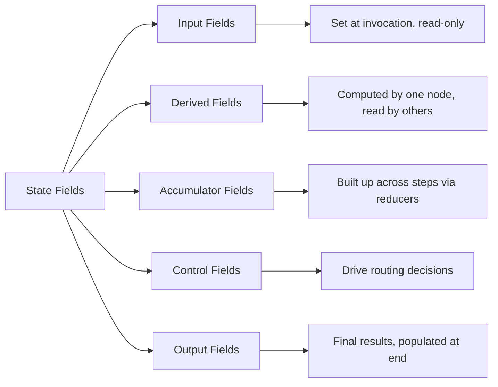

**Input fields** are set when the graph is invoked. They define the task. They should be treated as immutable after invocation.

```python
user_query: str          # Set at invoke time
session_id: str          # Set at invoke time
user_context: dict       # Set at invoke time
```

**Derived fields** are computed by exactly one node and read by others. They represent intermediate results.

```python
parsed_intent: str           # Written by intent_parser node
retrieved_documents: list    # Written by retrieval node
validation_result: str       # Written by validation node
```

**Accumulator fields** grow across multiple steps. They use reducers to merge updates.

```python
messages: Annotated[list, operator.add]      # Chat history
tool_calls_made: Annotated[list, operator.add]  # Audit trail
```

**Control fields** exist to drive routing logic. They have no semantic content of their own — they are signals.

```python
next_action: str        # "continue" | "escalate" | "complete"
needs_human: bool       # Triggers interrupt
iteration_count: int    # Guards against infinite loops
```

**Output fields** accumulate the final result.

```python
final_answer: str | None
generated_artifacts: list[str]
citations: list[dict]
```

### 3.4 State Schema Anti-Patterns

**The Blob Anti-Pattern**: Putting everything in a single `data: dict` field.

```python
# Bad: Opaque, untyped, untestable
class BadState(TypedDict):
    data: dict  # "Everything goes here"
```

This destroys type safety, makes routing functions fragile (they have to dig into nested dicts), and makes state inspection useless.

**The Overloaded Message List**: Using only `messages` to pass all information between nodes.

```python
# Bad: Piggybacks all data on the message stream
# "Here are the docs: [...]" as an AI message
# Routing checks messages[-1].content.startswith("Here are the docs")
```

This is fragile, makes routing dependent on string parsing of LLM output, and conflates conversation history with execution state.

**The Fat State Anti-Pattern**: Putting binary data, full document contents, or large embeddings directly in state.

```python
# Bad: State should contain references, not large data
class FatState(TypedDict):
    document_contents: list[str]  # Could be megabytes
    embeddings: list[list[float]] # Should be in a vector store
```

State is serialized at every checkpoint. Large state means expensive persistence and slow resume times. Store large data externally; put references (IDs, URLs, keys) in state.

**Mutable Nested State**: Relying on mutations to nested objects in state.

```python
# Bad: Reducer sees no change because it's the same object reference
def bad_node(state):
    state["config"]["retries"] += 1  # Mutates in place
    return {}  # Returns no update — the mutation is lost on resume
```

Always return explicit state updates. Never mutate state in place.

### 3.5 State Versioning and Schema Evolution

State schemas change over time. A field added in v2 of your application doesn't exist in checkpoints from v1. This creates schema compatibility problems that are easy to ignore until they cause production incidents.

**Design for forward compatibility from the start:**

```python
class AgentState(TypedDict):
    # Required fields — always present
    user_query: str
    messages: Annotated[list, operator.add]
    
    # Optional fields with defaults — safe to add in later versions
    intent: str | None          # Added in v1.1
    confidence_score: float | None  # Added in v1.2
    retry_count: int            # Added in v1.3, defaults to 0
```

Optional fields with `None` defaults can be added to later schema versions without breaking existing checkpoints — the old checkpoints simply won't have the field, and your nodes should handle that with `state.get("new_field")` rather than `state["new_field"]`.

**For breaking schema changes**, version your state explicitly:

```python
class AgentStateV2(TypedDict):
    schema_version: Literal["2.0"]
    # ... fields ...
```

And build a migration path before deploying. Never assume old checkpoints will be compatible with structural changes to required fields.

### 3.6 Modeling Business State vs. Execution State

This is a design discipline that separates maintainable LangGraph codebases from unmaintainable ones.

**Execution state** is framework-level bookkeeping: which step are we on, how many retries have we done, did the last node succeed?

**Business state** is domain-level information: what is the customer's account status, what documents did we retrieve, what is the draft response?

Mixing them creates state schemas that are hard to understand and impossible to reuse. Separate them explicitly:

```python
class ExecutionContext(TypedDict):
    """Framework-level execution tracking"""
    iteration_count: int
    last_error: str | None
    needs_human_review: bool
    execution_phase: str  # "planning" | "acting" | "verifying"

class BusinessContext(TypedDict):
    """Domain-level workflow data"""
    customer_id: str
    ticket_category: str
    retrieved_policies: list[dict]
    draft_response: str | None
    resolution_code: str | None

class FullState(ExecutionContext, BusinessContext):
    """Combined state — composed from typed components"""
    messages: Annotated[list, operator.add]
```

This composition pattern lets you test business logic separately from execution logic, reuse execution patterns across different business workflows, and reason about the two concerns independently.

### 3.7 State as the Observability Interface

A properly designed state schema is also your observability interface. When you persist state at every step, you get a complete, queryable audit trail of everything your system did.

This enables:
- **Debugging**: Inspect the exact state at any point in a failed execution
- **Replay**: Re-run from any checkpoint with modified state
- **Auditing**: Show regulators or customers exactly what the system decided and why
- **Evaluation**: Collect real execution traces for offline evaluation

The checklist for state-as-observability:

- [ ] Every decision is reflected in a state field, not just in a log message
- [ ] Every external call's result is stored in state before being used
- [ ] Every routing decision traces to a readable state field
- [ ] State snapshots at every checkpoint are independently interpretable
- [ ] State schema documents the meaning of every field

If a future engineer must read your state snapshot to understand what your system was doing at time T, can they? If not, your state schema has gaps.

---

---

# Part II — Core Mechanics

---

## Chapter 4: Nodes, Edges, and Routing

### 4.1 Node Design Principles

A node is the unit of work in a LangGraph graph. Every non-trivial design decision about your node granularity has downstream consequences for testability, observability, retry behavior, and cost.

**The single-responsibility principle for nodes:**

Each node should do one thing: either call an external system (LLM, database, API, tool), or perform a pure transformation on state (parsing, validation, formatting), not both.

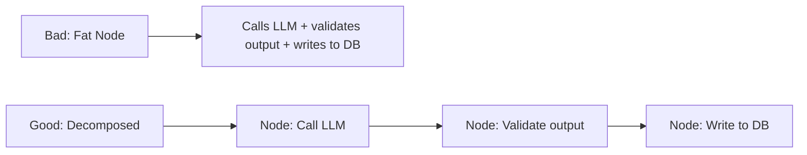

**Why this matters:**
- If the DB write fails, you retry only the DB write — not the expensive LLM call
- The validation node is pure Python and can be unit tested without mocking anything
- Observability shows exactly which step failed

**Node granularity trade-offs:**

| Finer Granularity | Coarser Granularity |
|---|---|
| More precise retry targets | Fewer nodes to maintain |
| Better observability | Less state management overhead |
| Isolated testability | Fewer checkpoint writes |
| Higher state management cost | Harder to debug failures |
| More checkpoint overhead | Harder to retry selectively |

**Rule of thumb**: When in doubt, err toward finer granularity during development. You can always merge nodes that always run sequentially and never fail independently. You cannot easily split a fat node without breaking checkpoints.

### 4.2 Node Implementation Patterns

**The LLM Call Node:**

```python
from langchain_core.messages import HumanMessage, SystemMessage
from langchain_openai import ChatOpenAI

llm = ChatOpenAI(model="gpt-4o", temperature=0)

def call_llm_node(state: AgentState) -> dict:
    """
    Single responsibility: call the LLM with current context.
    Does not validate output — that's the next node's job.
    """
    system_prompt = build_system_prompt(state)
    user_message = build_user_message(state)
    
    response = llm.invoke([
        SystemMessage(content=system_prompt),
        HumanMessage(content=user_message),
    ])
    
    return {
        "messages": [response],  # Accumulated by reducer
        "raw_llm_response": response.content,
        "last_node": "call_llm",
    }
```

**The Validation Node:**

```python
def validate_output_node(state: AgentState) -> dict:
    """
    Pure logic: validates the LLM output stored in state.
    No external calls — fast, testable, deterministic.
    """
    raw = state.get("raw_llm_response", "")
    
    validation_issues = []
    if not raw:
        validation_issues.append("Empty response")
    if len(raw) < 10:
        validation_issues.append("Response too short")
    # Domain-specific validation...
    
    return {
        "validation_passed": len(validation_issues) == 0,
        "validation_issues": validation_issues,
        "retry_count": state.get("retry_count", 0),
    }
```

**The Tool Execution Node:**

```python
async def execute_tools_node(state: AgentState) -> dict:
    """
    Executes tool calls requested in the last LLM response.
    Returns structured results to state.
    """
    last_message = state["messages"][-1]
    tool_results = []
    
    for tool_call in last_message.tool_calls:
        tool = tool_registry.get(tool_call["name"])
        if tool is None:
            tool_results.append({
                "tool_call_id": tool_call["id"],
                "result": f"Error: unknown tool {tool_call['name']}",
                "success": False,
            })
            continue
            
        try:
            result = await tool.ainvoke(tool_call["args"])
            tool_results.append({
                "tool_call_id": tool_call["id"],
                "result": result,
                "success": True,
            })
        except Exception as e:
            tool_results.append({
                "tool_call_id": tool_call["id"],
                "result": f"Error: {str(e)}",
                "success": False,
            })
    
    return {
        "tool_results": tool_results,  # Accumulated by reducer
        "tool_execution_complete": True,
    }
```

### 4.3 Conditional Edge Design

Conditional edges are routing functions. They receive state and return a node name. Good conditional edge design is:

**Read state, do not compute:**

```python
# Good: reads a state field that was computed by a node
def route_after_validation(state: AgentState) -> str:
    if state["validation_passed"]:
        return "format_response"
    elif state["retry_count"] < 3:
        return "call_llm"  # Retry
    else:
        return "handle_failure"

# Bad: makes a decision inline (hidden logic, not in state)
def route_after_validation(state: AgentState) -> str:
    raw = state["raw_llm_response"]
    if len(raw) > 50 and "error" not in raw.lower():  # Hidden rule
        return "format_response"
    return "call_llm"
```

The "bad" example has routing logic that isn't captured in state. If you need to debug why the graph took a particular path, you cannot tell from state inspection alone.

**Handle all cases:**

```python
def route_after_intent(state: AgentState) -> str:
    intent = state.get("intent", "unknown")
    
    routes = {
        "question_answering": "retrieve_context",
        "task_execution": "plan_task",
        "clarification": "request_clarification",
        "out_of_scope": "handle_oos",
    }
    
    # Always have a default — never let routing return an undefined node
    return routes.get(intent, "handle_unknown_intent")
```

### 4.4 Graph Topology Patterns

The topology of your graph — how nodes connect — is an architectural expression of your workflow's control flow. Four fundamental patterns:

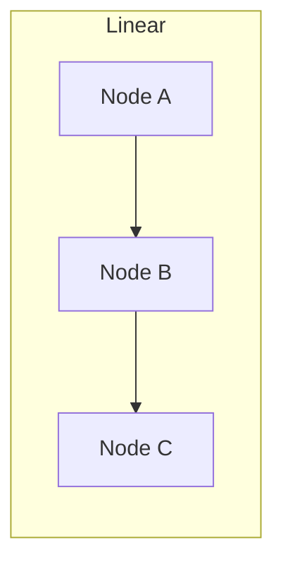

**Linear graphs**: Deterministic pipelines. Use when every step always runs, always in order, and no branching is needed. Rare in real agent systems but appropriate for preprocessing or post-processing stages.

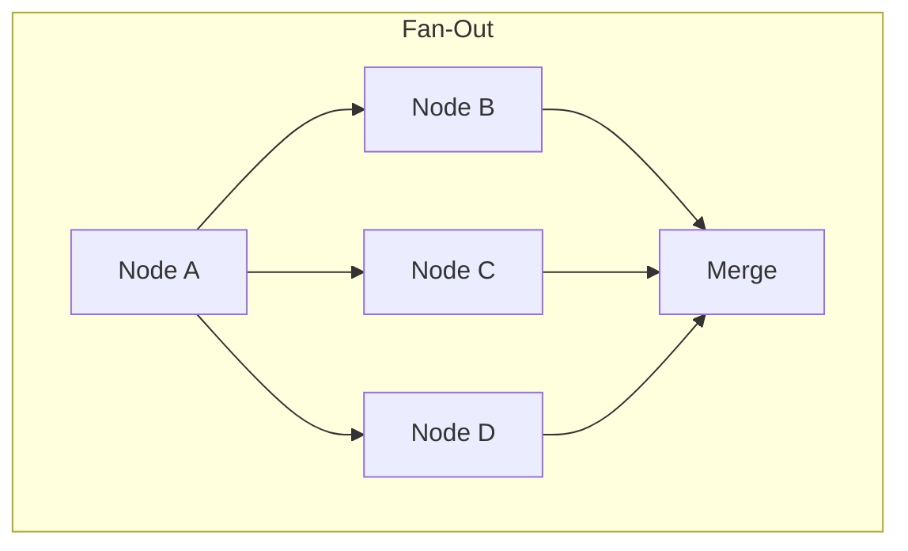

**Fan-out / fan-in**: Parallel execution of independent tasks followed by result aggregation. Use when subtasks are independent and can be parallelized. The merge node must use reducers that handle concurrent writes.

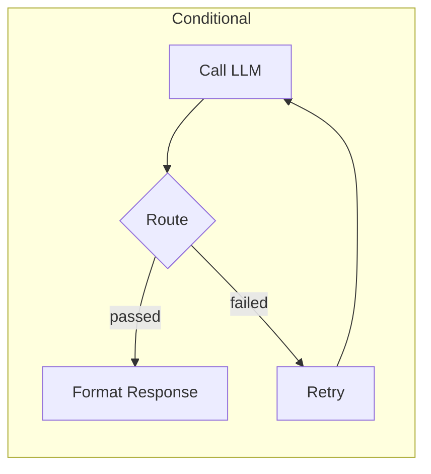

**Conditional branching**: Most common pattern in real agent systems. The routing function determines the next node based on state. Cycles are how retry logic is expressed.

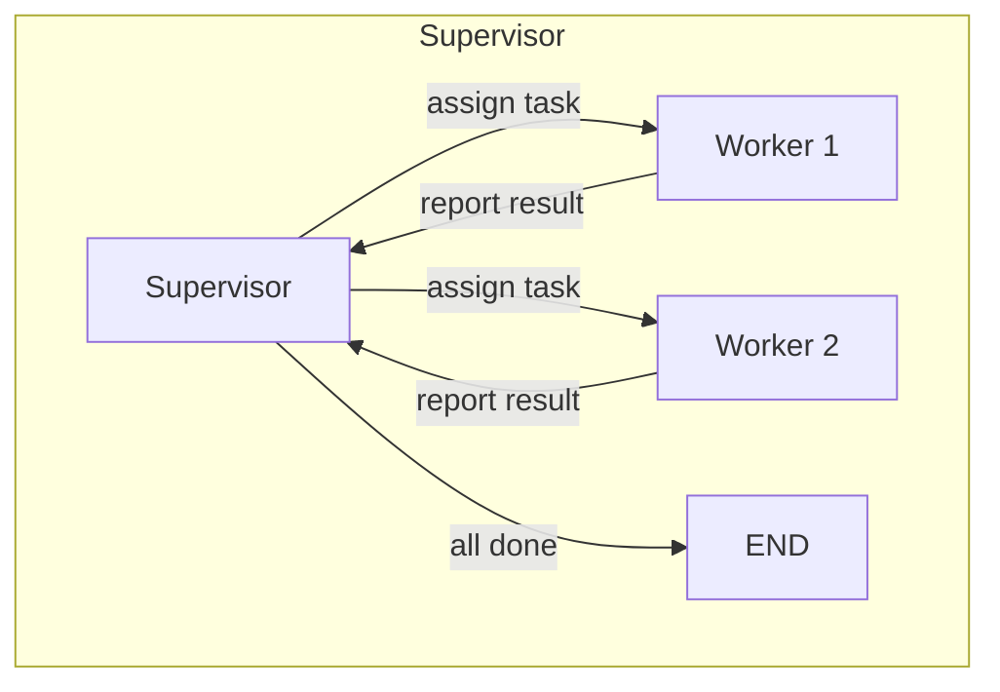

**Hub-and-spoke (Supervisor)**: A central node that routes to specialized worker nodes and collects their results. The supervisor itself may be an LLM. This is the basis of multi-agent supervisor architectures (Chapter 9).

### 4.5 Cycle Design and Safety

Cycles are how you implement iteration in LangGraph. They are also how you create infinite loops. Every cycle in your graph must have a termination condition.

**The mandatory cycle safety pattern:**

```python
class IterativeState(TypedDict):
    messages: Annotated[list, operator.add]
    iteration_count: int          # Always track this
    max_iterations: int           # Always set this
    task_complete: bool
    result: str | None

def check_iteration_limit(state: IterativeState) -> str:
    """Always check the limit before re-entering the cycle."""
    if state["task_complete"]:
        return "format_result"
    
    if state["iteration_count"] >= state["max_iterations"]:
        # Force termination even if task is not complete
        return "handle_max_iterations"
    
    return "continue_iteration"
```

**Iteration counter increment** must happen in the node that re-enters the cycle, not in the routing function:

```python
def iteration_node(state: IterativeState) -> dict:
    # ... do the work ...
    return {
        "iteration_count": state["iteration_count"] + 1,
        "task_complete": check_if_complete(result),
    }
```

**Practical iteration limits:**

| Workflow Type | Suggested Max Iterations |
|---|---|
| Tool-calling ReAct loops | 10–20 |
| Refinement/editing loops | 3–5 |
| Planning revision loops | 3–7 |
| Verification loops | 2–3 |

These are starting points, not rules. Profile your workflows under production conditions to find appropriate limits.

---

## Chapter 5: Reducers and State Evolution

### 5.1 The Reducer Concept

When LangGraph executes a node, the node returns a partial state update — a dict containing only the fields it wants to change. The framework must then merge this update with the existing state.

The merge strategy for each field is controlled by its **reducer**. Understanding reducers is essential for correct state management, especially in parallel or multi-node execution.

Without an explicit reducer, LangGraph uses **last-write-wins**: the new value completely replaces the old one.

```python
# No reducer: last-write-wins
current_plan: list[str]          # Node B's value replaces Node A's value entirely
```

With a reducer annotation, the framework calls the reducer function to merge old and new values:

```python
# With reducer: values are merged
messages: Annotated[list[BaseMessage], operator.add]  # New messages appended
```

### 5.2 Built-in Reducers

**`operator.add`**: The most common reducer. Appends new values to an existing list.

```python
from typing import Annotated
import operator

messages: Annotated[list, operator.add]
# Old: [msg1, msg2]  +  Update: [msg3]  =  [msg1, msg2, msg3]
```

**Custom reducers**: Any function with signature `(existing: T, new: T) -> T`.

```python
def merge_dicts(existing: dict, new: dict) -> dict:
    """Deep merge two dicts, new values take precedence."""
    return {**existing, **new}

def keep_unique(existing: list, new: list) -> list:
    """Add only items not already present."""
    seen = {str(item) for item in existing}
    return existing + [item for item in new if str(item) not in seen]

def take_latest(existing: Any, new: Any) -> Any:
    """Explicit last-write-wins (same as default, but documented)."""
    return new if new is not None else existing
```

### 5.3 Reducer Design Patterns

**The message accumulator** is the canonical LangGraph pattern. All conversation history is accumulated via `operator.add`. Never replace the message list — append to it.

```python
class ConversationState(TypedDict):
    messages: Annotated[list[BaseMessage], operator.add]
    # Each node adds to messages; the full history is always available
```

**The idempotent accumulator** prevents duplicate entries — important when nodes may re-execute due to retries:

```python
def add_unique_results(existing: list[dict], new: list[dict]) -> list[dict]:
    existing_ids = {r["id"] for r in existing if "id" in r}
    return existing + [r for r in new if r.get("id") not in existing_ids]

tool_results: Annotated[list[dict], add_unique_results]
```

**The capped accumulator** prevents unbounded state growth:

```python
def keep_last_n(n: int):
    def reducer(existing: list, new: list) -> list:
        combined = existing + new
        return combined[-n:]  # Keep only the last N items
    return reducer

recent_observations: Annotated[list[str], keep_last_n(50)]
```

### 5.4 Parallel Execution and Reducer Correctness

When a graph has parallel branches (fan-out), multiple nodes may update the same state fields concurrently. Without correct reducers, concurrent updates cause data loss.

Consider two worker nodes that both add to an `errors` list:

```python
# Without reducer (last-write-wins):
# Worker A writes: errors = ["error from A"]
# Worker B writes: errors = ["error from B"]
# Final state: errors = ["error from B"]  ← Worker A's error lost!

# With operator.add reducer:
# Worker A writes: errors = ["error from A"]
# Worker B writes: errors = ["error from B"]
# LangGraph merges: errors = ["error from A", "error from B"]  ← Correct
```

**Rule: Every field that can be updated by parallel nodes must have an explicit reducer.**

```python
class ParallelWorkflowState(TypedDict):
    subtask_results: Annotated[list[dict], operator.add]  # ← Required
    errors: Annotated[list[str], operator.add]            # ← Required
    warnings: Annotated[list[str], operator.add]          # ← Required
    
    # These are safe as last-write-wins only if set by exactly one node:
    final_summary: str      # Only the merge node writes this
    task_complete: bool     # Only the merge node writes this
```

### 5.5 State Update Semantics

Nodes return dicts. Only the keys present in the returned dict are updated. Keys not present in the return value are unchanged.

```python
def partial_update_node(state: MyState) -> dict:
    # Only updates two fields. All other state fields are preserved.
    return {
        "processed_count": state["processed_count"] + 1,
        "last_processed_id": current_item["id"],
    }
    # state["messages"], state["plan"], etc. are untouched
```

This is critical for correctness: nodes should only return the fields they actually changed. Returning the full state on every update means every node is responsible for preserving every other field — a maintenance nightmare.

**The explicit-None pattern**: Resetting a field requires explicitly returning `None`, not omitting it.

```python
def reset_draft_node(state: MyState) -> dict:
    return {
        "draft_response": None,    # Explicitly reset
        "draft_feedback": None,    # Explicitly reset
        # Do NOT omit these if you want to clear them
    }
```

---

## Chapter 6: Checkpointing and Durable Execution

### 6.1 What Checkpointing Actually Does

Checkpointing is the mechanism that makes LangGraph workflows **durable** — able to survive process restarts, hardware failures, and intentional pauses. It is not optional for production.

After every node execution, LangGraph serializes the complete current state and writes it to the configured checkpointer backend, tagged with the `thread_id` and a sequence number.

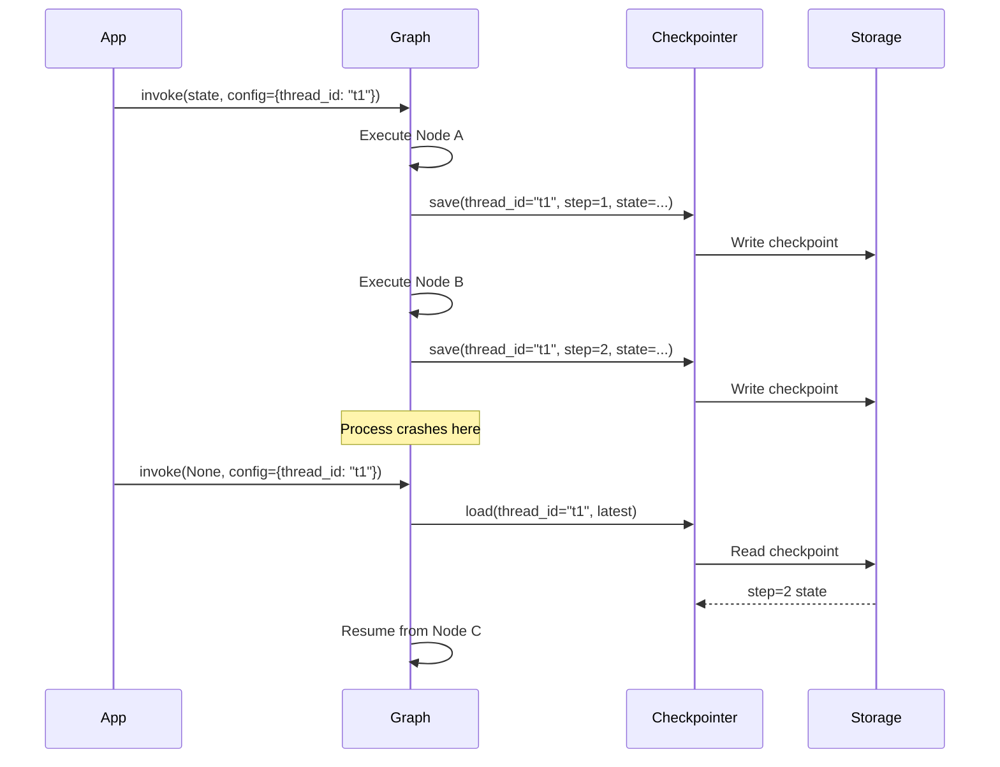

The key insight: when you invoke with a `thread_id` and pass `None` as input (or omit the input), LangGraph loads the latest checkpoint for that thread and continues from where it stopped.

### 6.2 Checkpointer Backends

LangGraph provides checkpointer implementations for different storage backends:

| Backend | Use Case | Characteristics |
|---|---|---|
| `MemorySaver` | Development and testing only | In-process, lost on restart |
| `SqliteSaver` | Single-process production | File-based, durable, simple |
| `PostgresSaver` | Multi-process production | Shared, scalable, query-able |
| `RedisSaver` | High-throughput, short-lived | Fast, volatile by default |
| Custom | Special requirements | Implement the `BaseCheckpointSaver` interface |

**Never use `MemorySaver` in production.** It is lost when the process ends. Use it only in tests and development environments where you don't need durability.

```python
# Development
from langgraph.checkpoint.memory import MemorySaver
checkpointer = MemorySaver()

# Production (Postgres)
from langgraph.checkpoint.postgres import PostgresSaver
checkpointer = PostgresSaver.from_conn_string(
    os.environ["DATABASE_URL"]
)

# Compile with checkpointer
app = graph.compile(checkpointer=checkpointer)
```

### 6.3 Checkpoint Storage Design

Checkpoints accumulate. A long-running thread with hundreds of steps generates hundreds of checkpoints. You need a storage strategy.

**Retention policy:**

```python
# Checkpoints are queryable
history = app.get_state_history(
    config={"configurable": {"thread_id": "t1"}}
)

# You can delete old checkpoints to control storage growth
# (Implementation depends on your checkpointer backend)
```

**What to store checkpoints in:**

For most production systems, a relational database (PostgreSQL) is the right choice. It gives you:
- Durable, transactional writes
- Queryable checkpoint history for debugging
- Easy backup and recovery
- Familiar operational tooling

For very high-throughput systems where checkpoint write latency matters, a dedicated key-value store (Redis with AOF persistence, or DynamoDB) may be preferable.

**Schema considerations:**

Your checkpoint storage needs to grow with your application. Plan for:
- Index on `(thread_id, checkpoint_id)` for lookup
- Index on `created_at` for retention/cleanup queries
- Enough storage for `[max_concurrent_threads × avg_thread_steps × avg_state_size]`
- Monitoring for checkpoint write latency (slow checkpointing adds latency to every step)

### 6.4 Checkpoint Patterns for Reliability

**The resume-from-failure pattern** is automatic with checkpointing, but you need to design invocation correctly:

```python
async def run_or_resume_workflow(
    thread_id: str,
    initial_input: dict | None,
    app: CompiledGraph,
) -> AsyncIterator:
    """
    If the thread has existing checkpoints, resume.
    Otherwise, start fresh with initial_input.
    """
    config = {"configurable": {"thread_id": thread_id}}
    
    # Check for existing state
    current_state = await app.aget_state(config)
    
    if current_state.next:
        # There are pending nodes — resume with no new input
        return app.astream(None, config=config)
    else:
        # New thread or completed thread — start fresh
        return app.astream(initial_input, config=config)
```

**The state inspection pattern** lets you inspect state at any checkpoint for debugging:

```python
async def inspect_thread_history(thread_id: str, app: CompiledGraph):
    config = {"configurable": {"thread_id": thread_id}}
    
    # Get all checkpoints for this thread
    history = []
    async for state_snapshot in app.aget_state_history(config):
        history.append({
            "checkpoint_id": state_snapshot.config["configurable"]["checkpoint_id"],
            "next_nodes": state_snapshot.next,
            "step": state_snapshot.metadata.get("step"),
            "state_keys": list(state_snapshot.values.keys()),
        })
    
    return history
```

**The rollback pattern**: You can roll back to a previous checkpoint by invoking with a specific `checkpoint_id`. This is powerful for debugging and for implementing "undo" functionality in human-in-the-loop workflows.

```python
async def rollback_to_checkpoint(
    thread_id: str,
    checkpoint_id: str,
    app: CompiledGraph,
):
    config = {
        "configurable": {
            "thread_id": thread_id,
            "checkpoint_id": checkpoint_id,  # Resume from this specific checkpoint
        }
    }
    
    # Continue execution from the specified checkpoint
    async for event in app.astream(None, config=config):
        yield event
```

### 6.5 Checkpointing Performance Considerations

Checkpointing adds latency to every node execution. For a workflow with 20 nodes that each take 1 second, checkpoint overhead of 50ms per node adds 1 second to total runtime — a 5% overhead. This is usually acceptable.

It becomes unacceptable when:
- State is very large (megabytes per checkpoint)
- The checkpointer backend is slow or overloaded
- Nodes are very fast (checkpoint overhead dominates)

**Optimization strategies:**

1. **Right-size your state**: References over content. IDs over full objects. Pointers to external storage over inline data.

2. **Use async checkpointers**: Synchronous checkpoint writes block node execution. Always use async checkpointer implementations in production async applications.

3. **Batch small state fields**: If you have 20 small fields, group related ones into a single nested dict to reduce serialization overhead.

4. **Monitor checkpoint latency**: Add metrics to your checkpointer or use LangSmith to track checkpoint write times.

---

## Chapter 7: Interrupts and Human-in-the-Loop

### 7.1 Why Interrupts Exist

Human-in-the-loop (HITL) is a first-class design pattern in LangGraph, not an afterthought. The interrupt mechanism allows a graph to pause at a specific node, wait indefinitely for human input, and resume with that input incorporated into state.

This solves a real production problem: AI agents are powerful but not infallible. High-stakes workflows — legal document review, financial transactions, medical decisions, security approvals — require human checkpoints. Without durable interrupts, you either block a thread indefinitely (unscalable) or require a completely different architecture.

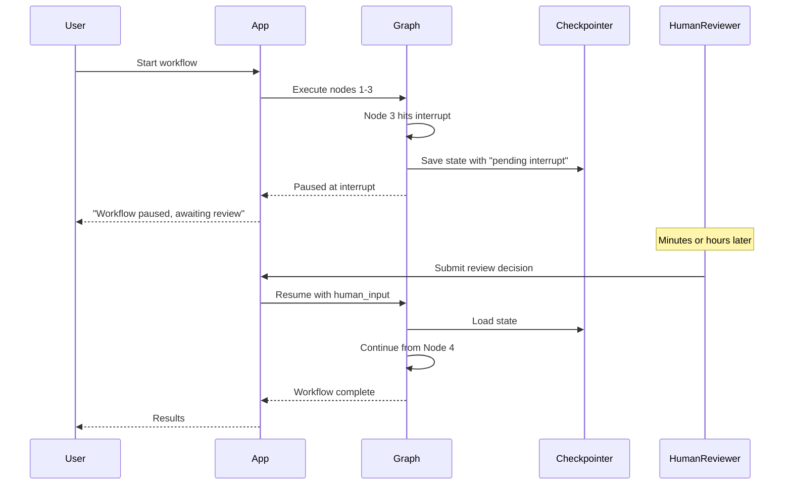

### 7.2 Interrupt Mechanics

Interrupts are configured at compile time by specifying which nodes should interrupt **before** or **after** execution:

```python
app = graph.compile(
    checkpointer=checkpointer,
    interrupt_before=["execute_financial_transaction"],  # Pause BEFORE execution
    interrupt_after=["generate_draft"],                  # Pause AFTER execution
)
```

`interrupt_before`: The graph pauses before executing the specified node. Human can review the state and decide whether to proceed, modify state, or abort.

`interrupt_after`: The graph executes the node, then pauses. Human can review the output and decide whether it's acceptable before continuing.

**The interrupt execution flow:**

```python
# 1. Start the workflow
config = {"configurable": {"thread_id": "approval-flow-123"}}
initial_state = {"transaction": transaction_data}

# Graph runs until it hits the interrupt point
for event in app.stream(initial_state, config=config):
    print(event)  # Prints events up to the interrupt
# Execution stops here. The graph is paused.

# 2. Inspect the paused state
current_state = app.get_state(config)
print("Pending nodes:", current_state.next)  # ['execute_financial_transaction']
print("State at pause:", current_state.values)

# 3. Human makes a decision
# Option A: Approve and continue
app.stream(None, config=config)  # Resume with no input change

# Option B: Modify state and continue
app.update_state(
    config,
    {"approved": True, "approver_notes": "Verified with client"},
)
app.stream(None, config=config)  # Resume with modified state

# Option C: Abort (update state to signal abort, then route to END)
app.update_state(config, {"abort": True, "abort_reason": "Policy violation"})
app.stream(None, config=config)
```

### 7.3 Dynamic Interrupts

Static `interrupt_before`/`interrupt_after` configurations are appropriate when you always interrupt at specific nodes. But many real workflows need conditional interrupts: pause only if the confidence is low, or only if the transaction amount exceeds a threshold.

Use the `interrupt()` function inside a node for dynamic interrupts:

```python
from langgraph.types import interrupt

def generate_and_review_node(state: WorkflowState) -> dict:
    draft = generate_draft(state)
    
    # Only interrupt if confidence is below threshold
    confidence = score_draft_confidence(draft)
    
    if confidence < 0.85:
        # This pauses execution here. The value passed to interrupt()
        # is available to the caller as the interrupt value.
        human_decision = interrupt({
            "draft": draft,
            "confidence": confidence,
            "reason_for_review": "Low confidence score",
        })
        
        # After resume, human_decision contains what the human sent
        if human_decision["action"] == "approve":
            return {"draft_response": draft, "approved": True}
        elif human_decision["action"] == "revise":
            return {"revision_feedback": human_decision["feedback"]}
        else:
            return {"abort": True}
    
    # High confidence: skip human review
    return {"draft_response": draft, "approved": True}
```

To resume after a dynamic interrupt, you pass the human's response via `Command`:

```python
from langgraph.types import Command

# Resume with the human's response
app.stream(
    Command(resume={"action": "approve"}),
    config=config,
)
```

### 7.4 HITL Workflow Architecture Patterns

**The approval gate pattern:** A single interrupt point where a human approves or rejects the workflow's plan before execution.

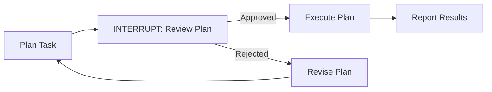

**The review-and-edit pattern:** The agent generates a draft; a human can edit it before it's finalized.

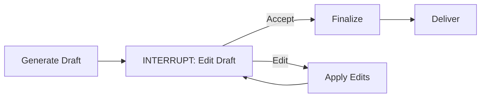

**The escalation pattern:** The agent handles routine cases autonomously; only unusual cases are escalated.

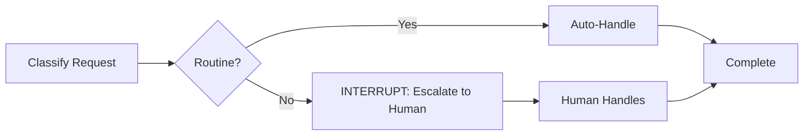

**The verification-before-action pattern:** Critical for agentic systems that take irreversible actions.

```python
def pre_action_interrupt_node(state: AgentState) -> dict:
    """
    Always interrupt before irreversible actions.
    Never let an agent delete data, send emails, or charge money
    without a human checkpoint in production.
    """
    proposed_actions = state["planned_actions"]
    irreversible = [a for a in proposed_actions if a["reversible"] is False]
    
    if irreversible:
        approval = interrupt({
            "proposed_actions": proposed_actions,
            "irreversible_actions": irreversible,
            "risk_assessment": assess_risk(irreversible),
        })
        return {"approved_actions": approval.get("approved_actions", [])}
    
    return {"approved_actions": proposed_actions}
```

### 7.5 Building HITL APIs

Interrupts require an API layer to connect the paused graph to human reviewers. The standard architecture:

```mermaid
graph TB
    subgraph Backend API
        A[POST /workflows - Start] --> B[Graph Runner]
        C[GET /workflows/{id}/review - Get pending] --> B
        D[POST /workflows/{id}/resume - Submit decision] --> B
        B --> E[Checkpointer]
    end
    
    subgraph Frontend
        F[Workflow UI] -->|start| A
        F -->|poll for pending| C
        F -->|submit decision| D
    end
    
    subgraph Human
        G[Reviewer] --> F
    end
```

```python
# FastAPI example
from fastapi import FastAPI
from langgraph.types import Command

app = FastAPI()
graph_app = compiled_langgraph_app

@app.post("/workflows")
async def start_workflow(request: WorkflowRequest):
    thread_id = f"workflow-{uuid4()}"
    config = {"configurable": {"thread_id": thread_id}}
    
    events = []
    async for event in graph_app.astream(request.input, config=config):
        events.append(event)
    
    state = await graph_app.aget_state(config)
    return {
        "thread_id": thread_id,
        "status": "awaiting_review" if state.next else "complete",
        "pending_review": state.values if state.next else None,
    }

@app.post("/workflows/{thread_id}/resume")
async def resume_workflow(thread_id: str, decision: ReviewDecision):
    config = {"configurable": {"thread_id": thread_id}}
    
    # Optionally update state with the human's modifications
    if decision.state_updates:
        await graph_app.aupdate_state(config, decision.state_updates)
    
    # Resume the workflow
    events = []
    async for event in graph_app.astream(
        Command(resume=decision.resume_value),
        config=config,
    ):
        events.append(event)
    
    state = await graph_app.aget_state(config)
    return {
        "status": "awaiting_review" if state.next else "complete",
        "result": state.values.get("final_result"),
    }
```

### 7.6 Timeout and SLA Management for HITL Workflows

Human reviewers are slow. A workflow waiting for human input might wait minutes, hours, or days. Your system needs to handle this gracefully.

**Patterns for HITL timeout management:**

1. **SLA tracking in state**: Record when the interrupt occurred; check elapsed time on resume.
```python
class HITLState(TypedDict):
    interrupt_timestamp: str | None  # ISO format
    sla_hours: int
    sla_breached: bool
```

2. **External SLA monitoring**: A separate background process checks all pending threads and escalates or auto-resolves if SLAs are breached.

3. **Expiry callbacks**: When an interrupt expires without human input, automatically resume with a default decision.

```python
async def check_and_auto_resolve_expired_workflows():
    """Background task — runs periodically"""
    pending_threads = await get_threads_pending_review()
    
    for thread in pending_threads:
        if is_sla_breached(thread):
            config = {"configurable": {"thread_id": thread.id}}
            await graph_app.astream(
                Command(resume={"action": "auto_approve", "reason": "sla_breach"}),
                config=config,
            )
```

4. **Never block on human input in a synchronous context.** HITL workflows are inherently asynchronous. The HTTP request that starts the workflow must return immediately. The webhook/polling mechanism handles resume. Never design a HITL workflow where a single HTTP connection waits for human input.

---

---

# Part III — Graph Architecture

---

## Chapter 8: Subgraphs and Modularity

### 8.1 Why Subgraphs

As LangGraph applications grow, monolithic graphs become unmanageable. A single graph with 40 nodes, 60 edges, and a state schema with 30 fields is impossible to reason about, test, or maintain.

Subgraphs are the primary modularity mechanism. A subgraph is a fully compiled LangGraph graph that is embedded as a single node in a parent graph. From the parent's perspective, it is a black box that receives state and returns state updates.

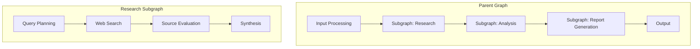

Subgraphs provide:

**Independent testability**: A subgraph can be compiled and tested completely independently of its parent.

**Reusability**: A well-designed subgraph (e.g., a "document retrieval and ranking" subgraph) can be used by multiple parent graphs.

**State isolation**: Subgraphs can have their own state schema, only surfacing relevant fields to the parent. This prevents state schema explosion.

**Team boundaries**: Different teams can own different subgraphs with clear interfaces between them.

### 8.2 Subgraph State Management

The key challenge with subgraphs is state mapping — converting between parent state and subgraph state. LangGraph supports two patterns:

**Shared state**: The subgraph uses the same state schema as the parent. Simple but creates tight coupling.

```python
# Parent and subgraph share the same state type
parent_graph = StateGraph(SharedState)
child_graph = StateGraph(SharedState)  # Same schema

# Add child as a node
parent_graph.add_node("child_workflow", child_graph.compile())
```

**Separate state with explicit transformation**: The subgraph has its own state schema; the parent provides wrapper nodes to translate.

```python
class ParentState(TypedDict):
    user_query: str
    retrieved_docs: list[dict]
    # ... parent-level fields

class ResearchSubgraphState(TypedDict):
    query: str
    search_results: list[dict]
    synthesized_findings: str
    # ... subgraph-specific fields

def enter_research_subgraph(parent_state: ParentState) -> ResearchSubgraphState:
    """Transform parent state into subgraph input."""
    return {
        "query": parent_state["user_query"],
        "search_results": [],
        "synthesized_findings": "",
    }

def exit_research_subgraph(subgraph_state: ResearchSubgraphState) -> dict:
    """Transform subgraph output back to parent state updates."""
    return {
        "retrieved_docs": subgraph_state["search_results"],
        "research_findings": subgraph_state["synthesized_findings"],
    }

# Wrap the subgraph with transformation nodes
parent_graph.add_node("prepare_research", enter_research_subgraph)
parent_graph.add_node("research", research_subgraph.compile())
parent_graph.add_node("merge_research", exit_research_subgraph)
parent_graph.add_edge("prepare_research", "research")
parent_graph.add_edge("research", "merge_research")
```

**Prefer separate state with explicit transformation for non-trivial subgraphs.** The transformation is explicit overhead, but it provides a clean interface contract. When the parent's state schema changes, the transformation layer absorbs the change without requiring subgraph modification.

### 8.3 Designing Subgraph Boundaries

Good subgraph boundaries follow natural domain decomposition. Ask:

1. **Could this be owned by a different team?** If yes, it should be a subgraph.
2. **Is this reusable in other parent graphs?** If yes, it should be a subgraph.
3. **Does this have a coherent, nameable purpose?** "Document research," "code review," "data validation" — if it has a name, it's probably a subgraph.
4. **Does it have a clean input/output contract?** Subgraphs with 15 input fields and 12 output fields have boundary problems.

**Anti-pattern: Subgraphs as performance optimization**. Do not create subgraphs to "parallelize" execution unless you actually have independent subtasks. The overhead of subgraph state management is not worth it for linear sequences of nodes.

### 8.4 Subgraph Composition Patterns

**Sequential composition:** Subgraphs execute in sequence, each building on the previous.

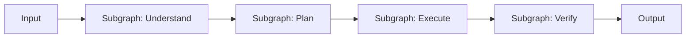

**Parallel composition:** Independent subgraphs execute concurrently; results are merged.

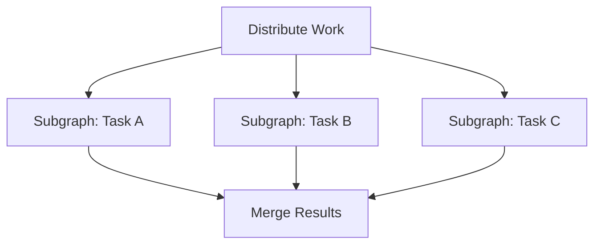

**Conditional composition:** Route to different subgraphs based on state.

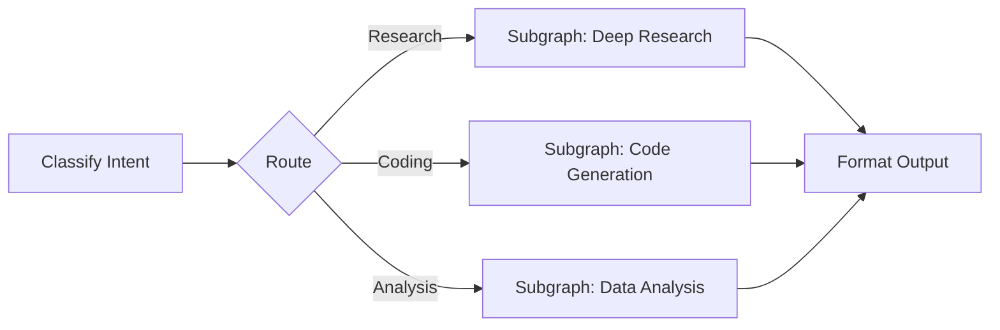

**Recursive composition:** A subgraph that invokes itself (with a different thread_id) — used for hierarchical task decomposition.

> [Inference] Recursive subgraph patterns where an agent spins up child agents on new threads are architecturally valid but add significant complexity around state aggregation and failure handling. Treat this as an advanced pattern, not a default approach.

---

## Chapter 9: Multi-Agent Architectures

### 9.1 When to Use Multiple Agents

The decision to use multiple agents should be driven by need, not enthusiasm. Multiple agents add complexity: inter-agent communication, partial failure handling, result aggregation, cost multiplication.

Use multiple agents when:

- **Specialization provides genuine improvement**: An LLM specialized on code review genuinely performs better on code review than a generalist
- **Parallelism is required**: Truly independent subtasks that must run concurrently
- **Context isolation is needed**: Different agents maintaining different conversation contexts without cross-contamination
- **Scale requires distribution**: The workload exceeds what a single agent loop can process

Do not use multiple agents to:
- Make architectures seem more impressive
- Compensate for poorly designed prompts
- Solve problems that a single well-designed graph would handle

### 9.2 Supervisor Architecture

The supervisor pattern is the most common multi-agent architecture. A supervisor agent (usually LLM-powered) receives a task, decomposes it, assigns subtasks to specialized worker agents, collects results, and determines when the task is complete.

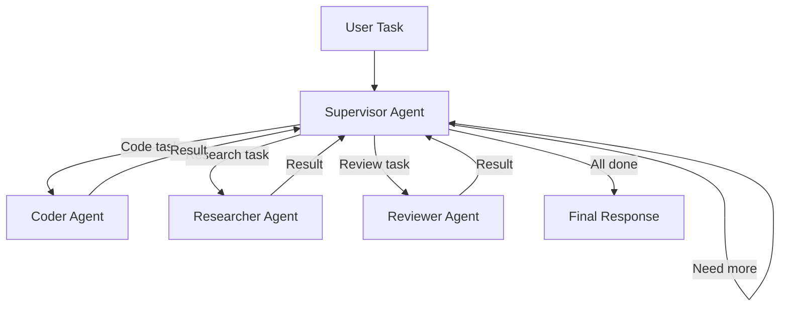

**Supervisor state design:**

```python
class SupervisorState(TypedDict):
    messages: Annotated[list[BaseMessage], operator.add]
    
    # The original task
    task: str
    
    # Worker assignment tracking
    worker_assignments: list[dict]  # [{worker, task, status, result}]
    
    # Active worker being managed
    current_worker: str | None
    
    # Completion tracking
    all_workers_complete: bool
    
    # Final synthesis
    final_response: str | None
    
    # Safety
    iteration_count: int
    max_iterations: int
```

**Supervisor node pattern:**

```python
from langchain_core.messages import SystemMessage

SUPERVISOR_SYSTEM_PROMPT = """You are a supervisor coordinating a team of specialized agents.
Available workers: {workers}

Given the conversation history and task results, decide:
1. Which worker to call next, OR
2. Whether the task is complete (respond with FINISH)

Respond with JSON: {{"next": "worker_name" | "FINISH", "reason": "..."}}
"""

def supervisor_node(state: SupervisorState) -> dict:
    workers = ["researcher", "coder", "reviewer"]
    
    response = llm.invoke([
        SystemMessage(content=SUPERVISOR_SYSTEM_PROMPT.format(
            workers=", ".join(workers)
        )),
        *state["messages"],
    ])
    
    decision = parse_json_response(response.content)
    
    return {
        "messages": [response],
        "next_worker": decision.get("next"),
        "supervisor_reasoning": decision.get("reason"),
        "iteration_count": state["iteration_count"] + 1,
    }

def route_supervisor_decision(state: SupervisorState) -> str:
    if state["iteration_count"] >= state["max_iterations"]:
        return "handle_max_iterations"
    
    next_worker = state.get("next_worker")
    if next_worker == "FINISH":
        return "synthesize_results"
    elif next_worker in ["researcher", "coder", "reviewer"]:
        return next_worker
    else:
        return "handle_unknown_worker"
```

### 9.3 Worker Agent Pattern

Workers are specialized subgraphs. Each worker has its own state, tools, and execution logic. They receive a task description from the supervisor and return a result.

```python
class WorkerState(TypedDict):
    messages: Annotated[list[BaseMessage], operator.add]
    task_description: str
    tools_available: list[str]
    task_result: str | None
    task_complete: bool
    error: str | None

# Worker graph for the researcher
researcher_graph = StateGraph(WorkerState)
researcher_graph.add_node("plan_research", plan_research_node)
researcher_graph.add_node("search", search_node)
researcher_graph.add_node("synthesize", synthesize_node)

researcher_graph.add_edge("plan_research", "search")
researcher_graph.add_conditional_edges(
    "search",
    route_after_search,
    {"need_more": "plan_research", "sufficient": "synthesize"},
)
researcher_graph.add_edge("synthesize", END)

researcher_app = researcher_graph.compile()
```

**Communication between supervisor and workers** happens through shared state fields. When the supervisor assigns a task to Worker A, it writes the task description to state. When Worker A completes, it writes its result to state. The supervisor reads the result on its next turn.

### 9.4 Planner-Worker-Verifier Architecture

This is a more sophisticated pattern that adds a verification layer. It is appropriate for tasks where correctness matters and a single pass is insufficient.

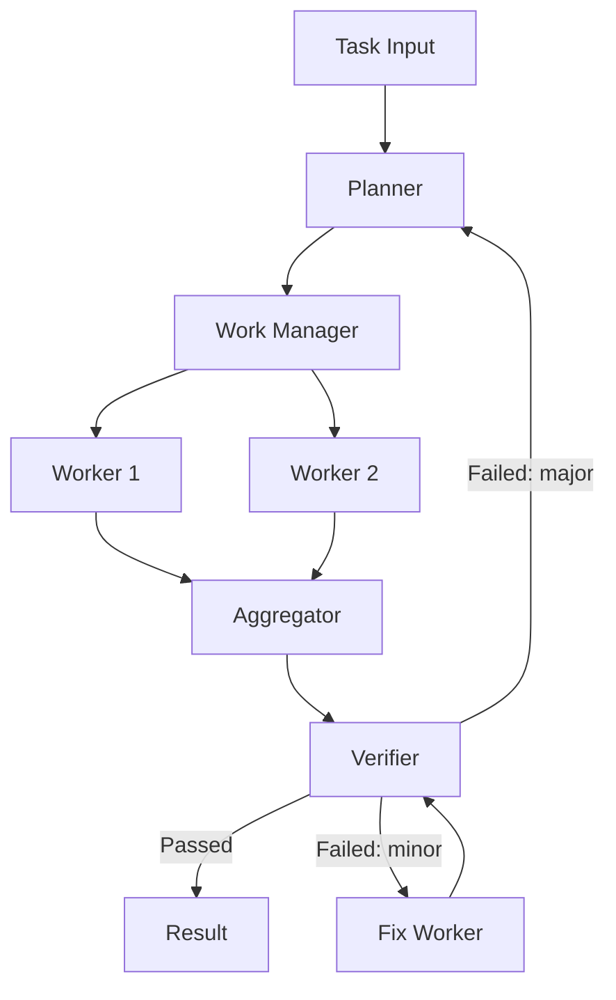

**Key design decisions for this architecture:**

1. **What does the verifier check?** Verifiers should check against explicit, objective criteria: schema compliance, factual consistency with provided sources, logical coherence. Verifiers that check "quality" with no criteria tend to loop indefinitely.

2. **When does a failure go back to the Planner vs. a Fix Worker?** Plan failures (wrong approach, missed requirements) should go back to the Planner. Execution failures (formatting errors, minor factual mistakes) go to the Fix Worker.

3. **How many verification attempts?** Track `verification_attempts` in state. After N failures, escalate to human review or return a partial result with caveats.

```python
class PlannerWorkerVerifierState(TypedDict):
    messages: Annotated[list, operator.add]
    task: str
    plan: list[dict] | None
    worker_results: Annotated[list[dict], operator.add]
    aggregated_result: str | None
    verification_result: dict | None
    verification_attempts: int
    max_verification_attempts: int
    final_result: str | None

def route_after_verification(state: PlannerWorkerVerifierState) -> str:
    result = state["verification_result"]
    
    if result["passed"]:
        return "finalize"
    
    if state["verification_attempts"] >= state["max_verification_attempts"]:
        return "escalate_to_human"
    
    failure_severity = result.get("severity", "minor")
    
    if failure_severity == "major":
        return "replan"  # Back to planner
    else:
        return "fix"     # Fix worker
```

### 9.5 Agent Handoffs and Message Passing

When one agent hands off to another, the handoff must carry enough context for the receiving agent to do its job without requiring access to the full parent state.

**The handoff message pattern:**

```python
def create_worker_task(
    task: str,
    relevant_context: dict,
    worker_name: str,
) -> HumanMessage:
    """
    Create a task message for a worker agent.
    Includes all context the worker needs — workers should not need
    to access parent state directly.
    """
    return HumanMessage(content=f"""
Task: {task}

Context:
{format_context(relevant_context)}

Instructions:
- Complete the task described above
- Return a structured result
- If you cannot complete the task, explain why clearly
""")
```

**What to include in handoff context:**
- The specific subtask (precise, not vague)
- Relevant results from prior workers
- Constraints and success criteria
- Any state that the worker needs but wouldn't have otherwise

**What NOT to include:**
- Full conversation history (select only what's relevant)
- Internal state fields that are execution bookkeeping
- Results from unrelated workers

### 9.6 Multi-Agent Failure Modes

> [Inference] Based on architectural properties, not measured production data. LLM behavior is not guaranteed.

**The echo chamber**: Agents that validate each other's work tend to agree, especially when using the same model. A "reviewer" agent built on the same LLM with similar prompts as the "generator" agent will not catch the generator's systematic biases. Use different models, different temperatures, or adversarial prompting for genuine independent review.

**Supervisor deadlock**: A supervisor that keeps assigning to workers without a termination condition loops forever. Always enforce `max_iterations` on supervisor loops.

**Worker context amnesia**: Workers that receive insufficient handoff context make different assumptions than the supervisor intended. Always include explicit success criteria in worker task descriptions.

**State pollution**: When multiple workers write to overlapping state fields without proper reducers, later workers overwrite earlier results. Design worker output fields to be worker-specific, then merge explicitly.

**Cost explosion**: A supervisor that spawns N workers, each of which makes M LLM calls, with a verification loop that runs K times, makes O(N × M × K) LLM calls. Model and measure the cost implications before deploying multi-agent architectures.

---

## Chapter 10: Memory Architectures

### 10.1 The Four Types of Memory

Memory in AI agent systems is not a single concept. There are four distinct types, each serving different purposes and requiring different implementation strategies.

```mermaid
graph TD
    M[Agent Memory] --> A[In-Context Memory]
    M --> B[External Long-Term Memory]
    M --> C[Episodic Memory]
    M --> D[Procedural Memory]
    
    A --> A1[Messages in current state]
    A --> A2[Retrieved context in current state]
    
    B --> B1[User facts and preferences]
    B --> B2[Domain knowledge base]
    
    C --> C1[Records of past interactions]
    C --> C2[Searchable by similarity]
    
    D --> D1[Skills and instructions]
    D --> D2[Few-shot examples]
```

**In-Context Memory** is everything currently in the LLM's context window. This is the most direct form — whatever is in `state["messages"]` and whatever fields are included in your system prompt. It disappears when the conversation ends unless explicitly persisted.

**External Long-Term Memory** is facts about users, domain knowledge, or learned preferences stored in a database outside the graph. The agent retrieves relevant memory at the start of each interaction.

**Episodic Memory** is a record of past interactions, stored with embeddings and searchable by semantic similarity. Enables "remember when we discussed X" capabilities.

**Procedural Memory** is the agent's instructions, tools, and few-shot examples — how to do things rather than facts about the world. Usually encoded in system prompts or the graph structure itself.

### 10.2 In-Context Memory Management

The message accumulator pattern (`Annotated[list, operator.add]`) is unlimited by default. For long-running workflows, this causes context window overflow and increased cost.

**Strategies for in-context memory management:**

**Sliding window**: Keep only the last N messages.

```python
def keep_last_n_messages(n: int):
    def reducer(existing: list, new: list) -> list:
        combined = existing + new
        return combined[-n:]
    return reducer

messages: Annotated[list[BaseMessage], keep_last_n_messages(20)]
```

**Summarization**: Periodically summarize old messages and replace them.

```python
def summarize_and_compress_messages_node(state: AgentState) -> dict:
    if len(state["messages"]) < COMPRESSION_THRESHOLD:
        return {}  # No compression needed
    
    old_messages = state["messages"][:-RECENT_MESSAGE_KEEP_COUNT]
    recent_messages = state["messages"][-RECENT_MESSAGE_KEEP_COUNT:]
    
    summary = llm.invoke([
        SystemMessage(content="Summarize the following conversation concisely, preserving key decisions, facts, and outcomes."),
        *old_messages,
    ])
    
    compressed_history = [
        SystemMessage(content=f"[Earlier conversation summary]: {summary.content}"),
        *recent_messages,
    ]
    
    # Replace the full message list with the compressed version
    # Note: This requires a special reducer or direct state update
    return {"messages": compressed_history}
```

> [Inference] Summarization-based compression loses information. The degree of information loss depends on summarization quality. [Unverified] — treat this as an engineering trade-off to measure empirically, not a guaranteed behavior.

**Token budgeting**: Include a token count alongside messages; trigger compression when the budget is exceeded.

```python
class BudgetedState(TypedDict):
    messages: Annotated[list[BaseMessage], operator.add]
    context_token_count: int  # Updated after each message addition
    context_token_budget: int  # Configured at invocation time
```

### 10.3 External Long-Term Memory

Long-term memory enables agents to remember facts across conversations. The implementation pattern:

```mermaid
sequenceDiagram
    participant Agent
    participant MemoryNode
    participant VectorStore
    participant RelationalDB

    Agent->>MemoryNode: Start of interaction
    MemoryNode->>RelationalDB: Load user profile
    MemoryNode->>VectorStore: Search for relevant past experiences
    MemoryNode-->>Agent: Populate state with retrieved memory
    
    Note over Agent: Interaction occurs...
    
    Agent->>MemoryNode: End of interaction
    MemoryNode->>RelationalDB: Update user profile with new facts
    MemoryNode->>VectorStore: Store interaction embedding
```

**Memory retrieval node:**

```python
async def load_user_memory_node(state: AgentState) -> dict:
    """
    Load relevant user memory at the start of each conversation.
    Runs as the first node.
    """
    user_id = state["user_id"]
    current_query = state["user_query"]
    
    # Structured facts about the user
    user_profile = await user_profile_store.get(user_id)
    
    # Semantically relevant past interactions
    relevant_episodes = await vector_store.similarity_search(
        query=current_query,
        filter={"user_id": user_id},
        k=5,
    )
    
    return {
        "user_profile": user_profile,
        "relevant_past_interactions": [e.page_content for e in relevant_episodes],
        "memory_loaded": True,
    }

async def save_user_memory_node(state: AgentState) -> dict:
    """
    Persist new learnings at the end of each conversation.
    Runs as the last node before END.
    """
    user_id = state["user_id"]
    
    # Extract new facts to remember [Inference: requires an LLM call to extract]
    new_facts = await extract_memorable_facts(state)
    
    if new_facts:
        await user_profile_store.update(user_id, new_facts)
    
    # Store the interaction for episodic retrieval
    await vector_store.add_texts(
        texts=[format_interaction_summary(state)],
        metadatas=[{"user_id": user_id, "timestamp": utcnow()}],
    )
    
    return {"memory_saved": True}
```

### 10.4 Context Engineering

Context engineering is the practice of deliberately constructing the context window that LLM nodes receive. It is one of the highest-leverage activities in LangGraph engineering.

The context window for any LLM call consists of:
- The system prompt (instructions, persona, constraints)
- Retrieved information (documents, memory, tool results)
- Conversation history
- The current task or question

Each of these is a design variable. The quality of the LLM's output is heavily dependent on the quality of context construction.

**Context engineering principles:**

**Relevant over comprehensive**: A shorter context with highly relevant information outperforms a longer context with tangentially related information. [Unverified — this is architecture guidance based on engineering judgment; measure in your specific context.]

**Structure aids parsing**: Use XML tags, headers, or clear delimiters to separate different types of context. `<retrieved_documents>`, `<user_history>`, `<current_task>` are clearer than dumping everything into a single string.

**Recency bias awareness**: [Inference] LLMs tend to weight information at the beginning and end of context more heavily than the middle. Important instructions belong at the start of the system prompt, not buried in the middle of retrieved documents.

**Context construction as a node:**

```python
def build_llm_context_node(state: AgentState) -> dict:
    """
    Dedicated node for context construction.
    Separates the 'what to include' decision from the 'call the LLM' action.
    """
    # Select the most relevant documents (not all of them)
    selected_docs = rank_and_select_documents(
        documents=state["retrieved_docs"],
        query=state["user_query"],
        max_tokens=2000,
    )
    
    # Select relevant conversation history
    relevant_history = filter_relevant_messages(
        messages=state["messages"],
        max_messages=10,
    )
    
    # Build structured context
    context = build_structured_context(
        user_profile=state.get("user_profile"),
        relevant_docs=selected_docs,
        history=relevant_history,
        task=state["current_task"],
    )
    
    return {
        "prepared_context": context,
        "selected_doc_ids": [d["id"] for d in selected_docs],
    }
```

Making context construction a dedicated node (rather than doing it inside the LLM call node) makes it independently testable, observable, and improvable.

---

## Chapter 11: Tool Integration and MCP

### 11.1 Tool Design for LangGraph

Tools in LangGraph are callable objects that nodes can invoke. They are the primary mechanism by which agents interact with the external world: databases, APIs, file systems, search engines, code interpreters.

Tool design is a significant engineering activity. Poorly designed tools are one of the most common sources of agent failures. [Inference — based on common architectural patterns and failure modes, not measured production data.]

**Tool design principles:**

**Narrow scope**: Each tool does one specific thing. Prefer `search_customer_by_email` over `query_customer_database(query)`. Narrow tools are easier for LLMs to use correctly.

**Explicit error handling**: Tools should never throw uncaught exceptions. They should return structured error information that the LLM can reason about.

**Idempotency for reads, explicit action for writes**: Read tools can be called multiple times safely. Write tools should be clearly labeled as having side effects, and your graph should manage their invocation carefully.

**Input validation**: Validate all tool inputs before execution. Return a clear error message rather than letting downstream systems fail with cryptic errors.

```python
from langchain_core.tools import tool
from pydantic import BaseModel, Field

class CustomerSearchInput(BaseModel):
    email: str = Field(description="Customer email address to search for")

@tool("search_customer_by_email", args_schema=CustomerSearchInput)
def search_customer(email: str) -> dict:
    """
    Search for a customer by email address.
    Returns customer profile if found, or an error dict if not found.
    """
    # Input validation
    if "@" not in email or "." not in email.split("@")[-1]:
        return {"error": f"Invalid email format: {email}", "found": False}
    
    try:
        customer = customer_db.find_by_email(email.lower().strip())
        if customer is None:
            return {"error": f"No customer found with email: {email}", "found": False}
        
        return {
            "found": True,
            "customer_id": customer.id,
            "name": customer.name,
            "account_status": customer.status,
            # Don't include sensitive fields unless explicitly required
        }
    except DatabaseException as e:
        return {"error": f"Database error: {str(e)}", "found": False}
```

### 11.2 Tool Invocation Patterns

There are two architectural patterns for tool invocation in LangGraph: **agent-driven** and **graph-driven**.

**Agent-driven tool calling**: The LLM decides which tools to call. The graph provides tool results back to the LLM and loops until the LLM indicates it's done.

```mermaid
graph LR
    A[LLM with Tools] -->|Calls tool| B[ToolNode]
    B -->|Returns results| A
    A -->|No more tools| C[END]
```

This is the ReAct (Reason + Act) pattern. It is flexible and general-purpose. Use it when:
- The set of tools to call is not known in advance
- The workflow is exploratory
- The LLM needs to chain tool results together

**Graph-driven tool calling**: The graph determines which tools to call based on state and routing logic. Tools are called in explicit nodes, not chosen by the LLM.

```mermaid
graph LR
    A[Classify Intent] --> B{Route}
    B -->|needs customer data| C[Call Customer DB]
    B -->|needs policy| D[Call Policy Search]
    B -->|needs calculation| E[Call Calculator]
    C --> F[Synthesize Results]
    D --> F
    E --> F
```

Use this when:
- The tool calling logic is deterministic based on input type
- You need precise control over which tools are called
- Cost control is critical (agent-driven can make many unnecessary tool calls)
- The workflow is well-understood enough to specify in code

**In production, prefer graph-driven tool calling for structured workflows and agent-driven tool calling for exploratory or open-ended tasks.**

### 11.3 The ToolNode

LangGraph's `ToolNode` is a pre-built node that executes tool calls from the last message in state. It handles the mechanics of tool invocation and result formatting.

```python
from langgraph.prebuilt import ToolNode

tools = [search_customer, update_account, send_email]
tool_node = ToolNode(tools)

graph = StateGraph(AgentState)
graph.add_node("agent", call_llm_with_tools)
graph.add_node("tools", tool_node)

graph.add_conditional_edges(
    "agent",
    route_tool_calls,  # Returns "tools" or END
)
graph.add_edge("tools", "agent")  # Always return to agent after tools
```

**Custom tool execution node**: For production systems, you often need more control than `ToolNode` provides — error handling strategies, timeout management, result validation.

```python
async def custom_tool_executor(state: AgentState) -> dict:
    last_message = state["messages"][-1]
    tool_results = []
    
    for tool_call in last_message.tool_calls:
        tool_name = tool_call["name"]
        tool_args = tool_call["args"]
        
        # Log tool call for observability
        log_tool_call(tool_name, tool_args, state["thread_id"])
        
        # Enforce tool allowlist
        if tool_name not in ALLOWED_TOOLS:
            tool_results.append(ToolMessage(
                content=f"Tool '{tool_name}' is not permitted in this context.",
                tool_call_id=tool_call["id"],
            ))
            continue
        
        # Execute with timeout
        try:
            result = await asyncio.wait_for(
                tool_registry[tool_name].ainvoke(tool_args),
                timeout=TOOL_TIMEOUT_SECONDS,
            )
            tool_results.append(ToolMessage(
                content=str(result),
                tool_call_id=tool_call["id"],
            ))
        except asyncio.TimeoutError:
            tool_results.append(ToolMessage(
                content=f"Tool '{tool_name}' timed out after {TOOL_TIMEOUT_SECONDS}s.",
                tool_call_id=tool_call["id"],
            ))
        except Exception as e:
            tool_results.append(ToolMessage(
                content=f"Tool '{tool_name}' error: {str(e)}",
                tool_call_id=tool_call["id"],
            ))
    
    return {"messages": tool_results}
```

### 11.4 Model Context Protocol (MCP) Integration

The Model Context Protocol (MCP) is an open standard for connecting AI models to external tools and data sources. It standardizes the interface between LLM-powered applications and tool providers, allowing a single MCP server to expose tools that any compatible client can use.

**MCP architecture:**

```mermaid
graph LR
    A[LangGraph Agent] --> B[MCP Client]
    B --> C[MCP Server: GitHub]
    B --> D[MCP Server: Slack]
    B --> E[MCP Server: Postgres]
    B --> F[MCP Server: Custom API]
```

**Integrating MCP with LangGraph:**

```python
from langchain_mcp_adapters.client import MultiServerMCPClient
from langgraph.prebuilt import create_react_agent

# Configure MCP servers
mcp_client = MultiServerMCPClient({
    "github": {
        "command": "uvx",
        "args": ["mcp-server-github"],
        "env": {"GITHUB_TOKEN": os.environ["GITHUB_TOKEN"]},
    },
    "slack": {
        "url": "http://localhost:8080/slack-mcp",
        "transport": "streamable_http",
    },
})

async def create_mcp_agent():
    # MCP tools are discovered dynamically from the server
    tools = await mcp_client.get_tools()
    
    # Create a ReAct agent with the discovered tools
    agent = create_react_agent(
        model=llm,
        tools=tools,
    )
    
    return agent
```

**MCP in custom graph architectures:**

```python
class MCPToolRegistry:
    def __init__(self, mcp_client: MultiServerMCPClient):
        self.client = mcp_client
        self._tools: dict[str, Any] = {}
    
    async def initialize(self):
        tools = await self.client.get_tools()
        self._tools = {tool.name: tool for tool in tools}
    
    async def execute(self, tool_name: str, args: dict) -> Any:
        if tool_name not in self._tools:
            raise ValueError(f"Unknown MCP tool: {tool_name}")
        return await self._tools[tool_name].ainvoke(args)
    
    def get_tool_schemas(self) -> list[dict]:
        """Return tool schemas for LLM function-calling."""
        return [tool.schema for tool in self._tools.values()]
```

**MCP production considerations:**

MCP servers are external processes. Design your tool nodes to handle MCP server unavailability gracefully. Add circuit breaker patterns for production MCP integrations.

```python
async def mcp_tool_node_with_circuit_breaker(state: AgentState) -> dict:
    circuit_breaker = get_circuit_breaker("mcp-github")
    
    if circuit_breaker.is_open:
        return {
            "messages": [ToolMessage(
                content="GitHub tools temporarily unavailable. Please try again later.",
                tool_call_id=state["messages"][-1].tool_calls[0]["id"],
            )],
            "tool_error": "circuit_open",
        }
    
    try:
        result = await execute_mcp_tool(state)
        circuit_breaker.record_success()
        return result
    except MCPServerError as e:
        circuit_breaker.record_failure()
        return {"messages": [...], "tool_error": str(e)}
```

---

---

# Part IV — Production Engineering

---

## Chapter 12: Prompt Engineering for Graph Nodes

### 12.1 Node Prompts Are Different From Chatbot Prompts

Prompt engineering for LangGraph nodes differs from prompt engineering for conversational AI in important ways. Node prompts have:

- **A specific, narrow purpose**: They don't need to handle arbitrary user intents
- **Structured inputs**: They receive well-defined state fields
- **Structured output requirements**: They must produce outputs the graph can route on
- **Failure mode accountability**: A bad node prompt fails in deterministic ways tied to graph execution

This narrowness is an advantage. You can write a highly focused prompt for a node that extracts intent, and you never need to worry about that prompt handling code generation — that's another node's job.

### 12.2 System Prompt Architecture for Nodes

Every LLM node needs a carefully designed system prompt. A good node system prompt has these sections:

```
1. Role definition — What is this node's job in the workflow?
2. Input specification — What it receives; what the fields mean
3. Task specification — Exactly what it must do
4. Output specification — Format, schema, and required fields
5. Constraints — What it must NOT do
6. Examples — One or two representative input/output pairs
```

**Example: Intent classification node prompt:**

```python
INTENT_CLASSIFIER_PROMPT = """You are an intent classification component in a customer service workflow.

## Your Role
Classify the user's request into exactly one of the defined intent categories. You do not respond to users — you classify their requests so the appropriate handler can respond.

## Input
You receive the user's message and their recent conversation history.

## Task
Analyze the user's request and determine their primary intent. Focus on what they want to accomplish, not how they phrase it.

## Intent Categories
- `billing_inquiry`: Questions about charges, invoices, payment methods, or account balance
- `technical_support`: Problems with the product, error messages, feature not working
- `account_management`: Password reset, account settings, profile changes, cancellation
- `product_question`: Questions about features, capabilities, pricing plans
- `escalation_request`: Explicit request to speak with a human or manager
- `out_of_scope`: Requests unrelated to our products or services

## Output Format
Respond with ONLY a JSON object. No preamble, no explanation.

{
  "intent": "<category from the list above>",
  "confidence": <float 0.0-1.0>,
  "reasoning": "<one sentence explaining the classification>",
  "key_signals": ["<phrase from user message>", ...]
}

## Constraints
- Always choose one category. Never output "unclear" or multiple categories.
- If the message is ambiguous, choose the most likely intent based on context.
- Never include customer PII in the "key_signals" field.

## Examples
User message: "My credit card was charged twice this month"
Output: {"intent": "billing_inquiry", "confidence": 0.97, "reasoning": "User is reporting a duplicate charge, which is a billing issue.", "key_signals": ["charged twice", "this month"]}

User message: "The app keeps crashing when I try to upload a photo"  
Output: {"intent": "technical_support", "confidence": 0.95, "reasoning": "User is experiencing a product malfunction (crashing).", "key_signals": ["keeps crashing", "upload a photo"]}
"""
```

### 12.3 Structured Output Engineering

Reliable structured output from LLM nodes is essential for routing and state management. Three techniques, in order of reliability:

**Technique 1: Schema-constrained generation (most reliable)**

Use the LLM's native tool-calling or JSON mode with schema enforcement. The model is constrained by the output format at the API level.

```python
from pydantic import BaseModel, Field
from langchain_openai import ChatOpenAI

class IntentClassification(BaseModel):
    intent: Literal[
        "billing_inquiry", "technical_support", "account_management",
        "product_question", "escalation_request", "out_of_scope"
    ] = Field(description="The classified intent category")
    confidence: float = Field(ge=0.0, le=1.0, description="Classification confidence")
    reasoning: str = Field(description="One-sentence explanation")
    key_signals: list[str] = Field(description="Key phrases from user message")

llm = ChatOpenAI(model="gpt-4o")
structured_llm = llm.with_structured_output(IntentClassification)

def intent_classifier_node(state: AgentState) -> dict:
    result: IntentClassification = structured_llm.invoke([
        SystemMessage(content=INTENT_CLASSIFIER_PROMPT),
        HumanMessage(content=state["user_query"]),
    ])
    
    return {
        "intent": result.intent,
        "intent_confidence": result.confidence,
        "intent_reasoning": result.reasoning,
    }
```

**Technique 2: JSON prompt + parsing with validation (second choice)**

Prompt the model to return JSON, then parse and validate. Add retry logic for parse failures.

```python
import json
from pydantic import ValidationError

def parse_with_retry(response_text: str, schema: type[BaseModel], max_retries: int = 2) -> BaseModel:
    for attempt in range(max_retries + 1):
        try:
            # Strip markdown fences if present
            cleaned = response_text.strip()
            if cleaned.startswith("```"):
                cleaned = cleaned.split("```")[1]
                if cleaned.startswith("json"):
                    cleaned = cleaned[4:]
            
            data = json.loads(cleaned)
            return schema.model_validate(data)
        except (json.JSONDecodeError, ValidationError) as e:
            if attempt == max_retries:
                raise
            # Could add a re-prompt here for the LLM to fix its output
```

**Technique 3: Free text with extraction (least reliable, avoid for routing-critical outputs)**

Parse structured information from free-text LLM output using regex or another LLM call. Fragile. Use only when structured output modes are unavailable.

### 12.4 Prompt Versioning and Management

Node prompts are code artifacts that must be versioned, tested, and deployed like code.

**Repository structure for prompts:**

```
prompts/
├── intent_classifier/
│   ├── v1.0.0.txt          # Versioned prompt
│   ├── v1.1.0.txt          # Revised version
│   ├── v2.0.0.txt          # Breaking change version
│   ├── evaluations/        # Test cases for this prompt
│   │   ├── test_cases.jsonl
│   │   └── eval_results.json
│   └── CHANGELOG.md        # What changed and why
├── response_generator/
│   └── ...
└── README.md               # Prompt engineering conventions
```

**Prompt loading pattern:**

```python
from functools import lru_cache
from pathlib import Path

@lru_cache(maxsize=None)
def load_prompt(name: str, version: str = "latest") -> str:
    prompt_dir = Path(__file__).parent / "prompts" / name
    
    if version == "latest":
        # Find the highest version
        versions = sorted(prompt_dir.glob("v*.txt"))
        if not versions:
            raise FileNotFoundError(f"No prompts found for {name}")
        prompt_file = versions[-1]
    else:
        prompt_file = prompt_dir / f"{version}.txt"
    
    return prompt_file.read_text()

# Usage
INTENT_CLASSIFIER_PROMPT = load_prompt("intent_classifier", version="v2.0.0")
```

**Prompt deployment**: Treat prompt changes as code changes. They require pull requests, review, and testing before production deployment.

---

## Chapter 13: Structured Outputs and Reliability

### 13.1 The Reliability Challenge

LLM outputs are probabilistic. Even with schema-constrained generation, models can produce outputs that are syntactically valid but semantically wrong. Building reliable LangGraph systems requires designing for LLM unreliability from the start.

The reliability stack:

```
Layer 1: Schema-constrained output (API-level enforcement)
Layer 2: Pydantic validation (schema + business logic)
Layer 3: Semantic validation (is this answer reasonable?)
Layer 4: Retry logic (handle failures gracefully)
Layer 5: Human escalation (handle persistent failures)
```

### 13.2 Validation Node Pattern

Separate LLM calls from validation of their outputs. The validation node is deterministic and can be tested exhaustively.

```python
def validate_generated_content_node(state: WorkflowState) -> dict:
    """
    Validates LLM output. Returns routing signals in state.
    Pure Python — no LLM calls.
    """
    content = state["generated_content"]
    issues = []
    
    # Structural validation
    if not content:
        issues.append("Empty content")
    
    # Length bounds
    if len(content) < state.get("min_length", 50):
        issues.append(f"Content too short: {len(content)} chars")
    
    if len(content) > state.get("max_length", 10000):
        issues.append(f"Content too long: {len(content)} chars")
    
    # Domain-specific business rules
    if state.get("require_citation") and "[source:" not in content:
        issues.append("Missing required citations")
    
    # Schema validation (if content should be JSON)
    if state.get("expect_json"):
        try:
            json.loads(content)
        except json.JSONDecodeError as e:
            issues.append(f"Invalid JSON: {e}")
    
    return {
        "validation_passed": len(issues) == 0,
        "validation_issues": issues,
        "retry_count": state.get("retry_count", 0),
    }

def route_after_validation(state: WorkflowState) -> str:
    if state["validation_passed"]:
        return "deliver_result"
    
    retry_count = state.get("retry_count", 0)
    max_retries = state.get("max_retries", 3)
    
    if retry_count < max_retries:
        return "retry_generation"
    else:
        return "escalate_failure"
```

### 13.3 Retry Patterns

**Simple retry**: Re-run the LLM node with the same prompt. Useful when the failure is likely due to stochastic model behavior.

```python
def retry_generation_node(state: WorkflowState) -> dict:
    return {
        "retry_count": state["retry_count"] + 1,
        "generated_content": None,  # Clear failed output
        "validation_passed": False,
    }
# Edge: retry_generation → call_llm (back to generation)
```

**Prompt-adjusted retry**: Re-run with a modified prompt that includes the validation failure as feedback.

```python
def build_retry_prompt(state: WorkflowState) -> dict:
    issues_str = "\n".join(f"- {issue}" for issue in state["validation_issues"])
    
    retry_instruction = f"""
Your previous response had the following issues:
{issues_str}

Please regenerate your response, correcting these issues.
"""
    
    return {
        "retry_count": state["retry_count"] + 1,
        "retry_context": retry_instruction,
        "generated_content": None,
    }
```

**Model-escalation retry**: On persistent failure with a fast/cheap model, retry with a more capable model.

```python
def get_model_for_retry(state: WorkflowState) -> ChatOpenAI:
    retry_count = state.get("retry_count", 0)
    
    if retry_count == 0:
        return ChatOpenAI(model="gpt-4o-mini")  # Fast, cheap
    elif retry_count <= 2:
        return ChatOpenAI(model="gpt-4o")       # More capable
    else:
        return ChatOpenAI(model="o1")           # Most capable
```

### 13.4 Guardrails Integration

Guardrails operate at the boundary between your graph and its outputs. They check content for safety, accuracy, policy compliance, and other constraints.

```mermaid
graph LR
    A[LLM Node] --> B[Output Guardrail]
    B -->|Safe| C[Deliver to User]
    B -->|Unsafe| D[Block + Log]
    D --> E[Fallback Response]
    
    F[User Input] --> G[Input Guardrail]
    G -->|Clean| H[Graph Entry]
    G -->|Unsafe| I[Reject]
```

**Implementation pattern:**

```python
class ContentGuardrail:
    def __init__(self, rules: list[GuardrailRule]):
        self.rules = rules
    
    def check(self, content: str, context: dict) -> GuardrailResult:
        violations = []
        for rule in self.rules:
            if rule.applies(context) and not rule.passes(content):
                violations.append(GuardrailViolation(
                    rule_id=rule.id,
                    severity=rule.severity,
                    description=rule.describe_violation(content),
                ))
        
        return GuardrailResult(
            passed=not any(v.severity == "block" for v in violations),
            violations=violations,
        )

def apply_output_guardrails_node(state: WorkflowState) -> dict:
    guardrail = get_output_guardrail(context=state)
    result = guardrail.check(
        content=state["generated_response"],
        context={"user_tier": state.get("user_tier"), "topic": state.get("topic")},
    )
    
    return {
        "guardrail_passed": result.passed,
        "guardrail_violations": [v.dict() for v in result.violations],
    }
```

---

## Chapter 14: Observability and Debugging

### 14.1 Observability Requirements for Agent Systems

Observability for LangGraph applications has requirements that differ from traditional services:

- **Non-deterministic execution paths**: The path through the graph changes with each run; you cannot pre-instrument every possible path
- **LLM call tracing**: Every LLM call's prompt, response, token count, latency, and model version must be recorded
- **State evolution tracking**: The complete state at every checkpoint must be inspectable
- **Tool call attribution**: Which node requested which tool call, and what was returned
- **Cost tracking**: Token usage and estimated cost aggregated per run, per node, per model

The three pillars — logs, metrics, and traces — apply, but traces are the most important for agent systems.

### 14.2 LangSmith Integration

LangSmith is Anthropic and Langchain's observability platform for LLM applications. It integrates with LangGraph to provide automatic tracing of every graph execution.

```python
import os
os.environ["LANGCHAIN_TRACING_V2"] = "true"
os.environ["LANGCHAIN_API_KEY"] = "your-api-key"
os.environ["LANGCHAIN_PROJECT"] = "production-agent"

# That's it. All graph executions are now traced automatically.
# No code changes required.
```

> [Unverified] LangSmith is a third-party service. Its availability, pricing, data retention policies, and feature set are subject to change. Evaluate its current capabilities and terms before committing to it as production infrastructure.

LangSmith traces capture:
- Each node execution with inputs and outputs
- LLM calls with full prompt and response
- Token usage per call
- Latency at each step
- Errors with full stack traces

**Custom metadata on traces:**

```python
from langchain_core.callbacks import LangChainTracer
from langsmith import Client

# Add custom metadata to traces
config = {
    "configurable": {"thread_id": thread_id},
    "tags": ["production", "customer-tier-pro"],
    "metadata": {
        "customer_id": customer_id,
        "workflow_version": "2.1.0",
        "deployment": "us-east-1",
    },
}

async for event in app.astream(input_data, config=config):
    process_event(event)
```

### 14.3 Custom Observability Without LangSmith

For organizations that cannot use LangSmith (data residency requirements, self-hosted requirements), build observability using callbacks.

```python
from langchain_core.callbacks import BaseCallbackHandler
from langchain_core.outputs import LLMResult
import time

class ProductionObservabilityCallback(BaseCallbackHandler):
    def __init__(self, metrics_client, log_client, trace_client):
        self.metrics = metrics_client
        self.logs = log_client
        self.traces = trace_client
        self._run_start_times = {}
    
    def on_chain_start(self, serialized, inputs, **kwargs):
        run_id = kwargs.get("run_id")
        self._run_start_times[str(run_id)] = time.time()
        
        self.logs.info("node_started", {
            "node": serialized.get("name"),
            "run_id": str(run_id),
        })
    
    def on_chain_end(self, outputs, **kwargs):
        run_id = kwargs.get("run_id")
        start = self._run_start_times.pop(str(run_id), time.time())
        duration_ms = (time.time() - start) * 1000
        
        self.metrics.histogram(
            "node_duration_ms",
            duration_ms,
            tags={"node": kwargs.get("name")},
        )
    
    def on_llm_start(self, serialized, prompts, **kwargs):
        self.logs.debug("llm_call_started", {
            "model": serialized.get("kwargs", {}).get("model_name"),
            "prompt_count": len(prompts),
        })
    
    def on_llm_end(self, response: LLMResult, **kwargs):
        usage = response.llm_output.get("token_usage", {})
        self.metrics.count(
            "llm_tokens_total",
            usage.get("total_tokens", 0),
            tags={"model": response.llm_output.get("model_name")},
        )
        self.metrics.count(
            "llm_cost_estimated_usd",
            estimate_cost(usage, response.llm_output.get("model_name")),
        )
    
    def on_tool_start(self, serialized, input_str, **kwargs):
        self.logs.info("tool_called", {
            "tool": serialized.get("name"),
            "input_preview": input_str[:100],
        })
    
    def on_tool_end(self, output, **kwargs):
        self.logs.info("tool_completed", {
            "output_preview": str(output)[:100],
        })
    
    def on_chain_error(self, error, **kwargs):
        self.metrics.count("node_errors_total", 1, tags={"error": type(error).__name__})
        self.logs.error("node_error", {
            "error_type": type(error).__name__,
            "error_message": str(error),
        })

# Attach to graph compilation
app = graph.compile(
    checkpointer=checkpointer,
    callbacks=[ProductionObservabilityCallback(metrics, logs, traces)],
)
```

### 14.4 Structured Logging for Graph Execution

Every significant graph event should produce a structured log entry. Structured logs (JSON) are queryable; free-text logs are not.

**Log schema for graph events:**

```python
@dataclass
class GraphEventLog:
    timestamp: str
    thread_id: str
    run_id: str
    event_type: str  # "node_start" | "node_end" | "node_error" | "graph_complete"
    node_name: str | None
    step_number: int | None
    duration_ms: float | None
    state_keys: list[str] | None  # Keys present in state (not values — avoid logging PII)
    error: str | None
    metadata: dict
```

**What NOT to log:**
- Full state values (may contain PII, sensitive data, or large content)
- Full LLM prompts in production (contain PII and are expensive to store)
- Tool inputs that may contain credentials or sensitive parameters

**What to log instead:**
- State key names (not values) — you know what shape the state is in
- Token counts and latencies — cost and performance monitoring
- Error types and codes — without full stack traces to log aggregators
- IDs and references — correlate with full data in secure storage

### 14.5 Debugging LangGraph Workflows

**The state inspection debugging loop:**

```python
async def debug_failed_thread(thread_id: str, app: CompiledGraph):
    """
    Debug workflow: retrieve full state history for a failed thread.
    """
    config = {"configurable": {"thread_id": thread_id}}
    
    print(f"=== Debugging thread: {thread_id} ===\n")
    
    async for snapshot in app.aget_state_history(config):
        print(f"Step {snapshot.metadata.get('step')}")
        print(f"  After node: {snapshot.metadata.get('source')}")
        print(f"  Next nodes: {snapshot.next}")
        print(f"  State keys: {list(snapshot.values.keys())}")
        
        # Print specific fields relevant to the failure
        if "error" in snapshot.values:
            print(f"  ERROR: {snapshot.values['error']}")
        if "validation_issues" in snapshot.values:
            print(f"  Validation: {snapshot.values['validation_issues']}")
        
        print()
```

**Replay with modified state** is the most powerful debugging technique:

```python
async def replay_from_checkpoint_with_fix(
    thread_id: str,
    checkpoint_id: str,  # The step to replay from
    state_override: dict,  # The fix to apply
    app: CompiledGraph,
):
    """
    Replay execution from a specific checkpoint with state modifications.
    Useful for testing whether a state fix would have resolved a failure.
    """
    # Use a new thread_id for the replay (don't overwrite the original)
    replay_thread_id = f"{thread_id}-replay-{uuid4()}"
    
    original_config = {"configurable": {"thread_id": thread_id, "checkpoint_id": checkpoint_id}}
    replay_config = {"configurable": {"thread_id": replay_thread_id}}
    
    # Get the checkpoint state
    checkpoint_state = await app.aget_state(original_config)
    
    # Apply the override
    modified_state = {**checkpoint_state.values, **state_override}
    
    # Start a new thread from the modified state
    async for event in app.astream(modified_state, config=replay_config):
        print(event)
```

**Common debugging patterns:**

| Symptom | Investigation Step |
|---|---|
| Graph loops indefinitely | Check iteration counter; inspect routing function logic; verify termination condition in state |
| Node always fails | Run node function in isolation with captured state snapshot as input |
| Wrong branch taken | Print the exact state value the routing function is reading at the decision point |
| State field not updating | Verify the node is returning the field in its return dict; check for reducer overriding |
| Checkpoint not loading | Verify thread_id matches exactly; check checkpointer backend connectivity |
| Expensive unexpected tool calls | Add tool call logging; trace which node triggered the calls |

---

## Chapter 15: Testing Agent Systems

### 15.1 The Testing Challenge

Testing LangGraph systems is harder than testing traditional software because:

- **Non-determinism**: LLM outputs vary between runs
- **Complex dependencies**: Nodes depend on external APIs, LLMs, databases
- **State evolution**: Bugs may only appear after specific state sequences
- **Emergent behavior**: Multi-agent interactions produce behaviors that don't appear in individual component tests

Despite this, you must test. The solution is layered testing that separates deterministic from non-deterministic concerns.

### 15.2 Testing Pyramid for LangGraph

```mermaid
graph TD
    A[Manual Evaluation<br/>Qualitative spot-checks<br/>Slow, expensive] --> B
    B[Evaluation Runs<br/>Automated LLM-as-judge<br/>On dataset of traces] --> C
    C[Integration Tests<br/>Full graph with real LLM<br/>Selected critical paths] --> D
    D[Unit Tests<br/>Nodes, routing, reducers<br/>No LLM, fully deterministic]
    
    style A fill:#f9e4b7
    style B fill:#f9d9a0
    style C fill:#f9c980
    style D fill:#90ee90
```

Invest most testing effort at the bottom of the pyramid. The unit test layer should cover the majority of your logic.

### 15.3 Unit Testing Nodes

Nodes are functions. Test them as functions.

```python
import pytest
from unittest.mock import patch, MagicMock

def test_intent_classifier_billing():
    """Test that billing-related queries are classified correctly."""
    state = {
        "user_query": "I was charged twice for my subscription",
        "messages": [],
        "conversation_history": [],
    }
    
    # Mock the LLM to return a deterministic response
    mock_response = MagicMock()
    mock_response.content = '{"intent": "billing_inquiry", "confidence": 0.95}'
    
    with patch("myapp.nodes.structured_llm") as mock_llm:
        mock_llm.invoke.return_value = IntentClassification(
            intent="billing_inquiry",
            confidence=0.95,
            reasoning="Duplicate charge question",
            key_signals=["charged twice"],
        )
        
        result = intent_classifier_node(state)
    
    assert result["intent"] == "billing_inquiry"
    assert result["intent_confidence"] >= 0.9

def test_validation_node_empty_content():
    """Test that validation catches empty content."""
    state = {
        "generated_content": "",
        "min_length": 50,
        "retry_count": 0,
    }
    
    result = validate_generated_content_node(state)
    
    assert result["validation_passed"] is False
    assert any("Empty" in issue for issue in result["validation_issues"])

def test_routing_function_retry_limit():
    """Test that routing goes to escalation after max retries."""
    state = {
        "validation_passed": False,
        "retry_count": 3,
        "max_retries": 3,
    }
    
    route = route_after_validation(state)
    assert route == "escalate_failure"
```

### 15.4 Unit Testing Reducers

```python
def test_message_accumulator_reducer():
    """Verify the message accumulator appends correctly."""
    existing = [HumanMessage(content="Hello")]
    new = [AIMessage(content="Hi there")]
    
    result = operator.add(existing, new)
    
    assert len(result) == 2
    assert result[0].content == "Hello"
    assert result[1].content == "Hi there"

def test_unique_results_reducer():
    """Verify deduplication reducer doesn't add duplicates."""
    existing = [{"id": "1", "content": "Result A"}]
    new = [
        {"id": "1", "content": "Result A"},  # Duplicate
        {"id": "2", "content": "Result B"},  # New
    ]
    
    result = add_unique_results(existing, new)
    
    assert len(result) == 2  # Only one "id: 1" entry
    assert any(r["id"] == "2" for r in result)
```

### 15.5 Integration Testing Graph Paths

Integration tests run the full graph with real (or real-like) LLM calls, but focus on specific critical paths.

```python
@pytest.mark.integration
async def test_billing_inquiry_end_to_end():
    """
    Integration test: verify a billing inquiry reaches the correct handler.
    Uses real LLM but asserts on graph path, not LLM output quality.
    """
    app = get_test_app()  # Compiled graph with test checkpointer
    config = {"configurable": {"thread_id": f"test-{uuid4()}"}}
    
    input_state = {
        "user_query": "I need to understand my invoice from last month",
        "user_id": "test-user-1",
    }
    
    events = []
    async for event in app.astream(input_state, config=config):
        events.append(event)
    
    # Verify the graph visited the expected nodes
    visited_nodes = [list(e.keys())[0] for e in events if e]
    assert "intent_classifier" in visited_nodes
    assert "billing_handler" in visited_nodes
    assert "escalation_handler" not in visited_nodes
    
    # Verify final state
    final_state = await app.aget_state(config)
    assert final_state.values.get("intent") == "billing_inquiry"
    assert final_state.values.get("response") is not None
```

### 15.6 Testing Human-in-the-Loop Workflows

```python
@pytest.mark.integration
async def test_hitl_approval_flow():
    """Test that HITL interrupt pauses and resumes correctly."""
    from langgraph.types import Command
    
    app = compile_approval_graph(checkpointer=MemorySaver())
    config = {"configurable": {"thread_id": "hitl-test-1"}}
    
    # Phase 1: Run until interrupt
    events = []
    async for event in app.astream(
        {"transaction": {"amount": 5000, "recipient": "vendor-123"}},
        config=config,
    ):
        events.append(event)
    
    # Verify graph is paused at the approval node
    state = await app.aget_state(config)
    assert "approve_transaction" in state.next
    assert state.values["transaction"]["amount"] == 5000
    
    # Phase 2: Simulate human approval
    async for event in app.astream(
        Command(resume={"approved": True, "approver": "john.doe"}),
        config=config,
    ):
        events.append(event)
    
    # Verify workflow completed successfully
    final_state = await app.aget_state(config)
    assert final_state.values.get("transaction_executed") is True
    assert final_state.values.get("approver") == "john.doe"
```

### 15.7 Automated Evaluation with LLM-as-Judge

For outputs that are qualitative (generated responses, summaries, analyses), use an LLM as an automated judge. This is not a unit test — it is an evaluation run.

```python
class LLMJudge:
    def __init__(self, judge_model: str = "gpt-4o"):
        self.llm = ChatOpenAI(model=judge_model)
    
    async def evaluate(
        self,
        output: str,
        criteria: list[str],
        reference: str | None = None,
    ) -> dict:
        criteria_text = "\n".join(f"{i+1}. {c}" for i, c in enumerate(criteria))
        
        prompt = f"""Evaluate the following output against the criteria.

Output:
{output}

{"Reference answer:\n" + reference if reference else ""}

Criteria:
{criteria_text}

For each criterion, respond with PASS or FAIL and a brief reason.
Then give an overall score 1-5.

Respond with JSON only:
{{"criteria_results": [{{"criterion": "...", "result": "PASS"|"FAIL", "reason": "..."}}], "overall_score": 1-5}}
"""
        
        response = await self.llm.ainvoke([HumanMessage(content=prompt)])
        return json.loads(response.content)

# Run evaluations against a dataset
async def run_evaluation_suite(
    app: CompiledGraph,
    eval_dataset: list[dict],
    judge: LLMJudge,
) -> EvaluationReport:
    results = []
    
    for case in eval_dataset:
        thread_id = f"eval-{uuid4()}"
        config = {"configurable": {"thread_id": thread_id}}
        
        # Run the workflow
        async for _ in app.astream(case["input"], config=config):
            pass
        
        final_state = await app.aget_state(config)
        output = final_state.values.get("response", "")
        
        # Evaluate
        eval_result = await judge.evaluate(
            output=output,
            criteria=case.get("criteria", DEFAULT_CRITERIA),
            reference=case.get("expected_output"),
        )
        
        results.append({
            "case_id": case["id"],
            "overall_score": eval_result["overall_score"],
            "criteria_results": eval_result["criteria_results"],
        })
    
    return EvaluationReport(results)
```

### 15.8 Testing Anti-Patterns

**Don't test LLM creativity**: Tests should not assert on the exact wording of LLM outputs. Assert on structure, routing, state fields, and objective properties.

**Don't skip unit tests because "it's AI"**: The routing functions, reducers, validation nodes, and state transformation logic are pure Python and fully testable. Don't let "AI unpredictability" excuse you from testing the deterministic parts.

**Don't use real LLMs in unit tests**: Unit tests must be fast and deterministic. Mock all LLM calls in unit tests.

**Don't conflate evaluation with testing**: Evaluation runs measure quality. Tests assert on correctness. They are different activities with different frequencies and infrastructure requirements.

---

---

# Part V — Scaling and Operations

---

## Chapter 16: Repository Organization and Modularity

### 16.1 Repository Architecture

How you organize a LangGraph codebase determines whether it stays maintainable as it grows. The wrong organization leads to circular imports, tangled state schemas, and nodes that do too much because there's no natural place to put focused components.

**Recommended repository layout for a production LangGraph application:**

```
my-agent-system/
├── src/
│   ├── graphs/                    # Graph definitions
│   │   ├── __init__.py
│   │   ├── main_workflow.py       # Top-level graph
│   │   ├── research_subgraph.py
│   │   ├── analysis_subgraph.py
│   │   └── review_subgraph.py
│   │
│   ├── nodes/                     # Node implementations
│   │   ├── __init__.py
│   │   ├── classifiers.py         # Intent and classification nodes
│   │   ├── retrievers.py          # RAG and retrieval nodes
│   │   ├── generators.py          # LLM generation nodes
│   │   ├── validators.py          # Validation and quality nodes
│   │   ├── tools_execution.py     # Tool call execution nodes
│   │   └── formatters.py          # Output formatting nodes
│   │
│   ├── state/                     # State definitions
│   │   ├── __init__.py
│   │   ├── schemas.py             # All TypedDict state classes
│   │   ├── reducers.py            # Custom reducer functions
│   │   └── migrations.py         # State schema migration logic
│   │
│   ├── routing/                   # Edge routing functions
│   │   ├── __init__.py
│   │   └── routes.py              # All conditional edge functions
│   │
│   ├── tools/                     # Tool definitions
│   │   ├── __init__.py
│   │   ├── database_tools.py
│   │   ├── api_tools.py
│   │   └── search_tools.py
│   │
│   ├── prompts/                   # Versioned prompts
│   │   ├── intent_classifier/
│   │   │   └── v1.0.0.txt
│   │   └── response_generator/
│   │       └── v2.1.0.txt
│   │
│   ├── memory/                    # Memory implementations
│   │   ├── __init__.py
│   │   ├── user_profile.py
│   │   └── episodic.py
│   │
│   └── config/                    # Configuration
│       ├── __init__.py
│       ├── settings.py
│       └── models.py              # LLM model initialization
│
├── tests/
│   ├── unit/
│   │   ├── test_nodes/
│   │   ├── test_routing/
│   │   └── test_reducers/
│   ├── integration/
│   │   ├── test_graphs/
│   │   └── test_hitl_flows/
│   └── evaluation/
│       ├── datasets/
│       └── eval_runners/
│
├── scripts/
│   ├── migrate_checkpoints.py
│   └── run_evaluation.py
│
├── deployments/
│   ├── docker/
│   │   └── Dockerfile
│   ├── k8s/
│   │   └── deployment.yaml
│   └── langgraph_platform/
│       └── langgraph.json
│
├── pyproject.toml
└── README.md
```

**Key organizational principles:**

1. **State schemas live in `state/`** — they are imported by nodes, graphs, and routing functions. They must never import from those modules to avoid circular imports.

2. **Nodes import from state and tools** — never from graphs. Nodes are reusable components.

3. **Graphs import from nodes, routing, and state** — they compose everything but define no logic themselves.

4. **Routing functions import only from state** — they read state and return strings. Pure logic.

### 16.2 Subgraph as Package Pattern

For large systems, each subgraph becomes a Python package with its own internal structure:

```
src/graphs/research/
├── __init__.py                # Exports compiled subgraph
├── graph.py                   # Graph definition
├── state.py                   # Research-specific state
├── nodes/
│   ├── query_planner.py
│   ├── web_searcher.py
│   └── synthesizer.py
└── tests/
    └── test_research_graph.py
```

```python
# src/graphs/research/__init__.py
from .graph import build_research_graph, ResearchConfig

def get_research_subgraph(config: ResearchConfig):
    """Public interface for the research subgraph."""
    graph = build_research_graph(config)
    return graph.compile()
```

This package boundary makes it straightforward to assign ownership to a team and to version the subgraph independently.

### 16.3 Configuration Management

LangGraph systems have many configuration dimensions: which models, which tools, which checkpointer, which memory backends, which feature flags. Centralize configuration.

```python
from pydantic_settings import BaseSettings
from pydantic import Field

class AgentSettings(BaseSettings):
    # LLM configuration
    primary_model: str = "gpt-4o"
    fallback_model: str = "gpt-4o-mini"
    judge_model: str = "gpt-4o"
    
    # Execution limits
    max_iterations: int = 20
    max_tool_calls_per_run: int = 50
    tool_timeout_seconds: int = 30
    
    # Checkpointing
    checkpointer_backend: str = "postgres"
    database_url: str = Field(..., env="DATABASE_URL")
    
    # Memory
    vector_store_url: str = Field(..., env="VECTOR_STORE_URL")
    user_profile_ttl_days: int = 90
    
    # Observability
    langsmith_api_key: str | None = Field(None, env="LANGCHAIN_API_KEY")
    metrics_endpoint: str | None = None
    
    # Feature flags
    enable_human_review: bool = True
    enable_memory: bool = True
    enable_guardrails: bool = True
    
    class Config:
        env_file = ".env"

settings = AgentSettings()
```

**Configuration injection into graphs:**

```python
def build_production_app(settings: AgentSettings) -> CompiledGraph:
    # Initialize models from config
    primary_llm = ChatOpenAI(model=settings.primary_model)
    
    # Initialize checkpointer
    checkpointer = get_checkpointer(settings)
    
    # Build graph with injected config
    graph = build_workflow_graph(
        llm=primary_llm,
        max_iterations=settings.max_iterations,
        enable_memory=settings.enable_memory,
    )
    
    interrupt_nodes = ["approve_action"] if settings.enable_human_review else []
    
    return graph.compile(
        checkpointer=checkpointer,
        interrupt_before=interrupt_nodes,
    )
```

---

## Chapter 17: Deployment Strategies

### 17.1 LangGraph Platform vs. Self-Hosted

LangGraph Platform (formerly LangGraph Cloud) is Anthropic/LangChain's managed service for deploying LangGraph applications. It handles infrastructure, checkpointing, and scaling.

| | LangGraph Platform | Self-Hosted |
|---|---|---|
| Setup time | Hours | Days to weeks |
| Checkpointer | Managed | You provision |
| Scaling | Automatic | You configure |
| Cost control | Less | More |
| Data residency | Limited control | Full control |
| Customization | Constrained by platform | Unlimited |
| Observability | Integrated | Build or buy |

**Choose LangGraph Platform when:** You want to move fast, don't have specialized infrastructure requirements, and are comfortable with managed services.

**Choose self-hosted when:** You have data residency requirements, need cost optimization at scale, require custom infrastructure integrations, or need full control over the deployment environment.

### 17.2 Self-Hosted Deployment Architecture

```mermaid
graph TB
    subgraph Client Layer
        W[Web/Mobile Client]
        A[API Consumer]
    end
    
    subgraph API Layer
        L[Load Balancer]
        API1[FastAPI Instance 1]
        API2[FastAPI Instance 2]
    end
    
    subgraph Worker Layer
        Q[Task Queue]
        WK1[Graph Worker 1]
        WK2[Graph Worker 2]
        WK3[Graph Worker 3]
    end
    
    subgraph Storage Layer
        PG[(PostgreSQL - Checkpoints)]
        RD[(Redis - Queue/Cache)]
        VS[(Vector Store - Memory)]
    end
    
    subgraph Observability
        LS[LangSmith / Custom Trace]
        MT[Metrics / Grafana]
        LG[Log Aggregator]
    end
    
    W --> L
    A --> L
    L --> API1
    L --> API2
    API1 --> Q
    API2 --> Q
    Q --> WK1
    Q --> WK2
    Q --> WK3
    WK1 --> PG
    WK2 --> PG
    WK3 --> PG
    WK1 --> VS
    WK2 --> VS
    WK3 --> VS
    API1 --> RD
    WK1 --> LS
    WK2 --> MT
    WK3 --> LG
```

**FastAPI server pattern:**

```python
from fastapi import FastAPI, BackgroundTasks
import asyncio

app = FastAPI()
graph_app = build_production_app(settings)

@app.post("/run")
async def start_workflow(
    request: WorkflowRequest,
    background_tasks: BackgroundTasks,
):
    thread_id = f"run-{uuid4()}"
    config = {"configurable": {"thread_id": thread_id}}
    
    # Start workflow in background
    background_tasks.add_task(execute_workflow, graph_app, request, config)
    
    return {"thread_id": thread_id, "status": "started"}

@app.get("/run/{thread_id}")
async def get_workflow_status(thread_id: str):
    config = {"configurable": {"thread_id": thread_id}}
    state = await graph_app.aget_state(config)
    
    return {
        "thread_id": thread_id,
        "status": "complete" if not state.next else "running",
        "pending_interrupt": bool(state.next),
        "result": state.values.get("final_result"),
    }
```

### 17.3 Containerization

```dockerfile
# Dockerfile
FROM python:3.12-slim

WORKDIR /app

# Install dependencies first (layer caching)
COPY pyproject.toml .
RUN pip install .

# Copy application code
COPY src/ ./src/
COPY prompts/ ./prompts/

# Non-root user for security
RUN useradd -m -u 1000 agent
USER agent

# Health check
HEALTHCHECK --interval=30s --timeout=10s --start-period=5s --retries=3 \
  CMD python -c "import sys; sys.exit(0)"

CMD ["uvicorn", "src.api.main:app", "--host", "0.0.0.0", "--port", "8000"]
```

### 17.4 CI/CD for LangGraph Applications

```yaml
# .github/workflows/deploy.yml
name: Deploy Agent System

on:
  push:
    branches: [main]

jobs:
  test:
    runs-on: ubuntu-latest
    steps:
      - uses: actions/checkout@v4
      
      - name: Unit tests
        run: pytest tests/unit/ -v --tb=short
      
      - name: Integration tests
        env:
          OPENAI_API_KEY: ${{ secrets.OPENAI_API_KEY_TEST }}
          DATABASE_URL: ${{ secrets.TEST_DATABASE_URL }}
        run: pytest tests/integration/ -v -m "not slow"
  
  evaluate:
    runs-on: ubuntu-latest
    needs: test
    if: github.ref == 'refs/heads/main'
    steps:
      - name: Run evaluation suite
        env:
          OPENAI_API_KEY: ${{ secrets.OPENAI_API_KEY }}
        run: python scripts/run_evaluation.py --dataset eval_datasets/regression.jsonl
      
      - name: Check evaluation thresholds
        run: python scripts/check_eval_thresholds.py --min-score 3.5
  
  deploy:
    runs-on: ubuntu-latest
    needs: [test, evaluate]
    steps:
      - name: Build and push Docker image
        run: |
          docker build -t my-agent:${{ github.sha }} .
          docker push my-registry/my-agent:${{ github.sha }}
      
      - name: Deploy to production
        run: kubectl set image deployment/agent-api agent=my-registry/my-agent:${{ github.sha }}
```

---

## Chapter 18: Performance and Cost Optimization

### 18.1 Cost Drivers in LangGraph Systems

The primary cost drivers in LangGraph systems are LLM token usage and tool call overhead. Understanding where tokens go is the first step to optimization.

**Token budget analysis:**

```python
class TokenBudgetAnalyzer:
    def analyze_state_for_llm_call(self, state: AgentState, node_name: str) -> dict:
        """Estimate token usage before making an LLM call."""
        system_prompt = load_prompt(node_name)
        messages = state["messages"]
        
        # Rough token estimates (not exact — use tiktoken for precision)
        system_tokens = len(system_prompt) // 4
        message_tokens = sum(len(m.content) // 4 for m in messages)
        context_tokens = len(str(state.get("context_docs", []))) // 4
        
        return {
            "system": system_tokens,
            "messages": message_tokens,
            "context": context_tokens,
            "total_input": system_tokens + message_tokens + context_tokens,
            "estimated_cost_usd": estimate_cost(
                input_tokens=system_tokens + message_tokens + context_tokens,
                model=state.get("current_model", "gpt-4o"),
            )
        }
```

**Common cost optimization strategies:**

1. **Model routing by task complexity**: Route simple tasks (classification, extraction) to cheap models; complex tasks (reasoning, generation) to expensive models.

```python
def select_model_for_task(task_type: str, complexity: str) -> str:
    model_matrix = {
        ("classification", "any"): "gpt-4o-mini",
        ("extraction", "any"): "gpt-4o-mini",
        ("generation", "low"): "gpt-4o-mini",
        ("generation", "high"): "gpt-4o",
        ("reasoning", "any"): "gpt-4o",
    }
    return model_matrix.get((task_type, complexity), "gpt-4o")
```

2. **Context window right-sizing**: Include only relevant context in each LLM call. Don't send the full message history to every node.

3. **Caching**: Cache LLM responses for deterministic inputs. Classification and extraction nodes with the same input should not re-invoke the LLM.

```python
from functools import lru_cache
import hashlib

@lru_cache(maxsize=1000)
def cached_classify(text_hash: str, prompt_version: str) -> str:
    # The actual LLM call — only happens on cache miss
    ...

def classify_node(state: AgentState) -> dict:
    text = state["user_query"]
    text_hash = hashlib.md5(text.encode()).hexdigest()
    
    result = cached_classify(text_hash, PROMPT_VERSION)
    return {"intent": result}
```

4. **Batch processing**: When processing multiple items, batch LLM calls rather than calling one at a time.

5. **Prompt compression**: Compress retrieved documents before including them in context. [Inference — compression techniques like query-focused summarization may reduce token count at the cost of some information loss.]

### 18.2 Parallelism for Throughput

For workflows with independent subtasks, parallel execution reduces wall-clock time.

```python
# Graph-level parallelism: multiple workers execute in parallel
graph = StateGraph(ParallelState)
graph.add_node("distribute", distribute_tasks_node)
graph.add_node("worker_a", worker_a_node)
graph.add_node("worker_b", worker_b_node)
graph.add_node("worker_c", worker_c_node)
graph.add_node("merge", merge_results_node)

# Fan-out: distribute to all workers
graph.add_edge("distribute", "worker_a")
graph.add_edge("distribute", "worker_b")
graph.add_edge("distribute", "worker_c")

# Fan-in: all workers feed into merge
graph.add_edge("worker_a", "merge")
graph.add_edge("worker_b", "merge")
graph.add_edge("worker_c", "merge")
```

LangGraph executes fan-out nodes in parallel automatically when they have no dependency on each other. The merge node waits for all incoming edges.

**Rate limiting in parallel execution:**

LLM APIs have rate limits. Parallel execution can trigger rate limiting, causing failures. Add rate limiting to your tool and LLM call nodes.

```python
import asyncio
from asyncio import Semaphore

LLM_RATE_LIMITER = Semaphore(10)  # Max 10 concurrent LLM calls

async def rate_limited_llm_call(prompt: str) -> str:
    async with LLM_RATE_LIMITER:
        return await llm.ainvoke(prompt)
```

---

## Chapter 19: Security and Reliability

### 19.1 Input Validation and Prompt Injection Defense

Every input to your LangGraph system is an attack surface. Prompt injection — where user input contains instructions that override your system prompt — is a real threat for any system that includes user-controlled text in LLM context.

**Defense strategies:**

1. **Separate user content from instructions**: Never concatenate user input directly into system prompts. Always use explicit delimiters or structured message formats.

```python
# Bad: user content can escape the prompt context
system_prompt = f"You are a support agent. The user said: {user_input}. Help them."

# Good: user content is clearly delimited
messages = [
    SystemMessage(content="You are a support agent. Help the user with their request."),
    HumanMessage(content=user_input),  # User content in its own message
]
```

2. **Input sanitization**: Strip or encode special tokens, XML-like tags, and instruction-pattern text before including user input in prompts.

3. **Output validation**: Validate that LLM outputs match expected schemas before using them to drive actions.

4. **Principle of least authority for tools**: Give agents access only to the tools they need for their specific task. A customer service agent should not have tools that can access another customer's data.

```python
def build_agent_with_restricted_tools(user_tier: str) -> CompiledGraph:
    base_tools = [search_knowledge_base, get_account_status]
    
    premium_tools = [
        request_refund,
        update_account_settings,
    ] if user_tier == "premium" else []
    
    return create_agent_graph(tools=base_tools + premium_tools)
```

### 19.2 Reliability Patterns

**Circuit breaker for external dependencies:**

```python
class CircuitBreaker:
    def __init__(self, failure_threshold: int = 5, reset_timeout: int = 60):
        self.failure_count = 0
        self.failure_threshold = failure_threshold
        self.reset_timeout = reset_timeout
        self.last_failure_time = None
        self.state = "closed"  # closed, open, half-open
    
    @property
    def is_open(self) -> bool:
        if self.state == "open":
            if time.time() - self.last_failure_time > self.reset_timeout:
                self.state = "half-open"
                return False
            return True
        return False
    
    def record_failure(self):
        self.failure_count += 1
        self.last_failure_time = time.time()
        if self.failure_count >= self.failure_threshold:
            self.state = "open"
    
    def record_success(self):
        self.failure_count = 0
        self.state = "closed"
```

**Graceful degradation**: When a component fails, degrade to a less capable but functional behavior rather than failing completely.

```python
async def retrieval_with_fallback_node(state: AgentState) -> dict:
    try:
        # Primary: semantic search
        docs = await vector_store.similarity_search(state["user_query"])
        return {"retrieved_docs": docs, "retrieval_method": "semantic"}
    except VectorStoreException:
        try:
            # Fallback: keyword search
            docs = await keyword_search(state["user_query"])
            return {"retrieved_docs": docs, "retrieval_method": "keyword"}
        except SearchException:
            # Last resort: empty context, LLM responds from training
            return {"retrieved_docs": [], "retrieval_method": "none"}
```

**Idempotency for critical operations**: Design nodes that perform side effects (sending emails, charging customers, writing to databases) to be safely retryable. Use idempotency keys.

```python
async def send_notification_node(state: AgentState) -> dict:
    """
    Send a notification. Uses idempotency key to prevent duplicate sends.
    Safe to call multiple times — will only send once.
    """
    idempotency_key = f"notification-{state['thread_id']}-{state['notification_type']}"
    
    success = await notification_service.send(
        to=state["user_email"],
        template=state["notification_template"],
        idempotency_key=idempotency_key,
    )
    
    return {"notification_sent": success, "notification_key": idempotency_key}
```

---

# Part VI — Advanced Architectures

---


---

## Chapter 20: Planner-Worker-Verifier Systems

### 20.1 When to Use This Architecture

The Planner-Worker-Verifier (PWV) architecture is appropriate for complex tasks that require structured decomposition, parallel execution, and quality assurance. It adds significant complexity and is not the right choice for simple workflows.

Use PWV when:
- Tasks are complex enough to require decomposition into subtasks
- Subtasks are independently executable
- Quality verification requires explicit checking against criteria
- The cost of wrong outputs justifies iterative correction loops
- Work products have objective correctness criteria (not purely subjective)

**Do not use PWV for:**
- Simple question-answering or single-step tasks
- Workflows where the "plan" is always the same sequence
- Systems where verification criteria are too subjective to implement
- Workflows where speed matters more than quality (PWV adds multiple LLM call rounds)

### 20.2 The Planner

The Planner receives the high-level task and produces an explicit, structured plan: a list of subtasks with descriptions, dependencies, required capabilities, and success criteria. The plan is written to state so it is inspectable, modifiable by humans (via interrupt), and usable by downstream components.

**Planner design principles:**

- **Concrete subtasks, not vague intentions**: "Search PubMed for studies on X from 2020–2025 using query Y" — not "do research"
- **Explicit success criteria per subtask**: Each subtask should have testable completion conditions
- **Dependency graph**: Some subtasks may require results from others; encode this in the plan
- **Worker type assignment**: Map each subtask to the appropriate worker type

```python
from pydantic import BaseModel, Field

class SubTask(BaseModel):
    id: str = Field(description="Unique identifier: 'task_1', 'task_2', etc.")
    description: str = Field(description="Precise description of what must be done")
    worker_type: str = Field(description="'researcher' | 'analyst' | 'writer' | 'coder'")
    depends_on: list[str] = Field(default=[], description="IDs of tasks that must complete first")
    success_criteria: list[str] = Field(description="Concrete conditions that define task completion")
    estimated_complexity: str = Field(description="'low' | 'medium' | 'high'")

class TaskPlan(BaseModel):
    objective: str = Field(description="Restatement of the overall task objective")
    subtasks: list[SubTask] = Field(description="Ordered list of subtasks")
    completion_criteria: list[str] = Field(description="Criteria for overall task completion")
    reasoning: str = Field(description="Why this decomposition was chosen")

PLANNER_PROMPT = """You are a task planning expert. Your job is to decompose complex tasks into concrete, executable subtasks.

## Guidelines
- Each subtask must be executable by a single specialized worker
- Subtasks should be as specific as possible — include search queries, document names, specific criteria
- Identify dependencies: if task_2 needs the output of task_1, encode that dependency
- Do not over-decompose: a task that takes 5 minutes should not be split into 10 subtasks

## Available Worker Types
- researcher: Web search, document retrieval, information gathering
- analyst: Data analysis, synthesis, evaluation, comparison
- writer: Drafting text, formatting, summarization
- coder: Writing, reviewing, or executing code

You must respond with a valid JSON object matching the TaskPlan schema.
"""

planner_llm = ChatOpenAI(model="gpt-4o").with_structured_output(TaskPlan)

def planner_node(state: PlannerWorkerVerifierState) -> dict:
    plan: TaskPlan = planner_llm.invoke([
        SystemMessage(content=PLANNER_PROMPT),
        HumanMessage(content=f"""
Task: {state['task']}

Constraints:
{chr(10).join(f'- {c}' for c in state.get('task_constraints', []))}

Success Criteria:
{chr(10).join(f'- {c}' for c in state.get('success_criteria', []))}
"""),
    ])
    
    return {
        "task_plan": [t.model_dump() for t in plan.subtasks],
        "plan_objective": plan.objective,
        "plan_completion_criteria": plan.completion_criteria,
        "plan_reasoning": plan.reasoning,
        "replanning_count": state.get("replanning_count", 0),
        "messages": [AIMessage(content=f"Plan created with {len(plan.subtasks)} subtasks.")],
    }
```

### 20.3 The Worker Dispatcher

The dispatcher reads the plan and determines which subtasks can be executed immediately (no unmet dependencies) versus which must wait. In a single-execution model, it fans out to all ready tasks. In an iterative model, it tracks completion status.

```python
def dispatcher_node(state: PlannerWorkerVerifierState) -> dict:
    """
    Identifies which subtasks are ready to execute based on dependency resolution.
    Updates worker_assignments in state.
    """
    plan = state["task_plan"]
    completed_ids = {
        r["task_id"] for r in state.get("worker_results", [])
        if r.get("status") == "complete"
    }
    
    ready_tasks = []
    for subtask in plan:
        task_id = subtask["id"]
        
        # Skip already completed tasks
        if task_id in completed_ids:
            continue
        
        # Skip tasks whose dependencies aren't met
        deps = subtask.get("depends_on", [])
        if all(dep in completed_ids for dep in deps):
            ready_tasks.append(subtask)
    
    if not ready_tasks:
        # All tasks are either complete or waiting on dependencies
        all_complete = len(completed_ids) == len(plan)
        return {
            "workers_complete": all_complete,
            "dispatch_cycle": state.get("dispatch_cycle", 0) + 1,
        }
    
    return {
        "worker_assignments": ready_tasks,
        "workers_complete": False,
        "dispatch_cycle": state.get("dispatch_cycle", 0) + 1,
    }
```

### 20.4 Worker Nodes

Each worker type is a specialized subgraph or node. Workers receive their specific assignment from `worker_assignments`, execute it, and append results to `worker_results`.

```python
RESEARCHER_PROMPT = """You are a specialized research worker. You receive a specific research task and must execute it precisely.

Complete your assigned task and return structured results. Be specific and cite sources. Do not expand scope beyond your assignment.

Respond with JSON only:
{"task_id": "...", "findings": [...], "sources": [...], "status": "complete" | "partial", "notes": "..."}
"""

async def researcher_worker_node(state: PlannerWorkerVerifierState) -> dict:
    """
    Processes research-type assignments from worker_assignments.
    """
    # Find the research assignments for this worker type
    my_assignments = [
        a for a in state.get("worker_assignments", [])
        if a["worker_type"] == "researcher"
    ]
    
    if not my_assignments:
        return {}
    
    results = []
    for assignment in my_assignments:
        # Execute the assignment using available tools
        result = await execute_research_assignment(
            assignment=assignment,
            tools=RESEARCHER_TOOLS,
            llm=research_llm,
        )
        results.append({
            "task_id": assignment["id"],
            "worker_type": "researcher",
            **result,
        })
    
    return {
        "worker_results": results,  # Accumulated by reducer
    }

async def execute_research_assignment(assignment: dict, tools: list, llm) -> dict:
    """Run a ReAct loop for a single research assignment."""
    research_graph = create_react_agent(model=llm, tools=tools)
    
    config = {"configurable": {"thread_id": f"research-{assignment['id']}-{uuid4()}"}}
    
    final_state = await research_graph.ainvoke({
        "messages": [HumanMessage(content=f"""
Research Assignment: {assignment['description']}

Success Criteria:
{chr(10).join(f'- {c}' for c in assignment['success_criteria'])}

Complete the research and return structured findings.
""")],
    }, config=config)
    
    # Extract result from the research agent's final message
    last_message = final_state["messages"][-1]
    return parse_worker_result(last_message.content)
```

### 20.5 The Aggregator and Verifier

The aggregator collects all worker results and produces a unified intermediate output. The verifier then checks this output against the task's success criteria.

```python
def aggregator_node(state: PlannerWorkerVerifierState) -> dict:
    """
    Merges all worker results into a coherent intermediate result.
    Does not call an LLM — pure structural aggregation.
    """
    results_by_task = {
        r["task_id"]: r
        for r in state.get("worker_results", [])
    }
    
    plan = state["task_plan"]
    
    # Build ordered aggregation following plan sequence
    ordered_results = []
    missing_tasks = []
    
    for subtask in plan:
        task_id = subtask["id"]
        if task_id in results_by_task:
            ordered_results.append({
                "task": subtask["description"],
                "result": results_by_task[task_id],
            })
        else:
            missing_tasks.append(task_id)
    
    return {
        "aggregated_results": ordered_results,
        "missing_task_ids": missing_tasks,
        "aggregation_complete": len(missing_tasks) == 0,
    }

VERIFIER_PROMPT = """You are a quality verification expert. You receive a task, its success criteria, and the work product produced by a team of workers.

Your job is to objectively assess whether the work product meets ALL success criteria.

Be strict. A partial pass is a fail. If a criterion is not met, explain exactly why.

Respond with JSON only:
{
  "overall_pass": true | false,
  "criteria_results": [
    {"criterion": "...", "met": true | false, "evidence": "...", "gap": "..."}
  ],
  "failure_severity": "none" | "minor" | "major",
  "failure_summary": "...",
  "fix_suggestions": ["..."]
}

failure_severity:
- "none": All criteria met
- "minor": Small gaps that a targeted fix can address (rewording, additional detail, format)
- "major": Fundamental gaps requiring replanning or additional research
"""

structured_verifier = ChatOpenAI(model="gpt-4o").with_structured_output(VerificationResult)

def verifier_node(state: PlannerWorkerVerifierState) -> dict:
    verification = structured_verifier.invoke([
        SystemMessage(content=VERIFIER_PROMPT),
        HumanMessage(content=f"""
Original Task: {state['task']}

Success Criteria:
{chr(10).join(f'- {c}' for c in state.get('success_criteria', []))}

Work Product:
{format_work_product(state['aggregated_results'])}
"""),
    ])
    
    return {
        "verification_result": verification.model_dump(),
        "verification_count": state.get("verification_count", 0) + 1,
        "messages": [AIMessage(content=f"Verification {'passed' if verification.overall_pass else 'failed'}: {verification.failure_summary or 'All criteria met.'}")]
    }
```

### 20.6 Complete PWV Graph Assembly

```python
class PlannerWorkerVerifierState(TypedDict):
    # Input
    task: str
    task_constraints: list[str]
    success_criteria: list[str]
    
    # Planning
    task_plan: list[dict] | None
    plan_objective: str | None
    plan_completion_criteria: list[str]
    plan_reasoning: str | None
    replanning_count: int
    max_replannings: int
    
    # Worker execution
    worker_assignments: Annotated[list[dict], operator.add]
    worker_results: Annotated[list[dict], operator.add]
    workers_complete: bool
    dispatch_cycle: int
    
    # Aggregation
    aggregated_results: list[dict] | None
    missing_task_ids: list[str]
    aggregation_complete: bool
    
    # Verification
    verification_result: dict | None
    verification_count: int
    max_verifications: int
    
    # Fix loop
    fix_instructions: str | None
    
    # Control
    messages: Annotated[list[BaseMessage], operator.add]
    final_result: str | None
    iteration_count: int
    max_iterations: int

def route_after_dispatch(state: PlannerWorkerVerifierState) -> list[str]:
    """Fan out to the appropriate worker nodes based on assignments."""
    worker_types = {
        a["worker_type"]
        for a in state.get("worker_assignments", [])
    }
    
    # Return list of nodes to run in parallel
    type_to_node = {
        "researcher": "researcher_worker",
        "analyst": "analyst_worker",
        "writer": "writer_worker",
        "coder": "coder_worker",
    }
    
    return [type_to_node[wt] for wt in worker_types if wt in type_to_node]

def route_after_verification(state: PlannerWorkerVerifierState) -> str:
    result = state.get("verification_result", {})
    
    if result.get("overall_pass"):
        return "finalize"
    
    v_count = state.get("verification_count", 0)
    max_v = state.get("max_verifications", 3)
    
    if v_count >= max_v:
        return "escalate"
    
    severity = result.get("failure_severity", "major")
    
    if severity == "minor":
        return "fix_worker"     # Minor fix loop
    else:
        return "replan"         # Major failure: back to planner

# Build the graph
pwv_graph = StateGraph(PlannerWorkerVerifierState)

pwv_graph.add_node("planner", planner_node)
pwv_graph.add_node("dispatcher", dispatcher_node)
pwv_graph.add_node("researcher_worker", researcher_worker_node)
pwv_graph.add_node("analyst_worker", analyst_worker_node)
pwv_graph.add_node("writer_worker", writer_worker_node)
pwv_graph.add_node("coder_worker", coder_worker_node)
pwv_graph.add_node("aggregator", aggregator_node)
pwv_graph.add_node("verifier", verifier_node)
pwv_graph.add_node("fix_worker", fix_worker_node)
pwv_graph.add_node("finalize", finalize_node)
pwv_graph.add_node("escalate", escalate_node)

pwv_graph.set_entry_point("planner")
pwv_graph.add_edge("planner", "dispatcher")

# Fan out to workers
pwv_graph.add_conditional_edges(
    "dispatcher",
    route_after_dispatch,
    {
        "researcher_worker": "researcher_worker",
        "analyst_worker": "analyst_worker",
        "writer_worker": "writer_worker",
        "coder_worker": "coder_worker",
    }
)

# Fan in: all workers converge on aggregator
for worker in ["researcher_worker", "analyst_worker", "writer_worker", "coder_worker"]:
    pwv_graph.add_edge(worker, "aggregator")

pwv_graph.add_edge("aggregator", "verifier")

pwv_graph.add_conditional_edges(
    "verifier",
    route_after_verification,
    {
        "finalize": "finalize",
        "fix_worker": "fix_worker",
        "replan": "planner",
        "escalate": "escalate",
    }
)

pwv_graph.add_edge("fix_worker", "verifier")    # Fix → re-verify
pwv_graph.add_edge("finalize", END)
pwv_graph.add_edge("escalate", END)

pwv_app = pwv_graph.compile(checkpointer=checkpointer)
```

### 20.7 PWV Anti-Patterns and Calibration

**The infinite verification loop**: A verifier that always finds something to improve (because it can), combined with no `max_verifications` limit, produces a system that never completes. Verifier prompts must have explicit pass/fail criteria. "Quality" is not a criterion. "Contains at least 3 peer-reviewed citations" is a criterion.

**The over-decomposed plan**: A planner that creates 15 subtasks for a task that should have 3, because decomposition feels thorough. Over-decomposition multiplies LLM calls, adds aggregation complexity, and usually produces worse output than well-focused subtasks. Constrain the planner with a `max_subtasks` parameter.

**Worker-verifier prompt coherence**: The verifier must evaluate against the same criteria the planner embedded in the plan and the workers tried to satisfy. Misaligned criteria produce verification failures that cannot be fixed. Write the success criteria once, in state, and reference them in all three component prompts.

**Fix worker scope creep**: A fix worker that tries to "improve" beyond the stated verification failures regenerates too much, potentially breaking what was correct. Fix worker instructions must be scoped precisely to the verification gaps identified.

---

## Chapter 21: Event-Driven and Long-Running Workflows

### 21.1 The Event-Driven Paradigm

Most LangGraph examples show synchronous, request-response workflows: user sends input, graph produces output, done. Production AI systems frequently need something different: reactions to external events, scheduled processing jobs, and workflows that span hours or days waiting for external conditions.

The good news: LangGraph's execution model handles these naturally. The framework does not care whether an invocation was triggered by an HTTP request, a Kafka message, a cron job, or a webhook. All of these translate to the same thing: "invoke this graph with this input and this thread_id."

What changes is the infrastructure around the graph invocation, and the design requirements placed on state and nodes.

### 21.2 Event Ingestion Patterns

**Webhook-triggered workflows:**

```python
# FastAPI webhook receiver
@app.post("/webhooks/{source}")
async def receive_webhook(
    source: str,
    payload: dict,
    background_tasks: BackgroundTasks,
):
    # Validate the webhook signature (critical for security)
    validate_webhook_signature(request, source)
    
    # Derive deterministic thread_id from the event
    # This provides idempotency — if the webhook fires twice, we don't double-process
    event_id = payload.get("id") or payload.get("event_id")
    thread_id = f"webhook:{source}:{event_id}"
    
    # Process asynchronously — webhooks must return 200 quickly
    background_tasks.add_task(
        process_event_in_graph,
        thread_id=thread_id,
        event_type=source,
        payload=payload,
    )
    
    return {"status": "accepted", "thread_id": thread_id}

async def process_event_in_graph(thread_id: str, event_type: str, payload: dict):
    config = {"configurable": {"thread_id": thread_id}}
    
    # Idempotency check: skip if already processed
    try:
        state = await app.aget_state(config)
        if state.values and not state.next:
            logger.info(f"Event {thread_id} already processed")
            return
    except Exception:
        pass  # Thread doesn't exist yet — proceed
    
    initial_state = {
        "event_type": event_type,
        "event_payload": payload,
        "started_at": datetime.utcnow().isoformat(),
    }
    
    async for event in app.astream(initial_state, config=config):
        await emit_progress_event(thread_id, event)
```

**Queue-driven workflows (Celery / RQ / ARQ):**

```python
# ARQ task for event processing
async def process_document_task(ctx, document_id: str, tenant_id: str):
    """
    Background task: process a newly uploaded document.
    Called by job queue; handles durability via LangGraph checkpointing.
    """
    thread_id = f"doc-processing:{tenant_id}:{document_id}"
    config = {"configurable": {"thread_id": thread_id}}
    
    # Load document metadata
    doc = await document_store.get(document_id)
    
    initial_state = {
        "document_id": document_id,
        "document_content": doc.content,
        "tenant_id": tenant_id,
        "processing_started_at": datetime.utcnow().isoformat(),
    }
    
    try:
        async for event in document_processing_app.astream(initial_state, config=config):
            # Log progress to job store for monitoring
            await update_job_progress(document_id, event)
    except Exception as e:
        # Graph failed — mark for retry
        # LangGraph's checkpoint means the next attempt can resume from failure point
        await mark_document_failed(document_id, str(e))
        raise  # Let the queue retry
```

**Scheduled / cron-triggered workflows:**

```python
# APScheduler cron job
from apscheduler.schedulers.asyncio import AsyncIOScheduler

scheduler = AsyncIOScheduler()

@scheduler.scheduled_job("cron", hour=2, minute=0)  # Runs at 2 AM daily
async def nightly_report_job():
    """Generate the nightly analytics report."""
    run_date = datetime.utcnow().strftime("%Y-%m-%d")
    thread_id = f"nightly-report:{run_date}"
    config = {"configurable": {"thread_id": thread_id}}
    
    # Idempotent: if the job already ran today, skip
    state = await report_app.aget_state(config)
    if state.values and not state.next:
        logger.info(f"Nightly report for {run_date} already complete")
        return
    
    async for event in report_app.astream(
        {"report_date": run_date, "report_type": "nightly_analytics"},
        config=config,
    ):
        await log_job_progress(event)
    
    final_state = await report_app.aget_state(config)
    await deliver_report(final_state.values.get("report_artifact"))
```

### 21.3 Designing Nodes for Long-Running Workflows

Long-running workflows impose specific requirements on node design that don't apply to sub-second workflows.

**Idempotency**: If a node re-executes after a restart (the process crashed after the node ran but before the checkpoint was written), it must produce the same result without double side-effects.

```python
async def send_report_email_node(state: ReportState) -> dict:
    """
    Idempotent email send using idempotency keys.
    If this node re-executes (process restart), the email is not sent twice.
    """
    idempotency_key = f"report-email:{state['report_date']}:{state['recipient_id']}"
    
    # Check if we already sent this email
    already_sent = await email_dedup_store.exists(idempotency_key)
    if already_sent:
        logger.info(f"Email {idempotency_key} already sent, skipping")
        return {"email_sent": True, "email_idempotency_key": idempotency_key}
    
    await email_service.send(
        to=state["recipient_email"],
        subject=f"Report for {state['report_date']}",
        body=state["report_content"],
    )
    
    # Record the send AFTER success
    await email_dedup_store.set(idempotency_key, ttl_days=7)
    
    return {"email_sent": True, "email_idempotency_key": idempotency_key}
```

**Progress checkpointing**: For nodes with multiple internal steps (e.g., processing 1000 records), checkpoint internal progress so that restart doesn't reprocess from the beginning.

```python
async def bulk_process_records_node(state: BulkProcessState) -> dict:
    """
    Process a large number of records with internal progress tracking.
    Stores last_processed_index in state so restart continues from where it left off.
    """
    records = state["records_to_process"]
    start_index = state.get("last_processed_index", 0)
    
    results = list(state.get("processed_results", []))
    
    for i, record in enumerate(records[start_index:], start=start_index):
        result = await process_single_record(record)
        results.append(result)
        
        # Checkpoint every 100 records by returning intermediate state
        # LangGraph will persist this on the next step boundary
        # Note: for true mid-node checkpointing, split into smaller nodes
        if (i + 1) % 100 == 0:
            logger.info(f"Processed {i+1}/{len(records)} records")
    
    return {
        "processed_results": results,
        "last_processed_index": len(records),
        "bulk_processing_complete": True,
    }
```

> [Inference] LangGraph checkpoints at node boundaries, not within nodes. For truly large batch operations, consider splitting into a loop of smaller nodes rather than one large node, so each batch of records becomes its own checkpoint boundary.

**Timeout handling**: Long-running nodes must have timeout logic. A node that waits indefinitely for an external API hangs the entire workflow.

```python
async def call_slow_external_api_node(state: WorkflowState) -> dict:
    TIMEOUT_SECONDS = 300  # 5 minutes
    
    try:
        result = await asyncio.wait_for(
            slow_external_api.process(state["payload"]),
            timeout=TIMEOUT_SECONDS,
        )
        return {
            "api_result": result,
            "api_status": "success",
        }
    except asyncio.TimeoutError:
        return {
            "api_result": None,
            "api_status": "timeout",
            "error": f"External API timed out after {TIMEOUT_SECONDS}s",
        }
    except ExternalAPIException as e:
        return {
            "api_result": None,
            "api_status": "error",
            "error": str(e),
        }
```

### 21.4 Waiting for External Signals

Some long-running workflows need to pause and wait for something external to happen: a document to be uploaded, a third-party API to complete an async job, a payment to be confirmed. The interrupt mechanism is the right primitive for this.

**The external signal wait pattern:**

```mermaid
sequenceDiagram
    participant Graph
    participant Checkpointer
    participant ExternalSystem
    participant SignalReceiver

    Graph->>Graph: Execute nodes 1-3
    Graph->>Checkpointer: Save state
    Graph->>Graph: interrupt("waiting_for_payment")
    Note over Graph,Checkpointer: Workflow paused indefinitely

    ExternalSystem->>SignalReceiver: Payment confirmed (webhook)
    SignalReceiver->>Graph: Resume with payment data
    Graph->>Checkpointer: Load state
    Graph->>Graph: Continue from node 4
```

```python
def wait_for_payment_confirmation_node(state: OrderState) -> dict:
    """
    Pauses execution until payment confirmation arrives.
    The interrupt value is sent to the caller to show status.
    """
    payment_status = state.get("payment_status")
    
    if payment_status == "confirmed":
        # Already confirmed (resume path)
        return {}
    
    # Pause and wait for payment signal
    payment_data = interrupt({
        "waiting_for": "payment_confirmation",
        "order_id": state["order_id"],
        "amount": state["order_total"],
        "created_at": datetime.utcnow().isoformat(),
    })
    
    # After resume, payment_data contains the confirmation
    return {
        "payment_status": "confirmed",
        "payment_reference": payment_data.get("reference"),
        "payment_confirmed_at": datetime.utcnow().isoformat(),
    }

# Payment webhook handler: resumes the waiting workflow
@app.post("/webhooks/payment")
async def payment_webhook(payload: PaymentPayload):
    order_id = payload.order_id
    thread_id = f"order:{order_id}"
    config = {"configurable": {"thread_id": thread_id}}
    
    # Verify the payment with the payment provider (don't trust webhooks blindly)
    verified = await payment_provider.verify(payload.payment_id)
    if not verified:
        return {"status": "rejected"}
    
    # Resume the waiting workflow with the payment data
    async for event in order_app.astream(
        Command(resume={"reference": payload.payment_id, "verified": True}),
        config=config,
    ):
        pass
    
    return {"status": "processed"}
```

### 21.5 SLA Monitoring for Long-Running Workflows

```python
class SLAMonitor:
    """Background service that monitors workflow SLAs."""
    
    def __init__(self, app: CompiledGraph, alert_client):
        self.app = app
        self.alert_client = alert_client
    
    async def check_all_active_threads(self):
        """Periodically check all active threads for SLA breaches."""
        active_threads = await self.get_active_threads()
        
        for thread in active_threads:
            await self.check_thread_sla(thread)
    
    async def check_thread_sla(self, thread: ThreadRecord):
        config = {"configurable": {"thread_id": thread.thread_id}}
        state = await self.app.aget_state(config)
        
        if not state.values:
            return
        
        sla_deadline = state.values.get("sla_deadline")
        if not sla_deadline:
            return
        
        deadline = datetime.fromisoformat(sla_deadline)
        
        if datetime.utcnow() > deadline and not state.values.get("sla_breached"):
            # SLA breached — update state and alert
            await self.app.aupdate_state(
                config,
                {"sla_breached": True, "sla_breach_time": datetime.utcnow().isoformat()},
            )
            
            await self.alert_client.send_alert(
                severity="warning",
                title=f"SLA Breach: {thread.thread_id}",
                details={
                    "thread_id": thread.thread_id,
                    "workflow_type": thread.workflow_type,
                    "deadline": sla_deadline,
                    "current_step": state.next,
                },
            )
```

### 21.6 State Archival and Cleanup

Long-running systems accumulate checkpoints. Without cleanup, storage grows unboundedly.

```python
async def archive_completed_threads(
    older_than_days: int = 30,
    app: CompiledGraph = None,
    archive_store = None,
):
    """
    Archive completed thread checkpoints to cold storage.
    Keeps the active checkpointer lean.
    """
    cutoff = datetime.utcnow() - timedelta(days=older_than_days)
    
    completed_threads = await get_completed_threads_before(cutoff)
    
    for thread_id in completed_threads:
        config = {"configurable": {"thread_id": thread_id}}
        
        # Get the final state for archival
        final_state = await app.aget_state(config)
        
        if final_state.values and not final_state.next:
            # Archive to cold storage
            await archive_store.store(
                thread_id=thread_id,
                final_state=final_state.values,
                archived_at=datetime.utcnow().isoformat(),
            )
            
            # Delete from active checkpointer
            await delete_thread_checkpoints(thread_id)
            
            logger.info(f"Archived thread: {thread_id}")
```

---

## Chapter 22: Enterprise Architecture Patterns

### 22.1 Multi-Tenant Architecture

Enterprise deployments serve multiple organizations (tenants) from shared infrastructure, with strict isolation guarantees. LangGraph's per-thread architecture maps naturally to multi-tenancy: each tenant's workflows are isolated by namespaced thread IDs and separate checkpointer namespaces.

**Tenant isolation layers:**

```mermaid
graph TD
    subgraph Request Layer
        A[API Gateway] --> B[Auth + Tenant Extraction]
        B --> C[Tenant Router]
    end
    
    subgraph Execution Layer
        C --> D[Tenant-scoped Graph Instance]
        D --> E[Tenant Tool Registry]
        D --> F[Tenant LLM Config]
    end
    
    subgraph Storage Layer
        G[(Shared Postgres)]
        H[(Tenant A schema)]
        I[(Tenant B schema)]
        G --> H
        G --> I
    end
    
    D --> G
```

**Tenant-scoped graph factory:**

```python
from functools import lru_cache
from dataclasses import dataclass

@dataclass
class TenantConfig:
    tenant_id: str
    allowed_tools: list[str]
    primary_model: str
    max_iterations: int
    data_region: str
    feature_flags: dict[str, bool]
    rate_limits: dict[str, int]

class TenantGraphFactory:
    def __init__(self, base_tools: dict, model_registry: dict, checkpointer_factory):
        self.base_tools = base_tools
        self.model_registry = model_registry
        self.checkpointer_factory = checkpointer_factory
        self._graph_cache: dict[str, CompiledGraph] = {}
    
    def get_graph(self, tenant: TenantConfig) -> CompiledGraph:
        """
        Returns a tenant-specific compiled graph.
        Graphs are cached by tenant_id since config rarely changes.
        """
        cache_key = f"{tenant.tenant_id}-{hash(str(tenant))}"
        
        if cache_key not in self._graph_cache:
            self._graph_cache[cache_key] = self._build_tenant_graph(tenant)
        
        return self._graph_cache[cache_key]
    
    def _build_tenant_graph(self, tenant: TenantConfig) -> CompiledGraph:
        # Scope tools to tenant's allowlist
        tools = [
            self.base_tools[name]
            for name in tenant.allowed_tools
            if name in self.base_tools
        ]
        
        # Use tenant's configured model
        llm = self.model_registry.get(tenant.primary_model)
        
        # Tenant-scoped checkpointer (schema-isolated)
        checkpointer = self.checkpointer_factory.for_tenant(tenant.tenant_id)
        
        graph = build_workflow_graph(
            llm=llm,
            tools=tools,
            max_iterations=tenant.max_iterations,
            feature_flags=tenant.feature_flags,
        )
        
        return graph.compile(checkpointer=checkpointer)

# Thread ID namespacing
def make_thread_id(tenant_id: str, user_id: str, session_id: str) -> str:
    """
    Produce a namespaced thread ID that encodes tenant context.
    Format: t:{tenant_id}:u:{user_id}:s:{session_id}
    """
    return f"t:{tenant_id}:u:{user_id}:s:{session_id}"

def parse_thread_id(thread_id: str) -> dict:
    parts = thread_id.split(":")
    return {
        "tenant_id": parts[1],
        "user_id": parts[3],
        "session_id": parts[5],
    }
```

### 22.2 Rate Limiting and Quota Management

Enterprise deployments need per-tenant rate limiting to prevent one tenant from consuming resources that affect others.

```python
class TenantRateLimiter:
    def __init__(self, redis_client):
        self.redis = redis_client
    
    async def check_and_consume(
        self,
        tenant_id: str,
        resource: str,  # "llm_calls", "tool_calls", "workflows"
        amount: int = 1,
    ) -> bool:
        """
        Returns True if quota available, False if rate limited.
        Uses a sliding window counter in Redis.
        """
        key = f"quota:{tenant_id}:{resource}:{get_current_window()}"
        
        pipeline = self.redis.pipeline()
        pipeline.incr(key, amount)
        pipeline.expire(key, WINDOW_SECONDS)
        current_count, _ = await pipeline.execute()
        
        limit = await self.get_tenant_limit(tenant_id, resource)
        return current_count <= limit
    
    async def get_tenant_limit(self, tenant_id: str, resource: str) -> int:
        # Load from tenant config store
        config = await tenant_config_store.get(tenant_id)
        return config.rate_limits.get(resource, DEFAULT_LIMITS[resource])

# Rate limiting in node execution
async def rate_limited_llm_node(state: AgentState, tenant_id: str) -> dict:
    rate_limiter = get_rate_limiter()
    
    allowed = await rate_limiter.check_and_consume(
        tenant_id=tenant_id,
        resource="llm_calls",
    )
    
    if not allowed:
        return {
            "error": "Rate limit exceeded. Please try again later.",
            "error_type": "rate_limit",
            "abort": True,
        }
    
    # Proceed with LLM call
    response = await llm.ainvoke(build_messages(state))
    return {"messages": [response]}
```

### 22.3 Governance, Compliance, and Audit Trails

Regulated industries (finance, healthcare, legal) require comprehensive, immutable audit trails for every AI-assisted decision.

**Audit event taxonomy:**

```python
from enum import Enum

class AuditEventType(Enum):
    WORKFLOW_STARTED = "workflow.started"
    WORKFLOW_COMPLETED = "workflow.completed"
    WORKFLOW_FAILED = "workflow.failed"
    LLM_CALLED = "llm.called"
    TOOL_CALLED = "tool.called"
    TOOL_RESULT_RECEIVED = "tool.result_received"
    HUMAN_INTERRUPT_TRIGGERED = "human.interrupt_triggered"
    HUMAN_DECISION_MADE = "human.decision_made"
    DATA_ACCESSED = "data.accessed"
    OUTPUT_DELIVERED = "output.delivered"
    GUARDRAIL_TRIGGERED = "guardrail.triggered"
    GUARDRAIL_BLOCKED = "guardrail.blocked"

@dataclass(frozen=True)  # Immutable audit record
class AuditRecord:
    event_id: str                  # UUID, unique per event
    event_type: AuditEventType
    timestamp: str                 # ISO 8601 UTC
    tenant_id: str
    user_id: str | None
    thread_id: str
    node_name: str | None
    
    # Data references (never PII content — only IDs)
    entity_type: str | None        # "customer", "document", "transaction"
    entity_id: str | None          # The ID, not the content
    
    # Decision context (for LLM calls)
    model_id: str | None           # Which model was used
    prompt_version: str | None     # Which prompt version
    input_token_count: int | None
    output_token_count: int | None
    
    # Human decisions
    decision_maker_id: str | None  # Who made the human decision
    decision_outcome: str | None   # What they decided
    
    # Outcome
    outcome: str | None            # "success", "failure", "blocked"
    error_type: str | None
    
    # Signature for tamper detection
    signature: str | None          # HMAC of record contents

class ImmutableAuditLogger:
    def __init__(self, audit_store, signing_key: bytes):
        self.store = audit_store
        self.signing_key = signing_key
    
    async def log(self, record: AuditRecord):
        # Sign the record before writing
        signed = self._sign(record)
        
        # Write to append-only store
        await self.store.append(signed)
    
    def _sign(self, record: AuditRecord) -> dict:
        import hmac
        import hashlib
        import json
        
        record_dict = {k: v for k, v in record.__dict__.items() if k != "signature"}
        content = json.dumps(record_dict, sort_keys=True, default=str)
        signature = hmac.new(
            self.signing_key,
            content.encode(),
            hashlib.sha256,
        ).hexdigest()
        
        return {**record_dict, "signature": signature}
```

**Audit callback integration with LangGraph:**

```python
class ComplianceAuditCallback(BaseCallbackHandler):
    def __init__(self, audit_logger: ImmutableAuditLogger, context: RequestContext):
        self.audit = audit_logger
        self.ctx = context
    
    async def on_chain_start(self, serialized, inputs, **kwargs):
        await self.audit.log(AuditRecord(
            event_id=str(uuid4()),
            event_type=AuditEventType.WORKFLOW_STARTED,
            timestamp=utcnow_iso(),
            tenant_id=self.ctx.tenant_id,
            user_id=self.ctx.user_id,
            thread_id=self.ctx.thread_id,
            node_name=serialized.get("name"),
            signature=None,  # Filled by logger
        ))
    
    async def on_llm_start(self, serialized, prompts, **kwargs):
        await self.audit.log(AuditRecord(
            event_id=str(uuid4()),
            event_type=AuditEventType.LLM_CALLED,
            timestamp=utcnow_iso(),
            tenant_id=self.ctx.tenant_id,
            user_id=self.ctx.user_id,
            thread_id=self.ctx.thread_id,
            model_id=serialized.get("kwargs", {}).get("model_name"),
            prompt_version=self.ctx.current_prompt_version,
            signature=None,
        ))
```

### 22.4 Multi-Region and Data Residency

Global enterprises have data residency requirements: EU customer data must stay in EU, US data in the US, etc.

**Region-aware architecture:**

```mermaid
graph TD
    subgraph EU Region
        EU_GW[EU API Gateway]
        EU_APP[EU Graph Workers]
        EU_DB[(EU Checkpointer DB)]
        EU_VS[(EU Vector Store)]
        EU_LLM[EU LLM Endpoint]
    end
    
    subgraph US Region
        US_GW[US API Gateway]
        US_APP[US Graph Workers]
        US_DB[(US Checkpointer DB)]
        US_VS[(US Vector Store)]
        US_LLM[US LLM Endpoint]
    end
    
    CLIENT_EU[EU Client] --> EU_GW
    CLIENT_US[US Client] --> US_GW
```

**Region-aware graph builder:**

```python
REGION_CONFIG = {
    "eu": {
        "checkpointer_url": os.environ["EU_DATABASE_URL"],
        "vector_store_url": os.environ["EU_VECTOR_STORE_URL"],
        "llm_endpoint": os.environ["EU_LLM_ENDPOINT"],
    },
    "us": {
        "checkpointer_url": os.environ["US_DATABASE_URL"],
        "vector_store_url": os.environ["US_VECTOR_STORE_URL"],
        "llm_endpoint": os.environ["US_LLM_ENDPOINT"],
    },
}

def build_regional_app(region: str, tenant: TenantConfig) -> CompiledGraph:
    config = REGION_CONFIG[region]
    
    llm = ChatOpenAI(
        model=tenant.primary_model,
        base_url=config["llm_endpoint"],
    )
    
    checkpointer = PostgresSaver.from_conn_string(config["checkpointer_url"])
    
    graph = build_workflow_graph(llm=llm, tools=get_regional_tools(region))
    
    return graph.compile(checkpointer=checkpointer)

# Request routing: derive region from tenant or request headers
def get_region_for_tenant(tenant_id: str) -> str:
    tenant = tenant_config_store.get_sync(tenant_id)
    return tenant.data_region  # "eu" | "us" | "apac"
```

### 22.5 Blue-Green and Canary Deployments for Graphs

Deploying changes to a production LangGraph system requires careful rollout strategies because:
- In-flight workflows may be using the old graph
- Checkpoints from the old graph may not be compatible with new state schemas
- Node behavior changes affect all threads, including long-running ones

**Blue-green deployment:**

```
Blue (current): graph_version=v2.1.0
Green (new):    graph_version=v2.2.0

Phase 1: Deploy green. Route 0% of new threads to green.
Phase 2: Validate green with canary traffic (1% new threads).
Phase 3: Gradually shift new threads to green (10% → 50% → 100%).
Phase 4: Allow blue to complete all in-flight threads (drain).
Phase 5: Decommission blue.
```

```python
class VersionedGraphRouter:
    def __init__(self, versions: dict[str, CompiledGraph], rollout_config: dict):
        self.versions = versions
        self.rollout = rollout_config
    
    def get_graph_for_thread(self, thread_id: str, tenant_id: str) -> CompiledGraph:
        # In-flight threads always use the version they started on
        existing_version = self.get_thread_version(thread_id)
        if existing_version and existing_version in self.versions:
            return self.versions[existing_version]
        
        # New threads: route based on rollout config
        target_version = self.select_version_for_new_thread(tenant_id)
        self.record_thread_version(thread_id, target_version)
        return self.versions[target_version]
    
    def select_version_for_new_thread(self, tenant_id: str) -> str:
        # Stable tenants always get stable version
        if self.is_stable_tenant(tenant_id):
            return self.rollout["stable_version"]
        
        # Canary tenants (opted in to early access)
        if self.is_canary_tenant(tenant_id):
            return self.rollout["canary_version"]
        
        # General rollout: percentage-based routing
        pct = self.rollout.get("canary_percentage", 0)
        if random.random() < pct / 100:
            return self.rollout["canary_version"]
        
        return self.rollout["stable_version"]
```

### 22.6 Cost Governance at Scale

Enterprise deployments need budget controls, per-tenant cost attribution, and anomaly detection.

```python
class CostGovernanceLayer:
    def __init__(self, budget_store, alert_client, pricing_config: dict):
        self.budgets = budget_store
        self.alerts = alert_client
        self.pricing = pricing_config
    
    async def check_budget_before_llm_call(
        self,
        tenant_id: str,
        estimated_tokens: int,
        model: str,
    ) -> bool:
        """Returns False if the call would exceed the tenant's budget."""
        estimated_cost = self._estimate_cost(estimated_tokens, model)
        
        remaining_budget = await self.budgets.get_remaining(tenant_id, period="monthly")
        
        if estimated_cost > remaining_budget:
            await self.alerts.send(
                tenant_id=tenant_id,
                event="budget_exceeded",
                details={"estimated_cost": estimated_cost, "remaining": remaining_budget},
            )
            return False
        
        return True
    
    async def record_actual_cost(
        self,
        tenant_id: str,
        thread_id: str,
        model: str,
        input_tokens: int,
        output_tokens: int,
    ):
        actual_cost = self._calculate_cost(model, input_tokens, output_tokens)
        
        await self.budgets.deduct(tenant_id, actual_cost, period="monthly")
        
        await self.cost_log.append({
            "tenant_id": tenant_id,
            "thread_id": thread_id,
            "model": model,
            "input_tokens": input_tokens,
            "output_tokens": output_tokens,
            "cost_usd": actual_cost,
            "timestamp": utcnow_iso(),
        })
        
        # Anomaly detection: alert if single run costs more than threshold
        if actual_cost > SINGLE_RUN_ALERT_THRESHOLD_USD:
            await self.alerts.send(
                tenant_id=tenant_id,
                event="high_cost_run",
                details={"cost": actual_cost, "thread_id": thread_id},
            )
    
    def _calculate_cost(self, model: str, input_tokens: int, output_tokens: int) -> float:
        pricing = self.pricing.get(model, self.pricing["default"])
        return (
            input_tokens / 1_000_000 * pricing["input_per_million"]
            + output_tokens / 1_000_000 * pricing["output_per_million"]
        )
```

### 22.7 Enterprise Workflow Governance

Large organizations need approval workflows for deploying new AI capabilities, changing prompts, or expanding agent permissions. Meta-workflows: LangGraph graphs governing the lifecycle of other LangGraph deployments.

**Prompt change governance workflow:**

```mermaid
graph TD
    PR[Prompt Change PR] --> REV[Automated Evaluation]
    REV --> SCORE{Score vs Baseline}
    SCORE -->|Regression| BLOCK[Block Merge]
    SCORE -->|Pass| HUMAN[Human Review Gate]
    HUMAN -->|Approved| STAGING[Deploy to Staging]
    STAGING --> CANARY[Canary Rollout 1%]
    CANARY --> MONITOR[Monitor 24h]
    MONITOR -->|Issues| ROLLBACK[Auto Rollback]
    MONITOR -->|Clean| PROD[Full Production Rollout]
```

This is itself a LangGraph workflow where:
- Automated evaluation is a node
- Human review is an interrupt
- Canary deployment and monitoring are nodes with sleep/wait logic
- Rollback is a conditional branch based on monitoring metrics

---

# Part VII — Synthesis

---

## Chapter 23: Anti-Patterns and Failure Modes

### 23.1 Architectural Anti-Patterns

**The Monolith Graph**: A single graph with 50+ nodes, no subgraphs, and a state schema with 40+ fields. Symptoms: nobody understands the full graph, tests take forever, any change requires understanding the whole system.

*Fix*: Identify natural boundaries; extract subgraphs; assign ownership.

**The God Node**: A single node that classifies intent, retrieves context, calls the LLM, validates output, formats the response, and writes to the database. Symptoms: can't retry individual steps, can't test pieces in isolation, every failure requires rerunning everything.

*Fix*: Single-responsibility decomposition.

**State as Message Bus**: Using state fields as generic message passing rather than typed domain concepts. Symptoms: `data: dict`, `payload: Any`, fields with names like `temp_result`, `intermediate_value`.

*Fix*: Name fields for what they represent in the domain, not how they're used in execution.

**The Infinite Optimizer**: A verification loop with no explicit termination condition. The verifier always finds "improvements" to make; the workflow never completes.

*Fix*: Explicit `max_verification_attempts` in state; verifier must have objective pass/fail criteria; treat marginal improvements as "pass."

**Tool Sprawl**: Giving agents access to dozens of tools "just in case." Symptoms: agents choose wrong tools, make unnecessary tool calls, incur unexpected costs.

*Fix*: Give each agent exactly the tools it needs for its specific task. Trust the routing layer to route to the right agent with the right tools.

### 23.2 State Management Anti-Patterns

**The Mutable Default**: Using mutable default values in state initialization.

```python
# Bad: All state instances share the same list object
class BadState(TypedDict):
    results: list = []  # Shared mutable default

# Good: Always use None as default; initialize explicitly
class GoodState(TypedDict):
    results: list | None = None

# In your initial state:
initial_state = {"results": [], "other": "value"}
```

**The State Leak**: Carrying intermediate computational data in state across the full workflow lifetime. State fields added for a single step's use accumulate indefinitely.

*Fix*: Clear temporary state fields when they're no longer needed; use subgraph-local state for step-level temporaries.

**The Reducer Mismatch**: Using last-write-wins semantics for fields that should accumulate, or using accumulation for fields that should be replaced. Causes data loss in parallel execution and unexpected accumulation in sequential execution.

*Fix*: Explicitly annotate every state field with its intended semantics; review reducer choices whenever adding nodes that write to existing fields.

### 23.3 LLM Reliability Anti-Patterns

**Routing on Unstructured LLM Output**:

```python
# Bad: Parses free text for routing signal
def bad_router(state):
    response = state["messages"][-1].content
    if "I'll search the database" in response:  # Fragile string matching
        return "search"
    return "respond"
```

*Fix*: Use structured output for any LLM call whose output drives routing.

**The Hallucination Cascade**: Later nodes in the graph treat earlier LLM outputs as facts without verification. A hallucinated customer ID, a made-up policy number, or a fabricated product feature propagates through the system.

*Fix*: Validate LLM-generated entities against authoritative sources before using them as inputs to consequential operations.

**Prompt Drift**: System prompts evolve informally over time — fixes are added, constraints accumulate, examples become outdated. The prompt becomes internally inconsistent.

*Fix*: Version prompts; review prompts quarterly; test prompt changes before deployment.

---

## Chapter 24: Engineering Checklists and Decision Frameworks

### 24.1 State Schema Design Checklist

Before writing a single node, complete this checklist:

- [ ] Every required business concept has a named, typed field
- [ ] Accumulator fields are annotated with reducers
- [ ] Input fields are clearly distinguished from derived and output fields
- [ ] Control flow signals have explicit boolean or enum fields
- [ ] No binary data, large content, or embeddings stored inline
- [ ] Optional fields have `None` defaults for forward compatibility
- [ ] State can be serialized to JSON without loss
- [ ] Every field name communicates its meaning to a future reader
- [ ] Execution state (retry counts, iteration counts) is separated from business state
- [ ] Large external data is referenced by ID, not embedded

### 24.2 Node Implementation Checklist

For each node:

- [ ] Single responsibility: does exactly one thing
- [ ] Does not mutate state in place — returns an update dict
- [ ] Returns only the fields it actually modifies
- [ ] Has deterministic behavior for given inputs (no random decisions without seeding)
- [ ] Has explicit error handling — never lets exceptions propagate unhandled
- [ ] Logs enough for debugging without logging sensitive data
- [ ] Is unit testable with mocked dependencies
- [ ] Has a meaningful name that describes what it does
- [ ] Tracks iteration/retry count if it can re-execute in a cycle

### 24.3 Architecture Decision Framework

When designing a new LangGraph system, work through these decisions in order:

```mermaid
graph TD
    A[What is the task?] --> B{Is it stateful across turns?}
    B -->|No| C[Consider simpler pipeline or single LLM call]
    B -->|Yes| D{Does it need human checkpoints?}
    D -->|Yes| E[Plan interrupt/resume architecture]
    D -->|No| F{Does it loop or iterate?}
    F -->|Yes| G[Design termination conditions first]
    F -->|No| H{Is it decomposable into subtasks?}
    H -->|Yes| I[Design subgraph boundaries]
    H -->|No| J[Design linear graph]
    
    G --> K[Define state schema]
    E --> K
    I --> K
    J --> K
    
    K --> L[Design nodes]
    L --> M[Design routing]
    M --> N[Design checkpointing]
    N --> O[Design observability]
    O --> P[Design testing]
```

### 24.4 Production Readiness Checklist

Before deploying a LangGraph system to production:

**State and Persistence**
- [ ] Durable checkpointer configured (not MemorySaver)
- [ ] State schema versioned and migration plan documented
- [ ] Checkpoint retention policy defined
- [ ] Database backup and recovery tested

**Reliability**
- [ ] All cycles have explicit max iteration guards
- [ ] All LLM calls have retry logic with exponential backoff
- [ ] All tool calls have timeout handling
- [ ] Circuit breakers on external dependencies
- [ ] Graceful degradation for component failures

**Security**
- [ ] Input validation on all user-provided data
- [ ] Tool allowlist enforced per agent/workflow type
- [ ] No sensitive data logged or stored in state
- [ ] Auth/authz on all API endpoints

**Observability**
- [ ] Distributed tracing configured
- [ ] Key metrics instrumented (latency, token usage, error rate, cost)
- [ ] Alerting on error rate and cost anomalies
- [ ] Dashboard for production monitoring

**Testing**
- [ ] Unit tests for all nodes, routing functions, and reducers
- [ ] Integration tests for critical workflow paths
- [ ] HITL workflow tests
- [ ] Evaluation suite with baseline scores

**Operations**
- [ ] Runbook for common failure scenarios
- [ ] On-call escalation path documented
- [ ] Thread inspection tools for debugging
- [ ] Cost monitoring and budget alerts

---

## Chapter 25: Case Studies

### 25.1 Case Study: Customer Support Agent

**Scenario**: A SaaS company's customer support system that handles billing inquiries, technical support, account management, and escalations, with human review for refunds over $500.

**State design:**

```python
class SupportState(TypedDict):
    # Input
    messages: Annotated[list[BaseMessage], operator.add]
    user_id: str
    session_id: str
    
    # Classification
    intent: str | None
    intent_confidence: float | None
    urgency: str | None  # "low" | "medium" | "high"
    
    # Customer context (loaded from CRM)
    customer_profile: dict | None
    account_status: str | None
    recent_tickets: list[dict] | None
    
    # Retrieval
    retrieved_policies: list[dict] | None
    
    # Resolution
    resolution_type: str | None
    draft_response: str | None
    approved_response: str | None
    
    # Human review
    needs_human_review: bool
    review_reason: str | None
    human_decision: dict | None
    
    # Execution control
    iteration_count: int
    max_iterations: int
    error: str | None
```

**Graph topology:**

```mermaid
graph TD
    IN[Input] --> U[Load User Memory]
    U --> IC[Classify Intent + Urgency]
    IC --> LC[Load Customer Context]
    LC --> RET[Retrieve Policies]
    RET --> GEN[Generate Draft Response]
    GEN --> VAL[Validate Response]
    VAL -->|Failed| GEN
    VAL -->|Passed| REV{Needs Review?}
    REV -->|Yes| INT[INTERRUPT: Human Review]
    INT -->|Approved| DEL[Deliver Response]
    INT -->|Revise| GEN
    REV -->|No| DEL
    DEL --> SAVE[Save to Memory]
    SAVE --> END
```

**Key engineering decisions:**
- Intent classification uses structured output (schema-constrained)
- Human review is triggered when `urgency == "high"` OR `refund_amount > 500`
- Draft response validation checks for required citation and policy references
- User memory stores interaction summaries for continuity across tickets

### 25.2 Case Study: Code Review Agent

**Scenario**: An automated code review system that analyzes pull requests for security issues, style violations, logic errors, and performance concerns, producing structured feedback.

**Architecture: Parallel Specialist Workers**

```mermaid
graph TD
    PR[PR Payload] --> PARSE[Parse Diff]
    PARSE --> DIST[Distribute to Specialists]
    DIST --> SEC[Security Specialist]
    DIST --> STYLE[Style Specialist]
    DIST --> LOGIC[Logic Specialist]
    DIST --> PERF[Performance Specialist]
    SEC --> MERGE[Merge Findings]
    STYLE --> MERGE
    LOGIC --> MERGE
    PERF --> MERGE
    MERGE --> PRIO[Prioritize Findings]
    PRIO --> GEN[Generate Review Comment]
    GEN --> POST[Post to GitHub]
```

**Key engineering decisions:**
- Each specialist has a narrowly focused prompt tuned for its domain
- Specialists run in parallel (fan-out/fan-in)
- Each specialist returns structured findings `{severity, location, description, suggestion}`
- A deduplication reducer on findings prevents multiple specialists from reporting the same issue
- The merge node re-ranks by severity and filters findings below a threshold
- GitHub posting is the only node with external side effects; it has idempotency key handling

### 25.3 Case Study: Research and Report Generation

**Scenario**: A long-running research agent that accepts a research question, performs multi-round web research, synthesizes findings, writes a structured report, and saves it.

**Architecture: Planner-Worker-Verifier with Human Gates**

```mermaid
graph TD
    Q[Research Question] --> PLAN[Research Planner]
    PLAN --> GATE1[INTERRUPT: Review Research Plan]
    GATE1 -->|Approved| SEARCH[Parallel Web Search]
    GATE1 -->|Revise| PLAN
    SEARCH --> SYN[Synthesize Findings]
    SYN --> OUTLINE[Generate Report Outline]
    OUTLINE --> GATE2[INTERRUPT: Review Outline]
    GATE2 -->|Approved| WRITE[Write Full Report]
    GATE2 -->|Revise| OUTLINE
    WRITE --> FACT[Fact Check Against Sources]
    FACT -->|Passed| FORMAT[Format Final Report]
    FACT -->|Issues Found| WRITE
    FORMAT --> SAVE[Save to Document Store]
    SAVE --> END
```

**Key engineering decisions:**
- Two human checkpoints: after plan generation and after outline (before expensive writing)
- Fact-checking node compares claims in the report against retrieved sources using a dedicated LLM call
- Report writing uses a different (more creative) model than fact-checking (more analytical)
- The entire workflow can span hours or days; PostgreSQL checkpointer ensures durability
- Thread ID is derived from the research question hash for idempotency

### 25.4 Lessons Learned Across All Case Studies

> [Inference] These lessons are engineering judgments synthesized from common LangGraph architecture patterns. They are not empirically measured outcomes.

**Start with state, not nodes.** Every successful system began with a clear state schema. Every troubled system began by writing nodes and figuring out state later.

**Small graphs first.** All three systems above started as simpler graphs. The parallel specialists, the HITL gates, and the verification loops were added incrementally after the simple version worked.

**Human-in-the-loop earlier than you think.** The temptation is to ship a fully automated system and add HITL later. The production reality is that HITL catches failures before they become customer incidents.

**Observability from day one.** Adding tracing and metrics after the fact is painful. Instrument from the first deployment.

**Evaluation suites before optimization.** Before changing models, prompts, or architecture, establish baseline evaluation scores. You cannot know if an optimization helps without a baseline.

**Version everything.** State schemas, prompts, graph topology — all change over time. Version them as deliberately as you version code.

---

## Afterword: Thinking Like a LangGraph Architect

The central insight this handbook has tried to convey: **LangGraph is a stateful execution engine, not an agent framework.** It gives you durable, observable, resumable execution of graph-shaped workflows. What makes those workflows intelligent is your design, your prompts, your state schema, and your business logic.

The experienced LangGraph architect asks these questions before writing code:

1. **What is the state?** Not "what nodes do I need" — what information does this system need to track and act on?

2. **What can fail and what happens when it does?** Every LLM call can fail, return garbage, or produce unexpected output. Design for failure before designing for the happy path.

3. **Where does a human need to be involved?** Be honest about what AI can and cannot reliably do autonomously. Build the interrupt points before you need them.

4. **How will I know when this is working correctly?** Define evaluation criteria before deployment. Build the evaluation infrastructure alongside the system.

5. **What does this look like in six months when it's three times larger?** Subgraph boundaries, state schema design, and repository organization choices made now determine whether growth is manageable.

LangGraph will continue to evolve. Specific APIs will change. New primitives will emerge. But the foundational principles — explicit state, observable execution, durable persistence, and principled modularity — are architectural constants. Build on them.

---

## Appendix A: LangGraph Quick Reference

```
Core Classes
─────────────────────────────────────────────
StateGraph(StateType)           Build a graph
CompiledGraph                   Runnable graph
MemorySaver / PostgresSaver     Checkpointers
ToolNode(tools)                 Prebuilt tool executor

Graph Construction
─────────────────────────────────────────────
.add_node(name, func)           Add a node
.add_edge(src, dst)             Add unconditional edge
.add_conditional_edges(src, routing_fn, path_map)
.set_entry_point(name)          Set first node
.compile(checkpointer, interrupt_before, interrupt_after)

State Annotations
─────────────────────────────────────────────
Annotated[list, operator.add]   Accumulator
Annotated[T, custom_reducer]    Custom merge

Execution
─────────────────────────────────────────────
.invoke(input, config)          Synchronous
.stream(input, config)          Synchronous streaming
.ainvoke(input, config)         Async
.astream(input, config)         Async streaming

State Access
─────────────────────────────────────────────
.get_state(config)              Current state snapshot
.get_state_history(config)      Full checkpoint history
.update_state(config, values)   Update state externally

Human-in-the-Loop
─────────────────────────────────────────────
interrupt(value)                Dynamic interrupt inside node
Command(resume=value)           Resume after interrupt

Thread Config
─────────────────────────────────────────────
config = {"configurable": {"thread_id": "...", "checkpoint_id": "..."}}

Reserved Node Names
─────────────────────────────────────────────
START                           Entry point
END                             Termination
```

## Appendix B: Recommended Reading and Resources

> [Unverified] External resources are subject to change. Verify URLs and content at time of reading.

- **LangGraph Documentation**: `https://langchain-ai.github.io/langgraph/`
- **LangSmith Documentation**: `https://docs.smith.langchain.com/`
- **LangGraph Platform**: `https://langchain-ai.github.io/langgraph/concepts/langgraph_platform/`
- **Model Context Protocol**: `https://modelcontextprotocol.io/`
- **ReAct Paper**: Yao et al., "ReAct: Synergizing Reasoning and Acting in Language Models"
- **Temporal (for comparison)**: `https://temporal.io/` — a Workflow-as-Code runtime useful to understand the durable execution paradigm LangGraph builds on

---

*This handbook represents engineering judgment as of mid-2026. LangGraph is actively developed. Verify against current documentation before implementing production systems. Where behavior claims involve LLMs or non-deterministic systems, treat them as [Inference] — validate empirically in your specific context.*