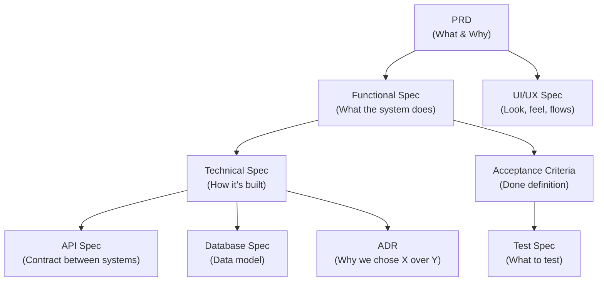
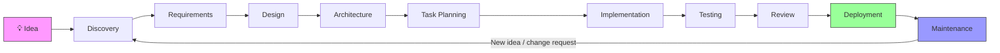
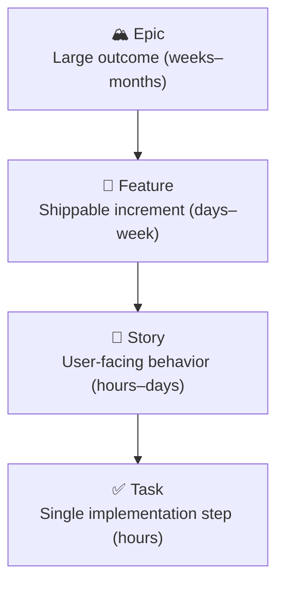
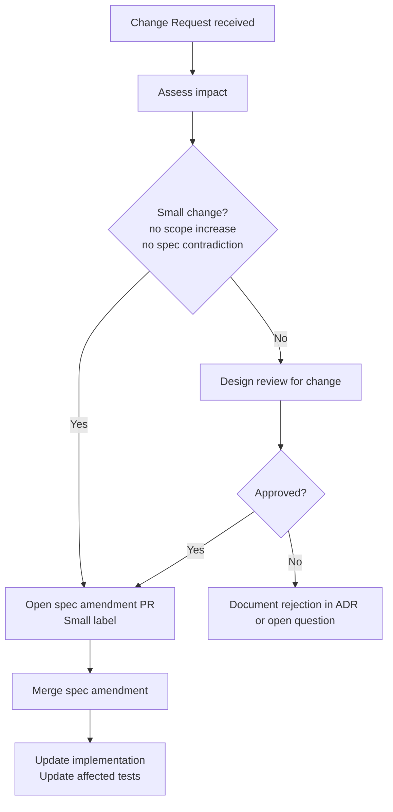
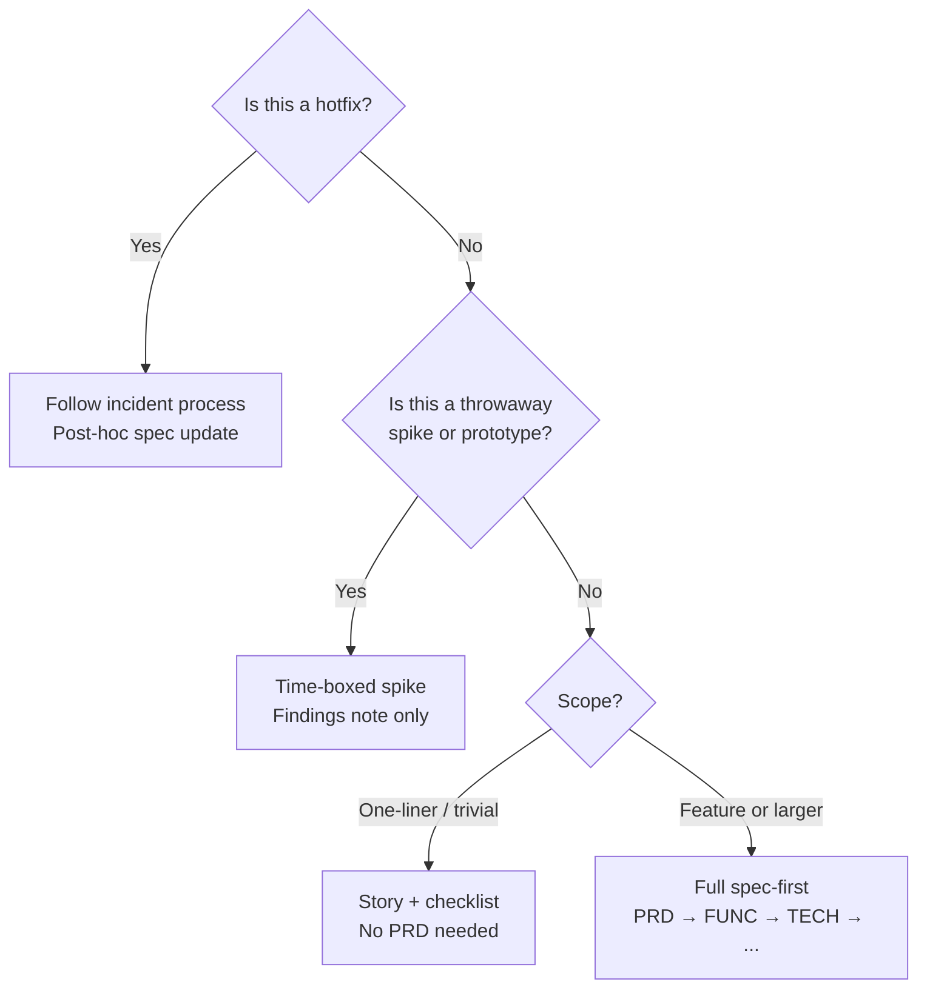

# Spec-First Software Development
### A Comprehensive Practical Guide for AI-Assisted Engineering

---

## Table of Contents

1. [What Spec-First Development Is](#1-what-spec-first-development-is)
   - [Definition](#definition)
   - [Principles](#principles)
   - [Benefits](#benefits)
   - [Tradeoffs](#tradeoffs)
   - [When Not to Use It](#when-not-to-use-it)
2. [Types of Specifications](#2-types-of-specifications)
3. [Recommended Repository Structure](#3-recommended-repository-structure)
4. [Complete Workflow](#4-complete-workflow)
5. [AI-Assisted Workflow](#5-ai-assisted-workflow)
6. [Specification Templates](#6-specification-templates)
7. [Breaking Work into Executable Tasks](#7-breaking-work-into-executable-tasks)
8. [Review Process](#8-review-process)
9. [Example Project: BuildBoard](#9-example-project-buildboard)
10. [Common Mistakes](#10-common-mistakes)
11. [Best Practices](#11-best-practices)

---

## 1. What Spec-First Development Is

### Definition

Spec-first development is a workflow discipline in which specifications — written documents describing *what* a system must do and *how* it is structured — are authored, reviewed, and approved **before** implementation begins. Code is written to satisfy a specification, not to discover it.

This is distinct from *documentation-first* (writing docs after shipping) and *test-first* (TDD, where tests drive implementation without a prior written spec). Spec-first subsumes both: specs inform tests, and tests validate specs.

> **In a spec-first workflow:** the specification is the contract. Implementation is the fulfillment of that contract.

### Principles

1. **Clarity before code.** Ambiguity resolved in a document costs nothing. Ambiguity resolved in production code costs days.
2. **Specifications are living artifacts.** They are updated when requirements change — not abandoned after the first commit.
3. **Single source of truth.** Any question about intended behavior is answered by the spec, not by reading source code.
4. **Traceability.** Every feature, test, and architectural decision traces back to a written requirement.
5. **AI is an implementer, not an architect.** AI tools execute against your spec; they do not replace the thinking that produces it.
6. **Review gates are real gates.** Specs are reviewed and approved before work proceeds to the next phase.

### Benefits

| Benefit | Why It Matters |
|---|---|
| Reduced rework | Catching design errors at spec stage is 5–100× cheaper than post-implementation |
| Better AI output | LLMs produce more accurate, bounded code when given a concrete spec rather than an open-ended prompt |
| Onboarding clarity | New engineers and AI sessions can orient from specs without archaeology through git history |
| Parallel workstreams | Frontend, backend, and QA can work in parallel once the API spec is signed off |
| Scope discipline | Changes require a spec update, which makes scope creep visible and deliberate |
| Audit trail | Architecture decisions, tradeoffs, and rejections are documented, not lost |

### Tradeoffs

Spec-first is not cost-free. Acknowledge these before adopting it:

- **Upfront time cost.** Writing good specs takes time. On a two-day prototype, this may not be recoverable.
- **Spec drift risk.** If the team doesn't maintain specs through implementation, they degrade into misleading artifacts worse than having none.
- **False precision.** A detailed spec for an uncertain domain may lock in wrong decisions.
- **Overhead for small changes.** A one-line bug fix does not need a PRD. Calibrate the process to the scope.

### When Not to Use It

Skip or lighten the spec-first process in these scenarios:

- **Throwaway prototypes / spikes.** Exploring technical feasibility with no intention of shipping. Use a time-boxed spike with a brief findings note instead.
- **Hotfixes.** Emergency production fixes should follow an incident process, with post-hoc documentation.
- **Highly exploratory UX research.** When the goal is to discover what users want, not to build a known thing. Build lightweight, iterate, then spec what you're committing to.
- **Solo weekend projects.** Personal projects with one stakeholder, no maintenance burden, and no collaborators.
- **Very early-stage startups pre-product-market-fit.** If you're pivoting weekly, the cost of spec maintenance exceeds its benefit.

---

## 2. Types of Specifications

Each document type serves a distinct audience and answers a distinct question.



### Product Requirements Document (PRD)

**Audience:** Product, engineering leads, stakeholders  
**Answers:** Why are we building this? Who is it for? What problem does it solve? What are the success metrics?

A PRD is intentionally non-technical. It defines scope and purpose. It is the root from which all other specs derive.

**Key sections:**
- Problem statement
- Target users and personas
- Goals and non-goals
- Success metrics (KPIs)
- Constraints (timeline, budget, compliance)
- Open questions

---

### Functional Specification

**Audience:** Engineers, QA, product  
**Answers:** What must the system do? What are its inputs, outputs, and behaviors?

Functional specs describe observable system behavior without prescribing implementation. They bridge the PRD and technical specs.

**Key sections:**
- Feature breakdown with user stories
- Functional requirements (numbered, testable)
- Business rules
- Error states and edge cases
- Out-of-scope items (explicit)

---

### Technical Specification

**Audience:** Engineers  
**Answers:** How will we build it? What are the components, interfaces, data flows, and technical constraints?

**Key sections:**
- System context and component diagram
- Data flow
- Technology choices (referencing ADRs)
- Non-functional requirements (performance, security, scalability)
- Dependencies and third-party integrations
- Deployment model

---

### API Specification

**Audience:** Frontend engineers, backend engineers, consumers of the API, AI tools  
**Answers:** What endpoints exist, what do they accept, what do they return, what errors can occur?

Use **OpenAPI 3.x** (formerly Swagger) as the standard format. Maintain it as a machine-readable YAML/JSON file alongside prose notes.

**Key sections:**
- Endpoint definitions
- Request/response schemas
- Authentication model
- Rate limits
- Error codes and response shapes
- Versioning strategy

---

### Database Specification

**Audience:** Backend engineers, DBAs, data engineers  
**Answers:** What data entities exist, how are they related, what are the constraints?

**Key sections:**
- Entity-relationship diagram
- Table/collection definitions with field types and constraints
- Indexes
- Migration strategy
- Data retention and archival rules

---

### UI/UX Specification

**Audience:** Frontend engineers, designers, QA  
**Answers:** What does each screen look like? What are the user flows? What is the interaction model?

**Key sections:**
- User flow diagrams
- Wireframes or high-fidelity mockup references (link to Figma, etc.)
- Component inventory
- State definitions (loading, empty, error, success)
- Accessibility requirements
- Responsive behavior

---

### Architecture Decision Record (ADR)

**Audience:** Current and future engineers  
**Answers:** Why did we choose technology/pattern X? What alternatives were considered? What are the tradeoffs?

ADRs are small, focused documents — one per decision. They are immutable after acceptance (though they can be superseded by a new ADR).

**Standard format (Nygard-style):**
- Title
- Status (Proposed / Accepted / Deprecated / Superseded)
- Context
- Decision
- Consequences

---

### Acceptance Criteria

**Audience:** Engineers, QA, product  
**Answers:** How do we know when a feature is done?

Written in **Given/When/Then** (Gherkin) or as a checklist. Every functional requirement should have at least one acceptance criterion.

---

### Test Specification

**Audience:** QA engineers, developers  
**Answers:** What test cases exist, what do they cover, what is the expected outcome?

**Key sections:**
- Test scope and objectives
- Test types (unit, integration, E2E, performance, security)
- Test cases (input, steps, expected output)
- Pass/fail criteria
- Coverage targets

---

## 3. Recommended Repository Structure

Specs live in the repository alongside code. This enables version control, PR reviews on spec changes, and co-location with the implementation they describe.

```
my-project/
├── .github/
│   ├── PULL_REQUEST_TEMPLATE.md
│   └── workflows/
│       └── spec-lint.yml           # CI: validate OpenAPI, check broken links
│
├── specs/
│   ├── README.md                   # Index of all specs; how to read/contribute
│   │
│   ├── product/
│   │   ├── PRD-001-user-auth.md
│   │   └── PRD-002-notifications.md
│   │
│   ├── functional/
│   │   ├── FUNC-001-user-auth.md
│   │   └── FUNC-002-notifications.md
│   │
│   ├── technical/
│   │   ├── TECH-001-auth-service.md
│   │   └── TECH-002-notification-pipeline.md
│   │
│   ├── api/
│   │   ├── openapi.yaml            # Machine-readable canonical API spec
│   │   └── api-notes.md            # Human-readable prose companion
│   │
│   ├── database/
│   │   ├── DB-001-schema.md
│   │   └── erd.mermaid             # Entity-relationship diagram source
│   │
│   ├── ui/
│   │   ├── UX-001-auth-flows.md
│   │   └── UX-002-dashboard.md
│   │
│   ├── adr/
│   │   ├── ADR-001-use-postgres.md
│   │   ├── ADR-002-jwt-vs-sessions.md
│   │   └── ADR-003-monorepo-structure.md
│   │
│   └── test/
│       ├── TEST-001-auth-scenarios.md
│       └── TEST-002-api-contract.md
│
├── tasks/
│   ├── epics/
│   │   └── EPIC-001-user-onboarding.md
│   ├── features/
│   │   └── FEAT-001-registration.md
│   └── stories/
│       └── STORY-001-email-signup.md
│
├── src/
│   └── ...                         # Application code
│
├── tests/
│   └── ...                         # Test code
│
├── docs/
│   └── ...                         # Rendered/published documentation
│
└── CONTRIBUTING.md                 # Includes spec contribution guidelines
```

### Naming Conventions

| Document Type | Prefix | Example |
|---|---|---|
| PRD | `PRD-NNN` | `PRD-001-user-auth.md` |
| Functional Spec | `FUNC-NNN` | `FUNC-001-user-auth.md` |
| Technical Spec | `TECH-NNN` | `TECH-001-auth-service.md` |
| ADR | `ADR-NNN` | `ADR-001-use-postgres.md` |
| Database Spec | `DB-NNN` | `DB-001-schema.md` |
| UI/UX Spec | `UX-NNN` | `UX-001-auth-flows.md` |
| Test Spec | `TEST-NNN` | `TEST-001-auth-scenarios.md` |
| Epic | `EPIC-NNN` | `EPIC-001-user-onboarding.md` |
| Feature | `FEAT-NNN` | `FEAT-001-registration.md` |
| Story | `STORY-NNN` | `STORY-001-email-signup.md` |

Numbers are sequential within their type. Do not reuse numbers; mark deprecated specs as `[DEPRECATED]` in the title rather than deleting them.

---

## 4. Complete Workflow



### Phase 1: Idea

**Goal:** Capture the raw idea before it evaporates.

**Output:** A one-page *Idea Brief* (informal, not a full PRD yet).

**Activities:**
- Write a one-paragraph problem statement: *"Who has what problem and why does it matter?"*
- Identify the requestor and affected stakeholders
- Estimate rough scope: small / medium / large
- Decide: is this worth a formal spec process? (See §1.5)

**Idea Brief template:**

```markdown
## Idea: [Short title]

**Date:** YYYY-MM-DD
**Author:** @handle

### Problem
[One paragraph. Who is affected? What are they unable to do today?]

### Proposed Solution (rough)
[One paragraph. What might we build? This is not a commitment.]

### Stakeholders
- [ ] Product
- [ ] Engineering
- [ ] Design
- [ ] Legal/Compliance (if applicable)

### Rough Scope
- [ ] Small (< 1 sprint)
- [ ] Medium (1–3 sprints)
- [ ] Large (> 3 sprints / needs full spec process)

### Next step
[ ] Discovery spike / [ ] Write PRD / [ ] Reject — reasoning: ___
```

---

### Phase 2: Discovery

**Goal:** Gather enough information to write a defensible PRD.

**Output:** Discovery notes, user research summary, competitive analysis (if applicable).

**Activities:**
- User interviews or survey synthesis
- Review existing analytics or support data
- Spike any technically uncertain areas (time-boxed, output is a findings note, not production code)
- Identify constraints: compliance requirements, existing system boundaries, performance targets

**AI use in discovery:** Use an AI assistant to synthesize interview notes, generate a competitive feature matrix, or draft interview questions. Label AI-generated synthesis as `[Inference]` until validated.

---

### Phase 3: Requirements

**Goal:** Produce a signed-off PRD and Functional Specification.

**Output:**
- `specs/product/PRD-NNN-*.md` — approved
- `specs/functional/FUNC-NNN-*.md` — approved

**Activities:**
1. Draft the PRD from discovery notes
2. Review PRD with product and stakeholders (async PR comment or sync meeting)
3. Incorporate feedback; mark PRD as `Status: Accepted`
4. Derive functional requirements from the PRD
5. Write acceptance criteria for each functional requirement
6. Review functional spec with engineering leads and QA
7. Mark functional spec as `Status: Accepted`

**Gate:** Implementation does not begin until both documents are accepted.

---

### Phase 4: Design

**Goal:** Define the user experience and data model.

**Output:**
- `specs/ui/UX-NNN-*.md` — approved
- `specs/database/DB-NNN-*.md` — first draft

**Activities:**
- Design wireframes / mockups (Figma, Excalidraw, etc.)
- Document user flows with diagrams
- Identify all UI states (loading, empty, error, populated, disabled)
- Draft entity-relationship diagram
- Link Figma frames in the UX spec
- UX review with design and frontend engineers

---

### Phase 5: Architecture

**Goal:** Decide how the system will be built, document tradeoffs.

**Output:**
- `specs/technical/TECH-NNN-*.md` — approved
- `specs/api/openapi.yaml` — draft (reviewable)
- `specs/adr/ADR-NNN-*.md` — one per significant decision
- `specs/database/DB-NNN-*.md` — finalized

**Activities:**
- Produce system context diagram and component diagram
- Define all service interfaces (API contracts)
- Write ADRs for: database choice, auth strategy, service decomposition, caching, message queue selection, etc.
- Review technical spec and ADRs with senior engineers
- Finalize OpenAPI spec; tooling can generate mock servers from this

**Note on ADRs:** An ADR does not need to be long. A good ADR is 200–400 words. The discipline is the habit, not the length.

---

### Phase 6: Task Planning

**Goal:** Decompose the approved specs into executable work items.

**Output:** Epics, Features, Stories, and Tasks in your issue tracker, each linked to the relevant spec section.

**Activities:**
- Decompose functional requirements into stories
- Estimate stories (story points or t-shirt sizing)
- Identify dependencies between stories
- Assign stories to sprints or milestones
- Create a test spec from acceptance criteria

See §7 for the full decomposition hierarchy.

---

### Phase 7: Implementation

**Goal:** Build the system as described in the approved specs.

**Activities:**
- Engineers implement against the spec; the spec is the source of truth
- AI tools (Claude Code, Cursor, Copilot) are given the relevant spec sections as context
- If implementation reveals a spec gap, open a *spec amendment PR* before or alongside the code change
- Do not silently diverge from the spec; flag all deviations

**Branching convention:**

```
feat/STORY-001-email-signup
fix/STORY-003-validation-edge-case
spec/FUNC-001-add-rate-limit-requirement
```

---

### Phase 8: Testing

**Goal:** Verify that the implementation satisfies the acceptance criteria.

**Activities:**
- Unit tests per component (derived from test spec)
- Integration tests for service boundaries (derived from API spec)
- E2E tests for user flows (derived from UX spec and acceptance criteria)
- Performance tests if NFRs specify thresholds
- Security review (derived from technical spec security section)
- QA executes manual test cases from the test spec for flows not covered by automation

**Gate:** All acceptance criteria must have a passing automated test or a signed-off manual test result.

---

### Phase 9: Review

**Goal:** Verify correctness, quality, and spec compliance before merging.

See §8 for the full review process.

---

### Phase 10: Deployment

**Goal:** Release the implementation to production reliably.

**Activities:**
- Deployment runbook (part of the technical spec or a standalone ops doc)
- Feature flags for incremental rollout
- Database migration execution per the migration plan in DB spec
- Smoke tests post-deploy
- Rollback plan documented before deploy begins
- Monitor KPIs defined in the PRD

---

### Phase 11: Maintenance

**Goal:** Keep the system and its specs aligned over time.

**Activities:**
- Bug fixes reference the relevant spec section; if a bug reveals a spec error, update the spec
- New change requests restart at Phase 2 (Discovery) or Phase 3 (Requirements), not at Phase 7 (Implementation)
- Quarterly spec review: mark deprecated specs, update sections that have drifted
- ADRs that have been superseded are marked `Status: Superseded by ADR-NNN`

---

## 5. AI-Assisted Workflow

### How AI Should Consume Specs

AI coding tools (Claude Code, Cursor, GitHub Copilot, Gemini) produce better output when specs are structured for machine consumption as well as human reading. Apply these patterns:

**1. Always provide the relevant spec as context at the start of a session.**

Do not rely on the AI to infer requirements from existing code. The spec is the ground truth.

```
# Starting a Claude Code session

> Read specs/functional/FUNC-001-user-auth.md and 
> specs/api/openapi.yaml before writing any code. 
> Implement only what is described in those documents. 
> If you encounter a gap, ask me to clarify before proceeding.
```

**2. Scope each AI session to one story or task.**

Large context = higher drift probability. Scope the session to a specific story ID and pass only the specs relevant to that story.

**3. Reference spec IDs in your prompts.**

```
Implement the endpoint described in openapi.yaml under 
POST /api/v1/users. Follow the error response schema 
defined in the 'components/schemas/ErrorResponse' section.
```

**4. Instruct the AI to reject out-of-scope requests.**

```
Do not add features, fields, or behaviors not described 
in the spec. If I ask for something not in the spec, 
tell me so and ask whether I want to update the spec first.
```

---

### How Specs Should Be Updated

Specs change. The discipline is in making changes explicit and reviewed.

**Update triggers:**
- A functional requirement is discovered to be incorrect or incomplete
- A technical constraint is identified during implementation
- A stakeholder changes a requirement
- Testing reveals a gap in the acceptance criteria

**Update process:**
1. Open a spec amendment PR with the change
2. Tag relevant stakeholders for review
3. Once approved, the spec amendment PR merges *before or alongside* the code change
4. Never merge code that implements behavior not described in the current spec

**Do not** update specs silently in the same commit as the code change that implements the new behavior. The review trail is the value.

---

### Context Management

AI tools have context window limits. Manage context deliberately:

| Situation | Strategy |
|---|---|
| Starting a new feature session | Paste: story description + functional spec section + API spec section |
| Continuing a long session | Summarize completed work; re-paste only the remaining spec sections |
| Debugging | Include: error output + relevant technical spec section + the specific code being debugged |
| Writing tests | Include: acceptance criteria + the code being tested + test spec |
| Architecture discussion | Include: full technical spec + relevant ADRs |

**Context compression pattern for Claude:**

```
## Context for this session

**Story:** STORY-003 — Email validation on signup
**Spec reference:** FUNC-001 §3.2, openapi.yaml POST /api/v1/users

### Relevant spec excerpt
[paste only the sections needed]

### Already completed this session
- Created User model with email field
- Added bcrypt password hashing

### Current task
Implement email format validation per FUNC-001 §3.2.1
```

---

### Prompt Patterns

**Pattern 1: Spec-Grounded Implementation**

```
You are implementing a feature described in the following specification.
Do not infer, extend, or improve beyond what the spec states.
If the spec is ambiguous, ask for clarification before writing code.

[PASTE SPEC SECTION]

Task: Implement [specific thing].
Language/framework: [X].
```

**Pattern 2: Spec Gap Detection**

```
Review the following specification and the following code.
List any behaviors in the code that are not described in the spec,
and any spec requirements that appear unimplemented in the code.
Do not suggest improvements — only identify gaps and discrepancies.

SPEC:
[paste spec]

CODE:
[paste code]
```

**Pattern 3: Acceptance Criteria to Test Cases**

```
Given the following acceptance criteria, generate [Jest / pytest / RSpec] 
test cases. One test per criterion. Use the Given/When/Then structure 
as test descriptions. Do not add test cases not implied by the criteria.

ACCEPTANCE CRITERIA:
[paste AC]
```

**Pattern 4: Spec Update from Discovery**

```
During implementation, we discovered the following gap in the spec:
[describe gap]

Current spec text:
[paste relevant section]

Draft an amendment to the spec that addresses this gap.
Maintain the existing document style and numbering.
Flag any downstream sections that may need updates as a result.
```

**Pattern 5: ADR Drafting**

```
We need to decide between [Option A] and [Option B] for [component/concern].

Context:
- [constraint 1]
- [constraint 2]
- [constraint 3]

Draft an ADR in Nygard format. Present the decision neutrally.
Do not recommend — only structure the tradeoffs. I will fill in 
the Decision section after team review.
```

---

### Preventing Drift Between Implementation and Specifications

Drift — where code diverges from specs without the spec being updated — is the most common failure mode of spec-first workflows.

**Structural controls:**

| Control | Implementation |
|---|---|
| PR template includes spec compliance checklist | `.github/PULL_REQUEST_TEMPLATE.md` |
| CI checks for broken spec references | Script that validates story IDs in commit messages exist in specs |
| Spec lint in CI | `spectral lint specs/api/openapi.yaml` |
| Weekly spec review in team ritual | 15-min async review: any spec that changed this week? |
| Spec amendment required to merge | Enforced by PR review policy |

**PR template (spec compliance section):**

```markdown
## Spec Compliance

- [ ] This PR implements behavior described in spec: `[SPEC-ID]`
- [ ] If the spec was changed, the spec amendment is included in this PR or merged separately first
- [ ] Acceptance criteria in `[STORY-ID]` are all covered by tests in this PR
- [ ] No features were added beyond the spec without a linked spec update
```

---

## 6. Specification Templates

### PRD Template

```markdown
---
id: PRD-NNN
title: [Feature Name]
status: Draft | In Review | Accepted | Deprecated
author: @handle
created: YYYY-MM-DD
updated: YYYY-MM-DD
functional-spec: FUNC-NNN
---

# PRD-NNN: [Feature Name]

## 1. Problem Statement

[One to three paragraphs. What is broken or missing today? 
Who is affected and how severely? Include data if available.]

## 2. Target Users

| Persona | Description | Impact |
|---|---|---|
| [Persona A] | [Who they are] | [How this affects them] |

## 3. Goals

- [Measurable goal 1]
- [Measurable goal 2]

## 4. Non-Goals

> Explicitly listing non-goals prevents scope creep.

- We will NOT [thing that seems related but is out of scope]

## 5. Success Metrics

| Metric | Baseline | Target | Measurement Method |
|---|---|---|---|
| [KPI 1] | [current] | [goal] | [how measured] |

## 6. Constraints

- **Timeline:** [hard deadline, if any]
- **Budget:** [if relevant]
- **Compliance:** [GDPR, HIPAA, SOC2, etc.]
- **Technical:** [must use existing auth system, etc.]

## 7. Open Questions

| # | Question | Owner | Due |
|---|---|---|---|
| 1 | [question] | @handle | YYYY-MM-DD |

## 8. Appendix

[Links to research, competitive analysis, user interview summaries]
```

---

### Functional Specification Template

```markdown
---
id: FUNC-NNN
title: [Feature Name]
status: Draft | In Review | Accepted | Deprecated
author: @handle
prd: PRD-NNN
created: YYYY-MM-DD
updated: YYYY-MM-DD
---

# FUNC-NNN: [Feature Name] — Functional Specification

## 1. Overview

[One paragraph bridging the PRD to this document. 
What does this spec cover?]

## 2. Scope

**In scope:**
- [behavior 1]
- [behavior 2]

**Out of scope:**
- [behavior that is explicitly excluded]

## 3. Functional Requirements

> Requirements use MUST / SHOULD / MAY per RFC 2119.

### 3.1 [Subsystem or Feature Area]

**FR-001:** The system MUST [requirement].  
**Acceptance:** [Given/When/Then or checklist]

**FR-002:** The system MUST [requirement].  
**Acceptance:** [Given/When/Then or checklist]

**FR-003:** The system SHOULD [requirement].  
**Acceptance:** [Given/When/Then or checklist]

### 3.2 [Next Area]

[Continue numbering sequentially across sections]

## 4. Business Rules

- **BR-001:** [Rule with no exceptions]
- **BR-002:** [Rule; exception when [condition]]

## 5. Error States

| Trigger | System Response | User Message |
|---|---|---|
| [what goes wrong] | [what the system does] | [what the user sees] |

## 6. Out-of-Scope Behaviors (Explicit)

The following behaviors are explicitly not part of this specification 
and should not be implemented:

- [item]
- [item]

## 7. Dependencies

- Requires: [FUNC-NNN — name of prerequisite]
- Required by: [FUNC-NNN — name of downstream spec]
```

---

### ADR Template

```markdown
---
id: ADR-NNN
title: [Decision title]
status: Proposed | Accepted | Deprecated | Superseded by ADR-NNN
date: YYYY-MM-DD
authors: @handle
---

# ADR-NNN: [Decision Title]

## Status

Accepted

## Context

[2–4 sentences. What situation, constraint, or uncertainty 
prompted this decision? What forces are in tension?]

## Decision

[1–3 sentences. What did we decide? Be specific.]

## Alternatives Considered

### Option A: [Name]
**Pros:** [list]  
**Cons:** [list]

### Option B: [Name]
**Pros:** [list]  
**Cons:** [list]

### Option C (chosen): [Name]
**Pros:** [list]  
**Cons:** [list]

## Consequences

**Positive:**
- [outcome]

**Negative / Risks:**
- [outcome]

**Neutral:**
- [outcome]

## Review

Reviewed by: @handle, @handle  
Review date: YYYY-MM-DD
```

---

### Test Specification Template

```markdown
---
id: TEST-NNN
title: [Feature Name] Test Specification
status: Draft | Accepted
functional-spec: FUNC-NNN
author: @handle
created: YYYY-MM-DD
---

# TEST-NNN: [Feature Name] Test Specification

## 1. Scope

Tests for [feature] as defined in FUNC-NNN.

## 2. Test Types

- [x] Unit tests
- [x] Integration tests
- [ ] E2E tests
- [ ] Performance tests
- [ ] Security tests

## 3. Coverage Targets

| Type | Target |
|---|---|
| Unit | 90% line coverage |
| Integration | All API endpoints |
| E2E | All happy paths |

## 4. Test Cases

### TC-001: [Test case name]

**Type:** Unit  
**Requirement:** FR-001  
**Preconditions:** [state before the test]

**Steps:**
1. [step]
2. [step]

**Expected result:** [what should happen]  
**Pass criteria:** [specific observable outcome]

### TC-002: [Test case name]

[Continue...]

## 5. Test Data

[Describe required test fixtures, seeds, or mock data]
```

---

### OpenAPI Spec Excerpt (example)

```yaml
# specs/api/openapi.yaml
openapi: 3.1.0
info:
  title: My Project API
  version: 1.0.0
  description: |
    API specification for My Project.
    Derived from FUNC-NNN and TECH-NNN.

servers:
  - url: https://api.myproject.com/v1
    description: Production
  - url: https://api.staging.myproject.com/v1
    description: Staging

paths:
  /users:
    post:
      summary: Create a new user
      operationId: createUser
      tags: [Users]
      requestBody:
        required: true
        content:
          application/json:
            schema:
              $ref: '#/components/schemas/CreateUserRequest'
      responses:
        '201':
          description: User created
          content:
            application/json:
              schema:
                $ref: '#/components/schemas/User'
        '400':
          $ref: '#/components/responses/ValidationError'
        '409':
          $ref: '#/components/responses/Conflict'

components:
  schemas:
    CreateUserRequest:
      type: object
      required: [email, password]
      properties:
        email:
          type: string
          format: email
          maxLength: 254
        password:
          type: string
          minLength: 8
          maxLength: 128

    User:
      type: object
      properties:
        id:
          type: string
          format: uuid
        email:
          type: string
          format: email
        createdAt:
          type: string
          format: date-time

    ErrorResponse:
      type: object
      required: [code, message]
      properties:
        code:
          type: string
        message:
          type: string
        details:
          type: array
          items:
            type: object

  responses:
    ValidationError:
      description: Invalid input
      content:
        application/json:
          schema:
            $ref: '#/components/schemas/ErrorResponse'
    Conflict:
      description: Resource already exists
      content:
        application/json:
          schema:
            $ref: '#/components/schemas/ErrorResponse'
```

---

## 7. Breaking Work into Executable Tasks

### The Decomposition Hierarchy



### Epics

An Epic is a large body of work that delivers a meaningful outcome but is too large to implement in a single sprint. It maps to one or more PRDs.

```markdown
---
id: EPIC-NNN
title: User Authentication System
prd: PRD-001
status: In Progress
---

# EPIC-NNN: User Authentication System

## Objective
Enable users to securely register, log in, and manage their accounts.

## Success metrics (from PRD-001)
- Time to register < 60 seconds
- Login success rate > 99.5%

## Features
- [ ] FEAT-001: User Registration
- [ ] FEAT-002: Email Verification
- [ ] FEAT-003: Login and Session Management
- [ ] FEAT-004: Password Reset

## Definition of Done
All features complete, QA signed off, deployed to production, 
KPIs measuring for 1 week.
```

---

### Features

A Feature is a shippable increment within an Epic. It maps to a functional spec section.

```markdown
---
id: FEAT-NNN
title: User Registration
epic: EPIC-001
func-spec: FUNC-001 §3.1
status: Ready for development
---

# FEAT-NNN: User Registration

## Description
Allow new users to create an account with email and password.

## Stories
- [ ] STORY-001: Email/password signup form
- [ ] STORY-002: Server-side user creation endpoint
- [ ] STORY-003: Duplicate email rejection
- [ ] STORY-004: Welcome email trigger

## Acceptance (Feature-level)
A new user can successfully register and receive a welcome email 
within 30 seconds.
```

---

### Stories

A Story describes one user-facing behavior. It is the primary unit of work for a sprint.

```markdown
---
id: STORY-NNN
title: Email/password signup form
feature: FEAT-001
story-points: 3
assignee: @handle
status: In Progress
---

# STORY-NNN: Email/password signup form

## User Story
As a new user, I want to sign up with my email and password 
so that I can create an account.

## Spec References
- FUNC-001 §3.1.1 — FR-001, FR-002, FR-003
- UX-001 §2.1 — Signup screen wireframe
- openapi.yaml — POST /api/v1/users

## Acceptance Criteria

**AC-001: Happy path**
- Given: I am on the signup page
- When: I enter a valid email and password (≥8 characters) and submit
- Then: My account is created and I am redirected to the dashboard

**AC-002: Invalid email**
- Given: I am on the signup page
- When: I enter a malformed email address
- Then: An inline validation error is shown before submission

**AC-003: Weak password**
- Given: I am on the signup page
- When: I enter a password shorter than 8 characters
- Then: A password strength error is shown before submission

**AC-004: Duplicate email**
- Given: An account with my email already exists
- When: I attempt to register with that email
- Then: An error message states the email is already in use

## Tasks
- [ ] TASK-001: Build signup form component
- [ ] TASK-002: Add client-side validation
- [ ] TASK-003: Wire form to POST /api/v1/users
- [ ] TASK-004: Handle and display API error responses
- [ ] TASK-005: Write unit tests for form validation
- [ ] TASK-006: Write E2E test for happy path (AC-001)
```

---

### Tasks

Tasks are atomic implementation steps. They are assigned to a single engineer and completable in a few hours. They are typically managed as a checklist within the story or as sub-issues in your tracker.

```markdown
## TASK-001: Build signup form component

**Story:** STORY-001  
**Owner:** @handle  
**Estimate:** 2 hours

### Implementation notes
- Component: `src/components/auth/SignupForm.tsx`
- Fields: `email` (type=email), `password` (type=password)
- Submit button disabled until both fields have content
- Refer to UX-001 §2.1 for layout
- Use existing `Button` and `TextInput` design system components

### Done when
- [ ] Component renders correctly
- [ ] Submit button behavior is correct
- [ ] Matches wireframe in UX-001 §2.1
- [ ] Storybook story added
```

---

## 8. Review Process

### Design Reviews

**Timing:** Before the architecture phase is marked complete.  
**Participants:** Engineering leads, product, design, security (if applicable).  
**Artifacts reviewed:** Technical spec, ADRs, DB spec, UX spec.

**Review checklist:**

```markdown
## Design Review Checklist

### Technical Spec
- [ ] All functional requirements are addressed
- [ ] Non-functional requirements have measurable targets
- [ ] System diagram is present and accurate
- [ ] Data flow is documented
- [ ] Security considerations are addressed
- [ ] Scalability assumptions are stated

### ADRs
- [ ] Major decisions have ADRs
- [ ] Alternatives were genuinely considered
- [ ] Consequences (positive and negative) are stated
- [ ] All team members have had opportunity to comment

### API Spec
- [ ] OpenAPI file passes linting (`spectral lint`)
- [ ] All endpoints from functional spec are represented
- [ ] Error responses are consistent
- [ ] Authentication model is specified

### Database Spec
- [ ] ERD is present
- [ ] All entities from functional spec are represented
- [ ] Indexes are specified for query patterns
- [ ] Migration strategy is described
```

---

### Code Reviews

**In spec-first workflows, code reviews have an additional dimension:** spec compliance.

**Code review checklist addition:**

```markdown
## Spec Compliance (add to your standard PR template)

- [ ] The code implements behavior described in: [SPEC-ID]
- [ ] No behavior was added beyond the spec
- [ ] If the spec was amended, the amendment PR is merged or linked
- [ ] Acceptance criteria in [STORY-ID] are all covered by tests
- [ ] Variable/function names are consistent with spec terminology
```

---

### Spec Reviews

Spec documents are reviewed via Pull Requests, exactly like code. This creates an audit trail and enforces the "spec is reviewed before implementation" rule.

**Spec PR rules:**
- Spec PRs require at least one approval from a technical reviewer and one from a product/business reviewer (for PRDs and functional specs)
- Technical specs and ADRs require at least two engineering approvals
- Spec changes that affect existing acceptance criteria must tag QA

---

### Change Management

When requirements change mid-implementation:



Never accept a verbal change to requirements. Every change requires:
1. A spec amendment PR
2. Updated acceptance criteria
3. Updated test cases if affected
4. A note in the story referencing the change

---

## 9. Example Project: BuildBoard

*A lightweight project status dashboard. We walk through the spec-first lifecycle.*

---

### Idea

> *"Our team leads have no visibility into which projects are blocked. They find out in the weekly meeting, which is too late. We need a simple dashboard."*

**Idea Brief (informal):**

```markdown
## Idea: Project Status Dashboard ("BuildBoard")

**Date:** 2024-03-01  
**Author:** @alex

### Problem
Team leads learn about blocked projects in weekly meetings, 
24–72 hours after blockers arise. Engineers don't have a 
lightweight way to flag blockers without a full Jira update.

### Proposed Solution
A simple dashboard where engineers post a daily status 
(green / yellow / red) with a one-line note. 
Team leads see all projects at a glance.

### Rough Scope
- [x] Medium (2–3 sprints)

### Next step
- [x] Write PRD
```

---

### PRD

```markdown
---
id: PRD-001
title: BuildBoard — Project Status Dashboard
status: Accepted
author: @alex
created: 2024-03-02
---

# PRD-001: BuildBoard

## 1. Problem Statement
Team leads lack real-time visibility into project health. 
Blockers surface in weekly meetings, increasing resolution time. 
Engineering survey (n=24) showed 67% of engineers want a 
lighter-weight status tool than Jira.

## 2. Target Users
| Persona | Description |
|---|---|
| Engineer | Posts daily project status |
| Team Lead | Reads aggregate dashboard |

## 3. Goals
- Any engineer can post a project status in < 30 seconds
- Team leads can see all project statuses on one screen
- Blockers are visible within minutes of being filed

## 4. Non-Goals
- Not a replacement for Jira
- No task tracking or assignment
- No integrations (v1)

## 5. Success Metrics
| Metric | Target |
|---|---|
| Weekly active engineers posting status | > 80% of team |
| Time from blocker filed to team lead aware | < 15 minutes |
| Lead time to resolve blockers | 20% reduction vs baseline |
```

---

### Functional Specification (excerpt)

```markdown
---
id: FUNC-001
title: BuildBoard — Functional Specification
status: Accepted
prd: PRD-001
---

## 3. Functional Requirements

### 3.1 Status Posting

**FR-001:** The system MUST allow an authenticated engineer to 
post a project status with: status (green/yellow/red), 
project name, and a note (max 280 characters).  
**Acceptance:**
- Given: I am logged in
- When: I submit a status with all required fields
- Then: The status appears on the dashboard within 5 seconds

**FR-002:** The system MUST validate that note is ≤ 280 characters 
and display a character count.

**FR-003:** The system MUST reject submissions with an empty project 
name or missing status.

### 3.2 Dashboard View

**FR-004:** The system MUST display all projects with their 
most recent status, sorted by: red first, then yellow, then green, 
then alphabetical within each group.

**FR-005:** The system MUST show the time elapsed since the 
last status update (e.g., "2 hours ago").

**FR-006:** A project with no status update in > 24 hours MUST 
display a visual staleness indicator.
```

---

### Architecture Decision Record

```markdown
---
id: ADR-001
title: Use SQLite for v1 data persistence
status: Accepted
date: 2024-03-05
---

## Context
BuildBoard v1 is an internal tool for a team of ~30 engineers. 
We need a simple, low-ops persistence layer. 
We have no existing database infrastructure requirement.

## Decision
Use SQLite with a single-file database stored on the server.

## Alternatives Considered

### PostgreSQL
**Pros:** Production-grade, scales, team familiarity  
**Cons:** Requires managed instance or ops overhead; 
overkill for 30 users

### SQLite (chosen)
**Pros:** Zero ops, file-based, sufficient for < 1000 writes/day  
**Cons:** No concurrent writes at scale; single-server only

## Consequences
- Positive: Zero infrastructure cost; deployable in minutes
- Negative: Cannot horizontally scale; migration required if 
  load increases beyond single-server capacity
- Neutral: We accept this risk explicitly for v1; 
  ADR-002 will cover migration strategy if needed
```

---

### Story and Task Breakdown

```
EPIC-001: BuildBoard v1
  ├── FEAT-001: Status Posting
  │   ├── STORY-001: Status form UI (3 pts)
  │   ├── STORY-002: POST /api/statuses endpoint (2 pts)
  │   └── STORY-003: Form validation (2 pts)
  │
  ├── FEAT-002: Dashboard View
  │   ├── STORY-004: Dashboard layout and sort order (3 pts)
  │   ├── STORY-005: Elapsed time display (1 pt)
  │   └── STORY-006: Staleness indicator (2 pts)
  │
  └── FEAT-003: Authentication
      ├── STORY-007: Login with company SSO (5 pts)
      └── STORY-008: Session persistence (2 pts)
```

---

### AI Session Example

Starting implementation of STORY-001 with Claude Code:

````
> Read the following spec sections and implement the status posting form.
> Do not add any functionality not described here.
> Ask if anything is ambiguous.

## Spec context

### From FUNC-001 §3.1 (FR-001, FR-002, FR-003)
- Form fields: status (green/yellow/red selector), 
  project name (text), note (textarea, max 280 chars)
- Show character count for note field
- Validate: project name required, status required, note ≤ 280 chars
- On success: status appears on dashboard within 5 seconds

### From UX-001 §2.1
- Status selector: three colored radio-style buttons (not a dropdown)
- Character counter appears below the textarea in gray
- Submit button text: "Post Status"
- Error messages appear inline below each field

### From openapi.yaml POST /api/v1/statuses
- Request body: { projectName: string, status: "green"|"yellow"|"red", note: string }
- 201 response: { id: string, createdAt: string }
- 400 response: { code: string, message: string, details: [] }

Implement: `src/components/StatusForm.tsx` (React + TypeScript)
````

---

### Repository at End of Project

```
buildboard/
├── specs/
│   ├── product/
│   │   └── PRD-001-buildboard.md           ✅ Accepted
│   ├── functional/
│   │   └── FUNC-001-buildboard.md          ✅ Accepted
│   ├── technical/
│   │   └── TECH-001-buildboard.md          ✅ Accepted
│   ├── api/
│   │   └── openapi.yaml                    ✅ v1.0.0
│   ├── database/
│   │   └── DB-001-schema.md                ✅ Accepted
│   ├── ui/
│   │   └── UX-001-buildboard-flows.md      ✅ Accepted
│   ├── adr/
│   │   ├── ADR-001-use-sqlite.md           ✅ Accepted
│   │   └── ADR-002-ssr-vs-spa.md           ✅ Accepted
│   └── test/
│       └── TEST-001-buildboard.md          ✅ Accepted
└── tasks/
    ├── epics/EPIC-001-buildboard-v1.md
    ├── features/FEAT-001-status-posting.md
    └── stories/...
```

---

## 10. Common Mistakes

### Over-Specification

**Symptom:** Specs describe implementation details (function names, loop structures, variable naming) rather than behavior.

**Problem:** Engineers cannot make implementation decisions; specs become outdated immediately as code evolves; AI tools generate rigidly structured code that is hard to refactor.

**Fix:** Specs describe *what* the system does, not *how* it does it. Leave implementation decisions in the code. If a decision is architecturally significant, write an ADR — not a functional requirement.

---

### Under-Specification

**Symptom:** Acceptance criteria are absent or vague ("the form should work correctly"). Error states are unspecified. Edge cases are skipped.

**Problem:** Engineers implement their own interpretation. AI tools hallucinate behavior to fill gaps. QA cannot write tests. Stakeholders are surprised by the shipped product.

**Fix:** Every functional requirement needs at least one acceptance criterion. All error states must be specified. Use the question *"what should happen when X fails?"* as a forcing function.

---

### Specs Becoming Stale

**Symptom:** The spec says one thing; the code does another; nobody knows which is correct. Specs have sections marked "TODO" that are months old.

**Problem:** Stale specs are worse than no specs. They actively mislead new engineers and AI tools.

**Fix:**
- Require spec amendments before or alongside implementation changes
- Run a monthly "spec audit": compare spec dates to last code change dates in the same area
- Make spec staleness visible: CI fails if spec metadata `updated` date is > 90 days older than last code commit in the related directory

---

### AI Hallucinating Beyond the Spec

**Symptom:** The AI adds "helpful" features, fields, or behaviors not in the spec. The generated code includes error handling for scenarios not specified. Extra endpoints appear in the implementation.

**Problem:** Implementation diverges from the reviewed spec. QA tests the wrong surface. The team ships unreviewed behavior.

**Fix:**
- Include explicit instructions in every AI session: *"Do not implement anything not described in the spec. If you identify a gap, ask before proceeding."*
- Use spec gap detection prompts (Pattern 2 in §5) as part of code review
- Review AI-generated code against the spec, not just for general code quality

---

### Scope Creep

**Symptom:** Stories grow during implementation. "While I'm in here, I'll also..." appears in PRs. The sprint velocity drops unexpectedly.

**Problem:** Unreviewed scope adds risk, delays delivery, and makes specs inaccurate.

**Fix:**
- Make the spec the arbiter: if it's not in the spec, it's not in the sprint
- Out-of-scope ideas go to a backlog or new idea brief, not into the current PR
- PRs that exceed their story scope require a new story + spec amendment before merging the extra work

---

## 11. Best Practices

### Single Source of Truth

All behavioral truth lives in the specs directory in the repository. Not in Confluence, not in Notion, not in a Slack message, not in someone's head.

- If a decision is made in a meeting, one person owns updating the spec before the next workday
- If Confluence or Notion is your company wiki, keep only *links* to the canonical spec in the repo — never duplicate content

---

### Living Documentation

A spec that is never updated is a liability. Adopt the discipline of treating the spec update as part of the implementation task, not a follow-up afterthought.

**Operationally:**
- Add "Update specs if behavior changed" to your Definition of Done
- Include spec file changes in the same PR as the code change that implements the amendment
- Stale specs should generate the same discomfort as stale tests

---

### Versioning

Specs are versioned by git. This gives you:
- Full history of every change and who made it
- The ability to see what the spec said at any point in time
- PR-based review for every change

For major API revisions, also increment the OpenAPI `info.version` and maintain parallel versioned files (`openapi-v1.yaml`, `openapi-v2.yaml`) during transition periods.

---

### Traceability

Every piece of the system should be traceable back to a requirement. Use a traceability matrix for high-compliance projects (fintech, healthcare, regulated industries):

```markdown
## Traceability Matrix (excerpt)

| Requirement | Spec | Story | Test |
|---|---|---|---|
| FR-001 User can post status | FUNC-001 §3.1 | STORY-001 | TC-001, TC-002 |
| FR-004 Sort by severity | FUNC-001 §3.2 | STORY-004 | TC-008 |
```

In lower-compliance projects, the Story document already provides this link: it references the spec and lists the acceptance criteria that become tests.

---

### Automation

Use tooling to reduce the maintenance burden of spec-first workflows:

| Tool | Purpose |
|---|---|
| `spectral` | Lint OpenAPI specs for consistency and correctness |
| `swagger-ui` / `redocly` | Render OpenAPI as browsable documentation |
| `prism` | Generate a mock server from the OpenAPI spec for parallel frontend development |
| `dredd` | Test that the implementation matches the OpenAPI spec |
| `markdown-link-check` | Find broken cross-references in spec documents |
| Custom CI script | Validate that story IDs in PR descriptions exist as spec files |
| `husky` + `commitlint` | Enforce commit message format that includes story IDs |

**Example CI spec validation (GitHub Actions):**

```yaml
# .github/workflows/spec-lint.yml
name: Spec Lint

on: [pull_request]

jobs:
  lint-openapi:
    runs-on: ubuntu-latest
    steps:
      - uses: actions/checkout@v4
      - name: Install Spectral
        run: npm install -g @stoplight/spectral-cli
      - name: Lint OpenAPI
        run: spectral lint specs/api/openapi.yaml

  check-links:
    runs-on: ubuntu-latest
    steps:
      - uses: actions/checkout@v4
      - name: Check markdown links
        uses: gaurav-nelson/github-action-markdown-link-check@v1
        with:
          folder-path: specs/
```

---

## Appendix: Quick Reference

### Spec-First Workflow Checklist

```markdown
## Before writing code for a new feature:

Phase 1 – Requirements
- [ ] PRD written and accepted
- [ ] Functional spec written and accepted
- [ ] Acceptance criteria defined for all functional requirements

Phase 2 – Design  
- [ ] UX spec written (wireframes linked)
- [ ] DB spec written (ERD present)

Phase 3 – Architecture
- [ ] Technical spec written and accepted
- [ ] OpenAPI spec written and linting passes
- [ ] ADRs written for significant decisions
- [ ] Design review completed

Phase 4 – Implementation
- [ ] Stories created and linked to specs
- [ ] Each story has a story ID and spec references
- [ ] AI sessions start with spec context

Phase 5 – Testing
- [ ] Test spec written from acceptance criteria
- [ ] All acceptance criteria have automated or manual test coverage

Phase 6 – Review
- [ ] Code reviewed for spec compliance
- [ ] Spec updated if implementation revealed gaps
- [ ] QA signed off on test spec

Phase 7 – Deploy
- [ ] Deployment runbook present
- [ ] Rollback plan documented
- [ ] KPIs from PRD being measured
```

---

### Spec Readiness Decision Tree



---

*Guide version: 1.0 — for updates, open a PR against this document.*