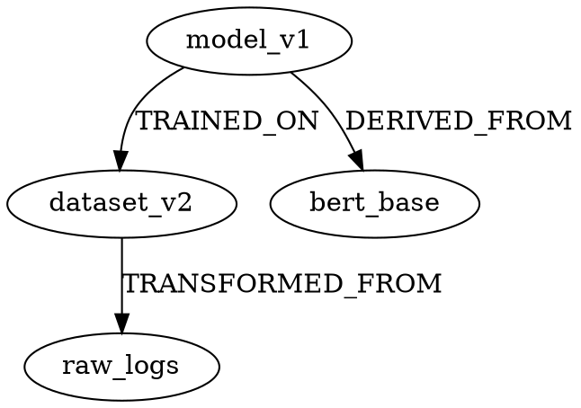

## Continuous Training (CT)

**Architecture Pattern Category:** MLOps Operational Pattern

**Core Mechanism:** Automated pipeline that retrains machine learning models on new data at regular intervals or triggered by performance degradation, data drift detection, or business-defined schedules, maintaining model relevance without manual intervention.

**Structural Components:**

- **Training Orchestrator:** Manages execution schedules, resource allocation, and pipeline coordination
- **Data Versioning System:** Tracks dataset snapshots, lineage, and reproducibility requirements
- **Model Registry:** Stores trained artifacts with metadata, lineage, and deployment status
- **Performance Monitor:** Tracks model metrics against production baselines and SLAs
- **Trigger Engine:** Evaluates conditions for initiating retraining (time-based, event-based, metric-based)
- **Resource Manager:** Handles compute provisioning, scaling, and cost optimization
- **Artifact Store:** Manages feature stores, intermediate outputs, and training artifacts

**Implementation Variants:**

**Time-Based Continuous Training:** Fixed schedule retraining (hourly, daily, weekly) regardless of model performance. Suitable for highly dynamic domains where data distributions shift predictably.

**Performance-Triggered Retraining:** Initiates training when monitored metrics (accuracy, F1, RMSE) fall below thresholds. Requires robust production monitoring and alert infrastructure.

**Data Drift-Triggered Retraining:** Uses statistical tests (Kolmogorov-Smirnov, Population Stability Index, Jensen-Shannon divergence) to detect distribution shifts in input features, triggering retraining when drift exceeds tolerance.

**Hybrid Triggering:** Combines multiple conditions with weighted priorities and cooldown periods to prevent training thrashing.

**Pipeline Architecture Patterns:**

**Sequential Pipeline:** Linear DAG where stages execute serially (data extraction → preprocessing → training → validation → registration). Simplest implementation but longest completion time.

**Parallel Pipeline:** Concurrent execution of independent stages (multiple model architectures, hyperparameter sets, or data partitions). Requires sophisticated orchestration and resource management.

**Incremental Training Pipeline:** Warm-starts from previous model checkpoints, training only on delta data. Reduces computational cost but accumulates drift over iterations without periodic full retraining.

**Ensemble Pipeline:** Trains multiple models concurrently, combining predictions through voting or stacking. Increases robustness but multiplies infrastructure costs.

**Critical Implementation Considerations:**

**Data Quality Gates:** CT systems must enforce schema validation, completeness checks, and statistical profiling before training initiation. Silent data quality degradation compounds through successive training cycles.

**Reproducibility Requirements:** Every training run must capture: exact data version/hash, code commit SHA, dependency versions, hyperparameters, random seeds, and hardware specifications. Container-based training with pinned dependencies is standard practice.

**Model Validation Rigor:** Automated validation must exceed production metrics on holdout sets before promotion. A/B testing infrastructure or shadow deployment verifies performance in production traffic before full rollout.

**Rollback Mechanisms:** CT systems require instant reversion capability to previous model versions when degradation occurs post-deployment. Registry must maintain complete deployment history with one-click rollback.

**Resource Optimization:** Training costs scale with frequency. Strategies include: incremental learning, transfer learning from base models, early stopping, automated hyperparameter optimization with limited budgets, and spot instance utilization.

**Concurrency Control:** Multiple concurrent training runs on different data windows or architectures require distributed locking on shared resources (feature stores, model registry) and conflict resolution for simultaneous deployments.

**Training-Serving Skew Mitigation:** Feature engineering logic must be identical between training and inference. Common approaches: shared feature transformation libraries, feature stores with consistent APIs, or containerized preprocessing modules used in both pipelines.

**Monitoring and Observability:**

Essential telemetry includes: training duration trends, resource utilization, data volume processed, metric improvement deltas, training failures/retries, model size evolution, and deployment latency. Alerts on anomalous training patterns prevent silent degradation.

**Cost Management:**

CT introduces recurring compute costs proportional to training frequency and model complexity. Cost optimization requires: training schedule tuning based on ROI analysis, tiered compute allocation (development vs production pipelines), automatic resource scaling, and cost attribution per model/team.

**Security and Compliance:**

Training data access requires audit logging and access controls. Model artifacts contain learned patterns from potentially sensitive data, requiring encryption at rest, access policies, and retention management. Regulatory requirements (GDPR, CCPA) may mandate training data lineage and model explainability.

**Edge Cases and Failure Modes:**

**Training Data Availability Lag:** Source systems may not provide data with required SLAs, causing training delays or stale model deployment.

**Cascading Model Dependencies:** When Model B depends on Model A's predictions, CT must coordinate retraining order and validate cross-model compatibility.

**Metric Gaming:** Overfit to validation metrics through repeated training iterations without corresponding production improvement.

**Resource Starvation:** Concurrent training jobs exhaust cluster capacity, starving production inference services.

**Version Explosion:** Aggressive CT schedules generate unsustainable model artifact volumes, overwhelming storage and registry systems.

**Common Anti-Patterns:**

**Train-Without-Validate:** Automatic deployment of retrained models without holdout validation or human review checkpoints.

**Ignore Data Drift in Features:** Retraining on new labels while feature distributions shift silently, introducing training-serving skew.

**Fixed Schedule Without Context:** Daily retraining regardless of whether sufficient new data exists or previous model performs adequately.

**No Rollback Plan:** Deploying new models without maintaining previous versions or instant reversion capability.

**Shared Mutable State:** Multiple training pipelines modifying feature stores or datasets without versioning or isolation.

**Integration with MLOps Ecosystem:**

CT operates alongside: Continuous Integration (CI) for pipeline code validation, Continuous Deployment (CD) for model promotion, Feature Stores for consistent feature access, Experiment Tracking for training history, and Model Monitoring for performance tracking.

**Tooling Examples:**

Kubeflow Pipelines, MLflow, Apache Airflow with ML operators, AWS SageMaker Pipelines, Google Cloud Vertex AI Pipelines, Azure Machine Learning Pipelines, Databricks Jobs. Selection depends on cloud strategy, existing infrastructure, and team expertise.

**Related Topics:**

- Continuous Deployment (CD) for ML
- Online Learning
- Model Monitoring
- Data Versioning Strategies
- Feature Store Architecture
- A/B Testing Infrastructure
- Shadow Deployment Pattern
- Champion/Challenger Pattern

---

## Continuous Integration for ML

### Core Architectural Distinctions

Traditional CI validates code correctness through deterministic tests. ML CI must additionally validate model behavior, data quality, training reproducibility, and performance characteristics. The pipeline becomes a directed acyclic graph (DAG) where code, data, and model artifacts flow through validation gates with non-deterministic outcomes.

**[Inference]** The non-determinism arises from stochastic training processes, data drift, and hardware variations affecting numerical precision.

### Pipeline Architecture

**Trigger Mechanisms:**

- Code commits to model training scripts, feature engineering, or inference code
- Data schema changes or new data batches arriving in feature stores
- Hyperparameter configuration updates
- Dependency updates (framework versions, system libraries)
- Scheduled retraining based on model staleness metrics

**Staged Validation Gates:**

```
Code Commit → Static Analysis → Unit Tests → Data Validation → 
Model Training (lightweight) → Model Validation → Integration Tests → 
Staging Deployment → Shadow Testing → Production Candidate
```

### Data Validation Layer

**Schema Validation:**

- Enforce data contracts using tools like Great Expectations, TFDV, or Pandera
- Detect schema drift: new columns, type changes, null patterns
- Validate feature distributions against historical baselines
- Check cardinality constraints, value ranges, cross-feature correlations

**Data Quality Metrics:**

- Missing value rates per feature
- Feature drift scores (KL divergence, Population Stability Index, Kolmogorov-Smirnov statistic)
- Label distribution shifts for supervised learning
- Temporal consistency checks for time-series features

**[Inference]** Pipeline should fail fast on data validation before expensive training operations.

### Model Validation in CI

**Lightweight Training:**

- Train on subset of data (stratified sampling maintaining class distributions)
- Reduced epoch counts or early stopping criteria
- Smaller model architecture variants
- Goal: Verify training completes without runtime errors, not achieve production-quality metrics

**Model Smoke Tests:**

- Prediction latency benchmarks on sample inputs
- Output schema validation (shape, dtype, range constraints)
- Numerical stability checks (no NaN/Inf in predictions)
- Backward compatibility for serialized model format

**Performance Baselines:**

- Compare against previous model version on validation holdout set
- **[Unverified]** Absolute threshold gates (e.g., "accuracy > 0.85") may be too brittle for CI; relative comparisons are more stable
- Statistical significance tests for metric differences (paired t-tests, bootstrap confidence intervals)

### Reproducibility Requirements

**Deterministic Training:**

- Pin random seeds across all components (NumPy, PyTorch, TensorFlow, data loaders)
- Fixed data ordering with sorted indices
- Disable non-deterministic CUDA operations (`torch.backends.cudnn.deterministic = True`)
- **[Inference]** Full reproducibility may conflict with performance optimizations

**Environment Pinning:**

- Lock all dependency versions (pip freeze, conda export, Poetry lock)
- Container image hashing (Docker content digests)
- Track hardware specifications (GPU model, driver version for GPU training)
- Version control for external data sources (dataset versioning in DVC, LakeFS)

**Artifact Lineage:**

- Record training hyperparameters, data snapshots, code commits
- Model registries (MLflow, Weights & Biases, Neptune) for experiment tracking
- Bidirectional traceability: model → training run → code + data versions

### Code Quality Gates

**Static Analysis:**

- Type checking for ML code (mypy with pandas stubs, NumPy type annotations)
- Linting for ML-specific anti-patterns (unused features, data leakage patterns)
- Security scans for model serialization vulnerabilities (pickle exploits)

**Unit Testing Challenges:**

- Mock expensive operations (model inference, data loading)
- Test feature engineering transformations with synthetic data
- Validate preprocessing pipelines maintain expected statistics
- **[Inference]** Pure unit tests cannot verify model quality; integration tests required

### Integration Testing Patterns

**End-to-End Pipeline Tests:**

- Train miniature model on synthetic dataset
- Validate inference API contracts (input validation, output format)
- Test model loading from artifact storage
- Verify feature computation matches training-time logic

**Shadow Mode Testing:**

- Deploy new model alongside production model
- Route inference traffic to both, log predictions
- Compare outputs without affecting production decisions
- Analyze prediction divergence and performance drift

### Infrastructure Considerations

**Compute Resource Allocation:**

- Ephemeral training environments (Kubernetes jobs, AWS Batch)
- GPU scheduling for parallel CI jobs
- Shared artifact caching (model checkpoints, preprocessed datasets)
- **[Unverified]** Spot instances may reduce costs but introduce failure modes requiring retry logic

**Artifact Storage:**

- Versioned model binaries in object storage (S3, GCS, Azure Blob)
- Training logs and metrics in time-series databases
- Dataset snapshots with deduplication (content-addressable storage)

### Failure Modes and Mitigations

**Flaky Tests:**

- Non-deterministic training convergence
- Data sampling variance in validation splits
- Hardware-dependent numerical precision
- **Mitigation:** Multiple runs with aggregated results, tolerance bands for metrics

**Resource Exhaustion:**

- OOM errors from large model/batch size combinations
- Training timeouts on slow convergence
- **Mitigation:** Resource limits, circuit breakers, automatic rollback

**Data Quality Deterioration:**

- Upstream data pipeline failures propagating
- Silent feature computation bugs
- **Mitigation:** Comprehensive data validation, alert on drift detection

### Orchestration Patterns

**Workflow Management:**

- DAG-based orchestration (Airflow, Kubeflow Pipelines, Prefect)
- Conditional execution based on validation outcomes
- Parallel execution of independent validation steps
- Retry policies with exponential backoff

**State Management:**

- Idempotent pipeline steps for safe retries
- Checkpointing intermediate artifacts
- Transactional semantics for model registry updates

### Monitoring and Observability

**CI Pipeline Metrics:**

- Build duration by pipeline stage
- Test failure rates and categories
- Resource utilization (CPU, GPU, memory, I/O)
- Artifact size growth trends

**Model-Specific Telemetry:**

- Training convergence curves
- Validation metric time series
- Feature importance distributions
- Prediction confidence distributions

### Anti-Patterns

**Over-Validation:**

- Exhaustive hyperparameter sweeps in CI (belongs in experimentation phase)
- Full-scale training in every commit (prohibitively expensive)
- Testing on production-size datasets

**Under-Validation:**

- Skipping data validation to save time
- No model performance regression tests
- Ignoring prediction latency constraints

**False Confidence:**

- Passing CI with only unit tests, no integration tests
- Validating on training data distribution only
- **[Inference]** Static test datasets may not represent production distribution shifts

### Related Topics

- Model Versioning and Registry Patterns
- Feature Store Architecture
- A/B Testing Infrastructure for ML
- Model Monitoring and Drift Detection
- Experiment Tracking Systems
- Data Versioning Strategies
- Shadow Deployment Patterns
- Canary Releases for ML Models

---

## Continuous Deployment for ML

### Deployment Pipeline Architecture

ML continuous deployment requires separation of model training pipelines from inference service deployment pipelines. Training pipelines execute on schedules or triggers (data drift, performance degradation), producing versioned model artifacts. Deployment pipelines consume these artifacts, execute validation gates, and promote models through environments (staging, canary, production).

**Critical distinction from traditional CD:** Model artifacts are stateful, non-deterministic in behavior changes, and require runtime performance validation beyond unit/integration tests. A passing build does not guarantee production viability.

### Model Registry Integration

Centralized model registry serves as the source of truth for deployment decisions. Registry stores:

- Serialized model artifacts (pickled objects, ONNX, TensorFlow SavedModel, TorchScript)
- Training metadata (hyperparameters, dataset versions, feature engineering code hashes)
- Validation metrics (offline accuracy, precision, recall, latency benchmarks)
- Lineage information (training pipeline ID, git commit, dependencies)
- Approval status and stage assignments

Deployment pipeline queries registry API, retrieves model by version or stage tag, never directly from training output locations. This decoupling prevents race conditions where training overwrites models mid-deployment.

### Shadow Deployment Pattern

Deploy candidate model alongside production model. Route duplicate request traffic to both models. Log predictions from both; serve only production model predictions to users. Compare prediction distributions, latency percentiles, error rates, resource consumption over observation window (hours to days).

**Implementation considerations:**

- Request duplication at load balancer or service mesh layer (Envoy, Istio)
- Asynchronous shadow inference to prevent latency impact on production path
- Sampling strategy for high-traffic scenarios (shadow 1-10% of requests)
- Metric divergence thresholds trigger rollback or promotion decisions

**Failure mode:** Shadow model crashes do not affect user experience but must trigger alerts. Monitor shadow model health independently.

### Canary Deployment with Statistical Validation

Route small percentage of production traffic (1-5%) to new model. Monitor success metrics with statistical significance tests (chi-square for categorical outcomes, t-test for continuous metrics). Gradually increase traffic percentage if metrics remain within acceptable bounds.

**Key implementation requirements:**

- Session stickiness: same user receives predictions from same model version during session to prevent inconsistent experience
- Randomized traffic splitting at user-level, not request-level
- Pre-defined success criteria with confidence intervals (e.g., 95% CI on accuracy degradation < 2%)
- Automated rollback on metric violations before human intervention

**Latency considerations:** P99 latency must remain stable. Single slow prediction can cascade to timeout failures. Set hard timeout thresholds lower than client timeout values.

### Blue-Green Deployment Constraints

Maintain two complete inference environments. Route all traffic to blue (current production). Deploy new model to green. Validate green with synthetic traffic. Atomically switch routing to green.

**ML-specific complications:**

- Model loading time: large models (BERT, GPT variants, Vision Transformers) require 30+ seconds to load into GPU memory. Warm green environment before cutover.
- State synchronization: if model maintains stateful components (recommendation system user embeddings, online learning buffers), state must be replicated or dual-written during transition period
- Rollback simplicity is primary advantage but wastes 2x infrastructure cost

**Not suitable for:** Streaming models with stateful aggregations, models with warm-up periods requiring production traffic patterns

### Feature Store Integration

Feature computation must be version-locked with model version. Model trained on features computed with transformation version 1.2 will produce incorrect predictions if inference uses transformation version 1.3.

**Deployment contract:**

- Model metadata includes feature schema version and transformation code hashes
- Deployment pipeline validates feature store can serve required feature versions
- Runtime feature serving uses versioned API calls: `feature_store.get_features(entity_id, feature_names, version="1.2")`

**Breaking change handling:** If feature schema changes (new features, removed features, type changes), old model versions must continue receiving old schema. Feature store maintains multiple schema versions concurrently.

### Online Metrics Monitoring

Deploy instrumentation alongside model to emit real-time metrics:

- **Prediction distribution drift:** KL divergence, population stability index comparing current prediction distribution to training distribution
- **Input drift:** Statistical tests on feature distributions (Kolmogorov-Smirnov test for continuous, chi-square for categorical)
- **Latency percentiles:** P50, P95, P99 broken down by model stage (preprocessing, inference, postprocessing)
- **Resource utilization:** GPU memory, CPU cycles per prediction, batch size efficiency

**Alert thresholds:** Distinguish between gradual drift (retrain trigger) and sudden distribution shifts (potential data pipeline failure, rollback trigger).

### Model Versioning Scheme

Semantic versioning inadequate for ML. Use `{training_run_id}.{model_checkpoint}` or timestamp-based identifiers. Breaking changes concept doesn't apply—all model updates are potentially breaking from prediction consistency perspective.

**Immutable artifacts:** Once model version deployed to any environment, artifact must never be modified. Retraining with same hyperparameters produces different model due to stochastic optimization. Version 1.2 redeployed must be bitwise identical to original 1.2 deployment.

### Rollback Strategy

Maintain N previous model versions in hot standby (typically N=3). Rollback executes routing change, not redeployment. Previous versions remain loaded in memory with minimal traffic allocation for immediate failover.

**Rollback decision triggers:**

- Error rate exceeds threshold (>0.5% increase)
- Latency P99 exceeds SLA
- Prediction distribution drift exceeds KL divergence threshold
- Manual trigger from on-call engineer

**Automatic rollback:** Implement circuit breaker pattern. If canary metrics violate thresholds within first 30 minutes, automatic rollback without human approval. After 30 minutes, require manual review as issue may be environmental rather than model quality.

### A/B Testing for Model Comparison

Run multiple model versions in production long-term to measure business metric impact (click-through rate, conversion, revenue). Unlike canary deployment, both models continue serving traffic indefinitely.

**Variant assignment:**

- Hash user ID to deterministic bucket assignment
- Log variant assignment to data warehouse for offline analysis
- Minimum experiment duration based on statistical power calculations (typically weeks)

**Interaction effects:** If multiple models/features under simultaneous A/B tests, interaction effects complicate causal attribution. Use multi-armed bandit approach or sequential testing to reduce experiment count.

### Infrastructure as Code for ML Services

Define inference service infrastructure (Kubernetes deployments, autoscaling policies, GPU node pools) in declarative configuration. Model deployment triggers infrastructure updates if resource requirements changed.

**Model-specific resource requirements stored in model metadata:**

```yaml
resources:
  gpu: nvidia-tesla-t4
  memory: 16Gi
  cpu: 4
  batch_size: 32
  max_latency_ms: 100
```

Deployment pipeline reads requirements, generates Kubernetes manifests, applies with rolling update strategy. Prevents manual resource allocation errors.

### Dependency Management

ML models depend on:

- Framework versions (TensorFlow 2.13, PyTorch 2.0.1)
- CUDA/cuDNN versions for GPU inference
- Custom preprocessing libraries
- Tokenizers, encoders (often binary files, not installable packages)

**Containerization requirements:** Bundle all dependencies in Docker image with model artifact. Pin exact versions including transitive dependencies. Use multi-stage builds to separate training dependencies from inference dependencies, minimizing image size.

**Version conflicts:** Model A requires TensorFlow 2.12, Model B requires TensorFlow 2.14. Cannot coexist in same Python process. Deploy separate services or use model serving frameworks with isolation (TensorFlow Serving, TorchServe, Triton).

### Batch vs Online Serving Deployment

**Batch inference:** Deploy model as scheduled job (Airflow, Kubernetes CronJob). Read input from data warehouse, write predictions back. Simpler deployment but no real-time capability.

**Online serving:** Deploy model as REST/gRPC service. Sub-second latency requirements. Requires request batching, caching, autoscaling.

**Hybrid pattern:** Online service for real-time predictions with fallback to precomputed batch predictions for cache hits. Common in recommendation systems where candidate items pre-scored daily, re-ranked in real-time.

### Model Compilation and Optimization

Pre-deployment optimization:

- Quantization (FP32 → INT8, FP16) for latency/memory reduction
- Graph optimization, operator fusion (TensorRT, ONNX Runtime)
- Pruning low-importance weights

**Deployment impact:** Optimized models not bitwise equivalent to training checkpoints. Must validate optimized model predictions match original model within tolerance before deployment. Store both versions in registry; deploy optimized version but retain original for debugging.

### Multi-Model Serving

Single inference service hosts multiple model versions/variants. Reduces infrastructure overhead but increases blast radius of service failures.

**Request routing:** Include model version in request header or path parameter. Service loads requested model lazily or maintains LRU cache of recently used models.

**Memory management:** Set memory limits per model. Evict least-recently-used models when memory pressure high. Monitor cache hit rate; low hit rate indicates poor model version consolidation strategy.

### Data Validation at Inference Time

Validate input features before inference:

- Schema validation (feature presence, types)
- Range checks (numerical bounds from training data)
- Categorical value validation (only seen categories)

**Invalid input handling:** Reject request with error code vs. serve default prediction vs. serve with feature imputation. Choice depends on application tolerance for false predictions vs. service unavailability.

**Logging invalid inputs:** Store schema violations for root cause analysis. High rate of invalid inputs indicates upstream data pipeline changes, requires model retraining with updated schema.

### Prediction Caching

Cache predictions for deterministic inputs. TTL based on how quickly underlying data changes (user profile features change daily, item features change hourly).

**Cache key design:** Hash of feature values, not entity IDs. Same user with same features at different times hits same cache entry. Include model version in cache key to prevent serving stale predictions after model update.

**Cache invalidation:** On model deployment, flush cache or namespace cache keys by model version. Gradual cache warming prevents thundering herd on inference service.

### Traffic Shaping for Cost Control

GPU inference expensive. Implement request queuing, batching, autoscaling policies tuned for cost vs. latency tradeoff.

**Dynamic batching:** Accumulate requests for T milliseconds (10-50ms), batch up to N requests, run single inference pass. Increases throughput but adds latency.

**Autoscaling policy:** Scale up on queue length exceeding threshold, scale down on GPU utilization below threshold. Avoid rapid scaling oscillations with cooldown periods. Pre-warm instances during expected traffic spikes (product launches, daily peaks).

### Compliance and Auditability

Regulatory requirements (GDPR, CCPA, model risk management in finance) demand audit trails:

- Which model version produced specific prediction
- Input features used (for right-to-explanation)
- Training data provenance

**Implementation:** Log prediction ID, model version, timestamp, input feature snapshot to append-only audit log. Never delete prediction logs during model rotation. Separate audit log retention policy (years) from application logs (days).

### Related Topics

- Model Monitoring and Observability
- Feature Engineering Pipeline Patterns
- Model Retraining Triggers and Strategies
- Multi-Stage Model Pipelines
- Model Serving Architectures
- Online Learning Systems
- Model Explainability Integration
- Data Drift Detection
- Model Performance Degradation Handling
- ML System Testing Strategies

---

## Model Registry Pattern

### Core Architecture

Centralized metadata repository and artifact store managing machine learning model lifecycle artifacts, versioning, lineage, deployment states, and associated metadata across training, validation, staging, and production environments. Functions as single source of truth for model governance, reproducibility, and operational deployment workflows.

**Primary Components:**

- **Metadata Store**: Relational or document database storing model versions, hyperparameters, metrics, tags, lineage graphs, approval workflows, deployment history
- **Artifact Store**: Object storage (S3, GCS, Azure Blob) or filesystem storing serialized model binaries, weights, configuration files, containerized images
- **API Layer**: RESTful or gRPC interface exposing registration, versioning, search, transition, and retrieval operations
- **Lineage Tracker**: DAG representation linking models to datasets, training runs, parent models, code commits, experiment configurations
- **Access Control Layer**: RBAC/ABAC mechanisms governing registration, promotion, deployment permissions

### Structural Elements

**Model Entry Schema:**

```
ModelEntry {
  model_id: UUID
  name: string
  version: semver | integer
  framework: {type, version}
  artifact_uri: URI
  signature: {inputs, outputs, schema}
  metrics: Map<string, float>
  hyperparameters: Map<string, any>
  tags: Map<string, string>
  stage: enum[Staging, Production, Archived]
  creator: User
  created_timestamp: datetime
  lineage: {
    dataset_versions: []UUID
    parent_models: []UUID
    experiment_id: UUID
    code_version: git_sha
  }
  deployment_metadata: {
    target_environments: []string
    serving_configuration: object
    resource_requirements: ResourceSpec
  }
}
```

**Stage Transition State Machine:**

```
None → Development → Staging → Production
                  ↓              ↓
              Archived ← ← ← ← ← ←
```

### Implementation Variations

**Centralized Registry:**

- Single registry instance serving entire organization
- Enforces uniform governance, simplifies auditing
- Creates single point of failure, potential performance bottleneck at scale
- Suitable for <1000 models, monolithic ML platforms

**Federated Registry:**

- Multiple registry instances per team/domain with synchronization protocol
- Reduces blast radius, enables autonomous team workflows
- Introduces consistency challenges, complex lineage across registries
- Necessary for >10,000 models, multi-region deployments

**Embedded Registry:**

- Registry functionality within experiment tracking system (MLflow, Weights & Biases)
- Tighter integration with training workflows, reduced operational overhead
- Vendor lock-in, limited customization for deployment pipelines
- Appropriate for teams <50 practitioners

### Operational Patterns

**Immutable Versioning:** Models registered as immutable artifacts; modifications create new versions. Prevents silent model drift, enables rollback, complicates storage management for large models. Requires garbage collection policy (time-based, reference-counted, stage-based retention).

**Mutable Aliasing:** Stage labels (Production, Staging) act as mutable pointers to specific versions. Enables atomic promotions without client reconfiguration. Alias updates must be transactional to prevent race conditions during concurrent promotions.

**Lazy Loading vs Eager Caching:**

- Lazy: Serving infrastructure fetches from registry on-demand. Minimizes memory, adds latency, registry becomes critical path.
- Eager: Pre-load models to serving nodes during deployment. Faster inference, higher memory footprint, stale model risk during long-running services.

### Integration Patterns

**Training Pipeline Integration:**

```
Training Job → Model Artifact Generation → Registry.register(
  artifact_path,
  metadata={metrics, hyperparams},
  lineage={dataset_id, experiment_id}
) → Return model_version
```

**Deployment Pipeline Integration:**

```
CD System → Registry.get_model(name, stage='Production') 
         → Download artifact + metadata 
         → Deploy to serving infrastructure
         → Registry.log_deployment(model_version, environment, timestamp)
```

**Lineage Propagation:** Registry tracks backward lineage (inputs) and forward lineage (downstream consumers). Enables impact analysis when retraining datasets or deprecating models. Requires instrumentation across data pipelines, feature stores, serving systems.

### Consistency Guarantees

**Metadata-Artifact Consistency:** Two-phase commit pattern: (1) Upload artifact to object store, (2) Atomically register metadata with artifact URI. Failure in step 2 leaves orphaned artifact requiring cleanup. Reverse order risks metadata pointing to non-existent artifact.

**Stage Transition Atomicity:** Stage updates must be serializable to prevent race conditions where multiple models transition to Production simultaneously. Pessimistic locking during promotion or optimistic concurrency control with version checks.

**Cross-Region Replication:** Async replication of metadata and artifacts to DR regions. Replication lag introduces eventual consistency. Conflict resolution required for concurrent registrations in multi-master configurations (last-write-wins, vector clocks, CRDT).

### Access Control Strategies

**Role-Based Permissions:**

- Data Scientists: Register, tag, transition to Staging
- ML Engineers: Transition to Production, modify deployment metadata
- Read-Only: Audit, compliance teams

**Model-Level Authorization:** Tag-based or attribute-based access control for sensitive models (PII, regulated domains). Prevents unauthorized access to model artifacts containing proprietary algorithms or training data characteristics.

**Audit Logging:** Immutable log of all registry operations (registrations, transitions, deletions, access). Required for compliance (SOC2, GDPR Article 22), debugging production incidents, detecting unauthorized model exfiltration.

### Anti-Patterns

**Registry as Training Artifact Dump:** Registering every experimental model without curation creates unbounded growth, degrades search performance, obscures production-ready models. Enforce promotion criteria (minimum accuracy, validation on hold-out set) before registration.

**Bypassing Registry for Ad-Hoc Deployments:** Deploying models directly from local filesystems or experiment tracking systems without registry entry breaks lineage, prevents rollback, complicates incident response. All production models must flow through registry.

**Over-Reliance on Stage Labels:** Using only stage labels without version pinning in deployment manifests. Stage pointer updates cause unintended model switches in running services. Pin exact versions in infrastructure-as-code, use stages for human-readable references only.

**Inadequate Artifact Retention:** Deleting old model versions to save storage costs without considering rollback requirements. Production incidents often require rolling back multiple versions. Maintain N previous production versions (N≥3) indefinitely.

**Monolithic Model Entries:** Storing ensemble models or multi-stage pipelines as single registry entries. Prevents independent versioning of sub-models, complicates partial updates. Register pipeline components separately, use composite model pattern with references.

### Performance Considerations

**Metadata Query Optimization:** Registry queries (search by metrics, tags, lineage) become bottlenecks at scale. Index frequently queried fields, denormalize lineage graphs for read-heavy workloads, cache frequently accessed metadata in Redis/Memcached.

**Large Model Artifact Handling:** Models >1GB create upload/download bottlenecks. Use chunked uploads with resumability, serve via CDN for global deployments, consider model compression (quantization, pruning) before registration.

**Concurrent Registration Throughput:** High-frequency training jobs (AutoML, hyperparameter sweeps) generate registration bursts. Batch registration APIs, async metadata writes with eventual consistency, horizontal scaling of API layer behind load balancer.

### Schema Evolution

**Backwards Compatibility:** Adding new metadata fields must not break existing clients. Use optional fields with defaults, version API endpoints, maintain deprecated field mappings during transition periods.

**Framework Migrations:** Migrating models across frameworks (TensorFlow 1.x → 2.x, PyTorch versions) while preserving lineage. Store framework version in metadata, provide conversion utilities, maintain dual entries during migration windows.

### Disaster Recovery

**Backup Strategy:** Point-in-time snapshots of metadata database + versioned object storage. RPO (Recovery Point Objective) driven by business requirements—typically <1 hour for production registries.

**Cross-Region Failover:** Active-passive or active-active replication to secondary regions. DNS-based or application-level failover. Consistency model determines failover safety (async replication may lose recent registrations).

### Observability

**Registry Metrics:**

- Registration rate, query latency, artifact download duration
- Stage transition frequency, failed promotions
- Storage utilization growth rate, orphaned artifact count

**Alerting Thresholds:**

- Query latency p99 >500ms: Performance degradation
- Failed artifact downloads >1%: Storage infrastructure issues
- Zero Production transitions >7 days: Stalled deployment pipeline

### Related Topics

- Model Serving Pattern
- Feature Store Pattern
- Experiment Tracking Pattern
- Model Versioning Strategies
- Shadow Deployment Pattern
- Blue-Green Deployment for Models
- Model Monitoring and Observability Pattern
- A/B Testing Infrastructure for Models

---

## Experiment Tracking

Systematic capture and persistence of machine learning training runs, hyperparameters, metrics, artifacts, and environmental metadata to enable reproducibility, comparison, and lineage tracking across model development lifecycle.

**Core Components**

- **Run Context**: Immutable identifier binding execution instance to metadata snapshot (git commit, environment hash, dataset version)
- **Parameter Store**: Key-value persistence for hyperparameters, configuration objects, and feature engineering parameters
- **Metric Logger**: Time-series storage for scalar metrics (loss, accuracy), supporting both step-based and epoch-based indexing
- **Artifact Repository**: Versioned storage for model checkpoints, serialized preprocessors, evaluation plots, and dataset snapshots
- **System Metadata Collector**: Capture of hardware specs, library versions, resource utilization profiles

**Structural Variants**

_Centralized Server Architecture_

- Single tracking server with database backend (PostgreSQL, MySQL)
- Clients log via REST API or SDK wrapper
- Enables query aggregation, cross-team visibility
- Bottleneck risk under high concurrency; requires infrastructure maintenance
- Representative: MLflow Tracking Server, Weights & Biases backend

_Distributed File-Based_

- Each experiment writes to local/shared filesystem in standardized structure
- No server dependency; lower latency for writes
- Querying requires filesystem traversal; limited concurrent read scalability
- Suitable for single-user or small-team environments
- Representative: TensorBoard log directories, local MLflow file store

_Hybrid with Local Cache_

- Asynchronous buffer writes locally, batch-sync to remote store
- Tolerates network interruptions during training
- Complexity in conflict resolution if multiple processes write same run ID
- Requires cache invalidation strategy for reads

**Implementation Considerations**

_Metadata Granularity_

- **Per-epoch logging**: Balance between storage overhead and temporal resolution
- **Conditional logging**: Sample metrics at decreasing frequency for long runs (e.g., log every 10th epoch after epoch 100)
- **Nested runs**: Parent-child relationships for hyperparameter sweeps, cross-validation folds
- **Tag taxonomy**: Consistent tagging schema (e.g., `model_family`, `dataset_version`, `experiment_phase`) for query efficiency

_Concurrency Handling_

- **Distributed training**: Single experiment ID with parallel metric streams from multiple workers; requires aggregation strategy (mean, worker-0-only)
- **Parallel sweeps**: Isolated run IDs; tracking system must handle burst writes
- **Checkpoint races**: Atomic write operations for artifact uploads to prevent partial file corruption

_Storage Backend Trade-offs_

- **Relational databases**: Strong consistency, complex queries, schema migrations costly
- **NoSQL stores**: Schema flexibility, horizontal scaling, eventual consistency risks
- **Object storage (S3, GCS)**: Cost-effective for artifacts, high latency for small frequent writes
- **Time-series databases (InfluxDB, Prometheus)**: Optimized for metric queries, limited metadata support

**Lineage and Reproducibility**

_Environment Capture_

- Dependency pinning: Exact versions (`requirements.txt` with hashes, `conda env export --from-history`)
- [Inference] Container image tagging correlates run ID to execution environment, though image layer drift may occur
- Hardware fingerprinting: GPU model, CUDA version, CPU architecture affects numerical precision

_Code Versioning Integration_

- Git SHA at experiment initiation; uncommitted changes detected and logged as diff
- Auto-tagging runs with branch name enables filtering by development stage
- [Unverified] Some systems support automatic code snapshotting, but patching mechanisms vary by implementation

_Dataset Versioning_

- Content-addressable hashing (SHA-256 of sorted file list) for deterministic identifiers
- Pointer-based versioning (DVC, LakeFS) decouples data storage from tracking metadata
- Schema evolution tracking: Changes in feature names, types, or cardinality between versions

**Query and Analysis Patterns**

_Comparative Analysis_

- Multi-run metric overlay: Line plots with confidence intervals for stochastic runs
- Parallel coordinates plots: Hyperparameter relationships across high-dimensional spaces
- Automated report generation: Best N runs by metric threshold with parameter correlation

_Failure Diagnosis_

- Error log capture with stack traces linked to run ID
- Resource exhaustion markers: OOM events, disk full, timeout termination
- Divergence detection: NaN/Inf in gradients, exploding loss curves

**Anti-Patterns and Pitfalls**

_Logging Overhead_

- Excessive metric logging frequency degrading training throughput (e.g., per-batch vs per-epoch)
- Large artifact uploads blocking training loop; prefer async upload with completion callbacks
- Metric explosion: Logging high-cardinality data (per-sample predictions) as scalar metrics

_Metadata Pollution_

- Inconsistent naming conventions across team members preventing aggregation
- Orphaned runs from interrupted experiments cluttering result space
- Missing critical metadata (data split seed, augmentation parameters) discovered post-hoc

_Reproducibility Gaps_

- Non-deterministic operations (GPU atomics, multi-threaded data loading) not seeded
- [Inference] Environment capture omitting system libraries (BLAS, cuDNN) that affect numerics
- Dataset mutations between runs not versioned (e.g., preprocessing applied in-place)

**Integration Points**

_Training Frameworks_

- Callback mechanisms (Keras, PyTorch Lightning) for automatic metric extraction
- Custom hooks for framework-agnostic integration (pre-train, post-epoch, exception handlers)
- Distributed training adapters: Rank-0-only logging vs aggregated statistics

_Hyperparameter Optimization_

- Bidirectional communication: HPO controller reads metrics, updates search space
- Early stopping signals: Tracking system triggers run termination based on metric trends
- Resource allocation feedback: Longer time budgets for promising parameter regions

_Model Registry_

- Promotion workflow: Tracked run graduates to registered model with stage (staging, production)
- A/B test linkage: Deployed model version traced back to originating experiment
- Rollback capability: Registry maintains experiment metadata for retraining with historical parameters

**Scalability Constraints**

_Write Throughput_

- [Inference] Database connection pooling becomes critical above ~100 concurrent experiments
- Batch insert strategies: Buffer 100-1000 metric points before flushing
- Sharding by experiment ID or time range for horizontal scaling

_Storage Growth_

- Metric retention policies: Downsample historical runs (retain hourly instead of per-step)
- Artifact lifecycle management: Archive old checkpoints to cold storage (Glacier, Coldline)
- Run expiration: Auto-delete experiments tagged as `debug` or `scratch` after 30 days

_Query Performance_

- Indexed columns: `user_id`, `experiment_name`, `metric_name`, `start_time`
- Materialized views for common aggregations (best runs by date range)
- Result caching for dashboard queries with stale-while-revalidate strategy

**Security and Governance**

_Access Control_

- Role-based permissions: Read-only for data scientists, write for training jobs, admin for deletion
- Project-level isolation: Multi-tenancy with namespace separation
- Audit logging: Track who modified experiment metadata or deleted runs

_Compliance Requirements_

- PII in logged data: Anonymization of user IDs in metric tags
- Data residency: Geographic constraints on artifact storage locations
- Retention mandates: Regulatory requirements for model development audit trails

**Related Patterns**

- Feature Store Pattern
- Model Registry Pattern
- Pipeline Orchestration Pattern
- Shadow Deployment Pattern
- A/B Testing Framework Pattern

---

## Metadata Management

Metadata management in MLOps encompasses the systematic capture, storage, versioning, and retrieval of all artifacts, parameters, metrics, and lineage information associated with machine learning pipelines. This operates as a distributed system problem requiring consideration of consistency models, query performance, schema evolution, and integration with heterogeneous tool chains.

### Architectural Components

**Metadata Store Architecture**

- Relational backends (PostgreSQL, MySQL) for structured metadata with ACID guarantees
- Graph databases (Neo4j) for complex lineage traversal and dependency resolution
- Document stores (MongoDB, Elasticsearch) for flexible schema evolution and full-text search
- Object storage integration (S3, GCS, Azure Blob) for artifact reference management
- Time-series databases (InfluxDB, Prometheus) for metric aggregation and temporal queries

**Metadata Registry Pattern** Centralized service exposing metadata through versioned APIs. Decouples producers (training jobs, pipelines) from consumers (dashboards, audit systems). Implements event-driven propagation using message queues (Kafka, RabbitMQ) for real-time metadata updates. Requires distributed transaction coordination when spanning multiple backend systems.

**Schema Registry Integration** Enforces metadata schema contracts using Avro, Protocol Buffers, or JSON Schema. Enables backward/forward compatibility during schema evolution. Critical for multi-team environments where metadata producers and consumers evolve independently.

### Metadata Taxonomy

**Experiment Metadata**

- Hyperparameters (nested structures, conditional configurations)
- Environment specifications (dependencies, hardware, OS, driver versions)
- Random seeds and reproducibility anchors
- Git commit hashes, branch names, repository URLs
- User identities, timestamps, execution environments

**Model Metadata**

- Model architecture serialization (ONNX, SavedModel, pickle)
- Training metrics (loss curves, validation scores, convergence indicators)
- Feature importance, SHAP values, model explanations
- Model lineage (parent models, fine-tuning chains)
- Serialization formats, framework versions, custom layer definitions

**Dataset Metadata**

- Dataset versions, snapshots, deltas
- Schema definitions (column types, constraints, distributions)
- Data validation rules (Great Expectations, TFX Data Validation)
- Provenance (source systems, transformation pipelines, sampling strategies)
- Statistical profiles (means, medians, percentiles, cardinality)
- Data quality metrics (null rates, outlier counts, drift scores)

**Pipeline Metadata**

- DAG definitions, task dependencies, execution graphs
- Resource utilization (CPU, GPU, memory, I/O)
- Execution logs, error traces, retry counts
- Artifact URIs, intermediate outputs, checkpoint locations
- Stage-level metrics, bottleneck identification

**Deployment Metadata**

- Model registry entries (staging, production, archived states)
- Serving infrastructure (endpoints, replicas, load balancer configs)
- A/B test configurations, traffic splitting rules
- Monitoring thresholds, alert definitions
- Rollback histories, blue-green deployment states

### Lineage Tracking Patterns

**Data Lineage Graph** Directed acyclic graph (DAG) representing transformations from raw data sources through feature engineering to model inputs. Nodes represent datasets or transformations; edges encode dependencies. Enables impact analysis (upstream/downstream queries), compliance auditing, and debugging data quality issues.

**Model Lineage Chain** Tracks model ancestry through training, fine-tuning, distillation, and ensemble composition. Links models to training datasets, hyperparameter sweeps, and ancestor models. Critical for understanding performance regressions and reproducing historical results.

**Bidirectional Traceability**

- Forward tracing: Given raw data, identify all derived datasets and models
- Backward tracing: Given model predictions, trace to source data and transformations
- Cross-cutting queries: Find all models trained on specific data versions

### Versioning Strategies

**Semantic Versioning for Models** MAJOR.MINOR.PATCH convention where:

- MAJOR: Breaking API changes, incompatible input/output schemas
- MINOR: Backward-compatible improvements (accuracy gains, additional features)
- PATCH: Bug fixes, non-functional improvements

**Content-Addressable Storage** Hash-based addressing (SHA-256) for immutable artifacts. Enables deduplication, integrity verification, and efficient storage. Used by DVC, MLflow, and Git-LFS.

**Delta Versioning** Store only differences between versions rather than full copies. Reduces storage costs for large datasets with incremental changes. Requires efficient diff computation and merge strategies.

### Query and Retrieval Patterns

**Metadata Query DSL** Structured query language for metadata retrieval supporting:

- Filtering (by tags, metrics ranges, date ranges)
- Sorting (by metric values, timestamps)
- Aggregations (group by hyperparameters, compute statistics)
- Graph traversal (find all downstream dependencies)

**Caching Strategies**

- Read-through cache for frequently accessed metadata
- Write-behind cache for high-throughput logging scenarios
- Cache invalidation on metadata updates
- Distributed caching (Redis, Memcached) for horizontally scaled deployments

**Indexing Optimization**

- B-tree indices on timestamp, user_id, experiment_id
- Full-text indices on logs, descriptions, tags
- Graph indices for lineage traversal
- Composite indices for common query patterns

### Integration Patterns

**Logging Facade Pattern** Abstract metadata logging behind framework-agnostic interface. Allows switching between MLflow, Weights & Biases, Neptune, or custom backends without code changes. Implements adapter pattern for heterogeneous logging APIs.

**Event Sourcing for Metadata** Store metadata as immutable event stream rather than mutable state. Enables:

- Complete audit trail reconstruction
- Temporal queries (state at any point in time)
- Event replay for debugging
- CQRS (Command Query Responsibility Segregation) separation

**Metadata Aggregation Pattern** Consolidate metadata from distributed training jobs (e.g., distributed PyTorch, Horovod). Requires synchronization points, conflict resolution for concurrent writes, and aggregation functions (averaging metrics across workers).

### Consistency and Synchronization

**Eventually Consistent Metadata** Acceptable for non-critical metadata (logs, intermediate metrics). Reduces latency and improves throughput. Requires conflict resolution strategies (last-write-wins, vector clocks).

**Strongly Consistent Metadata** Required for critical metadata (model registry state transitions, dataset versions). Implemented using distributed consensus (Raft, Paxos) or coordination services (ZooKeeper, etcd).

**Optimistic Locking** Use version numbers or ETags to detect concurrent modifications. Prevents lost updates when multiple processes modify same metadata entity.

### Schema Evolution Strategies

**Backward Compatibility** New metadata fields optional; old readers ignore unknown fields. Achieved through nullable columns, schema registries with compatibility checks.

**Forward Compatibility** Old metadata fields retained; new readers handle missing fields gracefully. Requires default values, optional field annotations.

**Schema Migration Pipelines**

- Online migrations: Transform data in-place without downtime
- Offline migrations: Batch transformation during maintenance windows
- Dual-write pattern: Write to both old and new schemas during transition
- Shadow-read validation: Verify new schema correctness before cutover

### Access Control and Security

**Role-Based Access Control (RBAC)** Define roles (data scientist, ML engineer, auditor) with granular permissions on metadata operations (read, write, delete). Enforce at API gateway and storage layers.

**Attribute-Based Access Control (ABAC)** Context-aware policies based on metadata attributes (project, sensitivity level, regulatory domain). More flexible than RBAC for complex organizational structures.

**Audit Logging** Immutable log of all metadata access and modifications. Records user identity, timestamp, operation type, affected resources. Required for compliance (GDPR, HIPAA, SOC 2).

**Encryption**

- At-rest: Encrypt metadata in storage backends (database-level, filesystem-level)
- In-transit: TLS for API communications, encrypted message queues
- Field-level: Selective encryption of sensitive metadata (PII, proprietary algorithms)

### Performance Optimization

**Batch Logging** Buffer metadata writes and flush periodically to reduce I/O overhead. Critical for high-throughput training jobs logging per-batch metrics.

**Asynchronous Logging** Non-blocking metadata writes to prevent training performance degradation. Use message queues or async I/O libraries.

**Metadata Pruning** Archive or delete obsolete metadata based on retention policies. Reduces storage costs and improves query performance. Requires careful lineage preservation for compliance.

**Lazy Loading** Fetch metadata on-demand rather than eagerly loading entire graphs. Reduces memory footprint for large lineage graphs.

### Anti-Patterns and Pitfalls

**Metadata Sprawl** Uncontrolled proliferation of metadata fields without governance. Leads to inconsistent naming, redundant information, and query complexity. Mitigate through schema review processes and metadata standards.

**Over-Granular Logging** Logging excessive low-level details (per-gradient updates, per-layer activations) causes storage bloat and performance degradation. Balance observability needs with overhead.

**Tight Coupling to Logging Framework** Direct dependencies on specific metadata tracking libraries throughout codebase. Prevents framework migration and complicates testing. Use dependency injection and abstraction layers.

**Ignoring Schema Versioning** Modifying metadata schemas without versioning breaks backward compatibility. Causes failures when reading historical metadata or integrating with downstream systems.

**Inadequate Lineage Tracking** Missing transformation steps in lineage graph prevents root cause analysis. Ensure comprehensive instrumentation across entire pipeline.

**Synchronous Metadata Writes in Critical Path** Blocking training loops on metadata writes degrades training performance. Always use asynchronous or batched logging for hot paths.

### Implementation Considerations

**Metadata Storage Sizing** [Inference] Typical metadata overhead: 0.1-1% of dataset size for tabular data, 0.01-0.1% for unstructured data. Lineage graphs scale with O(E + V) for E edges and V vertices. Plan for 3-5 years retention with 30-50% annual growth.

**Distributed System Challenges**

- Clock skew across distributed workers affects timestamp ordering
- Network partitions may cause metadata loss without retry mechanisms
- Concurrent writes require transaction isolation or eventual consistency strategies

**Multi-Tenancy Isolation** Separate metadata namespaces per team/project through:

- Logical isolation: Metadata tags, access control filters
- Physical isolation: Separate database schemas or instances
- Hybrid: Shared infrastructure with tenant-scoped queries

**Observability Integration** Emit metadata system metrics (write latency, query response time, storage utilization) to monitoring systems. Alert on anomalies indicating metadata system degradation.

### Related Topics

- Feature Store Patterns
- Model Registry Architecture
- Experiment Tracking Systems
- Data Versioning Strategies
- Pipeline Orchestration Metadata
- Observability in ML Systems
- Reproducibility Guarantees

---

## Artifact Versioning

### Core Mechanisms

Artifact versioning in MLOps establishes immutable references to machine learning pipeline outputs including trained models, datasets, feature stores, preprocessing transformations, evaluation metrics, and metadata. Versioning schemes employ semantic versioning (MAJOR.MINOR.PATCH), content-addressable storage using cryptographic hashes (SHA-256), or hybrid approaches combining timestamps with content digests.

Content-addressable systems generate deterministic identifiers from artifact binary content, ensuring bitwise reproducibility verification. Git-based versioning (DVC, Git LFS) tracks pointer files while storing large binaries externally. Metadata versioning captures hyperparameters, training configurations, dependency manifests, hardware specifications, and lineage graphs as separate versioned entities linked to binary artifacts.

### Storage Architecture Patterns

**Registry-Based Architecture**: Centralized artifact registries (MLflow Model Registry, Weights & Biases Artifacts, Neptune) maintain version indexes with metadata databases. Registries enforce atomic version creation, preventing race conditions during concurrent model training. Storage backends decouple metadata from binary storage using object stores (S3, GCS, Azure Blob) with lazy loading and caching layers.

**Distributed Content-Addressable Storage**: Implements Merkle DAG structures where artifacts reference dependencies through content hashes. Enables deduplication at block level, reducing storage costs for incrementally trained models. Supports offline-first workflows with eventual consistency guarantees.

**Hierarchical Namespace Versioning**: Organizes artifacts in taxonomies (project/experiment/run/artifact) with compound version identifiers. Facilitates permission boundaries and quota management at namespace levels. Incompatible with pure content-addressing due to namespace mutability.

### Lineage Tracking and Provenance

Bidirectional lineage graphs capture artifact dependencies including training datasets (version + splits), feature engineering code (commit hash), base models for transfer learning, and evaluation datasets. Directed acyclic graphs encode producer-consumer relationships enabling impact analysis when upstream artifacts change.

Provenance metadata includes execution environment snapshots (container images, Python environment hashes), compute resource specifications, training duration, convergence metrics, and operator identity. Cryptographic signing of provenance records prevents tampering and enables audit trails for regulatory compliance (FDA 21 CFR Part 11, EU AI Act).

Forward lineage tracking identifies all downstream consumers (deployed models, A/B test variants, ensemble members) affected by artifact updates. Critical for vulnerability patching when training data poisoning or model backdoors are discovered post-deployment.

### Version Promotion and Stage Transitions

State machine modeling of artifact lifecycle stages: Development → Staging → Production → Archived → Deprecated. Promotion policies enforce quality gates including minimum accuracy thresholds, bias metrics constraints, inference latency SLAs, and security scanning results.

Immutable version identifiers prevent in-place modifications of promoted artifacts. Stage transitions create new registry entries referencing the same binary artifact with updated metadata tags. Enables rollback by demoting current production version and promoting previous stable version atomically.

Approval workflows integrate with CI/CD pipelines requiring cryptographic signatures from designated approvers before production promotion. Audit logs capture approval chains, rejection reasons, and automated gate failures.

### Versioning Strategies for Model Variants

**Shadow Versioning**: Maintains multiple model versions serving production traffic simultaneously with metric comparison but single response to users. Traffic splitting occurs post-inference for A/B testing without user-facing version exposure.

**Blue-Green Versioning**: Maintains two complete production environments (blue=current, green=new). Atomic traffic cutover minimizes downtime. Requires double infrastructure capacity during transition periods.

**Canary Versioning**: Incremental rollout where new version receives progressively larger traffic percentages (1% → 5% → 25% → 100%). Automated rollback triggers on anomaly detection in error rates, latency p99, or business metrics.

**Feature Flag Integration**: Decouples model version deployment from activation. Versions deploy to production but remain dormant until feature flags enable them for specific user segments, geographies, or traffic sources.

### Reproducibility Guarantees

Strict reproducibility requires versioning of entire dependency closure: training framework versions (TensorFlow 2.14.0 vs 2.14.1), CUDA toolkit versions, cuDNN libraries, CPU instruction set architectures affecting numerical precision, and random seed initialization.

Container image versioning with cryptographic digest pinning (docker pull model@sha256:abc123) ensures identical execution environments. Build-time dependency resolution vs runtime resolution creates reproducibility gaps when package registries serve updated patches for same version number.

Non-deterministic operations (GPU atomic operations, multi-threaded data loading with race conditions, dropout layers with hardware-dependent RNG) violate reproducibility. Mitigation through deterministic algorithm flags, fixed worker seeds, and deterministic GPU libraries.

### Schema Evolution and Compatibility

Model input/output schema versioning handles feature drift and contract evolution. Backward compatibility allows new models to accept old request formats through default value injection or feature imputation. Forward compatibility enables old serving infrastructure to invoke new models by ignoring unknown fields.

Schema validation at version boundaries prevents type mismatches, missing required features, and constraint violations (range checks, categorical value domains). Protocol Buffers, Avro, or JSON Schema enforce contracts with code generation for type-safe client libraries.

Breaking changes require major version increments with parallel serving of multiple major versions during migration windows. Schema registries (Confluent Schema Registry) provide centralized compatibility rule enforcement and client-side validation.

### Garbage Collection and Retention Policies

Time-based retention deletes artifacts older than N days while preserving production-deployed versions indefinitely. Reference counting tracks active deployments preventing premature deletion of in-use models.

Generational retention keeps all versions from last 7 days, daily snapshots for last month, weekly for last year, and monthly thereafter. Reduces storage costs while maintaining audit trails.

Compliance-driven retention policies align with data protection regulations (GDPR right to deletion, HIPAA 6-year retention). Selective purging of training data while retaining model binaries and anonymized metrics creates compliance challenges when lineage links to deleted datasets.

### Concurrent Version Access Patterns

Read-heavy workloads benefit from CDN distribution of model artifacts with cache-control headers. Write-once semantics eliminate cache invalidation complexity. Regional replication reduces latency for geographically distributed inference services.

Optimistic locking for metadata updates prevents lost-update anomalies when multiple pipelines attempt simultaneous version registration. Compare-and-swap operations on version counters ensure monotonic increment.

Lease-based locking for long-running operations (model compilation, optimization, quantization) prevents deadlocks while allowing lease expiration for crash recovery.

### Version Comparison and Diffing

Binary diff algorithms (bsdiff, xdelta) compute delta patches between model versions, reducing storage and transfer costs. Neural network specific diffing compares weight tensors, layer architectures, and quantization schemes.

Semantic diff for model behavior includes prediction distribution comparisons on holdout sets, feature importance delta analysis, and decision boundary visualization overlays. Identifies unintended model behavior regression beyond accuracy metrics.

### Integration with CI/CD Pipelines

Git-triggered model training pipelines version artifacts with Git commit SHA as correlation identifier. Enables tracing from code change to model version to deployment.

Artifact version promotion as deployment prerequisite in GitOps workflows. Kubernetes manifest references specific model version digest preventing accidental deployment of unvalidated versions.

Rollback automation detects production incidents through metrics degradation and triggers automated reversion to last known good version. Requires artifact version tagging with rollback priority and known-good attestations.

### Multi-Tenancy and Namespace Isolation

Tenant-specific artifact namespaces prevent cross-tenant version leakage. Row-level security in metadata database enforces access control. Object store bucket policies restrict binary artifact access per tenant.

Shared base model versioning with tenant-specific fine-tuning creates hierarchical version trees. Parent version references enable deduplication while maintaining isolation for fine-tuned weights.

### Edge Cases and Anti-Patterns

**Version Aliasing Anti-Pattern**: Mutable "latest" or "production" tags that redirect to different versions over time break reproducibility. Require immutable version identifiers in all deployment specifications.

**Timestamp-Only Versioning**: Insufficient for distributed systems where clock skew creates ambiguous ordering. Combine with vector clocks or hybrid logical clocks.

**Implicit Versioning**: Relying on filesystem timestamps or modification dates fails during backup restoration or cross-region replication. Explicit version metadata mandatory.

**Large Model Monolithic Versioning**: Versioning multi-TB models as single artifacts increases storage costs and transfer times. Chunk-based versioning with manifest files enables partial updates and parallel downloads.

### Related Topics

- Model Registry Architecture
- Feature Store Versioning
- Dataset Versioning (DVC)
- Experiment Tracking
- Model Lineage Graphs
- Shadow Deployment Patterns
- Model Serving Infrastructure
- MLOps Pipeline Orchestration
- Reproducible ML Training
- Model Rollback Strategies

---

## Reproducibility Pattern

**Category:** MLOps Operational Pattern  
**Intent:** Ensure deterministic reproduction of machine learning model training, evaluation, and inference results across environments, time periods, and infrastructure configurations through systematic versioning and environmental control.

**Problem Space**

Machine learning systems exhibit non-deterministic behavior due to multiple sources of variability: algorithm initialization randomness, hardware-specific floating-point operations, parallelized computation ordering, dependency version drift, data evolution, and infrastructure heterogeneity. Production ML systems require bitwise or statistically equivalent reproducibility for regulatory compliance, debugging, model governance, and scientific validity.

**Structural Components**

**Version Control Artifacts:**

- Training code, preprocessing scripts, feature engineering pipelines
- Model architecture definitions and hyperparameter configurations
- Training data snapshots or immutable references (data versioning)
- Dependency manifests (requirements.txt, Pipfile.lock, conda environment exports)
- Container images or virtual machine snapshots
- Configuration files (YAML, JSON, TOML)
- Random seed values and initialization states

**Execution Environment Specification:**

- Hardware specifications (CPU architecture, GPU models, memory configurations)
- Operating system version and kernel parameters
- Framework versions (TensorFlow, PyTorch, scikit-learn)
- CUDA/cuDNN versions for GPU-accelerated training
- System libraries (BLAS, LAPACK implementations)
- Environment variables affecting computation (threading limits, device visibility)

**Metadata Registry:**

- Experiment tracking databases (MLflow, Weights & Biases, Neptune)
- Artifact stores linking code commits to data versions to model outputs
- Provenance graphs capturing lineage from raw data through trained models
- Computational resource logs (hardware used, execution duration)

**Implementation Strategies**

**Strict Reproducibility (Bitwise Identical):**

```
Constraints:
- Identical hardware architecture (same CPU/GPU models)
- Deterministic algorithm execution (disable parallelism or use deterministic ops)
- Fixed random seeds across all randomness sources
- Frozen dependency versions at patch level
- Identical data byte-ordering and serialization

Trade-offs:
- Eliminates training performance optimizations
- Prevents infrastructure flexibility
- Increases training time (2-10x slowdown typical)
- Infeasible across heterogeneous cloud environments
```

**Statistical Reproducibility (Distribution Equivalence):**

```
Constraints:
- Multiple training runs with different seeds
- Statistical significance testing on performance metrics
- Confidence intervals around model behavior
- Tolerances for floating-point precision differences

Trade-offs:
- Requires multiple training runs (increased compute cost)
- Non-deterministic debugging complexity
- Acceptable variance thresholds must be domain-defined
- Compliance/audit scenarios may reject probabilistic guarantees
```

**Environment Containerization:**

```
Docker/Podman:
- Pin base image digests (ubuntu@sha256:...)
- Install dependencies from locked requirements
- Specify CUDA base image versions explicitly
- Disable image layer caching for production builds

Singularity/Apptainer (HPC environments):
- Immutable image files
- Reproducible build definitions
- GPU passthrough determinism considerations
```

**Data Versioning Integration:**

```
DVC (Data Version Control):
- Git-like versioning for datasets
- Remote storage backends (S3, GCS, Azure Blob)
- Pipeline definition files tracking data dependencies

LakeFS:
- Git-like semantics for data lakes
- Branching and tagging for datasets
- Atomic commits for multi-file datasets

Delta Lake/Iceberg:
- Time-travel queries for historical data snapshots
- Schema evolution tracking
- ACID transaction guarantees
```

**Framework-Specific Determinism**

**TensorFlow:**

```python
# Deterministic operations (performance penalty)
tf.config.experimental.enable_op_determinism()

# Seed hierarchy
tf.random.set_seed(seed)
np.random.seed(seed)
random.seed(seed)
os.environ['PYTHONHASHSEED'] = str(seed)

# GPU determinism
os.environ['TF_DETERMINISTIC_OPS'] = '1'
os.environ['TF_CUDNN_DETERMINISTIC'] = '1'
```

**PyTorch:**

```python
torch.manual_seed(seed)
torch.cuda.manual_seed_all(seed)
torch.backends.cudnn.deterministic = True
torch.backends.cudnn.benchmark = False  # Disables auto-tuner

# DataLoader workers
def seed_worker(worker_id):
    worker_seed = torch.initial_seed() % 2**32
    np.random.seed(worker_seed)
    random.seed(worker_seed)

g = torch.Generator()
g.manual_seed(seed)
DataLoader(dataset, worker_init_fn=seed_worker, generator=g)
```

**Gradient Computation Non-Determinism:**

```
atomic_add operations in GPU reduction (unordered parallelism)
Solutions:
- Force CPU-based gradient accumulation
- Use deterministic scatter-add operations (torch.use_deterministic_algorithms)
- Accept statistical equivalence across runs
```

**Advanced Patterns**

**Conditional Reproducibility:**

```
Development: Relaxed reproducibility for iteration speed
Staging: Statistical reproducibility for validation
Production: Strict reproducibility for deployment artifacts
Audit: Bitwise reproducibility for regulatory compliance

Implementation: Configuration profiles selecting appropriate constraints
```

**Retrospective Reproducibility:**

```
Challenge: Reproduce results from past experiments with incomplete metadata

Mitigation:
- Comprehensive experiment tracking from project inception
- Automated metadata capture (not manual logging)
- Infrastructure-as-code for training environments
- Blockchain-based immutable audit trails (enterprise)
```

**Distributed Training Reproducibility:**

```
Additional Constraints:
- Synchronization barriers between workers
- Deterministic reduction operations across nodes
- Fixed worker count and data shard assignment
- Consistent network topology

Data Parallelism: Easier to make deterministic (synchronous SGD)
Model Parallelism: Complex due to pipeline bubble ordering
```

**Failure Modes**

**Implicit Non-Determinism Sources:**

```
- Hash table iteration order (Python <3.7)
- Filesystem directory traversal ordering
- Floating-point associativity in reduction operations
- Asynchronous I/O completion ordering
- Thread scheduling in multi-threaded data loading
- GPU memory allocation patterns affecting compute scheduling
```

**Version Skew:**

```
Symptoms: Minor version updates changing default behaviors
Examples:
- scikit-learn solver algorithm improvements
- TensorFlow graph optimization heuristics
- CUDA library performance tuning

Prevention: Lock all dependencies at patch version level
```

**Hardware Sensitivity:**

```
CPU: Different BLAS implementations (MKL vs OpenBLAS)
GPU: Architecture-specific optimizations (Ampere vs Volta)
TPU: XLA compiler optimizations vary across pod configurations

Mitigation: Accept statistical reproducibility or mandate hardware uniformity
```

**Integration with MLOps Pipeline**

**CI/CD Integration:**

```
Pre-commit hooks: Validate frozen dependencies
Build stage: Generate reproducible container images
Test stage: Reproduce baseline model performance
Deploy stage: Verify artifact checksums match training outputs
```

**Model Registry Integration:**

```
Store alongside model artifacts:
- Complete environment specification
- Training code commit SHA
- Data version identifiers
- Hardware specification used
- Reproduce script or notebook
```

**Monitoring Reproducibility Drift:**

```
Metrics:
- Model performance variance across retraining runs
- Prediction distribution shifts from reference models
- Feature importance stability across reproductions

Alerting: Trigger investigations when variance exceeds thresholds
```

**Trade-off Analysis**

**Performance vs. Reproducibility:**

```
Deterministic operations: 2-10x training slowdown
cuDNN determinism: Disables fastest convolution algorithms
Single-threaded data loading: Eliminates I/O parallelism

Decision factors: Regulatory requirements, debugging urgency, computational budget
```

**Flexibility vs. Control:**

```
Strict reproducibility: Infrastructure lock-in
Statistical reproducibility: Multi-run computational overhead
No reproducibility: Fastest iteration but ungovernable

Context-dependent: Research projects tolerate less reproducibility than production systems
```

**Organizational Considerations**

**Governance Requirements:**

```
Financial services: Bitwise reproducibility for model risk management
Healthcare: Reproducibility for FDA validation
General enterprise: Statistical reproducibility sufficient

Documentation: Legal requirement to demonstrate reproduction capability
```

**Tooling Ecosystem:**

```
Experiment tracking: MLflow, Weights & Biases, Neptune, Comet
Data versioning: DVC, LakeFS, Pachyderm, Delta Lake
Pipeline orchestration: Kubeflow, Airflow, Prefect, Metaflow
Environment management: Docker, Conda, Poetry, Nix
```

**Anti-Patterns**

**Manual Documentation:** Relying on human-recorded experiment parameters (error-prone, incomplete)

**Partial Versioning:** Versioning code but not data, or data but not environment

**Post-hoc Reproducibility:** Attempting to retrofit reproducibility after model deployment

**Overspecification:** Mandating bitwise reproducibility for exploratory research (innovation impediment)

**Ignored Hardware Dependencies:** Assuming cloud VMs provide consistent computation environments

**Related Topics**

- Model Versioning Pattern
- Experiment Tracking Pattern
- Feature Store Pattern
- Continuous Training Pattern
- Model Registry Pattern
- Data Pipeline Versioning
- Shadow Deployment Pattern

---

## Environment Isolation

Environment isolation in MLOps ensures that development, staging, and production environments remain segregated to prevent cross-contamination of models, data, dependencies, and infrastructure configurations. This pattern addresses the unique challenges of machine learning systems where reproducibility, data lineage, and model versioning require stricter boundaries than traditional software deployments.

### Isolation Dimensions

**Compute Isolation** Separate compute resources prevent resource contention and blast radius containment. Kubernetes namespaces, dedicated clusters, or cloud account boundaries enforce compute separation. GPU allocation requires particular attention—shared GPU pools between environments risk memory leaks from training jobs affecting inference workloads.

**Data Isolation** Datasets must be versioned and isolated per environment. Development environments may use synthetic or anonymized subsets, staging uses production-like data volumes, and production accesses live data through read replicas or CDC streams. Storage buckets, database schemas, or entirely separate data stores enforce this boundary. Data versioning systems (DVC, LakeFS) track dataset provenance across environments.

**Model Registry Isolation** Model artifacts require separate registries or namespaced storage within a shared registry. Promotion workflows explicitly copy models between environment boundaries rather than sharing references. This prevents accidental production deployment of experimental models and maintains audit trails.

**Dependency Isolation** Python package versions, system libraries, and ML framework versions must be pinned per environment. Container images tagged with environment-specific labels ensure reproducibility. Base image divergence between environments causes inference skew—staging must mirror production's exact runtime.

**Configuration Isolation** Feature flags, hyperparameters, serving configurations, and infrastructure-as-code definitions must be environment-specific. Secrets management systems (Vault, AWS Secrets Manager) scope credentials per environment. Configuration drift detection tools identify unintended divergence.

**Network Isolation** VPC boundaries, security groups, and service mesh policies restrict cross-environment network access. Production models should never call development APIs. Egress filtering prevents data exfiltration from production to lower environments.

### Implementation Strategies

**Account-Level Separation** Separate cloud accounts or GCP projects provide strongest isolation but increase operational complexity. IAM policies, billing separation, and resource quotas naturally segregate. Cross-account access requires explicit trust relationships and audit logging.

**Namespace-Based Separation** Kubernetes namespaces with RBAC policies, resource quotas, and network policies provide logical isolation within shared infrastructure. Pod Security Policies or Pod Security Standards enforce runtime constraints. Service accounts scoped to namespaces prevent privilege escalation.

**Repository Branching Strategy** Git branching models (GitFlow, trunk-based) combined with CI/CD pipelines enforce promotion workflows. Feature branches deploy to development, release branches to staging, tags trigger production deployments. Branch protection rules prevent direct production commits.

**Artifact Promotion Pipeline** Immutable artifacts (container images, model files) progress through environments via explicit promotion. Each environment runs automated validation gates—unit tests in dev, integration tests in staging, smoke tests in production. Failed validations block promotion.

### Trade-offs and Constraints

**Resource Overhead** Full isolation multiplies infrastructure costs—each environment requires dedicated compute, storage, and managed services. Shared development environments reduce costs but risk interference between teams. Right-sizing non-production environments balances cost and fidelity.

**Configuration Drift** Environment-specific configurations diverge over time, causing "works in staging" production failures. Infrastructure-as-code with environment parameterization and drift detection tools mitigate this. Manual configuration changes bypass automation and introduce drift.

**Data Synchronization Complexity** Keeping staging data current with production schema changes requires ETL pipelines or database replication. Synthetic data generation tools (Faker, SDV) create realistic test data but may miss edge cases. GDPR and data sovereignty laws restrict production data copying.

**Promotion Latency** Multi-stage validation gates increase deployment lead time. Critical hotfixes may bypass staging, violating isolation principles. Emergency deployment procedures with post-deployment validation provide escape hatches while maintaining audit trails.

**Cross-Environment Dependencies** Shared services (feature stores, model registries, monitoring platforms) create coupling. Per-environment instances increase isolation but complicate observability. Logical partitioning within shared services balances concerns.

### Anti-patterns

**Shared Database Schemas** Multiple environments writing to the same database schema causes data corruption and makes rollbacks impossible. Even read-only production access from lower environments risks connection pool exhaustion.

**Environment-Specific Code Branches** Long-lived environment branches accumulate merge conflicts and cause code divergence. Configuration should vary, not code. Feature flags handle environment-specific behavior within a single codebase.

**Direct Production Access from Development** Development tools querying production databases or calling production APIs leak sensitive data and impact performance. Read replicas, data exports, or synthetic data generation provide safer alternatives.

**Manual Promotion Steps** Human-executed deployments between environments introduce inconsistency and lack audit trails. Automated pipelines with approval gates enforce process while maintaining traceability.

### Validation and Testing

**Environment Parity Testing** Automated tests verify that staging mirrors production configuration. Infrastructure drift detection (Terraform plan, CloudFormation drift detection) identifies divergence. Container image SHA comparison ensures identical runtimes.

**Canary Deployments in Staging** Staging environments practice production deployment strategies (blue-green, canary, rolling updates) to validate orchestration logic before production use.

**Chaos Engineering per Environment** Fault injection experiments in staging validate resilience mechanisms without production impact. Production chaos experiments require stricter controls and observability.

### Related Topics

- Model Versioning
- Feature Store Architecture
- ML Pipeline Orchestration
- Continuous Training (CT) Patterns
- Shadow Deployment
- A/B Testing Infrastructure
- Data Versioning Strategies
- Model Registry Patterns

---

## Dependency Management

### Structural Overview

Dependency management in MLOps encompasses systematic control of software libraries, framework versions, system packages, hardware drivers, data artifacts, model artifacts, and external service dependencies required for reproducible model training, validation, and serving. The pattern addresses the challenge that ML systems exhibit multi-layered dependency graphs spanning Python packages, compiled extensions, CUDA libraries, operating system components, and data pipelines where version incompatibilities introduce non-deterministic behavior, training failures, or prediction discrepancies.

### Dependency Categories

**Framework Dependencies**: Core ML libraries (TensorFlow, PyTorch, scikit-learn, XGBoost) with transitive dependencies on numerical computation libraries (NumPy, SciPy, Pandas). Version mismatches cause training convergence differences, numerical precision variations, or API incompatibilities. Framework versions tightly couple to CUDA/cuDNN versions for GPU acceleration.

**Compute Stack Dependencies**: Hardware-specific drivers (NVIDIA CUDA toolkit, ROCm for AMD), linear algebra libraries (MKL, OpenBLAS, cuBLAS), and compiler toolchains. Performance characteristics and numerical behavior vary across versions. Models trained with MKL may exhibit different convergence when served with OpenBLAS.

**Data Processing Dependencies**: ETL libraries (Apache Spark, Dask, Ray), data validation frameworks (Great Expectations, TensorFlow Data Validation), and serialization formats (Protocol Buffers, Parquet, Avro). Schema evolution and encoding changes across versions affect feature engineering reproducibility.

**System-Level Dependencies**: Operating system libraries (glibc, system Python), containerization runtimes (Docker, containerd), orchestration platforms (Kubernetes versions). OS-level changes affect file I/O behavior, networking, and process scheduling impacting training performance.

**External Service Dependencies**: Feature stores, model registries, metric logging services (MLflow, Weights & Biases), distributed training coordinators, serving infrastructure. API version changes or service unavailability cascade through ML pipelines.

**Data Dependencies**: Training datasets, validation sets, preprocessing artifacts (vocabulary files, tokenizers, normalization statistics), feature engineering code. Dataset versioning coupled with code dependencies ensures reproducibility.

### Isolation Strategies

**Virtual Environments**: Python venv or conda environments isolate package installations at project level. Lightweight but lack system library isolation. Shared kernel dependencies (CUDA, system libraries) remain uncontrolled. Insufficient for production deployments requiring complete environment reproducibility.

**Container-Based Isolation**: Docker containers encapsulate application code, Python dependencies, system libraries, and runtime configuration. Provides OS-level isolation and portability across infrastructure. Base image selection critical—official framework images (tensorflow/tensorflow, pytorch/pytorch) include optimized compute stacks but introduce large image sizes (5-15GB). Multi-stage builds separate build-time dependencies from runtime artifacts reducing final image size.

**Reproducible Container Builds**: Dockerfile specifications with pinned base image digests (FROM tensorflow/tensorflow@sha256:...), explicit package versions (pip install tensorflow==2.13.0), and locked dependency resolution. BuildKit cache layers accelerate rebuilds. Periodic base image updates required for security patches creating tension with reproducibility.

**Hermetic Build Systems**: Bazel, Nix, or custom build tools providing bit-for-bit reproducible builds through complete dependency specification including compiler versions and build flags. High implementation complexity but eliminates non-determinism from build process.

### Dependency Specification Approaches

**Direct Specification Files**: requirements.txt with pinned versions (package==1.2.3) specifies direct dependencies. Transitive dependencies resolved at install time causing version drift. Pip-tools or Poetry generate locked files (requirements.lock, poetry.lock) capturing complete dependency graph with cryptographic hashes ensuring integrity.

**Conda Environment Files**: environment.yml specifies channels, packages, and versions. Conda resolves dependencies across Python and native libraries (CUDA, MKL) providing more comprehensive environment specification than pip. Export with --from-history captures only explicitly installed packages; full export includes all resolved dependencies but reduces portability.

**Dependency Version Ranges**: Semantic versioning ranges (package>=1.2,<2.0) allow patch updates while preventing breaking changes. Introduces non-determinism—different install times resolve to different patch versions potentially causing subtle behavioral changes. Acceptable for development, inappropriate for production.

**Lock Files with Hash Verification**: Pip --require-hashes mode enforces cryptographic verification preventing package substitution attacks. Poetry and Pipenv automatically generate hashes. Increases security but complicates updates requiring regeneration of complete lock file.

### Version Pinning Strategies

**Complete Pinning**: Every package explicitly versioned including transitive dependencies. Maximizes reproducibility but creates maintenance burden. Security vulnerabilities in transitive dependencies require manual lock file updates. Conflicts arise when direct dependencies specify incompatible transitive versions.

**Top-Level Pinning with Floating Transitive**: Pin direct dependencies, allow dependency resolver to select transitive versions. Balances reproducibility with flexibility but reintroduces non-determinism. Different execution of pip install at different times yields different environments.

**Range-Based Pinning with Testing**: Specify version ranges with comprehensive test coverage validating behavior across range. Automated testing on minimum and maximum versions within range detects incompatibilities. Reduces maintenance overhead while maintaining quality assurance.

**Time-Based Snapshot Pinning**: Lock dependencies to specific date using package index snapshots or vendored package repositories. Simplifies reasoning about dependency state but requires infrastructure for maintaining historical package indices.

### Transitive Dependency Challenges

**Diamond Dependency Problem**: Package A requires library X>=1.0, Package B requires X<2.0, Package C requires X>=2.0. No version satisfies all constraints causing installation failure. Resolution requires forking packages, using version ranges carefully, or eliminating conflicting dependencies.

**Implicit Dependency Coupling**: Framework upgrades trigger cascading transitive dependency updates. TensorFlow 2.13→2.14 may update NumPy, Protobuf, and gRPC versions affecting model serialization format compatibility, numerical precision, and API behavior even if training code unchanged.

**Native Extension Compatibility**: Packages with C/C++ extensions (NumPy, SciPy, Pillow) compile against specific Python versions and system libraries. Pre-built wheels (manylinux, manylinux2014) provide compatibility across Linux distributions but may not optimize for specific hardware. Source compilation requires build toolchain dependencies.

**CUDA Version Coupling**: Deep learning frameworks tightly couple to CUDA toolkit versions. PyTorch 2.0 built for CUDA 11.8 incompatible with CUDA 12.0 runtime requiring matching cuDNN, NCCL, and driver versions. Mismatched CUDA versions cause runtime failures or silent performance degradation.

### Training vs Serving Dependency Divergence

**Dependency Subset for Serving**: Inference requires smaller dependency set than training (no optimizers, gradient computation libraries). Serving images should exclude training-only dependencies reducing image size and attack surface. Requires maintaining separate dependency specifications and validating inference compatibility.

**Framework Optimization Tradeoffs**: Training benefits from debug builds with extensive error checking. Serving optimizes for throughput using release builds, operator fusion, quantization. Different optimization flags alter numerical behavior requiring validation that serving optimizations preserve prediction quality.

**Model Export Format Dependencies**: Exporting to ONNX, TorchScript, TensorFlow SavedModel, or proprietary formats introduces additional dependencies (onnx, onnxruntime) with their own version constraints. Export compatibility varies across framework versions—operations supported in training may lack export support.

**Hardware-Specific Serving Runtimes**: TensorRT for NVIDIA GPUs, OpenVINO for Intel hardware, CoreML for Apple Silicon require distinct dependency stacks. Maintaining multiple serving configurations per target hardware platform multiplies dependency management complexity.

### Dependency Update Strategies

**Security-Driven Updates**: Automated tools (Dependabot, Renovate) detect CVEs in dependencies and propose updates. Critical security patches require immediate action potentially breaking compatibility. Requires regression testing across entire model pipeline before production deployment.

**Scheduled Bulk Updates**: Quarterly or semi-annual dependency refresh cycles batch updates reducing update fatigue. Accumulates technical debt and widens gap between environments and latest patches. Large update deltas complicate root cause analysis when issues arise.

**Continuous Dependency Testing**: Automated CI pipelines test against latest compatible dependency versions. Proactive identification of breaking changes before they reach production. High computational cost running exhaustive test matrix across dependency version combinations.

**Staged Rollout of Dependency Changes**: Test dependency updates in isolated environments before promoting to staging and production. Mirrors model rollout patterns (canary, blue-green) but applied to infrastructure layer. Requires maintaining parallel environments with different dependency versions.

### Reproducibility Guarantees and Limitations

**Deterministic Training Requirements**: Identical dependency versions necessary but insufficient for reproducibility. Random seed control, deterministic algorithms (cudNN deterministic mode), hardware consistency (same GPU architecture), and parallelism configuration (number of workers, data loading order) all affect training outcomes. Dependency management addresses only software component.

**Numerical Precision Variations**: Floating-point operation ordering differences across BLAS implementations cause minute numerical variations. Accumulation over training iterations leads to divergent model weights. Complete reproducibility may require fixed-point arithmetic or specific compiler flags disabling optimizations.

**Build-Time Non-Determinism**: Timestamp inclusion in build artifacts, non-deterministic compression algorithms, and file ordering variations prevent byte-identical rebuilds even with identical dependencies. Reproducible builds tooling (reprotest, diffoscope) identifies sources of non-determinism.

**Infrastructure Drift**: Long-term reproducibility fails when underlying infrastructure evolves (hardware deprecation, cloud platform updates, OS EOL). Archived dependencies may become unbuildable on current infrastructure. Requires maintaining legacy build environments or emulation layers.

### Multi-Environment Dependency Coordination

**Development vs Production Parity**: Development environments often run on different hardware (laptops without GPUs, different CPU architectures) with relaxed dependency constraints for iteration speed. Production requires exact version matching. Divergence causes "works on my machine" failures. Solutions include development containers matching production or CPU-only development with periodic GPU validation.

**Cross-Team Dependency Conflicts**: Data engineering teams, model development teams, and ML platform teams maintain separate dependency requirements. Shared infrastructure (Kubernetes clusters, Spark environments) forces dependency compromise or namespace isolation. Centralized dependency management conflicts with team autonomy.

**Geographic Distribution Challenges**: Multi-region deployments may encounter regional package repository differences, network partition during dependency installation, or regulatory restrictions on certain packages. Requires private package mirrors synchronized across regions or vendored dependencies bundled with deployment artifacts.

### Dependency Vendoring and Mirroring

**Private Package Repositories**: Self-hosted PyPI mirrors (Artifactory, Nexus, devpi) cache public packages and host private internal packages. Provides dependency installation isolation from public repository availability, corporate firewall compatibility, and package scanning for security/licensing. Introduces operational overhead for mirror synchronization and storage.

**Dependency Vendoring**: Bundling all dependencies within application repository or deployment artifact. Eliminates external dependency fetching at build/deploy time guaranteeing availability. Increases repository size substantially (hundreds of MB to GB) complicating version control. Licensing implications require distributing dependency licenses.

**Hybrid Approaches**: Pin critical/unstable dependencies via vendoring while fetching stable dependencies from mirrors. Balances availability guarantees with repository size. Requires clear policy for vendoring criteria.

### Compute Platform Dependencies

**GPU Driver Compatibility Matrix**: CUDA version depends on NVIDIA driver version with forward compatibility within major versions. Kubernetes GPU operator manages driver installation but version pinning at infrastructure layer constrains available CUDA versions. Framework→CUDA→driver dependency chain creates brittle upgrade paths.

**Accelerator-Specific Libraries**: TPU systems require tensorflow-tpu, Cloud TPU runtime, and specific TensorFlow versions. AWS Trainium/Inferentia require neuron-sdk. Apple Silicon requires framework metal acceleration support. Model code becomes platform-dependent or requires abstraction layers.

**Distributed Training Dependencies**: Horovod, DeepSpeed, Megatron require MPI implementations, NCCL for GPU communication, distributed filesystem clients. Version mismatches cause training hangs or performance degradation. Cluster-wide dependency coordination required.

### Testing Dependency Configurations

**Matrix Testing**: CI systems test against minimum supported, maximum supported, and current recommended dependency versions. Exponential growth in test matrix size (frameworks × versions × Python versions × OS) requires selective sampling. Focuses on boundary versions detecting compatibility breakage.

**Mutation Testing of Dependencies**: Intentionally perturb dependency versions to validate test suite sensitivity. Ensures tests actually exercise dependency-sensitive code paths rather than passing trivially. High computational cost limits applicability.

**Integration Testing Across Stack**: End-to-end tests validating training→evaluation→serving pipeline with specific dependency configuration. Detects issues invisible to unit tests such as model serialization incompatibilities, prediction serving latency regressions, or numerical divergence.

### Edge Cases and Failure Modes

**Dependency Installation Failures in Production**: Package repository outages during deployment cause cascading failures. Immutable container images with pre-installed dependencies mitigate but introduce storage and transfer costs. Fallback to cached artifacts or previous deployments required.

**Circular Dependency Deadlocks**: Package A depends on B>=1.0, B depends on A>=2.0. Dependency resolver cannot satisfy constraints. More common with plugins or loosely coupled package ecosystems. Requires dependency graph refactoring.

**Platform-Specific Dependency Availability**: ARM64 architecture support lags x86_64 for ML packages. Apple Silicon compatibility required explicit framework support. Windows ML stack significantly smaller than Linux. Cross-platform dependency specifications require conditional dependencies based on platform markers.

**Dependency Bloat from Transitive Includes**: Frameworks include unnecessary transitive dependencies. TensorFlow historically bundled entire gRPC stack affecting applications not using TensorFlow Serving. Large dependency trees increase installation time, storage, and attack surface. Minimal dependency subsets (tensorflow-cpu) or modular package structures mitigate.

**Supply Chain Attacks**: Malicious packages with similar names (typosquatting), compromised maintainer accounts, or backdoored dependencies. Package signing, hash verification, and vulnerability scanning (Snyk, Grype) detect some attacks but zero-day compromises remain risk. Private mirrors with approval workflows add security layer.

### Dependency Metadata Management

**Dependency Rationale Documentation**: Capturing why specific versions chosen, known incompatibilities, performance implications. Prevents future maintainers from introducing regressions through uninformed updates. Embedded in dependency files via comments or separate documentation.

**License Compliance Tracking**: Aggregating licenses across dependency tree identifying GPL contamination, restrictive commercial licenses, or incompatible license combinations. Automated tools (licensee, fossa) generate license reports. Critical for commercial deployments and open-source projects.

**Provenance Tracking**: Recording dependency origin (public PyPI, private repository, vendored copy), installation time, resolver output, and integrity hashes. Enables supply chain auditing and incident response when compromised packages discovered.

### Related Patterns

Container-Based Deployment, Model Versioning, Environment Reproducibility, Hermetic Builds, Artifact Registry, Continuous Integration for ML, Infrastructure as Code, Model Rollback, Feature Store, Model Registry

---

## Pipeline Orchestration

### Pattern Classification

Architectural pattern for coordinating execution of interdependent tasks in ML workflows through declarative specifications, dependency management, state tracking, and fault-tolerant execution engines.

### Core Components

**Directed Acyclic Graph (DAG) Engine**: Represents workflow as nodes (tasks) and edges (dependencies). Enforces execution ordering, parallelizes independent branches, and prevents circular dependencies. Maintains topological sort for scheduling.

**Task Executor**: Manages individual task lifecycle including initialization, execution, monitoring, retry logic, and cleanup. Supports heterogeneous execution backends (local process, container, distributed compute, serverless function).

**Scheduler**: Determines task execution timing based on dependencies, resource availability, priority queues, and trigger conditions. Implements work-stealing or task-pushing strategies for load distribution.

**State Store**: Persists workflow execution state, task status, intermediate artifacts, metadata, and lineage information. Enables recovery after orchestrator failure and provides audit trail.

**Metadata Tracker**: Records task inputs, outputs, parameters, execution duration, resource consumption, and provenance chain. Essential for reproducibility and debugging.

**Resource Manager**: Allocates compute resources (CPU, memory, GPU, storage) to tasks. Enforces quotas, handles resource contention, and integrates with cluster schedulers (Kubernetes, YARN, Slurm).

**Artifact Store**: Centralizes storage for intermediate outputs, trained models, datasets, and pipeline artifacts. Manages versioning, caching, and garbage collection.

### Orchestration Paradigms

**Workflow-as-Code**: Define pipelines programmatically using Python, YAML, or domain-specific languages. Examples: Airflow DAGs, Kubeflow Pipelines SDK, Prefect flows. Enables version control, testing, and dynamic generation.

**Configuration-Driven**: Declarative YAML/JSON specifications separate workflow definition from execution logic. Reduces coupling but limits expressiveness for complex control flow.

**UI-Based Composition**: Visual editors for drag-and-drop pipeline construction. Lowers barrier for non-engineers but creates challenges for version control and code review.

**Notebooks as Pipelines**: Execute notebook cells as pipeline tasks with parameterization. Bridges exploratory work and production but introduces reproducibility challenges around hidden state.

### Execution Models

**Sequential Local**: Tasks execute serially on single machine. Simplest implementation but no parallelism or fault tolerance. Suitable for prototyping only.

**Parallel Local**: Multi-process or multi-threaded execution on single machine. Limited by host resources. Python GIL constraints affect performance for compute-bound tasks.

**Distributed**: Tasks execute across cluster of workers. Requires network-serializable task definitions and robust failure handling. Supports horizontal scaling but introduces coordination overhead.

**Serverless**: Tasks execute as ephemeral functions in managed compute (AWS Lambda, Cloud Functions). Eliminates infrastructure management but imposes constraints on execution duration, memory, and cold start latency.

**Hybrid**: Combines execution modes based on task characteristics. Example: data preprocessing on serverless, model training on dedicated GPU cluster, batch inference on distributed workers.

### Dependency Resolution

**Data Dependencies**: Task B requires outputs from Task A. Orchestrator materializes artifacts to shared storage or passes references. Implements producer-consumer pattern with artifact contracts.

**Control Dependencies**: Task execution order constrained without data flow. Used for resource locking, sequencing side effects, or ensuring preconditions.

**Dynamic Dependencies**: DAG structure determined at runtime based on previous task outputs. Example: hyperparameter search spawning variable number of training tasks. Requires DAG reconstruction during execution.

**Conditional Branching**: Execute different subgraphs based on runtime conditions. Implement using branching operators or task predicates. Complicates dependency tracking and resource estimation.

**Fan-Out/Fan-In**: Single task producing multiple outputs consumed by parallel tasks, later consolidated. Requires barrier synchronization and handling partial failures in fan-out groups.

### State Management

**Task State Transitions**: PENDING → QUEUED → RUNNING → SUCCESS/FAILED/SKIPPED/UPSTREAM_FAILED. State machine enforces valid transitions and idempotency.

**Checkpointing**: Persist intermediate state within long-running tasks to enable resumption after interruption. Trade-off between checkpoint frequency and overhead.

**Idempotency Guarantees**: Tasks produce identical outputs given identical inputs regardless of execution count. Critical for retry safety. Achieved through deterministic logic, seeded randomness, and artifact versioning.

**State Persistence Layer**: Options include relational databases (PostgreSQL), NoSQL stores (MongoDB), or specialized backends (etcd, ZooKeeper). Must handle concurrent access, provide ACID guarantees for critical updates, and scale with workflow volume.

### Failure Handling

**Task-Level Retries**: Automatically re-execute failed tasks with exponential backoff and jitter. Configure max retry attempts and transient vs. permanent failure classification.

**Timeout Enforcement**: Kill tasks exceeding execution deadline. Prevents resource starvation from hung tasks. Requires accurate timeout estimation or adaptive mechanisms.

**Circuit Breaking**: Disable tasks or entire workflows after repeated failures to prevent cascading issues. Implement with failure rate thresholds and recovery periods.

**Partial Pipeline Recovery**: Resume execution from last successful checkpoint rather than restarting entire workflow. Requires immutable artifact storage and dependency tracking.

**Compensating Actions**: Execute cleanup or rollback logic after task failure. Example: delete partially uploaded data, release acquired locks, send failure notifications.

**Zombie Task Detection**: Identify tasks marked running but no longer executing due to worker crashes. Requires heartbeat mechanism or lease-based tracking.

### Scheduling Strategies

**FIFO Queue**: Tasks execute in submission order. Simple but susceptible to head-of-line blocking when large tasks delay small ones.

**Priority Queue**: Assign priority scores based on workflow importance, SLA deadlines, or resource requirements. Prevents starvation of low-priority work through aging mechanisms.

**Fair Share**: Allocate execution capacity proportionally across users, teams, or projects. Prevents monopolization by single entity.

**Backfill Scheduling**: For periodic workflows, execute missed runs from past when orchestrator recovers. Must consider data freshness and avoid avalanche of stale jobs.

**Resource-Aware Scheduling**: Match tasks to workers based on resource requirements (GPU availability, memory capacity). Implements bin-packing algorithms for efficient utilization.

**Critical Path Optimization**: Prioritize tasks on longest dependency chain to minimize overall workflow duration. Requires static analysis of DAG structure.

### Parameterization and Templating

**Compile-Time Parameters**: Fixed at workflow definition time. Used for environment-specific configuration (dev/staging/prod).

**Runtime Parameters**: Provided at workflow invocation. Enables reusable pipeline definitions across different datasets, models, or experiments.

**Parameter Validation**: Enforce type checking, range constraints, and required fields before execution. Fail fast on invalid inputs.

**Jinja Templating**: Embed template expressions in task definitions for dynamic value substitution. Powerful but can obscure actual execution logic.

**Pipeline Composition**: Nest pipelines as tasks within larger workflows. Enables modularity and reuse. Requires careful namespace management and state isolation.

### Artifact Management

**Content Addressable Storage**: Reference artifacts by hash of contents rather than mutable paths. Ensures immutability and enables automatic deduplication.

**Lazy Materialization**: Defer artifact download until task actually reads data. Reduces storage footprint and network transfer for unused intermediate outputs.

**Artifact Lineage**: Track complete provenance from raw inputs through transformations to final outputs. Forms directed graph separate from execution DAG.

**Garbage Collection**: Automatically delete intermediate artifacts after downstream tasks complete or retention period expires. Balance storage costs against rerun performance.

**Cross-Pipeline Sharing**: Enable multiple workflows to reference same base artifacts. Requires global namespace and access control.

### Monitoring and Observability

**Real-Time Dashboards**: Visualize active workflows, task status distribution, resource utilization, and queue depths. Detect bottlenecks and failures immediately.

**Execution History**: Query past runs filtered by time range, status, parameters, or submitter. Essential for debugging and performance analysis.

**Task Duration Tracking**: Identify slow tasks for optimization. Track percentiles across runs to detect performance degradation.

**Resource Profiling**: Measure actual CPU, memory, GPU, and I/O consumption per task. Compare against requested resources to optimize allocation.

**SLA Alerting**: Trigger notifications when workflows exceed duration thresholds or tasks fail repeatedly. Integrate with incident management systems.

**Lineage Visualization**: Render artifact dependency graphs showing data flow across pipeline stages. Supports impact analysis and debugging.

### Scaling Characteristics

**Workflow Volume**: Number of concurrent active workflows. State store becomes bottleneck. Mitigate through database sharding or partitioning by workflow ID.

**Task Throughput**: Rate of task completions per second. Scheduler CPU and state update latency limit scale. Batch state updates and use lock-free data structures.

**Worker Fleet Size**: Number of execution workers. Coordination overhead grows with fleet size. Use hierarchical scheduling or work-stealing for large clusters.

**DAG Complexity**: Number of tasks per workflow. Graph traversal and state queries degrade with size. Implement indexing on dependency relationships.

**Artifact Volume**: Storage and metadata for pipeline outputs. Use tiered storage (hot/warm/cold) and external catalogs (Hive Metastore, AWS Glue).

### Integration Points

**CI/CD Systems**: Trigger pipelines from version control events (commits, pull requests, tags). Example: GitHub Actions invoking Airflow DAG via API.

**Feature Stores**: Pipeline tasks read features from centralized store and write feature values back. Requires consistent schemas and versioning.

**Model Registries**: Register trained models with metadata after training tasks complete. Link registry entries to pipeline execution ID for traceability.

**Experiment Tracking**: Log metrics, parameters, and artifacts to MLflow, Weights & Biases, or similar platforms. Each pipeline run corresponds to experiment run.

**Data Catalogs**: Discover available datasets through metadata catalogs (DataHub, Amundsen). Pipeline tasks query catalog to find input data locations.

**Monitoring Systems**: Export pipeline metrics to Prometheus, Datadog, or CloudWatch. Alert on task failures, duration anomalies, or resource exhaustion.

### Security and Isolation

**Task Sandboxing**: Execute tasks in isolated environments (containers, VMs) to prevent interference and limit blast radius of malicious code.

**Secret Management**: Inject credentials, API keys, and certificates at runtime without hardcoding. Integrate with HashiCorp Vault, AWS Secrets Manager, or Kubernetes Secrets.

**Access Control**: Restrict pipeline creation, execution, and artifact access based on user roles. Implement RBAC with fine-grained permissions.

**Network Policies**: Isolate task execution networks from control plane. Limit egress to required external services only.

**Audit Logging**: Record all pipeline operations (create, run, delete, parameter changes) with actor identity and timestamp. Immutable logs for compliance.

### Anti-Patterns

**God DAG**: Single monolithic pipeline handling unrelated concerns. Difficult to understand, test, and modify. Violates single responsibility principle. Decompose into smaller domain-specific pipelines.

**Hidden State Dependencies**: Tasks depending on external state not captured in DAG (database records, filesystem paths, environment variables). Breaks reproducibility. Make all dependencies explicit through parameters or artifact inputs.

**Hardcoded Paths**: Absolute file paths or URLs embedded in task code. Prevents portability across environments. Use parameter injection or artifact references.

**Synchronous Blocking**: Tasks polling external systems without timeout or async handling. Wastes worker resources. Use callback mechanisms or event-driven triggers.

**Ignoring Transient Failures**: Treating all failures as permanent and not retrying. Distributed systems experience frequent transient network/compute issues. Implement exponential backoff retry logic.

**Over-Parameterization**: Exposing excessive configuration options that rarely change. Increases cognitive load and error surface. Provide sensible defaults and limit parameters to genuinely variable inputs.

**Inappropriate Granularity**: Tasks too fine-grained incur excessive scheduling overhead. Tasks too coarse-grained prevent parallelism and complicate debugging. Target task duration in minutes to hours range.

**Shared Mutable State**: Multiple tasks reading/writing same mutable artifact without coordination. Causes race conditions. Use immutable artifacts with versioning or explicit locking.

### Performance Optimization

**Task Coalescing**: Combine small related tasks to reduce scheduling overhead. Trade-off against parallelism opportunities.

**Speculative Execution**: Launch redundant copies of slow tasks and use first completion. Wastes resources but improves latency for critical paths.

**Caching**: Skip task execution if inputs unchanged and previous outputs available. Requires content-addressable artifact storage and deterministic tasks.

**Pre-Warming**: Keep pool of initialized workers to avoid cold start latency. Balances resource cost against responsiveness.

**Bulk Operations**: Batch multiple small tasks into single execution unit. Reduces per-task overhead but increases memory footprint.

**Incremental Processing**: For data pipelines, process only new/changed records rather than full dataset. Requires change detection and state management.

### Technology Implementations

**Apache Airflow**: Python-based workflow orchestration. DAGs defined in code. Rich operator ecosystem. Scheduling focused. Scales to thousands of DAGs but struggles with massive task throughput. Requires external executor (Celery, Kubernetes) for distribution.

**Kubeflow Pipelines**: Kubernetes-native orchestration. Containerized tasks. Strong integration with ML tooling (TFX, KFServing). DAG specified via Python SDK or YAML. Argo Workflows as execution backend.

**Prefect**: Modern Python orchestration framework. Hybrid execution model (cloud-managed or self-hosted). Advanced scheduling with flow run concurrency limits. Emphasizes developer experience.

**Metaflow**: Netflix-developed framework. Tight integration with AWS services. Built-in versioning and experiment tracking. Python decorators define pipeline structure. Optimized for data science workflows.

**Argo Workflows**: Kubernetes-native DAG engine. YAML specifications. Supports advanced patterns (loops, recursion, conditionals). Less ML-specific abstractions compared to Kubeflow Pipelines.

**Temporal**: Durable execution engine. Workflow-as-code in multiple languages. Focuses on reliability and long-running processes. Not ML-specific but applicable. Stronger consistency guarantees than traditional orchestrators.

**Step Functions**: AWS managed workflow service. Visual workflow designer. Tight AWS service integration. Limited to AWS ecosystem. Per-transition pricing model.

**Dagster**: Asset-centric orchestration. Defines pipelines as transformations over typed datasets. Strong data lineage tracking. Supports software-defined assets. Modern observability features.

### Deployment Patterns

**Centralized Orchestrator**: Single control plane managing all workflows. Simple architecture but creates single point of failure. Requires high availability setup (leader election, standby replicas).

**Federated Orchestrators**: Multiple independent orchestrator instances per team/domain. Reduces blast radius and improves isolation. Complicates cross-domain pipelines and resource pooling.

**Serverless Orchestration**: Managed service handles infrastructure (Step Functions, Cloud Composer). Eliminates operational burden but reduces control and increases vendor lock-in.

**Embedded Orchestration**: Orchestration logic embedded within application rather than external service. Appropriate for simple single-tenant workflows. Limited observability and management.

### Testing Strategies

**Unit Testing Tasks**: Test individual task logic in isolation with mocked dependencies. Validates correctness of transformations and computations.

**DAG Validation**: Static analysis of workflow definition. Checks for cycles, unreachable tasks, type mismatches, and invalid dependencies.

**Integration Testing**: Execute pipeline end-to-end in test environment with sample data. Verifies task interactions and artifact passing.

**Dry Run Mode**: Parse and validate pipeline without executing tasks. Catches configuration errors early.

**Canary Pipelines**: Deploy workflow changes to small percentage of traffic before full rollout. Detect regressions in production.

**Chaos Engineering**: Inject failures (task crashes, network partitions, resource exhaustion) to validate resilience mechanisms.

### Related Topics

- Workflow Patterns
- Task Scheduling Algorithms
- Distributed Systems Patterns
- Event-Driven Architecture
- Data Pipeline Patterns
- Container Orchestration
- State Machine Patterns
- Fault Tolerance Patterns
- Resource Management Patterns
- Metadata Management
- Artifact Lineage Tracking
- ML Pipeline Architecture

---

## Workflow DAG Pattern

### Structural Foundation

**Directed Acyclic Graph Representation**: Models ML workflow as nodes (computational tasks) connected by directed edges (data dependencies). Acyclic constraint prevents circular dependencies that would create execution deadlocks. Graph structure encodes both data lineage and execution ordering constraints.

**Task Node Abstraction**: Encapsulates executable unit with defined inputs, outputs, resource requirements, and retry policies. Node implementation separates business logic from orchestration concerns. Must expose idempotency guarantees for safe retry execution.

**Edge Semantics**: Represents data artifact transfer between tasks with implicit execution ordering. Edge directionality indicates dependency flow; child tasks execute only after parent completion and output availability. Multiple edges into single node create synchronization barrier requiring all upstream completions.

**Graph Topology Validation**: Pre-execution analysis detects cycles, unreachable nodes, and missing dependencies. Validation failures prevent workflow submission. Topological sort determines valid execution orderings respecting all dependencies.

### Execution Scheduling

**Dependency-Based Scheduling**: Task becomes eligible for execution when all upstream dependencies satisfied. Scheduler maintains ready queue of eligible tasks. Parallel execution maximizes resource utilization within DAG parallelism constraints.

**Topological Ordering**: Linearization of DAG nodes respecting dependency constraints. Multiple valid orderings exist for graphs with parallel branches. Scheduler may choose ordering based on resource availability, priority, or estimated task duration.

**Critical Path Analysis**: Identifies longest duration path through DAG determining minimum workflow completion time. Critical path tasks become scheduling priority as delays directly extend total runtime. Non-critical tasks have slack time before impacting completion.

**Level-Based Parallelization**: Groups tasks into execution levels where level N contains all tasks whose longest dependency chain has length N. All tasks within level execute concurrently subject to resource constraints. Maximizes parallelism while respecting dependencies.

### Task State Management

**State Transitions**: Tasks progress through lifecycle states (PENDING, QUEUED, RUNNING, SUCCESS, FAILED, SKIPPED, UPSTREAM_FAILED). State machine enforces valid transitions. Terminal states (SUCCESS, FAILED) trigger downstream task evaluation.

**Persistent State Store**: Maintains current task states, execution metadata, and output artifact locations in durable storage. Enables workflow recovery after orchestrator failures. State updates must be atomic to prevent inconsistency during failures.

**State Change Propagation**: Task completion updates trigger reevaluation of downstream task eligibility. Failure states cascade to dependent tasks marking them UPSTREAM_FAILED without execution. Success states increment downstream task completion counters.

### Artifact Management

**Inter-Task Data Transfer**: Output artifacts from upstream tasks become input to downstream tasks. Artifact storage location decoupled from task execution through abstract references (URIs, object keys). Storage backend handles actual data transfer.

**Artifact Lineage Tracking**: Records which task version produced each artifact and consumption relationships. Enables impact analysis when task implementations change. Lineage metadata stored alongside artifact references.

**Versioning Strategy**: Artifact identifiers incorporate workflow run ID and task execution attempt to prevent conflicts across runs and retries. Immutable artifacts simplify reasoning about data dependencies. Version cleanup policies prevent unbounded storage growth.

**Large Artifact Optimization**: Direct task-to-task data passing inefficient for large datasets (model checkpoints, feature tables). Tasks write to shared storage layer; downstream tasks read via reference. Orchestrator only passes storage locations not actual data.

### Retry and Fault Tolerance

**Task-Level Retry Policies**: Configurable retry counts, backoff strategies (exponential, linear), and retryable failure classifications. Transient failures (network timeouts, resource unavailability) trigger automatic retry. Deterministic failures (invalid inputs, logic errors) bypass retry.

**Checkpoint-Based Recovery**: Long-running tasks periodically persist intermediate state enabling resume from checkpoint on failure. Reduces wasted computation for large-scale tasks. Checkpoint granularity trades recovery time against checkpointing overhead.

**Partial DAG Reexecution**: Failed workflow rerun starts from failed task rather than graph root. Successfully completed tasks skipped if inputs unchanged. Requires artifact immutability and deterministic task outputs.

**Zombie Task Detection**: Running tasks that fail to heartbeat within timeout assumed failed. Orchestrator marks task as FAILED and schedules retry or marks workflow failed. Prevents indefinite hang on unresponsive workers.

### Dynamic DAG Generation

**Conditional Branching**: Task execution determines which downstream paths activate based on output values or intermediate results. Graph structure finalized at runtime rather than submission. Enables data-dependent workflow paths.

**Dynamic Task Expansion**: Single DAG node expands into multiple parallel tasks at runtime based on input data characteristics (e.g., one task per file in dataset). Expansion factor unknown until execution. Requires dynamic scheduling of generated tasks.

**Subworkflow Invocation**: DAG node triggers independent workflow instance returning only after subworkflow completion. Enables workflow composition and reuse. Subworkflow failures propagate to parent task.

### Parametric DAG Configuration

**Workflow Parameters**: External inputs provided at submission time (model hyperparameters, dataset versions, environment configurations). Parameters flow through DAG as task inputs. Enables workflow template reuse across experiments.

**Parameter Validation**: Schema-based validation of provided parameters against expected types and constraints. Validation failures prevent workflow submission. Reduces runtime failures from configuration errors.

**Parameter Interpolation**: Task configurations reference workflow parameters through templating syntax. Parameter values substituted before task execution. Supports default values for optional parameters.

### Resource Management

**Resource Requirements Specification**: Tasks declare compute needs (CPU cores, memory, GPU type and count, disk space). Scheduler matches tasks to workers with available resources. Over-specification wastes resources; under-specification causes OOM failures.

**Resource Quota Enforcement**: Workflow-level limits on concurrent resource consumption prevent runaway resource usage. Quota enforcement may delay eligible task execution until resources available. Supports fair sharing across concurrent workflows.

**Heterogeneous Worker Pools**: Different worker types optimized for different task characteristics (CPU-bound preprocessing, GPU-accelerated training, memory-intensive featurization). Task placement considers worker capabilities and current utilization.

**Locality Optimization**: Preferential scheduling of tasks on workers where input data already cached. Reduces data transfer overhead for workflows with data-intensive tasks. Locality hints guide but do not constrain scheduling.

### Concurrency Control

**Task Parallelism Limits**: Maximum concurrent task execution configurable per workflow or globally. Prevents resource exhaustion from massively parallel workflows. Trade-off between throughput and resource fairness.

**Sequential Task Chains**: Tasks explicitly marked as requiring serial execution within chain. Enforces ordering beyond data dependencies. Used for tasks with external side effects requiring specific sequencing.

**Critical Section Protection**: Mutually exclusive execution of tasks accessing shared mutable resources (model registries, database tables). Implemented through distributed locking mechanisms. Lock acquisition failures trigger task retry.

### Monitoring and Observability

**Real-Time Execution Visualization**: Renders DAG with color-coded task states showing execution progress. Highlights critical path and currently running tasks. Enables quick diagnosis of bottlenecks and failures.

**Task Duration Tracking**: Records wall-clock time and resource consumption per task execution. Aggregates statistics across multiple workflow runs. Identifies performance regressions and optimization opportunities.

**Workflow Execution Logs**: Centralized log aggregation from all task executions with workflow/task context. Enables debugging failed tasks without accessing individual worker logs. Log retention policies prevent unbounded storage growth.

**Metrics Emission**: Tasks emit custom metrics (training loss curves, data quality scores, resource utilization) to time-series databases. Metrics queryable by workflow ID for cross-run analysis. Standard metric namespaces prevent collision.

### Workflow Versioning

**DAG Definition Versioning**: Workflow structure and task implementations tracked in version control. Each workflow run associates with specific DAG version. Enables reproduction of historical runs and impact analysis of changes.

**Backward Compatibility**: New DAG versions may need to consume artifacts from previous versions. Artifact schema evolution strategies (strict compatibility, explicit migration tasks) maintain cross-version operability.

**Rolling Deployments**: Gradual transition from old to new workflow versions. Some runs execute old DAG while new submissions use updated version. Requires orchestrator to support concurrent DAG version execution.

### Schedule and Trigger Patterns

**Time-Based Scheduling**: Workflows execute on cron-like schedules (daily model retraining, hourly feature refresh). Scheduler prevents overlapping runs of same workflow unless explicitly allowed. Missed schedule behavior configurable (skip, execute once, execute all).

**Event-Driven Triggers**: External events (new data arrival, model performance degradation, manual trigger) initiate workflow execution. Event payloads become workflow parameters. Requires integration with event streaming platforms.

**Dependency-Based Triggering**: Workflow execution depends on other workflow completions. Enables complex multi-workflow pipelines. Dependency cycles prevented at orchestration layer.

**Backfill Execution**: Retroactive workflow runs for historical date ranges. Each backfill run processes different time partition. Requires temporal workflow parameterization and idempotent task implementations.

### Isolation and Multi-Tenancy

**Workflow Namespace Isolation**: Separate logical partitions for different teams or projects. Namespace-scoped resource quotas and access controls. Prevents cross-tenant interference and enables usage accounting.

**Container-Based Task Isolation**: Each task execution runs in dedicated container with specified dependencies. Eliminates version conflicts between workflows. Container image versioning couples with workflow versioning.

**Resource Pool Segmentation**: Dedicated worker pools per tenant or workflow priority level. Prevents resource starvation of critical workflows by experimental pipelines. Pool sizing based on expected workload characteristics.

### Failure Handling Strategies

**Fail-Fast Mode**: First task failure immediately terminates entire workflow. Minimizes wasted computation for workflows where partial completion valueless. Appropriate for development and debugging iterations.

**Fail-Continue Mode**: Task failures mark dependent branches as UPSTREAM_FAILED but allow independent branches to continue. Maximizes completed work in workflows with independent subgraphs. Final workflow status reflects worst task outcome.

**Manual Intervention Points**: Special task types requiring human approval before downstream execution proceeds. Workflow pauses at intervention point until explicit signal. Enables human-in-the-loop validation for high-stakes decisions.

**Compensating Transactions**: Failed workflow triggers rollback tasks cleaning up side effects. Rollback DAG mirrors forward DAG structure. Requires tasks to expose inverse operations for state restoration.

### Performance Optimization

**Task Fusion**: Combines multiple lightweight tasks into single execution to reduce scheduling overhead. Applied to chains of tasks with no external dependencies. Trades granular retry for reduced latency.

**Lazy Evaluation**: Defer task execution until output actually consumed by downstream task. Eliminates speculative computation for conditional branches never taken. Requires dependency graph analysis to identify dispensable tasks.

**Intermediate Result Caching**: Reuse outputs from previous workflow runs when task inputs unchanged. Cache invalidation based on input content hashing and task code version. Dramatically reduces recomputation for iterative development.

**Speculative Execution**: Launch redundant task instances on different workers to hedge against slow tasks. First completion wins; others cancelled. Applicable to deterministic tasks without side effects. Wastes resources but reduces P99 latency.

### Data Skew Handling

**Dynamic Repartitioning**: Tasks processing partitioned data adaptively adjust partition count based on input data distribution. Prevents stragglers from uneven partition sizes. Requires runtime input inspection before parallel task generation.

**Work Stealing**: Idle workers claim uncompleted work units from overloaded workers. Requires task granularity below worker level and shared work queue. Improves load balancing for unpredictable task durations.

**Partition Size Estimation**: Pre-execution sampling estimates partition processing times. Scheduler uses estimates to create balanced partition assignments. Estimation overhead justified for large-scale skewed workloads.

### Workflow Composition Patterns

**Sequential Composition**: Workflows chained where one workflow's completion triggers next. Enables separation of concerns (data preparation workflow → training workflow → deployment workflow). Inter-workflow data passed via artifact registry.

**Parallel Composition**: Multiple independent workflows execute concurrently sharing no dependencies. Used for training multiple models simultaneously or processing independent data partitions. Results aggregated by downstream workflow.

**Nested Composition**: Workflow contains subworkflow invocation nodes. Parent workflow orchestrates high-level flow; subworkflows encapsulate reusable logic. Enables hierarchical workflow organization and module reuse.

### Cost Optimization

**Spot Instance Integration**: Tolerates worker preemption through task retry and checkpoint mechanisms. Scheduler prioritizes spot workers for interruptible tasks. Reserved instances used for time-sensitive or long-running tasks.

**Resource Right-Sizing**: Historical task execution statistics guide resource requirement tuning. Under-provisioned tasks identified by OOM failures; over-provisioned by low utilization. Automated recommendation engines suggest adjustments.

**Workflow-Level Budgets**: Maximum cost caps prevent runaway spending from workflow bugs. Budget exhaustion pauses or terminates workflow. Real-time cost tracking accounts for compute, storage, and data transfer.

### Schema Evolution

**Input/Output Schema Definitions**: Tasks declare expected artifact schemas using schema registries. Runtime validation ensures upstream outputs match downstream input expectations. Schema mismatches cause workflow submission failures.

**Schema Compatibility Checking**: Backward compatibility validation when updating task implementations. Breaking changes require explicit schema migration tasks or workflow version bumps. Prevents silent data corruption from schema drift.

**Graceful Degradation**: Tasks specify optional inputs with fallback behavior when unavailable. Enables workflows to adapt to temporary data source outages. Metadata tracks when fallbacks used for data quality auditing.

### Security Considerations

**Credential Management**: Tasks access external systems through injected credentials never hardcoded in workflow definitions. Orchestrator integrates with secret management systems. Credentials scoped to minimum required permissions.

**Artifact Encryption**: Sensitive intermediate artifacts encrypted at rest and in transit. Encryption keys managed separately from workflow definitions. Tasks decrypt inputs and encrypt outputs transparently.

**Audit Logging**: All workflow operations (submission, task execution, artifact access) logged with actor identity. Immutable audit trail supports compliance requirements. Sensitive data redacted from logs.

### Implementation Anti-Patterns

**God DAG**: Single monolithic workflow containing all ML pipeline stages from data ingestion to deployment. Reduces reusability and increases blast radius of failures. Decompose into staged workflows with clear interfaces.

**Excessive Task Granularity**: Creating separate tasks for trivial operations. Scheduling overhead dominates actual computation. Combine related operations into cohesive task implementations.

**Hidden Dependencies**: Tasks with implicit dependencies on external state not captured in DAG edges. Causes non-deterministic failures and makes workflow unreproducible. Externalize all dependencies as explicit inputs.

**Mutable Artifacts**: Tasks overwriting previous outputs rather than creating versioned artifacts. Breaks retry idempotency and complicates debugging. Enforce immutable artifact semantics.

**Stateful Tasks Without Checkpoints**: Long-running stateful tasks without intermediate checkpointing. Failures force complete restart wasting significant computation. Implement periodic state persistence.

**Unbounded Parallelism**: No limits on concurrent task execution. Overwhelms infrastructure and external dependencies. Configure reasonable parallelism bounds based on available resources.

**Missing Timeout Configurations**: Tasks without maximum runtime limits. Hung tasks prevent workflow completion indefinitely. Set conservative timeouts with automatic failure and retry.

### Related Topics

Pipeline Orchestration Frameworks, Data Lineage Tracking, Feature Store Integration, Model Training Pipeline, Batch Inference Pipeline, Continuous Training, Workflow State Machines, Distributed Task Scheduling, Artifact Versioning, Pipeline Caching Strategies, Model Registry Pattern, Experiment Tracking Integration

---

## Task Dependency Management

**Architecture Pattern Category:** Workflow Orchestration and Execution Control

**Core Mechanism:** Systematic representation, scheduling, and execution of interdependent computational tasks where output artifacts, state transitions, or side effects of predecessor tasks constitute prerequisites for successor task execution.

**Dependency Graph Representations:**

**Directed Acyclic Graph (DAG):** Standard representation where nodes represent tasks and directed edges represent dependencies. Acyclicity constraint prevents deadlocks and enables topological sorting for execution ordering. Most workflow engines enforce DAG validation at submission time.

**Directed Cyclic Graph (DCG):** Permits cycles for iterative workflows (model training convergence, retry loops). Requires explicit termination conditions and cycle detection to prevent infinite execution. Less common due to complexity in reasoning about completion states.

**Hypergraph Representation:** Edges connect multiple source nodes to multiple target nodes, modeling complex many-to-many dependencies. Enables compact representation of barrier synchronization points where multiple tasks must complete before multiple successors begin.

**Dependency Types:**

**Data Dependency (Flow Dependency):** Task B requires output artifacts from Task A. Strictest form—B cannot start until A completes successfully and produces required outputs.

**Control Dependency (Ordering Dependency):** Task B must execute after Task A completes, regardless of A's outputs. Used for sequencing side effects, resource acquisition ordering, or logical workflow steps.

**Anti-Dependency (Write-After-Read):** Task B writes to resources Task A reads. B must not execute until A completes reading to prevent data corruption.

**Output Dependency (Write-After-Write):** Both tasks write to the same resource. Execution order prevents last-write conflicts. Less common in distributed systems favoring immutable artifacts.

**Conditional Dependency:** Task B depends on Task A only if runtime conditions evaluate true (success status, output value ranges, feature flags). Introduces dynamic graph topology.

**Parametric Dependency:** Task B's configuration depends on Task A's outputs (hyperparameter propagation, dynamic partitioning). Requires late binding of task parameters at execution time.

**Scheduling Strategies:**

**Topological Ordering:** Linearizes DAG into execution sequence respecting all dependencies. Multiple valid orderings exist; selection impacts parallelism opportunities.

**Level-Based Scheduling:** Groups tasks into levels where level L contains tasks whose longest dependency path from root nodes has length L. All tasks within a level execute concurrently. Maximizes parallelism but ignores resource constraints.

**Critical Path Scheduling:** Identifies longest dependency chain (critical path) and prioritizes those tasks for execution. Minimizes overall workflow completion time (makespan) when resources are limited.

**List Scheduling:** Maintains ready queue of tasks with satisfied dependencies, executing highest-priority tasks when resources become available. Priority functions include: earliest start time, minimum slack, resource requirements, or user-defined weights.

**Work Stealing:** Idle workers steal tasks from busy workers' queues. Effective for irregular task graphs with heterogeneous execution times. Requires thread-safe queue operations and overhead consideration.

**Constraint-Based Scheduling:** Uses constraint solvers (SAT, CSP) to find execution schedules satisfying dependencies, resource limits, deadlines, and optimization objectives. High computational cost limits scalability.

**Execution Models:**

**Push-Based Execution:** Orchestrator actively dispatches tasks to workers when dependencies satisfy. Centralized control enables global optimization but creates single point of coordination overhead.

**Pull-Based Execution:** Workers poll for ready tasks and self-assign work. Decentralized coordination scales better but loses global visibility for optimization.

**Dataflow Execution:** Tasks fire automatically when input data becomes available. Data availability implicitly encodes dependencies. Common in stream processing systems.

**Event-Driven Execution:** Task completion events trigger dependent task evaluation. Loosely coupled but requires reliable event delivery and idempotent task execution.

**Dependency Resolution Algorithms:**

**Kahn's Algorithm:** Iteratively removes nodes with zero in-degree (no dependencies), adding them to execution order. Detects cycles if nodes remain after processing. O(V + E) complexity.

**Depth-First Search (DFS) with Postorder:** Traverses graph depth-first, adding nodes to execution order during backtracking. Natural for recursive dependency resolution. Requires cycle detection via visited state tracking.

**Reference Counting:** Maintains count of unsatisfied dependencies per task, decrementing on predecessor completion. Task becomes ready when count reaches zero. Efficient for dynamic dependency updates.

**Lazy Evaluation:** Computes only tasks required for requested outputs, pruning unused branches. Backward traversal from target tasks identifies necessary predecessors. Optimal for partial workflow execution.

**State Management:**

**Task States:** Pending (awaiting dependencies), Ready (dependencies satisfied), Running (actively executing), Succeeded (completed successfully), Failed (error occurred), Skipped (conditional dependency not met), Cancelled (user-initiated termination).

**State Transitions:** Atomic state updates prevent race conditions in concurrent schedulers. State machine validation ensures legal transitions. Persistent state storage enables failure recovery.

**Checkpoint and Restart:** Long-running workflows require checkpointing completed task states. Upon failure, restart from last consistent checkpoint rather than beginning. Requires idempotent task design or transaction semantics.

**Partial Success Handling:** Workflows may succeed partially (critical path complete, optional branches failed). Policy-driven decisions determine overall workflow status.

**Failure Handling and Fault Tolerance:**

**Task Retry Policies:** Exponential backoff, maximum retry count, retry on specific error types. Transient failures (network timeouts) warrant retry; logic errors do not.

**Failure Propagation:** Downstream tasks fail-fast when dependencies fail, or remain pending for manual intervention. Choice impacts user experience and system resource utilization.

**Alternative Path Execution:** Define fallback tasks executing on primary task failure. Enables graceful degradation (use cached data, default models, approximate algorithms).

**Compensation Logic:** Execute undo operations for completed tasks when downstream failures occur. Implements saga pattern for distributed transactions. Requires reversible operations or semantic compensation.

**Zombie Task Detection:** Tasks that fail to send heartbeats or exceed expected duration. Scheduler must timeout and reschedule to prevent permanent workflow stalls.

**Distributed Execution Challenges:**

**Network Partitions:** Split-brain scenarios where multiple scheduler instances believe they own task execution. Requires distributed consensus (Raft, Paxos) or fencing tokens.

**Data Locality:** Scheduling tasks near their input data reduces transfer overhead. Requires data-aware scheduling considering data location, volume, and bandwidth.

**Stragglers:** Slow tasks delay workflow completion disproportionately to their computation. Speculative execution launches duplicate tasks, using first completed result. Increases resource usage for faster completion.

**Resource Heterogeneity:** Workers have varying capabilities (CPU, memory, GPU, specialized hardware). Scheduler must match task requirements to worker capabilities.

**Dynamic Task Graph Expansion:** Tasks generate new dependent tasks at runtime (dynamic partitioning, recursive algorithms). Scheduler must accommodate graph mutations during execution.

**Optimization Techniques:**

**Dependency Pruning:** Eliminate redundant edges (transitive dependencies) to simplify graph without changing semantics. Reduces scheduling overhead.

**Task Fusion:** Merge sequences of small tasks into larger units to amortize dispatch overhead. Trades off parallelism for reduced coordination cost.

**Task Splitting:** Decompose large tasks into smaller parallel units. Increases parallelism but adds synchronization points.

**Memoization:** Cache task results keyed by inputs. Skip execution if identical inputs encountered previously. Requires immutable, deterministic tasks with hashable inputs.

**Pipeline Parallelism:** Overlap execution of independent pipeline stages. Task from stage N+1 begins before all tasks from stage N complete.

**Resource Packing:** Co-locate tasks with complementary resource profiles (CPU-bound with memory-bound) on same worker to maximize utilization.

**Concurrency Control:**

**Pessimistic Locking:** Acquire exclusive locks on shared resources before task execution. Prevents conflicts but limits parallelism and risks deadlock.

**Optimistic Concurrency:** Execute tasks concurrently, detecting conflicts at commit time. Retry conflicting tasks. Higher parallelism but potential wasted work.

**Isolation Levels:** Define visibility of intermediate task outputs. Serializable isolation prevents read anomalies but constrains parallelism. Eventual consistency permits higher concurrency but complicates reasoning.

**Barrier Synchronization:** Explicit synchronization points where all tasks in a set must complete before any proceed. Implements fork-join patterns and phase-based computation.

**Monitoring and Observability:**

Essential metrics: task latency distributions, queue depths, worker utilization, dependency resolution time, scheduler overhead, failure rates per task type, critical path length, workflow makespan. Visualization tools render DAG with real-time execution status, highlighting bottlenecks and stragglers.

**Anti-Patterns:**

**Over-Parallelization:** Excessive task granularity where coordination overhead exceeds computation time. Results in scheduler saturation and poor resource utilization.

**God Task:** Monolithic task encompassing multiple logical steps. Prevents parallelism and complicates failure recovery. Refactor into smaller dependent units.

**Hidden Dependencies:** Tasks depend on external state (databases, file systems, global variables) not represented in dependency graph. Causes race conditions and non-deterministic execution.

**Synchronous Blocking:** Task blocks waiting for external events (user input, webhook delivery) while holding resources. Starves system of workers for productive tasks.

**Circular Dependencies:** Invalid DAG contains cycles, causing deadlock or infinite execution. Must be detected at graph construction or submission time.

**Naive Retry:** Unbounded retries of failing tasks exhaust resources without progress. Implement backoff and maximum retry limits.

**Edge Cases:**

**Empty Dependency Graph:** Zero tasks or tasks with no dependencies. Trivial case requiring no scheduling logic.

**Disconnected Components:** DAG contains isolated subgraphs with no inter-dependencies. Can execute completely independently, enabling partitioned scheduling.

**Wide Dependency Fan-Out:** Single task has thousands of dependents. Challenges scheduler scalability in dependency update propagation.

**Deep Dependency Chains:** Long sequential paths limit parallelism. Critical path becomes bottleneck regardless of available resources.

**Dynamic Dependency Discovery:** Tasks declare dependencies during execution based on runtime conditions. Requires on-the-fly graph updates and scheduler re-evaluation.

**Implementation Considerations:**

**Graph Storage:** Adjacency lists for sparse graphs, adjacency matrices for dense graphs. Forward edges (dependencies) vs. backward edges (dependents) impact traversal efficiency.

**Incremental Updates:** Adding/removing tasks or edges to running workflows. Requires thread-safe graph mutations and scheduler notification mechanisms.

**Priority Inversion:** Low-priority task blocks high-priority dependents by holding shared resources. Priority inheritance propagates dependent priority to blocking tasks.

**Garbage Collection:** Long-running schedulers accumulate completed task metadata. Periodic pruning of historical data prevents memory exhaustion while maintaining audit trail.

**Schema Evolution:** Workflow definitions change over time. Scheduler must handle executing instances of old workflow versions alongside new versions.

**Related Topics:**

- Workflow Orchestration Patterns
- Event-Driven Architecture
- Pipeline Architecture Pattern
- Saga Pattern
- Distributed Consensus
- Batch Processing Patterns
- Stream Processing Coordination
- Actor Model
- Dataflow Programming

---

## Model Governance Pattern

### Architectural Scope

Model governance establishes control mechanisms across the ML lifecycle: development, validation, deployment, monitoring, and decommissioning. The pattern enforces compliance requirements, risk management policies, and operational standards through automated gates, audit trails, and policy-as-code frameworks.

**[Inference]** Governance requirements typically originate from regulatory mandates (GDPR, CCPA, industry-specific regulations), internal risk policies, or ethical AI commitments.

### Governance Layers

**Policy Layer:**

- Machine-readable policy definitions (OPA Rego, Cedar policies)
- Version-controlled governance rules in Git repositories
- Hierarchical policy inheritance (organization → team → project)
- Policy conflict resolution strategies

**Enforcement Layer:**

- Pre-deployment validation gates
- Runtime policy evaluation at inference time
- Automated remediation workflows
- Circuit breakers for policy violations

**Audit Layer:**

- Immutable event logs for all governance decisions
- Cryptographic verification of audit trails (Merkle trees, blockchain)
- Compliance reporting dashboards
- Forensic investigation capabilities

### Model Registry as Governance Hub

**Metadata Requirements:**

- Model provenance (training data lineage, code commits, hyperparameters)
- Performance metrics across demographic slices
- Resource consumption profiles (inference latency, memory, cost)
- Approval workflows and sign-off records
- Risk classification (PII exposure, fairness implications, safety-criticality)

**State Machine:**

```
Development → Validation Pending → Approved → 
Staged Deployment → Production → Deprecated → Archived
```

**Transition Guards:**

- Automated validation results meeting thresholds
- Required approvals from designated roles (data scientists, compliance officers, domain experts)
- Security scan completion (vulnerability assessment, adversarial robustness)
- Documentation completeness checks

### Access Control Architecture

**Role-Based Access Control (RBAC):**

- Separation of duties: developer, approver, deployer roles
- Principle of least privilege for model artifact access
- Time-bound permissions for production model access
- Emergency break-glass procedures with elevated logging

**Attribute-Based Access Control (ABAC):**

- Contextual policies (access from specific networks, during business hours)
- Data sensitivity labels propagating to trained models
- Purpose-based restrictions (research vs. production use)

**[Inference]** Fine-grained access control may conflict with developer velocity; governance frameworks must balance security and productivity.

### Compliance Automation

**Regulatory Requirements:**

- Data residency constraints (GDPR, localization laws)
- Right to explanation for automated decisions (GDPR Article 22)
- Bias testing mandates (NYC Local Law 144 for hiring algorithms)
- Model documentation standards (FDA for medical devices, NIST AI RMF)

**Automated Compliance Checks:**

- Training data provenance verification (licensed datasets, consent tracking)
- PII detection in model artifacts (scanning serialized models for data leakage)
- Fairness metrics across protected attributes (demographic parity, equalized odds)
- Explainability report generation (SHAP, LIME, counterfactual explanations)

**Policy-as-Code Examples:**

```python
# Pseudo-policy definition
policy:
  model_approval_requires:
    - fairness_audit: true
    - performance_threshold: {accuracy: 0.90, f1_score: 0.85}
    - approvals: [data_science_lead, compliance_officer]
    - max_inference_latency_ms: 100
  
  prohibited_features:
    - protected_attributes: [race, gender, religion]
    - proxy_detection: enabled
  
  data_retention:
    - training_data_max_age_days: 365
    - model_artifact_retention_years: 7
```

### Risk Assessment Framework

**Model Risk Tiers:**

- **Tier 1 (Critical):** Safety-critical, financial decisions, legal implications
- **Tier 2 (High):** Customer-facing, revenue impact, operational dependencies
- **Tier 3 (Medium):** Internal tooling, non-customer-facing analytics
- **Tier 4 (Low):** Experimental, research prototypes

**Risk-Based Controls:**

- Higher tiers require more stringent validation gates
- Mandatory human-in-the-loop for critical predictions
- Increased monitoring frequency and alert sensitivity
- Formal change management processes

**[Inference]** Risk classification should consider both probability of failure and magnitude of impact.

### Bias and Fairness Governance

**Bias Detection Pipeline:**

- Statistical parity differences across demographic groups
- Equalized odds violations (false positive/negative rate disparities)
- Calibration analysis (prediction confidence vs. observed outcomes)
- Intersectional fairness evaluation (multiple protected attributes)

**Mitigation Strategies:**

- Pre-processing (data resampling, reweighting)
- In-processing (fairness constraints in objective function)
- Post-processing (threshold optimization per group)
- **[Unverified]** No universal fairness definition exists; choice depends on application context and stakeholder values

**Documentation Requirements:**

- Protected attribute identification and justification
- Fairness metrics selected and rationale
- Known limitations and residual bias
- Monitoring plan for fairness drift

### Model Explainability Standards

**Transparency Levels:**

- **Model-Agnostic:** Global feature importance, partial dependence plots
- **Local Explanations:** SHAP values, LIME, counterfactual examples per prediction
- **Intrinsic Interpretability:** Linear models, decision trees, rule lists for high-stakes decisions

**Explanation Quality Metrics:**

- Fidelity (how well explanation approximates model behavior)
- Consistency (similar inputs produce similar explanations)
- Stability (small input perturbations don't drastically change explanations)

**[Inference]** Complex models (deep neural networks) may require explanation systems that are themselves opaque, creating multi-level interpretability challenges.

### Change Management Protocol

**Model Updates:**

- Version numbering scheme (semantic versioning: major.minor.patch)
- Changelog generation from code commits and experiment tracking
- Backward compatibility requirements for API contracts
- Rollback procedures with maximum tolerable downtime

**Approval Workflows:**

- Automated validation report submission
- Review assignment based on risk tier and model domain
- Parallel review for critical models (dual approval)
- Escalation paths for disputed approvals

**Deployment Controls:**

- Canary releases with gradual traffic ramp-up
- Shadow mode validation against production model
- A/B test duration requirements before full rollout
- Automatic rollback triggers (error rate, latency, metric degradation)

### Audit Trail Architecture

**Event Capture:**

- Model training initiated (user, dataset version, hyperparameters)
- Validation results recorded (metrics, test datasets, timestamps)
- Approval granted/denied (approver identity, reasoning, timestamp)
- Deployment executed (environment, configuration, deployer)
- Inference requests (input hash, prediction, confidence, latency)
- Model updated or decommissioned

**Immutability Guarantees:**

- Append-only event store (no deletion or modification)
- Cryptographic hashing of event chains
- Write-once storage (WORM) for compliance requirements
- **[Inference]** Blockchain-based audit trails provide tamper-evidence but introduce operational complexity and cost

**Retention Policies:**

- Legal hold overrides for active investigations
- Tiered storage (hot → warm → cold → archive) based on access patterns
- Anonymization or deletion after retention period (right to be forgotten compliance)

### Monitoring and Alerting

**Governance Violations:**

- Unauthorized model access attempts
- Policy bypass attempts
- Compliance check failures
- Expired approvals or certifications

**Model Performance Drift:**

- Statistical distribution shifts in inputs (KL divergence thresholds)
- Accuracy degradation below approved thresholds
- Fairness metric violations emerging over time
- Concept drift detection (changing relationships between features and targets)

**Operational Metrics:**

- Approval workflow duration
- Validation gate pass/fail rates
- Model retirement frequency
- Incident response times

### Documentation Standards

**Model Cards:**

- Intended use cases and known limitations
- Training data characteristics and biases
- Performance metrics across demographic slices
- Ethical considerations and potential harms
- Update history and versioning

**Datasheets for Datasets:**

- Data collection methodology and consent mechanisms
- Demographic composition and representativeness
- Preprocessing and labeling procedures
- Known data quality issues

**System Cards:**

- End-to-end architecture diagram
- Data flow and model dependencies
- Integration points with downstream systems
- Disaster recovery procedures

**[Inference]** Comprehensive documentation is time-consuming; automation through metadata extraction and template generation improves compliance.

### Decommissioning Process

**Retirement Triggers:**

- Better model available (performance improvement threshold met)
- Regulatory changes invalidating model assumptions
- Concept drift rendering model ineffective
- Security vulnerabilities discovered

**Decommissioning Steps:**

- Traffic migration to replacement model
- Notification to downstream consumers
- Model artifact archival (compliance retention)
- Removal from production infrastructure
- Documentation update (mark as deprecated)

**Zombie Model Prevention:**

- Periodic review of deployed models (quarterly/annual)
- Automatic alerts for models without recent retraining
- Mandatory recertification intervals for high-risk models

### Multi-Tenant Governance

**Organizational Hierarchy:**

- Global policies enforced across all business units
- Business unit overrides (stricter than global, never weaker)
- Project-specific customizations within allowed boundaries

**Policy Inheritance:**

```
Organization Policies (baseline)
  ├── Business Unit A Policies (inherits + extends)
  │   ├── Team 1 Policies
  │   └── Team 2 Policies
  └── Business Unit B Policies
```

**Conflict Resolution:**

- Most restrictive policy wins
- Explicit override capabilities with justification logging
- Policy simulation mode for testing before enforcement

### Integration with MLOps Pipeline

**CI/CD Integration:**

- Governance checks as pipeline stages (blocking vs. advisory)
- Policy evaluation before artifact promotion
- Automated documentation generation from pipeline metadata

**Feature Store Governance:**

- Feature lineage tracking (source → transformation → consumer models)
- Access controls on sensitive features
- Feature deprecation workflows

**Experiment Tracking Integration:**

- Automatic model card generation from logged experiments
- Governance metadata capture during training
- Approval workflow initiation from experiment results

### Failure Modes

**Governance Bypass:**

- Shadow deployments circumventing approval workflows
- Direct infrastructure access bypassing governance tooling
- **Mitigation:** Infrastructure-as-code enforcement, network segmentation, audit log monitoring

**Policy Drift:**

- Regulations updated but policies not synchronized
- Inconsistent enforcement across teams
- **Mitigation:** Periodic policy review cycles, centralized policy repository, automated policy testing

**Approval Bottlenecks:**

- Manual review workflows creating deployment delays
- Insufficient reviewer capacity
- **Mitigation:** Risk-based automation (low-risk models auto-approved), reviewer load balancing

**Documentation Staleness:**

- Model updates without corresponding documentation updates
- **Mitigation:** Documentation-as-code, automated validation of documentation completeness, blocking deployments on missing docs

### Anti-Patterns

**Checkbox Compliance:**

- Governance processes that add bureaucracy without reducing risk
- Approval workflows rubber-stamped without substantive review
- **[Inference]** Governance should be risk-proportionate, not uniformly heavyweight

**Over-Centralization:**

- Single governance team bottlenecking all model deployments
- Lack of delegation to domain experts
- **Mitigation:** Federated governance with clear escalation paths

**Insufficient Automation:**

- Manual policy checks that don't scale
- Error-prone spreadsheet tracking
- **Mitigation:** Policy-as-code, automated compliance scanning, self-service governance portals

**Post-Hoc Governance:**

- Attempting to retrofit governance after models deployed
- Documentation created retroactively
- **Mitigation:** Shift-left governance (integrate early in development lifecycle)

### Related Topics

- Model Registry Architecture
- Experiment Tracking Systems
- Continuous Integration for ML
- Model Monitoring and Drift Detection
- Feature Store Architecture
- A/B Testing Infrastructure for ML
- Explainable AI Patterns
- Federated Learning Governance
- Data Lineage and Provenance Tracking
- ML Security Patterns

---

## Model Approval Workflow

### Approval Gate Architecture

Model approval workflows insert manual and automated decision points between training completion and production deployment. Each gate validates specific quality dimensions before permitting progression to next stage. Gates execute sequentially; failure at any gate blocks promotion and triggers notification to model owner.

**Stage progression:** Development → Staging → Pre-production → Production. Each stage transition requires approval. Stages may be environment-specific (separate inference infrastructure) or logical (same infrastructure, different traffic routing).

### Automated Validation Gates

Pre-requisites for human review. Automated gates validate objective criteria without human intervention.

**Performance threshold validation:**

- Minimum accuracy/F1/AUC on holdout test set
- Maximum acceptable false positive/negative rates
- Performance parity or improvement vs. current production model (champion-challenger comparison)
- Metric thresholds defined per model family in configuration, not hardcoded

**Implementation:** Training pipeline writes metrics to model registry. Approval pipeline queries metrics, applies threshold logic, updates model status to "passed_automated_validation" or "failed_automated_validation" with failure reasons.

**Data quality validation:**

- Training dataset size exceeds minimum (prevents overfitting on small samples)
- Class balance within acceptable ranges for classification tasks
- Feature completeness (missing value rates per feature below threshold)
- Temporal coverage (training data spans sufficient time period for time-series models)

**Bias and fairness checks:**

- Performance disparity across demographic subgroups below threshold (difference in false positive rates, calibration curves)
- Prediction distribution parity tests
- Statistical parity, equalized odds, or equal opportunity metrics depending on fairness definition

**Model artifact validation:**

- Serialized model loads successfully in target inference environment
- Model size within deployment constraints (inference service memory limits)
- Required dependencies available in deployment environment
- No security vulnerabilities in dependency tree (CVE scanning)

### Human Review Requirements

Domain experts evaluate aspects automated tests cannot validate:

**Business logic validation:**

- Predictions align with domain knowledge and business rules
- Model behavior on edge cases matches expected business outcomes
- No regulatory or compliance violations in model logic

**Prediction sampling review:**

- Random sample of N predictions (typically 100-1000) with input features and explanations
- Reviewers flag unintuitive predictions for investigation
- Structured feedback form: approve, reject with reasons, request retraining

**Model documentation review:**

- Training dataset description and lineage
- Feature engineering logic
- Model architecture and hyperparameters
- Known limitations and failure modes
- Intended use cases and out-of-scope scenarios

**Reviewer assignment:** Route approval requests based on model domain. Recommendation models → product team, fraud detection models → risk team, pricing models → finance team. Prevents bottleneck on single approver.

### Champion-Challenger Evaluation

Compare candidate model (challenger) against current production model (champion) on identical test set. Challenger must demonstrate improvement or acceptable equivalence.

**Comparison metrics:**

- Primary business metric (revenue impact, conversion rate, user engagement)
- Model performance metrics (accuracy, latency, resource consumption)
- Consistency analysis: predictions where models disagree require manual review

**Statistical significance:** Use paired t-test or McNemar's test to validate improvement is not due to random variation. Require p-value < 0.05 and minimum effect size (Cohen's d > 0.2).

**Equivalence testing:** For model refactoring (architecture change without expected performance change), validate metrics within equivalence margins using TOST (two one-sided tests) procedure.

### Shadow Mode Approval

Challenger model deployed in shadow mode (receives production traffic, predictions logged but not served) for observation period (typically 24-72 hours). Automated monitoring compares shadow predictions against champion predictions.

**Divergence analysis:**

- Prediction correlation coefficient between champion and challenger
- Distribution of prediction differences (mean, variance, percentiles)
- Identify systematic biases (challenger consistently predicts higher/lower)

**Approval criteria:** If divergence metrics within acceptable bounds and no anomalies detected, proceed to canary approval. If divergence high but challenger outperforms champion on offline metrics, escalate to human review for risk assessment.

### Approval Metadata Tracking

Store approval decisions with complete context for auditability:

```
approval_record:
  model_version: "20250104_173025"
  stage_transition: "staging → production"
  approver_id: "user@company.com"
  approval_timestamp: "2025-01-04T18:30:00Z"
  decision: "approved"
  approval_duration: "14h 23m"
  automated_checks:
    - accuracy_threshold: passed
    - bias_check: passed
    - artifact_validation: passed
  human_review_notes: "Slight degradation on segment X acceptable given 8% improvement on primary metric"
  champion_comparison:
    accuracy_delta: +0.023
    latency_delta_ms: -12
    statistical_significance: p=0.003
```

**Immutability:** Approval records never modified after creation. If decision reversed, new record created with reversal reason.

### Conditional Approval Rules

Approval requirements vary by risk profile and deployment scope:

**Low-risk models:** Automated approval if all gates pass. Examples: internal recommendation systems, non-customer-facing analytics models.

**Medium-risk models:** Automated gates + single human approval. Examples: product recommendation, search ranking, content moderation assist.

**High-risk models:** Automated gates + multi-party approval (model developer, domain expert, compliance officer). Examples: credit scoring, fraud detection, medical diagnosis support, autonomous vehicle decisions.

**Deployment scope conditions:**

- Canary deployment to 5% traffic: single approval
- Full production deployment: two approvals
- Emergency hotfix deployment: post-hoc approval permitted with justification

### Approval SLA and Escalation

Define maximum approval duration per stage. Pending approvals exceeding SLA trigger escalation.

**Typical SLAs:**

- Automated validation: < 30 minutes
- Staging approval: < 24 hours
- Production approval: < 72 hours

**Escalation chain:** Primary approver → backup approver → team lead → director. Automated notifications at escalation points. Track SLA violations to identify bottlenecks (approver capacity, unclear requirements, insufficient model documentation).

### Rollback Approval Requirements

Model rollback due to production issues requires different approval workflow than forward promotion.

**Emergency rollback:** Automated or single-approver for critical issues (service outage, severe performance degradation, security vulnerability). Post-hoc review required within 24 hours.

**Planned rollback:** Same approval requirements as forward deployment. Used when reverting to previous model for non-urgent reasons (strategy change, cost optimization).

**Approval bypass:** On-call engineer authority to execute immediate rollback without approval during P0/P1 incidents. Incident post-mortem reviews bypass usage.

### Approval Workflow Orchestration

Implement workflow as state machine with defined transitions:

```
States: pending_automated_validation → automated_validation_passed → pending_human_review → 
        pending_shadow_validation → shadow_validation_passed → pending_canary_approval → 
        approved_for_production

Failure states: automated_validation_failed, human_review_rejected, shadow_validation_failed
```

**State persistence:** Store in model registry or separate approval database. Workflow engine (Airflow, Prefect, Step Functions) orchestrates state transitions, executes validation logic, sends notifications.

**Parallel approvals:** If multiple human approvers required, execute reviews in parallel rather than sequential to minimize approval latency. Proceed when all approvers submit decisions.

### Approval Request Notifications

Automated notifications to approvers when model enters pending approval state:

**Notification content:**

- Model identifier and version
- Training completion timestamp
- Automated validation results summary
- Champion-challenger comparison summary
- Links to detailed metrics dashboard, model card, approval UI

**Notification channels:** Email, Slack, PagerDuty (for high-priority models). Allow approvers to configure notification preferences (immediate, daily digest, specific model families only).

### Version Control Integration

Link approval workflow to git repository containing model training code:

**Approval requirements include:**

- Git commit hash for training code
- Code review approval status (if training code changed)
- No unapproved changes between training execution and deployment

**Implementation:** Model metadata includes git commit hash. Approval pipeline queries git API to verify commit exists on approved branch (main, release/*), has required code reviews, passes CI/CD checks.

### Approval Dashboard and Analytics

Centralized UI for approval management:

**Pending approvals view:**

- List models awaiting approval, sorted by priority and age
- Quick approval for models passing all automated checks
- Drill-down to detailed metrics and comparison charts

**Historical analytics:**

- Approval throughput (models approved per week)
- Average approval duration per stage
- Rejection rate and common rejection reasons
- Approver workload distribution

**Bottleneck identification:** Flag models stuck in approval for extended periods. Identify approvers with high rejection rates or slow response times for capacity planning.

### Approval Policy Configuration

Define approval policies as code (YAML/JSON configuration) rather than hardcoded logic:

```yaml
approval_policy:
  model_family: "fraud_detection"
  risk_level: "high"
  automated_gates:
    - accuracy_threshold: 0.92
    - false_positive_rate_max: 0.05
    - fairness_disparity_max: 0.15
  human_approvals_required: 2
  required_roles: ["ml_engineer", "risk_officer"]
  shadow_mode_duration_hours: 72
  canary_traffic_percentage: 1
  canary_duration_hours: 48
```

**Policy versioning:** Track policy changes over time. Models approved under policy version X retain approval even if policy updated to stricter version Y. New models use current policy version.

### Batch Approval for Model Families

When deploying multiple related models simultaneously (ensemble components, multi-language model variants), enable batch approval:

**Batch approval scope:**

- All models trained from same pipeline run
- Share training data, evaluation metrics, deployment timeline
- Single approval decision applies to entire batch

**Risk consideration:** Batch approval increases blast radius. Only permit for low/medium-risk models. High-risk models require individual approval regardless of batch status.

### Approval Audit Trail

Compliance and regulatory requirements demand complete audit trail:

**Audit log captures:**

- All approval requests with full context
- Approver identity verification (SSO, multi-factor authentication)
- Approval decision timestamp (precision to millisecond)
- Automated validation results
- Manual review notes and attached evidence (screenshots, analysis documents)

**Retention policy:** Retain approval audit logs for minimum duration per regulatory requirements (typically 7 years for financial services, 5 years for healthcare).

**Immutability guarantees:** Write audit logs to append-only storage (S3 with object lock, blockchain-based audit log). Cryptographic signatures on approval records prevent tampering.

### Approval Workflow Testing

Validate approval workflow logic before production use:

**Test scenarios:**

- Model passing all gates receives automated approval (low-risk policy)
- Model failing performance threshold correctly blocked
- Multi-approver workflow waits for all approvals
- Escalation triggers fire at correct intervals
- Approval bypass during incident correctly logged

**Staging approval workflow:** Test workflow changes in non-production environment with synthetic model submissions before deploying to production approval system.

### Integration with Experiment Tracking

Link approval workflow to experiment tracking systems (MLflow, Weights & Biases):

**Approval pipeline retrieves:**

- Experiment ID and run ID
- Hyperparameter configurations
- Training curves and convergence analysis
- Comparison against baseline experiments

**Traceability:** Given production model version, trace back to specific experiment run, training dataset version, code commit, and all intermediate artifacts.

### Conditional Retraining Triggers

Approval workflow may mandate retraining rather than deployment:

**Rejection with retraining requirements:**

- Performance below threshold: retrain with additional data or hyperparameter tuning
- Fairness violation: retrain with fairness constraints or re-balanced dataset
- Drift detected: retrain with recent data

**Automated retraining:** Some rejections trigger automatic retraining pipeline with updated parameters. Resubmit new model version for approval when training completes.

### Cross-Functional Approval Requirements

High-impact models require approval from stakeholders beyond ML team:

**Legal review:** Models making decisions with legal implications (lending, hiring, insurance) require legal team sign-off on compliance with anti-discrimination laws, explainability requirements.

**Product review:** Consumer-facing models require product team approval ensuring predictions align with product strategy and user experience goals.

**Security review:** Models processing sensitive data (PII, financial information) require security team approval of data handling, access controls, encryption.

**Sequential vs. parallel review:** Balance approval latency against thoroughness. Parallel review faster but risks wasted effort if one team rejects. Sequential review slower but each team sees previous team feedback.

### Related Topics

- Model Registry Architecture
- Model Performance Monitoring
- Model Governance and Compliance
- Continuous Deployment for ML
- Model Risk Management
- Bias and Fairness Testing
- Model Explainability Requirements
- Experiment Tracking Systems
- Model Versioning Strategies
- ML System Access Control

---

## Model Lineage Tracking

### Core Architecture

Directed acyclic graph (DAG) representation capturing provenance relationships between models, datasets, features, code, experiments, and infrastructure configurations across the complete ML lifecycle. Enables impact analysis, reproducibility, regulatory compliance, debugging, and root cause analysis for model behavior anomalies.

**Graph Entities:**

- **Models**: Trained artifacts with specific versions
- **Datasets**: Training/validation/test data with versions, splits, filters
- **Features**: Engineered features from feature stores with transformation logic
- **Code**: Git commits, notebooks, training scripts, preprocessing pipelines
- **Experiments**: Hyperparameter configurations, training runs, trial metadata
- **Infrastructure**: Compute resources, container images, framework versions, hardware specs
- **Humans**: Data scientists, engineers, approvers in workflow

**Edge Types:**

- `TRAINED_ON`: Model → Dataset
- `DERIVED_FROM`: Model → Parent Model (fine-tuning, distillation, ensemble)
- `USES_FEATURES`: Model → Feature Set
- `GENERATED_BY`: Model → Code Version
- `PART_OF`: Model → Experiment
- `EXECUTED_ON`: Experiment → Infrastructure Config
- `APPROVED_BY`: Model → User
- `CONSUMES`: Model A → Model B (ensemble member, cascaded predictor)

### Graph Schema Design

**Node Structure:**

```
Node {
  id: UUID
  type: enum[Model, Dataset, Feature, Code, Experiment, Infrastructure]
  version: string | semver
  content_hash: SHA256  // Cryptographic verification
  metadata: {
    created_at: timestamp
    created_by: User
    tags: Map<string, string>
    type_specific_attrs: object
  }
  checksum: string  // Artifact integrity
}
```

**Edge Structure:**

```
Edge {
  id: UUID
  source_node: UUID
  target_node: UUID
  relationship_type: enum[TRAINED_ON, DERIVED_FROM, ...]
  metadata: {
    created_at: timestamp
    weight: float  // Dependency strength for ensembles
    transformation: string  // Feature engineering logic
    parameters: object  // Fine-tuning config, sampling ratio
  }
}
```

### Storage Backends

**Graph Database (Neo4j, JanusGraph, Amazon Neptune):**

- Native graph traversal queries (Cypher, Gremlin)
- Efficient multi-hop lineage queries, pattern matching
- Complex deployment, query optimization requires expertise
- Optimal for deep lineage graphs (>5 hops), complex impact analysis

**Relational Database (PostgreSQL with recursive CTEs):**

```sql
WITH RECURSIVE lineage AS (
  SELECT id, parent_id, 1 as depth FROM models WHERE id = ?
  UNION ALL
  SELECT m.id, m.parent_id, l.depth + 1
  FROM models m JOIN lineage l ON m.id = l.parent_id
  WHERE l.depth < ?
)
SELECT * FROM lineage;
```

- Simpler operational model, broader team familiarity
- Performance degradation for deep graphs (>10 hops), complex joins
- Suitable for shallow lineage (<5 hops), limited graph complexity

**Hybrid Approach:**

- Relational for metadata, graph for lineage relationships
- Sync via CDC (Change Data Capture) or dual-write pattern
- Increased complexity, consistency challenges

### Lineage Capture Mechanisms

**Automatic Instrumentation:** Framework interceptors capture lineage during execution:

```python
@track_lineage
def train_model(dataset_id, parent_model_id=None):
    # Framework automatically logs:
    # - Dataset access → TRAINED_ON edge
    # - Parent model load → DERIVED_FROM edge
    # - Code version from git context
    # - Infrastructure from environment
```

**Challenges:** Requires framework modifications, runtime overhead (2-5% typical), incomplete capture for custom code paths outside instrumented libraries.

**Explicit API Calls:**

```python
lineage_tracker.log_dataset_usage(model_id, dataset_id, {
    'split': 'train',
    'sampling_rate': 0.8,
    'filters': {'date_range': '2024-01-01:2024-12-31'}
})
lineage_tracker.log_code_version(model_id, git_sha, repo_url)
```

**Advantages:** Precise control, no framework coupling, works with any codebase. **Challenges:** Requires developer discipline, prone to omissions, verbose.

**Declarative Pipeline Specifications:** Extract lineage from pipeline DAG definitions (Airflow, Kubeflow, Metaflow):

```yaml
pipeline:
  - step: feature_engineering
    inputs: [raw_dataset_v1.2]
    outputs: [features_v2.0]
  - step: model_training
    inputs: [features_v2.0, pretrained_bert]
    outputs: [classifier_v3.1]
```

**Advantages:** Lineage captured at design time, enforced by orchestration engine, no runtime overhead. **Challenges:** Limited to pipeline-executed workflows, misses ad-hoc experimentation, requires pipeline adoption.

### Lineage Query Patterns

**Backward Lineage (Provenance):** "What inputs produced this model?"

- Traverse edges from model node backwards
- Returns all ancestors: datasets, features, parent models, code versions
- Use case: Reproducing model, auditing training data sources, compliance investigations

**Forward Lineage (Impact Analysis):** "What models depend on this dataset?"

- Traverse edges from dataset node forwards
- Returns all descendant models across versions
- Use case: Dataset deprecation planning, assessing retrain impact, data quality incident response

**Lateral Lineage (Peer Relationships):** "What models were trained with the same dataset version?"

- Query models sharing common dataset parent
- Returns sibling models from same data cohort
- Use case: Comparing experiment outcomes, detecting duplicate training efforts

**Multi-Hop Queries:** "Which production models ultimately depend on this raw data source?"

```cypher
MATCH path = (source:Dataset {name: 'user_events_raw'})-[*1..10]->(model:Model {stage: 'Production'})
RETURN path, length(path) as hops
ORDER BY hops DESC
```

### Temporal Lineage Management

**Point-in-Time Lineage:** Graph state at specific timestamp T. Requires temporal versioning of all edges/nodes:

```
Edge {
  ...
  valid_from: timestamp
  valid_to: timestamp | null
}
```

Query: "What was the complete lineage of model_v2.3 on 2024-06-15?"

Enables debugging historical model behavior, compliance audits for specific time periods, understanding context of past decisions.

**Lineage Evolution Tracking:** Recording when/why lineage changed:

- Dataset version upgraded: model_v2 trained on dataset_v3 (previously v2)
- Parent model switched: fine-tuned from bert-base → roberta-large
- Feature added: incorporated user_embeddings_v2 feature set

Use case: Understanding performance improvements/regressions correlated with lineage changes.

### Data Granularity Levels

**Coarse-Grained (Dataset Level):** Track entire dataset as single entity. **Advantages:** Minimal storage, simple queries, low capture overhead. **Limitations:** Cannot answer "which specific rows influenced this prediction," insufficient for row-level compliance (GDPR right to erasure).

**Fine-Grained (Row/Sample Level):** Track individual training samples:

```
Model → Sample_1234567
Model → Sample_2345678
...
```

**Advantages:** Enables precise impact analysis ("retrain if row deleted"), supports explanation systems, audit trail for individual data points. **Limitations:** Graph explosion (millions of edges per model), prohibitive storage costs, query performance degradation.

**Hybrid (Partitioned):** Track dataset partitions (date ranges, shards, stratified splits):

```
Model → Dataset[partition=2024-Q1]
Model → Dataset[partition=2024-Q2]
```

Balances granularity with performance. Supports practical compliance queries: "Which models used data from EU users in Q2?"

### Lineage for Ensemble Models

**Composite Model Representation:**

```
EnsembleModel_v1 {
  CONSUMES → SubModel_A (weight: 0.4)
  CONSUMES → SubModel_B (weight: 0.35)
  CONSUMES → SubModel_C (weight: 0.25)
  metadata: {
    ensemble_method: 'weighted_average',
    weights: [0.4, 0.35, 0.25]
  }
}
```

**Transitive Lineage:** Ensemble inherits lineage from all sub-models. Query "What datasets influenced ensemble?" must traverse through sub-model lineage graphs and merge results. Introduces computational complexity O(N*M) where N=sub-models, M=average lineage depth.

**Versioning Challenges:** Sub-model version changes propagate to ensemble. Track ensemble compatibility:

- SubModel_A_v1 → SubModel_A_v2: Is re-validation required?
- Store validated sub-model version combinations in ensemble metadata

### Feature Lineage Integration

**Feature Store Coupling:**

```
Model → Feature[customer_ltv_score_v3]
Feature[customer_ltv_score_v3] → RawTable[transactions]
Feature[customer_ltv_score_v3] → TransformationCode[ltv_calculator.py@commit_abc123]
```

**Challenges:**

- Feature transformations may aggregate data from multiple sources (joins, aggregations)
- Real-time features computed on-demand lack persistent lineage artifacts
- Feature drift detection requires tracking feature value distributions over time

**Schema Evolution:** Feature schema changes (column added, datatype modified) create lineage branches. Models trained pre-change vs post-change have different effective lineage despite same feature name.

### Lineage for Transfer Learning

**Pre-trained Model Dependency:**

```
FineTunedModel_v1 {
  DERIVED_FROM → PretrainedBERT_base
  TRAINED_ON → CustomDataset_v2
  metadata: {
    frozen_layers: [0-10],
    trained_layers: [11-12, classification_head],
    learning_rate_schedule: {...}
  }
}
```

**Attribution Challenges:** Model behavior influenced by both pre-training corpus (often unknown) and fine-tuning dataset. Lineage tracking limited by pre-trained model provider transparency. Store available metadata: model card URL, known training data sources, licensing.

**Cascading Lineage:**

```
BaseModel → IntermediateModel_1 → IntermediateModel_2 → FinalModel
```

Each fine-tuning stage adds lineage layer. Track cumulative training data exposure across entire chain for compliance, compute aggregated training statistics.

### Lineage Integrity Verification

**Content-Addressable Storage:** Store artifacts with hash-based identifiers:

```
Model artifact: sha256:a3f2b1c9... 
Dataset snapshot: sha256:e4d7f8b2...
```

Lineage edge includes content hashes. Prevents silent data corruption, enables cryptographic verification of lineage claims.

**Immutable Lineage:** Lineage edges write-once, append-only. Modifications create new versions with reason codes:

```
Edge_v1: Model_A TRAINED_ON Dataset_v1
Edge_v2: Model_A TRAINED_ON Dataset_v2 (reason: 'correction', replaces: Edge_v1)
```

Maintains audit trail of lineage corrections, prevents tampering.

**Orphaned Node Detection:** Periodic graph validation:

- Models referencing non-existent dataset versions
- Datasets claimed to be deleted but still referenced by production models
- Code commits in lineage but missing from repository

### Compliance Applications

**GDPR Right to Erasure:** Query: "Which models must be retrained if user X's data is deleted?"

```
MATCH (user:DataSubject {id: 'X'})-[:CONTRIBUTED_TO]->(dataset:Dataset)
      -[:TRAINED_ON*1..5]-(model:Model {stage: 'Production'})
RETURN DISTINCT model
```

[Inference] Assumes lineage graph includes user-to-dataset mappings. Actual implementation depends on data architecture.

**Regulatory Audits (FDA, FINRA, GDPR Article 22):** Demonstrate complete reproducibility: "For production model predicting loan approvals, provide all inputs, code, and training procedures."

Lineage graph must include:

- Exact dataset versions with cryptographic hashes
- Git commit SHAs for all code
- Infrastructure specifications (hardware, framework versions, random seeds)
- Approval workflow evidence (who, when, criteria)

**Bias Source Attribution:** Detected bias in model predictions traced back through lineage to identify problematic data sources, feature engineering logic, or training sample selection.

### Performance Optimization

**Lineage Graph Pruning:** Remove lineage for archived models, experiments beyond retention period. Compress multi-hop paths:

```
Model → Exp1 → Exp2 → ... → ExpN → Dataset
Compress to:
Model → Dataset (metadata: {intermediate_experiments: [Exp1, ..., ExpN]})
```

Reduces query complexity for common patterns, trades off detailed provenance.

**Materialized Lineage Views:** Pre-compute frequent queries:

- "All datasets used by production models" → Updated on model promotion
- "Models requiring retrain for dataset_v3 deprecation" → Cached, invalidated on lineage changes

**Partitioning Strategies:** Partition graph by:

- Time: Separate graphs per quarter, federated queries for cross-time lineage
- Team/Domain: Isolated lineage graphs with cross-graph references for shared resources
- Stage: Separate production lineage from experimental lineage, different retention policies

### Anti-Patterns

**Lineage Theater:** Recording lineage metadata without enforcing usage. Teams bypass lineage system for "quick deployments." Lineage exists but disconnected from actual model provenance. Prevention: Make lineage checks mandatory in CI/CD gates.

**Overly Generic Lineage:** Recording only "model trained on dataset" without specificity (split used, sampling rate, filters). Insufficient for reproducibility. Record transformation parameters as edge metadata.

**Lineage Without Versioning:** Tracking relationships to mutable entities ("model uses dataset") without pinning versions. Dataset changes silently, lineage claims become inaccurate. Always reference immutable versions.

**Post-Hoc Lineage Reconstruction:** Attempting to infer lineage after model training from logs, file timestamps. Inherently incomplete, requires assumptions. Capture lineage synchronously during execution.

**Unbounded Graph Growth:** Retaining lineage for all experimental models indefinitely. Graph becomes unmanageably large, query performance degrades. Implement retention policies: preserve lineage for production models + N days for experiments.

**Missing Human-in-the-Loop Lineage:** Tracking automated pipeline lineage but omitting manual interventions (data cleaning, outlier removal, manual labeling). Creates gaps in provenance. Record manual steps with tool-assisted capture (notebooks, data versioning systems).

### Lineage Visualization

**Static Visualizations:** Rendered DAGs for documentation, audit reports. Export to DOT format, render with Graphviz:



**Interactive Exploration Tools:** Web interfaces enabling drill-down: click model → reveal dataset → expand to raw data sources. Filter by time ranges, entity types, relationship types. Essential for large graphs (>1000 nodes).

**Lineage Diff Visualization:** Compare lineage between model versions:

```
model_v1: trained_on[dataset_v2], features[A, B, C]
model_v2: trained_on[dataset_v3], features[A, B, C, D]
           ^^^^^^^^^^^^              ^^^^^^^
Differences highlighted
```

### Integration Patterns

**Experiment Tracking System Integration:** Lineage automatically captured from MLflow/Weights & Biases experiment logs:

- Parameters → Configuration lineage
- Metrics → Model quality metadata
- Artifacts → Model outputs

**CI/CD Pipeline Integration:** Lineage validation gates:

```yaml
- stage: lineage_check
  script:
    - verify_dataset_versions_approved
    - check_no_stale_dependencies
    - validate_lineage_completeness
  on_failure: block_deployment
```

**Feature Store Integration:** Feature retrieval automatically logs USES_FEATURES edges with timestamp, feature values snapshot, transformation versions.

### Distributed Lineage Tracking

**Multi-Cluster Scenarios:** Models trained across multiple Kubernetes clusters, data centers, cloud providers. Lineage must span infrastructure boundaries.

**Federation Protocol:**

- Each cluster runs local lineage tracker
- Cross-cluster references use global identifiers (UUID, URI)
- Periodic synchronization to central lineage aggregator
- Conflict resolution for concurrent edge creation

**Edge Cases:**

- Network partitions: Lineage recorded locally, synced when connectivity restored
- Clock skew: Use logical clocks (Lamport timestamps) for happened-before relationships
- Cluster decommissioning: Export lineage before shutdown, preserve in central archive

### Lineage for Online Learning

**Incremental Training:** Models updated with new data batches:

```
Model_v1 TRAINED_ON Dataset[2024-01-01:2024-01-31]
Model_v2 DERIVED_FROM Model_v1, TRAINED_ON Dataset[2024-02-01:2024-02-28]
Model_v3 DERIVED_FROM Model_v2, TRAINED_ON Dataset[2024-03-01:2024-03-31]
```

Lineage chains grow continuously. Query optimization required for "full provenance" spanning hundreds of incremental versions.

**Concept Drift Tracking:** Record dataset distribution statistics in lineage metadata:

```
Edge metadata: {
  feature_distributions: {mean, std, quantiles},
  label_distribution: {...},
  drift_score: 0.23  // Compared to previous batch
}
```

Correlate model performance changes with data drift via lineage queries.

### Security Considerations

**Access Control:** Lineage graph may reveal sensitive information:

- Dataset contents inferred from feature names, table schemas
- Proprietary model architectures exposed via parent model relationships
- Confidential project existence revealed by experiment metadata

Apply fine-grained access control: users see lineage only for models/data they have permissions for. Redact sensitive edge metadata for unauthorized users.

**Lineage Tampering Prevention:** Cryptographic signatures on lineage edges:

```
Edge {
  ...
  signature: HMAC(edge_content, secret_key)
  signed_by: service_account
  signed_at: timestamp
}
```

Verify signatures on lineage queries, alert on invalid signatures.

**Audit Logging:** Record all lineage queries, especially backward lineage (provenance) queries. Detect unauthorized lineage exploration potentially indicating intellectual property theft or compliance violation investigation avoidance.

### Related Topics

- Model Registry Pattern
- Feature Store Architecture
- Experiment Tracking Systems
- Data Versioning Patterns
- Reproducible ML Pipelines
- ML Metadata Management
- Artifact Stores
- Provenance Graphs in Data Systems
- Federated Learning Lineage
- Model Cards and Documentation

---

## Feature Lineage Tracking

Directed acyclic graph representation of feature derivation chains, capturing transformations, data sources, dependencies, and temporal evolution to enable impact analysis, debugging, and regulatory compliance in feature engineering pipelines.

**Core Components**

- **Feature Definition Registry**: Schema-bound declarations mapping feature identifiers to computation logic, data types, and semantic metadata
- **Transformation Graph**: Node-edge structure where nodes represent datasets/features and edges encode transformation operations with version pointers
- **Dependency Resolver**: Traversal engine computing transitive closure of upstream dependencies for any feature or feature set
- **Provenance Metadata Store**: Immutable log of feature creation events with execution context (timestamp, operator, code version, input checksums)
- **Impact Analyzer**: Reverse dependency tracker identifying downstream consumers affected by source data or transformation changes

**Graph Topology Patterns**

_Linear Chain_

```
raw_table -> filter_nulls -> normalize -> feature_vector
```

- Single-input, single-output transformations
- Simplest debugging model: binary search on chain for error introduction
- Cache invalidation straightforward: sequential recomputation
- Limited parallelization opportunities

_Fan-Out from Source_

```
transaction_log -> [fraud_score, customer_ltv, category_embedding, ...]
```

- Multiple features derived independently from shared source
- Source schema changes ripple to all branches
- Parallelizable computation but shared I/O bottleneck
- Version skew risk if branches computed at different times

_Fan-In with Joins_

```
[user_profile, purchase_history, session_events] -> join(user_id) -> aggregated_features
```

- Temporal alignment requirements: join keys must reference synchronized snapshots
- Schema evolution complexity: changes in any input require join logic validation
- Cardinality explosion risks with many-to-many joins
- Requires distributed join strategies (broadcast vs shuffle) for scale

_Cyclic Dependencies via Feedback_

```
model_predictions -> feature_store -> training_dataset -> model_retraining
```

- [Inference] Necessitates versioning boundaries to prevent non-deterministic loops
- Requires explicit versioning: iteration N features derived from iteration N-1 predictions
- Snapshot isolation: freeze feature values at specific timestamps to break cycles
- Monitoring for drift amplification across feedback cycles

**Metadata Capture Strategies**

_Schema-Level Lineage_

- Column-level dependencies: `derived_col` depends on `[source_col_a, source_col_b]`
- Data type propagation: track type coercion chains (string -> int -> float)
- Semantic tagging: PII markers, business domain classification, statistical type (categorical/continuous)

_Instance-Level Lineage_

- Row-level provenance: which source rows contributed to aggregated feature
- Storage prohibitive for large-scale systems (billions of rows × provenance metadata)
- [Inference] Typically approximated via sampling or aggregate statistics
- Use case: regulatory requirement to explain individual predictions

_Transformation-Level Lineage_

- Function signature capture: parameters, library versions, non-deterministic operation flags
- Code artifact linking: git SHA, binary hash of compiled transformation logic
- Execution statistics: row counts pre/post-transformation, null handling counts, runtime duration

**Versioning Semantics**

_Semantic Versioning for Features_

- Major version: Breaking schema change (column removal, type incompatibility)
- Minor version: Additive change (new column, backward-compatible transformation logic)
- Patch version: Implementation optimization without logic change
- [Unverified] Some systems use content-addressable versioning based on definition hash, though collision handling varies

_Temporal Versioning_

- Point-in-time queries: "Feature X as of timestamp T with lineage from sources at T"
- Slowly changing dimensions: Type 2 SCD tracking for feature value history
- Bi-temporal modeling: Separate valid-time and transaction-time axes for regulatory environments

_Recomputation Determinism_

- Idempotent transformations: Same inputs always produce identical outputs
- Non-idempotent operations: Random sampling, timestamp injection, external API calls
- Mitigation: Seed capture, API response caching, timestamp normalization to pipeline execution time

**Impact Analysis Use Cases**

_Upstream Data Quality Issues_

- Scenario: Source table has data corruption between 2024-01-10 and 2024-01-15
- Query: "Which features and downstream models consumed data from this window?"
- Automated re-triggering: Invalidate cache, recompute affected features, retrain models
- Blast radius assessment: Quantify number of predictions served using corrupted features

_Schema Evolution_

- Scenario: Source column renamed from `customer_id` to `user_id`
- Lineage traversal identifies all transformation code referencing old column name
- Automated migration vs manual review based on transformation complexity classification
- Breaking change notification: Alert downstream consumers before deployment

_Feature Deprecation_

- Reverse dependency scan: Identify all models, dashboards, and exports consuming feature
- Grace period enforcement: Block deletion if consumers exist, require explicit migration
- Tombstone markers: Soft-delete with redirect to replacement feature

**Implementation Architectures**

_Computation-Time Capture_

- Hooks in transformation framework (Spark, Pandas, DBT) intercept operations and emit lineage events
- Performance overhead: 2-5% latency increase for metadata logging
- Completeness: Captures actual execution graph, not declared intent
- Representative: Apache Atlas with Spark listener, OpenLineage with Airflow integration

_Declaration-Time Registration_

- Feature definitions explicitly declare dependencies in configuration (YAML, Python decorators)
- Zero runtime overhead; lineage available before execution
- Drift risk: Declared dependencies diverge from actual code behavior
- Representative: Feast feature definitions, Tecton feature views

_Hybrid with Validation_

- Declared lineage serves as expectation; runtime validation confirms actual dependencies
- Mismatch detection triggers alerts for undeclared or missing dependencies
- Increased complexity: Two systems to maintain consistency between
- Best practice for production-grade systems requiring auditability

**Storage Backend Considerations**

_Graph Databases_

- Native support for traversal queries (Cypher, Gremlin)
- Efficient multi-hop dependency resolution
- Schema evolution challenges with property graphs
- Representative: Neo4j, Amazon Neptune, JanusGraph

_Relational with Recursive CTEs_

- Adjacency list or path enumeration models
- Recursive CTEs for dependency resolution (WITH RECURSIVE in PostgreSQL)
- Index tuning critical: (parent_feature_id, version), (child_feature_id, version)
- Query complexity increases with graph depth

_Document Stores_

- Embedded dependency arrays in feature documents
- Flexible schema for heterogeneous metadata
- Traversal requires application-level graph walking
- Representative: MongoDB with GraphLookup aggregation, Elasticsearch with parent-child relationships

**Regulatory and Compliance Applications**

_Model Explainability_

- GDPR Article 22: Right to explanation for automated decisions
- Lineage trace from prediction back to source data fields
- Feature contribution attribution combined with data provenance
- [Inference] Audit trail completeness depends on capturing all transformation logic, including manual preprocessing steps

_Data Residency and Sovereignty_

- Track geographic origin of source data through feature pipeline
- Enforce constraints: Features containing EU customer data cannot be stored in non-EU regions
- Cross-border data flow documentation for regulatory filings

_Bias and Fairness Audits_

- Identify protected attributes (race, gender, age) in upstream sources
- Detect proxy features: correlations between engineered features and protected attributes
- Impact assessment: model performance disparities traced to feature derivation logic

**Consistency and Synchronization Challenges**

_Distributed Feature Computation_

- Multiple pipelines (batch, streaming, on-demand) compute same logical feature
- Consistency requirement: Online feature serving returns same value as offline training used
- Skew sources: Code version drift, timestamp truncation differences, non-deterministic operations
- Validation: Shadow mode comparison between online and offline feature values

_Training-Serving Skew_

- Training uses historical aggregates (7-day average); serving recomputes in real-time
- Lookback window inconsistencies: Training may include partial days, serving uses complete days
- Mitigation: Feature logging at serving time, comparison against training feature snapshots

_Multi-Hop Dependency Updates_

- Scenario: Feature A depends on B, B depends on C; C is updated
- Propagation strategies: Eager (recompute A and B immediately), Lazy (recompute on read), TTL-based
- Staleness bounds: Maximum acceptable age for cached intermediate features
- [Inference] Optimal strategy depends on computation cost and downstream latency tolerance

**Query Patterns and Optimization**

_Upstream Dependency Scan_

```
MATCH (f:Feature {name: 'customer_churn_score'})-[:DEPENDS_ON*]->(source:DataSource)
RETURN DISTINCT source.name, source.schema_version
```

- Transitive closure computation
- Depth limiting for performance: Restrict to N hops
- Cycle detection to prevent infinite traversal

_Downstream Impact Analysis_

```
MATCH (source:DataSource {name: 'transactions'})<-[:DEPENDS_ON*]-(consumer)
WHERE source.last_modified > timestamp()
RETURN consumer.type, consumer.name, consumer.owner
```

- Reverse traversal from source to consumers
- Filtering by modification time for change impact
- Aggregation by consumer type (model, dashboard, export)

_Common Ancestor Identification_

```
MATCH (f1:Feature {name: 'feature_x'})-[:DEPENDS_ON*]->(ancestor)<-[:DEPENDS_ON*]-(f2:Feature {name: 'feature_y'})
RETURN ancestor.name ORDER BY ancestor.depth DESC LIMIT 1
```

- Lowest common ancestor in lineage graph
- Useful for identifying shared computation opportunities
- Cache hit rate optimization: materialized ancestors shared by multiple features

**Performance and Scalability**

_Graph Depth Explosion_

- Deep lineage chains (20+ hops) degrade query performance exponentially
- Materialized paths: Pre-compute and store full ancestor lists
- Incremental updates: Recompute only affected subgraphs on changes
- Path compression: Collapse linear chains into single edges with metadata

_High Fan-Out Nodes_

- Popular source tables with thousands of downstream features
- Indexing strategies: Partition by source table, shard by feature namespace
- Query pagination: Limit result sets for UI rendering
- Sampling approaches: Return representative subset of downstream consumers

_Metadata Volume_

- Feature stores with millions of features generate billions of lineage edges
- Retention policies: Archive lineage for deprecated features older than N months
- Compaction: Merge sequential versions with identical logic into single entry
- [Inference] Storage costs typically 1-5% of feature data storage, though highly dependent on granularity

**Anti-Patterns and Pitfalls**

_Incomplete Lineage Capture_

- Manual feature engineering steps (Excel macros, ad-hoc SQL queries) bypassing tracking
- External data sources without version tracking (third-party APIs, scraped data)
- Code refactoring that invalidates historical lineage references

_Over-Granular Tracking_

- Logging every intermediate DataFrame operation in Spark pipeline
- Storage and query performance degradation from excessive nodes
- Signal-to-noise ratio decrease: Critical dependencies obscured by trivial transformations

_Inconsistent Identifiers_

- Feature names changing between environments (dev vs prod)
- Namespace collisions: Multiple teams defining features with identical names
- Lack of global feature registry enabling duplicate feature creation

_Stale Metadata_

- Lineage graph not updated after transformation code changes
- Drift between declared and actual dependencies
- False negatives in impact analysis: Missing consumers due to outdated metadata

**Integration with Feature Stores**

_Materialization Triggers_

- Lineage-driven scheduling: Automatically schedule feature computation when upstream sources update
- Dependency ordering: Topological sort of lineage graph for parallel execution planning
- Selective recomputation: Invalidate only features downstream of changed sources

_Feature Discovery_

- Lineage-based search: "Find features derived from customer purchase history"
- Similarity detection: Identify features with overlapping source dependencies
- Recommendation: Suggest existing features to prevent duplicate engineering

_Versioning Coordination_

- Feature store version tied to specific lineage graph snapshot
- Time-travel queries: Retrieve features with historically consistent lineage
- Rollback support: Revert to previous feature definitions and recompute with historical lineage

**Related Patterns**

- Feature Store Pattern
- Data Versioning Pattern
- Experiment Tracking Pattern
- Pipeline Orchestration Pattern
- Model Registry Pattern
- Data Quality Validation Pattern

---

## Data Lineage Tracking

Data lineage tracking captures the complete transformation chain from raw data sources through intermediate processing stages to final model inputs and predictions. This addresses reproducibility, debugging, compliance, impact analysis, and data quality attribution in production ML systems. Implementation requires consideration of graph storage, query efficiency, granularity trade-offs, and integration with heterogeneous data processing frameworks.

### Core Lineage Models

**Coarse-Grained Lineage** Tracks dependencies at dataset or table level. Nodes represent complete datasets; edges represent transformations consuming and producing entire datasets. Sufficient for high-level impact analysis and compliance reporting. Storage-efficient but lacks granularity for detailed debugging.

**Fine-Grained Lineage** Tracks dependencies at row, column, or field level. Enables precise attribution of data quality issues to specific source records. Storage and computational costs scale linearly with data volume. Required for regulatory compliance in financial services and healthcare.

**Hybrid Lineage Model** Combines coarse-grained graph for overall pipeline structure with fine-grained tracking for critical paths or high-value data segments. Balances storage efficiency with debugging capability. Requires heuristics or explicit annotations to determine granularity boundaries.

### Graph Representation Strategies

**Property Graph Model** Nodes represent datasets, transformations, or entities. Edges represent data flow. Properties encode metadata (timestamps, row counts, schemas, quality metrics). Naturally maps to graph databases (Neo4j, JanusGraph, Amazon Neptune). Supports complex traversal queries using Cypher or Gremlin.

**Directed Acyclic Graph (DAG)** Enforces acyclic constraint preventing circular dependencies. Simplifies topological sorting for execution planning and dependency resolution. Most data pipelines naturally form DAGs; cycles indicate logical errors or temporal dependencies requiring explicit version nodes.

**Hypergraph Extension** Edges connect multiple source nodes to multiple target nodes, representing transformations like joins, unions, or aggregations that consume multiple inputs. More compact than expanding into multiple binary edges. Requires specialized query algorithms.

**Temporal Graph Model** Incorporates time dimension as first-class concept. Nodes and edges have validity intervals. Enables point-in-time queries ("what was lineage state on 2024-03-15?") and temporal impact analysis. Critical for systems with frequent schema evolution or data refreshes.

### Capture Mechanisms

**Static Analysis** Parse SQL queries, Spark DAGs, or dataflow definitions to extract lineage without executing pipelines. Fast and low-overhead but limited to declarative transformations. Misses runtime-determined dependencies (dynamic SQL, conditional logic, external API calls).

**Runtime Instrumentation** Inject hooks into data processing frameworks to capture actual data flows during execution. Captures runtime dependencies but adds overhead (typically 2-10% execution time). Requires framework-specific adapters for Spark, Flink, Airflow, TensorFlow, PyTorch.

**Log Mining** Parse execution logs, query logs, or audit trails to reconstruct lineage post-hoc. Non-intrusive but incomplete—only captures logged operations. Requires log standardization and correlation across distributed systems.

**Annotation-Based Tracking** Developers explicitly declare lineage relationships using decorators or metadata annotations. Accurate for documented transforms but requires discipline and fails silently when annotations omitted.

**Provenance Capture Systems** Specialized middleware (Apache Atlas, DataHub, OpenLineage) intercept data operations at multiple abstraction levels. Provide unified lineage view across heterogeneous systems. Require integration effort and introduce central dependency.

### Granularity Levels

**Job-Level Lineage** Tracks dependencies between pipeline jobs or workflow steps. Minimal storage requirements. Suitable for high-level orchestration and dependency management (Airflow, Kubeflow).

**Dataset-Level Lineage** Tracks transformations between versioned datasets. Standard granularity for most MLOps use cases. Balances detail with manageability.

**Partition-Level Lineage** Tracks lineage per data partition (date ranges, geographical regions, customer segments). Enables selective reprocessing and targeted impact analysis. Common in batch processing systems with incremental updates.

**Row-Level Lineage** Traces individual records through transformations. Supports precise debugging and regulatory requirements (GDPR right-to-erasure). Storage scales with O(dataset_size × transformation_count). Typically sampled or stored ephemerally.

**Column-Level Lineage** Tracks which source columns contribute to each derived column. Essential for schema evolution impact analysis and PII tracking. More tractable than row-level while addressing compliance needs.

**Cell-Level Lineage** Highest granularity tracking individual field values through computations. Rarely practical except for critical high-value data or forensic analysis. Storage approaches O(dataset_size²) for complex transformations.

### Lineage Propagation Patterns

**Forward Propagation** Given source data change, compute all affected downstream artifacts. Used for impact analysis before applying schema changes or data corrections. Requires breadth-first or depth-first graph traversal from modified nodes.

**Backward Propagation** Given model output or derived data, trace to source data and transformations. Used for debugging, auditing, and explaining model predictions. Requires reverse graph traversal with path reconstruction.

**Transitive Closure Computation** Precompute all reachable nodes from each dataset. Accelerates impact queries at cost of storage (O(V²) for dense graphs) and update complexity. Use incremental closure algorithms for evolving lineage.

**Materialized Lineage Views** Precompute common lineage queries (e.g., "all source data for production models") and store as materialized views. Trade freshness for query performance. Requires invalidation strategy on lineage updates.

### Storage Architectures

**Embedded Graph Database** Store lineage alongside metadata in unified system. Simplifies queries spanning lineage and metadata (e.g., "models trained on PII data with accuracy > 0.9"). Increases metadata system complexity.

**Dedicated Lineage Store** Separate specialized graph database optimized for traversal queries. Scales independently but requires cross-system joins for metadata-enriched queries. Typical for large-scale deployments.

**Federated Lineage** Lineage fragments stored in domain-specific systems (data lake, feature store, model registry). Query layer federates on-demand. Reduces coupling but complicates consistency and performance.

**Event Log-Based** Store lineage as immutable event stream (Kafka, Kinesis). Rebuild graphs from event replay. Provides complete audit trail and temporal reconstruction. Query performance requires indexing or materialized views.

### Query Patterns and Optimization

**Ancestor Queries** Find all upstream dependencies for a dataset or model. Implemented via recursive graph traversal or transitive closure lookup. Optimize with memoization for frequently queried nodes.

**Descendant Queries** Find all downstream consumers of a dataset. Critical for change impact analysis. Similar traversal strategies to ancestor queries with reversed edge direction.

**Path Enumeration** List all paths between source and target nodes. Exponential complexity in dense graphs. Requires depth limits or sampling for tractable execution. Used for debugging and root cause analysis.

**Common Ancestor Discovery** Find shared upstream dependencies between multiple datasets or models. Useful for understanding relationship between model variants or identifying reusable transformations. Implemented via set intersection on ancestor sets.

**Lineage Diff** Compare lineage graphs between time points or versions. Identifies added/removed dependencies, modified transformations. Essential for understanding pipeline evolution and change management.

**Subgraph Extraction** Extract lineage subgraph for specific data domain or project. Enables tenant isolation and scoped visualization. Requires efficient graph partitioning and boundary identification.

### Indexing Strategies

**Adjacency List Index** Store outgoing edges per node for efficient neighbor retrieval. Standard representation in graph databases. O(1) lookup for direct dependencies.

**Path Index** Precompute and index frequent path patterns. Accelerates recursive traversal for deep lineage chains. Storage overhead proportional to path diversity.

**Label Propagation Index** Assign hierarchical labels encoding reachability information. Enables constant-time reachability queries without traversal. Requires label recalculation on graph modifications.

**Temporal Index** B-tree or R-tree index on time intervals for temporal lineage queries. Critical for versioned datasets with frequent updates.

### Integration with Data Processing Frameworks

**Apache Spark Integration**

- Listener APIs (SparkListener) capture job, stage, and RDD lineage
- DataFrame lineage through LogicalPlan analysis
- Requires correlation of Spark job IDs with external dataset identifiers
- Custom sinks emit lineage events to external tracking systems

**Apache Airflow Integration**

- XCom for passing dataset references between tasks
- Task dependencies encode job-level lineage
- Custom operators annotate dataset production/consumption
- Airflow metadata database provides execution history

**SQL Engine Instrumentation**

- Parse SQL queries to extract table dependencies
- Hook query execution engines (Presto, Hive, BigQuery) for runtime capture
- Handle dynamic SQL through execution log analysis
- Column-level lineage via SELECT clause parsing

**Feature Store Integration**

- Track lineage from raw tables through feature engineering to feature sets
- Version-aware lineage links feature versions to model versions
- Bi-directional tracking: features to models, models to source data

**Stream Processing Lineage**

- Event-level lineage in Kafka Streams, Flink requires per-message metadata
- Windowing operations introduce temporal dependencies
- State store lineage for stateful transformations
- Sampling strategies for high-throughput streams

### Schema Evolution and Lineage

**Schema Version Propagation** Link dataset versions to schema versions. Track backward/forward compatibility through lineage chain. Enables impact analysis for schema changes.

**Column Lineage Under Schema Change**

- Column renames tracked through mapping tables
- Column splits/merges create multi-parent edges
- Type conversions annotated with transformation functions
- Dropped columns marked in lineage with retention metadata

**Transformation Semantics Capture** Store transformation logic (SQL, Python, Scala) alongside lineage edges. Enables recomputation and semantic lineage analysis. Requires standardized representation for heterogeneous languages.

### Lineage Quality and Validation

**Lineage Completeness Metrics** Percentage of pipeline steps with captured lineage. Identify gaps indicating missing instrumentation. Track over time to measure lineage coverage improvement.

**Lineage Consistency Validation**

- Cross-reference lineage graph with actual data artifacts
- Detect dangling references to deleted datasets
- Validate timestamp ordering matches execution sequence
- Check for impossible dependencies (cycles, temporal violations)

**Transformation Validation** Compare declared lineage with actual data characteristics:

- Row count preservation for filters vs. aggregations
- Schema compatibility between parent and child datasets
- Data distribution changes matching expected transformations

**Reconciliation with Execution Logs** Correlate lineage graph with actual pipeline executions. Detect unrealized dependencies (declared but never executed) or undeclared dependencies (executed but not captured).

### Compliance and Governance Applications

**PII Propagation Tracking** Tag source data containing personally identifiable information. Propagate tags through lineage to identify all derived datasets and models exposed to PII. Required for GDPR, CCPA compliance.

**Data Residency Enforcement** Track geographical source of data through lineage. Validate that region-restricted data doesn't flow to unauthorized locations. Implement as lineage traversal with location attribute checks.

**Right-to-Erasure Implementation** Use backward lineage to identify all datasets and models affected by specific individual records. Trigger cascading deletion or model retraining upon erasure requests.

**Audit Trail Generation** Export lineage paths as human-readable or machine-processable audit reports. Include transformation descriptions, data classifications, access logs. Required for SOC 2, HIPAA compliance.

**Data Quality Attribution** Trace data quality issues to source systems using backward lineage. Quantify downstream impact of quality degradation. Prioritize remediation based on dependent model importance.

### Performance Considerations

**Incremental Lineage Updates** Avoid full graph recomputation on each pipeline run. Update only affected subgraphs. Requires change detection and delta propagation algorithms.

**Lineage Graph Pruning** Archive or delete lineage for obsolete dataset versions based on retention policies. Maintain critical paths for active models. Reduces graph size while preserving compliance requirements.

**Distributed Lineage Storage** Partition lineage graph by data domain, time period, or organizational unit. Enables horizontal scaling and parallel query processing. Requires cross-partition query coordination.

**Lazy Lineage Materialization** Store minimal lineage metadata (parent IDs, timestamps). Reconstruct detailed lineage on-demand from transformation definitions. Reduces storage at cost of query latency.

**Query Result Caching** Cache frequent lineage queries (e.g., "dependencies of production model X"). Invalidate on graph updates affecting cached paths. Typical cache hit rates 60-80% for stable pipelines.

### Anti-Patterns and Failure Modes

**Lineage Capture Gaps** Missing instrumentation for custom transformations, external API calls, or manual data modifications creates incomplete lineage. Results in undetected dependencies and failed impact analysis. Mitigate through comprehensive instrumentation audits and default-deny policies requiring explicit lineage declaration.

**Lineage Graph Explosion** Fine-grained lineage in high-velocity systems generates excessive nodes and edges. Storage costs and query latency become prohibitive. Apply sampling, aggregation, or granularity reduction for high-volume paths.

**Stale Lineage Information** Lineage updates lag behind actual pipeline executions due to asynchronous propagation or batch processing. Queries return outdated dependency information. Implement near-real-time lineage capture or explicit staleness indicators.

**Over-Reliance on Static Analysis** Static lineage extraction from code misses runtime dependencies determined by configuration, conditionals, or data content. Results in false sense of completeness. Supplement with runtime instrumentation and anomaly detection.

**Neglecting Lineage Versioning** Storing only current lineage state prevents historical analysis and temporal debugging. Cannot answer "what was the lineage when model X was trained?" Maintain temporal lineage with version or timestamp annotations.

**Circular Dependency Detection Failures** Inadequate cycle detection allows impossible lineage graphs. Indicates logical errors in pipeline definitions or temporal dependencies requiring explicit modeling. Implement DAG validation at lineage capture time.

**Lineage Without Semantics** Capturing only structural dependencies without transformation logic limits root cause analysis. Cannot distinguish between simple projections and complex aggregations. Enrich lineage with transformation types and parameters.

### Implementation Considerations

**Lineage Capture Overhead** [Inference] Runtime instrumentation typically adds 2-10% execution overhead. Static analysis negligible but requires code access. Event log mining has no runtime impact but introduces query latency.

**Storage Scaling** [Inference] Coarse-grained lineage: O(datasets × transformations). Fine-grained: O(dataset_size × transformations). For 1000 datasets, 100 transformation steps, 1M rows each: coarse-grained ~100MB, row-level ~10GB compressed.

**Query Latency Targets** [Inference] Interactive impact analysis requires <1s query response for graphs with <10K nodes. Batch compliance reporting tolerates minutes. Optimize hot paths through indexing and caching.

**Multi-Framework Lineage Consolidation** Correlating lineage across Spark, SQL, Python, and cloud services requires unified identifier scheme for datasets. Implement dataset fingerprinting (schema + location hash) or central dataset registry.

**Cross-Organization Lineage** Sharing lineage across organizational boundaries requires:

- Lineage export/import standards (OpenLineage specification)
- Access control for sensitive transformation logic
- Identifier translation between different namespaces
- Trust boundaries and verification mechanisms

### Related Topics

- Metadata Management
- Data Versioning Strategies
- Feature Store Architecture
- Model Reproducibility Patterns
- Data Quality Monitoring
- Schema Evolution Management
- Compliance Automation in ML Systems

---

## Compliance Patterns

### Regulatory Framework Mapping

Compliance patterns address regulatory requirements across jurisdictions including GDPR (EU data protection), CCPA/CPRA (California privacy), HIPAA (healthcare), SOC 2 (security controls), PCI DSS (payment card data), FDA regulations (medical devices/AI), EU AI Act (high-risk AI systems), and industry-specific mandates. Pattern implementation requires decomposing regulatory text into technical controls, audit requirements, and evidence collection mechanisms.

Multi-jurisdictional systems implement policy layering where strictest applicable regulation governs each data element. Regional data residency requirements conflict with global ML model training, necessitating federated learning or jurisdiction-specific model variants. Compliance patterns must handle regulatory evolution through versioned policy engines and backward-compatible control implementations.

### Audit Trail Pattern

Immutable append-only logs capture all system events affecting regulated data or model decisions. Log entries include cryptographic signatures preventing tampering, chain hashing (blockchain-style) for integrity verification, and distributed timestamp authorities for non-repudiation.

**Structured Audit Events**: Capture actor identity (user, service account, API key), action performed (read, write, delete, train, infer), resource identifier (data record, model version, feature), timestamp with timezone, client IP/geolocation, authorization decision rationale, and business context. Schema versioning handles evolving compliance requirements without breaking existing audit consumers.

**Granular Action Logging**: Model inference logs include input features (sanitized), prediction output, confidence scores, model version, A/B test variant, and feature attribution explanations. Training event logs capture dataset versions, hyperparameters, convergence metrics, and approval workflows. Deletion requests log data subject identity, scope of deletion, and cascading deletion across derived datasets and model retraining triggers.

**Performance Optimization**: High-throughput systems batch audit events in-memory with periodic flush to durable storage. Async logging with bounded queues prevents audit system failures from blocking critical path. Shadow audit streams replicate events to multiple storage backends preventing single point of failure.

**Retention and Archival**: Hot storage retains recent events (90 days) for operational queries. Warm storage archives older events (7 years typical for financial regulations) in compressed columnar formats. Cold storage utilizes glacier-tier object storage with retrieval SLAs measured in hours. Retention policies encode legal hold mechanisms preventing deletion during active litigation.

### Data Lineage and Provenance Pattern

Directed acyclic graphs encode data transformation chains from raw ingestion through feature engineering to model training and inference. Nodes represent datasets, transformations, models, and predictions. Edges capture dependency relationships with transformation code commit hashes and execution timestamps.

**Bidirectional Traversal**: Forward lineage identifies all downstream artifacts affected by upstream data corrections or deletions (GDPR right to erasure). Backward lineage traces model predictions to source data for explainability and bias auditing. Graph queries answer "which models used this PII?" and "which data subjects contributed to this prediction?"

**Transformation Provenance**: Each transformation node captures code version, execution environment (container digest), input/output schemas, data quality metrics, and computational resource consumption. Enables reproducibility audits and identifies non-deterministic transformations violating compliance.

**Cross-System Lineage**: Integrates lineage from data lakes, feature stores, model registries, and serving infrastructure. Federated lineage queries across organizational boundaries using standardized metadata schemas (OpenLineage, DataHub). Challenges include namespace collisions, identity federation, and partial graph visibility.

### Privacy-Preserving Computation Pattern

**Differential Privacy**: Adds calibrated noise to training data, gradients, or model outputs ensuring individual record contributions remain statistically indistinguishable. Privacy budget (epsilon) allocation across multiple queries/models prevents cumulative privacy loss. Composition theorems track budget consumption enabling automated query rejection when budget exhausted.

Implementation requires noise calibration to sensitivity of queries, privacy amplification through subsampling, and per-user privacy accounting. Trade-offs between privacy guarantees (lower epsilon) and model utility (accuracy degradation). Challenges include hyperparameter tuning under privacy constraints and explaining noisy outputs to end users.

**Federated Learning**: Trains models across decentralized data silos without centralizing raw data. Clients compute local gradients on private data, encrypted gradients aggregate at central server, updated model distributes back to clients. Prevents direct data access while enabling collaborative learning.

Secure aggregation protocols (MPC-based) ensure server cannot inspect individual gradients, only aggregated updates. Differential privacy adds noise to client gradients preventing membership inference attacks. Byzantine-robust aggregation handles malicious clients submitting poisoned gradients. Communication costs dominate federated training; gradient compression and client sampling optimize bandwidth.

**Homomorphic Encryption**: Enables computation on encrypted data without decryption. Models perform inference on encrypted inputs producing encrypted outputs decryptable only by data owner. Fully homomorphic encryption (FHE) supports arbitrary computations but incurs 10^4-10^6x performance overhead. Partially homomorphic schemes support limited operations (addition or multiplication) with lower overhead.

Practical patterns use hybrid approaches: encrypt sensitive features, plaintext for non-sensitive features, specialized FHE-friendly model architectures (low multiplicative depth), and hardware acceleration (FPGA/ASIC). Use cases include medical diagnosis on encrypted patient records and financial fraud detection without exposing transaction details.

**Secure Multi-Party Computation**: Multiple parties jointly compute function over private inputs without revealing inputs to each other. Secret sharing splits each input into shares distributed across parties. Computation proceeds on shares using cryptographic protocols. Output reconstruction requires threshold number of parties preventing single-party data access.

Yao's garbled circuits for two-party computation. GMW protocol for multi-party settings. Trade-offs between computational rounds, communication complexity, and number of parties. Applications include collaborative model training across competitors and privacy-preserving benchmarking.

### Consent Management Pattern

**Granular Consent Registry**: Stores user consent preferences per purpose (marketing, personalization, analytics), per data type (location, biometric, behavioral), and per processing activity (profiling, automated decisions). Consent records include timestamp, consent method (explicit opt-in, implied, legitimate interest), consent string/proof, and expiration/renewal requirements.

**Purpose Limitation Enforcement**: Policy engine intercepts data access requests, queries consent registry, evaluates request against declared purpose, and permits/denies access. Purpose taxonomy aligns with regulatory definitions (GDPR Article 6 legal bases). Purpose creep detection identifies data usage drift from original consent.

**Consent Propagation**: Consent decisions cascade to derived data and downstream systems. Model retraining triggers when consent withdrawn for training data subjects. Feature stores filter revoked records. Inference services block predictions using models trained on non-consented data.

**Consent UX Patterns**: Just-in-time consent requests at point of data collection minimize abandonment. Layered privacy notices balance detail with comprehension. Consent withdrawal mechanisms require equal or lower friction than consent granting (GDPR requirement). Bulk consent operations for multi-device scenarios.

**Third-Party Consent Chaining**: Data sharing agreements propagate consent constraints to processors and sub-processors. Consent strings (IAB TCF) encode permissions for ad tech ecosystems. Consent receipts provide portable proof of consent across organizational boundaries.

### Data Minimization and Retention Pattern

**Collection Minimization**: Collect only data necessary for declared purposes. Schema-level controls prevent addition of unnecessary fields. Privacy reviews gate new data collection. Automated PII detection flags unnecessary sensitive data ingestion.

**Storage Minimization**: Pseudonymization replaces direct identifiers with reversible tokens. Anonymization applies k-anonymity, l-diversity, or t-closeness to prevent re-identification. Generalization and suppression reduce data specificity (exact age → age range). Data synthesis generates statistically similar datasets without real individuals.

**Retention Policies**: Automated deletion workflows purge data after retention period expiration. Retention period determination considers business need, legal minimums, and risk exposure. Legal hold overrides prevent deletion during litigation. Backup and archive systems honor same retention policies preventing shadow retention.

**Right to Erasure Implementation**: Deletion request workflows identify all data copies (production, backups, caches, logs, analytics databases, model training datasets). Cascading deletion removes derived data and retrains affected models. Soft deletion marks records as deleted without immediate physical deletion for compliance with conflicting retention requirements. Hard deletion overwrites storage blocks preventing forensic recovery.

**Pseudonymization Infrastructure**: Token vaults store pseudonym-to-identity mappings with access controls exceeding raw data protection. Key rotation invalidates old pseudonyms. Per-purpose pseudonymization prevents cross-purpose correlation. Deterministic pseudonymization enables joins; random pseudonymization maximizes privacy.

### Explainability and Transparency Pattern

**Model Explainability Requirements**: EU AI Act and emerging regulations mandate human-understandable explanations for high-risk automated decisions. Explanation types include global interpretability (overall model behavior), local explanations (individual prediction rationale), and counterfactual explanations (what would change outcome).

**Feature Attribution Methods**: SHAP (SHapley Additive exPlanations) quantifies each feature's contribution to prediction using game-theoretic approach. LIME (Local Interpretable Model-agnostic Explanations) trains surrogate linear models on local neighborhoods. Integrated Gradients computes gradient integrals for neural networks. Trade-offs between fidelity, consistency, and computational cost.

**Attention Mechanisms**: Transformer models provide attention weight visualizations highlighting input tokens influencing predictions. Not true explanations due to attention weight instability and alternatives producing identical predictions with different attention patterns.

**Counterfactual Generation**: Identifies minimal input perturbations changing prediction outcome. "Your loan was denied because income < $50k; approval requires income ≥ $50k." Actionable recourse for end users. Challenges include generating realistic counterfactuals, handling protected attributes, and multiple counterfactual paths.

**Explanation Storage and Audit**: Persist explanations alongside predictions for audit trail. Explanation versioning tracks changes as models update. Batch explanation generation for regulatory reporting. Explanation consistency checks detect model updates invalidating previous explanations.

**Human-in-the-Loop Validation**: Domain experts review explanations for reasonableness. Adversarial explanation testing identifies spurious correlations and dataset artifacts. User studies measure explanation comprehension and actionability.

### Algorithmic Bias Detection and Mitigation Pattern

**Bias Metrics**: Demographic parity (equal positive prediction rates across groups), equalized odds (equal TPR and FPR across groups), predictive parity (equal PPV across groups), individual fairness (similar individuals receive similar predictions). Metrics often conflict; selecting appropriate metric requires domain expertise and stakeholder input.

**Pre-Processing Techniques**: Reweighting training samples to balance group representation. Resampling underrepresented groups. Learning fair representations that obscure protected attributes while retaining predictive information. Data augmentation synthesizing minority group examples.

**In-Processing Techniques**: Fairness constraints in loss function penalize disparate impact. Adversarial debiasing trains simultaneous predictor and adversary attempting to predict protected attribute from predictor's representations. Multi-objective optimization balances accuracy and fairness metrics.

**Post-Processing Techniques**: Threshold adjustment per group to achieve desired fairness metric. Reject option classification withholds predictions near decision boundary, routing to human review. Calibration adjusts predicted probabilities to align with empirical rates per group.

**Continuous Monitoring**: Production fairness metrics dashboards tracking bias drift over time. Alerts trigger when metrics exceed thresholds. Automated retraining with updated fairness constraints. Challenges include defining protected groups in unlabeled inference data and detecting intersectional bias (race × gender).

**Bias Impact Assessments**: Pre-deployment algorithmic impact assessments document model purposes, stakeholder consultation, bias testing results, mitigation strategies, and monitoring plans. Regulatory requirement under EU AI Act for high-risk systems.

### Model Governance and Risk Management Pattern

**Model Risk Tiering**: Classify models by risk level based on decision impact, affected population size, reversibility, and regulated domain. High-risk models (credit decisioning, medical diagnosis, criminal justice) require enhanced controls. Low-risk models (content recommendation, internal analytics) follow streamlined approval.

**Model Validation**: Independent validation teams verify training data quality, model performance on holdout sets, bias metrics, adversarial robustness, and alignment with requirements. Three lines of defense: model developers (first), validation team (second), internal audit (third). Validation frequency based on risk tier and model update frequency.

**Model Inventory and Registry**: Centralized inventory tracks all deployed models with metadata: business owner, risk tier, regulatory applicability, validation status, deployment locations, monitoring dashboards, incident history. Discovery mechanisms identify shadow AI (unapproved models).

**Change Management**: Approval workflows gate model deployments. Risk committees review high-risk changes. Automated gates enforce quality thresholds, bias limits, and security scans. Rollback procedures documented and tested. Post-deployment reviews assess actual vs predicted impact.

**Incident Response**: Runbooks define procedures for model failures, bias incidents, security breaches, and regulatory violations. Incident severity classification determines escalation paths. Root cause analysis identifies systemic issues. Corrective action tracking ensures remediation completion.

### Access Control and Data Protection Pattern

**Attribute-Based Access Control**: Fine-grained policies based on subject attributes (role, clearance, organization), resource attributes (sensitivity, data classification), and environmental attributes (time, location, device security posture). Policy decision points evaluate complex rules before data access.

**Purpose-Based Access Control**: Access granted only when request purpose matches data collection purpose and user consent. Purpose declarations captured at access time. Audit logs include purpose for forensic analysis. Prevents unauthorized secondary use.

**Dynamic Data Masking**: Real-time data obfuscation based on user permissions. PII fields masked for unauthorized users, revealing only partial information (last 4 digits of SSN). Tokenization replaces sensitive values with surrogates. Masking policies centralized and version-controlled.

**Field-Level Encryption**: Column-level encryption in databases with key material segregated from data. Application-layer decryption with keys retrieved from KMS based on user permissions. Enables encrypted backups and compliance with data protection regulations. Performance overhead requires selective encryption of sensitive fields only.

**Data Classification and Tagging**: Automated PII detection using NLP and pattern matching. Classification labels (public, internal, confidential, restricted) propagate through data pipelines. Policy enforcement engines restrict operations based on classification. Tag inheritance ensures derived data maintains source classification.

### Cross-Border Data Transfer Pattern

**Data Localization**: Store and process data within jurisdiction boundaries. Regional infrastructure deployments with data replication limited to in-region. Challenges for global models requiring cross-border training data aggregation.

**Standard Contractual Clauses**: EU-approved contract templates enabling GDPR-compliant data transfers to non-adequate countries. Requires supplementary measures (encryption, pseudonymization) post-Schrems II. Legal complexity and ongoing regulatory uncertainty.

**Binding Corporate Rules**: Internal data protection policies approved by EU regulators enabling intra-corporate transfers. Approval process lengthy (12-18 months). Requires demonstrable enforcement mechanisms and data subject rights.

**Data Transfer Impact Assessments**: Assess risks of transferring data to specific jurisdictions considering government surveillance laws, legal protections, and supplementary measures. Document rationale for transfer necessity and mitigation strategies.

**Edge Processing**: Process sensitive data on-device or regional edge infrastructure. Transfer only aggregated statistics, anonymized data, or encrypted artifacts. Reduces cross-border transfer volume and regulatory scope.

### Compliance Testing and Validation Pattern

**Synthetic Compliance Scenarios**: Generate test data representing edge cases (consent withdrawals, erasure requests, access requests, cross-border transfers). Automated test suites validate control effectiveness. Continuous compliance testing in CI/CD pipelines.

**Red Team Exercises**: Adversarial teams attempt to violate compliance controls through social engineering, privilege escalation, and technical exploits. Identifies control gaps and implementation weaknesses.

**Regulatory Change Monitoring**: Automated tracking of regulatory updates across jurisdictions. Impact analysis maps regulatory changes to affected controls. Change tickets ensure timely implementation of new requirements.

**Third-Party Attestation**: Independent auditors assess control design and operating effectiveness. SOC 2 Type II audits provide customer assurance. ISO 27001 certification for information security. HITRUST for healthcare.

**Continuous Control Monitoring**: Real-time dashboards tracking control health metrics (audit log completeness, policy enforcement coverage, incident rates). Anomaly detection identifies control degradation. Automated remediation for common failure modes.

### Vendor and Supply Chain Compliance Pattern

**Vendor Risk Assessment**: Evaluate third-party processors for compliance posture before onboarding. Security questionnaires, documentation review, and on-site audits for high-risk vendors. Annual reassessments track compliance drift.

**Data Processing Agreements**: Contractual obligations requiring vendors to implement specific controls, limit data usage, enable audits, and notify breaches. Indemnification clauses allocate liability. Right to terminate for compliance violations.

**Vendor Compliance Monitoring**: Continuous monitoring of vendor certifications (SOC 2, ISO 27001). Attestation collection during procurement renewal. Vendor security scorecards aggregating multiple compliance signals.

**Supply Chain Transparency**: Model cards document training data sources, vendor contributions, and known limitations. Software bill of materials (SBOM) for ML dependencies. Lineage tracking across vendor boundaries.

**Exit Strategy**: Data deletion procedures for vendor termination. Data portability requirements enabling migration. Escrow arrangements for critical vendor services. Tested disaster recovery procedures.

### Records Management Pattern

**Document Retention Schedule**: Classification of records by type (emails, contracts, training logs, model artifacts) with retention periods and legal citations. Automated disposition workflows delete expired records. Legal hold overrides suspend deletion during litigation.

**Immutable Storage**: Write-once-read-many (WORM) storage prevents record tampering. Object lock features in cloud storage. Compliance mode prevents even privileged users from deletion during retention period.

**Chain of Custody**: Cryptographic signatures and hash chains prove record authenticity. Timestamp authorities provide non-repudiation. Audit trails document all access to records. Admissible as evidence in legal proceedings.

**Metadata Preservation**: Records include contextual metadata (creator, creation date, classification, retention period). Metadata schemas versioned to handle evolving requirements. Migration procedures maintain metadata across storage system upgrades.

### Related Topics

- Privacy by Design Architecture
- Data Loss Prevention (DLP) Systems
- Zero-Knowledge Proof Systems
- Trusted Execution Environments
- Consent Management Platforms
- Privacy Impact Assessments
- Data Protection Impact Assessments
- Regulatory Sandbox Patterns
- Anonymization Techniques
- Privacy-Preserving Record Linkage

---

## Audit Trail Pattern

**Category:** MLOps Governance Pattern  
**Intent:** Maintain immutable, chronological records of all operations, decisions, and state changes throughout the machine learning lifecycle to enable compliance verification, forensic analysis, accountability enforcement, and system behavior reconstruction.

**Problem Space**

ML systems in regulated industries (financial services, healthcare, autonomous vehicles) require demonstrable evidence of decision-making processes, model behavior lineage, data transformations, and human interventions. Traditional software audit logs are insufficient for ML due to non-deterministic behavior, complex data dependencies, model drift, retraining cycles, and the separation between training-time and inference-time decisions. Regulatory frameworks (GDPR Article 22, SR 11-7, EU AI Act, FDA 21 CFR Part 11) mandate explainability and auditability of automated decisions.

**Structural Components**

**Event Log Structure:**

```
Core Attributes:
- Timestamp (UTC, high-precision, monotonically increasing)
- Event type (data_ingestion, training_start, model_deployment, prediction_request)
- Actor (user_id, service_account, automated_process)
- Resource identifier (model_id, dataset_version, experiment_id)
- Action (create, read, update, delete, predict, approve, reject)
- Context (request_id, session_id, trace_id for distributed systems)
- State before/after (differential or snapshot)
- Digital signature or cryptographic hash
- Causality chain (parent_event_id for tracking dependencies)
```

**Audit Scopes:**

**Data Lineage Auditing:**

```
Tracked Events:
- Raw data ingestion (source, timestamp, schema)
- Data validation outcomes (acceptance/rejection, quality metrics)
- Transformation operations (feature engineering, aggregations)
- Data splits (train/validation/test partitioning, stratification)
- Sampling decisions (downsampling ratios, selection criteria)
- Labeling operations (annotator_id, label_timestamp, label_corrections)
- Data deletion/retention (GDPR right-to-erasure compliance)

Metadata:
- Row-level checksums for tamper detection
- Column-level statistics (distributions, null counts)
- Schema versions and evolution history
```

**Model Development Auditing:**

```
Tracked Events:
- Experiment initiation (hypothesis, success criteria)
- Hyperparameter selection (manual vs automated, search space)
- Training execution (hardware, duration, resource consumption)
- Model architecture changes (layer additions, pruning operations)
- Checkpoint creation (intermediate model states)
- Evaluation metric computation (test set results, confidence intervals)
- Model selection decisions (comparison criteria, human approval)
- Bias/fairness testing results (demographic parity, equalized odds)

Metadata:
- Code commit SHA linking to version control
- Dependency manifest checksums
- Random seed values
- Training convergence curves
```

**Model Deployment Auditing:**

```
Tracked Events:
- Deployment approval workflow (approver_id, approval_timestamp)
- A/B test configuration (traffic split, holdout groups)
- Canary deployment progression (rollout percentage, health checks)
- Shadow mode evaluation (comparison to production model)
- Blue-green swap operations (cutover timestamp)
- Rollback triggers (performance degradation, error rate thresholds)
- Model serving configuration (batch_size, latency_targets, scaling_policies)

Metadata:
- Model artifact checksums (weights file hash)
- Container image digests
- Infrastructure specifications
- Service level objectives
```

**Inference Auditing:**

```
Tracked Events:
- Prediction requests (input features, feature values)
- Prediction responses (output scores, class labels, confidence)
- Feature preprocessing steps applied at inference
- Model version used for prediction
- Explanation generation (SHAP values, counterfactuals)
- Human override decisions (operator_id, override_reason)
- Feedback incorporation (ground_truth labels, outcome verification)

Privacy Considerations:
- PII redaction in logs
- Differential privacy guarantees
- Encrypted storage with access controls
```

**Monitoring and Drift Auditing:**

```
Tracked Events:
- Performance metric degradation (accuracy drop, precision/recall changes)
- Data distribution shifts (feature drift, covariate shift)
- Concept drift detection (label distribution changes)
- Alert triggers (threshold violations, anomaly detection)
- Retraining decisions (trigger conditions, scheduling)
- Model updates (version increments, champion/challenger swaps)

Metadata:
- Statistical test results (KS test, PSI scores)
- Alert severity levels
- Incident response actions
```

**Implementation Architectures**

**Centralized Event Store:**

```
Components:
- Immutable append-only log (Kafka, Pulsar, EventStoreDB)
- WORM storage backend (Write-Once-Read-Many)
- Cryptographic chain linking (each event references previous event hash)

Advantages:
- Strong consistency guarantees
- Simplified querying and analysis
- Centralized access control

Disadvantages:
- Single point of failure
- Scalability bottleneck for high-throughput systems
- Network latency for distributed components
```

**Distributed Event Sourcing:**

```
Components:
- Service-local event logs
- Event replication protocol (Raft, Paxos)
- Eventually consistent global view
- Merkle trees for tamper detection

Advantages:
- Fault tolerance through replication
- Horizontal scalability
- Low latency local writes

Disadvantages:
- Complex consistency semantics
- Distributed query complexity
- Clock synchronization requirements
```

**Blockchain-Based Auditing:**

```
Use Cases:
- Multi-party ML systems (federated learning)
- Regulatory compliance requiring third-party verification
- High-stakes decisions (credit scoring, medical diagnosis)

Implementation:
- Permissioned blockchain (Hyperledger Fabric, Quorum)
- Smart contracts for validation rules
- Hash pointers to off-chain data storage

Trade-offs:
- Immutability guarantees vs storage costs
- Write throughput limitations (10-1000 TPS typical)
- Computational overhead of consensus
- Overkill for single-organization systems
```

**Storage Strategies**

**Hot/Warm/Cold Tiering:**

```
Hot Tier (0-30 days):
- Low-latency access for active investigations
- SSD-backed databases (PostgreSQL, MongoDB)
- Full-text search indices (Elasticsearch)

Warm Tier (30-365 days):
- Columnar storage for analytical queries (Parquet, ORC)
- Object storage (S3 Glacier Flexible Retrieval)
- Compressed but readily accessible

Cold Tier (>365 days):
- Archive storage for long-term retention (S3 Glacier Deep Archive)
- Retrieval time measured in hours
- Minimal cost ($0.00099/GB/month typical)
```

**Retention Policies:**

```
Regulatory Requirements:
- Financial services: 7 years (SEC Rule 17a-4)
- Healthcare: 6+ years (HIPAA, varies by jurisdiction)
- EU GDPR: "No longer than necessary" (context-dependent)

Technical Considerations:
- Prediction logs: Retain until model retirement + verification period
- Training logs: Retain for active model lifetime + audit window
- Data lineage: Permanent retention for compliance
- Debug logs: 90 days typical, configurable
```

**Compression Techniques:**

```
Columnar Compression:
- Repetitive fields (model_id, event_type): Dictionary encoding
- Numeric fields: Delta encoding, run-length encoding
- Timestamp sequences: Delta-of-delta encoding

Achievable Ratios:
- Uncompressed JSON: Baseline
- Parquet with Snappy: 5-10x reduction
- Parquet with Zstandard: 10-20x reduction
- Specialized time-series formats: 20-50x reduction

Trade-offs: Compression CPU cost vs storage savings vs query performance
```

**Query and Analysis Patterns**

**Lineage Reconstruction:**

```
Query Pattern: Trace prediction back through training data
Implementation:
- Graph database (Neo4j, JanusGraph) for relationship traversal
- Directed acyclic graph (DAG) representation
- Recursive CTE queries in relational databases

Output: Complete provenance chain from raw data to prediction
```

**Anomaly Investigation:**

```
Query Pattern: Identify events correlated with performance degradation
Implementation:
- Time-series database (InfluxDB, TimescaleDB) for temporal queries
- Window functions for sliding aggregations
- Correlation analysis between event types and metrics

Output: Root cause hypotheses for model behavior changes
```

**Compliance Reporting:**

```
Query Pattern: Generate audit reports for regulatory submission
Implementation:
- Pre-aggregated materialized views for common queries
- Scheduled batch jobs for report generation
- Differential privacy mechanisms for sensitive metrics

Output: Standardized compliance artifacts (PDF reports, CSV exports)
```

**Access Control and Security**

**Role-Based Access:**

```
Roles:
- Data scientists: Read access to training/evaluation events
- ML engineers: Read access to deployment/inference events
- Compliance officers: Read-only access to all events
- Administrators: Write access for system events only
- Auditors: Read-only access with non-repudiation guarantees

Implementation:
- Attribute-based access control (ABAC) for fine-grained policies
- Separate authentication for audit log access
- Multi-factor authentication for sensitive operations
```

**Tamper-Proofing:**

```
Cryptographic Techniques:
- SHA-256 hash chains linking events
- Digital signatures using PKI (RSA 2048+, ECDSA)
- Merkle tree roots for batch verification
- Hardware security modules (HSMs) for key management

Verification:
- Periodic integrity checks (daily/weekly)
- Third-party attestation services
- Blockchain anchoring for critical events
```

**Privacy-Preserving Techniques:**

```
Data Minimization:
- Log only features used in decision-making
- Aggregate statistics instead of individual records where possible
- Time-based bucketing to reduce granularity

Pseudonymization:
- Replace PII with cryptographic hashes
- Separate mapping table with restricted access
- Support for GDPR right-to-erasure

Differential Privacy:
- Add calibrated noise to aggregate queries
- Epsilon-delta privacy guarantees
- Query budget tracking to prevent information leakage
```

**Integration Patterns**

**Observability Stack Integration:**

```
Distributed Tracing (OpenTelemetry):
- Span context propagation through ML pipeline
- Trace_id linking logs, metrics, and predictions
- Service dependency mapping

Metrics (Prometheus, DataDog):
- Audit event rates (events/sec by type)
- Log volume growth trends
- Query latency distributions

Logging (ELK stack, Splunk):
- Structured logging with JSON schema
- Correlation between application logs and audit events
```

**MLOps Platform Integration:**

```
Kubeflow Pipelines:
- Pipeline execution events automatically logged
- Artifact versioning integrated with audit trail
- Metadata Store as audit source

MLflow:
- Experiment tracking events forwarded to audit system
- Model registry operations captured
- Run comparison audits

SageMaker:
- CloudTrail integration for API calls
- Training job events, endpoint deployments
- Data quality monitoring results
```

**Workflow Orchestration:**

```
Airflow/Prefect:
- Task execution events (start, success, failure, retry)
- DAG version changes
- Operator configuration changes

Implementation:
- Custom audit operators in pipeline definitions
- Event hooks for state transitions
- Metadata database mirroring to audit store
```

**Performance Considerations**

**Write Path Optimization:**

```
Buffering:
- In-memory buffer (10-100 events)
- Batch writes to reduce I/O
- Asynchronous flush to avoid blocking ML operations

Partitioning:
- Date-based partitioning (daily/hourly)
- Event-type partitioning for query optimization
- Hash partitioning for load distribution

Typical Overhead: <1% latency increase for inference requests
```

**Read Path Optimization:**

```
Indexing:
- Primary index on timestamp (range queries)
- Secondary indices on model_id, user_id, event_type
- Composite indices for common query patterns

Caching:
- Recent events in Redis/Memcached
- Pre-computed aggregations for dashboards
- Query result caching with TTL

Materialized Views:
- Pre-joined lineage graphs
- Aggregated compliance metrics
- Denormalized event summaries
```

**Scalability Limits:**

```
Write Throughput:
- Single PostgreSQL instance: ~10K events/sec
- Kafka cluster: 100K-1M+ events/sec
- Cassandra cluster: 100K+ events/sec

Storage Growth:
- 1M predictions/day × 1KB/event = 365GB/year uncompressed
- With 10x compression: 36.5GB/year
- Retention period drives storage requirements

Query Performance:
- Indexed time-range queries: <100ms for 1-day window
- Full lineage reconstruction: 1-10 seconds typical
- Cross-model analytics: Minutes to hours (batch processing)
```

**Failure Modes**

**Event Loss:**

```
Causes:
- Network partitions during distributed writes
- Process crashes before buffer flush
- Storage exhaustion preventing writes

Mitigation:
- At-least-once delivery guarantees (Kafka acknowledgments)
- Persistent local buffers with write-ahead logging
- Storage capacity monitoring and alerting
- Graceful degradation (drop low-priority events under load)
```

**Clock Skew:**

```
Problem: Events from distributed systems with unsynchronized clocks
Symptoms: Out-of-order events, incorrect causality chains

Solutions:
- NTP synchronization (millisecond accuracy)
- Hybrid logical clocks (Lamport timestamps)
- Event sequencing based on logical ordering, not wall-clock time
- Accept eventual consistency for cross-system queries
```

**Incomplete Audits:**

```
Problem: Legacy systems lacking instrumentation
Symptoms: Gaps in lineage, missing approvals, untracked changes

Solutions:
- Phased rollout starting with critical paths
- Manual audit entries for legacy operations (with annotation)
- Compensating controls (periodic reconciliation)
- Accept risk or refactor legacy systems
```

**Advanced Patterns**

**Federated Auditing:**

```
Use Case: Multi-organization ML collaborations
Challenges:
- Data sovereignty (GDPR, data residency laws)
- Trust boundaries between participants
- Partial visibility requirements

Implementation:
- Separate audit logs per organization
- Cryptographic commitments for cross-organization verification
- Zero-knowledge proofs for compliance without data exposure
- Federated query protocols (with access control)
```

**Continuous Compliance:**

```
Implementation:
- Automated policy checks on audit stream (Apache Flink, Spark Streaming)
- Real-time violation detection (out-of-policy deployments, unauthorized access)
- Compliance dashboards updated continuously
- Automated remediation workflows

Policies:
- Model must pass fairness audit before deployment
- All production predictions must be explainable
- Data retention limits enforced automatically
- Separation of duties verified
```

**Audit Replay:**

```
Use Case: Reproduce historical system state for investigation
Implementation:
- Event sourcing architecture (current state derived from event log)
- Snapshot + delta pattern (periodic snapshots + incremental events)
- Time-travel queries (Temporal tables in SQL, time-indexed key-value stores)

Challenges:
- External dependencies (APIs, third-party models)
- Non-deterministic operations require original outputs logged
- Storage overhead of maintaining historical states
```

**Anti-Patterns**

**Logging Only Outcomes:** Recording predictions without inputs/model version (insufficient for investigation)

**Mutable Audit Logs:** Allowing retroactive edits (destroys trust, regulatory non-compliance)

**Post-Processing Audits:** Reconstructing audits from scattered logs (incomplete, inconsistent)

**Excessive Granularity:** Logging every matrix operation (performance degradation, storage explosion, signal-to-noise ratio problems)

**Synchronous Blocking Writes:** Making ML pipeline wait for audit writes (latency impact, availability coupling)

**Unencrypted Logs:** Storing sensitive data in plaintext (privacy violations, GDPR non-compliance)

**Single Storage Backend:** No backup or replication (data loss risk, recovery failure)

**Related Topics**

- Model Governance Pattern
- Explainability Pattern
- Reproducibility Pattern
- Model Registry Pattern
- Data Lineage Tracking
- Compliance-as-Code Pattern
- Event Sourcing Architecture
- Immutable Infrastructure Pattern

---

## Model Card

Model cards provide structured documentation for machine learning models, capturing training data characteristics, intended use cases, performance metrics across demographic slices, ethical considerations, and known limitations. This pattern emerged from research on transparency and accountability in ML systems, formalizing metadata that enables informed model selection, deployment decisions, and bias auditing.

### Core Components

**Model Details** Version identifier, training date, model architecture (transformer, CNN, ensemble), framework and library versions, contact information for model developers, and license information. Architecture details include layer configurations, parameter counts, and any architectural modifications from base implementations. Checkpoints or model artifacts are referenced with cryptographic hashes for integrity verification.

**Intended Use** Primary use cases the model was designed for, including task type (classification, regression, generation), domain (healthcare, finance, NLP), and operational context (batch inference, real-time serving). Out-of-scope use cases explicitly list scenarios where the model should not be applied. Geographic or temporal applicability constraints account for regional biases or time-dependent patterns in training data.

**Training Data** Dataset composition, including size, collection methodology, temporal coverage, and geographic distribution. Data preprocessing steps, augmentation techniques, and filtering criteria that shaped the final training set. Demographic breakdowns when applicable reveal representation imbalances. Data licensing and privacy considerations document legal constraints on model distribution or inference.

**Evaluation Data** Holdout set characteristics, ensuring evaluation data differs from training data in meaningful ways. Cross-validation strategies or time-based splits for temporal data. Evaluation dataset demographics should match or exceed training data diversity to surface performance disparities.

**Performance Metrics** Aggregate metrics (accuracy, F1, AUC-ROC) across the entire evaluation set. Disaggregated metrics slice performance by demographic attributes, geographic regions, or other relevant subgroups. Confidence intervals or bootstrapped estimates quantify metric uncertainty. Comparison to baseline models or previous versions contextualizes improvements.

**Ethical Considerations** Known biases identified through fairness audits, including disparate impact across protected classes. Potential harms from misclassification, including false positive and false negative costs in high-stakes domains. Dual-use concerns where models could be weaponized or cause societal harm beyond intended applications.

**Limitations and Biases** Performance degradation under distribution shift, adversarial inputs, or edge cases. Specific failure modes observed during testing, such as spurious correlations the model exploited. Calibration issues where prediction confidence diverges from actual accuracy. Out-of-distribution detection capabilities or lack thereof.

**Recommendations** Deployment guardrails such as confidence thresholds, human-in-the-loop requirements, or monitoring metrics. Retraining frequency based on data drift detection. Model combination strategies when ensemble approaches mitigate individual model weaknesses.

### Implementation Strategies

**Structured Metadata Format** JSON or YAML schemas enforce completeness and enable programmatic parsing. Model registry systems (MLflow, Weights & Biases) integrate model cards as first-class objects, linking cards to model artifacts. Version control systems track card evolution alongside model versions.

**Automated Metric Extraction** CI/CD pipelines compute performance metrics during model training, auto-populating card sections. Fairness toolkits (Fairlearn, AI Fairness 360) generate disaggregated metrics across sensitive attributes. Data profiling libraries (pandas-profiling, ydata-profiling) extract training data statistics.

**Template Enforcement** Organizational templates mandate minimum required fields before model registration. Pull request checks validate card completeness prior to production promotion. Schema validation ensures structural consistency across teams and projects.

**Version Linkage** Model cards track relationships between model versions, highlighting performance deltas and architectural changes. Git-style diff views show card updates between versions, surfacing changes in performance characteristics or ethical considerations.

### Integration Points

**Model Registry Coupling** Model cards stored alongside model artifacts in registries create atomic deployment units. Registry APIs surface card metadata for model discovery and selection. Approval workflows gate production deployment on card review by domain experts or ethics boards.

**Monitoring System Integration** Production metrics populate "Observed Performance" sections, comparing runtime behavior against card-declared metrics. Drift detection alerts trigger card updates when model behavior diverges from documented characteristics. Incident postmortems reference model cards when investigating failures.

**Governance Workflows** Compliance teams audit model cards for regulatory adherence (GDPR Article 22, CCPA). Risk assessments score models based on card-declared limitations and ethical considerations. Approval matrices route high-risk models through additional review layers.

### Trade-offs and Constraints

**Maintenance Burden** Comprehensive model cards require significant documentation effort, particularly for disaggregated metrics across multiple dimensions. Automated extraction reduces manual work but may miss context that requires human judgment. Stale cards mislead stakeholders when models evolve without corresponding documentation updates.

**Information Sensitivity** Detailed training data descriptions may expose proprietary datasets or reveal competitive advantages. Performance metrics on specific subgroups could enable targeted adversarial attacks. Organizations balance transparency with operational security by redacting sensitive details.

**Metric Selection Complexity** Choosing appropriate fairness metrics remains contested—demographic parity, equalized odds, and predictive parity optimize different fairness definitions and may be mutually exclusive. Multiple metric reporting creates cognitive overload; selective reporting risks hiding unfavorable results.

**Subgroup Granularity** Fine-grained demographic slicing causes sample size fragmentation, yielding unstable metric estimates. Intersectional analysis (e.g., young Black women) rapidly explodes subgroup counts. Privacy constraints limit demographic data collection for disaggregated evaluation.

**Scope Creep** Overly detailed cards become unreadable reference documents. Insufficient detail renders cards useless for deployment decisions. Balancing comprehensiveness with usability requires iterative refinement based on stakeholder feedback.

### Anti-patterns

**Post-hoc Documentation** Writing model cards after production deployment loses opportunities to identify issues during development. Cards become compliance theater rather than development tools. Front-loading card creation surfaces ethical concerns before resource investment in flawed models.

**Single Aggregate Metric** Reporting only overall accuracy obscures subgroup performance disparities. Models achieving high average performance may fail catastrophically on minority subgroups. Disaggregated reporting is non-negotiable for high-stakes applications.

**Static Documentation** Cards disconnected from model artifacts become outdated as models retrain. Manual versioning fails to track card-model correspondence. Treating cards as living documents with automated updates maintains accuracy.

**Boilerplate Completion** Template fields filled with generic text to satisfy process requirements defeat transparency goals. Vague language like "performs well" or "some limitations exist" provides no actionable information. Specific, quantitative statements enable informed decisions.

**Developer-Only Audience** Cards written in technical jargon exclude non-technical stakeholders (product managers, ethicists, legal). Multiple card variants targeting different audiences (technical deep-dive vs. executive summary) improve accessibility.

### Validation and Auditing

**Completeness Checks** Automated linting verifies all mandatory fields contain non-empty values. Schema validation ensures correct data types and value ranges. Semantic checks flag suspiciously high metrics that may indicate data leakage.

**Peer Review Processes** Code review-style workflows where teammates critique card accuracy and completeness. Domain experts validate claims about model limitations and appropriate use cases. Adversarial reviewers intentionally search for omitted failure modes.

**Versioning and Provenance** Git commits link card changes to model retraining events. Audit logs track who approved card updates and when. Immutable versioning prevents retroactive card modifications after incidents.

**External Audits** Third-party auditors verify card claims match model behavior through black-box testing. Reproducibility checks confirm stated training procedures yield documented performance. Bias audits validate disaggregated metrics using held-out evaluation sets.

### Related Topics

- Model Registry Patterns
- Fairness-Aware Machine Learning
- ML Model Governance
- Data Lineage Tracking
- Explainability Patterns
- A/B Testing for Model Comparison
- Model Monitoring and Observability
- Responsible AI Frameworks

---

## Datasheet

### Structural Overview

The datasheet pattern establishes structured documentation protocol for datasets used in machine learning systems, analogous to component datasheets in electronics manufacturing. The pattern mandates comprehensive metadata specification covering dataset composition, collection methodology, preprocessing operations, statistical properties, intended use cases, known limitations, ethical considerations, and maintenance procedures. Addresses the challenge that datasets constitute foundational dependencies in ML systems where undocumented characteristics, collection biases, or distributional properties propagate through trained models causing unexpected behavior, fairness violations, or deployment failures.

### Core Documentation Sections

**Motivation and Composition**: Rationale for dataset creation, funding sources, specific tasks or problems the dataset targets. Detailed breakdown of instance counts, feature schemas, label distributions, temporal coverage, and geographic scope. Identifies whether dataset constitutes complete population sampling or subset, sampling methodology employed, and representativeness of target population. Compositional transparency enables practitioners to assess dataset-task alignment before resource investment.

**Collection Process**: Technical infrastructure and human processes used for data acquisition. Specifies data sources (sensors, web scraping, crowd workers, institutional records), collection timeframe, acquisition frequency, and collection location. Documents consent mechanisms for human subjects, compensation structures for annotators, and institutional review board approvals. Collection process details reveal potential systematic biases—web scraping introduces geographic and demographic biases, crowd worker platforms skew toward specific socioeconomic groups, sensor placement affects coverage.

**Preprocessing and Cleaning**: Transformations applied between raw acquisition and published dataset form. Includes data validation rules, outlier removal criteria, missing value imputation strategies, normalization procedures, feature engineering operations, and data augmentation techniques. Documents software versions, random seeds for stochastic operations, and intermediate artifact availability. Preprocessing decisions embed assumptions—outlier removal may eliminate rare but valid instances, imputation introduces artificial patterns, augmentation amplifies existing biases.

**Annotation Process**: For supervised learning datasets, complete specification of labeling protocol. Defines annotation guidelines, annotator qualifications and training, quality control mechanisms (inter-annotator agreement metrics, expert review), annotation interface design, and time allocation per instance. Multi-annotator scenarios document aggregation strategies (majority vote, weighted consensus, adjudication processes). Annotation quality directly bounds achievable model performance—ambiguous guidelines, untrained annotators, or rushed annotation introduce label noise.

**Statistical Characterization**: Quantitative description of distributional properties. Feature distributions (histograms, summary statistics, correlation matrices), label balance, class overlap measures, feature importance for label prediction, outlier prevalence, and missing data patterns. Temporal stability analysis for time-series data identifying concept drift. Statistical properties inform model architecture selection—class imbalance requires specialized loss functions, high-dimensional sparse features suit linear models, complex feature interactions require non-linear models.

**Data Splits**: Specification of training, validation, and test partitions with split rationale. Documents stratification strategies maintaining label distribution across splits, temporal split boundaries for time-series preventing data leakage, and identity-based splitting for grouped data (patient records, user sessions) preventing information bleed. Provides deterministic split reproduction through random seeds or explicit instance identifiers. Test set construction methodology affects generalization assessment validity—IID random splits overestimate performance on non-stationary distributions, temporal splits better reflect production conditions.

**Intended Use and Scope**: Explicit enumeration of tasks, domains, and deployment contexts the dataset targets. Specifies model architectures tested during dataset creation, baseline performance metrics, and benchmarking protocols. Equally important—negative specification of inappropriate use cases where dataset characteristics misalign with task requirements. Prevents dataset misapplication—computer vision datasets collected under controlled lighting fail in varied illumination, language datasets from formal text unsuitable for conversational models.

**Distribution and Maintenance**: Access mechanisms (public download, API access, request-based), licensing terms governing usage, redistribution rights, and commercial use restrictions. Maintenance commitments including update frequency, error correction procedures, versioning scheme, and deprecation policy. Contact information for dataset maintainers and issue reporting channels. Unmaintained datasets accumulate errors, become obsolete as domains evolve, or violate evolving privacy regulations.

**Ethical Considerations**: Privacy protections applied (anonymization techniques, differential privacy guarantees, consent scope). Potential fairness concerns from demographic imbalances, stereotype reinforcement risks, or exclusion of minority groups. Dual-use considerations where benign dataset applications enable harmful uses (facial recognition for surveillance, text generation for misinformation). Offensive content handling for datasets containing toxic language, graphic imagery, or sensitive personal information. Legal compliance with data protection regulations (GDPR, CCPA), intellectual property rights, and jurisdictional restrictions.

### Implementation Formats

**Structured Metadata Files**: Machine-readable formats (JSON, YAML, TOML) accompanying dataset distributions enabling programmatic metadata extraction. Standardized schemas facilitate automated validation, dataset search engines, and metadata aggregation across repositories. Example schema includes required fields (dataset name, version, license, size) and optional fields (collection date, annotator demographics, known biases). Tools can validate completeness and parse metadata for filtering operations.

**Narrative Documentation**: Human-readable documents (Markdown, PDF, HTML) providing context, nuance, and explanatory details not captured in structured metadata. Narrative format accommodates complex ethical considerations, methodological trade-offs, and historical context. Complements structured metadata rather than replacing—both formats serve distinct consumption patterns.

**Interactive Exploratory Interfaces**: Web-based tools enabling statistical exploration, sample visualization, and distributional analysis without downloading full dataset. Interfaces display feature distributions, label statistics, example instances with annotations, and correlation analyses. Reduces barrier to dataset evaluation—practitioners assess suitability before committing download and storage resources. [Inference: Interactive interfaces may reduce inappropriate dataset usage by improving initial assessment, though actual effectiveness depends on interface design and user engagement.]

**Version-Controlled Documentation**: Dataset documentation maintained in version control systems (Git) alongside dataset version tracking. Enables documentation evolution tracking, community contributions through pull requests, and historical context preservation. Links documentation versions to specific dataset releases maintaining synchronization.

### Completeness Challenges

**Incentive Misalignment**: Dataset creators prioritize publication over comprehensive documentation. Academic incentives reward novel datasets and algorithmic contributions, not documentation quality. Dataset maintenance generates minimal citation credit creating abandonment after publication. [Inference: Documentation completeness likely correlates with institutional support and long-term maintenance commitments rather than individual researcher incentives.]

**Information Asymmetry**: Dataset creators possess tacit knowledge about collection process, edge cases, and limitations not fully encoded in documentation. Documentation authored after collection completion suffers from recall biases and rationalization. Practitioners lack context to formulate relevant questions about undocumented aspects.

**Dynamic Information Decay**: Dataset characteristics valid at creation time become obsolete. Real-world distributions shift making dataset unrepresentative. Privacy regulations tighten requiring retroactive consent verification. Fairness standards evolve revealing previously unconsidered biases. Static documentation fails to reflect evolving context.

**Proprietary Data Constraints**: Commercial datasets or datasets derived from licensed sources cannot fully disclose collection processes, source identities, or contractual restrictions. Privacy regulations prevent detailed demographic disclosure. Trade secret protection limits preprocessing specification. Incomplete documentation necessary for legal compliance creates practitioner uncertainty.

### Standardization Efforts and Fragmentation

**Community-Specific Standards**: Different ML subcommunities develop incompatible documentation standards. Computer vision emphasizes annotation quality metrics, NLP focuses on linguistic diversity, fairness community prioritizes demographic representation. Lack of universal standard creates documentation heterogeneity complicating cross-domain work. [Unverified: The extent to which standardization efforts are converging or diverging across communities requires empirical measurement of actual documentation practices.]

**Regulatory Compliance Overlap**: Data protection regulations (GDPR Article 30 records, CCPA disclosure requirements) mandate documentation elements overlapping with datasheet pattern. Harmonizing ML documentation with legal compliance reduces redundant work but legal frameworks vary by jurisdiction creating documentation variants for different markets.

**Tooling Ecosystem Gaps**: Limited automated tooling for datasheet generation forces manual authoring with high effort investment. Metadata extraction from codebases, automated statistical profiling, and template generation tools reduce documentation burden but incomplete tool coverage leaves gaps requiring manual completion.

### Integration with ML Pipelines

**Dataset Discovery and Selection**: Centralized dataset repositories (HuggingFace Datasets, TensorFlow Datasets, Papers with Code) integrate datasheet metadata enabling search and filtering. Practitioners query by task type, domain, size, license, or demographic coverage. Rich metadata improves dataset discoverability but requires consistent metadata population across repositories.

**Automated Compatibility Validation**: Programmatic metadata access enables automated validation of dataset-model compatibility. Pipeline orchestration tools check feature schemas match model inputs, label sets align with output classes, and license terms permit intended use. Reduces integration errors from mismatched specifications. [Inference: Validation effectiveness depends on metadata completeness and accuracy—incorrect metadata causes validation failures or missed incompatibilities.]

**Provenance Tracking**: Datasheet metadata integrates with model cards and experiment tracking systems creating complete lineage from raw data through trained models to deployment. Enables impact analysis when dataset issues discovered—identify all models trained on affected data requiring retraining or revalidation.

**Reproducibility Enhancement**: Detailed preprocessing specification enables environment reconstruction for exact dataset recreation. Version identifiers and checksums verify dataset authenticity preventing substitution. Complete provenance chain supports scientific reproducibility and regulatory audits.

### Known Limitations Disclosure

**Distribution Shift Susceptibility**: Dataset snapshots capture specific temporal or geographic distributions. Models trained on static datasets fail when deployment distributions diverge. Datasheets document collection boundaries enabling practitioners to assess distribution alignment, but cannot predict future shift magnitude. Requires coupling with ongoing monitoring of deployment distribution drift.

**Systematic Biases**: Historical data perpetuates historical inequities. Sampling biases from collection methodology produce unrepresentative samples. Annotation biases from homogeneous annotator pools embed specific cultural perspectives. Datasheets enumerate identified biases but cannot guarantee exhaustive bias catalog—undocumented biases remain latent until discovered through deployment failures or external audits.

**Construct Validity Questions**: Labels may fail to operationalize intended concepts. Subjective constructs (toxicity, sentiment, relevance) admit multiple valid interpretations. Annotation guidelines make arbitrary choices resolving ambiguity. Models learn dataset-specific label definitions potentially misaligned with deployment context definitions. Datasheets specify operational definitions but cannot resolve fundamental construct ambiguity.

**Adversarial Robustness Gaps**: Natural data distributions underrepresent adversarial inputs. Models perform well on test sets but fail against intentional manipulation. Datasheets typically omit adversarial robustness characterization—evaluation requires separate adversarial test sets with distinct documentation.

### Privacy and Consent Complexities

**Anonymization Limitations**: Technical anonymization (removing identifiers, k-anonymity) provides weak privacy guarantees. Quasi-identifiers enable re-identification through linkage attacks. Differential privacy provides formal guarantees but degrades utility. Datasheets document anonymization techniques applied but [Unverified: effectiveness claims require independent privacy audits and threat modeling.]

**Consent Scope Evolution**: Data collected under specific consent may be used for purposes beyond original scope. Terms-of-service consent often grants broad usage rights but ethical standards demand narrower interpretation. Datasheets document original consent scope enabling practitioners to assess alignment with new use cases, but legal interpretation varies by jurisdiction.

**Right to Erasure Complications**: GDPR Article 17 grants erasure rights potentially requiring removal of individual records from published datasets. Dataset versioning tracks removals but models trained on earlier versions retain memorized information. Datasheets should document erasure request handling procedures but practical implementation remains challenging. [Unverified: Effectiveness of machine unlearning techniques for satisfying erasure requests in practice.]

**Secondary Data Usage**: Datasets derived from publicly available sources (social media posts, product reviews, images) raise consent questions despite public visibility. Platform terms-of-service prohibit large-scale scraping creating legal ambiguity. Cultural norms around data usage evolve faster than legal frameworks. Datasheets document source types but cannot resolve ethical debates around scraping ethics.

### Maintenance and Evolution

**Error Correction Workflows**: Datasets contain annotation errors, labeling inconsistencies, or corrupted instances discovered post-publication. Datasheets should specify error reporting mechanisms, validation procedures for error claims, correction implementation timelines, and versioning for corrected releases. Unversioned corrections create reproducibility issues—results vary depending on dataset download timing.

**Concept Drift Documentation**: Long-lived datasets documenting evolving phenomena (news articles, social media, product reviews) exhibit temporal concept drift. Periodic statistical reanalysis detects distribution changes. Datasheets updated with drift characterization guide temporal split strategies—train on recent data only, weight instances by recency, or partition by time period.

**Expansion and Extension**: Successful datasets grow through additional data collection or annotation of existing instances with new labels. Datasheets document expansion methodology, differences between original and extended portions (collection date, annotator pools, protocol refinements), and backward compatibility considerations. Extensions may inadvertently introduce distribution shifts relative to original data.

**Deprecation Handling**: Datasets become obsolete through distribution shift, superseding datasets, privacy violations, or maintenance burden. Datasheets should include deprecation policies specifying notification procedures, migration recommendations to successor datasets, and archival accessibility for reproducibility. Abrupt deprecation without alternatives disrupts dependent research.

### Multi-Stakeholder Perspectives

**Dataset Creator Obligations**: Primary responsibility for initial datasheet authoring and maintenance. Creators possess collection context but face incentive misalignment and effort costs. Documentation burden may deter dataset publication reducing data availability. Balancing thoroughness with feasibility requires prioritizing critical information (intended use, known limitations, ethical issues) over exhaustive specification.

**Dataset Consumer Needs**: Practitioners require sufficient information for suitability assessment, integration planning, and limitation understanding. Consumers cannot evaluate undocumented aspects defaulting to optimistic assumptions. Incomplete datasheets shift burden to consumers for validation and characterization increasing time-to-deployment.

**Institutional Policy Requirements**: Organizations deploying ML systems require documentation for compliance, risk assessment, and audit trails. Datasheets support model risk management frameworks, algorithmic impact assessments, and regulatory reporting. Institutional requirements may exceed academic documentation standards necessitating supplemental internal documentation.

**Regulatory and Oversight Bodies**: Auditors, regulators, and ethics review boards evaluate datasets for compliance, fairness, and accountability. Datasheets provide transparency basis for external scrutiny. Regulatory frameworks increasingly mandate documentation (EU AI Act proposes training data documentation requirements) making datasheets compliance necessity rather than best practice.

### Composition with Model Documentation

**Dataset-Model Dependency Chains**: Models trained on specific datasets inherit dataset characteristics and limitations. Model cards reference dataset datasheets creating documentation chains from raw data through models to applications. Broken chains (missing datasheets, incomplete model cards) prevent complete system understanding and impact analysis.

**Performance Contextualization**: Model performance metrics meaningless without dataset context. 95% accuracy on imbalanced dataset (99% majority class) indicates poor minority class performance. Datasheets provide distributional context for interpreting reported metrics preventing misleading performance claims.

**Bias Propagation Tracking**: Dataset biases propagate through models amplified or attenuated by training procedures. Joint dataset-model documentation traces bias sources, quantifies amplification factors, and documents mitigation attempts. Isolated model documentation cannot distinguish learned biases (dataset origin) from introduced biases (training procedure).

### Edge Cases and Anti-Patterns

**Superficial Compliance**: Pro forma datasheets populated with minimal information satisfy documentation requirements without substantive content. Boilerplate text, vague limitation statements ("may contain biases"), or omission of critical details provide false transparency impression. Detecting superficial compliance requires manual review or community reporting mechanisms.

**Retrospective Rationalization**: Datasheets authored after dataset publication rationalize decisions rather than documenting actual processes. Memory biases, missing records, and face-saving motivations distort historical accounts. Prospective documentation during collection captures accurate methodology but requires upfront investment before dataset value proven.

**Documentation-Reality Divergence**: Documented processes diverge from actual practices. Annotation guidelines may specify procedures not followed by annotators. Preprocessing specifications may omit ad-hoc fixes applied during pipeline development. Regular audits comparing documentation to artifacts (annotation logs, code repositories) detect divergence but require access typically unavailable to external consumers.

**Static Documentation for Dynamic Data**: Datasets updated periodically (news corpora, social media collections) require living documentation reflecting current state. Static datasheets rapidly become outdated. Versioned documentation synchronized with data releases maintains accuracy but increases maintenance burden. Automated documentation generation from data pipelines reduces manual effort.

**Proprietary Information Disclosure Risks**: Detailed collection process documentation may reveal competitive advantages, proprietary techniques, or security vulnerabilities. Dataset creators balance transparency against commercial or security concerns. Selective omission of sensitive details reduces documentation value but may be necessary for legitimate protection. [Inference: Organizations likely apply varying standards for internal versus external documentation based on competitive considerations.]

### Assessment and Validation

**Completeness Metrics**: Quantifying documentation quality through field completion rates, character counts, or required section presence. Metrics incentivize documentation but risk optimizing for quantity over quality—verbose but uninformative text satisfies length requirements. Semantic analysis of documentation content provides better quality proxies but requires NLP tooling.

**Community Review Mechanisms**: Peer review processes for dataset publications increasingly evaluate documentation quality alongside technical contributions. Post-publication community feedback through issue trackers, discussion forums, or documentation contributions improves quality iteratively. Moderation and maintenance overhead scales with community size.

**Automated Validation**: Schema validation ensures required fields present and conform to type constraints. Consistency checks flag contradictions (claimed IID sampling with documented temporal collection). Statistical validation compares documented properties to actual data distributions detecting specification-reality divergence. Validation catches objective errors but cannot assess subjective documentation adequacy.

**Red Team Evaluation**: Adversarial reviewers attempt to identify undocumented limitations, collection biases, or misuse risks. Red teaming surfaces issues dataset creators overlook or downplay. Resource-intensive process requiring domain expertise limiting scalability. [Unverified: Effectiveness of red team evaluation for improving dataset documentation quality.]

### Related Patterns

Model Card, Model Registry, Data Versioning, Feature Store, Data Validation, Experiment Tracking, Artifact Lineage, Responsible AI Documentation, Privacy-Preserving ML, Bias Testing