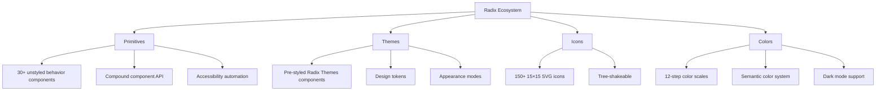
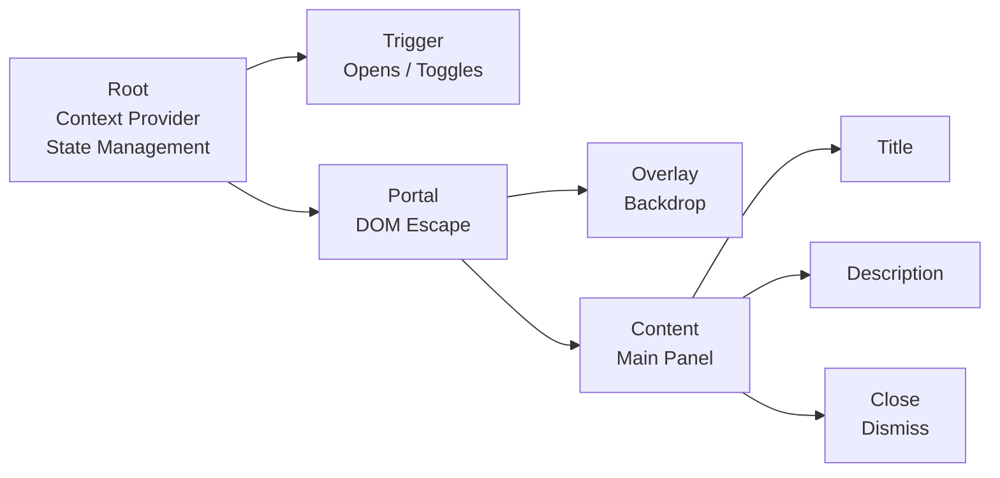
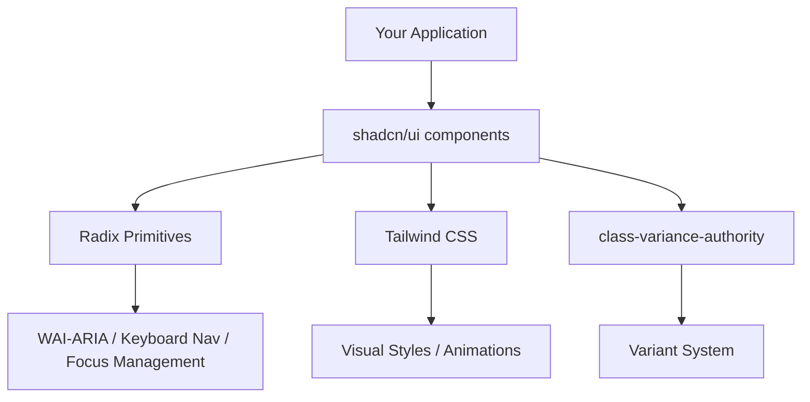
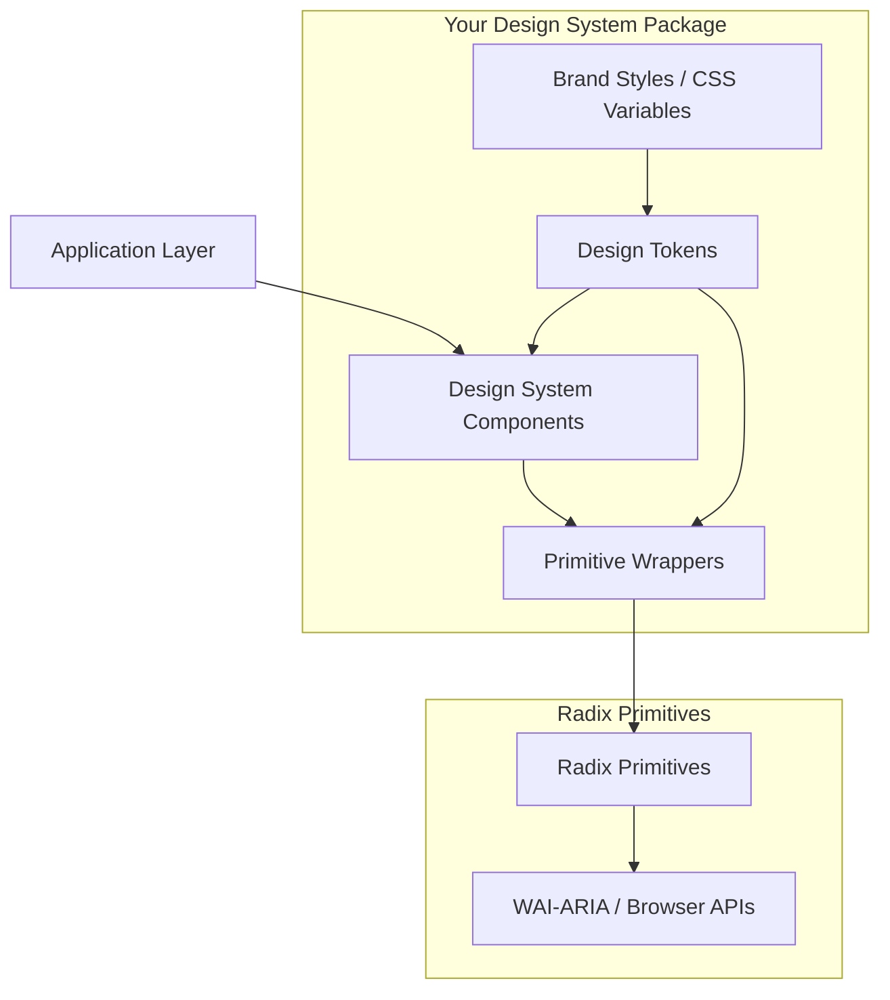

# Radix UI — Complete Production Reference

> **Accuracy labels used throughout this document:**
> - `[Inference]` — logically reasoned from documented behavior, not independently confirmed
> - `[Speculation]` — plausible but unconfirmed
> - `[Unverified]` — no reliable source confirmed
>
> Unmarked statements reflect publicly documented Radix UI behavior as of mid-2025.

---

## Table of Contents

1. [What Is Radix UI](#1-what-is-radix-ui)
2. [Radix Ecosystem Overview](#2-radix-ecosystem-overview)
3. [Core Architecture](#3-core-architecture)
4. [Accessibility Foundations](#4-accessibility-foundations)
5. [Installation and Setup](#5-installation-and-setup)
6. [Every Radix Primitive](#6-every-radix-primitive)
7. [Data Attributes](#7-data-attributes)
8. [Styling Strategies](#8-styling-strategies)
9. [Radix + Tailwind](#9-radix--tailwind)
10. [Radix + shadcn/ui](#10-radix--shadcnui)
11. [Advanced Composition Patterns](#11-advanced-composition-patterns)
12. [State Management Integration](#12-state-management-integration)
13. [Forms](#13-forms)
14. [Animations](#14-animations)
15. [Next.js Production Usage](#15-nextjs-production-usage)
16. [Performance Optimization](#16-performance-optimization)
17. [Design System Architecture](#17-design-system-architecture)
18. [Testing](#18-testing)
19. [Common Production Patterns](#19-common-production-patterns)
20. [Common Mistakes](#20-common-mistakes)
21. [Migration Guides](#21-migration-guides)
22. [Interview Questions](#22-interview-questions)
23. [Best Practices Checklist](#23-best-practices-checklist)
24. [Radix UI Cheat Sheet](#24-radix-ui-cheat-sheet)
25. [Learning Path](#25-learning-path)

---

## 1. What Is Radix UI

### History and Origin

Radix UI is an open-source UI primitive library for React, originally created by the team at **WorkOS** (a company building developer tools for enterprise authentication). The project began as an internal effort to solve a recurring problem: building accessible, behavior-rich UI components from scratch for every product is expensive, error-prone, and mostly undifferentiated work.

The Primitives library was publicly released and grew rapidly in adoption after the rise of **shadcn/ui** in 2023, which used Radix Primitives as its accessibility and behavior foundation while providing opinionated Tailwind-styled components on top. Today Radix is maintained by the WorkOS team and is among the most widely adopted headless UI libraries in the React ecosystem.

### Philosophy

Radix's core philosophy rests on three tenets:

1. **Accessibility-first.** Every component ships with correct WAI-ARIA roles, keyboard navigation, focus management, and screen reader support built in. The developer should not need to think about ARIA unless they are doing something unusual.

2. **Unstyled by default.** Components ship with zero visual styles. They render semantic HTML with only the minimum structure needed for the behavior to work. All visual decisions are the developer's responsibility.

3. **Composable and open.** Every component exposes its internal parts. You can wrap, extend, and rewire any part of any component. Nothing is sealed.

### The Headless UI Concept

**Headless UI** refers to component libraries that provide behavior, accessibility, and state management without shipping any CSS or visual opinions. The term contrasts with **fully styled libraries** (MUI, Ant Design, Mantine) which provide both behavior and a default visual appearance.

The distinction matters because:

| Dimension | Headless (Radix) | Styled (MUI, Ant Design) |
|---|---|---|
| Visual defaults | None | Yes — opinionated design system |
| Customization effort | Full control, from scratch | Override a predefined system |
| Bundle size | Small per component | Larger — CSS included |
| Design system fit | Adapts to any design | Works best within its own system |
| Accessibility | Built in | Built in |
| Learning curve | Higher initially | Lower for quick UIs |

With a headless library, you decide 100% of how your UI looks. The library handles the hard parts: keyboard navigation, ARIA attributes, focus trapping, dismissal behaviors, portal rendering, scroll locking, and state synchronization.

### Problems Radix Solves

Web platform native controls (the `<select>`, `<dialog>`, `<details>`) are either not customizable enough or inconsistent across browsers. Developers who want custom, accessible UI must implement:

- Keyboard navigation following ARIA authoring practices
- Focus trapping inside modals
- Correct ARIA roles, states, and properties
- Portal rendering to avoid overflow/z-index stacking context issues
- Scroll locking when overlays are open
- RTL (right-to-left) language support
- Pointer device vs keyboard interaction differentiation
- Composable compound component APIs

Building all of this correctly for even a single Dialog or Dropdown is a multi-day task. Building and maintaining it across an entire design system takes months. Radix provides this infrastructure free.

### Comparison: Radix vs Traditional Component Libraries

```
Traditional library (MUI):
  You get: Behavior + Accessibility + Default styles + Design tokens
  You override: CSS, themes, variant definitions
  Pain point: Fighting the default styles; large bundles; CSS specificity

Headless library (Radix):
  You get: Behavior + Accessibility + Minimal DOM structure
  You add: All CSS, all visual decisions
  Pain point: Must build every visual layer yourself
  Benefit: Complete design freedom, small bundles
```

### Composition Model

Radix components follow the **Compound Component** pattern. Each component is a family of sub-components that compose together:

```tsx
// Not a single component with many props:
<Dialog title="Confirm" open={true} onClose={close} footer={<Button>OK</Button>} />

// Instead, composable parts:
<Dialog.Root open={open} onOpenChange={setOpen}>
  <Dialog.Trigger asChild>
    <Button>Open</Button>
  </Dialog.Trigger>
  <Dialog.Portal>
    <Dialog.Overlay />
    <Dialog.Content>
      <Dialog.Title>Confirm</Dialog.Title>
      <Dialog.Description>Are you sure?</Dialog.Description>
      <Dialog.Close asChild>
        <Button>OK</Button>
      </Dialog.Close>
    </Dialog.Content>
  </Dialog.Portal>
</Dialog.Root>
```

This is more verbose but gives granular control over every part. You can place, style, and wrap each sub-component independently.

---

## 2. Radix Ecosystem Overview

Radix is a family of related projects, not a single library.



### Primitives

The core library. Individual, independently versioned `@radix-ui/react-*` packages, or the monolithic `radix-ui` package introduced in 2024 that re-exports all primitives from a single entry point.

Each primitive is a family of composable React components that implement a specific UI pattern with full accessibility.

**Install individually:**
```bash
npm install @radix-ui/react-dialog
npm install @radix-ui/react-dropdown-menu
```

**Install unified package (recommended for new projects):**
```bash
npm install radix-ui
```

**Import from unified package:**
```tsx
import { Dialog, DropdownMenu, Tooltip } from 'radix-ui';
```

**Import from individual packages (legacy, still supported):**
```tsx
import * as Dialog from '@radix-ui/react-dialog';
```

### Themes

**Radix Themes** (`@radix-ui/themes`) is a separate, opinionated styled component library built on top of Primitives. Unlike Primitives, Themes ships with a complete visual design system — colors, typography, spacing, and component styles.

Themes is for teams who want a polished default UI quickly. Primitives is for teams building their own design system.

```bash
npm install @radix-ui/themes
```

```tsx
import { Theme, Button, Dialog } from '@radix-ui/themes';
import '@radix-ui/themes/styles.css';

function App() {
  return (
    <Theme appearance="light" accentColor="blue" radius="medium">
      <Button>Click me</Button>
    </Theme>
  );
}
```

**Key Themes concepts:**

- `<Theme>` wrapper sets global tokens
- `appearance` prop: `"light"` | `"dark"` | `"inherit"`
- `accentColor`: one of the Radix color scales
- `grayColor`: neutral color scale
- `radius`: `"none"` | `"small"` | `"medium"` | `"large"` | `"full"`
- `scaling`: `"90%"` | `"95%"` | `"100%"` | `"105%"` | `"110%"`

### Icons

**Radix Icons** (`@radix-ui/react-icons`) provides 150+ crisp, consistent SVG icons at 15×15px, designed by the WorkOS team. Each icon is a React component.

```bash
npm install @radix-ui/react-icons
```

```tsx
import { MagnifyingGlassIcon, Cross2Icon, CheckIcon } from '@radix-ui/react-icons';

function SearchBar() {
  return (
    <div>
      <MagnifyingGlassIcon />
      <input type="text" />
    </div>
  );
}
```

Icons are tree-shaken automatically because each is a named export. Only imported icons are included in the bundle. Icons accept standard SVG props including `width`, `height`, `color`, and `className`.

### Colors

**Radix Colors** (`@radix-ui/colors`) provides a semantic, mathematically consistent color system. Each color comes in a 12-step scale, plus an alpha variant for transparent overlays.

```bash
npm install @radix-ui/colors
```

**The 12-step scale semantics:**

| Step | Intended Use |
|---|---|
| 1 | App background |
| 2 | Subtle background |
| 3 | UI element background |
| 4 | Hovered UI element background |
| 5 | Active / selected UI element background |
| 6 | Subtle borders and separators |
| 7 | UI element border and focus rings |
| 8 | Hovered UI element border |
| 9 | Solid backgrounds (badges, buttons) |
| 10 | Hovered solid backgrounds |
| 11 | Low-contrast text |
| 12 | High-contrast text |

Every color also ships with a P3 wide-gamut variant and an alpha variant. The scale is designed so that step 9 meets WCAG AA contrast on white, and step 11 meets AA for text on step 1/2 backgrounds.

```tsx
import { blue, blueDark } from '@radix-ui/colors';

// Use in CSS-in-JS:
const styles = {
  background: blue.blue3,
  borderColor: blue.blue7,
  color: blue.blue11,
};
```

**As CSS custom properties:**
```css
/* @radix-ui/colors provides CSS files */
@import '@radix-ui/colors/blue.css';
@import '@radix-ui/colors/blue-dark.css';
@import '@radix-ui/colors/blue-alpha.css';

.button {
  background-color: var(--blue-9);
  color: var(--blue-12);
}
```

**Accessibility consideration:** The Radix color scales are designed so that contrast ratios follow predictable patterns. However, always verify contrast with an actual WCAG checker for your specific combination — the scale semantics are a guide, not a guarantee of compliance for every possible combination.

---

## 3. Core Architecture

Understanding Radix's architectural patterns is essential to using it correctly. These patterns repeat across every primitive.

### Root Components

Every primitive has a `Root` component that establishes context and manages shared state.

```tsx
<Accordion.Root type="single" collapsible>
  {/* All children share accordion state via context */}
</Accordion.Root>
```

The Root is always the outermost container. It never renders a visible element in most components (or renders a minimal semantic container). Its job is state management and context provision.

### Compound Components

Radix uses compound components: a pattern where a group of components share implicit state through React Context rather than explicit prop drilling.

```tsx
// The Tabs components share state without explicit prop threading:
<Tabs.Root defaultValue="tab1">
  <Tabs.List>
    <Tabs.Trigger value="tab1">Tab 1</Tabs.Trigger>
    <Tabs.Trigger value="tab2">Tab 2</Tabs.Trigger>
  </Tabs.List>
  <Tabs.Content value="tab1">Content 1</Tabs.Content>
  <Tabs.Content value="tab2">Content 2</Tabs.Content>
</Tabs.Root>
```

Each sub-component reads from and writes to the shared Root context. You never pass `activeTab` down manually.

### Slots

The `Slot` utility (`@radix-ui/react-slot`, also available as `Slot` from `radix-ui`) merges its props onto its single child, effectively "replacing" itself with the child while forwarding all props.

```tsx
import { Slot } from 'radix-ui';

function MyButton({ asChild, ...props }: { asChild?: boolean } & React.ButtonHTMLAttributes<HTMLButtonElement>) {
  const Comp = asChild ? Slot : 'button';
  return <Comp {...props} />;
}

// Renders a <button>:
<MyButton onClick={handleClick}>Click</MyButton>

// Renders an <a> with button props merged:
<MyButton asChild>
  <a href="/dashboard">Dashboard</a>
</MyButton>
```

Slot is the engine behind `asChild`. It performs a shallow merge: event handlers are composed (both the Slot's and the child's run), refs are merged using `composeRefs`, and className strings are concatenated.

**Slot merge rules:**
- `className`: concatenated
- `style`: merged (child wins on conflicts)
- Event handlers: both handlers are called
- `ref`: composed via `composeRefs`
- All other props: child props win

### Context

Radix uses React Context internally for state sharing between compound component parts. This context is private — you don't import or access it directly. The public API is the controlled/uncontrolled props on `Root`.

### Controlled Components

A controlled component is one where you manage the state externally:

```tsx
const [open, setOpen] = React.useState(false);

<Dialog.Root open={open} onOpenChange={setOpen}>
  ...
</Dialog.Root>
```

Use controlled mode when:
- You need to synchronize the component state with other UI
- You need to conditionally prevent state changes
- You are using a state management library

### Uncontrolled Components

An uncontrolled component manages its own state internally:

```tsx
<Dialog.Root defaultOpen={false}>
  ...
</Dialog.Root>
```

Use uncontrolled mode when:
- The component state is local and isolated
- You only need to react to changes (via `onOpenChange`) but don't drive state externally

Radix uses `useControllableState` internally — a hook that supports both patterns with a single API. Components default to uncontrolled.

### The asChild Pattern

`asChild` is Radix's mechanism for changing the rendered element without losing behavior. When `asChild={true}`, the component renders its single child element instead of its default element, merging all props onto the child.

```tsx
// Default: renders a <button>
<Dialog.Trigger>Open</Dialog.Trigger>

// asChild: renders an <a> with all Trigger behavior
<Dialog.Trigger asChild>
  <a href="#">Open</a>
</Dialog.Trigger>

// asChild: renders your custom component
<Dialog.Trigger asChild>
  <MyIconButton icon={<PlusIcon />} />
</Dialog.Trigger>
```

**Critical pitfall:** The child of `asChild` must be a single React element that accepts a `ref`. It must forward refs correctly (`React.forwardRef`). Components that don't forward refs will break `asChild`.

```tsx
// BAD: Component does not forward ref
function BadButton({ children }: { children: React.ReactNode }) {
  return <button>{children}</button>;
}

// GOOD: Component forwards ref
const GoodButton = React.forwardRef<HTMLButtonElement, React.ButtonHTMLAttributes<HTMLButtonElement>>(
  ({ children, ...props }, ref) => <button ref={ref} {...props}>{children}</button>
);
```

### Composition Pattern Architecture



This pattern (Root → Trigger → Portal → Content) repeats across Dialog, Popover, Dropdown, Context Menu, Alert Dialog, and Hover Card.

---

## 4. Accessibility Foundations

### WAI-ARIA Overview

The **Web Accessibility Initiative — Accessible Rich Internet Applications** (WAI-ARIA) specification defines a set of roles, states, and properties that can be added to HTML elements to make them accessible to assistive technologies like screen readers.

Radix implements ARIA according to the **ARIA Authoring Practices Guide (APG)**, which describes keyboard interactions and ARIA patterns for common UI widgets.

**Three pillars of ARIA:**

| Pillar | Examples |
|---|---|
| Roles | `role="dialog"`, `role="menu"`, `role="tab"`, `role="combobox"` |
| States | `aria-expanded`, `aria-checked`, `aria-disabled`, `aria-selected` |
| Properties | `aria-label`, `aria-labelledby`, `aria-describedby`, `aria-haspopup` |

### Keyboard Navigation

Radix automates keyboard navigation according to APG patterns. The following patterns are implemented automatically:

| Component | Keyboard Pattern |
|---|---|
| Accordion | `↑` `↓` navigate items; `Space`/`Enter` toggles |
| Menu / Dropdown | `↑` `↓` navigate items; `Enter`/`Space` activates; `Esc` closes; `Tab` moves out |
| Tabs | `←` `→` navigate tabs; `Home`/`End` jump to first/last |
| Dialog | `Esc` closes; focus trapped inside; `Tab`/`Shift+Tab` cycle focusable elements |
| Select | `↑` `↓` navigate options; `Enter` selects; `Esc` closes; type-ahead |
| Slider | `←` `→` `↑` `↓` change value; `Home`/`End` jump to min/max |
| Checkbox | `Space` toggles |
| Radio Group | `↑` `↓` `←` `→` navigate; first radio in group is in tab order |
| Menubar | `←` `→` navigate menus; `↓` opens menu; `Esc` closes |

### Focus Management

**Focus management** is one of the hardest accessibility problems. Radix handles:

1. **Initial focus when opening:** Dialogs, popovers, and sheets move focus to the first focusable element (or a designated focus target) on open.
2. **Return focus on close:** When a Dialog closes, focus returns to the element that triggered it (the Trigger).
3. **Focus trapping:** Inside Dialog and Alert Dialog, `Tab` and `Shift+Tab` cycle only within the component — focus cannot escape to the page behind.

**Controlling initial focus:**

```tsx
<Dialog.Content
  onOpenAutoFocus={(event) => {
    // Prevent default (first focusable element)
    event.preventDefault();
    // Focus a specific element
    specificInputRef.current?.focus();
  }}
>
```

**Controlling focus on close:**

```tsx
<Dialog.Content
  onCloseAutoFocus={(event) => {
    event.preventDefault();
    triggerRef.current?.focus();
  }}
>
```

### Focus Trapping

Radix uses the `focus-trap` technique internally (via the `@radix-ui/react-focus-scope` package). When a Dialog is open, a FocusScope wraps the content and intercepts keyboard Tab events to keep focus cycling within the scope.

The implementation handles:
- `Tab`: advance to next focusable element, wrap to first
- `Shift+Tab`: go to previous, wrap to last
- `Esc`: triggers dismiss (on Dialog/Popover)

### Screen Reader Support

Radix adds ARIA attributes that screen readers use to announce:
- Component identity (role)
- Current state (expanded, selected, checked, disabled)
- Relationships (labelledby, describedby, controls)

**What Radix adds automatically:**

```html
<!-- Dialog.Root open={true} -->
<div role="dialog" aria-modal="true" aria-labelledby="dialog-title" aria-describedby="dialog-desc">
  <h2 id="dialog-title">Confirm Delete</h2>
  <p id="dialog-desc">This action cannot be undone.</p>
</div>

<!-- Checkbox checked -->
<button role="checkbox" aria-checked="true" data-state="checked">
```

### What Developers Must Handle Manually

Radix automates the vast majority of ARIA but some responsibilities remain with developers:

1. **Provide meaningful labels.** Use `Dialog.Title` and `Dialog.Description`. If you omit `Dialog.Title`, the dialog has no accessible name — this is an error.

2. **Use `Label` with form controls.** Always associate `Label` with `Checkbox`, `Select`, `Slider`, etc.

3. **`aria-label` for icon-only buttons.** If a `Trigger` renders only an icon, add `aria-label`.

4. **Live regions for dynamic content.** Toasts and notifications should use `role="status"` or `role="alert"` (Radix Toast handles this, but custom notification systems must do this manually).

5. **Color contrast.** Radix provides no visual styles, so contrast compliance is entirely your responsibility.

6. **Meaningful link/button text.** The text content of interactive elements must be descriptive.

---

## 5. Installation and Setup

### React (Vite)

```bash
npm create vite@latest my-app -- --template react-ts
cd my-app
npm install radix-ui
```

**Usage:**
```tsx
// src/components/MyDialog.tsx
import { Dialog } from 'radix-ui';

export function MyDialog() {
  return (
    <Dialog.Root>
      <Dialog.Trigger>Open</Dialog.Trigger>
      <Dialog.Portal>
        <Dialog.Overlay className="dialog-overlay" />
        <Dialog.Content className="dialog-content">
          <Dialog.Title>Hello</Dialog.Title>
          <Dialog.Close>Close</Dialog.Close>
        </Dialog.Content>
      </Dialog.Portal>
    </Dialog.Root>
  );
}
```

### Next.js (App Router)

SSR considerations are important. Radix components that use portals, scroll locking, or `window`/`document` must be Client Components.

```bash
npx create-next-app@latest my-app --typescript
cd my-app
npm install radix-ui
```

**Mark interactive Radix components as Client Components:**

```tsx
// components/UserMenu.tsx
'use client';

import { DropdownMenu } from 'radix-ui';

export function UserMenu() {
  return (
    <DropdownMenu.Root>
      <DropdownMenu.Trigger>Account</DropdownMenu.Trigger>
      <DropdownMenu.Portal>
        <DropdownMenu.Content>
          <DropdownMenu.Item>Profile</DropdownMenu.Item>
          <DropdownMenu.Item>Logout</DropdownMenu.Item>
        </DropdownMenu.Content>
      </DropdownMenu.Portal>
    </DropdownMenu.Root>
  );
}
```

**Server Components can safely render non-interactive primitives** like `Separator`, `AspectRatio`, and structural wrappers. Any component using state or browser APIs needs `'use client'`.

**Hydration note:** Radix components render correctly on the server when used as Client Components. The Portal renders into `document.body` client-side only; on the server, Portal content is not rendered, which is expected behavior. This means Portal content will not be included in SSR output — for SEO-critical content, avoid placing it inside a Portal.

### Monorepo Setup

In a monorepo (Turborepo, Nx, etc.), install Radix in the shared UI package:

```bash
# packages/ui/package.json
npm install radix-ui
```

Ensure your build tool resolves `radix-ui` only once. Duplicate React instances cause context failures. In your bundler config:

```ts
// vite.config.ts (consuming app)
export default defineConfig({
  resolve: {
    dedupe: ['react', 'react-dom', 'radix-ui'],
  },
});
```

### TypeScript

Radix Primitives are fully typed. The unified `radix-ui` package re-exports all component types. For individual packages:

```tsx
import type * as DialogPrimitive from '@radix-ui/react-dialog';

// Component ref typing:
const contentRef = React.useRef<React.ElementRef<typeof DialogPrimitive.Content>>(null);

// Props typing:
type DialogContentProps = React.ComponentPropsWithoutRef<typeof DialogPrimitive.Content>;
```

**Extending primitive props — the canonical pattern:**

```tsx
import { Dialog } from 'radix-ui';
import React from 'react';

type DialogContentProps = React.ComponentPropsWithoutRef<typeof Dialog.Content> & {
  showCloseButton?: boolean;
};

const DialogContent = React.forwardRef<
  React.ElementRef<typeof Dialog.Content>,
  DialogContentProps
>(({ showCloseButton = true, children, ...props }, ref) => (
  <Dialog.Portal>
    <Dialog.Overlay />
    <Dialog.Content ref={ref} {...props}>
      {children}
      {showCloseButton && <Dialog.Close>✕</Dialog.Close>}
    </Dialog.Content>
  </Dialog.Portal>
));
DialogContent.displayName = Dialog.Content.displayName;
```

### Tree-Shaking

When using individual packages (`@radix-ui/react-dialog`), only the Dialog component is included in your bundle.

When using the unified `radix-ui` package, tree-shaking works at the named export level — only imported components are bundled. Modern bundlers (Vite, webpack 5, Rollup) handle this automatically.

**Verify tree-shaking with bundle analyzer:**
```bash
npm install --save-dev rollup-plugin-visualizer
# or
npm install --save-dev webpack-bundle-analyzer
```

### SSR Considerations

Radix components that use the following features require browser APIs and must not render on the server without guards:

- `Portal` — uses `document.body`
- `ScrollArea` — measures DOM elements
- `Tooltip` — uses `ResizeObserver` [Inference: based on common pattern for position calculation]

The unified `'use client'` directive on the component file handles this for Next.js App Router.

For Remix, use `ClientOnly` patterns from `remix-utils` for components that access browser APIs.

---

## 6. Every Radix Primitive

### 6.1 Accordion

**Purpose:** A vertically stacked list of interactive headings, each revealing a section of content when activated.

**Mental model:** A list of toggle panels. Only the behavior and accessibility are provided — not the visual appearance of the chevron, animation, or color.

**Accessibility:** Follows the [APG Accordion Pattern](https://www.w3.org/WAI/ARIA/apg/patterns/accordion/). Each trigger has `role="button"`, `aria-expanded`, and `aria-controls` pointing to its panel.

**Anatomy:**
```
Accordion.Root
└── Accordion.Item (repeated)
    ├── Accordion.Header
    │   └── Accordion.Trigger
    └── Accordion.Content
```

**Key Props — Root:**
| Prop | Type | Description |
|---|---|---|
| `type` | `"single"` \| `"multiple"` | Whether one or multiple items can be open |
| `value` | `string` \| `string[]` | Controlled open item(s) |
| `defaultValue` | `string` \| `string[]` | Uncontrolled initial open item(s) |
| `onValueChange` | `(value) => void` | Called when open items change |
| `collapsible` | `boolean` | (type="single") Allow closing the open item |
| `disabled` | `boolean` | Disable all items |
| `orientation` | `"vertical"` \| `"horizontal"` | Affects keyboard nav |
| `dir` | `"ltr"` \| `"rtl"` | Text direction |

**Key Props — Item:**
| Prop | Type | Description |
|---|---|---|
| `value` | `string` | Unique identifier (required) |
| `disabled` | `boolean` | Disable this item |

**Data Attributes:**
- `[data-state="open"]` / `[data-state="closed"]` — on Item, Trigger, Content
- `[data-disabled]` — on Trigger and Content when disabled
- `[data-orientation="vertical"]` — on Root

**CSS hooks:**
```css
/* Animate open/close */
.accordion-content {
  overflow: hidden;
}
.accordion-content[data-state="open"] {
  animation: slideDown 200ms ease-out;
}
.accordion-content[data-state="closed"] {
  animation: slideUp 200ms ease-out;
}

@keyframes slideDown {
  from { height: 0; }
  to { height: var(--radix-accordion-content-height); }
}
@keyframes slideUp {
  from { height: var(--radix-accordion-content-height); }
  to { height: 0; }
}
```

**Important:** Radix exposes `--radix-accordion-content-height` as a CSS custom property, enabling smooth height animations without JavaScript.

**TypeScript Example:**
```tsx
import { Accordion } from 'radix-ui';

interface AccordionItem {
  value: string;
  trigger: string;
  content: React.ReactNode;
}

function FAQAccordion({ items }: { items: AccordionItem[] }) {
  const [openItems, setOpenItems] = React.useState<string[]>([]);

  return (
    <Accordion.Root
      type="multiple"
      value={openItems}
      onValueChange={setOpenItems}
      className="faq-accordion"
    >
      {items.map((item) => (
        <Accordion.Item key={item.value} value={item.value} className="faq-item">
          <Accordion.Header>
            <Accordion.Trigger className="faq-trigger">
              {item.trigger}
              <ChevronDownIcon aria-hidden className="faq-chevron" />
            </Accordion.Trigger>
          </Accordion.Header>
          <Accordion.Content className="faq-content">
            <div className="faq-content-inner">{item.content}</div>
          </Accordion.Content>
        </Accordion.Item>
      ))}
    </Accordion.Root>
  );
}
```

**Common Mistakes:**
- Forgetting to wrap Trigger in Header — Radix requires this for correct heading semantics
- Using `type="single"` without `collapsible` when you expect the panel to close on re-click
- Not animating using the `--radix-accordion-content-height` variable, resulting in jarring height jumps

---

### 6.2 Alert Dialog

**Purpose:** A modal dialog for destructive or critical actions that requires explicit user confirmation before proceeding. Unlike Dialog, it cannot be dismissed by clicking the overlay or pressing Escape.

**Mental model:** A blocking confirmation gate. Use for "Delete account?", "Discard changes?", "Permanently remove?".

**Accessibility:** Follows [APG Alert Dialog Pattern](https://www.w3.org/WAI/ARIA/apg/patterns/alertdialog/). Renders with `role="alertdialog"`. Focus moves to the Cancel/Action button (not the first focusable element) to prevent accidental confirmation.

**Anatomy:**
```
AlertDialog.Root
├── AlertDialog.Trigger
└── AlertDialog.Portal
    ├── AlertDialog.Overlay
    └── AlertDialog.Content
        ├── AlertDialog.Title
        ├── AlertDialog.Description
        ├── AlertDialog.Cancel   ← focus lands here on open
        └── AlertDialog.Action
```

**Key Behavioral Differences from Dialog:**
| Behavior | Dialog | Alert Dialog |
|---|---|---|
| Overlay click dismisses | Yes | No |
| Escape key dismisses | Yes | No |
| Initial focus | First focusable | Cancel button |
| ARIA role | `dialog` | `alertdialog` |

**TypeScript Example:**
```tsx
import { AlertDialog, Button } from 'radix-ui';

function DeleteConfirmation({
  onConfirm,
  itemName,
}: {
  onConfirm: () => void;
  itemName: string;
}) {
  return (
    <AlertDialog.Root>
      <AlertDialog.Trigger asChild>
        <Button variant="destructive">Delete {itemName}</Button>
      </AlertDialog.Trigger>
      <AlertDialog.Portal>
        <AlertDialog.Overlay className="overlay" />
        <AlertDialog.Content className="alert-content">
          <AlertDialog.Title>Delete {itemName}?</AlertDialog.Title>
          <AlertDialog.Description>
            This action is permanent and cannot be undone.
          </AlertDialog.Description>
          <div className="alert-actions">
            <AlertDialog.Cancel asChild>
              <Button variant="secondary">Cancel</Button>
            </AlertDialog.Cancel>
            <AlertDialog.Action asChild>
              <Button variant="destructive" onClick={onConfirm}>
                Yes, delete
              </Button>
            </AlertDialog.Action>
          </div>
        </AlertDialog.Content>
      </AlertDialog.Portal>
    </AlertDialog.Root>
  );
}
```

---

### 6.3 Aspect Ratio

**Purpose:** Maintains a consistent width-to-height ratio for its child content regardless of available width.

**Mental model:** A responsive container that enforces proportional dimensions.

**Anatomy:**
```
AspectRatio.Root
└── (child content)
```

**Key Props:**
| Prop | Type | Default | Description |
|---|---|---|---|
| `ratio` | `number` | `1` | Width divided by height (e.g., 16/9, 4/3, 1) |

**TypeScript Example:**
```tsx
import { AspectRatio } from 'radix-ui';

function VideoThumbnail({ src, alt }: { src: string; alt: string }) {
  return (
    <div style={{ width: '320px' }}>
      <AspectRatio.Root ratio={16 / 9}>
        
      </AspectRatio.Root>
    </div>
  );
}
```

**Implementation note:** AspectRatio uses a padding-top trick internally (`padding-top: (1/ratio * 100%)`) combined with absolute positioning of the child.

---

### 6.4 Avatar

**Purpose:** An image element representing a user or entity, with graceful fallback when the image fails to load or is not provided.

**Mental model:** A three-state component: loading → image (if successful) → fallback (if failed or absent).

**Anatomy:**
```
Avatar.Root
├── Avatar.Image
└── Avatar.Fallback
```

**Key Props — Root:**
| Prop | Type | Description |
|---|---|---|
| `delayMs` | `number` | Delay before showing fallback (prevents flash when image loads quickly) |

**Key Props — Image:**
Standard `` props (`src`, `alt`, `onLoadingStatusChange`).

`onLoadingStatusChange`: `(status: "idle" | "loading" | "loaded" | "error") => void`

**Data Attributes:**
- `[data-state="loading"]` / `[data-state="loaded"]` / `[data-state="error"]` on Image

**TypeScript Example:**
```tsx
import { Avatar } from 'radix-ui';

function UserAvatar({
  src,
  name,
  size = 40,
}: {
  src?: string;
  name: string;
  size?: number;
}) {
  const initials = name
    .split(' ')
    .map((n) => n[0])
    .join('')
    .slice(0, 2)
    .toUpperCase();

  return (
    <Avatar.Root
      style={{ width: size, height: size, borderRadius: '50%', overflow: 'hidden' }}
    >
      <Avatar.Image
        src={src}
        alt={name}
        style={{ width: '100%', height: '100%', objectFit: 'cover' }}
      />
      <Avatar.Fallback
        delayMs={600}
        style={{
          display: 'flex',
          alignItems: 'center',
          justifyContent: 'center',
          background: '#e2e8f0',
          fontSize: size * 0.35,
          fontWeight: 600,
        }}
      >
        {initials}
      </Avatar.Fallback>
    </Avatar.Root>
  );
}
```

---

### 6.5 Checkbox

**Purpose:** A binary toggle between checked and unchecked states. Supports an indeterminate state for "select all" patterns.

**Mental model:** A replacement for native `<input type="checkbox">` with custom styling support and consistent behavior.

**Accessibility:** Native keyboard behavior (Space to toggle). When used inside a `<form>`, it renders a hidden `<input type="checkbox">` for native form submission.

**Anatomy:**
```
Checkbox.Root
└── Checkbox.Indicator
```

**Key Props — Root:**
| Prop | Type | Description |
|---|---|---|
| `checked` | `boolean` \| `"indeterminate"` | Controlled state |
| `defaultChecked` | `boolean` | Uncontrolled initial state |
| `onCheckedChange` | `(checked: boolean \| "indeterminate") => void` | Change handler |
| `disabled` | `boolean` | Disable interaction |
| `required` | `boolean` | For form validation |
| `name` | `string` | Form field name |
| `value` | `string` | Form submission value (default: "on") |

**Data Attributes:**
- `[data-state="checked"]` / `[data-state="unchecked"]` / `[data-state="indeterminate"]`
- `[data-disabled]`

**TypeScript Example:**
```tsx
import { Checkbox, Label } from 'radix-ui';

function CheckboxField({
  id,
  label,
  checked,
  onCheckedChange,
}: {
  id: string;
  label: string;
  checked: boolean | 'indeterminate';
  onCheckedChange: (checked: boolean | 'indeterminate') => void;
}) {
  return (
    <div className="checkbox-field">
      <Checkbox.Root
        id={id}
        checked={checked}
        onCheckedChange={onCheckedChange}
        className="checkbox-root"
      >
        <Checkbox.Indicator className="checkbox-indicator">
          {checked === 'indeterminate' ? <DashIcon /> : <CheckIcon />}
        </Checkbox.Indicator>
      </Checkbox.Root>
      <Label.Root htmlFor={id} className="checkbox-label">
        {label}
      </Label.Root>
    </div>
  );
}
```

**Select-all pattern with indeterminate:**
```tsx
function SelectAll({ items, selectedIds, onSelectionChange }: SelectAllProps) {
  const allSelected = items.every((i) => selectedIds.includes(i.id));
  const someSelected = items.some((i) => selectedIds.includes(i.id));
  const checked = allSelected ? true : someSelected ? 'indeterminate' : false;

  const handleChange = () => {
    if (allSelected) {
      onSelectionChange([]);
    } else {
      onSelectionChange(items.map((i) => i.id));
    }
  };

  return (
    <Checkbox.Root checked={checked} onCheckedChange={handleChange}>
      <Checkbox.Indicator>
        {checked === 'indeterminate' ? <DashIcon /> : <CheckIcon />}
      </Checkbox.Indicator>
    </Checkbox.Root>
  );
}
```

---

### 6.6 Collapsible

**Purpose:** A single show/hide panel toggle. Similar to a one-item Accordion but simpler.

**Mental model:** A disclosure widget. Appropriate for settings panels, sidebar sections, "show more" content.

**Anatomy:**
```
Collapsible.Root
├── Collapsible.Trigger
└── Collapsible.Content
```

**Key Props — Root:**
| Prop | Type | Description |
|---|---|---|
| `open` | `boolean` | Controlled open state |
| `defaultOpen` | `boolean` | Uncontrolled initial state |
| `onOpenChange` | `(open: boolean) => void` | Change handler |
| `disabled` | `boolean` | Disable interaction |

**CSS Variable:** `--radix-collapsible-content-height` — same pattern as Accordion for smooth animations.

**Data Attributes:**
- `[data-state="open"]` / `[data-state="closed"]` on Root, Trigger, Content
- `[data-disabled]` on Root and Trigger

**TypeScript Example:**
```tsx
import { Collapsible } from 'radix-ui';

function ExpandableSection({
  title,
  children,
}: {
  title: string;
  children: React.ReactNode;
}) {
  const [open, setOpen] = React.useState(false);

  return (
    <Collapsible.Root open={open} onOpenChange={setOpen} className="section">
      <div className="section-header">
        <h3 className="section-title">{title}</h3>
        <Collapsible.Trigger className="section-toggle" aria-label={open ? 'Collapse' : 'Expand'}>
          <ChevronDownIcon
            style={{ transform: open ? 'rotate(180deg)' : 'none', transition: 'transform 200ms' }}
          />
        </Collapsible.Trigger>
      </div>
      <Collapsible.Content className="section-content">
        <div className="section-content-inner">{children}</div>
      </Collapsible.Content>
    </Collapsible.Root>
  );
}
```

---

### 6.7 Context Menu

**Purpose:** A menu triggered by right-click or long-press, positioned at the pointer location.

**Mental model:** The browser's native right-click context menu, but fully customizable.

**Anatomy:**
```
ContextMenu.Root
├── ContextMenu.Trigger
└── ContextMenu.Portal
    └── ContextMenu.Content
        ├── ContextMenu.Label
        ├── ContextMenu.Item
        ├── ContextMenu.CheckboxItem
        │   └── ContextMenu.ItemIndicator
        ├── ContextMenu.RadioGroup
        │   ├── ContextMenu.RadioItem
        │   │   └── ContextMenu.ItemIndicator
        ├── ContextMenu.Sub
        │   ├── ContextMenu.SubTrigger
        │   └── ContextMenu.SubContent
        └── ContextMenu.Separator
```

**Key Props — Item:**
| Prop | Type | Description |
|---|---|---|
| `onSelect` | `(event: Event) => void` | Called on item selection |
| `disabled` | `boolean` | Disable item |
| `textValue` | `string` | Text for type-ahead |

**TypeScript Example:**
```tsx
import { ContextMenu } from 'radix-ui';

function FileItem({ file, onRename, onDelete, onCopy }: FileItemProps) {
  return (
    <ContextMenu.Root>
      <ContextMenu.Trigger className="file-item">
        <FileIcon />
        {file.name}
      </ContextMenu.Trigger>
      <ContextMenu.Portal>
        <ContextMenu.Content className="context-menu">
          <ContextMenu.Item onSelect={onCopy}>Copy</ContextMenu.Item>
          <ContextMenu.Item onSelect={onRename}>Rename</ContextMenu.Item>
          <ContextMenu.Separator />
          <ContextMenu.Item onSelect={onDelete} className="destructive-item">
            Delete
          </ContextMenu.Item>
        </ContextMenu.Content>
      </ContextMenu.Portal>
    </ContextMenu.Root>
  );
}
```

---

### 6.8 Dialog

**Purpose:** An overlay dialog/modal. Can be dismissed by clicking the overlay or pressing Escape (unlike Alert Dialog).

**Mental model:** A general-purpose modal for forms, details, and non-destructive content.

**Anatomy:**
```
Dialog.Root
├── Dialog.Trigger
└── Dialog.Portal
    ├── Dialog.Overlay
    └── Dialog.Content
        ├── Dialog.Title      ← required for accessibility
        ├── Dialog.Description ← optional but recommended
        └── Dialog.Close
```

**Key Props — Root:**
| Prop | Type | Description |
|---|---|---|
| `open` | `boolean` | Controlled state |
| `defaultOpen` | `boolean` | Uncontrolled initial |
| `onOpenChange` | `(open: boolean) => void` | Change handler |
| `modal` | `boolean` | Default `true`. Non-modal allows interaction with page |

**Key Props — Content:**
| Prop | Type | Description |
|---|---|---|
| `onOpenAutoFocus` | `(event: Event) => void` | Override initial focus |
| `onCloseAutoFocus` | `(event: Event) => void` | Override return focus |
| `onEscapeKeyDown` | `(event: KeyboardEvent) => void` | Override Escape behavior |
| `onPointerDownOutside` | `(event: PointerEvent) => void` | Override outside click |
| `onInteractOutside` | `(event: Event) => void` | Override any outside interaction |
| `forceMount` | `boolean` | Always mount content (for animations) |

**TypeScript Example (compound component wrapper):**
```tsx
import { Dialog } from 'radix-ui';
import React from 'react';

interface ModalProps {
  open: boolean;
  onOpenChange: (open: boolean) => void;
  title: string;
  description?: string;
  children: React.ReactNode;
  className?: string;
}

export function Modal({
  open,
  onOpenChange,
  title,
  description,
  children,
  className,
}: ModalProps) {
  return (
    <Dialog.Root open={open} onOpenChange={onOpenChange}>
      <Dialog.Portal>
        <Dialog.Overlay className="modal-overlay" />
        <Dialog.Content className={`modal-content ${className ?? ''}`}>
          <div className="modal-header">
            <Dialog.Title className="modal-title">{title}</Dialog.Title>
            <Dialog.Close className="modal-close" aria-label="Close">
              <Cross2Icon />
            </Dialog.Close>
          </div>
          {description && (
            <Dialog.Description className="modal-description">
              {description}
            </Dialog.Description>
          )}
          <div className="modal-body">{children}</div>
        </Dialog.Content>
      </Dialog.Portal>
    </Dialog.Root>
  );
}
```

**Programmatic Dialog (no Trigger, controlled externally):**
```tsx
// Open/close via external state — no Dialog.Trigger needed
<Dialog.Root open={isOpen} onOpenChange={setIsOpen}>
  <Dialog.Portal>
    <Dialog.Overlay />
    <Dialog.Content>
      <Dialog.Title>Programmatic Modal</Dialog.Title>
    </Dialog.Content>
  </Dialog.Portal>
</Dialog.Root>
```

---

### 6.9 Dropdown Menu

**Purpose:** A menu of actions or links, triggered by a button. Closes on selection.

**Mental model:** The standard "three-dot menu", "file menu", "actions button" pattern.

**Anatomy:**
```
DropdownMenu.Root
├── DropdownMenu.Trigger
└── DropdownMenu.Portal
    └── DropdownMenu.Content
        ├── DropdownMenu.Label
        ├── DropdownMenu.Item
        ├── DropdownMenu.CheckboxItem
        │   └── DropdownMenu.ItemIndicator
        ├── DropdownMenu.RadioGroup
        │   └── DropdownMenu.RadioItem
        │       └── DropdownMenu.ItemIndicator
        ├── DropdownMenu.Sub
        │   ├── DropdownMenu.SubTrigger
        │   └── DropdownMenu.SubContent
        └── DropdownMenu.Separator
```

**Key Props — Content:**
| Prop | Type | Default | Description |
|---|---|---|---|
| `side` | `"top"` \| `"right"` \| `"bottom"` \| `"left"` | `"bottom"` | Preferred position |
| `align` | `"start"` \| `"center"` \| `"end"` | `"center"` | Alignment relative to trigger |
| `sideOffset` | `number` | `0` | Gap between trigger and menu |
| `alignOffset` | `number` | `0` | Alignment offset |
| `avoidCollisions` | `boolean` | `true` | Auto-flip to avoid viewport edge |
| `collisionPadding` | `number` | `0` | Padding from viewport edge |
| `loop` | `boolean` | `false` | Loop keyboard navigation |

**TypeScript Example:**
```tsx
import { DropdownMenu } from 'radix-ui';

function ActionsMenu({ onEdit, onDuplicate, onDelete }: ActionsMenuProps) {
  return (
    <DropdownMenu.Root>
      <DropdownMenu.Trigger asChild>
        <button aria-label="Actions" className="icon-button">
          <DotsHorizontalIcon />
        </button>
      </DropdownMenu.Trigger>
      <DropdownMenu.Portal>
        <DropdownMenu.Content
          className="dropdown-content"
          sideOffset={4}
          align="end"
        >
          <DropdownMenu.Item onSelect={onEdit}>
            <PencilIcon /> Edit
          </DropdownMenu.Item>
          <DropdownMenu.Item onSelect={onDuplicate}>
            <CopyIcon /> Duplicate
          </DropdownMenu.Item>
          <DropdownMenu.Separator />
          <DropdownMenu.Item onSelect={onDelete} className="destructive">
            <TrashIcon /> Delete
          </DropdownMenu.Item>
        </DropdownMenu.Content>
      </DropdownMenu.Portal>
    </DropdownMenu.Root>
  );
}
```

---

### 6.10 Hover Card

**Purpose:** A card that appears on hover over a link or element, providing a preview of linked content without navigating.

**Mental model:** The user info cards on Twitter/X profiles when hovering a @mention.

**Note:** Hover Card is intended for **sighted users with pointer devices only**. It is not triggered by keyboard focus and is not announced to screen readers as interactive. Do not put critical information only in a Hover Card.

**Anatomy:**
```
HoverCard.Root
├── HoverCard.Trigger
└── HoverCard.Portal
    └── HoverCard.Content
        └── HoverCard.Arrow (optional)
```

**Key Props — Root:**
| Prop | Type | Default | Description |
|---|---|---|---|
| `openDelay` | `number` | `700` | Delay in ms before opening |
| `closeDelay` | `number` | `300` | Delay in ms before closing |

**TypeScript Example:**
```tsx
import { HoverCard } from 'radix-ui';

function UserMention({ username, user }: { username: string; user: User }) {
  return (
    <HoverCard.Root openDelay={400} closeDelay={300}>
      <HoverCard.Trigger asChild>
        <a href={`/users/${username}`} className="mention-link">
          @{username}
        </a>
      </HoverCard.Trigger>
      <HoverCard.Portal>
        <HoverCard.Content className="hover-card" sideOffset={8}>
          <div className="user-preview">
            
            <div>
              <strong>{user.name}</strong>
              <p>@{username}</p>
              <p>{user.bio}</p>
            </div>
          </div>
          <HoverCard.Arrow className="hover-card-arrow" />
        </HoverCard.Content>
      </HoverCard.Portal>
    </HoverCard.Root>
  );
}
```

---

### 6.11 Label

**Purpose:** Renders an accessible `<label>` element that correctly associates with a form control.

**Mental model:** A direct replacement for `<label>` that participates in the Radix composition model and automatically prevents text selection on double-click.

**Key Props:**
| Prop | Type | Description |
|---|---|---|
| `htmlFor` | `string` | ID of the associated control |

**TypeScript Example:**
```tsx
import { Label, Checkbox } from 'radix-ui';

function CheckboxWithLabel() {
  return (
    <div className="field">
      <Checkbox.Root id="agree" className="checkbox">
        <Checkbox.Indicator><CheckIcon /></Checkbox.Indicator>
      </Checkbox.Root>
      <Label.Root htmlFor="agree" className="label">
        I agree to the terms
      </Label.Root>
    </div>
  );
}
```

**Best practice:** Always use `Label` with form controls. Radix Select, Slider, and other controls should have an associated Label even when they are visually labeled by adjacent text.

---

### 6.12 Menubar

**Purpose:** A horizontal menu bar, common in desktop-style applications (File, Edit, View menus).

**Mental model:** A row of menu triggers, each opening a dropdown. Similar to the menu bar in desktop applications.

**Anatomy:**
```
Menubar.Root
├── Menubar.Menu (repeated)
│   ├── Menubar.Trigger
│   └── Menubar.Portal
│       └── Menubar.Content
│           ├── Menubar.Item
│           ├── Menubar.Sub
│           │   ├── Menubar.SubTrigger
│           │   └── Menubar.SubContent
│           ├── Menubar.CheckboxItem
│           ├── Menubar.RadioGroup
│           │   └── Menubar.RadioItem
│           └── Menubar.Separator
```

**Keyboard behavior:** `←` `→` navigate between menu triggers; `↓` opens the current trigger's menu; `Esc` closes the open menu.

**TypeScript Example:**
```tsx
import { Menubar } from 'radix-ui';

function AppMenubar() {
  return (
    <Menubar.Root className="menubar">
      <Menubar.Menu>
        <Menubar.Trigger className="menubar-trigger">File</Menubar.Trigger>
        <Menubar.Portal>
          <Menubar.Content className="menubar-content">
            <Menubar.Item onSelect={() => newFile()}>New File <span className="shortcut">⌘N</span></Menubar.Item>
            <Menubar.Item onSelect={() => openFile()}>Open... <span className="shortcut">⌘O</span></Menubar.Item>
            <Menubar.Separator />
            <Menubar.Item onSelect={() => saveFile()}>Save <span className="shortcut">⌘S</span></Menubar.Item>
          </Menubar.Content>
        </Menubar.Portal>
      </Menubar.Menu>
      <Menubar.Menu>
        <Menubar.Trigger className="menubar-trigger">Edit</Menubar.Trigger>
        <Menubar.Portal>
          <Menubar.Content className="menubar-content">
            <Menubar.Item>Undo <span className="shortcut">⌘Z</span></Menubar.Item>
            <Menubar.Item>Redo <span className="shortcut">⇧⌘Z</span></Menubar.Item>
          </Menubar.Content>
        </Menubar.Portal>
      </Menubar.Menu>
    </Menubar.Root>
  );
}
```

---

### 6.13 Navigation Menu

**Purpose:** A navigation link list with support for nested menus and triggered subpanels. Designed for site-wide navigation, not action menus.

**Mental model:** A horizontal nav bar where hovering (or clicking) a link opens a panel with sub-links and rich content. Unlike a Dropdown Menu (which is for actions), Navigation Menu is for navigation.

**Anatomy:**
```
NavigationMenu.Root
├── NavigationMenu.List
│   ├── NavigationMenu.Item (with content)
│   │   ├── NavigationMenu.Trigger
│   │   └── NavigationMenu.Content
│   └── NavigationMenu.Item (link only)
│       └── NavigationMenu.Link
└── NavigationMenu.Viewport
    └── NavigationMenu.Indicator
```

**Key difference from DropdownMenu:** Navigation Menu renders all Content panels into a shared `Viewport` — this enables animated transitions between panels and is better for accessible site navigation.

**TypeScript Example:**
```tsx
import { NavigationMenu } from 'radix-ui';

function SiteNav() {
  return (
    <NavigationMenu.Root className="nav-root">
      <NavigationMenu.List className="nav-list">
        <NavigationMenu.Item>
          <NavigationMenu.Trigger className="nav-trigger">
            Products
          </NavigationMenu.Trigger>
          <NavigationMenu.Content className="nav-content">
            <ul className="nav-grid">
              <li>
                <NavigationMenu.Link href="/products/analytics" className="nav-link">
                  Analytics
                </NavigationMenu.Link>
              </li>
              <li>
                <NavigationMenu.Link href="/products/forms" className="nav-link">
                  Forms
                </NavigationMenu.Link>
              </li>
            </ul>
          </NavigationMenu.Content>
        </NavigationMenu.Item>

        <NavigationMenu.Item>
          <NavigationMenu.Link href="/pricing" className="nav-trigger">
            Pricing
          </NavigationMenu.Link>
        </NavigationMenu.Item>
      </NavigationMenu.List>

      <NavigationMenu.Viewport className="nav-viewport" />
    </NavigationMenu.Root>
  );
}
```

---

### 6.14 Popover

**Purpose:** A floating panel anchored to a trigger element. Used for rich interactive content (forms, pickers, previews) that doesn't block the entire page.

**Mental model:** A non-modal floating widget. Unlike Dialog (which blocks the entire page), Popover allows interaction with the page behind it.

**Anatomy:**
```
Popover.Root
├── Popover.Trigger
├── Popover.Anchor (optional — alternate anchor position)
└── Popover.Portal
    └── Popover.Content
        ├── Popover.Arrow (optional)
        └── Popover.Close
```

**Key Props — Content:**
Same positioning props as Dropdown Menu: `side`, `align`, `sideOffset`, `alignOffset`, `avoidCollisions`.

**TypeScript Example:**
```tsx
import { Popover } from 'radix-ui';

function DatePickerPopover({ value, onChange }: DatePickerProps) {
  return (
    <Popover.Root>
      <Popover.Trigger asChild>
        <button className="date-button">
          <CalendarIcon />
          {value ? format(value, 'MMM d, yyyy') : 'Select date'}
        </button>
      </Popover.Trigger>
      <Popover.Portal>
        <Popover.Content className="popover-content" sideOffset={8} align="start">
          <CalendarWidget value={value} onChange={onChange} />
          <Popover.Arrow className="popover-arrow" />
        </Popover.Content>
      </Popover.Portal>
    </Popover.Root>
  );
}
```

**Using Popover.Anchor for custom positioning:**
```tsx
<Popover.Root>
  <Popover.Anchor className="custom-anchor" />
  <Popover.Trigger>Open</Popover.Trigger>
  <Popover.Portal>
    <Popover.Content>
      {/* Content positioned relative to Anchor, not Trigger */}
    </Popover.Content>
  </Popover.Portal>
</Popover.Root>
```

---

### 6.15 Progress

**Purpose:** Displays progress toward a goal, typically as a filled bar.

**Anatomy:**
```
Progress.Root
└── Progress.Indicator
```

**Key Props — Root:**
| Prop | Type | Description |
|---|---|---|
| `value` | `number \| null` | Progress value (0–max). `null` = indeterminate |
| `max` | `number` | Maximum value (default: 100) |

**Data Attributes:**
- `[data-state="complete"]` / `[data-state="indeterminate"]` / `[data-state="loading"]`
- `[data-value]` — current numeric value
- `[data-max]` — max value

**CSS Variable:** `--radix-progress-indicator-width` — percentage width of the indicator.

**TypeScript Example:**
```tsx
import { Progress } from 'radix-ui';

function UploadProgress({ progress }: { progress: number | null }) {
  return (
    <Progress.Root
      value={progress}
      className="progress-root"
      aria-label="Upload progress"
    >
      <Progress.Indicator
        className="progress-indicator"
        style={{
          transform: progress !== null
            ? `translateX(-${100 - progress}%)`
            : undefined,
          transition: 'transform 200ms ease',
        }}
      />
    </Progress.Root>
  );
}
```

---

### 6.16 Radio Group

**Purpose:** A set of mutually exclusive options where only one can be selected.

**Anatomy:**
```
RadioGroup.Root
└── RadioGroup.Item (repeated)
    └── RadioGroup.Indicator
```

**Key Props — Root:**
| Prop | Type | Description |
|---|---|---|
| `value` | `string` | Controlled selected value |
| `defaultValue` | `string` | Uncontrolled initial value |
| `onValueChange` | `(value: string) => void` | Change handler |
| `orientation` | `"horizontal"` \| `"vertical"` | Affects arrow key nav |
| `loop` | `boolean` | Loop at end of list |
| `required` | `boolean` | Form validation |
| `name` | `string` | Form field name |

**Key Props — Item:**
| Prop | Type | Description |
|---|---|---|
| `value` | `string` | Value for this option (required) |
| `disabled` | `boolean` | Disable this option |

**TypeScript Example:**
```tsx
import { RadioGroup, Label } from 'radix-ui';

interface Option {
  value: string;
  label: string;
  description?: string;
}

function OptionSelector({
  options,
  value,
  onValueChange,
  name,
}: {
  options: Option[];
  value: string;
  onValueChange: (value: string) => void;
  name: string;
}) {
  return (
    <RadioGroup.Root
      value={value}
      onValueChange={onValueChange}
      name={name}
      className="radio-group"
    >
      {options.map((option) => (
        <div key={option.value} className="radio-item-wrapper">
          <RadioGroup.Item
            id={`${name}-${option.value}`}
            value={option.value}
            className="radio-item"
          >
            <RadioGroup.Indicator className="radio-indicator" />
          </RadioGroup.Item>
          <Label.Root htmlFor={`${name}-${option.value}`} className="radio-label">
            <span>{option.label}</span>
            {option.description && (
              <span className="radio-description">{option.description}</span>
            )}
          </Label.Root>
        </div>
      ))}
    </RadioGroup.Root>
  );
}
```

---

### 6.17 Scroll Area

**Purpose:** A custom, cross-browser scrollable container with styled scrollbars. The native scrollbar is hidden; Radix renders custom scrollbar elements.

**Anatomy:**
```
ScrollArea.Root
├── ScrollArea.Viewport
│   └── (scrollable content)
├── ScrollArea.Scrollbar (type="vertical")
│   └── ScrollArea.Thumb
├── ScrollArea.Scrollbar (type="horizontal")
│   └── ScrollArea.Thumb
└── ScrollArea.Corner
```

**Key Props — Root:**
| Prop | Type | Default | Description |
|---|---|---|---|
| `type` | `"auto"` \| `"always"` \| `"scroll"` \| `"hover"` | `"hover"` | When scrollbars are visible |
| `scrollHideDelay` | `number` | `600` | Delay before hiding (type="scroll"/"hover") |
| `dir` | `"ltr"` \| `"rtl"` | — | Text direction |

**Data Attributes (Scrollbar):**
- `[data-state="visible"]` / `[data-state="hidden"]`
- `[data-orientation="vertical"]` / `[data-orientation="horizontal"]`

**TypeScript Example:**
```tsx
import { ScrollArea } from 'radix-ui';

function MessageList({ messages }: { messages: Message[] }) {
  return (
    <ScrollArea.Root className="scroll-area-root" type="hover">
      <ScrollArea.Viewport className="scroll-area-viewport">
        {messages.map((msg) => (
          <div key={msg.id} className="message">{msg.text}</div>
        ))}
      </ScrollArea.Viewport>
      <ScrollArea.Scrollbar
        className="scroll-area-scrollbar"
        orientation="vertical"
      >
        <ScrollArea.Thumb className="scroll-area-thumb" />
      </ScrollArea.Scrollbar>
      <ScrollArea.Corner className="scroll-area-corner" />
    </ScrollArea.Root>
  );
}
```

---

### 6.18 Select

**Purpose:** A styled replacement for `<select>`. Opens a list of options in a floating panel.

**Mental model:** Fully customizable `<select>` with custom option rendering, search, and grouping.

**Anatomy:**
```
Select.Root
├── Select.Trigger
│   ├── Select.Value
│   └── Select.Icon
└── Select.Portal
    └── Select.Content
        ├── Select.ScrollUpButton
        ├── Select.Viewport
        │   ├── Select.Group
        │   │   ├── Select.Label
        │   │   └── Select.Item (repeated)
        │   │       ├── Select.ItemText
        │   │       └── Select.ItemIndicator
        └── Select.ScrollDownButton
```

**Key Props — Root:**
| Prop | Type | Description |
|---|---|---|
| `value` | `string` | Controlled value |
| `defaultValue` | `string` | Uncontrolled initial |
| `onValueChange` | `(value: string) => void` | Change handler |
| `open` | `boolean` | Controlled open |
| `onOpenChange` | `(open: boolean) => void` | Open change handler |
| `name` | `string` | Form field name |
| `required` | `boolean` | Form validation |
| `disabled` | `boolean` | Disable entire select |

**Key Props — Content:**
| Prop | Type | Default | Description |
|---|---|---|---|
| `position` | `"item-aligned"` \| `"popper"` | `"item-aligned"` | Layout mode |

In `item-aligned` mode, the selected item aligns with the trigger (native-style). In `popper` mode, it positions like a Popover (below trigger). `popper` mode is generally easier to style.

**TypeScript Example:**
```tsx
import { Select, Label } from 'radix-ui';

function CountrySelect({
  value,
  onValueChange,
}: {
  value: string;
  onValueChange: (value: string) => void;
}) {
  const countries = [
    { value: 'us', label: 'United States' },
    { value: 'ph', label: 'Philippines' },
    { value: 'gb', label: 'United Kingdom' },
  ];

  return (
    <div>
      <Label.Root htmlFor="country-select">Country</Label.Root>
      <Select.Root value={value} onValueChange={onValueChange}>
        <Select.Trigger id="country-select" className="select-trigger" aria-label="Country">
          <Select.Value placeholder="Select a country" />
          <Select.Icon><ChevronDownIcon /></Select.Icon>
        </Select.Trigger>
        <Select.Portal>
          <Select.Content className="select-content" position="popper" sideOffset={4}>
            <Select.ScrollUpButton><ChevronUpIcon /></Select.ScrollUpButton>
            <Select.Viewport className="select-viewport">
              {countries.map((country) => (
                <Select.Item
                  key={country.value}
                  value={country.value}
                  className="select-item"
                >
                  <Select.ItemText>{country.label}</Select.ItemText>
                  <Select.ItemIndicator className="select-item-indicator">
                    <CheckIcon />
                  </Select.ItemIndicator>
                </Select.Item>
              ))}
            </Select.Viewport>
            <Select.ScrollDownButton><ChevronDownIcon /></Select.ScrollDownButton>
          </Select.Content>
        </Select.Portal>
      </Select.Root>
    </div>
  );
}
```

---

### 6.19 Separator

**Purpose:** A semantic or visual dividing line. Can be decorative or meaningful.

**Key Props:**
| Prop | Type | Default | Description |
|---|---|---|---|
| `orientation` | `"horizontal"` \| `"vertical"` | `"horizontal"` | Direction of the separator |
| `decorative` | `boolean` | `false` | If true, renders `role="none"` (no ARIA meaning) |

```tsx
import { Separator } from 'radix-ui';

// Semantic separator (announces to screen readers)
<Separator.Root />

// Decorative separator (invisible to AT)
<Separator.Root decorative />
```

---

### 6.20 Slider

**Purpose:** An input for selecting a value (or range) from within a given min–max range.

**Mental model:** A replacement for `<input type="range">` with multi-thumb, step, and custom styling support.

**Anatomy:**
```
Slider.Root
├── Slider.Track
│   └── Slider.Range
└── Slider.Thumb (one or more)
```

**Key Props — Root:**
| Prop | Type | Default | Description |
|---|---|---|---|
| `value` | `number[]` | — | Controlled values (array for multi-thumb) |
| `defaultValue` | `number[]` | — | Uncontrolled initial values |
| `onValueChange` | `(value: number[]) => void` | — | Live update |
| `onValueCommit` | `(value: number[]) => void` | — | Fires on pointer up / key up |
| `min` | `number` | `0` | Minimum value |
| `max` | `number` | `100` | Maximum value |
| `step` | `number` | `1` | Increment |
| `orientation` | `"horizontal"` \| `"vertical"` | `"horizontal"` | Direction |
| `inverted` | `boolean` | `false` | Reverse direction |
| `minStepsBetweenThumbs` | `number` | `0` | For range sliders: min gap |

**CSS Variables available on Track:**
`--radix-slider-thumb-transform`

**TypeScript Example (range slider):**
```tsx
import { Slider, Label } from 'radix-ui';

function PriceRangeSlider({
  min,
  max,
  value,
  onValueChange,
}: {
  min: number;
  max: number;
  value: [number, number];
  onValueChange: (value: [number, number]) => void;
}) {
  return (
    <div className="range-slider-container">
      <Label.Root>
        Price: ${value[0]} – ${value[1]}
      </Label.Root>
      <Slider.Root
        min={min}
        max={max}
        step={10}
        value={value}
        onValueChange={(v) => onValueChange(v as [number, number])}
        minStepsBetweenThumbs={1}
        className="slider-root"
        aria-label="Price range"
      >
        <Slider.Track className="slider-track">
          <Slider.Range className="slider-range" />
        </Slider.Track>
        <Slider.Thumb className="slider-thumb" aria-label="Minimum price" />
        <Slider.Thumb className="slider-thumb" aria-label="Maximum price" />
      </Slider.Root>
    </div>
  );
}
```

**Note:** When using multiple thumbs, provide distinct `aria-label` values on each Thumb for screen reader clarity.

---

### 6.21 Slot (Utility)

See [Section 3 — Core Architecture → Slots](#slots) for the full explanation. Slot is the mechanism behind `asChild`.

```tsx
import { Slot } from 'radix-ui';

// Slot merges its props onto its single child:
<Slot onClick={handleClick} className="button">
  <a href="/home">Go Home</a>
</Slot>
// Renders: <a href="/home" onClick={handleClick} className="button">Go Home</a>
```

---

### 6.22 Switch

**Purpose:** A toggle between on and off, visually similar to iOS-style switches. Semantically distinct from Checkbox — Switch represents an immediate action (like turning a setting on/off), while Checkbox represents selection of an option.

**Anatomy:**
```
Switch.Root
└── Switch.Thumb
```

**Key Props — Root:**
Same as Checkbox: `checked`, `defaultChecked`, `onCheckedChange`, `disabled`, `required`, `name`, `value`.

**Data Attributes:**
- `[data-state="checked"]` / `[data-state="unchecked"]`
- `[data-disabled]`

**TypeScript Example:**
```tsx
import { Switch, Label } from 'radix-ui';

function ToggleSetting({
  id,
  label,
  checked,
  onCheckedChange,
}: {
  id: string;
  label: string;
  checked: boolean;
  onCheckedChange: (checked: boolean) => void;
}) {
  return (
    <div className="setting-row">
      <Label.Root htmlFor={id} className="setting-label">
        {label}
      </Label.Root>
      <Switch.Root
        id={id}
        checked={checked}
        onCheckedChange={onCheckedChange}
        className="switch-root"
      >
        <Switch.Thumb className="switch-thumb" />
      </Switch.Root>
    </div>
  );
}
```

---

### 6.23 Tabs

**Purpose:** A tabbed interface where one panel is visible at a time.

**Anatomy:**
```
Tabs.Root
├── Tabs.List
│   └── Tabs.Trigger (repeated)
└── Tabs.Content (repeated)
```

**Key Props — Root:**
| Prop | Type | Default | Description |
|---|---|---|---|
| `value` | `string` | — | Controlled active tab |
| `defaultValue` | `string` | — | Uncontrolled initial tab |
| `onValueChange` | `(value: string) => void` | — | Change handler |
| `orientation` | `"horizontal"` \| `"vertical"` | `"horizontal"` | Affects arrow key nav |
| `activationMode` | `"automatic"` \| `"manual"` | `"automatic"` | `automatic` = focus activates; `manual` = Enter activates |
| `dir` | `"ltr"` \| `"rtl"` | — | Text direction |

**Data Attributes:**
- `[data-state="active"]` / `[data-state="inactive"]` on Trigger
- `[data-orientation]` on Root and List

**TypeScript Example:**
```tsx
import { Tabs } from 'radix-ui';

function SettingsTabs() {
  return (
    <Tabs.Root defaultValue="account" className="tabs-root">
      <Tabs.List className="tabs-list" aria-label="Account settings">
        <Tabs.Trigger value="account" className="tabs-trigger">Account</Tabs.Trigger>
        <Tabs.Trigger value="security" className="tabs-trigger">Security</Tabs.Trigger>
        <Tabs.Trigger value="notifications" className="tabs-trigger">Notifications</Tabs.Trigger>
      </Tabs.List>
      <Tabs.Content value="account" className="tabs-content">
        <AccountSettingsForm />
      </Tabs.Content>
      <Tabs.Content value="security" className="tabs-content">
        <SecuritySettingsForm />
      </Tabs.Content>
      <Tabs.Content value="notifications" className="tabs-content">
        <NotificationSettingsForm />
      </Tabs.Content>
    </Tabs.Root>
  );
}
```

**Manual activation mode** (recommended for complex tabs): Keyboard users navigate with arrow keys but must press Enter/Space to activate, preventing unnecessary re-renders while navigating.

---

### 6.24 Toast

**Purpose:** A brief notification that appears temporarily and disappears automatically.

**Mental model:** A notification system with a global provider, programmatic show/hide, and swipe-to-dismiss on touch.

**Anatomy:**
```
Toast.Provider
└── Toast.Root (programmatically rendered)
    ├── Toast.Title
    ├── Toast.Description
    ├── Toast.Action
    └── Toast.Close
Toast.Viewport
```

**Important architectural note:** `Toast.Provider` and `Toast.Viewport` wrap the app; individual `Toast.Root` elements are rendered programmatically, typically via state.

**TypeScript Example:**
```tsx
import { Toast } from 'radix-ui';
import React from 'react';

// App wrapper:
function App() {
  return (
    <Toast.Provider swipeDirection="right" duration={4000}>
      <MainApp />
      <Toast.Viewport className="toast-viewport" />
    </Toast.Provider>
  );
}

// Toast state hook pattern:
function useToast() {
  const [toasts, setToasts] = React.useState<ToastData[]>([]);

  const show = React.useCallback((data: ToastData) => {
    setToasts((prev) => [...prev, { ...data, id: crypto.randomUUID() }]);
  }, []);

  const dismiss = React.useCallback((id: string) => {
    setToasts((prev) => prev.filter((t) => t.id !== id));
  }, []);

  return { toasts, show, dismiss };
}

// Toast rendering:
function ToastContainer() {
  const { toasts } = useToastStore();

  return (
    <>
      {toasts.map((toast) => (
        <Toast.Root
          key={toast.id}
          open={toast.open}
          onOpenChange={(open) => !open && dismiss(toast.id)}
          className={`toast toast-${toast.variant}`}
          duration={toast.duration}
        >
          <Toast.Title className="toast-title">{toast.title}</Toast.Title>
          {toast.description && (
            <Toast.Description className="toast-description">
              {toast.description}
            </Toast.Description>
          )}
          {toast.action && (
            <Toast.Action className="toast-action" altText={toast.action.altText} asChild>
              <button onClick={toast.action.onClick}>{toast.action.label}</button>
            </Toast.Action>
          )}
          <Toast.Close className="toast-close" aria-label="Dismiss">
            <Cross2Icon />
          </Toast.Close>
        </Toast.Root>
      ))}
    </>
  );
}
```

**`Toast.Action` altText** is required — it provides an accessible text alternative for the action when the toast auto-dismisses before the user can interact.

**Swipe directions:** `"right"` | `"left"` | `"up"` | `"down"` — set on Provider.

---

### 6.25 Toggle

**Purpose:** A button that can be pressed (on) or not pressed (off). A simpler alternative to Checkbox for non-form contexts.

**Key Props:**
| Prop | Type | Description |
|---|---|---|
| `pressed` | `boolean` | Controlled state |
| `defaultPressed` | `boolean` | Uncontrolled initial |
| `onPressedChange` | `(pressed: boolean) => void` | Change handler |
| `disabled` | `boolean` | Disable |

**Data Attributes:**
- `[data-state="on"]` / `[data-state="off"]`
- `[data-disabled]`

```tsx
import { Toggle } from 'radix-ui';

<Toggle.Root className="toggle" aria-label="Bold" pressed={bold} onPressedChange={setBold}>
  <FontBoldIcon />
</Toggle.Root>
```

---

### 6.26 Toggle Group

**Purpose:** A group of Toggle buttons where either single or multiple can be active.

**Anatomy:**
```
ToggleGroup.Root
└── ToggleGroup.Item (repeated)
```

**Key Props — Root:**
| Prop | Type | Description |
|---|---|---|
| `type` | `"single"` \| `"multiple"` | Selection mode |
| `value` | `string` \| `string[]` | Controlled selection |
| `onValueChange` | `(value: string \| string[]) => void` | Change handler |
| `rovingFocus` | `boolean` | Arrow key navigation (default: true) |

**TypeScript Example:**
```tsx
import { ToggleGroup } from 'radix-ui';

function TextAlignmentControl({
  value,
  onValueChange,
}: {
  value: string;
  onValueChange: (value: string) => void;
}) {
  return (
    <ToggleGroup.Root
      type="single"
      value={value}
      onValueChange={onValueChange}
      className="toggle-group"
      aria-label="Text alignment"
    >
      <ToggleGroup.Item value="left" className="toggle-item" aria-label="Left align">
        <AlignLeftIcon />
      </ToggleGroup.Item>
      <ToggleGroup.Item value="center" className="toggle-item" aria-label="Center">
        <AlignCenterIcon />
      </ToggleGroup.Item>
      <ToggleGroup.Item value="right" className="toggle-item" aria-label="Right align">
        <AlignRightIcon />
      </ToggleGroup.Item>
    </ToggleGroup.Root>
  );
}
```

---

### 6.27 Toolbar

**Purpose:** A horizontal container for grouping controls — buttons, toggle groups, dropdowns. Implements the [APG Toolbar Pattern](https://www.w3.org/WAI/ARIA/apg/patterns/toolbar/) for keyboard navigation.

**Mental model:** The toolbar of a rich text editor.

**Anatomy:**
```
Toolbar.Root
├── Toolbar.Button
├── Toolbar.ToggleGroup
│   └── Toolbar.ToggleItem
├── Toolbar.Separator
└── Toolbar.Link
```

**Keyboard behavior:** `←` `→` navigate between toolbar items. `Tab` moves focus out of the toolbar.

**TypeScript Example:**
```tsx
import { Toolbar, ToggleGroup, Separator } from 'radix-ui';

function EditorToolbar() {
  const [textFormat, setTextFormat] = React.useState<string[]>([]);

  return (
    <Toolbar.Root className="editor-toolbar" aria-label="Text formatting">
      <Toolbar.ToggleGroup
        type="multiple"
        value={textFormat}
        onValueChange={setTextFormat}
        aria-label="Text formatting"
      >
        <Toolbar.ToggleItem value="bold" className="toolbar-item" aria-label="Bold">
          <FontBoldIcon />
        </Toolbar.ToggleItem>
        <Toolbar.ToggleItem value="italic" className="toolbar-item" aria-label="Italic">
          <FontItalicIcon />
        </Toolbar.ToggleItem>
      </Toolbar.ToggleGroup>
      <Toolbar.Separator className="toolbar-separator" />
      <Toolbar.Button className="toolbar-item" onClick={insertLink} aria-label="Insert link">
        <Link2Icon />
      </Toolbar.Button>
    </Toolbar.Root>
  );
}
```

---

### 6.28 Tooltip

**Purpose:** A label appearing on hover or focus over an element.

**Mental model:** A `title` attribute replacement — accessible, customizable, with positioning.

**Anatomy:**
```
Tooltip.Provider (wraps app or section)
└── Tooltip.Root
    ├── Tooltip.Trigger
    └── Tooltip.Portal
        └── Tooltip.Content
            └── Tooltip.Arrow (optional)
```

**Key Props — Provider:**
| Prop | Type | Default | Description |
|---|---|---|---|
| `delayDuration` | `number` | `700` | Hover delay before showing |
| `skipDelayDuration` | `number` | `300` | After a tooltip hides, this window has no delay |
| `disableHoverableContent` | `boolean` | `false` | Prevent moving cursor into the tooltip |

**TypeScript Example:**
```tsx
import { Tooltip } from 'radix-ui';

// In root of your app:
function AppRoot({ children }: { children: React.ReactNode }) {
  return (
    <Tooltip.Provider delayDuration={400}>
      {children}
    </Tooltip.Provider>
  );
}

// Usage:
function IconButton({ icon, label, onClick }: IconButtonProps) {
  return (
    <Tooltip.Root>
      <Tooltip.Trigger asChild>
        <button onClick={onClick} aria-label={label} className="icon-button">
          {icon}
        </button>
      </Tooltip.Trigger>
      <Tooltip.Portal>
        <Tooltip.Content className="tooltip-content" sideOffset={4}>
          {label}
          <Tooltip.Arrow className="tooltip-arrow" />
        </Tooltip.Content>
      </Tooltip.Portal>
    </Tooltip.Root>
  );
}
```

**Important:** The `aria-label` on the Trigger should always duplicate the Tooltip's text. Screen reader users do not see the Tooltip — they read the `aria-label`. The Tooltip is for sighted pointer/keyboard users.

---

### 6.29 Form (Preview)

Radix Form is currently in preview/unstable status. It provides accessible form field wrappers with built-in validation state management and ARIA relationships.

**Anatomy:**
```
Form.Root
└── Form.Field
    ├── Form.Label
    ├── Form.Control
    └── Form.Message (validation message)
```

**Note:** As of mid-2025, Radix Form is still stabilizing its API. For production forms, using it with React Hook Form or Formik is the more common pattern.

---

### 6.30 Utilities

#### Portal

Renders its children into `document.body` (or a custom container), escaping any CSS stacking context or overflow hidden.

```tsx
import { Portal } from 'radix-ui';

<Portal.Root container={document.getElementById('modal-root')}>
  <div>Content rendered outside the component tree</div>
</Portal.Root>
```

#### Direction Provider

Sets the text direction for all Radix components within its subtree.

```tsx
import { DirectionProvider } from 'radix-ui';

<DirectionProvider dir="rtl">
  {/* All Radix components within use RTL */}
</DirectionProvider>
```

#### Visually Hidden

Hides content visually but keeps it accessible to screen readers.

```tsx
import { VisuallyHidden } from 'radix-ui';

<button>
  <StarIcon aria-hidden />
  <VisuallyHidden.Root>Add to favorites</VisuallyHidden.Root>
</button>
```

#### Accessible Icon

Wraps an icon and adds accessible labeling. Adds the label for screen readers and marks the icon as `aria-hidden`.

```tsx
import { AccessibleIcon } from 'radix-ui';

<AccessibleIcon.Root label="Close dialog">
  <Cross2Icon />
</AccessibleIcon.Root>
```

---

## 7. Data Attributes

Radix uses HTML data attributes as CSS hooks for component state. This is the primary mechanism for state-based styling.

### Core Data Attributes

| Attribute | Values | Components |
|---|---|---|
| `data-state` | component-specific (see below) | Most components |
| `data-orientation` | `"horizontal"` \| `"vertical"` | Accordion, Separator, Slider, Tabs, Toolbar |
| `data-side` | `"top"` \| `"right"` \| `"bottom"` \| `"left"` | Popover, Tooltip, DropdownMenu Content |
| `data-align` | `"start"` \| `"center"` \| `"end"` | Popover, Tooltip, DropdownMenu Content |
| `data-disabled` | present when disabled | All interactive components |
| `data-highlighted` | present when highlighted | Menu items |
| `data-placeholder` | present when no value selected | Select.Value |
| `data-radix-popper-content-wrapper` | — | On the portal wrapper div |
| `data-radix-focus-guard` | — | On focus trap sentinel elements |

### data-state Values by Component

| Component | data-state Values |
|---|---|
| Accordion Item | `"open"` \| `"closed"` |
| Alert Dialog / Dialog | `"open"` \| `"closed"` |
| Checkbox | `"checked"` \| `"unchecked"` \| `"indeterminate"` |
| Collapsible | `"open"` \| `"closed"` |
| Context / Dropdown / Navigation Menu | `"open"` \| `"closed"` |
| Popover / Hover Card | `"open"` \| `"closed"` |
| Progress | `"loading"` \| `"complete"` \| `"indeterminate"` |
| Radio Group Item | `"checked"` \| `"unchecked"` |
| Switch | `"checked"` \| `"unchecked"` |
| Tabs Trigger | `"active"` \| `"inactive"` |
| Toggle | `"on"` \| `"off"` |
| Tooltip | `"delayed-open"` \| `"instant-open"` \| `"closed"` |

### CSS Targeting Strategies

**Basic state styling:**
```css
/* Toggle button appearance */
.toggle-button[data-state="on"] {
  background-color: var(--accent);
  color: white;
}
.toggle-button[data-state="off"] {
  background-color: transparent;
}
```

**Disabled styling:**
```css
.button[data-disabled] {
  opacity: 0.5;
  cursor: not-allowed;
  pointer-events: none;
}
```

**Positioning-aware styling:**
```css
/* Add different border-radius based on which side the popover appears */
.popover-content[data-side="top"] {
  border-radius: 8px 8px 0 8px;
}
.popover-content[data-side="bottom"] {
  border-radius: 0 8px 8px 8px;
}
```

**Orientation-aware styling:**
```css
.separator[data-orientation="horizontal"] {
  height: 1px;
  width: 100%;
  margin: 8px 0;
}
.separator[data-orientation="vertical"] {
  width: 1px;
  height: 100%;
  margin: 0 8px;
}
```

**Animations keyed to state:**
```css
/* Entry/exit animations for overlays */
.overlay {
  animation-duration: 150ms;
}
.overlay[data-state="open"] {
  animation-name: fadeIn;
}
.overlay[data-state="closed"] {
  animation-name: fadeOut;
}

/* For Content panels, use both data-state and data-side for directional animations */
.popover-content[data-state="open"][data-side="bottom"] {
  animation-name: slideInFromTop;
}
.popover-content[data-state="closed"][data-side="bottom"] {
  animation-name: slideOutToTop;
}
```

**CSS custom properties on components:**
```css
/* Radix exposes measurements as CSS variables: */
/* --radix-accordion-content-height */
/* --radix-collapsible-content-height */
/* --radix-tooltip-content-transform-origin */
/* --radix-popover-content-transform-origin */
/* --radix-dropdown-menu-content-transform-origin */

.popover-content {
  transform-origin: var(--radix-popover-content-transform-origin);
  /* Scales from the correct origin point */
  animation: scaleIn 150ms ease;
}
```

**Advanced: attribute-first CSS architecture**

In Tailwind projects, use data attributes as Tailwind variants with `data-[state=open]:` syntax:

```tsx
<Dialog.Overlay
  className="
    fixed inset-0 bg-black/50
    data-[state=open]:animate-fade-in
    data-[state=closed]:animate-fade-out
  "
/>
```

---

## 8. Styling Strategies

Radix imposes no styling constraints. Any CSS approach works. The choice depends on your team, toolchain, and design system requirements.

### Comparison Table

| Approach | Pros | Cons | Best For |
|---|---|---|---|
| **CSS Modules** | Zero runtime, great isolation, full CSS power, works everywhere | Requires classname juggling, no auto-completion of tokens | Most projects |
| **Tailwind CSS** | Rapid development, consistent constraints, excellent DX | Long className strings, requires learning utility names | Rapid prototyping, teams already on Tailwind |
| **Vanilla Extract** | Zero runtime, TypeScript types for tokens, static extraction | Build-time complexity, verbose API | Design system libraries |
| **Styled Components** | Familiar template literal syntax, props-based variants | Runtime overhead, SSR complexity | Teams with SC expertise |
| **Emotion** | Runtime-efficient, great DX, CSS prop | Some runtime cost, hydration complexity | Apps with dynamic styles |
| **SCSS** | Full Sass power, nesting, mixins | Build step required, no auto-typing | Large teams with existing SCSS systems |
| **Plain CSS** | Zero overhead, maximum control | No scoping, specificity management | Small projects |

### CSS Modules

The most universal approach for Radix components:

```tsx
// Button.module.css
.button {
  padding: 8px 16px;
  border-radius: 6px;
  border: 1px solid var(--border);
  cursor: pointer;
  transition: background 150ms;
}
.button[data-state="open"] { /* for trigger buttons */ }
.button[data-disabled] { opacity: 0.5; cursor: not-allowed; }

// Button.tsx
import styles from './Button.module.css';
import { DropdownMenu } from 'radix-ui';

function MyDropdown() {
  return (
    <DropdownMenu.Root>
      <DropdownMenu.Trigger className={styles.button}>Open</DropdownMenu.Trigger>
      ...
    </DropdownMenu.Root>
  );
}
```

### Tailwind CSS

```tsx
<Dialog.Overlay className="fixed inset-0 bg-black/40 backdrop-blur-sm data-[state=open]:animate-in data-[state=closed]:animate-out data-[state=closed]:fade-out-0 data-[state=open]:fade-in-0" />

<Dialog.Content className="fixed left-1/2 top-1/2 -translate-x-1/2 -translate-y-1/2 w-full max-w-lg rounded-xl bg-white p-6 shadow-xl data-[state=open]:animate-in data-[state=closed]:animate-out data-[state=closed]:fade-out-0 data-[state=open]:fade-in-0 data-[state=closed]:zoom-out-95 data-[state=open]:zoom-in-95" />
```

**Configure Tailwind for Radix data attributes:**
```js
// tailwind.config.js
module.exports = {
  theme: {
    extend: {
      animation: {
        'in': 'in 150ms ease',
        'out': 'out 150ms ease',
      },
    },
  },
};
```

### Vanilla Extract

```ts
// dialog.css.ts
import { style } from '@vanilla-extract/css';

export const overlay = style({
  position: 'fixed',
  inset: 0,
  background: 'rgba(0,0,0,0.4)',
  selectors: {
    '&[data-state="open"]': { animation: 'fadeIn 150ms ease' },
    '&[data-state="closed"]': { animation: 'fadeOut 150ms ease' },
  },
});
```

### Production Recommendation

For most production applications:

1. **New projects:** Tailwind CSS with `class-variance-authority` (CVA) for variant management.
2. **Design system libraries:** Vanilla Extract for zero-runtime, typed tokens.
3. **Existing SCSS codebase:** CSS Modules or SCSS with BEM naming.
4. **Rapid prototyping or internal tools:** Radix Themes (`@radix-ui/themes`) — get a polished default UI with minimal effort, customize via tokens.

Avoid runtime CSS-in-JS (Styled Components, Emotion) in server-heavy Next.js App Router applications due to SSR complexity. [Inference: based on well-documented CSS-in-JS SSR challenges with React Server Components]
---

## 9. Radix + Tailwind

Tailwind CSS and Radix Primitives are the most common pairing in the modern React ecosystem. Together they form the foundation of shadcn/ui and countless custom design systems.

### Why They Work Well Together

Tailwind provides utility classes for visual styling; Radix provides behavior and accessibility. Neither steps on the other's toes. Tailwind's `data-[]` variant syntax makes it trivial to target Radix data attributes directly in className strings.

### Tailwind v3 + Radix Data Attributes

In Tailwind v3, use arbitrary variants for data attributes:

```tsx
// Tailwind v3 arbitrary data variants:
<Checkbox.Root
  className="
    w-5 h-5 rounded border border-gray-300 bg-white
    focus:outline-none focus-visible:ring-2 focus-visible:ring-blue-500
    data-[state=checked]:bg-blue-600 data-[state=checked]:border-blue-600
    data-[disabled]:opacity-50 data-[disabled]:cursor-not-allowed
  "
>
  <Checkbox.Indicator className="flex items-center justify-center text-white">
    <CheckIcon />
  </Checkbox.Indicator>
</Checkbox.Root>
```

### Tailwind v4 + Radix

Tailwind v4 introduces CSS-first configuration and improves data attribute targeting further. The patterns remain the same but configuration moves to CSS:

```css
/* tailwind.css */
@import "tailwindcss";

@custom-variant open (&[data-state="open"]);
@custom-variant closed (&[data-state="closed"]);
@custom-variant checked (&[data-state="checked"]);
```

```tsx
<Dialog.Overlay className="fixed inset-0 bg-black/50 open:animate-fade-in closed:animate-fade-out" />
```

### Class Variance Authority (CVA)

CVA is a utility for building typed variant APIs on top of Tailwind classes. It solves the problem of managing long conditional className strings.

```bash
npm install class-variance-authority
```

**Building a Radix-based Button with CVA:**

```tsx
import { cva, type VariantProps } from 'class-variance-authority';
import { Slot } from 'radix-ui';

const buttonVariants = cva(
  // Base styles (always applied):
  'inline-flex items-center justify-center rounded-md font-medium transition-colors focus-visible:outline-none focus-visible:ring-2 focus-visible:ring-blue-500 disabled:pointer-events-none disabled:opacity-50',
  {
    variants: {
      variant: {
        default: 'bg-blue-600 text-white hover:bg-blue-700',
        secondary: 'bg-gray-100 text-gray-900 hover:bg-gray-200',
        ghost: 'hover:bg-gray-100 text-gray-700',
        destructive: 'bg-red-600 text-white hover:bg-red-700',
        outline: 'border border-gray-300 bg-white hover:bg-gray-50',
      },
      size: {
        sm: 'h-8 px-3 text-sm',
        md: 'h-10 px-4 text-sm',
        lg: 'h-12 px-6 text-base',
        icon: 'h-10 w-10',
      },
    },
    defaultVariants: {
      variant: 'default',
      size: 'md',
    },
  }
);

interface ButtonProps
  extends React.ButtonHTMLAttributes<HTMLButtonElement>,
    VariantProps<typeof buttonVariants> {
  asChild?: boolean;
}

const Button = React.forwardRef<HTMLButtonElement, ButtonProps>(
  ({ className, variant, size, asChild = false, ...props }, ref) => {
    const Comp = asChild ? Slot : 'button';
    return (
      <Comp
        ref={ref}
        className={buttonVariants({ variant, size, className })}
        {...props}
      />
    );
  }
);
Button.displayName = 'Button';

export { Button, buttonVariants };
```

Usage:
```tsx
<Button variant="destructive" size="sm">Delete</Button>

// With asChild for link rendering:
<Button variant="default" asChild>
  <a href="/dashboard">Go to dashboard</a>
</Button>

// As a Dialog Trigger:
<Dialog.Trigger asChild>
  <Button variant="outline">Open Settings</Button>
</Dialog.Trigger>
```

### Tailwind Variants (tv)

`tailwind-variants` is an alternative to CVA with more powerful compound variant support:

```bash
npm install tailwind-variants
```

```tsx
import { tv } from 'tailwind-variants';

const badge = tv({
  base: 'inline-flex items-center rounded-full px-2.5 py-0.5 text-xs font-medium',
  variants: {
    color: {
      gray: 'bg-gray-100 text-gray-700',
      blue: 'bg-blue-100 text-blue-700',
      green: 'bg-green-100 text-green-700',
      red: 'bg-red-100 text-red-700',
    },
    size: {
      sm: 'px-2 py-0.5 text-xs',
      md: 'px-3 py-1 text-sm',
    },
  },
  compoundVariants: [
    {
      color: 'red',
      size: 'md',
      class: 'font-bold',
    },
  ],
  defaultVariants: {
    color: 'gray',
    size: 'sm',
  },
});

function Badge({ color, size, children }: BadgeProps) {
  return <span className={badge({ color, size })}>{children}</span>;
}
```

### cn() Utility

The `cn()` function (clsx + tailwind-merge) is essential for Radix + Tailwind. It correctly merges Tailwind classes, resolving conflicts:

```bash
npm install clsx tailwind-merge
```

```ts
// lib/utils.ts
import { clsx, type ClassValue } from 'clsx';
import { twMerge } from 'tailwind-merge';

export function cn(...inputs: ClassValue[]) {
  return twMerge(clsx(inputs));
}
```

Usage:
```tsx
<Dialog.Content
  className={cn(
    'fixed left-1/2 top-1/2 -translate-x-1/2 -translate-y-1/2',
    'w-full max-w-lg rounded-xl bg-white p-6 shadow-xl',
    isLarge && 'max-w-3xl',
    className
  )}
/>
```

---

## 10. Radix + shadcn/ui

### What Is shadcn/ui

shadcn/ui is **not a component library** in the traditional sense — it is a **collection of copy-pasteable component implementations** built on Radix Primitives, styled with Tailwind CSS, and distributed as source code rather than as an npm package.

The key distinction: you don't install shadcn/ui as a dependency. You use its CLI to add component source files directly into your project, which you then own and modify freely.

```bash
# Initialize shadcn/ui in a project:
npx shadcn@latest init

# Add individual components:
npx shadcn@latest add dialog
npx shadcn@latest add dropdown-menu
npx shadcn@latest add button
```

This adds files like `components/ui/dialog.tsx` directly to your project.

### Relationship to Radix

shadcn/ui's components are wrappers around Radix Primitives. A shadcn Dialog is essentially a Radix `Dialog.*` compound, with Tailwind classes pre-applied and a simplified API:

```tsx
// shadcn/ui Dialog — simplified API:
<Dialog>
  <DialogTrigger>Open</DialogTrigger>
  <DialogContent>
    <DialogHeader>
      <DialogTitle>Title</DialogTitle>
      <DialogDescription>Description</DialogDescription>
    </DialogHeader>
    {/* body */}
    <DialogFooter>
      <Button>Save</Button>
    </DialogFooter>
  </DialogContent>
</Dialog>
```

Under the hood, `DialogContent` renders Radix's `Dialog.Portal`, `Dialog.Overlay`, and `Dialog.Content` with pre-wired Tailwind classes.

### Architecture Comparison



### When to Use shadcn/ui vs Raw Radix

| Situation | Use |
|---|---|
| Rapidly building a new product UI | shadcn/ui — get styled components immediately |
| Building a design system library | Raw Radix — full control over every visual detail |
| Matching an existing brand system | Raw Radix — shadcn defaults may conflict |
| Team unfamiliar with Radix | shadcn/ui — provides working examples to learn from |
| Need to publish as npm package | Raw Radix — shadcn copies aren't meant for distribution |
| Adding one or two components quickly | shadcn/ui |

### Customizing shadcn/ui Components

Since you own the source, customization is straightforward:

```tsx
// components/ui/dialog.tsx (generated by shadcn CLI)
// Modify this file directly — it's yours:

const DialogContent = React.forwardRef<...>(({ className, children, ...props }, ref) => (
  <DialogPortal>
    <DialogOverlay />
    <DialogPrimitive.Content
      ref={ref}
      className={cn(
        'fixed left-[50%] top-[50%] z-50 grid w-full max-w-lg translate-x-[-50%] translate-y-[-50%]',
        'gap-4 border bg-background p-6 shadow-lg duration-200',
        // Add your customizations here:
        'rounded-2xl', // Change border radius
        className
      )}
      {...props}
    >
      {children}
      {/* Add a custom close button style */}
      <DialogPrimitive.Close className="...">
        <X className="h-4 w-4" />
      </DialogPrimitive.Close>
    </DialogPrimitive.Content>
  </DialogPortal>
));
```

### shadcn/ui Theming

shadcn/ui uses CSS custom properties for theming, defined in `globals.css`:

```css
:root {
  --background: 0 0% 100%;
  --foreground: 222.2 84% 4.9%;
  --primary: 222.2 47.4% 11.2%;
  --primary-foreground: 210 40% 98%;
  --secondary: 210 40% 96%;
  --border: 214.3 31.8% 91.4%;
  --radius: 0.5rem;
}

.dark {
  --background: 222.2 84% 4.9%;
  --foreground: 210 40% 98%;
}
```

Tailwind is configured to read these variables:
```js
// tailwind.config.js
module.exports = {
  theme: {
    extend: {
      colors: {
        background: 'hsl(var(--background))',
        foreground: 'hsl(var(--foreground))',
        primary: {
          DEFAULT: 'hsl(var(--primary))',
          foreground: 'hsl(var(--primary-foreground))',
        },
      },
    },
  },
};
```

---

## 11. Advanced Composition Patterns

### Nested Menus (Submenus)

Submenus work in DropdownMenu, ContextMenu, and Menubar via the `Sub`, `SubTrigger`, `SubContent` pattern:

```tsx
<DropdownMenu.Root>
  <DropdownMenu.Trigger>Options</DropdownMenu.Trigger>
  <DropdownMenu.Portal>
    <DropdownMenu.Content>
      <DropdownMenu.Item>Quick action</DropdownMenu.Item>

      {/* Submenu */}
      <DropdownMenu.Sub>
        <DropdownMenu.SubTrigger>
          More options
          <ChevronRightIcon className="ml-auto" />
        </DropdownMenu.SubTrigger>
        <DropdownMenu.Portal>
          <DropdownMenu.SubContent>
            <DropdownMenu.Item>Sub item 1</DropdownMenu.Item>
            <DropdownMenu.Item>Sub item 2</DropdownMenu.Item>
          </DropdownMenu.SubContent>
        </DropdownMenu.Portal>
      </DropdownMenu.Sub>
    </DropdownMenu.Content>
  </DropdownMenu.Portal>
</DropdownMenu.Root>
```

**Pitfall:** Each `SubContent` needs its own `Portal`. If you omit the inner `Portal`, the submenu can be clipped by `overflow: hidden` parents.

**Keyboard:** `→` opens submenu; `←` or `Esc` closes it; `↑`/`↓` navigate within.

---

### Dialogs Inside Menus

Opening a Dialog from a menu item requires preventing the menu from closing before the Dialog opens:

```tsx
function MenuWithDialog() {
  const [dialogOpen, setDialogOpen] = React.useState(false);

  return (
    <Dialog.Root open={dialogOpen} onOpenChange={setDialogOpen}>
      <DropdownMenu.Root>
        <DropdownMenu.Trigger>Actions</DropdownMenu.Trigger>
        <DropdownMenu.Portal>
          <DropdownMenu.Content>
            <DropdownMenu.Item
              onSelect={(e) => {
                // Prevent default: DropdownMenu would close and lose focus context
                e.preventDefault();
                setDialogOpen(true);
              }}
            >
              Rename...
            </DropdownMenu.Item>
          </DropdownMenu.Content>
        </DropdownMenu.Portal>
      </DropdownMenu.Root>

      {/* Dialog rendered outside the DropdownMenu tree */}
      <Dialog.Portal>
        <Dialog.Overlay />
        <Dialog.Content>
          <Dialog.Title>Rename Item</Dialog.Title>
          <input type="text" autoFocus />
          <Dialog.Close>Cancel</Dialog.Close>
        </Dialog.Content>
      </Dialog.Portal>
    </Dialog.Root>
  );
}
```

**Key:** `e.preventDefault()` on `onSelect` prevents the menu from closing and restoring focus before the dialog can capture it. The Dialog `Portal` is placed outside the Dropdown tree in the JSX.

---

### Popovers Inside Dialogs

Popovers work inside Dialogs but both are portaled. Ensure click-outside detection doesn't cause conflicts:

```tsx
<Dialog.Root>
  <Dialog.Portal>
    <Dialog.Content>
      <Dialog.Title>Settings</Dialog.Title>

      {/* Popover inside Dialog */}
      <Popover.Root>
        <Popover.Trigger asChild>
          <Button>Pick color</Button>
        </Popover.Trigger>
        <Popover.Portal>
          {/* Portal ensures correct stacking above Dialog overlay */}
          <Popover.Content>
            <ColorPicker />
          </Popover.Content>
        </Popover.Portal>
      </Popover.Root>

    </Dialog.Content>
  </Dialog.Portal>
</Dialog.Root>
```

**Stacking:** Both Dialog and Popover render into `document.body` via Portal. Use `z-index` to ensure the Popover is above the Dialog.

**Click-outside:** Clicking inside the Popover does not trigger the Dialog's `onInteractOutside`. Radix handles this correctly because Portal-rendered content is not considered "outside" the Dialog.

---

### Dropdowns Inside Forms (React Hook Form)

```tsx
import { useController } from 'react-hook-form';
import { Select } from 'radix-ui';

function ControlledSelect({
  name,
  control,
  rules,
  options,
}: ControlledSelectProps) {
  const { field, fieldState } = useController({ name, control, rules });

  return (
    <div>
      <Select.Root
        value={field.value}
        onValueChange={field.onChange}
        name={field.name}
      >
        <Select.Trigger
          ref={field.ref}
          aria-invalid={fieldState.invalid}
          className={fieldState.invalid ? 'select-trigger error' : 'select-trigger'}
        >
          <Select.Value placeholder="Select..." />
          <Select.Icon><ChevronDownIcon /></Select.Icon>
        </Select.Trigger>
        <Select.Portal>
          <Select.Content>
            <Select.Viewport>
              {options.map((opt) => (
                <Select.Item key={opt.value} value={opt.value}>
                  <Select.ItemText>{opt.label}</Select.ItemText>
                </Select.Item>
              ))}
            </Select.Viewport>
          </Select.Content>
        </Select.Portal>
      </Select.Root>
      {fieldState.error && (
        <p className="field-error" role="alert">
          {fieldState.error.message}
        </p>
      )}
    </div>
  );
}
```

---

### Complex Toolbars

A rich text editor toolbar combining Toggle Groups, Dropdowns, and Popovers:

```tsx
function RichTextToolbar({ editor }: { editor: Editor }) {
  return (
    <Toolbar.Root className="toolbar" aria-label="Text formatting">

      {/* Format toggles */}
      <Toolbar.ToggleGroup
        type="multiple"
        value={editor.activeFormats}
        onValueChange={editor.setFormats}
        aria-label="Text format"
      >
        <Toolbar.ToggleItem value="bold" aria-label="Bold">
          <FontBoldIcon />
        </Toolbar.ToggleItem>
        <Toolbar.ToggleItem value="italic" aria-label="Italic">
          <FontItalicIcon />
        </Toolbar.ToggleItem>
        <Toolbar.ToggleItem value="underline" aria-label="Underline">
          <UnderlineIcon />
        </Toolbar.ToggleItem>
      </Toolbar.ToggleGroup>

      <Toolbar.Separator />

      {/* Heading selector as DropdownMenu */}
      <DropdownMenu.Root>
        <Toolbar.Button asChild>
          <DropdownMenu.Trigger className="toolbar-select">
            Heading <ChevronDownIcon />
          </DropdownMenu.Trigger>
        </Toolbar.Button>
        <DropdownMenu.Portal>
          <DropdownMenu.Content>
            {['H1','H2','H3','Paragraph'].map((level) => (
              <DropdownMenu.Item
                key={level}
                onSelect={() => editor.setHeading(level)}
              >
                {level}
              </DropdownMenu.Item>
            ))}
          </DropdownMenu.Content>
        </DropdownMenu.Portal>
      </DropdownMenu.Root>

      <Toolbar.Separator />

      {/* Link popover */}
      <Popover.Root>
        <Toolbar.Button asChild>
          <Popover.Trigger aria-label="Insert link">
            <Link2Icon />
          </Popover.Trigger>
        </Toolbar.Button>
        <Popover.Portal>
          <Popover.Content className="link-popover">
            <input
              type="url"
              placeholder="https://..."
              onKeyDown={(e) => {
                if (e.key === 'Enter') {
                  editor.insertLink((e.target as HTMLInputElement).value);
                }
              }}
            />
          </Popover.Content>
        </Popover.Portal>
      </Popover.Root>

    </Toolbar.Root>
  );
}
```

---

### Multi-Step Workflows

Using Dialog as a multi-step wizard:

```tsx
type Step = 'details' | 'payment' | 'confirm';

function CheckoutModal({ open, onOpenChange }: ModalProps) {
  const [step, setStep] = React.useState<Step>('details');

  const stepComponents: Record<Step, React.ReactNode> = {
    details: <DetailsStep onNext={() => setStep('payment')} />,
    payment: <PaymentStep onBack={() => setStep('details')} onNext={() => setStep('confirm')} />,
    confirm: <ConfirmStep onBack={() => setStep('payment')} onComplete={() => onOpenChange(false)} />,
  };

  const stepTitles: Record<Step, string> = {
    details: 'Your Details',
    payment: 'Payment',
    confirm: 'Confirm Order',
  };

  return (
    <Dialog.Root
      open={open}
      onOpenChange={(open) => {
        if (!open) setStep('details'); // Reset on close
        onOpenChange(open);
      }}
    >
      <Dialog.Portal>
        <Dialog.Overlay className="overlay" />
        <Dialog.Content className="modal" aria-describedby={undefined}>
          <Dialog.Title>{stepTitles[step]}</Dialog.Title>

          {/* Step indicator */}
          <div className="step-indicator" aria-label="Checkout steps">
            {(['details', 'payment', 'confirm'] as Step[]).map((s, i) => (
              <div
                key={s}
                className={`step-dot ${s === step ? 'active' : ''}`}
                aria-current={s === step ? 'step' : undefined}
              />
            ))}
          </div>

          {/* Animated step content */}
          <div className="step-content">
            {stepComponents[step]}
          </div>
        </Dialog.Content>
      </Dialog.Portal>
    </Dialog.Root>
  );
}
```

---

## 12. State Management Integration

Radix's controlled/uncontrolled pattern integrates naturally with any state management approach.

### React State (useState)

The default approach for component-local state:

```tsx
function ControlledDialog() {
  const [open, setOpen] = React.useState(false);
  return (
    <Dialog.Root open={open} onOpenChange={setOpen}>
      ...
    </Dialog.Root>
  );
}
```

### Context API

Share Radix state across a subtree without prop drilling:

```tsx
interface ModalContextValue {
  isOpen: boolean;
  open: () => void;
  close: () => void;
}

const ModalContext = React.createContext<ModalContextValue | null>(null);

function ModalProvider({ children }: { children: React.ReactNode }) {
  const [isOpen, setIsOpen] = React.useState(false);
  return (
    <ModalContext.Provider
      value={{
        isOpen,
        open: () => setIsOpen(true),
        close: () => setIsOpen(false),
      }}
    >
      <Dialog.Root open={isOpen} onOpenChange={setIsOpen}>
        {children}
      </Dialog.Root>
    </ModalContext.Provider>
  );
}

function useModal() {
  const ctx = React.useContext(ModalContext);
  if (!ctx) throw new Error('useModal must be used within ModalProvider');
  return ctx;
}
```

### Zustand

Zustand is a minimal state manager that pairs naturally with Radix controlled components:

```tsx
import { create } from 'zustand';

interface DialogStore {
  dialogs: Record<string, boolean>;
  open: (id: string) => void;
  close: (id: string) => void;
}

const useDialogStore = create<DialogStore>((set) => ({
  dialogs: {},
  open: (id) => set((s) => ({ dialogs: { ...s.dialogs, [id]: true } })),
  close: (id) => set((s) => ({ dialogs: { ...s.dialogs, [id]: false } })),
}));

// Usage:
function DeleteButton({ itemId }: { itemId: string }) {
  const { dialogs, open, close } = useDialogStore();
  const dialogId = `delete-${itemId}`;

  return (
    <>
      <button onClick={() => open(dialogId)}>Delete</button>
      <Dialog.Root open={dialogs[dialogId]} onOpenChange={(v) => !v && close(dialogId)}>
        <Dialog.Portal>
          <Dialog.Overlay />
          <Dialog.Content>
            <Dialog.Title>Confirm delete?</Dialog.Title>
            <Dialog.Close>Cancel</Dialog.Close>
          </Dialog.Content>
        </Dialog.Portal>
      </Dialog.Root>
    </>
  );
}
```

### Jotai

Jotai's atomic model works well for per-component state that needs to be read from outside:

```tsx
import { atom, useAtom } from 'jotai';

const settingsPanelOpenAtom = atom(false);

function SettingsButton() {
  const [, setOpen] = useAtom(settingsPanelOpenAtom);
  return <button onClick={() => setOpen(true)}>Settings</button>;
}

function SettingsPanel() {
  const [open, setOpen] = useAtom(settingsPanelOpenAtom);
  return (
    <Dialog.Root open={open} onOpenChange={setOpen}>
      <Dialog.Portal>
        <Dialog.Overlay />
        <Dialog.Content>
          <Dialog.Title>Settings</Dialog.Title>
        </Dialog.Content>
      </Dialog.Portal>
    </Dialog.Root>
  );
}
```

### Redux Toolkit

```tsx
import { createSlice, type PayloadAction } from '@reduxjs/toolkit';
import { useDispatch, useSelector } from 'react-redux';

const uiSlice = createSlice({
  name: 'ui',
  initialState: { openModal: null as string | null },
  reducers: {
    openModal: (state, action: PayloadAction<string>) => {
      state.openModal = action.payload;
    },
    closeModal: (state) => {
      state.openModal = null;
    },
  },
});

export const { openModal, closeModal } = uiSlice.actions;

// Component:
function AppModals() {
  const openModalId = useSelector((s: RootState) => s.ui.openModal);
  const dispatch = useDispatch();

  return (
    <Dialog.Root
      open={openModalId === 'settings'}
      onOpenChange={(open) => !open && dispatch(closeModal())}
    >
      <Dialog.Portal>
        <Dialog.Content>
          <Dialog.Title>Settings</Dialog.Title>
        </Dialog.Content>
      </Dialog.Portal>
    </Dialog.Root>
  );
}
```

### TanStack Store

```tsx
import { Store, useStore } from '@tanstack/store';

const uiStore = new Store({
  openDialog: null as string | null,
});

// Usage:
function MyComponent() {
  const openDialog = useStore(uiStore, (s) => s.openDialog);

  return (
    <Dialog.Root
      open={openDialog === 'edit'}
      onOpenChange={(open) => {
        uiStore.setState((s) => ({ ...s, openDialog: open ? 'edit' : null }));
      }}
    >
      ...
    </Dialog.Root>
  );
}
```

---

## 13. Forms

### React Hook Form (RHF)

RHF integrates with Radix via `Controller` or `useController`. The key challenge is that Radix form controls don't use standard `<input>` elements internally, so they don't participate in native form registration automatically.

**Pattern: `Controller` wrapper for each Radix control:**

```tsx
import { useForm, Controller } from 'react-hook-form';
import { zodResolver } from '@hookform/resolvers/zod';
import { z } from 'zod';
import { Checkbox, Select, Slider, RadioGroup, Switch } from 'radix-ui';

const schema = z.object({
  country: z.string().min(1, 'Country is required'),
  agreeToTerms: z.literal(true, { errorMap: () => ({ message: 'You must agree' }) }),
  volume: z.number().min(0).max(100),
  plan: z.enum(['free', 'pro', 'enterprise']),
  notifications: z.boolean(),
});

type FormData = z.infer<typeof schema>;

function ProfileForm() {
  const {
    control,
    handleSubmit,
    formState: { errors },
  } = useForm<FormData>({
    resolver: zodResolver(schema),
    defaultValues: {
      country: '',
      agreeToTerms: undefined,
      volume: 50,
      plan: 'free',
      notifications: false,
    },
  });

  const onSubmit = (data: FormData) => console.log(data);

  return (
    <form onSubmit={handleSubmit(onSubmit)} noValidate>

      {/* Select */}
      <Controller
        name="country"
        control={control}
        render={({ field }) => (
          <div className="field">
            <label htmlFor="country">Country</label>
            <Select.Root value={field.value} onValueChange={field.onChange} name={field.name}>
              <Select.Trigger id="country" ref={field.ref} aria-invalid={!!errors.country}>
                <Select.Value placeholder="Select country" />
                <Select.Icon><ChevronDownIcon /></Select.Icon>
              </Select.Trigger>
              <Select.Portal>
                <Select.Content>
                  <Select.Viewport>
                    <Select.Item value="us"><Select.ItemText>United States</Select.ItemText></Select.Item>
                    <Select.Item value="ph"><Select.ItemText>Philippines</Select.ItemText></Select.Item>
                  </Select.Viewport>
                </Select.Content>
              </Select.Portal>
            </Select.Root>
            {errors.country && <p className="error">{errors.country.message}</p>}
          </div>
        )}
      />

      {/* Checkbox */}
      <Controller
        name="agreeToTerms"
        control={control}
        render={({ field }) => (
          <div className="field">
            <Checkbox.Root
              id="terms"
              checked={field.value}
              onCheckedChange={field.onChange}
              ref={field.ref}
              aria-invalid={!!errors.agreeToTerms}
            >
              <Checkbox.Indicator><CheckIcon /></Checkbox.Indicator>
            </Checkbox.Root>
            <label htmlFor="terms">I agree to the terms</label>
            {errors.agreeToTerms && <p className="error">{errors.agreeToTerms.message}</p>}
          </div>
        )}
      />

      {/* Slider */}
      <Controller
        name="volume"
        control={control}
        render={({ field }) => (
          <div className="field">
            <label>Volume: {field.value}</label>
            <Slider.Root
              value={[field.value]}
              onValueChange={([val]) => field.onChange(val)}
              onValueCommit={([val]) => field.onChange(val)}
              min={0}
              max={100}
              aria-label="Volume"
            >
              <Slider.Track>
                <Slider.Range />
              </Slider.Track>
              <Slider.Thumb />
            </Slider.Root>
          </div>
        )}
      />

      {/* Radio Group */}
      <Controller
        name="plan"
        control={control}
        render={({ field }) => (
          <div className="field">
            <fieldset>
              <legend>Plan</legend>
              <RadioGroup.Root
                value={field.value}
                onValueChange={field.onChange}
                name={field.name}
                aria-invalid={!!errors.plan}
              >
                {(['free', 'pro', 'enterprise'] as const).map((plan) => (
                  <div key={plan}>
                    <RadioGroup.Item id={plan} value={plan}>
                      <RadioGroup.Indicator />
                    </RadioGroup.Item>
                    <label htmlFor={plan}>{plan}</label>
                  </div>
                ))}
              </RadioGroup.Root>
            </fieldset>
            {errors.plan && <p className="error">{errors.plan.message}</p>}
          </div>
        )}
      />

      {/* Switch */}
      <Controller
        name="notifications"
        control={control}
        render={({ field }) => (
          <div className="field">
            <label htmlFor="notifs">Notifications</label>
            <Switch.Root
              id="notifs"
              checked={field.value}
              onCheckedChange={field.onChange}
              ref={field.ref}
            >
              <Switch.Thumb />
            </Switch.Root>
          </div>
        )}
      />

      <button type="submit">Save</button>
    </form>
  );
}
```

### Valibot

Valibot is a smaller alternative to Zod with a similar API:

```tsx
import { useForm } from 'react-hook-form';
import { valibotResolver } from '@hookform/resolvers/valibot';
import * as v from 'valibot';

const schema = v.object({
  email: v.pipe(v.string(), v.email('Invalid email')),
  role: v.picklist(['admin', 'editor', 'viewer']),
  active: v.boolean(),
});

type FormData = v.InferOutput<typeof schema>;

function UserForm() {
  const { control, handleSubmit, formState: { errors } } = useForm<FormData>({
    resolver: valibotResolver(schema),
  });

  // Controller usage is identical to Zod example above
}
```

### Form Validation Error Display Pattern

A reusable `FieldWrapper` component that handles label, error, and ARIA:

```tsx
interface FieldWrapperProps {
  id: string;
  label: string;
  error?: string;
  required?: boolean;
  children: React.ReactNode;
}

function FieldWrapper({ id, label, error, required, children }: FieldWrapperProps) {
  const errorId = `${id}-error`;

  return (
    <div className="field-wrapper">
      <label htmlFor={id} className="field-label">
        {label}
        {required && <span aria-hidden="true" className="required-mark"> *</span>}
      </label>
      {/* Pass aria-describedby to children via cloneElement or Context */}
      <div aria-describedby={error ? errorId : undefined}>
        {children}
      </div>
      {error && (
        <p id={errorId} className="field-error" role="alert" aria-live="polite">
          {error}
        </p>
      )}
    </div>
  );
}
```

---

## 14. Animations

### CSS Animations (Recommended Start)

CSS animations are the zero-dependency, lowest-overhead approach. Radix's data attributes make them trivial:

```css
/* globals.css */

/* Keyframes */
@keyframes overlayShow {
  from { opacity: 0; }
  to { opacity: 1; }
}
@keyframes overlayHide {
  from { opacity: 1; }
  to { opacity: 0; }
}
@keyframes contentSlideUp {
  from { opacity: 0; transform: translate(-50%, -48%) scale(0.96); }
  to { opacity: 1; transform: translate(-50%, -50%) scale(1); }
}
@keyframes contentSlideDown {
  from { opacity: 1; transform: translate(-50%, -50%) scale(1); }
  to { opacity: 0; transform: translate(-50%, -48%) scale(0.96); }
}

/* Dialog */
.dialog-overlay[data-state="open"] { animation: overlayShow 150ms ease; }
.dialog-overlay[data-state="closed"] { animation: overlayHide 150ms ease; }
.dialog-content[data-state="open"] { animation: contentSlideUp 200ms ease; }
.dialog-content[data-state="closed"] { animation: contentSlideDown 150ms ease; }

/* Popover / Tooltip — origin-aware scale */
@keyframes popoverOpen {
  from {
    opacity: 0;
    transform: scale(0.95);
    transform-origin: var(--radix-popover-content-transform-origin);
  }
  to { opacity: 1; transform: scale(1); }
}
.popover-content[data-state="open"] { animation: popoverOpen 150ms ease; }
```

**For exit animations to work**, the content must remain mounted during the animation. Use `forceMount` on Radix content and `AnimatePresence` (Framer Motion) or CSS animation events:

```tsx
<Dialog.Content forceMount className="dialog-content">
  {/* Content is always mounted; CSS handles visibility */}
</Dialog.Content>
```

### Framer Motion

Framer Motion's `AnimatePresence` enables exit animations with Radix `forceMount`:

```tsx
import { AnimatePresence, motion } from 'framer-motion';
import { Dialog } from 'radix-ui';

function AnimatedDialog({ open, onOpenChange, children }: AnimatedDialogProps) {
  return (
    <Dialog.Root open={open} onOpenChange={onOpenChange}>
      <AnimatePresence>
        {open && (
          <Dialog.Portal forceMount>
            <Dialog.Overlay asChild forceMount>
              <motion.div
                className="dialog-overlay"
                initial={{ opacity: 0 }}
                animate={{ opacity: 1 }}
                exit={{ opacity: 0 }}
                transition={{ duration: 0.15 }}
              />
            </Dialog.Overlay>
            <Dialog.Content asChild forceMount>
              <motion.div
                className="dialog-content"
                initial={{ opacity: 0, scale: 0.95, y: '-48%', x: '-50%' }}
                animate={{ opacity: 1, scale: 1, y: '-50%', x: '-50%' }}
                exit={{ opacity: 0, scale: 0.95, y: '-48%', x: '-50%' }}
                transition={{ duration: 0.2, ease: [0.16, 1, 0.3, 1] }}
              >
                {children}
              </motion.div>
            </Dialog.Content>
          </Dialog.Portal>
        )}
      </AnimatePresence>
    </Dialog.Root>
  );
}
```

**Important:** `forceMount` keeps the Radix component mounted so Framer Motion can run exit animations. Without `forceMount`, Radix unmounts the component before the exit animation completes.

### Motion (Motion One / Motion for React)

The `motion` library (successor to Motion One) follows similar patterns:

```tsx
import { animate, motion } from 'motion/react';

<Dialog.Overlay asChild>
  <motion.div
    initial={{ opacity: 0 }}
    animate={{ opacity: 1 }}
    exit={{ opacity: 0 }}
  />
</Dialog.Overlay>
```

### React Spring

```tsx
import { useSpring, animated } from '@react-spring/web';

function SpringDialog({ open }: { open: boolean }) {
  const styles = useSpring({
    opacity: open ? 1 : 0,
    transform: open ? 'scale(1)' : 'scale(0.95)',
    config: { tension: 300, friction: 25 },
  });

  return (
    <Dialog.Root open={open}>
      <Dialog.Portal forceMount>
        <Dialog.Content asChild forceMount>
          <animated.div style={styles} className="dialog-content">
            {/* content */}
          </animated.div>
        </Dialog.Content>
      </Dialog.Portal>
    </Dialog.Root>
  );
}
```

### Accordion / Collapsible Height Animations

Radix exposes `--radix-accordion-content-height` and `--radix-collapsible-content-height` CSS variables for smooth height transitions:

```css
.accordion-content {
  overflow: hidden;
}

.accordion-content[data-state="open"] {
  animation: slideDown 200ms cubic-bezier(0.87, 0, 0.13, 1);
}

.accordion-content[data-state="closed"] {
  animation: slideUp 200ms cubic-bezier(0.87, 0, 0.13, 1);
}

@keyframes slideDown {
  from { height: 0; opacity: 0; }
  to { height: var(--radix-accordion-content-height); opacity: 1; }
}

@keyframes slideUp {
  from { height: var(--radix-accordion-content-height); opacity: 1; }
  to { height: 0; opacity: 0; }
}
```

**With Framer Motion (layout animation):**
```tsx
<Accordion.Content asChild forceMount>
  <motion.div
    initial={false}
    animate={{ height: isOpen ? 'auto' : 0, opacity: isOpen ? 1 : 0 }}
    style={{ overflow: 'hidden' }}
    transition={{ duration: 0.2 }}
  >
    <div className="content-inner">{children}</div>
  </motion.div>
</Accordion.Content>
```

---

## 15. Next.js Production Usage

### App Router Architecture

Next.js 13+ App Router introduces React Server Components (RSC). Radix Primitives use React context and browser APIs internally, making them Client Components.

**Rule:** Any component that uses a Radix Primitive must be a Client Component (or be used inside one).

```
app/
├── layout.tsx           ← Server Component (wraps everything)
├── page.tsx             ← Server Component (fetches data)
└── components/
    ├── UserMenu.tsx     ← 'use client' (uses DropdownMenu)
    ├── DataTable.tsx    ← 'use client' (uses Dialog, Popover)
    └── Sidebar.tsx      ← 'use client' (uses Collapsible)
```

### Server vs Client Component Strategy

```tsx
// app/page.tsx — Server Component: fetches data
import { UserMenu } from './components/UserMenu';

async function Page() {
  const user = await db.getUser(); // Server-side data fetch
  return (
    <main>
      <header>
        {/* Pass server-fetched data as props to client component */}
        <UserMenu user={user} />
      </header>
    </main>
  );
}

// components/UserMenu.tsx — Client Component: uses Radix
'use client';

import { DropdownMenu } from 'radix-ui';

export function UserMenu({ user }: { user: User }) {
  return (
    <DropdownMenu.Root>
      <DropdownMenu.Trigger asChild>
        <button className="user-button">
          
        </button>
      </DropdownMenu.Trigger>
      <DropdownMenu.Portal>
        <DropdownMenu.Content>
          <DropdownMenu.Item>Profile</DropdownMenu.Item>
          <DropdownMenu.Item>Logout</DropdownMenu.Item>
        </DropdownMenu.Content>
      </DropdownMenu.Portal>
    </DropdownMenu.Root>
  );
}
```

### Pushing 'use client' Down the Tree

The "use client" boundary should be as deep as possible to keep maximum components as Server Components:

```tsx
// BAD: entire layout is a client component
'use client';
export default function Layout({ children }: { children: React.ReactNode }) {
  return (
    <div>
      <Sidebar />
      <main>{children}</main>
    </div>
  );
}

// GOOD: only the interactive parts are client components
// layout.tsx (Server Component)
import { Sidebar } from './Sidebar'; // Client Component
export default function Layout({ children }: { children: React.ReactNode }) {
  return (
    <div>
      <Sidebar />
      <main>{children}</main> {/* children remain server components */}
    </div>
  );
}
```

### SSR Hydration

Radix components hydrate correctly without special configuration. Key considerations:

1. **Portal content:** `Dialog.Portal`, `Popover.Portal`, etc. render into `document.body` — this content is not in the SSR output. This is expected and does not cause hydration errors because Portal uses an effect to mount after hydration.

2. **Controlled state:** Initial state from server-rendered props should match client initial state to avoid hydration mismatches.

3. **CSS custom properties:** Radix uses CSS vars for measurements (e.g., `--radix-accordion-content-height`). These are computed client-side and don't cause hydration issues.

### Streaming and Suspense

Radix components in Client Component subtrees are included in the client bundle and are not streamed via Suspense. Keep Radix components outside Suspense boundaries when possible, or structure them so the Suspense fallback doesn't include Radix:

```tsx
// Server Component with streaming:
export default function Page() {
  return (
    <div>
      <Header /> {/* Client Component with Radix nav — rendered immediately */}
      <Suspense fallback={<TableSkeleton />}>
        <DataTableContainer /> {/* Async server component */}
      </Suspense>
    </div>
  );
}
```

### Edge Runtime

Radix Primitives are JavaScript-only (no Node.js APIs), so they are compatible with Edge Runtime as Client Components. The Edge limitation affects server-side code, not client-rendered Radix components.

### Performance: Bundle Impact

Radix components add to your client bundle. Strategies to minimize impact:

```tsx
// Lazy load heavy components (e.g., Command Palette, rich pickers):
const CommandPalette = React.lazy(() => import('./CommandPalette'));

function App() {
  const [paletteOpen, setPaletteOpen] = React.useState(false);

  return (
    <>
      <button onClick={() => setPaletteOpen(true)}>⌘K</button>
      {paletteOpen && (
        <React.Suspense fallback={null}>
          <CommandPalette open={paletteOpen} onOpenChange={setPaletteOpen} />
        </React.Suspense>
      )}
    </>
  );
}
```

---

## 16. Performance Optimization

### Bundle Analysis

Measure before optimizing:

```bash
# Next.js bundle analyzer:
npm install @next/bundle-analyzer

# next.config.js:
const withBundleAnalyzer = require('@next/bundle-analyzer')({
  enabled: process.env.ANALYZE === 'true',
});
module.exports = withBundleAnalyzer({});

# Run:
ANALYZE=true npm run build
```

### Tree-Shaking Verification

Radix's unified package is tree-shakeable. Verify by inspecting the bundle analyzer output — only imported components should appear.

```tsx
// Only Dialog and Tooltip are bundled:
import { Dialog, Tooltip } from 'radix-ui';

// NOT:
import * as Radix from 'radix-ui'; // Imports everything
```

### Lazy Loading Radix Components

For components used conditionally (modals, popovers that start closed):

```tsx
// Lazy load the Dialog and its contents together:
const SettingsModal = React.lazy(() =>
  import('./SettingsModal').then((m) => ({ default: m.SettingsModal }))
);

function App() {
  const [open, setOpen] = React.useState(false);
  return (
    <>
      <button onClick={() => setOpen(true)}>Settings</button>
      <React.Suspense fallback={null}>
        {open && <SettingsModal open={open} onOpenChange={setOpen} />}
      </React.Suspense>
    </>
  );
}
```

### Rendering Optimization

**Memoize stable callbacks** passed to Radix controlled components:

```tsx
// Without memo: new function reference on every render causes unnecessary Radix re-renders
<Dialog.Root onOpenChange={(open) => setState(open)} />

// With memo: stable reference
const handleOpenChange = React.useCallback((open: boolean) => {
  setState(open);
}, []);
<Dialog.Root onOpenChange={handleOpenChange} />
```

**Avoid inline objects** in style props on frequently-rendered Radix components:

```tsx
// BAD: new object on every render
<Slider.Root style={{ width: '100%' }} />

// GOOD: stable reference
const sliderStyle = { width: '100%' };
<Slider.Root style={sliderStyle} />

// BETTER: CSS class
<Slider.Root className="slider-root" />
```

### onValueCommit vs onValueChange (Slider)

For Slider, prefer `onValueCommit` for expensive operations (API calls, state updates that trigger re-renders):

```tsx
<Slider.Root
  onValueChange={([val]) => {
    // Lightweight: update display value only
    setDisplayValue(val);
  }}
  onValueCommit={([val]) => {
    // Heavy: update global state / API only when user releases
    updateSetting('volume', val);
  }}
/>
```

### Memoizing List Content in Select / DropdownMenu

For large option lists:

```tsx
const options = React.useMemo(
  () => countries.map((c) => (
    <Select.Item key={c.code} value={c.code}>
      <Select.ItemText>{c.name}</Select.ItemText>
    </Select.Item>
  )),
  [countries]
);

<Select.Viewport>{options}</Select.Viewport>
```

### Avoiding Unnecessary Portal Renders

Portal renders into `document.body`. For Tooltip, use `TooltipProvider` at the app root instead of per-component — this deduplicates the Provider overhead:

```tsx
// In root layout/app:
<Tooltip.Provider delayDuration={400}>
  <App />
</Tooltip.Provider>

// Individual tooltips need no Provider:
<Tooltip.Root>
  <Tooltip.Trigger>...</Tooltip.Trigger>
  <Tooltip.Portal>
    <Tooltip.Content>...</Tooltip.Content>
  </Tooltip.Portal>
</Tooltip.Root>
```

### forceMount and Conditional Rendering

`forceMount` keeps Radix content mounted even when closed. Use it only when you need:
- Exit animations (with Framer Motion)
- SEO-critical content inside a Tabs panel
- Pre-rendering hidden content for performance

Without `forceMount`, Radix unmounts content when closed, saving memory and reducing DOM complexity. Do not use `forceMount` unnecessarily.

### Virtualization for Long Lists

For Select or DropdownMenu with hundreds of options, Radix's Viewport does not virtualize. Use a command palette pattern (cmdk library) or implement virtualization with `react-virtual`:

```tsx
import { useVirtualizer } from '@tanstack/react-virtual';

function VirtualizedSelect({ options }: { options: Option[] }) {
  const parentRef = React.useRef<HTMLDivElement>(null);
  const virtualizer = useVirtualizer({
    count: options.length,
    getScrollElement: () => parentRef.current,
    estimateSize: () => 32,
  });

  return (
    <Select.Content>
      <div ref={parentRef} style={{ height: '300px', overflow: 'auto' }}>
        <div style={{ height: virtualizer.getTotalSize() }}>
          {virtualizer.getVirtualItems().map((item) => (
            <Select.Item
              key={options[item.index].value}
              value={options[item.index].value}
              style={{ position: 'absolute', top: item.start, height: item.size }}
            >
              <Select.ItemText>{options[item.index].label}</Select.ItemText>
            </Select.Item>
          ))}
        </div>
      </div>
    </Select.Content>
  );
}
```

Note: This bypasses `Select.Viewport`'s scroll buttons. For very large lists, a Combobox / Command Palette pattern is generally more usable than a Select.

### Profiling Radix Components

Use React DevTools Profiler to measure re-render frequency:

```tsx
<React.Profiler id="UserMenu" onRender={(id, phase, duration) => {
  if (duration > 16) console.warn(`${id} slow render: ${duration}ms`);
}}>
  <UserMenu />
</React.Profiler>
```
---

## 17. Design System Architecture

### Using Radix as a Design System Foundation

Enterprise design systems built on Radix follow a layered architecture:



### Token System Architecture

```ts
// tokens/colors.ts
export const colors = {
  // Brand colors (semantic layer):
  'color-primary': 'var(--blue-9)',       // maps to Radix Colors blue scale
  'color-primary-hover': 'var(--blue-10)',
  'color-primary-text': 'var(--blue-12)',
  'color-surface': 'var(--gray-1)',
  'color-border': 'var(--gray-6)',
  'color-text': 'var(--gray-12)',
  'color-text-muted': 'var(--gray-11)',

  // Component-specific tokens:
  'button-bg': 'var(--color-primary)',
  'button-bg-hover': 'var(--color-primary-hover)',
  'input-border': 'var(--color-border)',
  'input-border-focus': 'var(--blue-8)',
  'dialog-overlay': 'rgba(0, 0, 0, 0.4)',
} as const;
```

### Component Wrapper Strategy

The recommended pattern: wrap every Radix primitive with a thin design system component that applies your tokens and enforces consistency:

```tsx
// design-system/Dialog.tsx
import { Dialog as DialogPrimitive } from 'radix-ui';
import { cn } from '../utils';

const Dialog = DialogPrimitive.Root;
const DialogTrigger = DialogPrimitive.Trigger;

const DialogOverlay = React.forwardRef<
  React.ElementRef<typeof DialogPrimitive.Overlay>,
  React.ComponentPropsWithoutRef<typeof DialogPrimitive.Overlay>
>(({ className, ...props }, ref) => (
  <DialogPrimitive.Overlay
    ref={ref}
    className={cn(
      'fixed inset-0 z-50 bg-black/50 backdrop-blur-sm',
      'data-[state=open]:animate-in data-[state=closed]:animate-out',
      'data-[state=closed]:fade-out-0 data-[state=open]:fade-in-0',
      className
    )}
    {...props}
  />
));
DialogOverlay.displayName = DialogPrimitive.Overlay.displayName;

interface DialogContentProps extends
  React.ComponentPropsWithoutRef<typeof DialogPrimitive.Content> {
  size?: 'sm' | 'md' | 'lg' | 'xl' | 'full';
}

const DialogContent = React.forwardRef<
  React.ElementRef<typeof DialogPrimitive.Content>,
  DialogContentProps
>(({ className, size = 'md', children, ...props }, ref) => {
  const sizeClasses = {
    sm: 'max-w-sm',
    md: 'max-w-lg',
    lg: 'max-w-2xl',
    xl: 'max-w-4xl',
    full: 'max-w-[calc(100vw-2rem)]',
  };

  return (
    <DialogPrimitive.Portal>
      <DialogOverlay />
      <DialogPrimitive.Content
        ref={ref}
        className={cn(
          'fixed left-[50%] top-[50%] z-50',
          'translate-x-[-50%] translate-y-[-50%]',
          'w-full rounded-xl bg-white shadow-2xl',
          'p-6 focus:outline-none',
          sizeClasses[size],
          className
        )}
        {...props}
      >
        {children}
        <DialogPrimitive.Close className="absolute right-4 top-4 rounded-sm opacity-70 hover:opacity-100 focus:outline-none focus:ring-2">
          <Cross2Icon />
          <span className="sr-only">Close</span>
        </DialogPrimitive.Close>
      </DialogPrimitive.Content>
    </DialogPrimitive.Portal>
  );
});
DialogContent.displayName = DialogPrimitive.Content.displayName;

const DialogHeader = ({ className, ...props }: React.HTMLAttributes<HTMLDivElement>) => (
  <div className={cn('flex flex-col space-y-1.5 text-center sm:text-left', className)} {...props} />
);

const DialogTitle = React.forwardRef<
  React.ElementRef<typeof DialogPrimitive.Title>,
  React.ComponentPropsWithoutRef<typeof DialogPrimitive.Title>
>(({ className, ...props }, ref) => (
  <DialogPrimitive.Title
    ref={ref}
    className={cn('text-lg font-semibold leading-none tracking-tight', className)}
    {...props}
  />
));
DialogTitle.displayName = DialogPrimitive.Title.displayName;

export {
  Dialog,
  DialogTrigger,
  DialogContent,
  DialogHeader,
  DialogTitle,
};
```

### Package Structure for a Design System Library

```
packages/ui/
├── src/
│   ├── components/
│   │   ├── Button/
│   │   │   ├── Button.tsx
│   │   │   ├── Button.test.tsx
│   │   │   ├── Button.stories.tsx
│   │   │   └── index.ts
│   │   ├── Dialog/
│   │   ├── DropdownMenu/
│   │   └── index.ts       ← barrel export
│   ├── tokens/
│   │   ├── colors.ts
│   │   ├── spacing.ts
│   │   └── typography.ts
│   ├── utils/
│   │   └── cn.ts
│   └── index.ts
├── package.json
└── tsconfig.json
```

### Versioning Strategy

Since Radix packages are individually versioned, your design system's `package.json` should pin Radix versions:

```json
{
  "dependencies": {
    "radix-ui": "^1.1.0"
  },
  "peerDependencies": {
    "react": "^18.0.0 || ^19.0.0"
  }
}
```

### Storybook Integration

```tsx
// Button.stories.tsx
import type { Meta, StoryObj } from '@storybook/react';
import { Button } from './Button';

const meta: Meta<typeof Button> = {
  title: 'Components/Button',
  component: Button,
  argTypes: {
    variant: {
      control: 'select',
      options: ['default', 'secondary', 'ghost', 'destructive', 'outline'],
    },
    size: {
      control: 'select',
      options: ['sm', 'md', 'lg', 'icon'],
    },
  },
};
export default meta;

type Story = StoryObj<typeof Button>;
export const Default: Story = { args: { children: 'Click me', variant: 'default' } };
export const Destructive: Story = { args: { children: 'Delete', variant: 'destructive' } };
```

---

## 18. Testing

### Unit Testing with Vitest + RTL

```bash
npm install -D vitest @testing-library/react @testing-library/user-event @testing-library/jest-dom jsdom
```

```ts
// vitest.config.ts
import { defineConfig } from 'vitest/config';
export default defineConfig({
  test: {
    environment: 'jsdom',
    globals: true,
    setupFiles: ['./src/test/setup.ts'],
  },
});

// src/test/setup.ts
import '@testing-library/jest-dom';
```

**Testing a Dialog:**

```tsx
import { render, screen, waitFor } from '@testing-library/react';
import userEvent from '@testing-library/user-event';
import { Dialog } from 'radix-ui';

function TestDialog() {
  return (
    <Dialog.Root>
      <Dialog.Trigger>Open dialog</Dialog.Trigger>
      <Dialog.Portal>
        <Dialog.Overlay />
        <Dialog.Content>
          <Dialog.Title>Test Dialog</Dialog.Title>
          <Dialog.Description>Dialog content here</Dialog.Description>
          <Dialog.Close>Close</Dialog.Close>
        </Dialog.Content>
      </Dialog.Portal>
    </Dialog.Root>
  );
}

describe('Dialog', () => {
  it('opens when trigger is clicked', async () => {
    const user = userEvent.setup();
    render(<TestDialog />);

    expect(screen.queryByRole('dialog')).not.toBeInTheDocument();
    await user.click(screen.getByText('Open dialog'));
    expect(screen.getByRole('dialog')).toBeInTheDocument();
    expect(screen.getByText('Test Dialog')).toBeVisible();
  });

  it('closes when Close button is clicked', async () => {
    const user = userEvent.setup();
    render(<TestDialog />);

    await user.click(screen.getByText('Open dialog'));
    expect(screen.getByRole('dialog')).toBeInTheDocument();

    await user.click(screen.getByText('Close'));
    await waitFor(() => {
      expect(screen.queryByRole('dialog')).not.toBeInTheDocument();
    });
  });

  it('closes when Escape is pressed', async () => {
    const user = userEvent.setup();
    render(<TestDialog />);

    await user.click(screen.getByText('Open dialog'));
    await user.keyboard('{Escape}');

    await waitFor(() => {
      expect(screen.queryByRole('dialog')).not.toBeInTheDocument();
    });
  });
});
```

**Testing a controlled component (Checkbox):**

```tsx
import { render, screen } from '@testing-library/react';
import userEvent from '@testing-library/user-event';
import { Checkbox } from 'radix-ui';

function ControlledCheckbox({
  onCheckedChange,
}: {
  onCheckedChange: (c: boolean | 'indeterminate') => void;
}) {
  const [checked, setChecked] = React.useState(false);
  return (
    <Checkbox.Root
      checked={checked}
      onCheckedChange={(c) => {
        setChecked(c === true);
        onCheckedChange(c);
      }}
      aria-label="Accept terms"
    >
      <Checkbox.Indicator />
    </Checkbox.Root>
  );
}

it('calls onCheckedChange when toggled', async () => {
  const user = userEvent.setup();
  const handleChange = vi.fn();
  render(<ControlledCheckbox onCheckedChange={handleChange} />);

  const checkbox = screen.getByRole('checkbox', { name: 'Accept terms' });
  expect(checkbox).toHaveAttribute('data-state', 'unchecked');

  await user.click(checkbox);
  expect(handleChange).toHaveBeenCalledWith(true);
  expect(checkbox).toHaveAttribute('data-state', 'checked');
});
```

**Testing keyboard navigation (Tabs):**

```tsx
it('navigates tabs with arrow keys', async () => {
  const user = userEvent.setup();
  render(
    <Tabs.Root defaultValue="tab1">
      <Tabs.List>
        <Tabs.Trigger value="tab1">Tab 1</Tabs.Trigger>
        <Tabs.Trigger value="tab2">Tab 2</Tabs.Trigger>
        <Tabs.Trigger value="tab3">Tab 3</Tabs.Trigger>
      </Tabs.List>
      <Tabs.Content value="tab1">Content 1</Tabs.Content>
      <Tabs.Content value="tab2">Content 2</Tabs.Content>
      <Tabs.Content value="tab3">Content 3</Tabs.Content>
    </Tabs.Root>
  );

  const tab1 = screen.getByRole('tab', { name: 'Tab 1' });
  await user.click(tab1);

  await user.keyboard('{ArrowRight}');
  expect(screen.getByRole('tab', { name: 'Tab 2' })).toHaveFocus();

  await user.keyboard('{ArrowRight}');
  expect(screen.getByRole('tab', { name: 'Tab 3' })).toHaveFocus();
});
```

### Integration Testing

Test complete user flows that span multiple Radix components:

```tsx
it('completes a form submission flow', async () => {
  const user = userEvent.setup();
  const handleSubmit = vi.fn();
  render(<UserSettingsForm onSubmit={handleSubmit} />);

  // Open settings dialog
  await user.click(screen.getByRole('button', { name: 'Settings' }));
  expect(screen.getByRole('dialog', { name: 'Settings' })).toBeVisible();

  // Fill in form
  await user.selectOptions(screen.getByLabelText('Country'), 'Philippines');

  // Toggle a switch
  const notifSwitch = screen.getByRole('switch', { name: 'Email notifications' });
  await user.click(notifSwitch);
  expect(notifSwitch).toHaveAttribute('data-state', 'checked');

  // Submit
  await user.click(screen.getByRole('button', { name: 'Save' }));
  expect(handleSubmit).toHaveBeenCalled();
});
```

### Accessibility Testing with Axe

```bash
npm install -D @axe-core/react vitest-axe
# or
npm install -D axe-core @testing-library/jest-axe
```

```tsx
import { axe, toHaveNoViolations } from 'jest-axe';
expect.extend(toHaveNoViolations);

it('dialog has no accessibility violations', async () => {
  const user = userEvent.setup();
  const { container } = render(<TestDialog />);

  await user.click(screen.getByText('Open dialog'));

  const results = await axe(container);
  expect(results).toHaveNoViolations();
});
```

**Always test with the component in its active state** (Dialog open, Accordion expanded) — closed states often hide ARIA issues.

### E2E Testing with Playwright

```ts
// tests/dialog.spec.ts
import { test, expect } from '@playwright/test';

test.describe('Dialog', () => {
  test('opens and closes correctly', async ({ page }) => {
    await page.goto('/components/dialog');

    const dialog = page.getByRole('dialog');
    await expect(dialog).not.toBeVisible();

    await page.getByRole('button', { name: 'Open dialog' }).click();
    await expect(dialog).toBeVisible();
    await expect(page.getByRole('heading', { name: 'Dialog title' })).toBeVisible();

    await page.keyboard.press('Escape');
    await expect(dialog).not.toBeVisible();
  });

  test('traps focus inside dialog', async ({ page }) => {
    await page.goto('/components/dialog');
    await page.getByRole('button', { name: 'Open dialog' }).click();

    // Tab through all focusable elements
    await page.keyboard.press('Tab');
    await page.keyboard.press('Tab');
    await page.keyboard.press('Tab');

    // Focus should wrap back to first element inside dialog
    const firstFocusable = page.getByRole('button', { name: 'Close' });
    // [Inference: exact behavior depends on dialog content structure]
    await expect(firstFocusable.or(page.locator(':focus'))).toBeFocused();
  });
});
```

**Playwright with screen reader simulation:**
```ts
import { test, expect } from '@playwright/test';

test('tab order in form', async ({ page }) => {
  await page.goto('/form');
  await page.keyboard.press('Tab'); // Focus first field
  const focused = await page.evaluate(() => document.activeElement?.getAttribute('aria-label'));
  expect(focused).toBe('Email address');
});
```

### Accessibility Testing with Cypress + Axe

```ts
// cypress/e2e/accessibility.cy.ts
import 'cypress-axe';

describe('Accessibility', () => {
  it('dialog is accessible when open', () => {
    cy.visit('/');
    cy.get('[data-testid="open-dialog"]').click();
    cy.get('[role="dialog"]').should('be.visible');
    cy.checkA11y('[role="dialog"]');
  });
});
```

---

## 19. Common Production Patterns

### Modal System

A centralized modal system with Zustand and Radix Dialog:

```tsx
// store/modal-store.ts
import { create } from 'zustand';

type ModalId = 'settings' | 'confirm-delete' | 'invite-user';

interface ModalStore {
  activeModal: ModalId | null;
  modalData: Record<string, unknown>;
  open: (id: ModalId, data?: Record<string, unknown>) => void;
  close: () => void;
}

export const useModalStore = create<ModalStore>((set) => ({
  activeModal: null,
  modalData: {},
  open: (id, data = {}) => set({ activeModal: id, modalData: data }),
  close: () => set({ activeModal: null, modalData: {} }),
}));

// components/ModalRoot.tsx
'use client';
import { Dialog } from 'radix-ui';
import { useModalStore } from '../store/modal-store';

const modalComponents = {
  settings: React.lazy(() => import('./modals/SettingsModal')),
  'confirm-delete': React.lazy(() => import('./modals/ConfirmDeleteModal')),
  'invite-user': React.lazy(() => import('./modals/InviteUserModal')),
};

export function ModalRoot() {
  const { activeModal, modalData, close } = useModalStore();
  const ModalComponent = activeModal ? modalComponents[activeModal] : null;

  return (
    <Dialog.Root open={activeModal !== null} onOpenChange={(open) => !open && close()}>
      <Dialog.Portal>
        <Dialog.Overlay className="modal-overlay" />
        <React.Suspense fallback={<div className="modal-loading">Loading...</div>}>
          {ModalComponent && (
            <ModalComponent data={modalData} onClose={close} />
          )}
        </React.Suspense>
      </Dialog.Portal>
    </Dialog.Root>
  );
}

// Usage anywhere in the app:
function DeleteButton({ itemId }: { itemId: string }) {
  const open = useModalStore((s) => s.open);
  return (
    <button onClick={() => open('confirm-delete', { itemId })}>
      Delete
    </button>
  );
}
```

---

### Notification / Toast System

```tsx
// hooks/useNotifications.ts
import { create } from 'zustand';

interface Notification {
  id: string;
  title: string;
  description?: string;
  variant: 'default' | 'success' | 'warning' | 'error';
  duration?: number;
  action?: {
    label: string;
    onClick: () => void;
    altText: string;
  };
}

interface NotificationStore {
  notifications: Notification[];
  add: (n: Omit<Notification, 'id'>) => void;
  remove: (id: string) => void;
}

export const useNotificationStore = create<NotificationStore>((set) => ({
  notifications: [],
  add: (n) => set((s) => ({ notifications: [...s.notifications, { ...n, id: crypto.randomUUID() }] })),
  remove: (id) => set((s) => ({ notifications: s.notifications.filter((n) => n.id !== id) })),
}));

export function notify(n: Omit<Notification, 'id'>) {
  useNotificationStore.getState().add(n);
}

// components/NotificationCenter.tsx
import { Toast } from 'radix-ui';

export function NotificationCenter() {
  const { notifications, remove } = useNotificationStore();

  return (
    <Toast.Provider swipeDirection="right">
      {notifications.map((n) => (
        <Toast.Root
          key={n.id}
          open
          onOpenChange={(open) => { if (!open) remove(n.id); }}
          duration={n.duration ?? 4000}
          className={`toast toast--${n.variant}`}
        >
          <Toast.Title className="toast-title">{n.title}</Toast.Title>
          {n.description && (
            <Toast.Description className="toast-desc">{n.description}</Toast.Description>
          )}
          {n.action && (
            <Toast.Action
              asChild
              altText={n.action.altText}
            >
              <button onClick={n.action.onClick}>{n.action.label}</button>
            </Toast.Action>
          )}
          <Toast.Close className="toast-close" aria-label="Dismiss">✕</Toast.Close>
        </Toast.Root>
      ))}
      <Toast.Viewport className="toast-viewport" />
    </Toast.Provider>
  );
}
```

Usage:
```tsx
import { notify } from '../hooks/useNotifications';

// Anywhere in your app:
notify({ title: 'File saved', variant: 'success', duration: 3000 });
notify({
  title: 'Upload failed',
  description: 'Check your connection',
  variant: 'error',
  action: { label: 'Retry', onClick: retryUpload, altText: 'Retry upload' },
});
```

---

### Settings Panel (Sheet/Drawer Pattern)

```tsx
// A slide-in settings panel using Dialog
'use client';
import { Dialog } from 'radix-ui';

interface SettingsPanelProps {
  open: boolean;
  onOpenChange: (open: boolean) => void;
}

export function SettingsPanel({ open, onOpenChange }: SettingsPanelProps) {
  return (
    <Dialog.Root open={open} onOpenChange={onOpenChange}>
      <Dialog.Portal>
        <Dialog.Overlay className="fixed inset-0 bg-black/40 z-40" />
        <Dialog.Content
          className="
            fixed right-0 top-0 h-full w-[400px] max-w-full
            bg-white shadow-2xl z-50 flex flex-col
            data-[state=open]:animate-slide-in-from-right
            data-[state=closed]:animate-slide-out-to-right
          "
          aria-describedby={undefined}
        >
          <div className="flex items-center justify-between p-4 border-b">
            <Dialog.Title className="text-lg font-semibold">Settings</Dialog.Title>
            <Dialog.Close className="rounded p-1 hover:bg-gray-100">
              <Cross2Icon />
            </Dialog.Close>
          </div>
          <div className="flex-1 overflow-y-auto">
            <Tabs.Root defaultValue="general">
              <Tabs.List className="flex border-b px-4">
                <Tabs.Trigger value="general" className="tab-trigger">General</Tabs.Trigger>
                <Tabs.Trigger value="security" className="tab-trigger">Security</Tabs.Trigger>
              </Tabs.List>
              <Tabs.Content value="general" className="p-4">
                <GeneralSettings />
              </Tabs.Content>
              <Tabs.Content value="security" className="p-4">
                <SecuritySettings />
              </Tabs.Content>
            </Tabs.Root>
          </div>
        </Dialog.Content>
      </Dialog.Portal>
    </Dialog.Root>
  );
}
```

---

### User Menu

```tsx
'use client';
import { DropdownMenu, Avatar, Separator } from 'radix-ui';

interface UserMenuProps {
  user: {
    name: string;
    email: string;
    avatarUrl?: string;
  };
  onSignOut: () => void;
}

export function UserMenu({ user, onSignOut }: UserMenuProps) {
  const initials = user.name.split(' ').map((n) => n[0]).join('').slice(0, 2);

  return (
    <DropdownMenu.Root>
      <DropdownMenu.Trigger asChild>
        <button className="user-menu-trigger" aria-label="User menu">
          <Avatar.Root className="avatar">
            <Avatar.Image src={user.avatarUrl} alt={user.name} />
            <Avatar.Fallback className="avatar-fallback">{initials}</Avatar.Fallback>
          </Avatar.Root>
        </button>
      </DropdownMenu.Trigger>

      <DropdownMenu.Portal>
        <DropdownMenu.Content
          className="user-menu-content"
          sideOffset={8}
          align="end"
        >
          {/* User info header */}
          <div className="user-menu-header">
            <p className="user-name">{user.name}</p>
            <p className="user-email">{user.email}</p>
          </div>

          <DropdownMenu.Separator className="menu-separator" />

          <DropdownMenu.Item asChild>
            <a href="/profile">Profile</a>
          </DropdownMenu.Item>
          <DropdownMenu.Item asChild>
            <a href="/settings">Settings</a>
          </DropdownMenu.Item>
          <DropdownMenu.Item asChild>
            <a href="/billing">Billing</a>
          </DropdownMenu.Item>

          <DropdownMenu.Separator className="menu-separator" />

          <DropdownMenu.Item
            className="menu-item destructive"
            onSelect={onSignOut}
          >
            Sign out
          </DropdownMenu.Item>
        </DropdownMenu.Content>
      </DropdownMenu.Portal>
    </DropdownMenu.Root>
  );
}
```

---

### Command Palette

The command palette pattern (⌘K) is best built with `cmdk` (a library built on Radix Dialog):

```tsx
'use client';
import { Dialog } from 'radix-ui';
import { Command } from 'cmdk';

interface CommandPaletteProps {
  open: boolean;
  onOpenChange: (open: boolean) => void;
}

export function CommandPalette({ open, onOpenChange }: CommandPaletteProps) {
  const router = useRouter();

  return (
    <Dialog.Root open={open} onOpenChange={onOpenChange}>
      <Dialog.Portal>
        <Dialog.Overlay className="fixed inset-0 bg-black/50 z-50" />
        <Dialog.Content
          className="fixed top-[20%] left-1/2 -translate-x-1/2 w-full max-w-xl z-50 p-0"
          aria-describedby={undefined}
        >
          <Dialog.Title className="sr-only">Command Palette</Dialog.Title>
          <Command className="command">
            <Command.Input
              placeholder="Search commands..."
              className="command-input"
              autoFocus
            />
            <Command.List className="command-list">
              <Command.Empty className="command-empty">No results</Command.Empty>

              <Command.Group heading="Navigation">
                <Command.Item onSelect={() => { router.push('/'); onOpenChange(false); }}>
                  Home
                </Command.Item>
                <Command.Item onSelect={() => { router.push('/settings'); onOpenChange(false); }}>
                  Settings
                </Command.Item>
              </Command.Group>

              <Command.Separator />

              <Command.Group heading="Actions">
                <Command.Item onSelect={() => { /* action */ onOpenChange(false); }}>
                  New Document
                </Command.Item>
              </Command.Group>
            </Command.List>
          </Command>
        </Dialog.Content>
      </Dialog.Portal>
    </Dialog.Root>
  );
}

// Keyboard shortcut hook:
function useCommandPalette() {
  const [open, setOpen] = React.useState(false);

  React.useEffect(() => {
    const handler = (e: KeyboardEvent) => {
      if ((e.metaKey || e.ctrlKey) && e.key === 'k') {
        e.preventDefault();
        setOpen((prev) => !prev);
      }
    };
    document.addEventListener('keydown', handler);
    return () => document.removeEventListener('keydown', handler);
  }, []);

  return { open, setOpen };
}
```

---

### Navigation Bar

```tsx
'use client';
import { NavigationMenu } from 'radix-ui';

export function NavBar() {
  return (
    <nav className="navbar">
      <a href="/" className="navbar-brand">Brand</a>

      <NavigationMenu.Root className="nav-menu">
        <NavigationMenu.List className="nav-list">

          {/* Simple link */}
          <NavigationMenu.Item>
            <NavigationMenu.Link asChild>
              <a href="/pricing" className="nav-link">Pricing</a>
            </NavigationMenu.Link>
          </NavigationMenu.Item>

          {/* Mega menu */}
          <NavigationMenu.Item>
            <NavigationMenu.Trigger className="nav-trigger">
              Products <ChevronDownIcon />
            </NavigationMenu.Trigger>
            <NavigationMenu.Content className="nav-content">
              <div className="mega-menu">
                <div className="mega-menu-section">
                  <h3>Analytics</h3>
                  <ul>
                    <li><a href="/products/analytics">Overview</a></li>
                    <li><a href="/products/dashboards">Dashboards</a></li>
                  </ul>
                </div>
                <div className="mega-menu-section">
                  <h3>Forms</h3>
                  <ul>
                    <li><a href="/products/forms">Builder</a></li>
                    <li><a href="/products/responses">Responses</a></li>
                  </ul>
                </div>
              </div>
            </NavigationMenu.Content>
          </NavigationMenu.Item>

        </NavigationMenu.List>

        {/* Viewport renders all Content panels */}
        <NavigationMenu.Viewport className="nav-viewport" />
      </NavigationMenu.Root>

      <div className="navbar-actions">
        <a href="/login">Login</a>
        <a href="/signup" className="btn-primary">Sign Up</a>
      </div>
    </nav>
  );
}
```

---

## 20. Common Mistakes

### Accessibility Mistakes

**Mistake 1: Omitting Dialog.Title**
```tsx
// BAD: Dialog has no accessible name
<Dialog.Content>
  <p>Are you sure you want to delete?</p>
</Dialog.Content>

// GOOD:
<Dialog.Content>
  <Dialog.Title>Confirm Deletion</Dialog.Title>
  <Dialog.Description>Are you sure you want to delete?</Dialog.Description>
</Dialog.Content>
```

If you want a visually hidden title, use `VisuallyHidden`:
```tsx
<Dialog.Title asChild>
  <VisuallyHidden.Root>Confirm Deletion</VisuallyHidden.Root>
</Dialog.Title>
```

**Mistake 2: Icon-only Triggers without accessible labels**
```tsx
// BAD: No label — screen reader announces nothing meaningful
<Dialog.Trigger>
  <GearIcon />
</Dialog.Trigger>

// GOOD:
<Dialog.Trigger aria-label="Settings">
  <GearIcon aria-hidden />
</Dialog.Trigger>

// ALSO GOOD (using AccessibleIcon):
<Dialog.Trigger>
  <AccessibleIcon.Root label="Settings">
    <GearIcon />
  </AccessibleIcon.Root>
</Dialog.Trigger>
```

**Mistake 3: Select without a Label**
```tsx
// BAD:
<Select.Root><Select.Trigger>...</Select.Trigger></Select.Root>

// GOOD:
<div>
  <Label.Root htmlFor="country">Country</Label.Root>
  <Select.Root name="country">
    <Select.Trigger id="country">...</Select.Trigger>
  </Select.Root>
</div>
```

**Mistake 4: Duplicate tooltip and aria-label**
```tsx
// BAD: Screen reader announces the button label twice ("Save Save")
<Tooltip.Root>
  <Tooltip.Trigger aria-label="Save">
    <SaveIcon aria-label="Save" /> {/* aria-label on icon creates duplicate */}
  </Tooltip.Trigger>
  <Tooltip.Content>Save</Tooltip.Content>
</Tooltip.Root>

// GOOD:
<Tooltip.Root>
  <Tooltip.Trigger aria-label="Save">
    <SaveIcon aria-hidden /> {/* Icon hidden from AT */}
  </Tooltip.Trigger>
  <Tooltip.Content>Save</Tooltip.Content>
</Tooltip.Root>
```

---

### Focus Issues

**Mistake 5: Dialog opens but focus doesn't move into it**

This happens when the Trigger is removed from the DOM immediately after opening. Always keep the Trigger mounted, or provide `onOpenAutoFocus`:

```tsx
// If you must remove the trigger, specify where focus should go:
<Dialog.Content
  onOpenAutoFocus={(e) => {
    e.preventDefault();
    firstInputRef.current?.focus();
  }}
>
```

**Mistake 6: asChild child doesn't forward refs**
```tsx
// BAD: CustomButton doesn't forward ref — asChild breaks
function CustomButton({ children }: { children: React.ReactNode }) {
  return <button>{children}</button>;
}

<Dialog.Trigger asChild>
  <CustomButton>Open</CustomButton> {/* ref not forwarded — error */}
</Dialog.Trigger>

// GOOD:
const CustomButton = React.forwardRef<HTMLButtonElement, React.ButtonHTMLAttributes<HTMLButtonElement>>(
  ({ children, ...props }, ref) => <button ref={ref} {...props}>{children}</button>
);

<Dialog.Trigger asChild>
  <CustomButton>Open</CustomButton> {/* Works */}
</Dialog.Trigger>
```

---

### Portal Issues

**Mistake 7: Forgetting Portal for Dropdowns / Popovers in overflow containers**
```tsx
// BAD: Content clipped by parent's overflow:hidden
<div style={{ overflow: 'hidden', height: '200px' }}>
  <DropdownMenu.Root>
    <DropdownMenu.Trigger>Options</DropdownMenu.Trigger>
    {/* No Portal — content is clipped */}
    <DropdownMenu.Content>...</DropdownMenu.Content>
  </DropdownMenu.Root>
</div>

// GOOD: Portal escapes the overflow container
<DropdownMenu.Root>
  <DropdownMenu.Trigger>Options</DropdownMenu.Trigger>
  <DropdownMenu.Portal>
    <DropdownMenu.Content>...</DropdownMenu.Content>
  </DropdownMenu.Portal>
</DropdownMenu.Root>
```

**Mistake 8: z-index conflicts between portals**
```tsx
/* Multiple portaled components need z-index management: */
.dialog-overlay { z-index: 40; }
.dialog-content { z-index: 41; }
.popover-content { z-index: 50; } /* Must be above dialog if inside dialog */
.tooltip-content { z-index: 60; } /* Tooltips highest */
```

---

### SSR Mistakes

**Mistake 9: Using Radix in Server Components**
```tsx
// BAD: Dialog uses context — cannot be a Server Component
// app/page.tsx (Server Component)
import { Dialog } from 'radix-ui';
export default function Page() {
  return <Dialog.Root>...</Dialog.Root>; // Error: context in Server Component
}

// GOOD: Mark as Client Component
// components/MyDialog.tsx
'use client';
import { Dialog } from 'radix-ui';
export function MyDialog() { return <Dialog.Root>...</Dialog.Root>; }
```

**Mistake 10: Hydration mismatch from browser-only state in initial render**
```tsx
// BAD: window check in render causes mismatch
function Component() {
  const isMobile = typeof window !== 'undefined' && window.innerWidth < 768;
  return <Popover.Content side={isMobile ? 'bottom' : 'right'}>...</Popover.Content>;
}

// GOOD: use effect for client-side state
function Component() {
  const [isMobile, setIsMobile] = React.useState(false);
  React.useEffect(() => {
    setIsMobile(window.innerWidth < 768);
  }, []);
  return <Popover.Content side={isMobile ? 'bottom' : 'right'}>...</Popover.Content>;
}
```

---

### Styling Mistakes

**Mistake 11: Styling the wrong element**
```tsx
// The Content is inside a Portal — it's not a child of Trigger in the DOM.
// You cannot use CSS descendant selectors from Trigger to Content:

// BAD:
.my-dropdown-trigger .my-dropdown-content { /* never matches */ }

// GOOD: style Content directly:
.my-dropdown-content { background: white; border-radius: 8px; }
```

**Mistake 12: Not wrapping content children in a div for height animations**
```tsx
// BAD: Animating height on Content directly conflicts with Radix's internal overflow handling
.accordion-content { animation: slideDown; }

// GOOD: use an inner wrapper:
<Accordion.Content className="accordion-content">
  <div className="accordion-content-inner"> {/* animate this inner div */}
    {children}
  </div>
</Accordion.Content>
```

---

### Composition Mistakes

**Mistake 13: Using multiple asChild children**
```tsx
// BAD: asChild requires exactly ONE child element
<Dialog.Trigger asChild>
  <span>Icon</span>
  <span>Label</span>  {/* Error: multiple children */}
</Dialog.Trigger>

// GOOD:
<Dialog.Trigger asChild>
  <button>
    <span>Icon</span>
    <span>Label</span>
  </button>
</Dialog.Trigger>
```

**Mistake 14: Nesting Dialog inside another Dialog without Portal**
```tsx
// Nested dialogs need careful stacking. Always use Portal for inner dialogs.
// Without Portal, the inner dialog inherits focus trap from the outer dialog.
```

---

## 21. Migration Guides

### From Material UI (MUI)

| MUI Component | Radix Equivalent | Notes |
|---|---|---|
| `<Dialog>` | `Dialog.*` | Radix: unstyled, must add CSS |
| `<Menu>` | `DropdownMenu.*` | Similar API |
| `<Select>` | `Select.*` | Radix Select has richer keyboard support |
| `<Checkbox>` | `Checkbox.*` | Must add custom indicator |
| `<Switch>` | `Switch.*` | Same concept |
| `<Tabs>` | `Tabs.*` | Very similar |
| `<Tooltip>` | `Tooltip.*` | Radix requires Provider |
| `<Accordion>` | `Accordion.*` | Radix supports multi-open |
| `<Slider>` | `Slider.*` | Radix supports multi-thumb |
| `<LinearProgress>` | `Progress.*` | Unstyled; must add bar CSS |
| `<Avatar>` | `Avatar.*` | Radix has built-in fallback |
| `<Badge>` | Custom component | No Radix Badge primitive |

**Migration approach:**
1. Keep MUI for styled-only components (Badge, Typography, Grid) initially
2. Replace interactive components one-by-one with Radix wrappers
3. Gradually eliminate MUI dependency

---

### From Ant Design

| Ant Design | Radix Equivalent | Notes |
|---|---|---|
| `<Modal>` | `Dialog.*` | Ant uses renderTo; Radix uses Portal |
| `<Dropdown>` | `DropdownMenu.*` | |
| `<Select>` | `Select.*` | |
| `<Checkbox>` | `Checkbox.*` | |
| `<Radio>` | `RadioGroup.*` | |
| `<Switch>` | `Switch.*` | |
| `<Tabs>` | `Tabs.*` | |
| `<Tooltip>` | `Tooltip.*` | |
| `<Popover>` | `Popover.*` | |
| `<Progress>` | `Progress.*` | |
| `<Slider>` | `Slider.*` | |

Ant Design apps often rely heavily on Ant's form system (`Form.Item`, `Form.useForm`). Replace with React Hook Form + Radix form controls. This is the largest migration effort.

---

### From Chakra UI

Chakra UI provides styled components like MUI. Many Chakra components are already built on Radix Primitives, which simplifies the API migration.

| Chakra Component | Radix Equivalent | Notes |
|---|---|---|
| `<Dialog>` / `<Modal>` | `Dialog.*` | Chakra's Dialog uses Radix internally |
| `<Menu>` | `DropdownMenu.*` | Very similar |
| `<Select>` | `Select.*` | |
| `<Checkbox>` | `Checkbox.*` | |
| `<Switch>` | `Switch.*` | |
| `<Tabs>` | `Tabs.*` | |
| `<Tooltip>` | `Tooltip.*` | |
| `<Popover>` | `Popover.*` | |
| `<Accordion>` | `Accordion.*` | |
| `<Slider>` | `Slider.*` | |
| `<Progress>` | `Progress.*` | |

Biggest change: Chakra's `useDisclosure()` hook for managing open state vs Radix's built-in uncontrolled mode. Replace `useDisclosure` with `React.useState` or uncontrolled `defaultOpen`.

---

### From Headless UI (Tailwind/Headless UI)

Headless UI (by Tailwind Labs) is the closest competitor to Radix. APIs are similar; migration is mostly syntax:

| Headless UI | Radix Equivalent |
|---|---|
| `<Dialog>` | `Dialog.*` |
| `<Menu>` | `DropdownMenu.*` |
| `<Listbox>` | `Select.*` |
| `<Combobox>` | No direct equivalent (use `cmdk`) |
| `<Disclosure>` | `Collapsible.*` |
| `<RadioGroup>` | `RadioGroup.*` |
| `<Switch>` | `Switch.*` |
| `<Tab>` | `Tabs.*` |
| `<Popover>` | `Popover.*` |
| `<Transition>` | CSS data attributes / Framer Motion |

The main API difference: Headless UI uses render prop / prop getter patterns in some places; Radix uses a pure compound component pattern throughout.

---

### From Mantine

Mantine is a fully styled library. Migration to Radix means re-implementing visual styles from scratch.

| Mantine | Radix Equivalent |
|---|---|
| `<Modal>` | `Dialog.*` |
| `<Menu>` | `DropdownMenu.*` |
| `<Select>` | `Select.*` |
| `<MultiSelect>` | No equivalent (custom) |
| `<Checkbox>` | `Checkbox.*` |
| `<Switch>` | `Switch.*` |
| `<Tabs>` | `Tabs.*` |
| `<Tooltip>` | `Tooltip.*` |
| `<Popover>` | `Popover.*` |
| `<Accordion>` | `Accordion.*` |
| `<Slider>` | `Slider.*` |
| `<Progress>` | `Progress.*` |
| `<Notification>` | `Toast.*` |
| `<SegmentedControl>` | `ToggleGroup.*` |

---

## 22. Interview Questions

### Beginner Level

**Q: What is Radix UI?**
A: An open-source, unstyled React component library focused on accessibility and composability. It provides behavior (keyboard navigation, ARIA, focus management) without any CSS, giving developers full visual control.

**Q: What does "headless" mean in the context of UI libraries?**
A: A headless library provides behavior and state without any visual styles. You get the interactive logic and accessibility wiring, but all visual decisions are your responsibility.

**Q: What is the `asChild` prop?**
A: It causes the Radix component to render its children's root element instead of its own default element, merging all behavior props onto the child. The child must be a single React element that forwards refs.

**Q: Why does Radix use Portals for Dialog and Popover?**
A: To escape CSS stacking contexts and `overflow: hidden` containers. Without portals, overlays and menus can be clipped or appear at incorrect z-index positions.

**Q: What's the difference between controlled and uncontrolled in Radix?**
A: Controlled: you manage state externally via `value`/`onValueChange`. Uncontrolled: Radix manages state internally; you set `defaultValue` and optionally listen to changes.

---

### Intermediate Level

**Q: How does `Slot` work internally?**
A: Slot merges its own props onto its single child using `React.cloneElement`-like behavior. It composes event handlers (both run), merges `className`, merges `style` (child wins on conflict), and composes refs. This enables the `asChild` pattern.

**Q: What data attributes does Radix expose, and how do you use them for styling?**
A: Radix adds `data-state`, `data-side`, `data-orientation`, `data-disabled`, and `data-highlighted` depending on the component. You target them with CSS: `[data-state="open"] { animation: fadeIn; }`. In Tailwind: `data-[state=open]:animate-in`.

**Q: How do you handle exit animations with Radix?**
A: Radix unmounts content when it closes by default, which cancels animations. Solutions: (1) use `forceMount` to keep content mounted and drive animations via data-state CSS; (2) use `forceMount` with Framer Motion's `AnimatePresence`; (3) listen to `onAnimationEnd` and conditionally unmount.

**Q: How do you integrate Radix Select with React Hook Form?**
A: Use `Controller` from RHF. Pass `field.value` as `value`, `field.onChange` as `onValueChange`, and `field.ref` to the `Trigger` ref. The `name` prop on `Select.Root` handles native form submission.

**Q: Why must Dialog.Title always be present?**
A: Screen readers announce the dialog's accessible name when it opens. The accessible name comes from `Dialog.Title` via `aria-labelledby`. Without it, the dialog has no name, which is an accessibility violation (WCAG 4.1.2).

---

### Advanced Level

**Q: Explain how compound components and context work in Radix.**
A: Each Radix component family has a Root that creates a React Context with shared state. Sub-components (Trigger, Content, Item, etc.) consume this context to read state and dispatch changes, without prop drilling. The consumer never imports or accesses the context directly.

**Q: How would you implement a Dialog triggered from a DropdownMenu item without focus management issues?**
A: Call `event.preventDefault()` in the MenuItem's `onSelect` handler to prevent the menu from closing and returning focus before the Dialog can capture it. Manage Dialog open state externally and set it to true in the handler. Place Dialog.Portal outside the DropdownMenu tree in the JSX.

**Q: What is `forceMount` and when should you use it?**
A: `forceMount` keeps a Radix component mounted regardless of open/closed state. Use it when: (1) you need exit animations (component must stay mounted for animation to complete); (2) you need Tabs content to be in the DOM for SEO; (3) you want to pre-render a Dialog's content before opening. Don't use it unnecessarily — it increases DOM weight.

**Q: How does Radix handle RTL languages?**
A: Wrap the application (or section) in `<DirectionProvider dir="rtl">`. Radix components read this direction context to mirror keyboard navigation, positioning, and layout accordingly.

**Q: Explain the `useControllableState` pattern Radix uses internally.**
A: `useControllableState` is an internal hook that accepts both `value`/`onValueChange` (controlled) and `defaultValue` (uncontrolled) props. When `value` is provided, the hook uses it directly. When absent, it maintains internal state initialized from `defaultValue`. This single hook supports both patterns without duplicating logic.

---

### Staff / Architecture Level

**Q: How would you architect a design system on top of Radix for a large enterprise with multiple products?**
A: Layer the system: (1) Radix Primitives as the behavior/accessibility foundation; (2) a token layer (CSS custom properties mapping to Radix Colors); (3) primitive wrappers in a shared package that apply tokens and enforce API consistency; (4) product-specific variants via CVA or composition. Distribute as a private npm package with Storybook documentation. Each product imports the shared components and can extend via className/asChild.

**Q: What are the performance tradeoffs of using Portal for all floating content?**
A: Portals render outside the component tree into document.body, which means: (1) CSS descendant selectors from the trigger don't reach the content; (2) React event bubbling still works (events bubble through the React tree, not the DOM tree); (3) z-index must be managed globally; (4) server-side rendering does not include portal content; (5) screen readers read portaled content from where it is in the DOM (body), so ARIA relationships (aria-controls, aria-owns) must be explicit. The benefit is escaping stacking contexts, which is worth these tradeoffs for most use cases.

**Q: How would you handle a Radix component that needs to open from a server action or external event (not a click)?**
A: Use controlled mode. Store open state in client-side state (useState, Zustand, etc.). The server action triggers a state update via a client-side callback (onAction callback, a global event bus, or a state mutation in a store). The Dialog reacts to the state change. Since Radix is always client-rendered, there's no way to trigger it purely server-side.

**Q: What are the accessibility gaps that Radix does NOT handle for you?**
A: (1) Color contrast — entirely your responsibility; (2) meaningful text content — icon-only buttons need aria-label; (3) live regions for dynamic content outside of Toast; (4) form error associations — you must connect aria-describedby between inputs and error messages; (5) page-level focus management — navigating between pages; (6) skip navigation links; (7) document title management; (8) heading hierarchy.

---

## 23. Best Practices Checklist

### Accessibility Checklist

- [ ] Every `Dialog` has a `Dialog.Title`
- [ ] Every `Dialog` has a `Dialog.Description` (or `aria-describedby={undefined}` is set if intentionally absent)
- [ ] Every icon-only button has `aria-label` or uses `AccessibleIcon`
- [ ] Every `Select`, `Slider`, `RadioGroup`, `Checkbox` has an associated `Label`
- [ ] Decorative `Separator` has `decorative` prop
- [ ] `Toast.Action` has `altText` prop
- [ ] Multiple `Slider.Thumb` elements each have distinct `aria-label`
- [ ] `NavigationMenu` links use `NavigationMenu.Link` (not plain `<a>`)
- [ ] `HoverCard` content is not the only source of critical information
- [ ] `Tooltip` text matches the Trigger's `aria-label`
- [ ] All Radix components tested with screen reader (NVDA/JAWS on Windows, VoiceOver on Mac)
- [ ] Color contrast verified with a WCAG checker (not assumed from Radix Colors scale alone)
- [ ] Keyboard navigation verified for every interactive component
- [ ] Focus visible ring is visible in all interactive states (never `outline: none` without alternative)
- [ ] `axe` automated tests run and pass in CI

### Performance Checklist

- [ ] `radix-ui` imports are named (not `import *`)
- [ ] Bundle analyzer run to verify tree-shaking
- [ ] Heavy/conditional Radix components are lazy-loaded
- [ ] `onValueChange` callbacks are memoized with `useCallback`
- [ ] `forceMount` is only used where required (animations, SEO)
- [ ] Slider uses `onValueCommit` for expensive side effects
- [ ] Long option lists in Select use virtualization
- [ ] `Tooltip.Provider` placed once at app root (not per-tooltip)
- [ ] No inline object creation in frequently-rendered Radix props

### Design System Checklist

- [ ] Each Radix primitive is wrapped in a design system component
- [ ] Design system components use `React.forwardRef`
- [ ] All wrappers set `displayName` for DevTools debugging
- [ ] Token layer is defined separately from component styles
- [ ] Dark mode works via CSS custom properties (not separate class stacks)
- [ ] Components are exported from a barrel `index.ts`
- [ ] Storybook stories exist for every variant of every component
- [ ] Changelog maintained for breaking changes
- [ ] Peer dependencies `react` and `react-dom` are specified

### Production Readiness Checklist

- [ ] All Radix components are `'use client'` in Next.js App Router
- [ ] SSR tested — no hydration mismatch errors in console
- [ ] Portal z-index stack documented and enforced
- [ ] Focus management tested after navigating with router
- [ ] Dialog/Popover/Tooltip work correctly in all scrollable containers
- [ ] RTL layout tested if application supports RTL languages
- [ ] All modals/dialogs reset state on close
- [ ] Toast system has a maximum concurrent notification limit
- [ ] Form error states are accessible (aria-describedby connected)
- [ ] All components have E2E tests covering open/close/keyboard/submit flows

---

## 24. Radix UI Cheat Sheet

### All Primitives (as of mid-2025)

| Component | Package Key | Primary Use |
|---|---|---|
| Accordion | `Accordion` | Collapsible FAQ/sections |
| Alert Dialog | `AlertDialog` | Destructive confirmation |
| Aspect Ratio | `AspectRatio` | Responsive ratio containers |
| Avatar | `Avatar` | User images with fallback |
| Checkbox | `Checkbox` | Binary form input |
| Collapsible | `Collapsible` | Single show/hide panel |
| Context Menu | `ContextMenu` | Right-click menus |
| Dialog | `Dialog` | General overlays |
| Dropdown Menu | `DropdownMenu` | Action menus from button |
| Form | `Form` | Form fields (preview) |
| Hover Card | `HoverCard` | Pointer-hover previews |
| Label | `Label` | Form field labels |
| Menubar | `Menubar` | Desktop-style menu bar |
| Navigation Menu | `NavigationMenu` | Site navigation |
| Popover | `Popover` | Floating interactive panels |
| Progress | `Progress` | Progress indicators |
| Radio Group | `RadioGroup` | Mutually exclusive options |
| Scroll Area | `ScrollArea` | Custom scrollbars |
| Select | `Select` | Option picker |
| Separator | `Separator` | Visual/semantic dividers |
| Slider | `Slider` | Range input |
| Switch | `Switch` | Toggle (immediate action) |
| Tabs | `Tabs` | Tabbed content panels |
| Toast | `Toast` | Temporary notifications |
| Toggle | `Toggle` | On/off button |
| Toggle Group | `ToggleGroup` | Group of toggles |
| Toolbar | `Toolbar` | Grouped controls |
| Tooltip | `Tooltip` | Hover/focus labels |

**Utilities:**

| Utility | Import | Use |
|---|---|---|
| Slot | `Slot` | asChild engine |
| Portal | `Portal` | DOM escape |
| Direction Provider | `DirectionProvider` | RTL support |
| Visually Hidden | `VisuallyHidden` | Screen reader only text |
| Accessible Icon | `AccessibleIcon` | Icon labeling |

### Key Props Quick Reference

| Prop | Type | Components | Effect |
|---|---|---|---|
| `asChild` | `boolean` | Most | Merge onto child element |
| `defaultOpen` | `boolean` | Dialog, Popover, etc. | Uncontrolled initial |
| `open` | `boolean` | Dialog, Popover, etc. | Controlled state |
| `onOpenChange` | `fn` | Dialog, Popover, etc. | Controlled handler |
| `defaultValue` | varies | Select, Tabs, etc. | Uncontrolled initial |
| `value` | varies | Select, Tabs, etc. | Controlled value |
| `onValueChange` | `fn` | Select, Tabs, etc. | Controlled handler |
| `disabled` | `boolean` | Most interactive | Disable |
| `required` | `boolean` | Form controls | Form validation |
| `name` | `string` | Form controls | Native form field |
| `forceMount` | `boolean` | Content, Overlay | Always mount |
| `loop` | `boolean` | Menus, RadioGroup | Wrap keyboard nav |
| `modal` | `boolean` | Dialog | Block page interaction |

### Common Composition Patterns

```tsx
// Floating content pattern (Dialog / Popover / Dropdown):
<Root>
  <Trigger />
  <Portal>
    <Overlay />      {/* Dialog only */}
    <Content>
      <Title />      {/* Dialog only — required */}
      <Close />
    </Content>
  </Portal>
</Root>

// Form field pattern:
<Label htmlFor="id">Label</Label>
<Control id="id" name="name" />
{error && <p role="alert">{error}</p>}

// List pattern (Select / Menu):
<Root>
  <Trigger />
  <Portal>
    <Content>
      <Group>
        <Label />
        <Item><ItemText /></Item>
      </Group>
      <Separator />
      <Item />
    </Content>
  </Portal>
</Root>
```

### Common Data Attributes at a Glance

```css
/* Open/closed state */
[data-state="open"] { ... }
[data-state="closed"] { ... }

/* Checked/unchecked */
[data-state="checked"] { ... }
[data-state="unchecked"] { ... }

/* Active tab */
[data-state="active"] { ... }
[data-state="inactive"] { ... }

/* Disabled */
[data-disabled] { opacity: 0.5; }

/* Highlighted menu item */
[data-highlighted] { background: var(--accent); }

/* Orientation */
[data-orientation="horizontal"] { ... }
[data-orientation="vertical"] { ... }

/* Floating content side */
[data-side="top"] { ... }
[data-side="bottom"] { ... }
[data-side="left"] { ... }
[data-side="right"] { ... }
```

---

## 25. Learning Path

### Level 1 — Beginner

**Goals:** Understand what Radix is, set it up, and use simple primitives.

**Topics:**
- What is headless UI?
- Installing `radix-ui`
- Understanding compound components
- Using Tooltip, Separator, Avatar, Checkbox, Switch
- Applying CSS classes via `className`
- Understanding data attributes for basic styling

**Project: Personal Settings Page**
Build a settings page with:
- Avatar with fallback
- Checkbox group for notification preferences
- Switch toggles for feature flags
- Tooltip on icon buttons

---

### Level 2 — Intermediate

**Goals:** Use overlays, menus, and form controls. Understand controlled vs uncontrolled.

**Topics:**
- Dialog and Alert Dialog
- Dropdown Menu and Context Menu
- Select and Radio Group
- Controlled components with useState
- Integrating with React Hook Form + Zod
- CSS animations with data attributes
- asChild pattern

**Project: Dashboard with User Actions**
Build a dashboard with:
- User menu (DropdownMenu with Avatar trigger)
- Delete confirmation (AlertDialog)
- Settings modal (Dialog with Tabs)
- Data table with row actions (ContextMenu)
- Form with Select and Checkbox (React Hook Form)

---

### Level 3 — Advanced

**Goals:** Master animation, complex composition, state management, and Next.js patterns.

**Topics:**
- Framer Motion + forceMount
- Dialog-inside-menu patterns
- Nested menus and submenus
- Next.js App Router: 'use client' boundaries
- Toast notification system
- Zustand or Jotai for global dialog/notification state
- Toolbar with Toggle Groups
- Accordion with animated height

**Project: Rich Text Editor UI**
Build the UI shell of a rich text editor:
- Toolbar (Toolbar.Root with ToggleGroup, DropdownMenu, Popover for link insertion)
- Sidebar (Collapsible sections)
- Command palette (Dialog + cmdk)
- Toast notification system
- Settings panel (Dialog/Sheet with Tabs)

---

### Level 4 — Design Systems Engineer

**Goals:** Build a publishable component library on Radix.

**Topics:**
- Wrapping every primitive in design system components
- CVA variant system
- Design token architecture (CSS custom properties + Radix Colors)
- Dark mode implementation
- Storybook documentation
- TypeScript: `React.ComponentPropsWithoutRef`, `React.ElementRef`, `React.forwardRef`
- Accessibility testing (axe, screen readers)
- Monorepo setup

**Project: Internal Component Library**
Build a publishable component library with:
- Button, Badge, Input, Select, Checkbox, Switch, Slider wrappers
- Dialog, Popover, Tooltip, Toast wrappers
- Token system (light + dark)
- Storybook for every component
- Full TypeScript types
- Automated accessibility tests in CI

---

### Level 5 — Frontend Architect

**Goals:** Design scalable systems, evaluate tradeoffs, and lead engineering decisions.

**Topics:**
- Design system versioning and governance
- Performance profiling and bundle optimization
- Accessibility audit and remediation
- Migration strategies (MUI → Radix, Chakra → Radix)
- Advanced patterns: modal systems, notification systems, command palettes
- Evaluating headless libraries: Radix vs Headless UI vs Ariakit vs React Aria
- SSR architecture, streaming, edge runtime
- Team adoption strategies

**Project: Enterprise Design System**
Lead the design and implementation of:
- Multi-product design system consumed by 3+ applications
- Full token system with light/dark mode and custom brand themes
- Centralized modal system
- Global notification/toast system
- Component governance process (review, versioning, changelog)
- Automated testing and visual regression (Chromatic)
- Documentation site (Storybook or custom)
- Migration playbook for teams moving from MUI

---

*End of Reference*