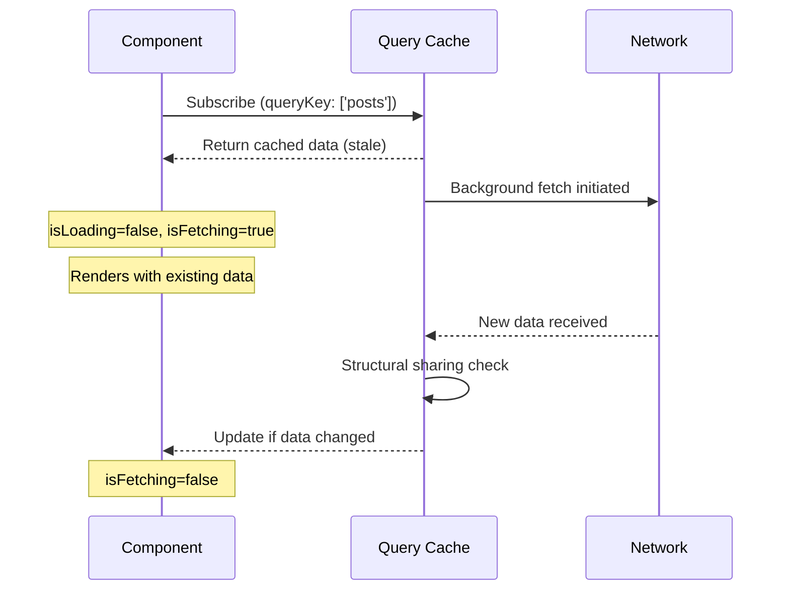

## TanStack Query — Background Refetching

### Overview

Background refetching is the mechanism by which TanStack Query refreshes cached data without blocking the UI. When a refetch is triggered on stale data, the previously cached value is returned to the component immediately while the new fetch runs concurrently. The UI updates only when the new data arrives. This pattern keeps interfaces responsive while maintaining data freshness.

---

### What Makes a Refetch "Background"

A refetch is considered background when cached data already exists for a query key at the time the fetch fires. The component is not left in a loading state — `isLoading` remains `false` and the existing data remains accessible throughout the fetch.

This contrasts with an **initial fetch**, where no cached data exists and the query enters a true loading state (`isLoading: true`, `data: undefined`).

```ts
const { data, isFetching, isLoading } = useQuery({
  queryKey: ['posts'],
  queryFn: fetchPosts,
})
```

| State | Initial Fetch | Background Refetch |
|---|---|---|
| `isLoading` | `true` | `false` |
| `isFetching` | `true` | `true` |
| `data` | `undefined` | previous cached value |

**Key Points**
- `isLoading` is `true` only when there is no cached data and a fetch is in progress
- `isFetching` is `true` during any in-flight fetch, including background refetches
- `data` retains its previous value during a background refetch — it is not reset to `undefined`

---

### Triggers for Background Refetching

Background refetches are initiated by any of the following, provided data is stale:

- **Component mount** — controlled by `refetchOnMount`
- **Window focus** — controlled by `refetchOnWindowFocus`
- **Network reconnect** — controlled by `refetchOnReconnect`
- **Interval polling** — controlled by `refetchInterval`
- **Manual invalidation** — via `queryClient.invalidateQueries()`
- **Manual refetch** — via the `refetch` function returned from `useQuery`

Each trigger is independent. Multiple triggers can queue or deduplicate fetches depending on timing and query state. [Inference] The deduplication behavior for simultaneous triggers is an implementation detail that may differ across versions.

---

### Indicating a Background Refetch in the UI

Because `data` remains populated and `isLoading` is `false`, background refetches are invisible to the user by default. `isFetching` is the correct signal to use when indicating that a refresh is in progress.

```tsx
function PostList() {
  const { data, isFetching } = useQuery({
    queryKey: ['posts'],
    queryFn: fetchPosts,
  })

  return (
    <div>
      {isFetching && <span>Refreshing...</span>}
      <ul>
        {data?.map(post => <li key={post.id}>{post.title}</li>)}
      </ul>
    </div>
  )
}
```

**Key Points**
- Avoid gating the entire render on `isLoading` if the intent is to show a skeleton only on the first load
- `isFetching && !isLoading` is a reliable condition for isolating background refetch state
- Showing a subtle indicator (spinner, banner, opacity change) rather than a full loading state is the conventional pattern

---

### isFetching vs isLoading vs isRefetching

TanStack Query v5 introduced `isRefetching` as an explicit derived flag.

```ts
const {
  isLoading,     // true only on first fetch with no cached data
  isFetching,    // true during any in-flight fetch
  isRefetching,  // true when isFetching && !isLoading (background refetch)
} = useQuery({ ... })
```

`isRefetching` is equivalent to `isFetching && !isLoading`. It is provided as a convenience to avoid repeating that expression across components.

---

### Background Refetch with Interval Polling

`refetchInterval` causes a query to refetch on a fixed schedule regardless of user interaction. Each poll is a background refetch as long as cached data exists.

```ts
useQuery({
  queryKey: ['live-price'],
  queryFn: fetchPrice,
  refetchInterval: 5000, // refetch every 5 seconds
})
```

By default, interval polling pauses when the window loses focus. This is controlled by `refetchIntervalInBackground`.

```ts
useQuery({
  queryKey: ['live-price'],
  queryFn: fetchPrice,
  refetchInterval: 5000,
  refetchIntervalInBackground: true, // continue polling when window is not focused
})
```

**Key Points**
- `refetchInterval` accepts a number (ms) or a function returning a number or `false`
- Returning `false` from the function form stops the interval conditionally

```ts
refetchInterval: (query) => {
  // Stop polling once a terminal state is reached
  if (query.state.data?.status === 'complete') return false
  return 3000
}
```

[Inference] The function form receives the `Query` instance; the available properties depend on the version in use. Verify against the specific version's type definitions.

---

### Manual Background Refetch

The `refetch` function returned from `useQuery` triggers an immediate refetch regardless of staleness. It is always a background refetch when cached data exists.

```ts
const { data, refetch, isFetching } = useQuery({
  queryKey: ['user'],
  queryFn: fetchUser,
})

return (
  <button onClick={() => refetch()} disabled={isFetching}>
    Refresh
  </button>
)
```

`refetch` returns a Promise that resolves with the query result, allowing callers to await the outcome.

```ts
const handleRefresh = async () => {
  const result = await refetch()
  if (result.status === 'success') {
    console.log('Refreshed:', result.data)
  }
}
```

---

### Query Invalidation as a Background Refetch Trigger

`queryClient.invalidateQueries()` marks one or more queries as stale and, if they are currently active (have subscribers), triggers an immediate background refetch.

```ts
// Invalidate all queries matching the key
await queryClient.invalidateQueries({ queryKey: ['posts'] })

// Invalidate and wait for refetches to complete
await queryClient.invalidateQueries({
  queryKey: ['posts'],
  refetchType: 'active', // only refetch queries with active subscribers
})
```

**Key Points**
- Inactive queries (no subscribers) are marked stale but not immediately refetched — the refetch fires on next mount
- `refetchType: 'all'` refetches both active and inactive queries
- `refetchType: 'none'` marks as stale without triggering any refetch

---

### Structural Sharing During Background Refetches

When new data arrives from a background refetch, TanStack Query performs a **structural sharing** comparison between the previous and incoming data. If the data is deeply equal, the existing object reference is preserved — no re-render is triggered.

[Inference] This optimization is intended to reduce unnecessary renders in components that rely on referential equality (e.g., `React.memo`, `useMemo` dependencies). Actual render behavior depends on the component's own equality checks and the React version in use.

Structural sharing can be disabled if the data source is known to always return new references with equivalent content.

```ts
useQuery({
  queryKey: ['data'],
  queryFn: fetchData,
  structuralSharing: false,
})
```

---

### Error Behavior During Background Refetch

If a background refetch fails, TanStack Query does not discard the previously cached data by default. The `error` field is populated and `isError` becomes `true`, but `data` retains its last successful value.

```ts
const { data, error, isError, isFetching } = useQuery({
  queryKey: ['settings'],
  queryFn: fetchSettings,
})

// data is still available even if the most recent refetch failed
```

This means components can continue rendering stale-but-valid data while surfacing the error state separately.

[Inference] Whether `data` persists alongside `isError` depends on the `throwOnError` configuration and version-specific defaults. Verify the behavior for the version in use.

---

### Mermaid Diagram — Background Refetch Lifecycle



---

### Summary Table

| Concept | Key Flag | Behavior During Background Refetch |
|---|---|---|
| Loading state | `isLoading` | `false` — cached data exists |
| Fetch in progress | `isFetching` | `true` |
| Explicit background signal | `isRefetching` | `true` (v5+) |
| Previous data | `data` | Retained until new data arrives |
| On fetch error | `isError` | `true`; `data` typically retained |

---

**Conclusion**

Background refetching is the core mechanism behind TanStack Query's "stale-while-revalidate" model. It decouples data freshness from UI blocking — components always have something to render while newer data is being retrieved. Correctly distinguishing `isLoading` from `isFetching`, understanding what triggers background refetches, and knowing how to surface or suppress the in-progress state are the practical skills that make this pattern effective in production interfaces.