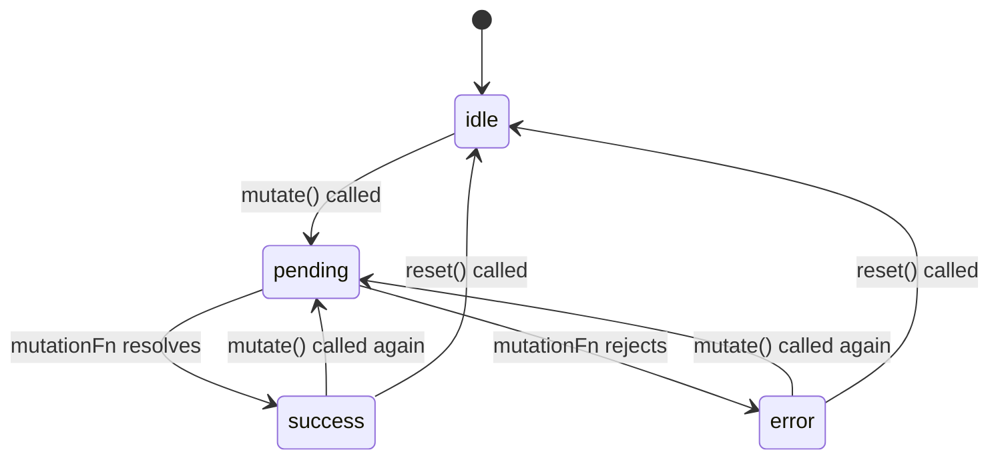

## TanStack Query — useMutation Basics

### Overview

`useMutation` is the TanStack Query primitive for performing write operations — creating, updating, or deleting data. Unlike `useQuery`, mutations do not run automatically. They are triggered explicitly and do not cache their results under a query key. The primary concerns of `useMutation` are executing an async operation, tracking its lifecycle state, and providing hooks to react to outcomes.

---

### Basic Usage

```ts
import { useMutation } from '@tanstack/react-query'

const { mutate, isPending, isSuccess, isError, error } = useMutation({
  mutationFn: (newPost) => fetch('/api/posts', {
    method: 'POST',
    body: JSON.stringify(newPost),
  }).then(res => res.json()),
})
```

`mutationFn` is the only required option. It receives whatever argument is passed to `mutate` at call time and must return a Promise.

---

### Triggering a Mutation

Two functions are returned for invoking the mutation:

- **`mutate`** — fire and forget; does not return a Promise
- **`mutateAsync`** — returns a Promise; allows `await` and direct error handling

```ts
// Using mutate
mutate({ title: 'New Post', body: 'Content here' })

// Using mutateAsync
try {
  const result = await mutateAsync({ title: 'New Post', body: 'Content here' })
  console.log('Created:', result)
} catch (err) {
  console.error('Failed:', err)
}
```

**Key Points**
- `mutate` swallows unhandled Promise rejections internally — errors are surfaced via `isError` and `error` state instead
- `mutateAsync` propagates rejections to the caller — unhandled rejections must be caught explicitly
- [Inference] Choosing between them depends on whether the calling code needs to await the result or chain logic after completion; behavior in concurrent renders may vary

---

### Mutation Lifecycle State

`useMutation` tracks the current state of the mutation through a set of derived boolean flags and the `status` string.

```ts
const {
  status,      // 'idle' | 'pending' | 'success' | 'error'
  isPending,   // true while mutationFn is executing
  isSuccess,   // true after mutationFn resolved
  isError,     // true after mutationFn rejected
  isIdle,      // true before any invocation
  data,        // resolved value from mutationFn on success
  error,       // rejection value on failure
  reset,       // function to reset state back to idle
} = useMutation({ mutationFn })
```

State transitions follow a linear path per invocation:

```
idle → pending → success
               ↘ error
```

Calling `mutate` again resets the state and begins a new cycle. `reset()` returns the mutation to `idle` without triggering a new mutation.

---

### Lifecycle Callbacks

`useMutation` provides three callback options that fire at specific points in the mutation lifecycle. All three are optional.

```ts
useMutation({
  mutationFn: createPost,

  onMutate: (variables) => {
    // Fires before mutationFn executes
    // variables = the argument passed to mutate()
    // Return value becomes the context passed to onError and onSettled
  },

  onSuccess: (data, variables, context) => {
    // Fires after mutationFn resolves successfully
    // data = resolved value
  },

  onError: (error, variables, context) => {
    // Fires after mutationFn rejects
    // error = rejection value
  },

  onSettled: (data, error, variables, context) => {
    // Fires after either onSuccess or onError
    // Analogous to Promise.finally()
  },
})
```

**Key Points**
- `onMutate` is the appropriate place for optimistic update setup (covered in a separate topic)
- `onSettled` receives both `data` and `error`; one will be `undefined` depending on outcome
- Callbacks defined on `useMutation` fire for every invocation of `mutate`

---

### Per-Call Callbacks

Callbacks can also be passed directly to `mutate` or `mutateAsync` at the call site. These are per-invocation overrides and fire in addition to — not instead of — the callbacks defined on `useMutation`.

```ts
mutate(
  { title: 'New Post' },
  {
    onSuccess: (data) => {
      // Fires after the useMutation-level onSuccess
      toast.success('Post created')
    },
    onError: (error) => {
      toast.error('Something went wrong')
    },
    onSettled: () => {
      // Fires after the useMutation-level onSettled
    },
  }
)
```

**Key Points**
- Execution order: `useMutation`-level callbacks fire first, then per-call callbacks
- [Inference] Per-call callbacks are useful for UI-specific side effects (toasts, redirects) that should not be encoded in a shared mutation hook; this is a convention, not an enforced constraint

---

### Invalidating Queries After Mutation

A common pattern is to invalidate related queries after a successful mutation so that stale data is refreshed.

```ts
const queryClient = useQueryClient()

const { mutate } = useMutation({
  mutationFn: createPost,
  onSuccess: () => {
    queryClient.invalidateQueries({ queryKey: ['posts'] })
  },
})
```

This triggers a background refetch of all active queries matching `['posts']`. The UI reflects the updated server state after the refetch completes.

---

### Returning Data from mutationFn

Whatever the `mutationFn` resolves with is available as `data` after a successful mutation, and as the first argument to `onSuccess`.

```ts
const { mutate, data } = useMutation({
  mutationFn: async (payload) => {
    const res = await fetch('/api/posts', {
      method: 'POST',
      body: JSON.stringify(payload),
    })
    return res.json() // this becomes `data`
  },
  onSuccess: (data) => {
    console.log('Server returned:', data.id)
  },
})
```

---

### Resetting Mutation State

`reset()` returns the mutation to its initial `idle` state, clearing `data`, `error`, and all status flags.

```ts
const { mutate, isError, error, reset } = useMutation({ mutationFn: createPost })

return (
  <>
    {isError && (
      <div>
        <p>Error: {error.message}</p>
        <button onClick={reset}>Dismiss</button>
      </div>
    )}
    <button onClick={() => mutate({ title: 'Post' })}>Submit</button>
  </>
)
```

---

### useMutation vs useQuery — Comparison

| Concern | `useQuery` | `useMutation` |
|---|---|---|
| Trigger | Automatic (on mount / stale) | Manual (`mutate` / `mutateAsync`) |
| Caching | Yes, by query key | No |
| Re-runs | On staleness triggers | Only when explicitly called |
| Primary use | Read operations | Write operations |
| Loading flag | `isLoading` | `isPending` |
| Result stored | `data` in cache | `data` on hook instance only |

---

### Mermaid Diagram — Mutation Lifecycle



---

**Conclusion**

`useMutation` provides a structured interface for executing write operations with full lifecycle visibility. Its separation from `useQuery` — no automatic triggering, no query key caching — reflects its intended role as a one-way command rather than a data subscription. The callback system (`onMutate`, `onSuccess`, `onError`, `onSettled`) and the distinction between `mutate` and `mutateAsync` are the primary tools for integrating mutation outcomes into application logic.