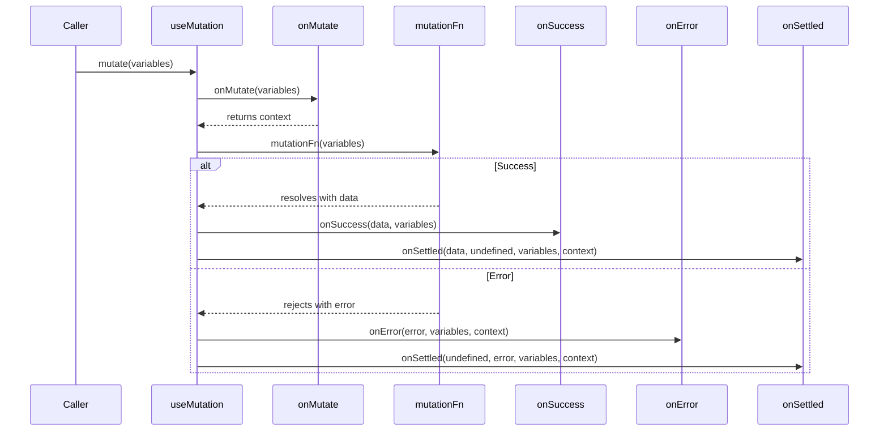

## TanStack Query — Mutation Variables and Context

### Overview

Every invocation of `mutate` or `mutateAsync` carries two distinct pieces of data through the mutation lifecycle: **variables** and **context**. Variables are the input passed by the caller. Context is an optional value produced by `onMutate` and forwarded to subsequent callbacks. Understanding both is necessary for implementing patterns like optimistic updates, coordinated rollbacks, and stateful side effects.

---

### Variables

Variables are the argument passed to `mutate` or `mutateAsync` at the call site. They are forwarded automatically to `mutationFn` and to every lifecycle callback.

```ts
mutate({ title: 'New Post', authorId: 42 })
```

The value `{ title: 'New Post', authorId: 42 }` is the variables object for this invocation. It appears as a parameter in `mutationFn` and all three callbacks.

```ts
useMutation({
  mutationFn: (variables) => {
    // variables = { title: 'New Post', authorId: 42 }
    return createPost(variables)
  },

  onMutate: (variables) => {
    console.log('About to submit:', variables)
  },

  onSuccess: (data, variables) => {
    console.log('Created post with title:', variables.title)
  },

  onError: (error, variables) => {
    console.log('Failed to create:', variables.title)
  },

  onSettled: (data, error, variables) => {
    console.log('Settled for:', variables.title)
  },
})
```

**Key Points**
- Variables are the single argument to `mutate` — if multiple values are needed, they must be wrapped in an object
- Variables are immutable from the callback's perspective — they reflect what was passed at call time, not any transformed value
- Variables are available in all four callbacks: `onMutate`, `onSuccess`, `onError`, `onSettled`

---

### Typing Variables with TypeScript

`useMutation` accepts generic type parameters for precise typing of variables, data, error, and context.

```ts
type CreatePostVariables = {
  title: string
  authorId: number
}

type CreatePostResponse = {
  id: number
  title: string
  createdAt: string
}

const { mutate } = useMutation
  CreatePostResponse,   // TData    — return type of mutationFn
  Error,               // TError   — error type
  CreatePostVariables, // TVariables
  unknown              // TContext  — covered below
>({
  mutationFn: (variables) => createPost(variables),
})
```

With explicit generics, all callback parameters are fully typed and `mutate` will enforce the correct argument shape at the call site.

---

### Context

Context is a value optionally returned from `onMutate`. TanStack Query captures this return value and passes it as the final argument to `onError` and `onSettled`. It is not passed to `onSuccess`.

```ts
useMutation({
  mutationFn: updateUser,

  onMutate: (variables) => {
    // Perform any pre-mutation setup here
    // Whatever is returned becomes `context`
    return { timestamp: Date.now(), previous: getCurrentUser() }
  },

  onSuccess: (data, variables) => {
    // context is NOT available here
  },

  onError: (error, variables, context) => {
    // context = { timestamp: ..., previous: ... }
    console.log('Started at:', context.timestamp)
  },

  onSettled: (data, error, variables, context) => {
    // context = { timestamp: ..., previous: ... }
  },
})
```

**Key Points**
- `onMutate` runs synchronously before `mutationFn` is called
- If `onMutate` returns nothing (`undefined`), context is `undefined` in subsequent callbacks
- Context is scoped to a single mutation invocation — each call to `mutate` produces its own context
- `onSuccess` does not receive context — if the mutation succeeded, rollback data carried in context is typically irrelevant

---

### Context Signature per Callback

The full parameter list for each callback, including where context appears:

```ts
onMutate:  (variables)                        → returns context (or void)
onSuccess: (data, variables)                  → context not provided
onError:   (error, variables, context)        → context from onMutate
onSettled: (data, error, variables, context)  → context from onMutate
```

---

### Primary Use Case — Optimistic Updates with Rollback

The canonical use of context is carrying snapshot data from `onMutate` into `onError` for rollback. This is the foundation of optimistic update patterns.

```ts
const queryClient = useQueryClient()

useMutation({
  mutationFn: updateTodo,

  onMutate: async (variables) => {
    // Cancel any in-flight refetches to avoid overwriting optimistic update
    await queryClient.cancelQueries({ queryKey: ['todos'] })

    // Snapshot the current cached value
    const previousTodos = queryClient.getQueryData(['todos'])

    // Apply the optimistic update to the cache
    queryClient.setQueryData(['todos'], (old) =>
      old.map(todo =>
        todo.id === variables.id
          ? { ...todo, ...variables }
          : todo
      )
    )

    // Return snapshot as context for potential rollback
    return { previousTodos }
  },

  onError: (error, variables, context) => {
    // Restore the cache to its pre-mutation state
    queryClient.setQueryData(['todos'], context.previousTodos)
  },

  onSettled: () => {
    // Regardless of outcome, sync with server
    queryClient.invalidateQueries({ queryKey: ['todos'] })
  },
})
```

**Key Points**
- `cancelQueries` is called before the snapshot to prevent a concurrent refetch from overwriting the optimistic value
- The snapshot is the sole source of truth for rollback — it must be captured before `setQueryData` is called
- `onSettled` invalidates regardless of success or failure, ensuring eventual consistency with the server
- [Inference] The effectiveness of this pattern depends on the timing of refetches and the ordering of concurrent mutations; behavior is not guaranteed to be safe under all concurrency conditions without additional coordination

---

### Context with Per-Call Callbacks

Per-call callbacks passed directly to `mutate` also receive context, following the same signature.

```ts
mutate(
  { id: 1, title: 'Updated' },
  {
    onError: (error, variables, context) => {
      // context is available here too
      console.log('Rollback data:', context.previousTodos)
    },
    onSettled: (data, error, variables, context) => {
      // same context
    },
  }
)
```

Execution order remains: `useMutation`-level callbacks fire first, then per-call callbacks. Context produced by `onMutate` is shared across both levels.

---

### Context Typing in TypeScript

The fourth generic parameter on `useMutation` types the context value.

```ts
type RollbackContext = {
  previousTodos: Todo[]
}

useMutation
  Todo,              // TData
  Error,             // TError
  UpdateTodoInput,   // TVariables
  RollbackContext    // TContext
>({
  mutationFn: updateTodo,

  onMutate: async (variables): Promise<RollbackContext> => {
    const previousTodos = queryClient.getQueryData<Todo[]>(['todos']) ?? []
    return { previousTodos }
  },

  onError: (error, variables, context) => {
    // context is typed as RollbackContext | undefined
    if (context) {
      queryClient.setQueryData(['todos'], context.previousTodos)
    }
  },
})
```

**Key Points**
- Context is typed as `TContext | undefined` in `onError` and `onSettled` because `onMutate` may not return a value
- Narrow with a null check before accessing context properties to satisfy the type system and avoid runtime errors

---

### Async onMutate

`onMutate` can be async. When it is, TanStack Query awaits its resolution before calling `mutationFn`.

```ts
onMutate: async (variables) => {
  await queryClient.cancelQueries({ queryKey: ['todos'] })
  const snapshot = queryClient.getQueryData(['todos'])
  queryClient.setQueryData(['todos'], applyOptimisticUpdate(variables))
  return { snapshot }
}
```

[Inference] If `onMutate` rejects, the behavior — whether `mutationFn` is still called — depends on the version in use. Verify against version-specific documentation before relying on async `onMutate` error handling.

---

### Mermaid Diagram — Variables and Context Flow



---

### Summary Table

| Value | Source | Available In |
|---|---|---|
| `variables` | Caller (`mutate` argument) | `mutationFn`, `onMutate`, `onSuccess`, `onError`, `onSettled` |
| `context` | Return value of `onMutate` | `onError`, `onSettled` (not `onSuccess`) |
| `data` | Resolved value of `mutationFn` | `onSuccess`, `onSettled` |
| `error` | Rejection value of `mutationFn` | `onError`, `onSettled` |

---

**Conclusion**

Variables provide traceability — every callback knows what input triggered the mutation. Context provides coordination — `onMutate` can capture state before the mutation executes and pass it forward to recovery logic in `onError` or cleanup logic in `onSettled`. Together they form the backbone of stateful mutation patterns, most notably optimistic updates, where the ability to snapshot, apply, and conditionally roll back cache state depends entirely on data flowing cleanly through the lifecycle.