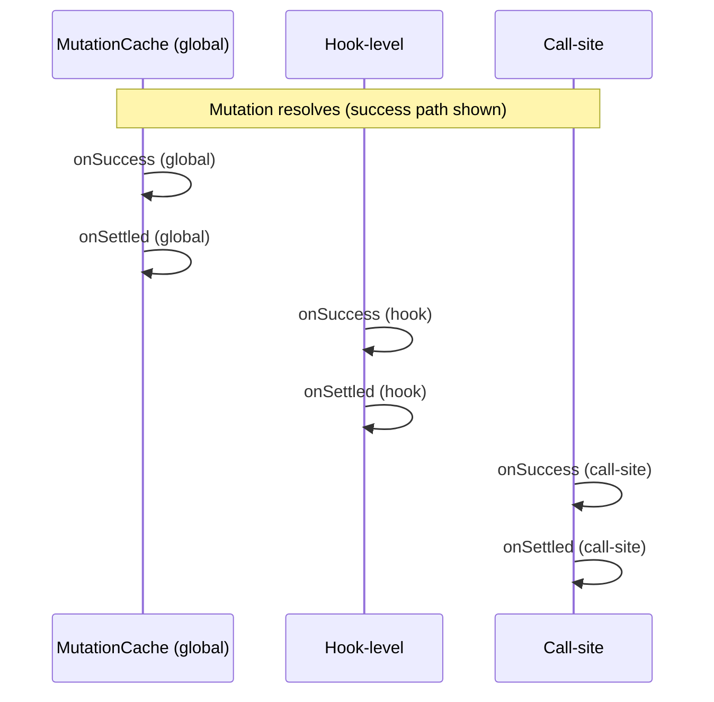

## TanStack Query — onSuccess, onError, onSettled Callbacks

### Overview

`onSuccess`, `onError`, and `onSettled` are lifecycle callbacks available on both `useMutation` and `useQuery`. They provide structured integration points for reacting to the outcome of an async operation — without manually tracking promise chains or effect dependencies. Each fires at a distinct point in the lifecycle, receives a defined set of arguments, and serves a different purpose in application logic.

---

### Where Callbacks Can Be Defined

All three callbacks can be specified in two places:

- **On the hook** — defined once, fire for every invocation
- **At the call site** — passed to `mutate()` or `mutateAsync()`, fire for that invocation only

For `useQuery`, callbacks are defined on the hook only — there is no call-site equivalent.

```ts
// On the hook (mutations)
useMutation({
  mutationFn: createPost,
  onSuccess: (data) => { /* ... */ },
  onError: (error) => { /* ... */ },
  onSettled: () => { /* ... */ },
})

// At the call site (mutations only)
mutate(variables, {
  onSuccess: (data) => { /* ... */ },
  onError: (error) => { /* ... */ },
  onSettled: () => { /* ... */ },
})
```

When both levels define the same callback, hook-level fires first, then call-site. They are additive, not exclusive.

---

### onSuccess

Fires after the async operation resolves successfully. Receives the resolved value as its first argument.

#### Signature — Mutations

```ts
onSuccess: (data, variables, context) => void | Promise<void>
```

#### Signature — Queries

```ts
onSuccess: (data) => void
```

#### Example — Mutation

```ts
useMutation({
  mutationFn: createPost,
  onSuccess: (data, variables, context) => {
    console.log('Post created with id:', data.id)
    queryClient.invalidateQueries({ queryKey: ['posts'] })
  },
})
```

#### Example — Query

```ts
useQuery({
  queryKey: ['user'],
  queryFn: fetchUser,
  onSuccess: (data) => {
    analytics.identify(data.id)
  },
})
```

**Key Points**
- For mutations, `data` is whatever `mutationFn` resolved with
- For queries, `onSuccess` fires after every successful fetch, including background refetches — not only on the initial load
- [Inference] For queries, `onSuccess` firing on every background refetch may cause unintended side effects if the callback performs non-idempotent operations; design accordingly
- `onSuccess` does not receive `context` in queries — only in mutations

---

### Deprecation of Query Callbacks in v5

In TanStack Query v5, `onSuccess`, `onError`, and `onSettled` were **removed from `useQuery`**. They remain available on `useMutation`.

This was an intentional design decision. The core reasons cited by the maintainers:

- Query callbacks fire per-observer, meaning multiple components subscribed to the same query each trigger their own callback — behavior that is frequently surprising
- Callbacks on `useQuery` encourage side effects tied to render lifecycle rather than to actual data changes
- The same outcomes are achievable more predictably through other mechanisms

[Inference] The deprecation path was introduced in v4 documentation and removed in v5. If query callbacks are present in a codebase targeting v5, they will be silently ignored or produce TypeScript errors depending on configuration.

#### Alternatives to Query Callbacks in v5

**`useEffect` with `data`** — for side effects that depend on data being present:

```ts
const { data } = useQuery({ queryKey: ['user'], queryFn: fetchUser })

useEffect(() => {
  if (data) {
    analytics.identify(data.id)
  }
}, [data])
```

**Global query cache listeners** — for cache-level event handling:

```ts
const queryCache = queryClient.getQueryCache()

queryCache.subscribe((event) => {
  if (event.type === 'updated' && event.action.type === 'success') {
    console.log('Query succeeded:', event.query.queryKey)
  }
})
```

---

### onError

Fires after the async operation rejects. Receives the error as its first argument.

#### Signature — Mutations

```ts
onError: (error, variables, context) => void | Promise<void>
```

#### Signature — Queries (v4 only)

```ts
onError: (error) => void
```

#### Example — Mutation with Rollback

```ts
useMutation({
  mutationFn: updateTodo,
  onMutate: async (variables) => {
    const previous = queryClient.getQueryData(['todos'])
    queryClient.setQueryData(['todos'], applyOptimistic(variables))
    return { previous }
  },
  onError: (error, variables, context) => {
    // Restore cache to pre-mutation snapshot
    queryClient.setQueryData(['todos'], context.previous)
    toast.error('Update failed. Changes reverted.')
  },
})
```

#### Example — Query Error Logging (v4)

```ts
useQuery({
  queryKey: ['dashboard'],
  queryFn: fetchDashboard,
  onError: (error) => {
    logger.error('Dashboard fetch failed', error)
  },
})
```

**Key Points**
- For mutations, `context` in `onError` is the value returned from `onMutate` — the primary mechanism for rollback data
- `onError` fires after retries are exhausted, not on each individual retry attempt
- [Inference] The error type is whatever the `queryFn` or `mutationFn` throws or rejects with; typing it precisely requires the `TError` generic parameter

---

### onSettled

Fires after the operation completes, regardless of outcome. Analogous to `Promise.finally()`. Receives both `data` and `error`, one of which will be `undefined`.

#### Signature — Mutations

```ts
onSettled: (data, error, variables, context) => void | Promise<void>
```

#### Signature — Queries (v4 only)

```ts
onSettled: (data, error) => void
```

#### Example — Invalidation Regardless of Outcome

```ts
useMutation({
  mutationFn: deletePost,
  onSettled: (data, error, variables) => {
    // Sync cache with server whether or not the delete succeeded
    queryClient.invalidateQueries({ queryKey: ['posts'] })
  },
})
```

#### Example — Dismissing a Loading State

```ts
useMutation({
  mutationFn: submitForm,
  onMutate: () => setSubmitting(true),
  onSettled: () => setSubmitting(false),
})
```

**Key Points**
- `onSettled` is the correct place for cleanup that must run unconditionally
- On success: `data` is populated, `error` is `undefined`
- On error: `error` is populated, `data` is `undefined`
- Prefer `onSettled` over duplicating logic across both `onSuccess` and `onError` when the action is outcome-independent

---

### Execution Order

When both hook-level and call-site callbacks are defined, they fire in a fixed order per outcome:

```
Mutation resolves or rejects
        │
        ▼
Hook-level onSuccess / onError
        │
        ▼
Hook-level onSettled
        │
        ▼
Call-site onSuccess / onError
        │
        ▼
Call-site onSettled
```

**Key Points**
- Hook-level callbacks always precede call-site callbacks
- `onSettled` at each level fires after the corresponding `onSuccess` or `onError` at the same level
- [Inference] If a hook-level callback throws or returns a rejected Promise, behavior of subsequent callbacks may be affected; verify against version-specific documentation

---

### Async Callbacks

All three callbacks accept async functions. TanStack Query awaits them before proceeding to the next callback in the chain.

```ts
useMutation({
  mutationFn: createOrder,

  onSuccess: async (data) => {
    await sendConfirmationEmail(data.orderId)
    await logAuditEvent('order.created', data)
  },

  onSettled: async () => {
    await queryClient.invalidateQueries({ queryKey: ['orders'] })
  },
})
```

[Inference] Because callbacks are awaited sequentially, slow async callbacks delay execution of subsequent steps in the chain. This may affect perceived responsiveness; verify performance under realistic conditions.

---

### Global Callbacks via MutationCache

Callbacks can be registered globally on the `MutationCache` to apply across all mutations without per-hook configuration. This is useful for application-wide error logging or notification systems.

```ts
const queryClient = new QueryClient({
  mutationCache: new MutationCache({
    onSuccess: (data, variables, context, mutation) => {
      console.log('Global mutation success')
    },
    onError: (error, variables, context, mutation) => {
      // Central error reporting
      Sentry.captureException(error)
    },
    onSettled: (data, error, variables, context, mutation) => {
      console.log('Global mutation settled')
    },
  }),
})
```

**Key Points**
- Global callbacks receive an additional `mutation` argument — the `Mutation` instance — providing access to `mutation.options`, `mutation.state`, and other metadata
- Global callbacks fire before hook-level callbacks
- [Inference] Global and hook-level callbacks are additive; the full execution order from first to last is: global → hook-level → call-site

---

### Mermaid Diagram — Callback Execution Order



---

### Summary Table

| Callback | Fires When | Receives | Available On |
|---|---|---|---|
| `onSuccess` | Operation resolves | `data`, `variables`*, `context`* | `useMutation`, `useQuery` (v4 only) |
| `onError` | Operation rejects (after retries) | `error`, `variables`*, `context`* | `useMutation`, `useQuery` (v4 only) |
| `onSettled` | Operation completes either way | `data`, `error`, `variables`*, `context`* | `useMutation`, `useQuery` (v4 only) |

\* Mutations only

---

**Conclusion**

`onSuccess`, `onError`, and `onSettled` are the primary integration points between TanStack Query's async lifecycle and application logic. For mutations, they form a predictable chain with well-defined argument contracts — including `context` for rollback scenarios. For queries, their removal in v5 reflects a deliberate shift toward `useEffect` and cache-level subscriptions as more predictable alternatives. Understanding the execution order across global, hook-level, and call-site definitions is essential when layering multiple callback sources in a real application.