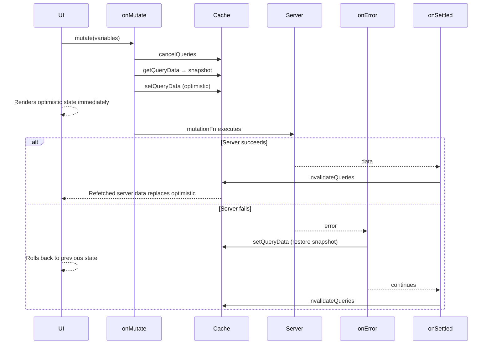

## TanStack Query — Optimistic Updates

### Overview

Optimistic updates are a UX pattern where the UI is updated immediately to reflect the expected result of a mutation, before the server has confirmed it. If the server responds successfully, the optimistic state is replaced with real server data. If it fails, the UI is rolled back to its previous state. TanStack Query supports this pattern through `onMutate`, `onError`, and `onSettled`, with the query cache as the coordination layer.

---

### Core Mechanics

Three cache operations underpin every optimistic update:

- **`cancelQueries`** — cancels any in-flight fetches for the affected query key to prevent them from overwriting the optimistic value
- **`getQueryData`** — snapshots the current cache value before modification
- **`setQueryData`** — writes the optimistic value directly into the cache

These are called inside `onMutate`, which runs synchronously before `mutationFn` executes.

```ts
const queryClient = useQueryClient()

useMutation({
  mutationFn: updateTodo,

  onMutate: async (variables) => {
    // 1. Cancel in-flight refetches
    await queryClient.cancelQueries({ queryKey: ['todos'] })

    // 2. Snapshot current cache value
    const previousTodos = queryClient.getQueryData(['todos'])

    // 3. Apply optimistic update
    queryClient.setQueryData(['todos'], (old) =>
      old.map(todo =>
        todo.id === variables.id ? { ...todo, ...variables } : todo
      )
    )

    // 4. Return snapshot as context for rollback
    return { previousTodos }
  },

  onError: (error, variables, context) => {
    // Restore previous state on failure
    queryClient.setQueryData(['todos'], context.previousTodos)
  },

  onSettled: () => {
    // Sync with server regardless of outcome
    queryClient.invalidateQueries({ queryKey: ['todos'] })
  },
})
```

---

### Why cancelQueries Is Necessary

Without `cancelQueries`, a background refetch completing after `setQueryData` would overwrite the optimistic value with stale server data — producing a visible flicker or incorrect intermediate state.

`cancelQueries` signals any active observers to abort their in-flight requests for the matching key. TanStack Query does not cancel the underlying network request automatically — that requires an `AbortSignal` wired into the `queryFn`.

```ts
// queryFn with AbortSignal support
const queryFn = ({ signal }) =>
  fetch('/api/todos', { signal }).then(res => res.json())
```

When `signal` is used, `cancelQueries` causes the fetch to abort at the network level. Without it, the request completes but TanStack Query discards the result.

[Inference] Whether discarding the result is sufficient depends on the application — for idempotent reads it generally is, but the underlying request still consumes server resources. Behavior may vary.

---

### Snapshot and Rollback Pattern

The snapshot captured in `onMutate` is the single source of truth for rollback. It must be taken before `setQueryData` is called — once the cache is modified, the original value is no longer accessible through normal means.

```ts
onMutate: async (variables) => {
  await queryClient.cancelQueries({ queryKey: ['todos'] })

  // Capture BEFORE setQueryData
  const previousTodos = queryClient.getQueryData<Todo[]>(['todos'])

  queryClient.setQueryData<Todo[]>(['todos'], (old = []) =>
    old.map(todo =>
      todo.id === variables.id ? { ...todo, completed: variables.completed } : todo
    )
  )

  return { previousTodos }
},

onError: (_error, _variables, context) => {
  if (context?.previousTodos) {
    queryClient.setQueryData(['todos'], context.previousTodos)
  }
},
```

**Key Points**
- `getQueryData` returns `undefined` if the key has no cache entry — guard against this when constructing the rollback
- The rollback in `onError` restores the cache synchronously, so the UI reverts immediately on failure
- `context` is typed as `TContext | undefined` — always null-check before accessing rollback data

---

### onSettled Invalidation

`onSettled` invalidates the query regardless of whether the mutation succeeded or failed. This ensures the cache is eventually reconciled with server state, replacing either the optimistic value (success path) or the rolled-back value (error path) with confirmed data.

```ts
onSettled: () => {
  queryClient.invalidateQueries({ queryKey: ['todos'] })
},
```

**Key Points**
- On success: the optimistic value is already close to correct; invalidation confirms it or applies server-side differences
- On error: the rollback has already run; invalidation re-fetches to confirm the original state is still accurate
- Placing invalidation in `onSettled` rather than `onSuccess` means it runs unconditionally — a safer default

---

### Optimistic Updates for List vs Single Item

#### List update

```ts
queryClient.setQueryData<Todo[]>(['todos'], (old = []) =>
  old.map(todo =>
    todo.id === variables.id ? { ...todo, ...variables } : todo
  )
)
```

#### Adding an item optimistically

```ts
queryClient.setQueryData<Todo[]>(['todos'], (old = []) => [
  ...old,
  { id: crypto.randomUUID(), ...variables, _optimistic: true },
])
```

[Inference] Using a temporary client-generated ID for optimistic items can cause key collisions or reconciliation issues when the server returns the canonical ID. The `_optimistic` flag is a convention, not a built-in feature — its use requires application-level cleanup on settlement.

#### Single item update

```ts
queryClient.setQueryData<Todo>(['todos', variables.id], (old) =>
  old ? { ...old, ...variables } : old
)
```

When a mutation affects both a list and a detail query, both cache entries may need to be updated and snapshotted independently.

---

### Multiple Query Keys

When a mutation affects multiple cached queries, each must be cancelled, snapshotted, and updated independently.

```ts
onMutate: async (variables) => {
  await queryClient.cancelQueries({ queryKey: ['todos'] })
  await queryClient.cancelQueries({ queryKey: ['todos', variables.id] })

  const previousList = queryClient.getQueryData<Todo[]>(['todos'])
  const previousItem = queryClient.getQueryData<Todo>(['todos', variables.id])

  queryClient.setQueryData<Todo[]>(['todos'], (old = []) =>
    old.map(t => t.id === variables.id ? { ...t, ...variables } : t)
  )
  queryClient.setQueryData<Todo>(['todos', variables.id], (old) =>
    old ? { ...old, ...variables } : old
  )

  return { previousList, previousItem }
},

onError: (_error, variables, context) => {
  if (context?.previousList) {
    queryClient.setQueryData(['todos'], context.previousList)
  }
  if (context?.previousItem) {
    queryClient.setQueryData(['todos', variables.id], context.previousItem)
  }
},

onSettled: (_data, _error, variables) => {
  queryClient.invalidateQueries({ queryKey: ['todos'] })
  queryClient.invalidateQueries({ queryKey: ['todos', variables.id] })
},
```

---

### Using setQueryData with a Functional Updater

The functional updater form of `setQueryData` is preferable over passing the value directly. It receives the current cache value and returns the new one, handling the case where the cache entry is `undefined`.

```ts
// Preferred — handles undefined safely
queryClient.setQueryData<Todo[]>(['todos'], (old = []) =>
  old.map(todo => todo.id === variables.id ? { ...todo, ...variables } : todo)
)

// Avoid — assumes the cache entry exists
queryClient.setQueryData(['todos'], updatedList)
```

---

### Concurrent Mutations

When multiple mutations targeting the same query key are in-flight simultaneously, rollback logic becomes ambiguous — each `onMutate` snapshots a progressively more optimistic cache state.

[Inference] TanStack Query does not provide built-in coordination for concurrent optimistic mutations. Common mitigation strategies include disabling the trigger while a mutation is pending (`disabled` button, `isPending` guard) or serializing mutations through a queue. These are application-level concerns; behavior under concurrent mutations is not guaranteed to be safe without explicit guards.

```ts
// Guard against concurrent submission
<button onClick={() => mutate(variables)} disabled={isPending}>
  Save
</button>
```

---

### Alternative — Optimistic Option (v5)

TanStack Query v5 introduced a dedicated `optimisticResults` approach for `useQuery` that surfaces pending mutation state directly, separate from the `onMutate` pattern. Additionally, v5 exposes a more explicit `optimistic` option on some APIs.

[Unverified] The exact API surface for first-class optimistic update support in v5 beyond the `onMutate` pattern was still evolving at the time of writing. Verify against the current v5 documentation before adopting any API labeled experimental or unstable.

---

### Mermaid Diagram — Optimistic Update Flow



---

### Summary — Step Sequence

| Step | Location | Action |
|---|---|---|
| 1 | `onMutate` | Cancel in-flight queries |
| 2 | `onMutate` | Snapshot current cache value |
| 3 | `onMutate` | Apply optimistic update to cache |
| 4 | `onMutate` | Return snapshot as context |
| 5 | `mutationFn` | Execute server request |
| 6a (success) | `onSettled` | Invalidate to sync with server |
| 6b (error) | `onError` | Restore snapshot from context |
| 7 (error) | `onSettled` | Invalidate to confirm server state |

---

**Conclusion**

Optimistic updates in TanStack Query are built on three primitives — `cancelQueries`, `getQueryData`, and `setQueryData` — coordinated through the `onMutate` / `onError` / `onSettled` lifecycle. The pattern is explicit by design: the developer controls what is written to the cache, what is snapshotted for rollback, and when server reconciliation occurs. This explicitness makes the behavior predictable but requires careful handling of edge cases — particularly concurrent mutations, partial cache coverage, and temporary ID reconciliation — which the library does not abstract away.