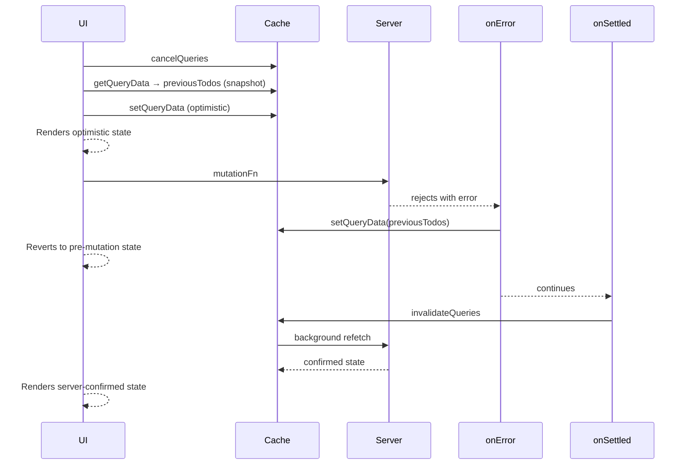

## TanStack Query — Rolling Back Optimistic Updates on Error

### Overview

Rolling back an optimistic update means restoring the query cache to its state immediately before a mutation was applied, in response to a server error. TanStack Query does not perform rollbacks automatically — the developer is responsible for capturing a snapshot before modifying the cache and restoring it if the mutation fails. The mechanism that connects these two steps is `context`, passed from `onMutate` to `onError`.

---

### The Rollback Contract

A complete rollback implementation requires four coordinated steps:

1. Cancel in-flight refetches before touching the cache
2. Snapshot the current cache value before applying the optimistic update
3. Apply the optimistic update
4. Return the snapshot as context — available in `onError` for restoration

If any step is missing, the rollback either lacks the data needed to restore state, or the restored value is immediately overwritten by a concurrent refetch.

---

### Minimal Complete Example

```ts
const queryClient = useQueryClient()

useMutation({
  mutationFn: updateTodo,

  onMutate: async (variables) => {
    // Step 1 — prevent concurrent refetch from overwriting optimistic value
    await queryClient.cancelQueries({ queryKey: ['todos'] })

    // Step 2 — snapshot before modification
    const previousTodos = queryClient.getQueryData<Todo[]>(['todos'])

    // Step 3 — apply optimistic update
    queryClient.setQueryData<Todo[]>(['todos'], (old = []) =>
      old.map(todo =>
        todo.id === variables.id ? { ...todo, ...variables } : todo
      )
    )

    // Step 4 — return snapshot as context
    return { previousTodos }
  },

  onError: (_error, _variables, context) => {
    // Restore cache to pre-mutation state
    if (context?.previousTodos !== undefined) {
      queryClient.setQueryData(['todos'], context.previousTodos)
    }
  },

  onSettled: () => {
    // Re-sync with server after either outcome
    queryClient.invalidateQueries({ queryKey: ['todos'] })
  },
})
```

---

### Why the Snapshot Must Precede setQueryData

Once `setQueryData` is called, the original value is no longer in the cache. `getQueryData` after that point returns the optimistic value, not the original. The snapshot must be taken in the window between `cancelQueries` resolving and `setQueryData` being called.

```ts
// CORRECT — snapshot taken before modification
const previous = queryClient.getQueryData(['todos'])
queryClient.setQueryData(['todos'], applyOptimistic(variables))
return { previous }

// INCORRECT — snapshot taken after modification; captures optimistic value
queryClient.setQueryData(['todos'], applyOptimistic(variables))
const previous = queryClient.getQueryData(['todos']) // already optimistic
return { previous }
```

---

### Null-Checking Context in onError

Context is typed as `TContext | undefined`. `onMutate` may not execute, may return `void`, or may itself throw — in all cases, context arrives in `onError` as `undefined`. Accessing it without a guard produces a runtime error.

```ts
onError: (_error, _variables, context) => {
  // Guard required — context may be undefined
  if (context?.previousTodos !== undefined) {
    queryClient.setQueryData(['todos'], context.previousTodos)
  }
},
```

**Key Points**
- `undefined` is a valid cached value in some edge cases — prefer `!== undefined` over a truthiness check to avoid incorrectly skipping a rollback to `undefined`
- If `onMutate` is async and throws before returning, context will be `undefined` in `onError`

---

### Rolling Back Multiple Query Keys

When a mutation optimistically updates more than one cache entry, each must be independently snapshotted and restored.

```ts
onMutate: async (variables) => {
  await queryClient.cancelQueries({ queryKey: ['todos'] })
  await queryClient.cancelQueries({ queryKey: ['todos', variables.id] })

  const previousList = queryClient.getQueryData<Todo[]>(['todos'])
  const previousItem = queryClient.getQueryData<Todo>(['todos', variables.id])

  queryClient.setQueryData<Todo[]>(['todos'], (old = []) =>
    old.map(t => t.id === variables.id ? { ...t, ...variables } : t)
  )
  queryClient.setQueryData<Todo>(['todos', variables.id], (old) =>
    old ? { ...old, ...variables } : old
  )

  return { previousList, previousItem }
},

onError: (_error, variables, context) => {
  if (context?.previousList !== undefined) {
    queryClient.setQueryData(['todos'], context.previousList)
  }
  if (context?.previousItem !== undefined) {
    queryClient.setQueryData(['todos', variables.id], context.previousItem)
  }
},

onSettled: (_data, _error, variables) => {
  queryClient.invalidateQueries({ queryKey: ['todos'] })
  queryClient.invalidateQueries({ queryKey: ['todos', variables.id] })
},
```

Failing to restore all affected keys leaves the cache in a partially rolled-back state, where some entries reflect the failed optimistic update and others do not.

---

### Typing Context Explicitly

Explicit typing of `TContext` tightens the callback signatures and surfaces missing null checks at compile time.

```ts
type RollbackContext = {
  previousList: Todo[] | undefined
  previousItem: Todo | undefined
}

useMutation
  Todo,             // TData
  Error,            // TError
  UpdateTodoInput,  // TVariables
  RollbackContext   // TContext
>({
  mutationFn: updateTodo,

  onMutate: async (variables): Promise<RollbackContext> => {
    await queryClient.cancelQueries({ queryKey: ['todos'] })
    await queryClient.cancelQueries({ queryKey: ['todos', variables.id] })

    return {
      previousList: queryClient.getQueryData<Todo[]>(['todos']),
      previousItem: queryClient.getQueryData<Todo>(['todos', variables.id]),
    }
  },

  onError: (_error, variables, context) => {
    // context is typed as RollbackContext | undefined
    if (context?.previousList !== undefined) {
      queryClient.setQueryData(['todos'], context.previousList)
    }
    if (context?.previousItem !== undefined) {
      queryClient.setQueryData(['todos', variables.id], context.previousItem)
    }
  },
})
```

---

### Interaction Between onError and onSettled

Both `onError` and `onSettled` run on failure — `onError` first, then `onSettled`. The rollback in `onError` runs before the invalidation in `onSettled`. This ordering matters: the cache is restored to the snapshot before the invalidation triggers a refetch, so the refetch replaces the correct baseline rather than the optimistic value.

```
mutationFn rejects
       │
       ▼
  onError fires
  → setQueryData restores snapshot
       │
       ▼
  onSettled fires
  → invalidateQueries triggers background refetch
       │
       ▼
  Refetch completes
  → Cache contains confirmed server state
```

[Inference] If `onError` itself throws, `onSettled` may still execute depending on version behavior. The cache may be left in the optimistic state. Verify error handling within callbacks against the version in use.

---

### Partial Failure — When the Snapshot Is Undefined

If the cache has no entry for the query key at the time `onMutate` runs, `getQueryData` returns `undefined`. Restoring `undefined` to the cache is valid but effectively clears the entry, causing the next mount to trigger a fresh fetch.

```ts
onMutate: async (variables) => {
  await queryClient.cancelQueries({ queryKey: ['todos'] })

  // May be undefined if cache was empty
  const previousTodos = queryClient.getQueryData<Todo[]>(['todos'])

  queryClient.setQueryData<Todo[]>(['todos'], (old = []) =>
    old.map(t => t.id === variables.id ? { ...t, ...variables } : t)
  )

  return { previousTodos }
},

onError: (_error, _variables, context) => {
  // Restoring undefined removes the cache entry — acceptable in most cases
  queryClient.setQueryData(['todos'], context?.previousTodos)
},
```

[Inference] Whether clearing the cache entry is preferable to leaving the optimistic value depends on the application. If the optimistic value is clearly wrong after a failure, clearing is defensible. If the entry being absent causes a visible loading state, it may be preferable to call `removeQueries` and let the next mount refetch cleanly.

---

### Rollback Without onSettled Invalidation

In some cases, `onSettled` invalidation may be omitted intentionally — for example, when the server response in `onSuccess` already provides the authoritative updated value and writing it directly to the cache is preferred over a round-trip refetch.

```ts
useMutation({
  mutationFn: updateTodo,

  onMutate: async (variables) => {
    await queryClient.cancelQueries({ queryKey: ['todos', variables.id] })
    const previousItem = queryClient.getQueryData<Todo>(['todos', variables.id])
    queryClient.setQueryData<Todo>(['todos', variables.id], (old) =>
      old ? { ...old, ...variables } : old
    )
    return { previousItem }
  },

  onSuccess: (data, variables) => {
    // Write confirmed server data directly — no invalidation needed
    queryClient.setQueryData(['todos', variables.id], data)
  },

  onError: (_error, variables, context) => {
    if (context?.previousItem !== undefined) {
      queryClient.setQueryData(['todos', variables.id], context.previousItem)
    }
  },

  // onSettled omitted — server data written directly in onSuccess
})
```

[Inference] Omitting `onSettled` invalidation reduces network requests but requires confidence that `onSuccess` data is always the canonical server state. If the server applies transformations not reflected in the mutation variables, skipping invalidation may leave the cache out of sync.

---

### Common Mistakes

#### Forgetting to await cancelQueries

```ts
// INCORRECT — cancelQueries is not awaited
onMutate: (variables) => {
  queryClient.cancelQueries({ queryKey: ['todos'] }) // not awaited
  const previous = queryClient.getQueryData(['todos'])
  queryClient.setQueryData(['todos'], applyOptimistic(variables))
  return { previous }
},
```

Without `await`, `setQueryData` may execute before the cancellation completes, leaving a window where an in-flight refetch can overwrite the optimistic value.

#### Mutating the snapshot

```ts
// INCORRECT — snapshot is mutated, rollback restores wrong value
const previous = queryClient.getQueryData<Todo[]>(['todos'])
previous?.forEach(todo => { todo.completed = true }) // mutates snapshot
queryClient.setQueryData(['todos'], previous)
return { previous } // snapshot is now the same as the optimistic value
```

The snapshot must be treated as immutable. If the optimistic update logic needs a modified copy, create one separately.

```ts
// CORRECT
const previous = queryClient.getQueryData<Todo[]>(['todos'])
const updated = previous?.map(todo =>
  todo.id === variables.id ? { ...todo, completed: true } : todo
)
queryClient.setQueryData(['todos'], updated)
return { previous } // snapshot is unmodified
```

---

### Mermaid Diagram — Rollback Execution Path



---

### Summary — Rollback Checklist

| Requirement | Location | Notes |
|---|---|---|
| Cancel in-flight queries | `onMutate` | Must be awaited |
| Snapshot before `setQueryData` | `onMutate` | Order is critical |
| Return snapshot as context | `onMutate` | Enables rollback in `onError` |
| Null-check context | `onError` | Context may be `undefined` |
| Restore all affected keys | `onError` | Partial rollback leaves inconsistent state |
| Invalidate after rollback | `onSettled` | Confirms server state unconditionally |

---

**Conclusion**

Rolling back optimistic updates is a manual, explicit process in TanStack Query. The library provides the primitives — `cancelQueries`, `getQueryData`, `setQueryData`, and the context threading mechanism — but the developer is responsible for composing them correctly. The most common failure modes are ordering errors (snapshot after modification, missing `await` on cancellation), incomplete coverage (missing query keys), and unsafe context access (missing null check). When implemented correctly, the rollback is synchronous and immediate — the UI reverts before the invalidation refetch begins.