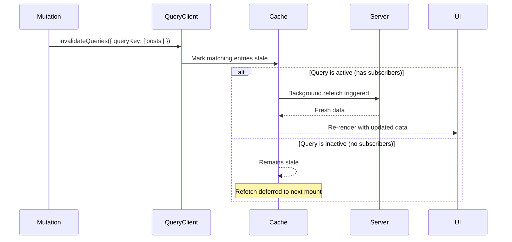

## TanStack Query — Invalidating Queries After Mutation

### Overview

Query invalidation is the primary mechanism for synchronizing the client cache with server state after a write operation. When a mutation changes data on the server, any cached queries that reflect that data are potentially stale. `queryClient.invalidateQueries()` marks those entries as stale and, if they are currently active, triggers an immediate background refetch. This is the recommended approach for post-mutation cache reconciliation in most cases.

---

### What Invalidation Does

Calling `invalidateQueries` performs two actions on matching cache entries:

1. Marks them as stale, regardless of their configured `staleTime`
2. Triggers a background refetch for any that are currently active (have mounted subscribers)

Inactive queries — those with no current subscribers — are marked stale but not immediately refetched. They will refetch on next mount, subject to `refetchOnMount`.

```ts
const queryClient = useQueryClient()

useMutation({
  mutationFn: createPost,
  onSuccess: () => {
    queryClient.invalidateQueries({ queryKey: ['posts'] })
  },
})
```

---

### Where to Place Invalidation

#### onSuccess

Invalidation in `onSuccess` fires only when the mutation succeeds. This is appropriate when the cache should only be updated after confirmed server acknowledgment.

```ts
useMutation({
  mutationFn: createPost,
  onSuccess: () => {
    queryClient.invalidateQueries({ queryKey: ['posts'] })
  },
})
```

#### onSettled

Invalidation in `onSettled` fires regardless of outcome. This is the safer default — it ensures the cache is reconciled even if error handling partially failed, or if the application logic requires the cache to reflect server state after both success and failure paths.

```ts
useMutation({
  mutationFn: createPost,
  onSettled: () => {
    queryClient.invalidateQueries({ queryKey: ['posts'] })
  },
})
```

**Key Points**
- `onSettled` is generally preferred for invalidation unless the failure path requires the cache to remain in a specific state (e.g., after a rollback)
- Placing invalidation in both `onSuccess` and `onSettled` causes it to run twice on success — once per callback

---

### invalidateQueries Options

`invalidateQueries` accepts a filters object that controls which cache entries are targeted.

```ts
queryClient.invalidateQueries({
  queryKey: ['posts'],         // match by key
  exact: false,               // default — matches all keys that start with ['posts']
  refetchType: 'active',      // default — only refetch active queries
  stale: true,                // default — only invalidate stale queries
})
```

#### exact Matching

By default, `exact: false` — invalidation matches any query whose key begins with the provided array. This is prefix matching.

```ts
// Invalidates: ['posts'], ['posts', 1], ['posts', 'featured'], etc.
queryClient.invalidateQueries({ queryKey: ['posts'] })

// Invalidates only: ['posts']
queryClient.invalidateQueries({ queryKey: ['posts'], exact: true })
```

#### refetchType

Controls which queries are immediately refetched after being marked stale.

```ts
// Only refetch queries with active subscribers (default)
queryClient.invalidateQueries({ queryKey: ['posts'], refetchType: 'active' })

// Refetch active and inactive queries
queryClient.invalidateQueries({ queryKey: ['posts'], refetchType: 'all' })

// Mark stale only — do not trigger any refetch
queryClient.invalidateQueries({ queryKey: ['posts'], refetchType: 'none' })
```

**Key Points**
- `refetchType: 'none'` is useful when the intent is to mark queries stale so they refetch on next mount, without triggering an immediate network request
- `refetchType: 'all'` forces a refetch even for queries with no current subscribers — use with care on large caches

---

### Invalidating Multiple Query Keys

A mutation may affect data represented under several different query keys. Each can be invalidated independently.

```ts
useMutation({
  mutationFn: deleteComment,
  onSuccess: (_data, variables) => {
    // Invalidate the comment list
    queryClient.invalidateQueries({ queryKey: ['comments', variables.postId] })
    // Invalidate the post itself (comment count may have changed)
    queryClient.invalidateQueries({ queryKey: ['posts', variables.postId] })
    // Invalidate aggregate counts
    queryClient.invalidateQueries({ queryKey: ['stats'] })
  },
})
```

`invalidateQueries` returns a Promise that resolves when all triggered refetches complete. When invalidating multiple keys and the order of completion matters, they can be awaited individually or in parallel.

```ts
onSuccess: async (_data, variables) => {
  await Promise.all([
    queryClient.invalidateQueries({ queryKey: ['comments', variables.postId] }),
    queryClient.invalidateQueries({ queryKey: ['posts', variables.postId] }),
  ])
},
```

---

### Awaiting Invalidation

`invalidateQueries` returns a Promise. In most cases it does not need to be awaited — the background refetch proceeds independently of the mutation's completion. However, there are cases where awaiting is meaningful.

```ts
// Await if subsequent logic depends on the refetch completing
onSuccess: async () => {
  await queryClient.invalidateQueries({ queryKey: ['posts'] })
  // At this point, active queries have completed their refetch
  navigate('/posts')
},
```

[Inference] Whether awaiting is necessary depends on whether the next action in the callback requires fresh data to be in the cache. In most UI flows, navigation or state updates do not require the refetch to have completed. Verify timing requirements for the specific use case.

---

### Invalidation vs Direct Cache Update

Two strategies exist for post-mutation cache reconciliation:

**Invalidation** — marks cache stale and refetches from server. The cache reflects server-confirmed data after the refetch completes.

**Direct update** — writes the mutation response directly into the cache using `setQueryData`. No additional network request is made.

```ts
// Invalidation — refetches from server
onSuccess: () => {
  queryClient.invalidateQueries({ queryKey: ['posts'] })
},

// Direct update — uses server response from mutation
onSuccess: (data) => {
  queryClient.setQueryData(['posts', data.id], data)
},
```

| Concern | Invalidation | Direct Update |
|---|---|---|
| Network requests | One additional refetch | None |
| Data accuracy | Server-confirmed | Depends on mutation response |
| Implementation complexity | Low | Higher for lists |
| Suitable for lists | Yes | Requires manual merge logic |
| Suitable for single items | Yes | Yes, if response is complete |

[Inference] Direct updates are more efficient but require confidence that the mutation response contains the full, canonical representation of the data. If the server applies transformations, triggers side effects on other records, or returns partial data, invalidation is the safer choice.

---

### Combining Both Strategies

A common pattern uses a direct update for the mutated item and invalidation for related queries.

```ts
useMutation({
  mutationFn: updatePost,
  onSuccess: (data, variables) => {
    // Write confirmed data for the specific item
    queryClient.setQueryData(['posts', variables.id], data)

    // Invalidate the list — ordering or metadata may have changed
    queryClient.invalidateQueries({ queryKey: ['posts'] })
  },
})
```

---

### Predicate-Based Invalidation

For cases where key prefix matching is insufficient, `invalidateQueries` accepts a `predicate` function that receives each `Query` instance and returns a boolean.

```ts
queryClient.invalidateQueries({
  predicate: (query) =>
    query.queryKey[0] === 'posts' &&
    query.state.data?.authorId === currentUserId,
})
```

**Key Points**
- The predicate receives the full `Query` object, including `queryKey`, `state`, and `options`
- Predicate-based invalidation iterates the entire cache — on large caches this may have performance implications [Inference]
- Predicate and `queryKey` filters can be combined; both must match for a query to be invalidated

---

### Global Invalidation

To invalidate the entire cache — useful in logout flows or after a session reset:

```ts
queryClient.invalidateQueries()
```

Calling `invalidateQueries` with no arguments matches all entries in the cache. [Inference] This should be used with care in applications with large caches or many active queries, as it triggers a refetch for every active query simultaneously.

---

### Invalidation in Global MutationCache Callbacks

For application-wide invalidation patterns, invalidation logic can be centralized in `MutationCache` callbacks rather than repeated per mutation.

```ts
const queryClient = new QueryClient({
  mutationCache: new MutationCache({
    onSuccess: (_data, _variables, _context, mutation) => {
      // Invalidate based on mutation metadata
      if (mutation.options.meta?.invalidates) {
        mutation.options.meta.invalidates.forEach((key) => {
          queryClient.invalidateQueries({ queryKey: key })
        })
      }
    },
  }),
})

// Per-mutation declaration
useMutation({
  mutationFn: createPost,
  meta: {
    invalidates: [['posts'], ['stats']],
  },
})
```

[Inference] This pattern centralizes invalidation logic and reduces duplication across mutations. It is a convention, not a built-in feature — the `meta` field is an open-ended object with no enforced schema.

---

### Mermaid Diagram — Invalidation Flow



---

### Summary Table

| Scenario | Recommended Approach |
|---|---|
| Mutation affects a list | Invalidate the list query key |
| Mutation affects a single item | `setQueryData` directly or invalidate by item key |
| Mutation affects multiple resources | Invalidate each affected key |
| Post-logout cache reset | `invalidateQueries()` with no arguments |
| Selective invalidation by data shape | Predicate-based invalidation |
| Centralized invalidation across mutations | `MutationCache` global callbacks |
| Invalidate but defer refetch to next mount | `refetchType: 'none'` |

---

**Conclusion**

`invalidateQueries` is the straightforward, reliable default for post-mutation cache synchronization. Its prefix-matching behavior, `refetchType` control, and predicate support make it adaptable across simple and complex invalidation scenarios. The choice between invalidation and direct cache update is a trade-off between network efficiency and implementation complexity — invalidation favors correctness, direct update favors performance. In most applications, a combination of both is appropriate depending on the mutation type and the shape of the server response.