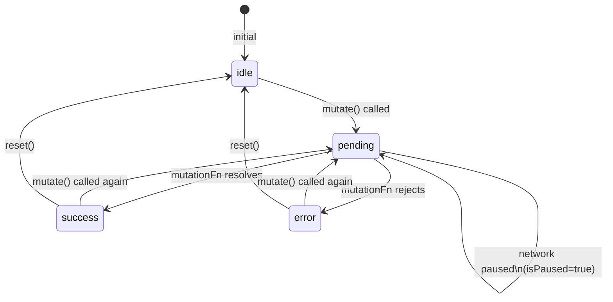

## TanStack Query — Mutation State and Lifecycle

### Overview

Every mutation managed by `useMutation` passes through a defined set of states from the moment it is invoked to the moment it settles. These states are exposed as a `status` string and a corresponding set of boolean flags on the hook's return value. Understanding the full lifecycle — including what triggers each transition, what data is available at each stage, and how state resets — is necessary for building accurate loading indicators, error boundaries, and post-mutation UI flows.

---

### State Values

`useMutation` exposes a `status` field that holds one of four string values at any point in time.

```ts
const { status } = useMutation({ mutationFn })

// Possible values:
// 'idle'    — no mutation has been called, or reset() was called
// 'pending' — mutationFn is currently executing
// 'success' — mutationFn resolved successfully
// 'error'   — mutationFn rejected
```

Each status has a corresponding boolean derived flag.

```ts
const {
  isIdle,      // status === 'idle'
  isPending,   // status === 'pending'
  isSuccess,   // status === 'success'
  isError,     // status === 'error'
} = useMutation({ mutationFn })
```

**Key Points**
- Only one status is active at a time — the flags are mutually exclusive
- `isPending` replaces `isLoading` from v4 for mutations; in v5 `isLoading` was removed from `useMutation`
- `isIdle` is `true` before the first invocation and after `reset()` is called

---

### v4 vs v5 Terminology

In TanStack Query v4, the in-progress state for mutations was exposed as `isLoading`. In v5, this was renamed to `isPending` for consistency with the `status` string value.

| Flag | v4 | v5 |
|---|---|---|
| In-progress | `isLoading` | `isPending` |
| Status string value | `'loading'` | `'pending'` |

[Inference] Codebases migrating from v4 to v5 that reference `isLoading` on `useMutation` will not receive a TypeScript error in all configurations — the flag may silently return `undefined` rather than the expected boolean. Verify during migration.

---

### Data Available Per State

Each state exposes a defined subset of data on the hook's return value.

```ts
const {
  data,    // defined only in 'success' state
  error,   // defined only in 'error' state
  variables, // defined in 'pending', 'success', and 'error' — the input passed to mutate()
} = useMutation({ mutationFn })
```

#### In idle state

```ts
// data      → undefined
// error     → null
// variables → undefined
// status    → 'idle'
```

#### In pending state

```ts
// data      → undefined (or previous success value — see note below)
// error     → null
// variables → the argument passed to mutate()
// status    → 'pending'
```

#### In success state

```ts
// data      → resolved value from mutationFn
// error     → null
// variables → the argument passed to mutate()
// status    → 'success'
```

#### In error state

```ts
// data      → undefined (or previous success value — see note below)
// error     → rejection value from mutationFn
// variables → the argument passed to mutate()
// status    → 'error'
```

**Key Points**
- `variables` persists across `pending`, `success`, and `error` — it is available for display or logging after the mutation settles
- [Inference] In some version configurations, `data` may retain the previous successful value when transitioning to `error` on a subsequent call. Verify behavior against the specific version in use rather than assuming `data` is always `undefined` in error state.

---

### State Transitions

State transitions follow a predictable path. Calling `mutate()` always initiates from the current state — it does not require being in `idle` first.

```
         reset()
           ↑
  idle ←───────── success
   │                  ↑
   │ mutate()         │ resolves
   ↓                  │
pending ──────────────┘
   │
   │ rejects
   ↓
 error ──→ (mutate() called again) ──→ pending
   │
   └──→ reset() ──→ idle
```

**Key Points**
- Calling `mutate()` from `success` or `error` transitions immediately to `pending` without passing through `idle`
- `reset()` is the only path back to `idle` from `success` or `error`
- There is no `cancelled` state — aborting a mutation (e.g., component unmount during a mutation) does not produce a distinct state transition

---

### The variables Field

`variables` holds the argument passed to the most recent `mutate()` call. It is available in `pending`, `success`, and `error` states and persists until `reset()` is called or a new `mutate()` is invoked.

```tsx
const { mutate, isPending, isSuccess, variables } = useMutation({
  mutationFn: createPost,
})

return (
  <>
    {isPending && <p>Creating "{variables.title}"...</p>}
    {isSuccess && <p>"{variables.title}" was created successfully.</p>}
    <button onClick={() => mutate({ title: 'New Post' })}>
      Create
    </button>
  </>
)
```

This allows the UI to display meaningful context — such as which item is being acted on — without storing that information in separate local state.

---

### Resetting State

`reset()` returns the mutation to `idle`, clearing `data`, `error`, `variables`, and all status flags.

```ts
const { mutate, isError, error, reset } = useMutation({ mutationFn: createPost })

return (
  <>
    {isError && (
      <div>
        <p>{error.message}</p>
        <button onClick={reset}>Dismiss</button>
      </div>
    )}
    <button onClick={() => mutate({ title: 'Post' })}>Submit</button>
  </>
)
```

**Key Points**
- `reset()` does not cancel an in-flight mutation — calling it during `pending` has no effect on the running `mutationFn`
- [Inference] Calling `reset()` while in `pending` state behavior may vary by version — verify before relying on it
- `reset()` is useful for dismissing error UI and re-enabling a form after a failed submission

---

### Lifecycle Callbacks and State

Callbacks fire at specific points in the state transition sequence. They do not control the transition — state is updated by TanStack Query internally, and callbacks are invoked as side effects of those transitions.

```
mutate(variables) called
        │
        ▼
status → 'pending'
        │
        ├── onMutate(variables) fires
        │
        ▼
mutationFn executes
        │
   ┌────┴────┐
resolves   rejects
   │           │
   ▼           ▼
status →    status →
'success'   'error'
   │           │
   ▼           ▼
onSuccess  onError
   │           │
   └─────┬─────┘
         ▼
      onSettled
```

**Key Points**
- `onMutate` fires synchronously after `mutate()` is called, before `mutationFn` executes
- The status has already transitioned to `'pending'` by the time `onMutate` runs
- `onSuccess` and `onError` fire before `onSettled` at each callback level

---

### isPending as a Submission Guard

`isPending` is the standard mechanism for disabling UI during an in-flight mutation.

```tsx
const { mutate, isPending } = useMutation({ mutationFn: submitForm })

return (
  <button
    onClick={() => mutate(formData)}
    disabled={isPending}
  >
    {isPending ? 'Submitting...' : 'Submit'}
  </button>
)
```

**Key Points**
- Disabling the trigger while `isPending` is `true` prevents duplicate submissions
- This does not prevent programmatic calls to `mutate()` — application logic that bypasses the UI must guard independently

---

### Observing Multiple Mutations

`useMutation` tracks the state of the most recent invocation only. If `mutate()` is called again before the previous invocation settles, the state reflects the new call.

```ts
const { isPending, variables } = useMutation({ mutationFn: updateTodo })

// If mutate() is called rapidly:
mutate({ id: 1, title: 'First' })
mutate({ id: 2, title: 'Second' }) // variables becomes { id: 2, title: 'Second' }
```

[Inference] Both mutations execute concurrently — TanStack Query does not queue or cancel the first when the second is called. The state and `variables` reflect the most recent call. If per-mutation state tracking is needed, each mutation should be managed by a separate `useMutation` instance or tracked through application-level state.

---

### Mutation State in MutationCache

The `MutationCache` holds all mutation instances managed by the `QueryClient`. Each mutation instance carries its own state independently of the hook.

```ts
const mutationCache = queryClient.getMutationCache()

// Access all mutations
const mutations = mutationCache.getAll()

mutations.forEach((mutation) => {
  console.log(mutation.state.status)    // 'idle' | 'pending' | 'success' | 'error'
  console.log(mutation.state.data)
  console.log(mutation.state.error)
  console.log(mutation.state.variables)
})
```

**Key Points**
- `MutationCache` retains completed mutations until they are garbage collected
- [Inference] The retention duration and eviction policy for completed mutations in `MutationCache` may be version-specific; verify against current documentation
- Accessing `MutationCache` directly is generally reserved for devtools, logging, or advanced orchestration — standard application code uses the hook return values

---

### Full Return Value Reference

```ts
const {
  // Status
  status,        // 'idle' | 'pending' | 'success' | 'error'
  isIdle,
  isPending,
  isSuccess,
  isError,

  // Outcome data
  data,          // resolved value — defined in 'success'
  error,         // rejection value — defined in 'error'
  variables,     // last mutate() argument — defined in 'pending', 'success', 'error'

  // Submission state
  isError,       // true when status === 'error'
  isPaused,      // true when mutation is paused (offline / no network)

  // Functions
  mutate,        // fire-and-forget invocation
  mutateAsync,   // Promise-returning invocation
  reset,         // reset to idle state

  // Metadata
  context,       // value returned from onMutate — available during the lifecycle
} = useMutation({ mutationFn })
```

**Key Points**
- `isPaused` reflects network-aware mutation behavior — when the network is unavailable and the mutation is queued, `isPaused` is `true` while `isPending` is also `true`
- `context` on the return value is the value returned from `onMutate` for the current invocation — not to be confused with React context

---

### Mermaid Diagram — Full Mutation State Machine



---

### Summary Table

| State | `data` | `error` | `variables` | `isPending` | `isSuccess` | `isError` |
|---|---|---|---|---|---|---|
| `idle` | `undefined` | `null` | `undefined` | `false` | `false` | `false` |
| `pending` | `undefined` | `null` | defined | `true` | `false` | `false` |
| `success` | defined | `null` | defined | `false` | `true` | `false` |
| `error` | `undefined` | defined | defined | `false` | `false` | `true` |

---

**Conclusion**

Mutation state in TanStack Query is a simple four-state machine with deterministic transitions. The boolean flags derived from `status` are the primary tool for driving conditional UI, and `variables` bridges the gap between the input that triggered the mutation and the UI that reflects its progress. Understanding that calling `mutate()` from any non-idle state transitions directly to `pending` — and that `reset()` is the only path back to `idle` — is essential for managing forms, error dismissal, and re-submission flows correctly.