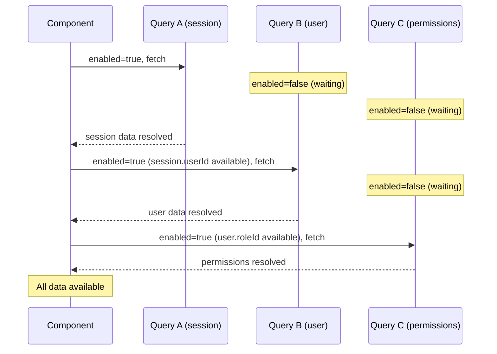

## TanStack Query — Dependent Queries

### Overview

Dependent queries are queries that cannot execute until one or more prerequisite conditions are met — typically the result of another query, a user action, or the presence of a specific value. TanStack Query handles this through the `enabled` option, which controls whether a query is allowed to run. When `enabled` is `false`, the query is skipped entirely: no fetch is initiated, no loading state is entered, and the query remains in `idle` status.

---

### The enabled Option

`enabled` accepts a boolean. When `false`, the query does not execute — not on mount, not on window focus, not on any automatic trigger. It will only run once `enabled` becomes `true`.

```ts
useQuery({
  queryKey: ['comments', postId],
  queryFn: () => fetchComments(postId),
  enabled: !!postId, // only runs when postId is defined and non-empty
})
```

**Key Points**
- `enabled: false` suppresses all automatic fetch triggers — mount, focus, reconnect, interval
- The query remains in `idle` status while disabled, not `pending`
- `enabled` is reactive — when it transitions from `false` to `true`, the query fetches immediately (subject to `staleTime`)
- Manual `refetch()` calls bypass `enabled` and execute regardless of its value [Inference — verify against version-specific documentation]

---

### idle vs pending — Status When Disabled

A disabled query that has never fetched is in `idle` status, not `pending`. This distinction matters for conditional rendering.

```ts
const { status, fetchStatus } = useQuery({
  queryKey: ['user'],
  queryFn: fetchUser,
  enabled: false,
})

// status     → 'pending'  (no data yet, has never fetched)
// fetchStatus → 'idle'    (not currently fetching)
```

In v5, TanStack Query introduced `fetchStatus` as a companion to `status` to disambiguate the disabled-but-never-fetched case from the actively-loading case.

| Scenario | `status` | `fetchStatus` |
|---|---|---|
| Disabled, never fetched | `'pending'` | `'idle'` |
| Enabled, fetching | `'pending'` | `'fetching'` |
| Enabled, fetch complete | `'success'` | `'idle'` |
| Enabled, fetch failed | `'error'` | `'idle'` |
| Paused (offline) | `'pending'` | `'paused'` |

**Key Points**
- `isLoading` in v5 is defined as `status === 'pending' && fetchStatus === 'fetching'` — it is `false` for disabled queries
- Use `isLoading` rather than `isPending` to avoid showing a loading indicator for a query that is simply waiting to be enabled

---

### Basic Sequential Dependency

The most common pattern: Query B depends on data returned by Query A.

```ts
function UserPosts({ userId }: { userId: string }) {
  // Query A — fetch user
  const { data: user } = useQuery({
    queryKey: ['user', userId],
    queryFn: () => fetchUser(userId),
  })

  // Query B — fetch posts, depends on user.accountId from Query A
  const { data: posts } = useQuery({
    queryKey: ['posts', user?.accountId],
    queryFn: () => fetchPosts(user!.accountId),
    enabled: !!user?.accountId,
  })

  return <PostList posts={posts} />
}
```

**Key Points**
- `user?.accountId` uses optional chaining — before Query A resolves, `user` is `undefined` and `accountId` is not accessed
- `!!user?.accountId` converts to boolean — the query only enables when `accountId` is a truthy value
- The non-null assertion (`user!.accountId`) inside `queryFn` is safe because `queryFn` only executes when `enabled` is `true`, at which point `user?.accountId` is confirmed truthy [Inference — assumes `enabled` reliably gates execution; verify]

---

### Chained Dependencies

Multiple queries can be chained sequentially. Each depends on the result of the previous.

```ts
// Query A
const { data: session } = useQuery({
  queryKey: ['session'],
  queryFn: fetchSession,
})

// Query B — depends on session
const { data: user } = useQuery({
  queryKey: ['user', session?.userId],
  queryFn: () => fetchUser(session!.userId),
  enabled: !!session?.userId,
})

// Query C — depends on user from Query B
const { data: permissions } = useQuery({
  queryKey: ['permissions', user?.roleId],
  queryFn: () => fetchPermissions(user!.roleId),
  enabled: !!user?.roleId,
})
```

**Key Points**
- Each query in the chain adds at minimum one network round-trip of latency
- Long chains of sequential queries are a performance concern — consider whether the server API can be restructured to return dependent data in a single response, or whether `useQueries` with parallel fetching is applicable
- [Inference] Deep chains are fragile — if any query in the chain errors, all downstream queries remain disabled indefinitely unless error handling explicitly resets the chain

---

### Dependent Queries with User Input

`enabled` can be derived from user input rather than query results.

```ts
function SearchResults() {
  const [query, setQuery] = useState('')

  const { data, isFetching } = useQuery({
    queryKey: ['search', query],
    queryFn: () => searchProducts(query),
    enabled: query.length >= 3, // only search when input is at least 3 characters
  })

  return (
    <>
      <input
        value={query}
        onChange={(e) => setQuery(e.target.value)}
        placeholder="Search..."
      />
      {isFetching && <span>Searching...</span>}
      <ResultList results={data} />
    </>
  )
}
```

---

### enabled as a Function (v5)

In TanStack Query v5, `enabled` can accept a function that receives the query and returns a boolean. This is useful for deriving the enabled state from query metadata or for expressing more complex conditions.

```ts
useQuery({
  queryKey: ['posts', filters],
  queryFn: () => fetchPosts(filters),
  enabled: (query) => {
    return filters.categoryId !== null && query.state.dataUpdateCount < 10
  },
})
```

[Inference] The function form is available in v5. Verify availability in the specific version in use before adopting this pattern.

---

### Handling the Disabled State in UI

While a query is disabled, `data` is `undefined` and no loading indicator should be shown. UI must account for this gap between "not yet started" and "loading".

```tsx
function UserProfile({ userId }: { userId: string | null }) {
  const { data: user, isLoading } = useQuery({
    queryKey: ['user', userId],
    queryFn: () => fetchUser(userId!),
    enabled: !!userId,
  })

  // userId is null — query has not started
  if (!userId) return <p>Select a user.</p>

  // userId present, query is fetching
  if (isLoading) return <p>Loading...</p>

  // Query complete
  return <p>{user?.name}</p>
}
```

**Key Points**
- `isLoading` is `false` for a disabled query — it correctly distinguishes "not started" from "in progress"
- Checking `!userId` before checking `isLoading` avoids conflating the two states
- Avoid using `isPending` alone as a loading guard — it is `true` for both disabled-never-fetched and actively-fetching states in v5

---

### Dependent Parallel Queries with useQueries

When a query produces a list of IDs, and each ID requires its own query, `useQueries` enables parallel fetching conditioned on the list being available.

```ts
function PostComments({ postIds }: { postIds?: number[] }) {
  const commentQueries = useQueries({
    queries: (postIds ?? []).map((id) => ({
      queryKey: ['comments', id],
      queryFn: () => fetchComments(id),
      enabled: !!postIds, // all queries disabled until postIds is defined
    })),
  })

  return commentQueries.map((query, i) => (
    <CommentList key={postIds?.[i]} comments={query.data} />
  ))
}
```

**Key Points**
- `useQueries` with an empty array produces no queries — it does not error
- Each query in the array can have its own `enabled` condition
- [Inference] When `postIds` transitions from `undefined` to a populated array, all queries become enabled simultaneously and fetch in parallel — this may produce a large number of concurrent requests depending on list size

---

### Avoiding Dependent Query Waterfalls

A sequential chain of dependent queries produces a waterfall — each query waits for the previous to complete before initiating. This is sometimes unavoidable when each query's input genuinely depends on the previous result, but it should be minimized.

```
Time:  ──────────────────────────────────────►
       [fetchSession]
                    [fetchUser]
                                [fetchPermissions]
```

Strategies to reduce waterfall depth:

**Combine into a single query** — if the server supports it, fetch all related data in one request.

```ts
useQuery({
  queryKey: ['bootstrap'],
  queryFn: fetchSessionUserAndPermissions, // single endpoint
})
```

**Prefetch in a parent** — initiate queries higher in the component tree before they are needed.

```ts
// In a route loader or parent component
queryClient.prefetchQuery({ queryKey: ['user', id], queryFn: () => fetchUser(id) })
```

**Move logic server-side** — in frameworks with server-side rendering support, TanStack Query's server-side prefetching can eliminate client-side waterfalls entirely.

[Inference] These strategies involve trade-offs between API coupling, caching granularity, and architectural complexity. The appropriate choice depends on the specific data access patterns of the application.

---

### Mermaid Diagram — Dependent Query Execution



---

### Summary Table

| Scenario | enabled value | Query status |
|---|---|---|
| Dependency not yet available | `false` | `'pending'` / `fetchStatus: 'idle'` |
| Dependency available | `true` | Fetches normally |
| User input below threshold | `false` | `'pending'` / `fetchStatus: 'idle'` |
| Manual refetch while disabled | N/A | Executes regardless [Inference] |
| `enabled` transitions false → true | — | Fetches immediately |

---

**Conclusion**

Dependent queries in TanStack Query are expressed entirely through the `enabled` option. The pattern is declarative — components describe the conditions under which a query should run, and TanStack Query handles the timing. The critical discipline is distinguishing `isLoading` from `isPending` to avoid treating a disabled query as a loading one, and being deliberate about query chain depth to avoid avoidable request waterfalls. When dependencies are known ahead of time and the data can be co-located, consolidating queries at the server or prefetching in a parent are the primary tools for eliminating waterfall latency.