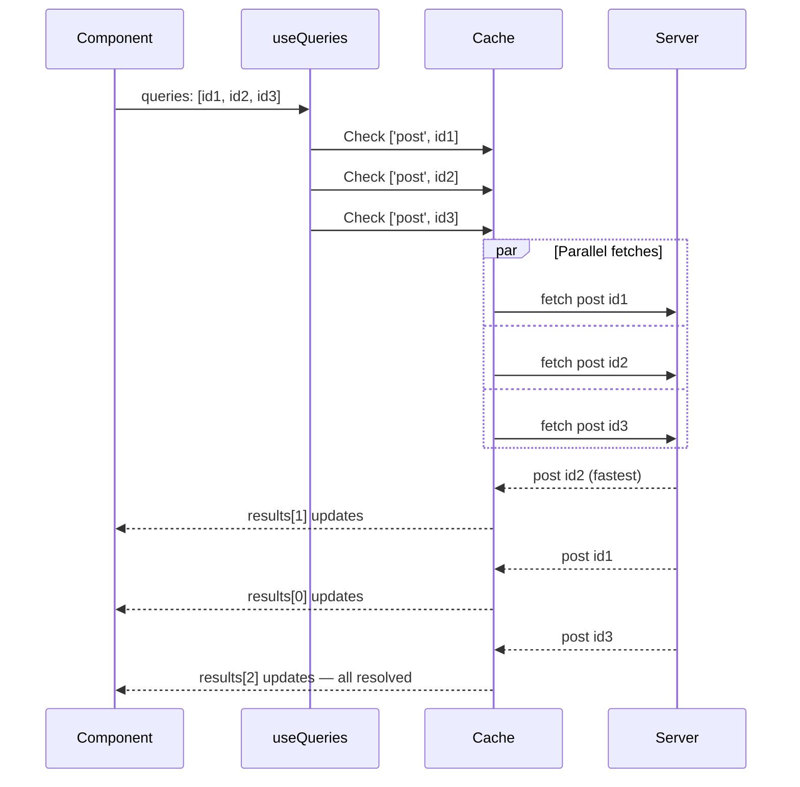

## TanStack Query — Parallel Queries

### Overview

Parallel queries are multiple queries that execute concurrently rather than sequentially. TanStack Query supports two approaches: declaring multiple `useQuery` calls in the same component, which run in parallel automatically, and using `useQueries` for dynamic lists of queries whose count is not known at render time. The goal in both cases is to minimize total data-fetching latency by avoiding unnecessary sequential dependencies.

---

### Static Parallel Queries

When a component needs multiple independent data sources, multiple `useQuery` calls can be declared side by side. React renders them in the same pass, and TanStack Query initiates all fetches concurrently.

```ts
function Dashboard() {
  const usersQuery = useQuery({
    queryKey: ['users'],
    queryFn: fetchUsers,
  })

  const projectsQuery = useQuery({
    queryKey: ['projects'],
    queryFn: fetchProjects,
  })

  const metricsQuery = useQuery({
    queryKey: ['metrics'],
    queryFn: fetchMetrics,
  })

  const isLoading =
    usersQuery.isLoading ||
    projectsQuery.isLoading ||
    metricsQuery.isLoading

  const isError =
    usersQuery.isError ||
    projectsQuery.isError ||
    metricsQuery.isError

  if (isLoading) return <p>Loading...</p>
  if (isError) return <p>Error loading dashboard data.</p>

  return (
    <Dashboard
      users={usersQuery.data}
      projects={projectsQuery.data}
      metrics={metricsQuery.data}
    />
  )
}
```

**Key Points**
- Each `useQuery` call is independent — they do not share state or affect each other's fetch lifecycle
- All three fetches initiate on the same render, not sequentially
- Aggregating `isLoading` and `isError` across queries is a manual concern — there is no built-in combined status for static parallel queries
- [Inference] The actual concurrency is subject to browser connection limits per origin; TanStack Query initiates requests simultaneously but the network layer may queue them

---

### Rules of Hooks Constraint

Static `useQuery` calls must follow the Rules of Hooks — they cannot be called conditionally or inside loops. This limits static parallel queries to cases where the number of queries is fixed at compile time.

```ts
// CORRECT — fixed number of hooks
const aQuery = useQuery({ queryKey: ['a'], queryFn: fetchA })
const bQuery = useQuery({ queryKey: ['b'], queryFn: fetchB })

// INCORRECT — hooks inside a loop violate Rules of Hooks
items.forEach(item => {
  useQuery({ queryKey: ['item', item.id], queryFn: () => fetchItem(item.id) })
})
```

When the number of queries is dynamic — driven by an array of IDs or a runtime value — `useQueries` is required.

---

### useQueries — Dynamic Parallel Queries

`useQueries` accepts an array of query option objects and returns an array of query results in the same order. It is the correct tool when the number of parallel queries is determined at runtime.

```ts
import { useQueries } from '@tanstack/react-query'

function PostList({ postIds }: { postIds: number[] }) {
  const postQueries = useQueries({
    queries: postIds.map((id) => ({
      queryKey: ['post', id],
      queryFn: () => fetchPost(id),
    })),
  })

  return (
    <ul>
      {postQueries.map((query, index) => (
        <li key={postIds[index]}>
          {query.isLoading ? 'Loading...' : query.data?.title}
        </li>
      ))}
    </ul>
  )
}
```

**Key Points**
- The returned array has the same length and order as the input `queries` array
- Each element of the returned array is a full query result object — identical in shape to a `useQuery` return value
- `useQueries` with an empty array (`queries: []`) is valid and returns an empty array — no error is thrown
- Adding or removing items from the `queries` array between renders correctly adds or removes queries from the cache

---

### useQueries Return Shape

```ts
const results = useQueries({
  queries: [
    { queryKey: ['user', 1], queryFn: () => fetchUser(1) },
    { queryKey: ['user', 2], queryFn: () => fetchUser(2) },
    { queryKey: ['user', 3], queryFn: () => fetchUser(3) },
  ],
})

// results[0] — full query result for ['user', 1]
// results[1] — full query result for ['user', 2]
// results[2] — full query result for ['user', 3]

const { data, isLoading, isError, error } = results[0]
```

---

### Aggregating useQueries Results

Because `useQueries` returns an array, aggregating status across all queries requires reducing the array manually.

```ts
const allLoading = postQueries.some(q => q.isLoading)
const anyError   = postQueries.some(q => q.isError)
const allSuccess = postQueries.every(q => q.isSuccess)
const allData    = postQueries.map(q => q.data).filter(Boolean)
```

**Key Points**
- `.some(q => q.isLoading)` — true if any query is still loading
- `.every(q => q.isSuccess)` — true only when all queries have resolved successfully
- `.filter(Boolean)` on `.map(q => q.data)` filters out `undefined` entries from queries that have not yet resolved

---

### combine Option (v5)

TanStack Query v5 introduced a `combine` option on `useQueries` that transforms the array of results into a single derived value. This eliminates the need to reduce the array at the call site.

```ts
const { data, isLoading, isError } = useQueries({
  queries: postIds.map((id) => ({
    queryKey: ['post', id],
    queryFn: () => fetchPost(id),
  })),
  combine: (results) => ({
    data: results.map(r => r.data).filter(Boolean),
    isLoading: results.some(r => r.isLoading),
    isError: results.some(r => r.isError),
  }),
})
```

**Key Points**
- `combine` receives the full array of query results and returns any shape
- The return type of `useQueries` when `combine` is provided becomes the return type of the `combine` function
- [Inference] `combine` runs on every render in which any query result changes — complex derivations may benefit from memoization inside the function if performance is a concern
- `combine` is a v5 feature; it is not available in v4

---

### Per-Query Configuration in useQueries

Each query object in the `queries` array supports the full set of `useQuery` options — `staleTime`, `gcTime`, `enabled`, `retry`, and so on.

```ts
useQueries({
  queries: [
    {
      queryKey: ['config'],
      queryFn: fetchConfig,
      staleTime: Infinity,        // config rarely changes
    },
    {
      queryKey: ['notifications'],
      queryFn: fetchNotifications,
      refetchInterval: 30_000,    // poll every 30 seconds
    },
    {
      queryKey: ['draft', draftId],
      queryFn: () => fetchDraft(draftId),
      enabled: !!draftId,         // conditional
    },
  ],
})
```

---

### Parallel Queries with Shared queryClient

All queries — whether declared with `useQuery` or `useQueries` — share the same `QueryClient` instance and therefore the same cache. If two parallel queries use the same query key, they share a single cache entry and a single in-flight request — they are deduplicated automatically.

```ts
// These two hooks resolve to the same cache entry
const a = useQuery({ queryKey: ['user', 1], queryFn: () => fetchUser(1) })
const b = useQuery({ queryKey: ['user', 1], queryFn: () => fetchUser(1) })

// Only one network request is made
```

[Inference] Deduplication applies when the queries are active simultaneously and the query key is identical. Queries with different keys, even with the same `queryFn`, do not deduplicate — each produces its own cache entry and network request.

---

### Parallel vs Sequential — Latency Comparison

```
Sequential (dependent queries):
──────────────────────────────────────►
[fetchA]──[fetchB]──[fetchC]
 Total latency = A + B + C

Parallel (useQueries or multiple useQuery):
──────────────────────────────────────►
[fetchA]──────────────────┐
[fetchB]────────┐          │
[fetchC]──────────────┐    │
                       └───┴─► All resolved
 Total latency ≈ max(A, B, C)
```

For three queries with latencies of 300ms, 150ms, and 400ms:
- Sequential total: ~850ms
- Parallel total: ~400ms

**Key Points**
- Parallel queries are only applicable when each query is independent — no query's input depends on another's output
- Where a dependency exists, the dependent query must be gated with `enabled` and will run sequentially by necessity

---

### Large Dynamic Query Lists

When `postIds` is a large array, `useQueries` produces a proportionally large number of concurrent requests. This can saturate the browser's connection pool or place heavy load on the server.

Strategies for managing large parallel query sets:

**Batch at the API level** — replace N individual queries with one query that accepts a list.

```ts
// Instead of N queries for N ids
useQueries({ queries: ids.map(id => ({ queryKey: ['item', id], queryFn: () => fetchItem(id) })) })

// Use one batched query
useQuery({ queryKey: ['items', ids], queryFn: () => fetchItems(ids) })
```

**Limit concurrency at the queryFn level** — apply a concurrency limiter within the fetch logic.

[Inference] TanStack Query does not provide built-in concurrency limiting for `useQueries`. Limiting concurrency requires application-level tooling such as a semaphore or a library like `p-limit`. This is not a built-in feature.

---

### Prefetching for Parallel Queries

When the list of required query keys is known before the component renders — in a route loader, for example — all queries can be prefetched in parallel using `Promise.all`.

```ts
// In a route loader or server-side setup
await Promise.all(
  postIds.map(id =>
    queryClient.prefetchQuery({
      queryKey: ['post', id],
      queryFn: () => fetchPost(id),
    })
  )
)
```

When the component mounts, all data is already in the cache and no loading state is shown.

---

### Mermaid Diagram — useQueries Parallel Execution



---

### Summary Table

| Approach | Use Case | Hook Count | Dynamic Count |
|---|---|---|---|
| Multiple `useQuery` | Fixed number of independent queries | N hooks | No |
| `useQueries` | Dynamic or runtime-determined query list | 1 hook | Yes |
| `useQueries` + `combine` (v5) | Dynamic list with derived aggregated result | 1 hook | Yes |
| Batched single query | Large lists where N+1 is a concern | 1 hook | Yes |

---

**Conclusion**

Parallel queries eliminate sequential latency for independent data requirements. Static `useQuery` declarations handle fixed query counts within the constraints of the Rules of Hooks. `useQueries` handles dynamic query sets with a single hook call, returning results in input order and supporting per-query configuration. The v5 `combine` option reduces the boilerplate of result aggregation. The primary discipline is recognizing when queries are genuinely independent — and therefore parallelizable — versus when one query's output is another's input, which requires the sequential `enabled` pattern covered in dependent queries.