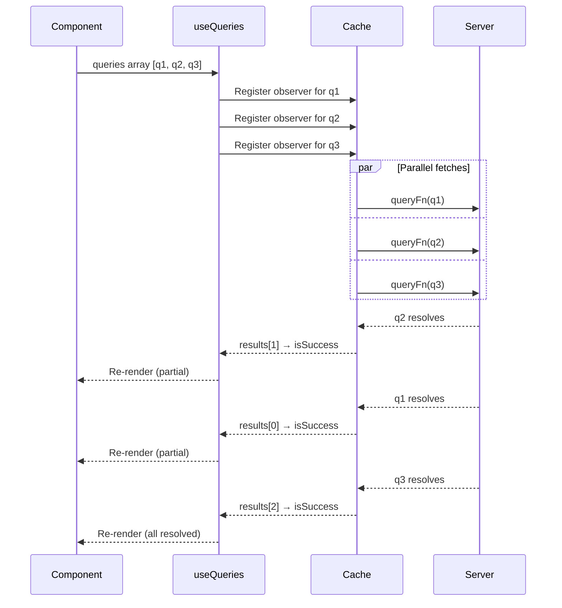

## TanStack Query — useQueries for Dynamic Parallel Queries

### Overview

`useQueries` is the designated hook for executing a variable number of queries in parallel. Where `useQuery` must be called a fixed number of times per component — constrained by the Rules of Hooks — `useQueries` accepts an array of query definitions and manages them as a single hook call. The number of queries in that array can change between renders. Each query in the array is independent, fully configurable, and backed by its own cache entry.

---

### Basic Signature

```ts
import { useQueries } from '@tanstack/react-query'

const results = useQueries({
  queries: QueryObserverOptions[],
  combine?: (results: QueryObserverResult[]) => TCombinedResult, // v5 only
})
```

`queries` is an array of query option objects. Each object accepts the full set of options available to `useQuery` — `queryKey`, `queryFn`, `staleTime`, `enabled`, `retry`, and so on.

The return value is an array of query result objects in the same order as the input array, unless `combine` is provided.

---

### Minimal Example

```ts
function PostDetails({ postIds }: { postIds: number[] }) {
  const results = useQueries({
    queries: postIds.map((id) => ({
      queryKey: ['post', id],
      queryFn: () => fetchPost(id),
    })),
  })

  return (
    <ul>
      {results.map((result, index) => (
        <li key={postIds[index]}>
          {result.isLoading
            ? 'Loading...'
            : result.isError
            ? 'Error'
            : result.data?.title}
        </li>
      ))}
    </ul>
  )
}
```

**Key Points**
- `results` has the same length as `postIds`
- `results[i]` corresponds to `postIds[i]` — order is preserved
- An empty `postIds` array produces an empty `results` array without error

---

### Return Value Shape

Each element of the returned array is identical in shape to a `useQuery` return value.

```ts
const results = useQueries({
  queries: [
    { queryKey: ['user', 1], queryFn: () => fetchUser(1) },
    { queryKey: ['user', 2], queryFn: () => fetchUser(2) },
  ],
})

// Each result exposes the full query result interface:
const {
  data,
  error,
  status,
  isLoading,
  isPending,
  isSuccess,
  isError,
  isFetching,
  isRefetching,
  refetch,
  // ...
} = results[0]
```

---

### Dynamic Query Count

`useQueries` correctly handles changes to the length and content of the `queries` array between renders.

```ts
const [selectedIds, setSelectedIds] = useState<number[]>([1, 2])

const results = useQueries({
  queries: selectedIds.map((id) => ({
    queryKey: ['item', id],
    queryFn: () => fetchItem(id),
  })),
})

// Adding an id adds a query — the new query fetches immediately
// Removing an id removes the observer — the cache entry remains until gcTime elapses
```

**Key Points**
- Adding an ID to the array causes a new query to be registered and fetched
- Removing an ID unsubscribes the observer — the cache entry is retained until `gcTime` elapses, not immediately evicted
- Reordering the array does not refetch — queries are matched by `queryKey`, not position [Inference — verify against version-specific implementation]

---

### Per-Query Configuration

Each query object in the array supports independent configuration. Queries in the same `useQueries` call do not share options.

```ts
useQueries({
  queries: [
    {
      queryKey: ['config'],
      queryFn: fetchConfig,
      staleTime: Infinity,
      gcTime: Infinity,
    },
    {
      queryKey: ['notifications'],
      queryFn: fetchNotifications,
      refetchInterval: 15_000,
      staleTime: 10_000,
    },
    {
      queryKey: ['report', reportId],
      queryFn: () => fetchReport(reportId),
      enabled: !!reportId,
      retry: 1,
    },
  ],
})
```

---

### Aggregating Results Manually

Without `combine`, aggregation is done by reducing the results array.

```ts
const results = useQueries({
  queries: ids.map((id) => ({
    queryKey: ['item', id],
    queryFn: () => fetchItem(id),
  })),
})

const isAnyLoading  = results.some(r => r.isLoading)
const isAnyError    = results.some(r => r.isError)
const isAllSuccess  = results.every(r => r.isSuccess)
const data          = results.map(r => r.data).filter((d): d is Item => d !== undefined)
const errors        = results.filter(r => r.isError).map(r => r.error)
```

**Key Points**
- `.some(r => r.isLoading)` returns `true` if any query is still loading
- `.every(r => r.isSuccess)` is `true` only when all queries have successfully resolved
- The type predicate `(d): d is Item => d !== undefined` narrows the type of `data` in TypeScript, removing `undefined` entries without widening the type to `(Item | undefined)[]`

---

### combine Option (v5)

The `combine` option transforms the raw results array into a single derived value. It is called with the full array of query results and can return any shape.

```ts
const { data, isLoading, errors } = useQueries({
  queries: postIds.map((id) => ({
    queryKey: ['post', id],
    queryFn: () => fetchPost(id),
  })),
  combine: (results) => ({
    data: results
      .filter(r => r.isSuccess)
      .map(r => r.data as Post),
    isLoading: results.some(r => r.isLoading),
    errors: results
      .filter(r => r.isError)
      .map(r => r.error),
  }),
})
```

The return type of `useQueries` becomes the return type of `combine`. Without `combine`, the return type is `QueryObserverResult[]`.

**Key Points**
- `combine` runs whenever any query result changes
- [Inference] Returning new object or array references from `combine` on every call may produce unnecessary re-renders in components that rely on referential equality — memoize derived values inside `combine` if this is a concern
- `combine` is a v5-only feature; it does not exist in v4

#### Typed combine Example

```ts
type CombinedResult = {
  posts: Post[]
  isLoading: boolean
  hasError: boolean
}

const result = useQueries<Post[], Error, CombinedResult>({
  queries: postIds.map(id => ({
    queryKey: ['post', id] as const,
    queryFn: () => fetchPost(id),
  })),
  combine: (results): CombinedResult => ({
    posts: results.flatMap(r => r.data ? [r.data] : []),
    isLoading: results.some(r => r.isLoading),
    hasError: results.some(r => r.isError),
  }),
})
```

---

### Conditional Queries Within useQueries

Individual queries in the array can be conditionally disabled using `enabled`, without affecting the other queries.

```ts
const results = useQueries({
  queries: items.map((item) => ({
    queryKey: ['detail', item.id],
    queryFn: () => fetchDetail(item.id),
    enabled: item.needsDetail, // per-item condition
  })),
})
```

Disabled queries remain in `pending` / `fetchStatus: 'idle'` state. They do not block other queries in the array from executing.

---

### Handling Empty Arrays

When the input array is empty, `useQueries` returns an empty array. This is a valid and handled state — no special guard is needed.

```ts
const results = useQueries({
  queries: [],
})
// results → []
// isAnyLoading → false (results.some(...) on empty array returns false)
// isAllSuccess → true  (results.every(...) on empty array returns true)
```

**Key Points**
- `.every()` on an empty array returns `true` by JavaScript semantics — "all of zero items satisfy the condition" is vacuously true
- If `isAllSuccess` being `true` on an empty array is semantically incorrect for the application, guard with `results.length > 0 && results.every(r => r.isSuccess)`

---

### Query Key Stability

Query keys passed to `useQueries` should be stable across renders. Unstable keys — constructed with inline objects or arrays that produce new references on every render — cause unnecessary cache misses and refetches.

```ts
// CORRECT — primitive values produce stable keys
queries: ids.map(id => ({
  queryKey: ['post', id],
  queryFn: () => fetchPost(id),
}))

// PROBLEMATIC — inline object in key produces new reference each render
queries: ids.map(id => ({
  queryKey: ['post', { id }], // new object reference on every render
  queryFn: () => fetchPost(id),
}))
```

[Inference] TanStack Query serializes query keys for comparison, so plain objects with the same shape and values may compare as equal depending on the serialization strategy used by the version in use. Verify key stability behavior rather than assuming referential equality is used.

---

### useQueries and queryClient.fetchQuery

For cases where parallel data fetching needs to occur outside of a component — in a route loader, a prefetch step, or server-side rendering — `Promise.all` with `queryClient.fetchQuery` or `queryClient.prefetchQuery` is the equivalent of `useQueries`.

```ts
// Outside a component — equivalent parallel fetch
const results = await Promise.all(
  postIds.map(id =>
    queryClient.fetchQuery({
      queryKey: ['post', id],
      queryFn: () => fetchPost(id),
    })
  )
)
```

When the component subsequently mounts and calls `useQueries` with the same keys, data is already in the cache and no loading state is shown.

---

### N+1 Query Consideration

`useQueries` with a large `ids` array produces one network request per ID. This is the client-side equivalent of the N+1 query problem. For large lists, batching at the API level is preferable.

```ts
// N requests — one per id
useQueries({
  queries: ids.map(id => ({
    queryKey: ['item', id],
    queryFn: () => fetchItem(id),
  })),
})

// 1 request — all ids in one call
useQuery({
  queryKey: ['items', ids],
  queryFn: () => fetchItems(ids),
})
```

**Key Points**
- The batched approach sacrifices per-item cache granularity — invalidating `['items', ids]` invalidates all items at once
- The per-item approach preserves granularity but multiplies requests
- [Inference] The appropriate trade-off depends on how frequently individual items are mutated versus how frequently the full list is needed together

---

### Mermaid Diagram — useQueries Lifecycle



---

### Summary Table

| Concern | Behavior |
|---|---|
| Return type (no `combine`) | `QueryObserverResult[]` — same order as input |
| Return type (with `combine`) | Return type of `combine` function |
| Empty `queries` array | Returns `[]`, no error |
| Dynamic array length | Correctly adds/removes query observers between renders |
| Per-query options | Full `useQuery` option set supported per entry |
| Shared cache | All queries share the `QueryClient` cache — same key = same entry |
| `combine` availability | v5 only |
| Rules of Hooks | Satisfied — single hook call regardless of query count |

---

**Conclusion**

`useQueries` solves a specific problem that neither `useQuery` nor `Promise.all` addresses cleanly: subscribing to a dynamically sized set of cached, observable queries within a component. Its array-in / array-out contract is predictable, its per-query configurability is complete, and the v5 `combine` option reduces aggregation boilerplate at the call site. The primary operational concern is scale — for large ID arrays, the N+1 request pattern it naturally produces should be evaluated against the granularity benefits of per-item caching, with batched API calls considered as an alternative when the list size makes individual requests impractical.