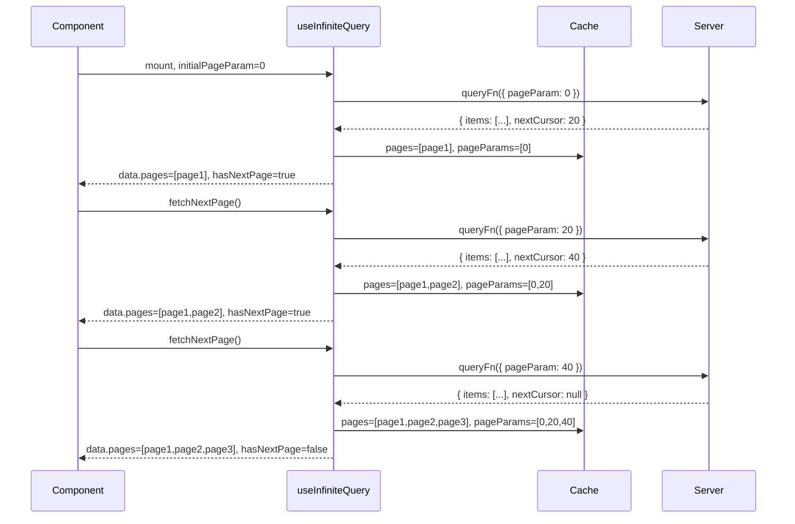

## TanStack Query — Infinite Queries with useInfiniteQuery

### Overview

`useInfiniteQuery` is the TanStack Query hook for paginated or incrementally loaded data — lists that grow as the user requests more content. Unlike `useQuery`, which manages a single discrete result, `useInfiniteQuery` accumulates successive fetch results into a unified data structure. Each fetch appends a new page to the existing set. The hook provides the controls and state necessary to trigger next-page and previous-page fetches, detect boundaries, and track loading state across the full accumulated dataset.

---

### Core Differences from useQuery

| Concern | `useQuery` | `useInfiniteQuery` |
|---|---|---|
| `data` shape | Single result | `{ pages: TData[], pageParams: unknown[] }` |
| Fetch trigger | Automatic (mount, stale) | Automatic for first page; manual for subsequent |
| Page parameters | N/A | Managed by `getNextPageParam` / `getPreviousPageParam` |
| Refetch behavior | Fetches once | Refetches all accumulated pages |
| Cache entry | Single value | Array of pages + array of page params |

---

### Required Options

```ts
useInfiniteQuery({
  queryKey: ['posts'],
  queryFn: ({ pageParam }) => fetchPosts(pageParam),
  initialPageParam: 0,             // required in v5
  getNextPageParam: (lastPage, allPages, lastPageParam) => {
    // Return the next page param, or undefined to signal no more pages
    return lastPage.nextCursor ?? undefined
  },
})
```

**Key Points**
- `queryFn` receives a `QueryFunctionContext` object — `pageParam` is accessed via destructuring
- `initialPageParam` is the value of `pageParam` on the very first fetch — required in v5, defaults to `undefined` in v4
- `getNextPageParam` receives the last fetched page, all pages accumulated so far, and the last page param used — it returns the next page param or `undefined` / `null` to indicate the end of the list
- If `getNextPageParam` returns `undefined` or `null`, `hasNextPage` becomes `false`

---

### Data Shape

The `data` object returned by `useInfiniteQuery` is not a flat list — it is a structured object containing two parallel arrays.

```ts
data: {
  pages: TData[]        // one entry per fetched page, in fetch order
  pageParams: unknown[] // one entry per page, the param used to fetch it
}
```

#### Example — cursor-based API

After fetching three pages with cursors `0`, `20`, and `40`:

```ts
data.pages      // [page1Result, page2Result, page3Result]
data.pageParams // [0, 20, 40]
```

To render a flat list, the pages array must be flattened at the application level.

```ts
const allPosts = data.pages.flatMap(page => page.items)
```

---

### Basic Implementation — Cursor-Based Pagination

```ts
import { useInfiniteQuery } from '@tanstack/react-query'

type Post = { id: number; title: string }
type PageResult = { items: Post[]; nextCursor: number | null }

function PostFeed() {
  const {
    data,
    fetchNextPage,
    hasNextPage,
    isFetchingNextPage,
    isLoading,
    isError,
    error,
  } = useInfiniteQuery({
    queryKey: ['posts'],
    queryFn: ({ pageParam }): Promise<PageResult> =>
      fetch(`/api/posts?cursor=${pageParam}`).then(r => r.json()),
    initialPageParam: 0,
    getNextPageParam: (lastPage) => lastPage.nextCursor ?? undefined,
  })

  if (isLoading) return <p>Loading...</p>
  if (isError) return <p>Error: {error.message}</p>

  return (
    <div>
      {data.pages.flatMap(page =>
        page.items.map(post => <div key={post.id}>{post.title}</div>)
      )}

      <button
        onClick={() => fetchNextPage()}
        disabled={!hasNextPage || isFetchingNextPage}
      >
        {isFetchingNextPage
          ? 'Loading more...'
          : hasNextPage
          ? 'Load more'
          : 'No more posts'}
      </button>
    </div>
  )
}
```

---

### Page-Number Based Pagination

When the API uses page numbers rather than cursors, `getNextPageParam` derives the next page number from the accumulated data.

```ts
type PageResult = {
  items: Post[]
  totalPages: number
  currentPage: number
}

useInfiniteQuery({
  queryKey: ['posts'],
  queryFn: ({ pageParam }) =>
    fetch(`/api/posts?page=${pageParam}`).then(r => r.json()),
  initialPageParam: 1,
  getNextPageParam: (lastPage) => {
    const next = lastPage.currentPage + 1
    return next <= lastPage.totalPages ? next : undefined
  },
})
```

---

### Fetching in Both Directions

`useInfiniteQuery` supports bidirectional pagination through `getPreviousPageParam` and `fetchPreviousPage`. This is applicable to chronologically ordered feeds where the user may scroll upward to load older content.

```ts
useInfiniteQuery({
  queryKey: ['messages', channelId],
  queryFn: ({ pageParam }) => fetchMessages(channelId, pageParam),
  initialPageParam: null,
  getNextPageParam: (lastPage) => lastPage.newerCursor ?? undefined,
  getPreviousPageParam: (firstPage) => firstPage.olderCursor ?? undefined,
})
```

```ts
const {
  fetchPreviousPage,
  hasPreviousPage,
  isFetchingPreviousPage,
} = useInfiniteQuery({ ... })
```

**Key Points**
- `getPreviousPageParam` receives the first page in `pages`, all pages, and the first page param
- Pages fetched via `fetchPreviousPage` are prepended to `data.pages`
- Pages fetched via `fetchNextPage` are appended to `data.pages`

---

### Status and Fetching Flags

`useInfiniteQuery` extends the standard query status flags with additional flags specific to multi-page state.

```ts
const {
  // Standard flags
  isLoading,           // true on first fetch with no cached data
  isFetching,          // true during any in-flight fetch
  isSuccess,
  isError,

  // Infinite-specific flags
  isFetchingNextPage,     // true while fetchNextPage is in progress
  isFetchingPreviousPage, // true while fetchPreviousPage is in progress
  hasNextPage,            // true if getNextPageParam returned a non-null/undefined value
  hasPreviousPage,        // true if getPreviousPageParam returned a non-null/undefined value
  isFetchNextPageError,   // true if the most recent fetchNextPage call failed (v5)
  isFetchPreviousPageError, // true if the most recent fetchPreviousPage call failed (v5)
} = useInfiniteQuery({ ... })
```

**Key Points**
- `isFetching` is `true` for any fetch — initial, next page, previous page, or background refetch
- `isFetchingNextPage` and `isFetchingPreviousPage` allow distinguishing which direction is loading
- `isLoading` refers to the initial page only — subsequent page fetches do not set `isLoading` to `true`

---

### Refetching Infinite Queries

When TanStack Query refetches an infinite query — due to stale data, window focus, or explicit invalidation — it refetches all accumulated pages sequentially, not just the first page. This ensures the full displayed list is consistent with server state.

```
data.pages = [page1, page2, page3]
     ↓ refetch triggered
Fetch page1 with pageParams[0]
Fetch page2 with pageParams[1]
Fetch page3 with pageParams[2]
     ↓ all resolve
data.pages = [freshPage1, freshPage2, freshPage3]
```

[Inference] Refetching all pages sequentially means the cost of a refetch grows with the number of accumulated pages. In applications where users can scroll through many pages, this may produce significant network activity on refetch. `maxPages` (v5) can bound the number of stored pages to mitigate this.

---

### maxPages (v5)

`maxPages` limits the number of pages retained in `data.pages`. When the limit is reached, adding a new page evicts the oldest page from the opposite end.

```ts
useInfiniteQuery({
  queryKey: ['posts'],
  queryFn: ({ pageParam }) => fetchPosts(pageParam),
  initialPageParam: 0,
  getNextPageParam: (lastPage) => lastPage.nextCursor ?? undefined,
  getPreviousPageParam: (firstPage) => firstPage.previousCursor ?? undefined,
  maxPages: 5, // retain at most 5 pages
})
```

**Key Points**
- With `maxPages: 5`, fetching a 6th page evicts page 1 — `hasPreviousPage` becomes `true` as the evicted page is now "before" the window
- This bounds both memory usage and the number of pages refetched on stale revalidation
- `maxPages` requires `getPreviousPageParam` to be defined — without it, TanStack Query cannot determine how to re-fetch the evicted pages if the user scrolls back [Inference — verify against v5 documentation]

---

### Flattening Pages for Rendering

`data.pages` is an array of page results — its exact structure depends on the API response shape. Flattening is always the application's responsibility.

```ts
// API returns { items: Post[], nextCursor: number | null }
const posts = data?.pages.flatMap(page => page.items) ?? []

// API returns Post[] directly
const posts = data?.pages.flat() ?? []

// API returns { data: { results: Post[] } }
const posts = data?.pages.flatMap(page => page.data.results) ?? []
```

---

### Intersection Observer Integration — Infinite Scroll

A common pattern pairs `useInfiniteQuery` with `IntersectionObserver` to trigger `fetchNextPage` automatically when a sentinel element enters the viewport.

```tsx
import { useRef, useEffect } from 'react'

function InfinitePostFeed() {
  const sentinelRef = useRef<HTMLDivElement>(null)

  const {
    data,
    fetchNextPage,
    hasNextPage,
    isFetchingNextPage,
  } = useInfiniteQuery({
    queryKey: ['posts'],
    queryFn: ({ pageParam }) => fetchPosts(pageParam),
    initialPageParam: 0,
    getNextPageParam: (lastPage) => lastPage.nextCursor ?? undefined,
  })

  useEffect(() => {
    const sentinel = sentinelRef.current
    if (!sentinel) return

    const observer = new IntersectionObserver((entries) => {
      if (entries[0].isIntersecting && hasNextPage && !isFetchingNextPage) {
        fetchNextPage()
      }
    })

    observer.observe(sentinel)
    return () => observer.disconnect()
  }, [fetchNextPage, hasNextPage, isFetchingNextPage])

  return (
    <div>
      {data?.pages.flatMap(page =>
        page.items.map(post => <PostCard key={post.id} post={post} />)
      )}

      <div ref={sentinelRef}>
        {isFetchingNextPage && <p>Loading more...</p>}
      </div>
    </div>
  )
}
```

[Inference] `fetchNextPage` identity may change between renders — including it in the `useEffect` dependency array is correct but may cause the observer to be re-registered more frequently than necessary. Wrapping `fetchNextPage` in `useCallback` or using a ref to stabilize it are common mitigations.

---

### select with Infinite Queries

The `select` option can transform `data` before it reaches the component, including flattening the pages array.

```ts
useInfiniteQuery({
  queryKey: ['posts'],
  queryFn: ({ pageParam }) => fetchPosts(pageParam),
  initialPageParam: 0,
  getNextPageParam: (lastPage) => lastPage.nextCursor ?? undefined,
  select: (data) => ({
    pages: data.pages,
    pageParams: data.pageParams,
    flatPosts: data.pages.flatMap(page => page.items),
  }),
})
```

**Key Points**
- `select` receives the full `{ pages, pageParams }` object for infinite queries
- The return value of `select` replaces `data` on the hook result
- [Inference] `select` runs on every render in which `data` changes — for large page sets, complex transforms inside `select` may benefit from memoization

---

### Mermaid Diagram — useInfiniteQuery Page Accumulation



---

### Summary Table

| Option / Flag | Purpose |
|---|---|
| `initialPageParam` | Value of `pageParam` on the first fetch |
| `getNextPageParam` | Derives next page param from last page result; return `undefined` to signal end |
| `getPreviousPageParam` | Derives previous page param from first page result |
| `maxPages` | Bounds the number of pages retained in cache (v5) |
| `fetchNextPage()` | Triggers fetch of the next page |
| `fetchPreviousPage()` | Triggers fetch of the previous page |
| `hasNextPage` | `true` when `getNextPageParam` returns a defined value |
| `hasPreviousPage` | `true` when `getPreviousPageParam` returns a defined value |
| `isFetchingNextPage` | `true` while a next-page fetch is in progress |
| `isFetchingPreviousPage` | `true` while a previous-page fetch is in progress |
| `data.pages` | Array of accumulated page results |
| `data.pageParams` | Array of page params used to fetch each page |

---

**Conclusion**

`useInfiniteQuery` extends TanStack Query's caching and lifecycle model to cover incrementally loaded lists. Its central design decision — accumulating pages into a structured `{ pages, pageParams }` object rather than merging them into a flat list — preserves per-page identity, enables bidirectional pagination, and allows refetching all pages consistently. The `getNextPageParam` function is the pivot of the entire model: it encodes the pagination contract between the API and the hook, and its return value determines whether more pages exist. Flattening, rendering, and scroll-triggered fetching are left to the application, keeping the hook's contract minimal and composable.