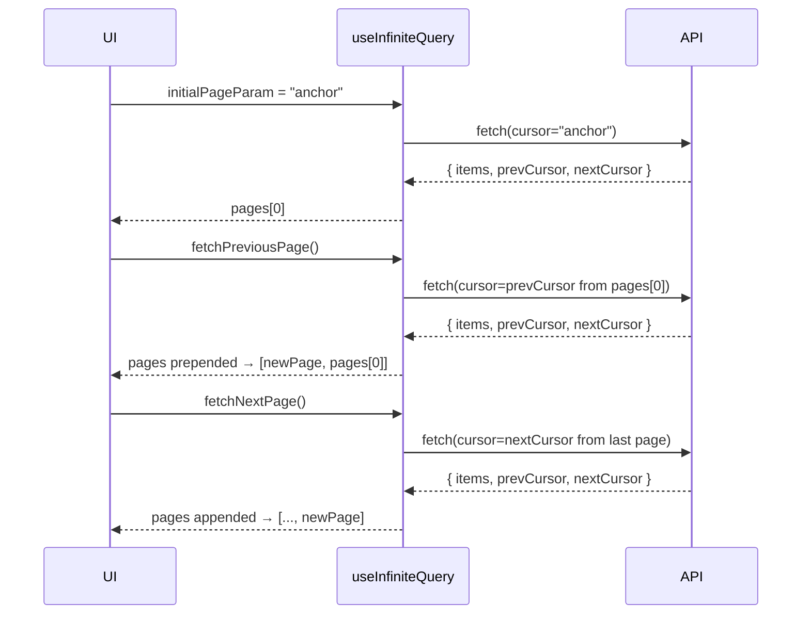
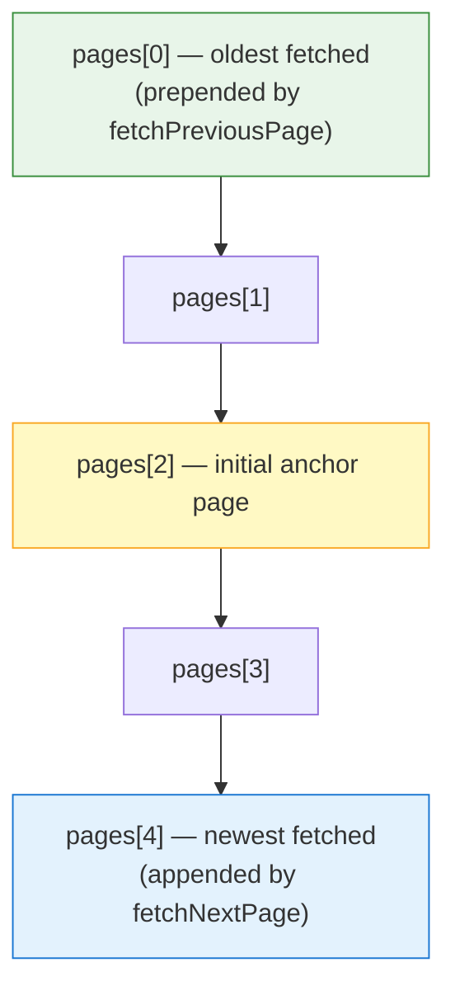

## TanStack Query — Advanced Querying — Bi-directional Infinite Scroll

### Overview

Bi-directional infinite scroll extends the standard infinite scroll pattern by supporting pagination in **both directions** — loading older content downward and newer content upward (or vice versa, depending on orientation). This is common in chat interfaces, timelines, and log viewers where a user may land mid-list and need to scroll both ways.

TanStack Query provides explicit support for this through the `getPreviousPageParam` option alongside the familiar `getNextPageParam`, and exposes `fetchPreviousPage` / `hasPreviousPage` counterparts to the forward-direction API.

---

### Core Concepts

#### The Two-Direction Model

Standard infinite queries only track a "next cursor." Bi-directional queries track **two cursors simultaneously**:

- A **forward cursor** — points to the next page ahead
- A **backward cursor** — points to the previous page behind

Both are derived from page data on each fetch and stored implicitly in the `pages` array managed by TanStack Query.

#### Page Array Growth

Each fetch — whether forward or backward — appends or prepends to the `pages` array:

- `fetchNextPage()` → appends to `pages`
- `fetchPreviousPage()` → **prepends** to `pages`

This means the order of `pages` always reflects the order items were fetched relative to each other, and the rendering layer must account for this.

---

### `useInfiniteQuery` Configuration

```ts
import { useInfiniteQuery } from '@tanstack/react-query'

const query = useInfiniteQuery({
  queryKey: ['messages', channelId],
  queryFn: async ({ pageParam }) => {
    const res = await fetch(`/api/messages?cursor=${pageParam}&limit=20`)
    return res.json()
    // Expected shape: { items: [...], nextCursor: string | null, prevCursor: string | null }
  },
  initialPageParam: 'anchor-cursor-xyz',
  getNextPageParam: (lastPage) => lastPage.nextCursor ?? undefined,
  getPreviousPageParam: (firstPage) => firstPage.prevCursor ?? undefined,
})
```

**Key Points**

- `initialPageParam` is the starting cursor — in bi-directional scroll, this is typically an **anchor** (e.g., the most recent message ID, or a timestamp the user navigated to)
- `getNextPageParam` receives the **last** page in the current `pages` array
- `getPreviousPageParam` receives the **first** page in the current `pages` array
- Returning `undefined` from either signals that no more pages exist in that direction

---

### Destructured API

```ts
const {
  data,
  fetchNextPage,
  fetchPreviousPage,
  hasNextPage,
  hasPreviousPage,
  isFetchingNextPage,
  isFetchingPreviousPage,
} = query
```

| Property | Direction | Description |
|---|---|---|
| `fetchNextPage` | Forward | Fetches next page using `getNextPageParam` |
| `fetchPreviousPage` | Backward | Fetches previous page using `getPreviousPageParam` |
| `hasNextPage` | Forward | `true` if `getNextPageParam` returned a non-undefined value |
| `hasPreviousPage` | Backward | `true` if `getPreviousPageParam` returned a non-undefined value |
| `isFetchingNextPage` | Forward | Loading state for forward fetch |
| `isFetchingPreviousPage` | Backward | Loading state for backward fetch |

---

### Data Access

All pages are accessible via `data.pages`, a flat array of page responses. Items must be manually flattened for rendering:

```ts
const allMessages = data.pages.flatMap((page) => page.items)
```

Since `fetchPreviousPage` **prepends** pages, the array order is chronological from oldest (index 0) to newest (last index), assuming earlier pages have earlier content.

[Inference] The exact ordering depends on how the API and cursors are structured. Behavior may vary depending on cursor semantics.

---

### Page Flow Diagram



---

### Scroll Position Preservation

This is the most technically demanding aspect of bi-directional scroll. When `fetchPreviousPage` resolves and new content is **prepended**, the browser may scroll the user to the top of the newly added content, disrupting their position.

#### The Problem

When DOM nodes are inserted **above** the current scroll position, the browser's default behavior shifts the visible area. The user appears to "jump."

#### Approach: Scroll Anchoring

Modern browsers support CSS `overflow-anchor`, which attempts to preserve scroll position automatically when content is inserted above. However, this is not universally reliable across all scroll containers and browser versions. [Unverified — behavior is environment-dependent and not guaranteed]

#### Approach: Manual Scroll Restoration

A common pattern is to manually capture and restore scroll position around a prepend operation:

```ts
const listRef = useRef<HTMLDivElement>(null)
const prevScrollHeight = useRef(0)

// Before fetching previous page, capture scroll height
const handleFetchPrevious = () => {
  if (listRef.current) {
    prevScrollHeight.current = listRef.current.scrollHeight
  }
  fetchPreviousPage()
}

// After data updates, restore scroll position
useEffect(() => {
  if (listRef.current && prevScrollHeight.current) {
    const newScrollHeight = listRef.current.scrollHeight
    listRef.current.scrollTop += newScrollHeight - prevScrollHeight.current
    prevScrollHeight.current = 0
  }
}, [data?.pages.length])
```

[Inference] This pattern is commonly used in the community. Its reliability depends on timing relative to React's rendering cycle and may require adjustment (e.g., using `useLayoutEffect` instead of `useEffect` to run before paint).

---

### Intersection Observer Integration

Triggers for fetching in each direction are typically placed at the **top** and **bottom** of the list using `IntersectionObserver`.

```tsx
function MessageList() {
  const topRef = useRef<HTMLDivElement>(null)
  const bottomRef = useRef<HTMLDivElement>(null)

  const {
    data,
    fetchNextPage,
    fetchPreviousPage,
    hasNextPage,
    hasPreviousPage,
    isFetchingNextPage,
    isFetchingPreviousPage,
  } = useInfiniteQuery({ /* config */ })

  useEffect(() => {
    const topObserver = new IntersectionObserver(([entry]) => {
      if (entry.isIntersecting && hasPreviousPage && !isFetchingPreviousPage) {
        fetchPreviousPage()
      }
    })
    if (topRef.current) topObserver.observe(topRef.current)
    return () => topObserver.disconnect()
  }, [hasPreviousPage, isFetchingPreviousPage, fetchPreviousPage])

  useEffect(() => {
    const bottomObserver = new IntersectionObserver(([entry]) => {
      if (entry.isIntersecting && hasNextPage && !isFetchingNextPage) {
        fetchNextPage()
      }
    })
    if (bottomRef.current) bottomObserver.observe(bottomRef.current)
    return () => bottomObserver.disconnect()
  }, [hasNextPage, isFetchingNextPage, fetchNextPage])

  const allMessages = data?.pages.flatMap((page) => page.items) ?? []

  return (
    <div ref={listRef} style={{ overflowY: 'auto', height: '600px' }}>
      <div ref={topRef}>
        {isFetchingPreviousPage && <p>Loading older messages...</p>}
      </div>

      {allMessages.map((msg) => (
        <MessageItem key={msg.id} message={msg} />
      ))}

      <div ref={bottomRef}>
        {isFetchingNextPage && <p>Loading newer messages...</p>}
      </div>
    </div>
  )
}
```

---

### `maxPages` and Memory Management

In long-running sessions, the `pages` array can grow indefinitely. TanStack Query exposes a `maxPages` option to cap the number of pages kept in memory:

```ts
useInfiniteQuery({
  // ...
  maxPages: 5,
})
```

**Key Points**

- When `maxPages` is set and a new page is fetched in one direction, the page at the **opposite end** is evicted from the array
- This means bi-directional scroll with `maxPages` requires that both `getNextPageParam` and `getPreviousPageParam` are defined — otherwise TanStack Query cannot determine how to re-fetch evicted pages if the user scrolls back toward them
- [Inference] Failing to define both param functions when using `maxPages` in bi-directional mode may lead to `hasPreviousPage` or `hasNextPage` being incorrectly `false` after eviction. Behavior should be verified against the specific version in use.

---

### Page Structure Diagram



---

### API Shape Recommendations

The server-side API for bi-directional scroll should return both cursor directions per response:

```json
{
  "items": [ /* array of records */ ],
  "nextCursor": "cursor-abc",
  "prevCursor": "cursor-xyz"
}
```

**Key Points**

- Either cursor may be `null` if the end/beginning of the dataset has been reached
- Cursor-based pagination is strongly preferred over page-number pagination for bi-directional use cases, as offset-based approaches become inconsistent when new data is inserted between fetches
- [Inference] Keyset/cursor pagination based on stable identifiers (e.g., UUIDs, timestamps) is more robust than numeric offsets in append-heavy datasets like chat logs

---

### Common Pitfalls

| Pitfall | Description |
|---|---|
| Missing `getPreviousPageParam` | `hasPreviousPage` will always be `false`; backward fetch silently does nothing |
| Scroll jump on prepend | Inserting nodes above viewport without restoring scroll position disorients the user |
| Both param fns required with `maxPages` | Omitting either disables re-fetch of evicted pages |
| Duplicate keys after prepend | Ensure stable, unique keys when flatMapping pages to avoid React reconciliation issues |
| Effect dependency drift | `fetchPreviousPage` / `fetchNextPage` must be stable references; include them in deps arrays |

---

### Summary

Bi-directional infinite scroll in TanStack Query is built on two symmetric APIs layered over the same `useInfiniteQuery` hook. The critical additions over standard infinite scroll are:

- `getPreviousPageParam` — enables backward pagination
- `fetchPreviousPage` / `hasPreviousPage` / `isFetchingPreviousPage` — exposes backward state and actions
- Scroll position management — must be handled manually or via CSS anchoring (behavior not guaranteed across environments)
- `maxPages` coordination — requires both param functions to remain functional under page eviction

**Next Steps** — Paginated queries vs. infinite queries: tradeoffs and when to choose each