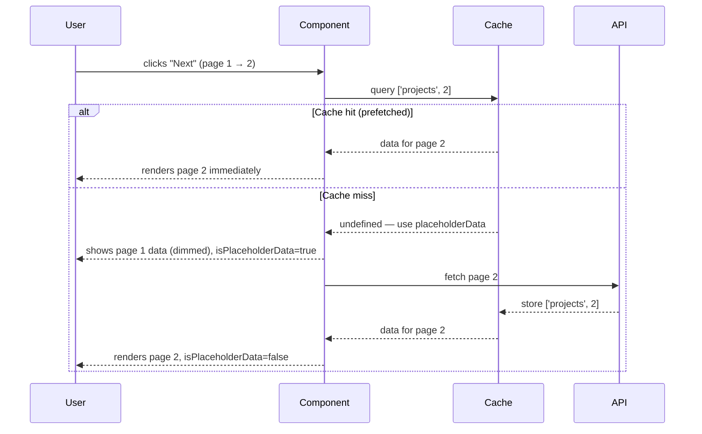

## TanStack Query — Advanced Querying — Paginated Queries

### Overview

Paginated queries are a distinct querying pattern from infinite queries. Rather than accumulating pages into a growing list, paginated queries fetch **one discrete page at a time**, replacing the previous result with the new one. This models traditional pagination UI — numbered pages, prev/next buttons, and a fixed viewport of results.

TanStack Query handles this through standard `useQuery` with page state managed externally, enhanced by a feature called **`placeholderData`** that eliminates the jarring loading flash between page transitions.

---

### How Paginated Queries Differ from Infinite Queries

| Concern | `useInfiniteQuery` | `useQuery` (paginated) |
|---|---|---|
| Data accumulation | Appends/prepends pages | Replaces current data |
| Page state | Managed internally by TanStack | Managed externally (component state) |
| UI pattern | Infinite scroll, load-more | Numbered pages, prev/next |
| Data shape | `data.pages[]` array | Direct `data` object |
| Back-navigation | Scroll position | Explicit page state change |
| `maxPages` support | Yes | N/A |

---

### Basic Setup

Page state is held in component state (or a URL param). The query key includes the current page so each page has its own cache entry.

```ts
import { useQuery, keepPreviousData } from '@tanstack/react-query'
import { useState } from 'react'

function ProjectList() {
  const [page, setPage] = useState(1)

  const { data, isLoading, isPlaceholderData } = useQuery({
    queryKey: ['projects', page],
    queryFn: () => fetchProjects(page),
    placeholderData: keepPreviousData,
  })

  return (
    <div>
      {isPlaceholderData && <span>Loading next page...</span>}
      {data?.items.map((project) => (
        <ProjectRow key={project.id} project={project} />
      ))}
      <button
        onClick={() => setPage((p) => Math.max(p - 1, 1))}
        disabled={page === 1}
      >
        Previous
      </button>
      <button
        onClick={() => setPage((p) => p + 1)}
        disabled={isPlaceholderData || !data?.hasNextPage}
      >
        Next
      </button>
    </div>
  )
}
```

---

### `placeholderData` and `keepPreviousData`

This is the most important ergonomic feature for paginated queries. Without it, every page transition causes a full loading state — `data` becomes `undefined` while the new page fetches, forcing the UI to unmount and remount content.

#### `keepPreviousData`

`keepPreviousData` is a built-in helper function imported from `@tanstack/react-query`. When passed as `placeholderData`, it instructs TanStack Query to **return the previous page's data** while the next page is being fetched.

```ts
import { keepPreviousData } from '@tanstack/react-query'

useQuery({
  queryKey: ['projects', page],
  queryFn: fetchProjects,
  placeholderData: keepPreviousData,
})
```

**Key Points**

- `data` remains populated during the transition — no blank screen
- `isPlaceholderData` is `true` while stale data is being shown, allowing the UI to signal loading state subtly (e.g., dimming, a spinner overlay) without full unmount
- Once the new page resolves, `isPlaceholderData` returns to `false` and `data` is replaced
- [Inference] This is the primary behavioral difference between using `keepPreviousData` and simply relying on `staleTime`. They serve different purposes and are not interchangeable.

#### `placeholderData` as a Function

`placeholderData` also accepts a function signature, receiving the previous query data as an argument:

```ts
useQuery({
  queryKey: ['projects', page],
  queryFn: fetchProjects,
  placeholderData: (previousData) => previousData,
})
```

`keepPreviousData` is effectively a named version of this pattern. Custom functions allow conditional placeholder behavior.

---

### The Query Key as Page Identity

Because each page is a **separate cache entry**, the query key must include the page identifier:

```ts
queryKey: ['projects', page]
// page 1 → cache key: ['projects', 1]
// page 2 → cache key: ['projects', 2]
```

**Key Points**

- Each page is independently cached, independently stale, and independently refetched
- Navigating back to page 1 after visiting page 3 hits the cache immediately (if not stale)
- This is in direct contrast to `useInfiniteQuery`, where all pages share a single cache key

---

### Prefetching the Next Page

Because each page is a discrete cache entry, TanStack Query can prefetch the next page **before** the user navigates to it — making transitions feel instantaneous.

```ts
import { useQueryClient } from '@tanstack/react-query'

function ProjectList() {
  const queryClient = useQueryClient()
  const [page, setPage] = useState(1)

  const { data, isPlaceholderData } = useQuery({
    queryKey: ['projects', page],
    queryFn: () => fetchProjects(page),
    placeholderData: keepPreviousData,
  })

  // Prefetch the next page whenever the current page changes
  useEffect(() => {
    if (!isPlaceholderData && data?.hasNextPage) {
      queryClient.prefetchQuery({
        queryKey: ['projects', page + 1],
        queryFn: () => fetchProjects(page + 1),
      })
    }
  }, [data, isPlaceholderData, page, queryClient])

  // ...
}
```

**Key Points**

- `prefetchQuery` is a fire-and-forget call on the query client — it does not affect the current component's render cycle
- The prefetched result is stored in the cache under `['projects', page + 1]`
- When the user clicks "Next," the data is already in cache and renders without a loading state
- [Inference] If `staleTime` is not configured, prefetched data may be considered stale immediately. Setting a reasonable `staleTime` preserves the prefetch benefit. Behavior depends on configuration.

---

### Page Transition Flow



---

### URL-Driven Pagination

For shareable, bookmarkable pagination, page state should live in the URL rather than component state. The pattern integrates naturally with TanStack Query:

```ts
// Using a router that exposes search params (e.g., TanStack Router)
const { page: pageParam } = useSearch()
const page = Number(pageParam ?? 1)

const { data } = useQuery({
  queryKey: ['projects', page],
  queryFn: () => fetchProjects(page),
  placeholderData: keepPreviousData,
})
```

**Key Points**

- The query key derivation is identical — only the source of `page` changes
- URL-driven page state enables direct linking, browser back/forward navigation, and SSR hydration
- [Inference] When using URL-driven pagination with SSR frameworks (e.g., TanStack Start, Next.js), the server can pre-populate the cache for the initial page, eliminating the first-load fetch entirely. Behavior depends on the SSR integration used.

---

### `isPlaceholderData` vs `isFetching`

These are related but distinct signals:

| Flag | Meaning |
|---|---|
| `isFetching` | A fetch is in progress for this query (background or foreground) |
| `isPlaceholderData` | The currently shown `data` is from a previous query key, not the current one |
| `isLoading` | No data at all yet — first fetch, no placeholder |

A typical UI strategy:

```ts
// Hard loading state — no data at all
if (isLoading) return <Spinner />

// Soft loading state — stale data visible, new page fetching
return (
  <div style={{ opacity: isPlaceholderData ? 0.5 : 1 }}>
    {data.items.map(/* ... */)}
  </div>
)
```

---

### Cursor-Based Paginated Queries

Page-number pagination is not always appropriate. APIs with cursor-based responses can still drive paginated (non-accumulating) UIs:

```ts
const [cursor, setCursor] = useState<string | null>(null)
const [cursorHistory, setCursorHistory] = useState<(string | null)[]>([])

const { data } = useQuery({
  queryKey: ['messages', cursor],
  queryFn: () => fetchMessages(cursor),
  placeholderData: keepPreviousData,
})

const goNext = () => {
  if (data?.nextCursor) {
    setCursorHistory((h) => [...h, cursor])
    setCursor(data.nextCursor)
  }
}

const goPrev = () => {
  const history = [...cursorHistory]
  const prev = history.pop() ?? null
  setCursorHistory(history)
  setCursor(prev)
}
```

**Key Points**

- The cursor history stack enables backward navigation without requiring the API to support `prevCursor`
- Each cursor value becomes a distinct cache key — revisiting a cursor hits the cache
- [Inference] This approach trades simplicity for API flexibility. It is more complex to manage than numeric page state and may require additional handling for edge cases (e.g., stale cursors after data mutations).

---

### When to Choose Paginated vs. Infinite

| Scenario | Preferred Pattern |
|---|---|
| Browse-and-select UI (tables, search results) | Paginated query |
| Chat, feeds, activity logs | Infinite query |
| Shareable, bookmarkable page position | Paginated query (URL state) |
| "Load more" button | Infinite query |
| Audit logs with jump-to-date | Bi-directional infinite query |
| Admin dashboard data tables | Paginated query |
| Social media timeline | Infinite query |

---

### Summary

Paginated queries in TanStack Query are built on `useQuery` with externally managed page state. The key enablers are:

- **Query key includes page** — each page is a discrete, independently cached entry
- **`keepPreviousData`** — prevents blank-screen flashes during page transitions by serving stale data while fetching
- **`isPlaceholderData`** — signals when stale data is visible, enabling subtle loading indicators without full unmount
- **`prefetchQuery`** — warms the cache for the next page proactively, making transitions feel immediate
- **URL-driven state** — integrates naturally for shareable, navigable pagination

**Next Steps** — Query invalidation: strategies, patterns, and cache coordination after mutations