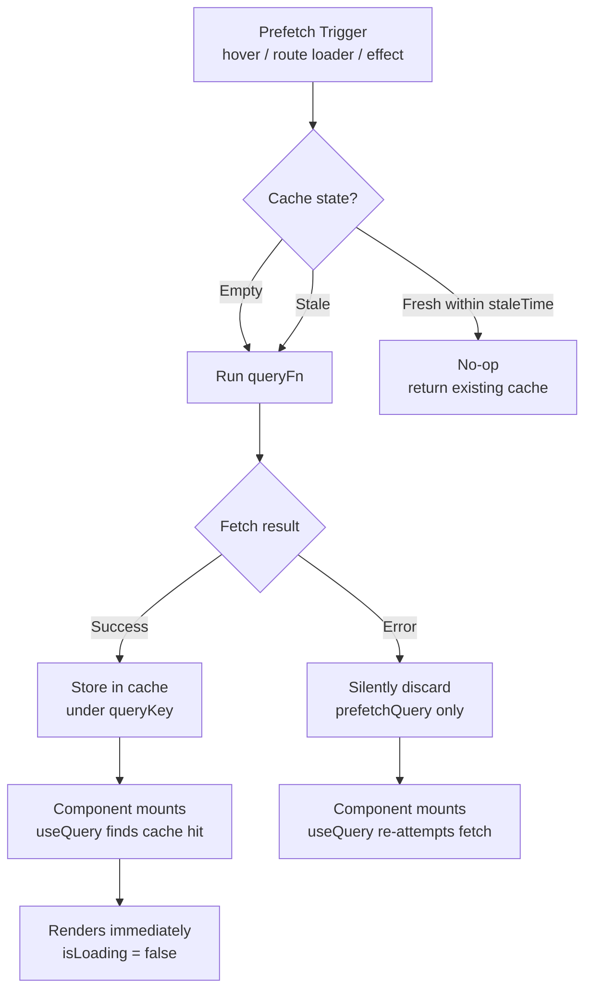

## TanStack Query — Advanced Querying — Prefetching Queries

### Overview

Prefetching is the act of loading query data into the cache **before it is needed by a component**. When a component mounts and calls `useQuery`, if the cache already holds fresh data for that query key, the component renders immediately with no loading state. Prefetching is entirely opt-in and operates through the query client — it does not affect any currently rendered query.

TanStack Query provides multiple mechanisms for prefetching depending on the trigger point: user interaction, route transitions, server-side rendering, or component lifecycle.

---

### Core Method: `queryClient.prefetchQuery`

The primary prefetch API is `prefetchQuery`, called on the query client instance.

```ts
await queryClient.prefetchQuery({
  queryKey: ['user', userId],
  queryFn: () => fetchUser(userId),
})
```

**Key Points**

- If the cache already holds **non-stale** data for the key, `prefetchQuery` is a no-op — no fetch is made
- If the cache holds **stale** data, a fetch is triggered to refresh it
- If the cache has **no entry**, a fetch is made and the result is stored
- `prefetchQuery` returns a `Promise<void>` — it resolves when the fetch completes but does not return the data directly
- Errors thrown by the `queryFn` are **silently swallowed** — `prefetchQuery` does not throw. [Inference] This is intentional design: prefetch failures are non-critical since the consuming `useQuery` will re-attempt the fetch when the component mounts. Behavior is not guaranteed to remain consistent across versions.

---

### Accessing the Query Client

In a React component, use `useQueryClient`:

```ts
import { useQueryClient } from '@tanstack/react-query'

function ProjectList() {
  const queryClient = useQueryClient()

  const handleMouseEnter = (projectId: string) => {
    queryClient.prefetchQuery({
      queryKey: ['project', projectId],
      queryFn: () => fetchProject(projectId),
    })
  }

  return (
    <ul>
      {projects.map((project) => (
        <li key={project.id} onMouseEnter={() => handleMouseEnter(project.id)}>
          <Link to={`/projects/${project.id}`}>{project.name}</Link>
        </li>
      ))}
    </ul>
  )
}
```

Outside React (e.g., in route loaders or server code), the query client is accessed directly from wherever it was instantiated.

---

### Prefetch Triggers

#### Hover Intent

Prefetching on `mouseenter` is a lightweight heuristic that gives approximately 100–300ms of fetch headstart before the user clicks. This is enough for many fast APIs to resolve before navigation completes.

```ts
onMouseEnter={() => {
  queryClient.prefetchQuery({
    queryKey: ['product', id],
    queryFn: () => fetchProduct(id),
  })
}
```

[Inference] Hover-based prefetching is a probabilistic optimization. It does not guarantee data will be ready before navigation — network latency and API response time determine actual benefit.

#### Route-Level Prefetching

In router integrations (e.g., TanStack Router, React Router with loaders), prefetching is triggered before a route renders:

```ts
// TanStack Router — loader runs before component mounts
export const Route = createFileRoute('/projects/$projectId')({
  loader: ({ params, context }) =>
    context.queryClient.prefetchQuery({
      queryKey: ['project', params.projectId],
      queryFn: () => fetchProject(params.projectId),
    }),
  component: ProjectDetail,
})
```

**Key Points**

- The loader `await`s the prefetch, so by the time the component mounts, cache is populated
- `useQuery` in the component finds data immediately — `isLoading` is `false` on first render
- This is the most reliable prefetch trigger: it is deterministic, not probabilistic

#### Pagination Prefetch (Next Page)

As covered in paginated queries — prefetch the adjacent page during the current page's render:

```ts
useEffect(() => {
  if (!isPlaceholderData && data?.hasNextPage) {
    queryClient.prefetchQuery({
      queryKey: ['items', page + 1],
      queryFn: () => fetchItems(page + 1),
    })
  }
}, [page, data, isPlaceholderData, queryClient])
```

---

### `prefetchQuery` vs `prefetchInfiniteQuery`

For infinite queries, a separate method exists:

```ts
await queryClient.prefetchInfiniteQuery({
  queryKey: ['feed'],
  queryFn: ({ pageParam }) => fetchFeed(pageParam),
  initialPageParam: 0,
  pages: 3, // number of pages to prefetch
})
```

**Key Points**

- `prefetchInfiniteQuery` fetches an initial set of pages sequentially, populating the `pages` array in cache
- The `pages` option (introduced in v5) controls how many pages are pre-loaded — without it, only the first page is fetched
- The result is stored under the same cache structure as `useInfiniteQuery`, so the consuming hook finds it immediately

---

### `staleTime` and Prefetch Effectiveness

`staleTime` governs whether a prefetch will actually fire:

```ts
queryClient.prefetchQuery({
  queryKey: ['user', id],
  queryFn: fetchUser,
  staleTime: 10_000, // data considered fresh for 10s after fetch
})
```

| Cache state | `staleTime` behavior | Prefetch result |
|---|---|---|
| No cache entry | N/A | Fetches and stores |
| Cached, within `staleTime` | Data is fresh | No-op, cache used as-is |
| Cached, beyond `staleTime` | Data is stale | Re-fetches to refresh |

**Key Points**

- If `staleTime` is `0` (the default), cached data is immediately stale — a subsequent `prefetchQuery` call will re-fetch even if data was just stored
- [Inference] For prefetch to be effective across a route transition, the `staleTime` configured in `prefetchQuery` should match or exceed the `staleTime` configured in the consuming `useQuery`. Mismatches may cause an immediate background refetch upon component mount despite a successful prefetch. Behavior should be verified for the specific version in use.

---

### `ensureQueryData`

A related method that both prefetches **and** returns the data:

```ts
const user = await queryClient.ensureQueryData({
  queryKey: ['user', userId],
  queryFn: () => fetchUser(userId),
})
```

**Key Points**

- If cache holds fresh data, returns it immediately without fetching
- If cache is stale or empty, fetches and returns the result
- Unlike `prefetchQuery`, it **does** return data and **does** throw on error
- Useful in loaders or server contexts where the prefetch result needs to be inspected or passed directly

#### Comparison

| Method | Returns data | Throws on error | Use case |
|---|---|---|---|
| `prefetchQuery` | No (`void`) | No (silent) | Fire-and-forget warm cache |
| `ensureQueryData` | Yes | Yes | Loader needs the data value |
| `fetchQuery` | Yes | Yes | Imperative fetch, bypasses stale check |

---

### `fetchQuery`

`fetchQuery` is a lower-level imperative fetch that always executes (ignoring staleness by default) and returns data directly:

```ts
const data = await queryClient.fetchQuery({
  queryKey: ['report', reportId],
  queryFn: () => fetchReport(reportId),
})
```

**Key Points**

- Always returns data and always throws on error
- Does respect `staleTime` — if within freshness window, returns cached data without fetching
- Useful when data is needed immediately and cannot be deferred to component render
- [Inference] `fetchQuery` is less commonly the right tool for client-side prefetching. It is more applicable to server-side or imperative data pipelines. Prefer `prefetchQuery` for warming caches speculatively and `ensureQueryData` for loaders that need the value.

---

### Server-Side Prefetching and Hydration

In SSR contexts, prefetching runs on the server and the cache is serialized for client hydration.

```ts
// Server (e.g., TanStack Start, Next.js)
const queryClient = new QueryClient()

await queryClient.prefetchQuery({
  queryKey: ['posts'],
  queryFn: fetchPosts,
})

const dehydratedState = dehydrate(queryClient)

// Pass dehydratedState to the client (e.g., via HTML or props)
```

```tsx
// Client
import { HydrationBoundary } from '@tanstack/react-query'

function App({ dehydratedState }) {
  return (
    <HydrationBoundary state={dehydratedState}>
      <PostList />
    </HydrationBoundary>
  )
}
```

**Key Points**

- `dehydrate` serializes only successful, non-stale cache entries by default
- `HydrationBoundary` rehydrates the client cache from the serialized state
- Components inside `HydrationBoundary` that call `useQuery` with matching keys render immediately with server-fetched data
- [Inference] Error states and in-progress queries are not included in dehydrated output by default. Configuration options exist to include error states. Behavior may vary by version.

---

### Prefetch Flow Diagram



---

### Practical Patterns Summary

#### Pattern 1 — Hover prefetch on navigation links

```ts
onMouseEnter={() => queryClient.prefetchQuery({ queryKey, queryFn })}
```

Best for: list → detail navigation where links are visible

#### Pattern 2 — Route loader prefetch

```ts
loader: () => queryClient.prefetchQuery({ queryKey, queryFn })
```

Best for: guaranteed data availability before component mount

#### Pattern 3 — Pagination neighbor prefetch

```ts
useEffect(() => {
  queryClient.prefetchQuery({ queryKey: [key, page + 1], queryFn })
}, [page])
```

Best for: sequential pagination with next-page warmup

#### Pattern 4 — SSR dehydration

```ts
await queryClient.prefetchQuery(...)
dehydrate(queryClient) // → pass to client
```

Best for: eliminating first-load network round trip entirely

---

### Summary

Prefetching in TanStack Query is a cache-warming strategy with no single required integration point — it fits into hover events, route loaders, pagination effects, and server rendering equally. The core API surface is:

- **`prefetchQuery`** — fire-and-forget, silent on error, used speculatively
- **`prefetchInfiniteQuery`** — same semantics for infinite query cache shape
- **`ensureQueryData`** — prefetch that also returns data and throws on error
- **`fetchQuery`** — imperative fetch that returns data, respects `staleTime`
- **`staleTime` alignment** — critical for ensuring prefetched data is still treated as fresh when the consuming component mounts

**Next Steps** — Query invalidation: strategies, patterns, and cache coordination after mutations