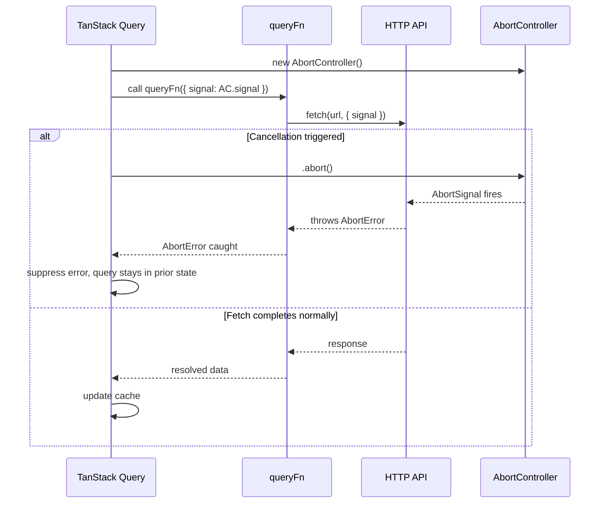

## TanStack Query — Advanced Querying — Query Cancellation with AbortSignal

### Overview

Query cancellation allows in-flight fetch requests to be aborted when they are no longer needed — for example, when a component unmounts, a query key changes before a fetch completes, or `queryClient.cancelQueries` is called explicitly. TanStack Query integrates with the browser-native `AbortSignal` API to support this, passing a signal into the `queryFn` that the fetch (or any compatible async operation) can observe.

Cancellation in TanStack Query is **cooperative** — the library signals intent to cancel, but the actual abort only takes effect if the `queryFn` passes the signal to a cancellation-aware API.

---

### How TanStack Query Provides the Signal

Every `queryFn` receives a context object as its argument. This context includes an `signal` property of type `AbortSignal`:

```ts
useQuery({
  queryKey: ['project', id],
  queryFn: ({ signal }) => fetchProject(id, signal),
})
```

TanStack Query creates and manages this `AbortController` internally. When cancellation is triggered, it calls `.abort()` on the controller, which sets `signal.aborted` to `true` and dispatches an `abort` event on the signal.

---

### Passing the Signal to `fetch`

The native `fetch` API accepts an `AbortSignal` directly in its options:

```ts
async function fetchProject(id: string, signal: AbortSignal) {
  const response = await fetch(`/api/projects/${id}`, { signal })
  if (!response.ok) throw new Error('Failed to fetch project')
  return response.json()
}
```

**Key Points**

- When `signal.aborted` is `true` before the request completes, `fetch` throws a `DOMException` with `name: 'AbortError'`
- TanStack Query detects `AbortError` and treats it as a cancellation — the query does not transition to an error state
- If `signal` is not forwarded to `fetch`, the HTTP request continues to completion even after cancellation is signaled — the result is simply discarded by TanStack Query

---

### What Triggers Cancellation

| Trigger | Description |
|---|---|
| Component unmounts | Query is no longer observed; TanStack Query aborts in-flight fetch |
| Query key changes | Previous key's fetch is aborted before new key's fetch starts |
| `queryClient.cancelQueries` | Explicit programmatic cancellation |
| New fetch supersedes old | e.g., a refetch is triggered while a fetch is still in progress |

[Inference] The exact conditions under which TanStack Query calls `.abort()` depend on internal observer tracking. A query with no active observers may be cancelled. Behavior may vary if `keepPreviousData` or background refetch options are in use.

---

### Cancellation with Axios

Axios supports `AbortSignal` natively as of v0.22.0:

```ts
import axios from 'axios'

async function fetchProject(id: string, signal: AbortSignal) {
  const response = await axios.get(`/api/projects/${id}`, { signal })
  return response.data
}
```

**Key Points**

- Earlier versions of Axios used `CancelToken` — that API is deprecated
- When aborted, Axios throws a `CancelledError` (or `AxiosError` with `code: 'ERR_CANCELED'`)
- TanStack Query recognizes the cancellation and suppresses the error state. [Inference] Recognition depends on TanStack Query checking for known cancellation error signatures. Custom HTTP clients may require additional handling.

---

### Cancellation with GraphQL Clients

For libraries that accept an `AbortSignal` (e.g., `graphql-request`):

```ts
import { GraphQLClient } from 'graphql-request'

const client = new GraphQLClient('/graphql')

async function fetchProjectQuery(id: string, signal: AbortSignal) {
  return client.request({
    document: PROJECT_QUERY,
    variables: { id },
    signal,
  })
}

useQuery({
  queryKey: ['project', id],
  queryFn: ({ signal }) => fetchProjectQuery(id, signal),
})
```

For clients that do not natively accept a signal, the signal must be wired manually through an `AbortController` proxy or middleware layer.

---

### Manual Signal Observation

When working with APIs that do not accept `AbortSignal`, the signal can be observed manually:

```ts
queryFn: async ({ signal }) => {
  return new Promise((resolve, reject) => {
    const timeout = setTimeout(() => {
      resolve(computeExpensiveResult())
    }, 2000)

    signal.addEventListener('abort', () => {
      clearTimeout(timeout)
      reject(new DOMException('Aborted', 'AbortError'))
    })
  })
}
```

**Key Points**

- The `abort` event fires synchronously when `.abort()` is called on the controller
- Manually rejecting with a `DOMException` named `'AbortError'` ensures TanStack Query treats the cancellation correctly and does not mark the query as errored
- [Inference] Throwing any other error type on cancellation may cause the query to enter an error state. The specific error name `'AbortError'` is the recognized sentinel.

---

### `queryClient.cancelQueries`

Cancellation can be triggered programmatically for any set of matching queries:

```ts
await queryClient.cancelQueries({ queryKey: ['project', id] })
```

This calls `.abort()` on any in-flight fetches for matching queries. The `queryKey` filter follows the same fuzzy matching rules as other query client methods — partial keys match all sub-keys.

```ts
// Cancels all queries whose key starts with 'project'
await queryClient.cancelQueries({ queryKey: ['project'] })
```

**Example — cancel before a mutation:**

```ts
const mutation = useMutation({
  mutationFn: updateProject,
  onMutate: async (newData) => {
    // Cancel any outgoing fetches to avoid overwriting optimistic update
    await queryClient.cancelQueries({ queryKey: ['project', newData.id] })
    const previous = queryClient.getQueryData(['project', newData.id])
    queryClient.setQueryData(['project', newData.id], newData)
    return { previous }
  },
  onError: (_err, newData, context) => {
    queryClient.setQueryData(['project', newData.id], context?.previous)
  },
})
```

**Key Points**

- `cancelQueries` is `async` and resolves after cancellation signals have been dispatched
- It is a common first step in optimistic update patterns — ensuring no stale fetch overwrites a local cache change
- It does not remove the query from cache, does not reset its state, and does not prevent future fetches

---

### Cancellation Lifecycle Diagram



---

### Error Handling Nuances

TanStack Query distinguishes cancellation from genuine errors by inspecting the thrown value:

- A `DOMException` with `name === 'AbortError'` → treated as cancellation
- `axios.isCancel(error) === true` → treated as cancellation
- Any other error → treated as a query failure, triggers retry logic and error state

[Inference] The exact detection logic is internal to TanStack Query and may differ across major versions. If using a custom fetch wrapper or HTTP client, testing cancellation behavior explicitly is advisable.

---

### `signal` in `queryFn` Type Signature

The full context object passed to `queryFn` is typed as `QueryFunctionContext`:

```ts
type QueryFunctionContext<TQueryKey extends QueryKey = QueryKey> = {
  queryKey: TQueryKey
  signal: AbortSignal
  pageParam?: unknown       // only for infinite queries
  meta: Record<string, unknown> | undefined
}
```

Destructuring only what is needed is idiomatic:

```ts
queryFn: ({ signal, queryKey }) => {
  const [, id] = queryKey
  return fetchProject(id as string, signal)
}
```

---

### Common Pitfalls

| Pitfall | Description |
|---|---|
| Not forwarding `signal` | Fetch continues in-flight; wastes bandwidth; response is discarded silently |
| Throwing non-`AbortError` on cancel | Query enters error state; retries may fire unnecessarily |
| Using deprecated `CancelToken` in Axios | API is removed in newer Axios versions; use `signal` instead |
| Assuming cancellation is automatic | TanStack Query signals intent; the `queryFn` must act on the signal |
| `cancelQueries` without `await` in `onMutate` | Race condition — mutation may proceed before cancellation dispatches |

---

### Summary

Query cancellation in TanStack Query is built on the native `AbortSignal` API and requires explicit cooperation from the `queryFn`. The key points:

- TanStack Query provides a `signal` via `queryFn`'s context — it must be forwarded to cancellation-aware APIs
- `fetch` and modern Axios accept `signal` natively; other clients require manual wiring
- Cancelled queries do not enter an error state — they remain in their previous state
- `queryClient.cancelQueries` enables explicit, programmatic cancellation by key pattern
- Cancellation before optimistic mutations is a critical correctness pattern, not merely an optimization

**Next Steps** — Query invalidation: strategies, patterns, and cache coordination after mutations