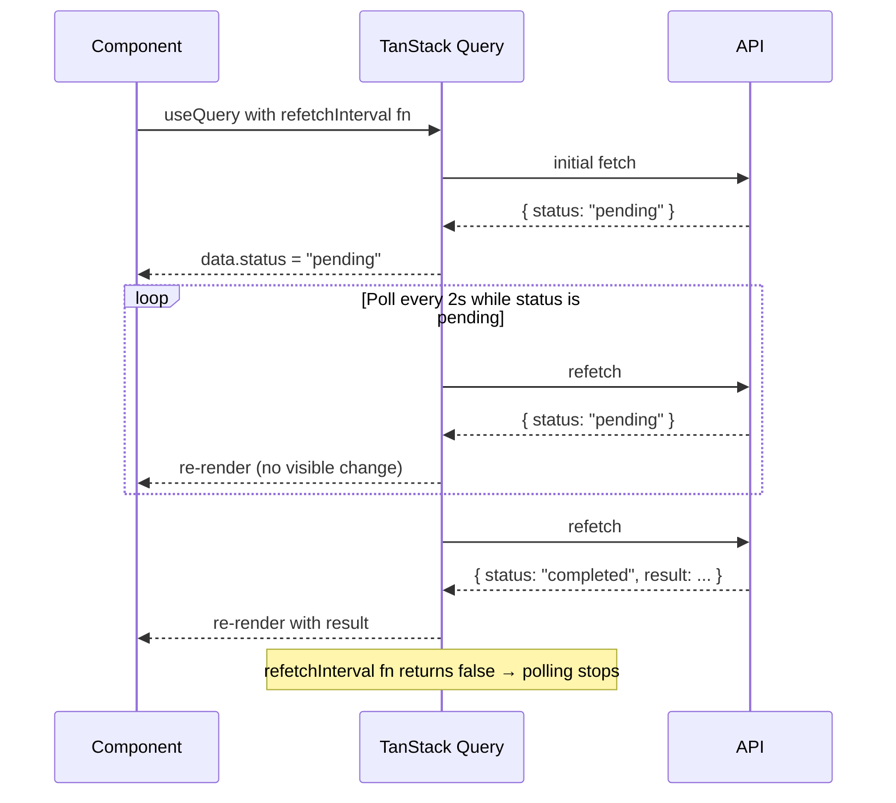

## TanStack Query — Advanced Querying — Polling with `refetchInterval`

### Overview

Polling is a strategy for keeping query data fresh by refetching on a fixed time interval, without user interaction. TanStack Query supports this natively through the `refetchInterval` option on `useQuery` and `useInfiniteQuery`. When configured, the query automatically re-executes the `queryFn` at the specified cadence, updating the cache and triggering a re-render when data changes.

Polling is appropriate for data that changes server-side on a predictable or unpredictable schedule and where WebSockets or server-sent events are not available or not warranted — dashboards, job status trackers, live scores, queue depths, and similar use cases.

---

### Basic Configuration

```ts
useQuery({
  queryKey: ['server-status'],
  queryFn: fetchServerStatus,
  refetchInterval: 5000, // poll every 5 seconds
})
```

**Key Points**

- `refetchInterval` is specified in **milliseconds**
- The interval begins after the previous fetch **completes**, not when it starts — successive fetches do not overlap under normal conditions
- `refetchInterval: false` (the default) disables polling entirely

---

### `refetchIntervalInBackground`

By default, polling pauses when the browser window loses focus. This is controlled by `refetchIntervalInBackground`:

```ts
useQuery({
  queryKey: ['job-status', jobId],
  queryFn: () => fetchJobStatus(jobId),
  refetchInterval: 3000,
  refetchIntervalInBackground: true, // continue polling even when tab is not focused
})
```

| `refetchIntervalInBackground` | Behavior |
|---|---|
| `false` (default) | Polling pauses when window loses focus; resumes on focus |
| `true` | Polling continues regardless of window focus state |

**Key Points**

- [Inference] "Background" here refers to the browser tab losing focus, not a service worker or background thread context. Behavior in non-browser environments (e.g., React Native, SSR) may differ and should be verified.
- Keeping this `false` is generally preferable for user-facing dashboards — it reduces unnecessary server load when the user is not actively viewing the page

---

### Dynamic `refetchInterval`

`refetchInterval` also accepts a **function**, receiving the current query state. This enables adaptive polling — adjusting or stopping the interval based on fetched data:

```ts
useQuery({
  queryKey: ['job', jobId],
  queryFn: () => fetchJob(jobId),
  refetchInterval: (query) => {
    // Stop polling once the job reaches a terminal state
    if (query.state.data?.status === 'completed') return false
    if (query.state.data?.status === 'failed') return false
    return 2000 // otherwise poll every 2 seconds
  },
})
```

**Key Points**

- The function receives the full `Query` object — `query.state.data`, `query.state.error`, `query.state.status`, and other state fields are accessible
- Returning `false` stops the interval; returning a number resumes or adjusts it
- This is the idiomatic pattern for **polling until done** — job queues, async processing pipelines, export generation, and similar workflows
- [Inference] The function is evaluated after each fetch completes. It is not called on a separate timer — the interval value is re-read each cycle. Behavior should be verified for the specific version in use.

---

### Polling Until Done — Flow Diagram



---

### Interaction with Other Refetch Options

Polling does not replace other refetch triggers — it layers on top of them:

| Option | Trigger |
|---|---|
| `refetchInterval` | Time-based, automatic |
| `refetchOnWindowFocus` | Browser tab regains focus |
| `refetchOnReconnect` | Network reconnects |
| `refetchOnMount` | Component mounts or remounts |

All of these can be active simultaneously. A query configured with `refetchInterval: 5000` will still refetch immediately on window focus if `refetchOnWindowFocus` is `true` (the default), in addition to its scheduled polling.

[Inference] Multiple simultaneous triggers may cause fetches to occur closer together than the configured interval. TanStack Query does not coalesce or debounce these triggers by default. Behavior may vary across versions.

---

### Interaction with `staleTime`

`staleTime` does not suppress interval-triggered refetches. Once `refetchInterval` is set, the query refetches on schedule regardless of staleness:

```ts
useQuery({
  queryKey: ['metrics'],
  queryFn: fetchMetrics,
  staleTime: 60_000,       // data considered fresh for 1 min
  refetchInterval: 10_000, // but refetch every 10s anyway
})
```

**Key Points**

- `staleTime` governs when **other** triggers (focus, mount, reconnect) will refetch
- `refetchInterval` operates independently — it will fire even if data is within the `staleTime` window
- [Inference] This can cause apparent redundancy. If the intent is "only refetch when stale," `refetchInterval` is not the right tool — use `staleTime` alone with focus/reconnect refetching instead.

---

### Pausing Polls with `enabled`

The `enabled` option can gate polling entirely:

```ts
const [isTracking, setIsTracking] = useState(false)

useQuery({
  queryKey: ['live-price', symbol],
  queryFn: () => fetchPrice(symbol),
  refetchInterval: 1000,
  enabled: isTracking, // polling only active when tracking
})
```

When `enabled` is `false`:
- No initial fetch occurs
- No interval polling occurs
- The query remains in its current cache state

This pattern is useful for user-controlled polling — a "Start tracking" / "Stop tracking" toggle, for example.

---

### Global Polling Configuration

`refetchInterval` can be set globally via `QueryClient` defaults, though this is uncommon since polling is usually selective:

```ts
const queryClient = new QueryClient({
  defaultOptions: {
    queries: {
      refetchInterval: 30_000,
    },
  },
})
```

[Inference] Applying `refetchInterval` globally is generally inadvisable. Most queries in an application do not require polling, and a global interval would generate unnecessary network traffic. Per-query configuration is the standard approach.

---

### Controlling Poll Frequency by Data Volatility

A practical pattern is to vary the interval based on the nature of the data:

```ts
const POLL_INTERVALS = {
  realtime: 1_000,   // live prices, counters
  frequent: 5_000,   // job status, queue depth
  periodic: 30_000,  // dashboard summaries
  infrequent: 60_000 // config, feature flags
}

useQuery({
  queryKey: ['queue-depth'],
  queryFn: fetchQueueDepth,
  refetchInterval: POLL_INTERVALS.frequent,
})
```

---

### Polling vs. Real-Time Alternatives

| Approach | Mechanism | Appropriate When |
|---|---|---|
| `refetchInterval` polling | Repeated HTTP requests | Simple setup, low-to-moderate frequency |
| WebSockets | Persistent bidirectional connection | High-frequency updates, server-push required |
| Server-Sent Events (SSE) | Persistent server-to-client stream | Server-push, unidirectional, simpler than WS |
| Long polling | HTTP request held open until update | Intermediate option, no persistent connection |

**Key Points**

- Polling generates one HTTP request per interval per client — server load scales linearly with connected clients and poll frequency
- For high-frequency data (sub-second updates) or large numbers of concurrent clients, WebSockets or SSE are more appropriate
- [Inference] TanStack Query can be combined with WebSocket or SSE integrations by calling `queryClient.setQueryData` directly when server push messages arrive, bypassing polling entirely while still using the cache layer

---

### Cleanup and Unmount Behavior

When the component using a polling query unmounts:

- If no other component is subscribed to the same query key, polling stops automatically
- The interval is cleared as part of TanStack Query's observer cleanup
- The cache entry remains (subject to `gcTime`) — polling does not resume until a new observer mounts

[Inference] If two components mount the same polling query simultaneously, TanStack Query deduplicates the fetch but the interval is shared. Behavior with multiple simultaneous observers polling the same key should be tested if it is a concern in the application.

---

### Common Pitfalls

| Pitfall | Description |
|---|---|
| Polling non-volatile data | Wastes bandwidth; use `staleTime` + focus refetch instead |
| `refetchIntervalInBackground: true` unnecessarily | Generates server load when user is away |
| Not using dynamic interval to stop polling | Query polls indefinitely even after job completes |
| Short interval with heavy `queryFn` | Overlapping fetches or server overload; interval resets after completion, not start |
| Global `refetchInterval` | Polls all queries including static or rarely-changing data |

---

### Summary

Polling in TanStack Query is configured through `refetchInterval`, with optional background continuation via `refetchIntervalInBackground`. Key behaviors:

- **Static interval** — constant polling cadence, simple setup
- **Dynamic interval function** — adaptive polling; can halt based on query state, enabling "poll until done" patterns
- **`enabled` gating** — user-controlled start/stop of polling
- **Independent of `staleTime`** — polling fires on schedule regardless of data freshness
- **Observer-scoped** — polling stops when all subscribing components unmount

**Next Steps** — Dependent queries: sequencing and coordinating queries that depend on each other