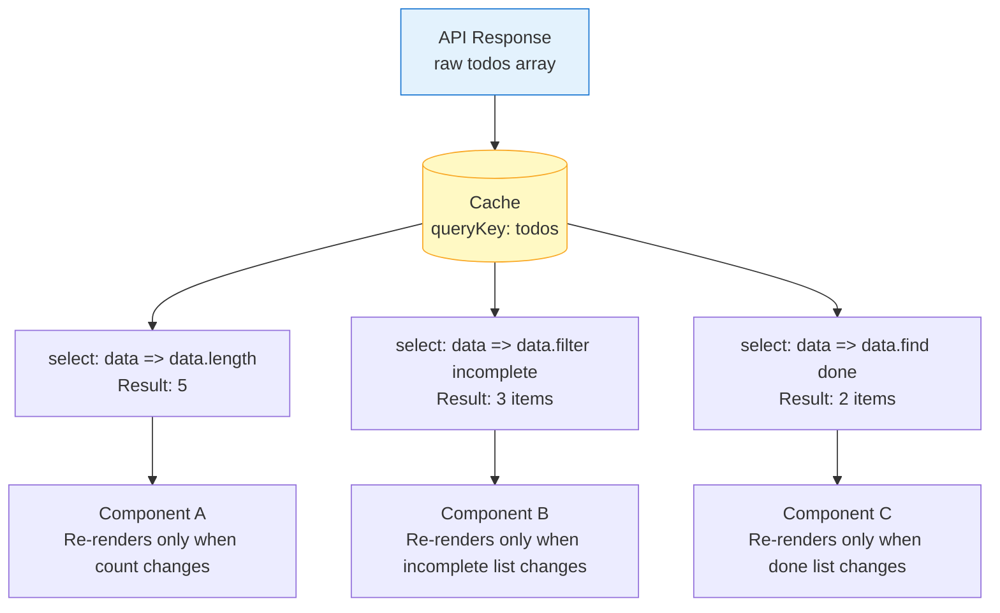

## TanStack Query — Advanced Querying — Select and Data Transformation

### Overview

The `select` option in `useQuery` and `useInfiniteQuery` allows data returned by the `queryFn` to be **transformed before it reaches the component**, without altering what is stored in the cache. The raw server response remains in the cache unchanged; `select` produces a derived value that is returned as `data` to the consuming component.

This separates two concerns that are often conflated: **what to cache** and **what to render**.

---

### Basic Usage

```ts
useQuery({
  queryKey: ['user', id],
  queryFn: () => fetchUser(id),
  select: (data) => ({
    fullName: `${data.firstName} ${data.lastName}`,
    initials: `${data.firstName[0]}${data.lastName[0]}`,
  }),
})
```

**Key Points**

- `select` receives the raw value returned by `queryFn` (or the cached value if fresh)
- The return value of `select` becomes `data` in the component
- The cache stores the **original** `queryFn` result — `select` never mutates it
- `data` is typed as the return type of `select`, not the return type of `queryFn`

---

### Why Transform at the Query Level

Without `select`, transformation typically happens inline in the component or in a custom hook wrapper. Both approaches have drawbacks:

| Location | Drawback |
|---|---|
| Inline in component | Transformation re-runs on every render regardless of data change |
| Custom hook wrapper | Requires manual memoization to avoid excess computation |
| `select` option | Memoized by TanStack Query — re-runs only when source data changes |

`select` is the idiomatic location for transformation in TanStack Query because the library handles memoization automatically.

---

### Memoization Behavior

TanStack Query compares the result of `select` using referential equality. If the selected value is the same reference as the previous result, the component does **not** re-render:

- If `select` returns a **primitive** (string, number, boolean) — strict equality (`===`) is used
- If `select` returns an **object or array** — referential equality is used; a new object literal always causes a re-render even if its contents are identical

**Key Points**

- [Inference] To stabilize object/array results across renders, `select` should be defined as a **stable function reference** — either outside the component, or wrapped in `useCallback`. An inline arrow function is redefined on every render, which may defeat memoization. Behavior depends on internal TanStack Query diffing logic and may vary across versions.
- Primitive selections are naturally stable — a selected count of `42` will not cause a re-render if it remains `42`

```ts
// Unstable — new function reference on every render
useQuery({
  queryKey: ['todos'],
  queryFn: fetchTodos,
  select: (data) => data.filter((t) => !t.completed), // redefined every render
})

// Stable — defined outside component
const selectIncompleteTodos = (data: Todo[]) =>
  data.filter((t) => !t.completed)

useQuery({
  queryKey: ['todos'],
  queryFn: fetchTodos,
  select: selectIncompleteTodos,
})
```

---

### Common Transformation Patterns

#### Filtering

```ts
select: (data) => data.filter((item) => item.active)
```

#### Sorting

```ts
select: (data) =>
  [...data].sort((a, b) => a.createdAt.localeCompare(b.createdAt))
```

Note the spread — sorting mutates arrays in place. Spreading first avoids mutating the cached value. [Inference] Mutating the cached reference directly via `select` may cause unpredictable behavior since the cache is shared across all subscribers.

#### Plucking a single field

```ts
select: (data) => data.totalCount
```

Useful when a component only needs one value from a larger response — prevents unnecessary re-renders when other fields change.

#### Reshaping / normalizing

```ts
select: (data) =>
  Object.fromEntries(data.items.map((item) => [item.id, item]))
// { "abc": { id: "abc", ... }, "def": { id: "def", ... } }
```

#### Combining fields

```ts
select: (data) => ({
  label: `${data.code} — ${data.name}`,
  isExpired: new Date(data.expiresAt) < new Date(),
})
```

---

### Subscribing Different Components to Different Slices

Because `select` is per-`useQuery` call, multiple components can subscribe to the **same cache entry** but receive **different derived values**:

```ts
// Component A — only needs the count
const { data: count } = useQuery({
  queryKey: ['todos'],
  queryFn: fetchTodos,
  select: (data) => data.length,
})

// Component B — only needs incomplete todos
const { data: incompleteTodos } = useQuery({
  queryKey: ['todos'],
  queryFn: fetchTodos,
  select: (data) => data.filter((t) => !t.completed),
})
```

**Key Points**

- Both components share one cache entry and one network request
- Each component re-renders only when **its own selected slice** changes
- Component A does not re-render when an item's `completed` flag toggles — only when the array length changes
- This is a significant performance optimization for large shared datasets

---

### Select and Re-render Optimization Diagram



---

### `select` with `useInfiniteQuery`

For infinite queries, `select` receives the full `InfiniteData` shape:

```ts
type InfiniteData<TData> = {
  pages: TData[]
  pageParams: unknown[]
}
```

Transformation must account for this structure:

```ts
useInfiniteQuery({
  queryKey: ['feed'],
  queryFn: fetchFeedPage,
  initialPageParam: 0,
  getNextPageParam: (lastPage) => lastPage.nextCursor,
  select: (data) => ({
    ...data,
    pages: data.pages.map((page) => ({
      ...page,
      items: page.items.filter((item) => !item.isHidden),
    })),
  }),
})
```

**Key Points**

- The `pages` and `pageParams` structure must be preserved — TanStack Query's internal paging logic depends on it
- Spread the outer object and each page to avoid mutating cached references
- [Inference] Returning a structurally incompatible shape from `select` on an infinite query may cause runtime errors in pagination logic. The shape constraint should be treated as a hard requirement.

---

### TypeScript Inference

`select` narrows the type of `data` automatically:

```ts
// queryFn returns: { id: string; firstName: string; lastName: string; role: string }
// select returns: string

const { data } = useQuery({
  queryKey: ['user', id],
  queryFn: fetchUser,
  select: (user) => user.role, // data: string
})

// data is typed as string | undefined — not the full user object
```

When `select` is a stable external function, its return type is inferred from the function signature. TypeScript will surface type errors if the selector receives an unexpected input shape.

---

### Separating Selectors into Reusable Functions

For consistency across multiple components and easier testing, selectors can be defined as named functions alongside the query:

```ts
// queries/todos.ts

export const todoKeys = {
  all: ['todos'] as const,
}

const selectIncomplete = (data: Todo[]) =>
  data.filter((t) => !t.completed)

const selectCount = (data: Todo[]) => data.length

export function useTodos() {
  return useQuery({ queryKey: todoKeys.all, queryFn: fetchTodos })
}

export function useIncompleteTodos() {
  return useQuery({
    queryKey: todoKeys.all,
    queryFn: fetchTodos,
    select: selectIncomplete,
  })
}

export function useTodoCount() {
  return useQuery({
    queryKey: todoKeys.all,
    queryFn: fetchTodos,
    select: selectCount,
  })
}
```

**Key Points**

- All three hooks share one cache entry — one network request serves all
- Selectors are pure functions — straightforward to unit test in isolation
- The query key factory (`todoKeys`) ensures all hooks point to the same cache entry

---

### `select` vs. Deriving State in Components

| Approach | Re-render behavior | Memoization |
|---|---|---|
| `select` | Re-renders only when selected slice changes | Handled by TanStack Query |
| `useMemo` in component | Re-renders on any query re-render, then bails if memo is stable | Manual |
| Inline expression | Re-computes on every render | None |

`select` is preferred when the transformation is tied to the query — it co-locates the data contract with the fetch. `useMemo` remains appropriate for transformations that combine data from multiple queries or from local state alongside query data.

---

### Common Pitfalls

| Pitfall | Description |
|---|---|
| Inline arrow function | Creates new function reference each render; may undermine memoization |
| Mutating `data` in `select` | Mutates the shared cache reference; use spread or `structuredClone` |
| Returning new object with same contents | Referential inequality causes re-render even when values are unchanged |
| Sorting in place | `Array.sort` mutates; always spread first |
| Ignoring `InfiniteData` shape | Omitting `pages`/`pageParams` structure breaks paging on infinite queries |

---

### Summary

`select` in TanStack Query is a cache-preserving, memoized transformation layer between the server response and the component. Its key properties:

- **Cache is unchanged** — raw data is always stored as returned by `queryFn`
- **Component receives derived value** — the return type of `select` replaces the raw type in `data`
- **Memoized by TanStack Query** — re-runs only when source data changes, provided the selector function reference is stable
- **Per-subscriber** — multiple components can select different slices from one cache entry, each re-rendering independently
- **Composable** — selectors are pure functions; they can be extracted, named, and tested independently

**Next Steps** — Dependent queries: sequencing and coordinating queries that depend on each other