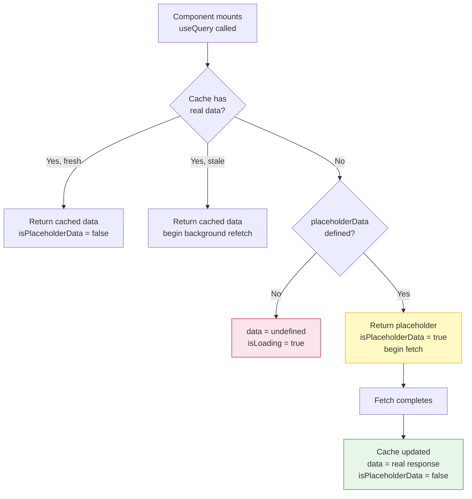

## TanStack Query — Advanced Querying — Placeholder Data

### Overview

Placeholder data allows a query to present a value to the component **before any real data has been fetched**, without triggering a loading state. Unlike initial data, placeholder data is never written to the cache — it exists only for the duration of the render cycle in which no real data is available yet. Once the fetch completes, the real data replaces it.

This is primarily a UX tool: it eliminates skeleton loaders or null guards for data that can be meaningfully approximated before the fetch resolves.

---

### Core Distinction: Placeholder vs. Initial Data

These two options serve related but distinct purposes:

| Concern | `placeholderData` | `initialData` |
|---|---|---|
| Written to cache | No | Yes |
| Treated as real data | No | Yes |
| Triggers a fetch | Always (query still fetches) | Only if stale |
| `isPlaceholderData` flag | `true` while shown | Not applicable |
| Source | Approximation / derived | Known real value |
| Affects `dataUpdatedAt` | No | Yes |

**Key Points**

- `placeholderData` is a **rendering hint** — the query always proceeds to fetch regardless
- `initialData` is a **cache seed** — it may suppress a fetch if within `staleTime`
- [Inference] Choosing the wrong option can lead to subtle bugs: using `initialData` with stale data may prevent a fetch from firing; using `placeholderData` when a real cached value exists is redundant. The choice should reflect whether the provided value is a known-real value or an approximation.

---

### Basic Usage

```ts
useQuery({
  queryKey: ['user', id],
  queryFn: () => fetchUser(id),
  placeholderData: {
    id,
    name: 'Loading...',
    role: 'unknown',
    avatarUrl: null,
  },
})
```

**Key Points**

- The component receives this object as `data` immediately, with `isPlaceholderData: true`
- A fetch is initiated in the background
- When the fetch resolves, `data` is replaced with the real response and `isPlaceholderData` drops to `false`
- The placeholder object is never stored in the cache

---

### `isPlaceholderData` Flag

The component can inspect whether it is currently showing placeholder data:

```ts
const { data, isPlaceholderData } = useQuery({
  queryKey: ['project', id],
  queryFn: () => fetchProject(id),
  placeholderData: { id, name: 'Project', tasks: [] },
})

return (
  <div style={{ opacity: isPlaceholderData ? 0.5 : 1 }}>
    <h1>{data?.name}</h1>
    <TaskList tasks={data?.tasks ?? []} />
  </div>
)
```

This enables **soft loading states** — the UI renders with approximate content rather than a spinner, and visually signals that a fetch is in progress through opacity, shimmer, or disabled controls.

---

### `placeholderData` as a Function

`placeholderData` also accepts a function, which receives two arguments:

- The **previous data** for this query key (if any)
- The **previous query** object (full state)

```ts
useQuery({
  queryKey: ['project', id],
  queryFn: () => fetchProject(id),
  placeholderData: (previousData, previousQuery) => previousData,
})
```

This function form is the basis for `keepPreviousData`.

---

### `keepPreviousData`

`keepPreviousData` is a built-in helper imported from `@tanstack/react-query` that implements the previous-data function pattern:

```ts
import { keepPreviousData } from '@tanstack/react-query'

useQuery({
  queryKey: ['projects', page],
  queryFn: () => fetchProjects(page),
  placeholderData: keepPreviousData,
})
```

**Key Points**

- When the query key changes (e.g., page number increments), the previous page's data is returned as placeholder data while the new page fetches
- `isPlaceholderData` is `true` during this transition
- Once the new page resolves, the placeholder is replaced
- This is the canonical pattern for paginated query transitions — covered in detail in the Paginated Queries topic

---

### Sourcing Placeholder Data from the Cache

A common pattern is to derive placeholder data from an **existing cache entry** — for example, populating a detail view with data already available from a list query:

```ts
import { useQueryClient } from '@tanstack/react-query'

function ProjectDetail({ id }: { id: string }) {
  const queryClient = useQueryClient()

  const { data, isPlaceholderData } = useQuery({
    queryKey: ['project', id],
    queryFn: () => fetchProject(id),
    placeholderData: () => {
      // Look for this project in the cached project list
      const projects = queryClient.getQueryData<Project[]>(['projects'])
      return projects?.find((p) => p.id === id)
    },
  })

  return (
    <div>
      {isPlaceholderData && <Banner>Loading full details...</Banner>}
      <h1>{data?.name}</h1>
      <p>{data?.description}</p>
    </div>
  )
}
```

**Key Points**

- `queryClient.getQueryData` is synchronous — it reads directly from the in-memory cache with no network call
- If the list query has not been fetched or has been garbage collected, `getQueryData` returns `undefined`, and no placeholder is shown
- The detail fetch proceeds regardless — the placeholder only affects what renders during the fetch
- [Inference] List items typically contain fewer fields than detail responses. Components rendering placeholder data from a list entry may encounter `undefined` for fields only present in the detail response. Null guards or optional chaining are advisable.

---

### Data Flow Diagram



---

### Placeholder Data vs. Structural Sharing

TanStack Query uses **structural sharing** by default — when new data arrives, it recursively compares the new and previous values and reuses unchanged object references. This applies to real query data but [Inference] does not apply to placeholder data, since placeholder data is never written to the cache. Structural sharing operates on the cache layer, which placeholder data does not touch.

---

### Placeholder Data in Custom Hooks

Placeholder data integrates cleanly into the custom hook pattern:

```ts
const EMPTY_PROJECT: Project = {
  id: '',
  name: '',
  description: '',
  tasks: [],
  members: [],
  createdAt: '',
}

export function useProject(id: string) {
  return useQuery({
    queryKey: ['project', id],
    queryFn: () => fetchProject(id),
    placeholderData: EMPTY_PROJECT,
  })
}
```

**Key Points**

- Defining the placeholder as a module-level constant avoids re-creating it on every render
- Components using `useProject` can destructure `data` without null guards if the placeholder covers all required fields — though `isPlaceholderData` should still be checked before treating the data as authoritative
- [Inference] Relying on placeholder data to eliminate null guards entirely is fragile — if the placeholder and real response shapes diverge, TypeScript will not catch the mismatch at runtime. Treating `isPlaceholderData === true` data as read-only and non-actionable is the safer convention.

---

### TypeScript Considerations

When `placeholderData` is provided, TanStack Query infers that `data` will never be `undefined` during render — the type of `data` becomes `TData` rather than `TData | undefined`:

```ts
const { data } = useQuery({
  queryKey: ['user', id],
  queryFn: fetchUser,           // returns: User
  placeholderData: EMPTY_USER,  // also: User
})

// data: User (not User | undefined)
```

**Key Points**

- This only holds when the placeholder is typed correctly — if `placeholderData` is typed as `Partial<User>`, `data` will reflect that partial type
- [Inference] TypeScript inference of `data` as non-undefined when `placeholderData` is present is a version-dependent behavior. Verifying against the specific TanStack Query version in use is advisable, particularly for v4 → v5 migrations where option typing changed.

---

### Common Pitfalls

| Pitfall | Description |
|---|---|
| Confusing with `initialData` | `initialData` writes to cache and may suppress fetches; `placeholderData` does neither |
| Not checking `isPlaceholderData` | Treating placeholder values as real data may drive incorrect UI actions (e.g., enabling a submit button) |
| Mutable placeholder object | If the placeholder is mutated anywhere, subsequent renders see the mutated value; use `Object.freeze` or define as a constant |
| Placeholder shape mismatch | Fields present in placeholder but absent in real response (or vice versa) cause runtime errors if not guarded |
| Using for expensive defaults | `placeholderData` as a function is called on every render cycle when no real data exists; heavy computation inside should be memoized externally |

---

### When to Use Placeholder Data

| Scenario | Appropriate |
|---|---|
| Detail view seeded from list cache | Yes — common pattern, low risk |
| Paginated transitions (via `keepPreviousData`) | Yes — canonical use case |
| Skeleton content with approximate shape | Yes — eliminates loading state flash |
| Data that must be authoritative before interaction | No — gate interactions on `isPlaceholderData === false` |
| Replacing a real loading indicator for all cases | No — some queries have no meaningful placeholder |

---

### Summary

Placeholder data in TanStack Query is a **render-only approximation** that fills the `data` slot while a fetch is in progress, without touching the cache. Its key properties:

- **Never cached** — raw server data remains the single source of truth in cache
- **Always fetches** — placeholder data does not suppress network requests
- **`isPlaceholderData` flag** — components can distinguish placeholder from real data and adjust UI accordingly
- **Function form** — enables dynamic placeholders derived from previous data or existing cache entries
- **`keepPreviousData`** — the built-in helper for paginated transitions, built on the function form
- **TypeScript narrowing** — presence of `placeholderData` removes `undefined` from the `data` type when correctly typed

**Next Steps** — Initial data: seeding the cache and coordinating with server-side rendering