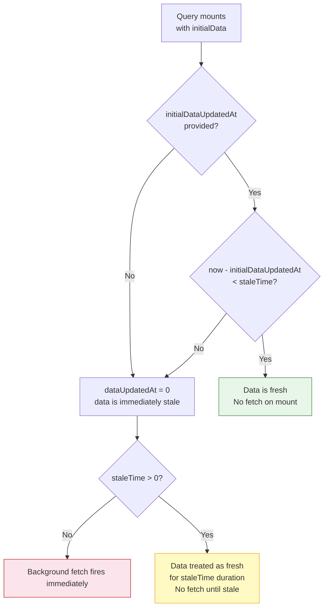

## TanStack Query — Advanced Querying — Initial Data

### Overview

`initialData` seeds the cache with a known value at the moment a query is first created — before any network request is made. Unlike `placeholderData`, which is a rendering hint that never touches the cache, `initialData` is treated as **real, cached data**. It affects staleness calculations, may suppress fetches entirely, and is visible to all subscribers of that query key.

The primary use cases are: pre-populating detail queries from list cache entries, passing server-rendered data into the client cache, and providing synchronously available defaults that are known to be accurate at mount time.

---

### Basic Usage

```ts
useQuery({
  queryKey: ['user', id],
  queryFn: () => fetchUser(id),
  initialData: {
    id,
    name: 'Jane Smith',
    role: 'admin',
  },
})
```

**Key Points**

- The cache entry for `['user', id]` is created immediately with this value
- `data` is available on the first render — `isLoading` is `false`
- Whether a fetch fires depends on `staleTime` — see below
- `initialData` is written once, at query creation time; subsequent mounts of the same query key do not re-apply it if the cache entry already exists

---

### Staleness and Fetch Suppression

This is the most consequential behavioral difference between `initialData` and `placeholderData`.

When `initialData` is provided without `initialDataUpdatedAt`, TanStack Query treats the data as **immediately stale** (as if `dataUpdatedAt` is `0`). This means a fetch fires on mount despite the cache being populated.

```ts
// initialData is stale immediately — fetch fires on mount
useQuery({
  queryKey: ['config'],
  queryFn: fetchConfig,
  initialData: hardcodedConfig,
})
```

To suppress the fetch, pair `initialData` with `staleTime`:

```ts
// initialData treated as fresh for 60 seconds — fetch suppressed if mounted within that window
useQuery({
  queryKey: ['config'],
  queryFn: fetchConfig,
  initialData: hardcodedConfig,
  staleTime: 60_000,
})
```

**Key Points**

- Without `staleTime`, `initialData` populates the cache but does not prevent a background refetch
- With `staleTime`, the data is treated as fresh for the specified duration — no fetch fires until `staleTime` elapses
- [Inference] The interaction between `initialData`, `staleTime`, and `initialDataUpdatedAt` is the most error-prone aspect of this option. Explicit configuration of at least one of `staleTime` or `initialDataUpdatedAt` is advisable whenever `initialData` is used with the intent of suppressing a fetch.

---

### `initialDataUpdatedAt`

When the timestamp at which `initialData` was last valid is known (e.g., from an SSR response), it can be passed explicitly:

```ts
useQuery({
  queryKey: ['posts'],
  queryFn: fetchPosts,
  initialData: serverPosts,
  initialDataUpdatedAt: serverTimestamp, // Unix timestamp in milliseconds
})
```

TanStack Query compares `initialDataUpdatedAt` against `staleTime` to determine whether the initial data is still fresh:

- If `now - initialDataUpdatedAt < staleTime` → data is fresh, no fetch
- If `now - initialDataUpdatedAt >= staleTime` → data is stale, fetch fires

**Key Points**

- `initialDataUpdatedAt` is the correct mechanism for SSR hydration when not using `HydrationBoundary` — it lets the client decide whether the server data is still fresh enough to use without re-fetching
- The timestamp should reflect when the data was **fetched on the server**, not when the page was rendered (these may differ if rendering takes time)
- [Inference] Clock skew between server and client can cause `initialDataUpdatedAt` comparisons to behave unexpectedly. In most cases, SSR integrations using `dehydrate` / `HydrationBoundary` are more robust than manual `initialDataUpdatedAt` management.

---

### Staleness Decision Diagram



---

### `initialData` as a Function

`initialData` accepts a function to avoid computing an expensive default on every render:

```ts
useQuery({
  queryKey: ['project', id],
  queryFn: () => fetchProject(id),
  initialData: () => expensiveDefaultComputation(id),
})
```

**Key Points**

- The function is called **once**, at query creation time, not on every render
- If the cache entry for this key already exists (from a prior mount or prefetch), the function is not called — the existing cache value is used
- [Inference] This mirrors how `useState` accepts an initializer function. The function form is preferable whenever the default value requires any non-trivial computation or cache lookup.

---

### Seeding from a List Cache Entry

The most common real-world pattern: use data already in the cache (from a list query) to pre-populate a detail query:

```ts
import { useQueryClient } from '@tanstack/react-query'

function ProjectDetail({ id }: { id: string }) {
  const queryClient = useQueryClient()

  const { data } = useQuery({
    queryKey: ['project', id],
    queryFn: () => fetchProject(id),
    initialData: () => {
      const projects = queryClient.getQueryData<Project[]>(['projects'])
      return projects?.find((p) => p.id === id)
    },
    initialDataUpdatedAt: () =>
      queryClient.getQueryState(['projects'])?.dataUpdatedAt,
  })

  return <ProjectView project={data} />
}
```

**Key Points**

- `queryClient.getQueryData` is synchronous — reads from the in-memory cache with no network call
- `queryClient.getQueryState` retrieves the full query state object, including `dataUpdatedAt` — the timestamp of the last successful fetch
- Passing `initialDataUpdatedAt` from the list query's state means the detail query inherits the list's staleness — if the list data is still fresh, no detail fetch fires; if it is stale, the detail fetch fires immediately
- If `getQueryData` returns `undefined` (cache miss), `initialData` is `undefined` and TanStack Query treats the query as having no initial data — a normal fetch proceeds

---

### `initialData` vs. `placeholderData` — Decision Reference

| Question | `initialData` | `placeholderData` |
|---|---|---|
| Is the value authoritative? | Yes | No — approximation only |
| Should it write to the cache? | Yes | No |
| Can it suppress a fetch? | Yes (with `staleTime`) | No — always fetches |
| Is it visible to other subscribers? | Yes | No |
| Does it affect `dataUpdatedAt`? | Yes | No |
| Is `isPlaceholderData` set? | No | Yes |
| Best for SSR hydration? | Yes (or use `HydrationBoundary`) | No |
| Best for list → detail seeding? | Yes | Either (different tradeoffs) |

---

### `initialData` and Multiple Subscribers

Because `initialData` writes to the cache, it is visible to **all subscribers** of that query key — not just the component that provided it:

```ts
// Component A — mounts first, seeds the cache
useQuery({
  queryKey: ['settings'],
  queryFn: fetchSettings,
  initialData: defaultSettings,
})

// Component B — mounts later, finds the cache already populated
useQuery({
  queryKey: ['settings'],
  queryFn: fetchSettings,
  // initialData not needed — cache entry from Component A is used
})
```

**Key Points**

- The first component to create the cache entry wins — subsequent mounts with `initialData` do not overwrite an existing cache entry
- [Inference] If multiple components provide conflicting `initialData` for the same key, only the first to mount has any effect. This is rarely intentional and should be avoided. Centralizing `initialData` in a shared custom hook is preferable.

---

### SSR Integration Without `HydrationBoundary`

When not using the dehydration / hydration API, `initialData` is the manual path for passing server data to the client:

```tsx
// Server renders data and passes it as a prop
export async function getServerSideProps() {
  const posts = await fetchPosts()
  return { props: { initialPosts: posts, fetchedAt: Date.now() } }
}

// Client uses it as initialData
function BlogPage({ initialPosts, fetchedAt }) {
  const { data } = useQuery({
    queryKey: ['posts'],
    queryFn: fetchPosts,
    initialData: initialPosts,
    initialDataUpdatedAt: fetchedAt,
    staleTime: 60_000,
  })

  return <PostList posts={data} />
}
```

**Key Points**

- `fetchedAt` (the server-side fetch timestamp) is passed as `initialDataUpdatedAt`
- With `staleTime: 60_000`, the client will not refetch for 60 seconds if the server data is less than 60 seconds old at mount time
- [Inference] For most SSR use cases at scale, `dehydrate` / `HydrationBoundary` is the more ergonomic and less error-prone path. Manual `initialData` with SSR is appropriate for simple cases or when the dehydration API is unavailable.

---

### Common Pitfalls

| Pitfall | Description |
|---|---|
| Omitting `staleTime` or `initialDataUpdatedAt` | Data is immediately stale — a background fetch fires even though cache was just seeded |
| Using `initialData` for approximations | Approximations belong in `placeholderData`; `initialData` implies the value is authoritative |
| Providing `initialData` on every render without function form | If derived from computation, the value is recalculated on every render but only used once |
| Assuming it overwrites existing cache | It does not — if a cache entry already exists, `initialData` is ignored |
| Sharing `initialData` across keys | `initialData` is scoped to the query key it is provided on; it does not propagate to related keys |

---

### Summary

`initialData` is a cache-seeding mechanism that treats a provided value as real, authoritative data from the moment a query is created. Its key properties:

- **Writes to cache** — visible to all subscribers of the same query key
- **Immediately stale by default** — background fetch fires unless `staleTime` or `initialDataUpdatedAt` is configured
- **`initialDataUpdatedAt`** — communicates the age of the initial value so TanStack Query can make accurate staleness decisions
- **Function form** — deferred evaluation; computed once at query creation, not on every render
- **List → detail seeding** — the canonical pattern, pairing `getQueryData` with `getQueryState` to inherit list staleness
- **SSR bridge** — manual alternative to `HydrationBoundary` for passing server-fetched data to the client cache

**Next Steps** — Mutations: `useMutation`, lifecycle callbacks, and coordinating server writes