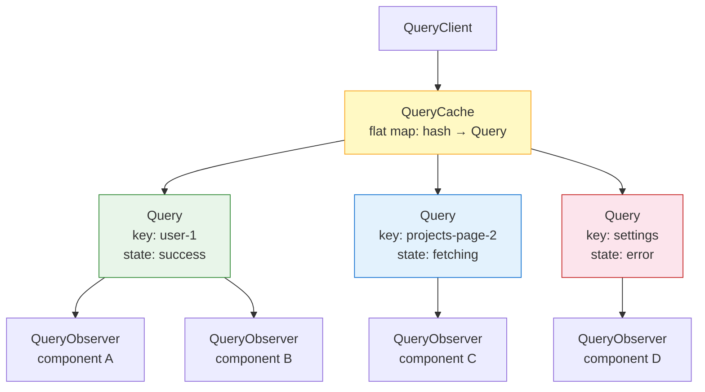
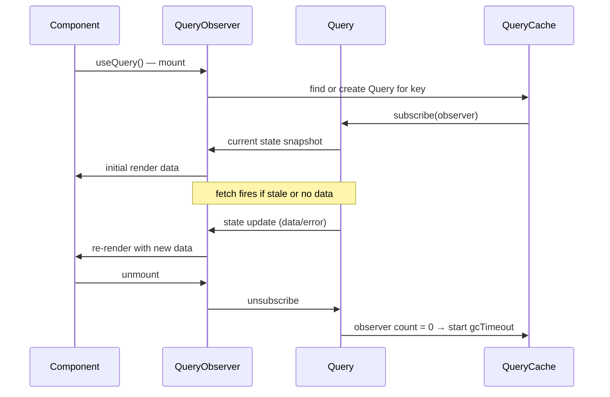

## TanStack Query — Advanced Querying — How the Query Cache Works

### Overview

The query cache is the central data structure of TanStack Query. Every piece of fetched data, every loading state, every error, and every subscriber relationship is tracked inside a single `QueryCache` instance. Understanding its internals — how entries are keyed, how observers connect to queries, how garbage collection operates, and how the cache notifies the UI — clarifies why TanStack Query behaves the way it does across all its higher-level APIs.

---

### The `QueryCache` Instance

`QueryCache` is a class that holds a flat map of all active query entries. It is created internally when a `QueryClient` is instantiated, or can be provided explicitly:

```ts
import { QueryClient, QueryCache } from '@tanstack/react-query'

const queryCache = new QueryCache({
  onError: (error, query) => {
    console.error(`Query failed: ${query.queryKey}`, error)
  },
  onSuccess: (data, query) => {
    console.log(`Query succeeded: ${query.queryKey}`)
  },
  onSettled: (data, error, query) => {
    // fires after every fetch regardless of outcome
  },
})

const queryClient = new QueryClient({ queryCache })
```

**Key Points**

- `QueryClient` wraps `QueryCache` and provides the public-facing API (`prefetchQuery`, `invalidateQueries`, `setQueryData`, etc.)
- `QueryCache` is the raw store — it holds `Query` objects and manages their lifecycle
- Global `onError` / `onSuccess` / `onSettled` callbacks on `QueryCache` fire for every query in the cache, complementing per-query callbacks

---

### Cache Keys: Query Key Hashing

Each cache entry is stored under a **deterministic hash** of its `queryKey`. TanStack Query serializes the query key array into a stable string key regardless of object property order:

```ts
// These two query keys produce the same hash
queryKey: ['user', { id: 1, role: 'admin' }]
queryKey: ['user', { role: 'admin', id: 1 }]
```

**Key Points**

- Arrays are order-sensitive: `['user', 1]` and `[1, 'user']` are different cache entries
- Objects within keys are order-insensitive: property order does not affect the hash
- The hash function is deterministic but internal — it should not be relied upon as a stable external API
- Custom hash functions can be provided via `queryKeyHashFn` at the `QueryClient` level if the default behavior is insufficient

---

### The `Query` Object

Each cache entry is an instance of the `Query` class. It holds:

| Property | Description |
|---|---|
| `queryKey` | The original key array |
| `queryHash` | The serialized hash string used as the map key |
| `state` | Current state object (see below) |
| `observers` | Array of active `QueryObserver` instances |
| `options` | Merged query options |
| `gcTimeout` | Handle for the garbage collection timer |

#### Query State

The `state` object inside each `Query` instance tracks the full fetch lifecycle:

```ts
type QueryState<TData, TError> = {
  data: TData | undefined
  error: TError | null
  status: 'pending' | 'success' | 'error'
  fetchStatus: 'fetching' | 'paused' | 'idle'
  dataUpdatedAt: number        // timestamp of last successful fetch
  errorUpdatedAt: number       // timestamp of last error
  fetchFailureCount: number    // consecutive failure count (for retry logic)
  fetchFailureReason: TError | null
  isInvalidated: boolean       // true if invalidateQueries was called
}
```

**Key Points**

- `status` and `fetchStatus` are independent axes — a query can be `status: 'success'` and `fetchStatus: 'fetching'` simultaneously (background refetch)
- `dataUpdatedAt` is what `initialDataUpdatedAt` and `staleTime` are compared against to determine freshness
- `isInvalidated` flags the entry for refetch on next observation without immediately triggering one if there are no active observers

---

### Cache Structure Diagram



---

### Observers: The Subscription Layer

A `QueryObserver` is created for each `useQuery` call. It represents one component's subscription to a `Query` instance. Multiple observers can subscribe to the same `Query`:

```
useQuery({ queryKey: ['user', 1] })  →  QueryObserver A  ─┐
useQuery({ queryKey: ['user', 1] })  →  QueryObserver B  ─┤→  Query ['user', 1]
useQuery({ queryKey: ['user', 1] })  →  QueryObserver C  ─┘
```

**Key Points**

- All three observers share one `Query` — one cache entry, one in-flight fetch at a time
- Each observer can have its own `select`, `staleTime`, `enabled`, and other per-call options
- When the `Query` state updates, it notifies all subscribed observers, which in turn trigger re-renders in their respective components
- When all observers unsubscribe (all components unmount), the `Query` is no longer actively observed — garbage collection begins

---

### Observer Lifecycle



---

### Garbage Collection

When a `Query` has zero observers, it starts a garbage collection (GC) timer. After `gcTime` milliseconds (default `5 * 60 * 1000` — five minutes), the cache entry is deleted:

```ts
useQuery({
  queryKey: ['report', id],
  queryFn: fetchReport,
  gcTime: 10 * 60 * 1000, // keep in cache for 10 minutes after last observer
})
```

**Key Points**

- GC only fires when observer count reaches zero — actively observed queries are never garbage collected regardless of `gcTime`
- Setting `gcTime: 0` causes immediate cache eviction on unmount — useful for sensitive data that should not persist in memory
- Setting `gcTime: Infinity` disables GC entirely for that query
- `gcTime` is distinct from `staleTime` — `staleTime` governs when data is considered outdated, `gcTime` governs when the cache entry is deleted

#### `staleTime` vs. `gcTime`

```mermaid
gantt
    title Query Lifecycle Timeline
    dateFormat  s
    axisFormat %Ss

    section Observer active
    Data fetched & fresh   :done, a1, 0, 30s
    Data stale             :active, a2, 30s, 60s

    section Observer removed at 60s
    gcTime window          :crit, a3, 60s, 120s
    Cache deleted at 120s  :milestone, a4, 120s, 120s
```

---

### Structural Sharing

When new data arrives for a cache entry, TanStack Query performs a **deep comparison** between the previous and incoming data. If a nested object is referentially equal to its counterpart in the new data, the old reference is preserved:

```ts
// Previous cache value
{ users: [{ id: 1, name: 'Alice' }, { id: 2, name: 'Bob' }] }

// Incoming value (Bob's name updated)
{ users: [{ id: 1, name: 'Alice' }, { id: 2, name: 'Bobby' }] }

// After structural sharing:
// - Root object: new reference
// - users array: new reference
// - users[0] ({ id: 1, name: 'Alice' }): SAME reference as before
// - users[1]: new reference (changed)
```

**Key Points**

- Components or selectors that depend on `users[0]` do not re-render — the reference is identical
- This is automatic and requires no configuration
- Structural sharing can be disabled per-query with `structuralSharing: false`, or replaced with a custom comparator function
- [Inference] Structural sharing is the mechanism that makes `select` memoization reliable for nested data. Without it, every fetch would produce new object references throughout the tree, causing all observers to re-render regardless of whether their slice changed.

---

### Cache Interactions via `QueryClient`

The `QueryClient` API surfaces controlled access to the cache:

| Method | Description |
|---|---|
| `getQueryData(key)` | Synchronous read of cached `data` |
| `setQueryData(key, updater)` | Synchronous write to cached `data` |
| `getQueryState(key)` | Synchronous read of full `QueryState` |
| `invalidateQueries(filters)` | Mark matching entries as stale; refetch if observed |
| `removeQueries(filters)` | Delete matching entries immediately |
| `resetQueries(filters)` | Reset matching entries to initial state |
| `cancelQueries(filters)` | Abort in-flight fetches for matching entries |
| `prefetchQuery(options)` | Fetch and cache without a component |
| `getQueriesData(filters)` | Read data from all matching entries |
| `setQueriesData(filters, updater)` | Write to all matching entries |

#### `setQueryData`

```ts
// Direct set
queryClient.setQueryData(['user', id], newUser)

// Functional update (receives previous value)
queryClient.setQueryData(['user', id], (prev) => ({
  ...prev,
  name: 'Updated Name',
}))
```

**Key Points**

- `setQueryData` triggers an immediate re-render in all observers of that key
- The update bypasses the `queryFn` — no network request is made
- The written value is treated as if it came from a successful fetch — `dataUpdatedAt` is updated to `Date.now()`
- This is the mechanism behind optimistic updates

---

### `invalidateQueries` Internals

When `invalidateQueries` is called:

1. Matching `Query` entries have `isInvalidated` set to `true` in their state
2. If the query has active observers, a refetch is triggered immediately
3. If the query has no active observers, it is marked stale — the next time a component mounts and subscribes, it will fetch

```ts
queryClient.invalidateQueries({ queryKey: ['projects'] })
// Matches: ['projects'], ['projects', 1], ['projects', { status: 'active' }]
```

**Key Points**

- Invalidation uses **fuzzy prefix matching** — a partial key matches all entries whose key starts with that prefix
- `exact: true` can be passed to restrict matching to exact key equality
- Invalidation does not delete the cache entry — existing data remains visible to observers until the refetch resolves

---

### Cache Notification and Render Coordination

When query state changes, the `Query` calls `notify()` on each of its observers. Each observer computes whether the change is relevant to its current subscription (accounting for `select`, `notifyOnChangeProps`, and other filters) before triggering a React re-render:

```
Query state changes
  → Query.notify(observers)
    → Observer.onQueryUpdate(action)
      → observer computes: should this trigger a re-render?
        → Yes: schedules React re-render
        → No: skips
```

**Key Points**

- `notifyOnChangeProps` can be used to restrict which state properties cause a re-render for a given observer:

```ts
useQuery({
  queryKey: ['user', id],
  queryFn: fetchUser,
  notifyOnChangeProps: ['data'], // only re-render when data changes; ignore status, fetchStatus, etc.
})
```

- [Inference] `notifyOnChangeProps: 'all'` opts into re-rendering on any state change. The default behavior tracks which properties were accessed during the last render and only notifies on changes to those. This tracked property behavior may vary across environments and React versions.

---

### Persistence Plugins

The in-memory cache can be persisted to external storage (localStorage, IndexedDB, AsyncStorage) using persistence plugins:

```ts
import { createSyncStoragePersister } from '@tanstack/query-sync-storage-persister'
import { persistQueryClient } from '@tanstack/react-query-persist-client'

const persister = createSyncStoragePersister({
  storage: window.localStorage,
})

persistQueryClient({
  queryClient,
  persister,
  maxAge: 1000 * 60 * 60 * 24, // 24 hours
})
```

**Key Points**

- On app load, the persisted cache is restored before any queries mount — components may find their data already in cache
- `maxAge` determines how long persisted cache data is considered valid; expired persisted data is discarded on restore
- Only queries with `gcTime` greater than `0` (the default) are eligible for persistence — queries with `gcTime: 0` are evicted immediately and never written to persistent storage
- [Inference] Persisting sensitive data to localStorage has security implications. Data written to localStorage is accessible to any JavaScript running on the same origin. This should be treated as an architectural decision, not a default.

---

### Summary

The query cache is a flat, hash-keyed map of `Query` instances, each holding its own state, observer list, and GC timer. Key properties of the system:

- **Keying** — query keys are hashed deterministically; arrays are order-sensitive, objects are order-insensitive
- **Observers** — each `useQuery` call creates an observer; multiple observers share one cache entry and one in-flight fetch
- **GC** — entries without observers are deleted after `gcTime`; `staleTime` and `gcTime` are independent
- **Structural sharing** — unchanged nested references are preserved on update, minimizing unnecessary re-renders
- **Notification** — state changes propagate from `Query` → observers → React renders, with per-observer filtering via `notifyOnChangeProps`
- **`QueryClient` API** — controlled synchronous and asynchronous access to cache entries via `getQueryData`, `setQueryData`, `invalidateQueries`, and related methods
- **Persistence** — the in-memory cache can be serialized to external storage via the persistence plugin API

**Next Steps** — Mutations: `useMutation`, lifecycle callbacks, and coordinating server writes