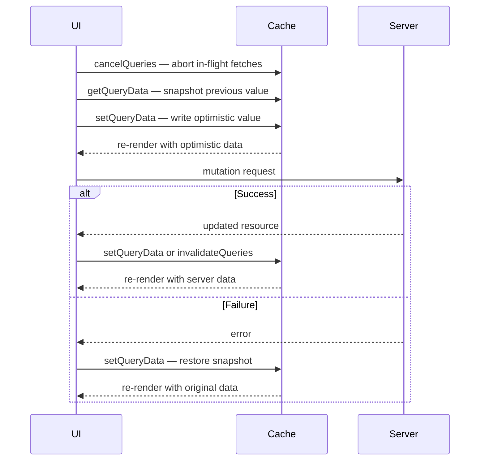

## TanStack Query — Advanced Querying — Manual Cache Updates with `setQueryData`

### Overview

`setQueryData` is a synchronous method on `QueryClient` that writes directly to a cache entry, bypassing the `queryFn` entirely. The written value is treated as if it arrived from a successful fetch — observers are notified immediately, components re-render, and `dataUpdatedAt` is updated. No network request is made.

The primary use cases are optimistic updates, writing server responses from mutations directly into the cache, and synchronizing related cache entries after a data change.

---

### Basic Usage

```ts
queryClient.setQueryData(queryKey, newData)
```

```ts
// Direct value
queryClient.setQueryData(['user', id], {
  id,
  name: 'Jane Smith',
  role: 'admin',
})
```

**Key Points**

- The query key must match exactly the key under which data was cached
- If no cache entry exists for the key, one is created
- All active observers of that key re-render immediately
- `dataUpdatedAt` is set to `Date.now()` — the written value is treated as freshly fetched

---

### Functional Updater Form

`setQueryData` accepts a function as its second argument, receiving the previous cached value:

```ts
queryClient.setQueryData<User>(['user', id], (prev) => {
  if (!prev) return prev // guard against missing cache entry
  return { ...prev, name: 'Updated Name' }
})
```

**Key Points**

- The functional form is the idiomatic approach for partial updates — it avoids overwriting fields not included in the update
- If the updater returns `undefined`, the cache entry is **not updated** — this is the escape hatch for conditional no-ops
- The previous value may be `undefined` if no cache entry exists; always guard against this
- [Inference] Returning `undefined` from the updater is distinct from setting the value to `undefined` explicitly. Returning `undefined` cancels the update; there is no way to set a cache entry's data to `undefined` using `setQueryData`. This distinction is version-dependent and should be verified.

---

### Type Safety

`setQueryData` is generic — the type parameter constrains both the updater's input and output:

```ts
queryClient.setQueryData<User[]>(['users'], (prev) => {
  if (!prev) return []
  return [...prev, newUser]
})
```

**Key Points**

- The type parameter should match the type returned by the corresponding `queryFn`
- Without the type parameter, TypeScript infers `unknown` for `prev`, requiring explicit casts
- [Inference] Type safety of `setQueryData` depends on consistent typing between the `queryFn` return type and the generic passed to `setQueryData`. Divergence between the two is a runtime risk that TypeScript cannot always detect. Query factories or typed wrapper functions help enforce consistency.

---

### After a Mutation: Writing Server Response to Cache

When a mutation returns the updated resource from the server, the response can be written directly into the cache — avoiding a redundant refetch:

```ts
const mutation = useMutation({
  mutationFn: (updated: User) => updateUser(updated),
  onSuccess: (serverResponse) => {
    // Write the authoritative server response into cache
    queryClient.setQueryData(['user', serverResponse.id], serverResponse)
  },
})
```

**Key Points**

- The server response is the most reliable value to write — it reflects what the server actually persisted
- This pattern avoids an extra `GET` request after a successful `PUT` / `PATCH`
- [Inference] If the server returns a partial response (e.g., only changed fields), use the functional updater form to merge with the existing cache value rather than overwriting it entirely

---

### Optimistic Updates

Optimistic updates write an anticipated value to the cache **before** the mutation reaches the server, making the UI feel instantaneous. The prior cache value is saved and restored on failure:

```ts
const mutation = useMutation({
  mutationFn: updateTodo,

  onMutate: async (updatedTodo) => {
    // 1. Cancel in-flight fetches to prevent overwriting optimistic value
    await queryClient.cancelQueries({ queryKey: ['todos'] })

    // 2. Snapshot previous value
    const previousTodos = queryClient.getQueryData<Todo[]>(['todos'])

    // 3. Apply optimistic update
    queryClient.setQueryData<Todo[]>(['todos'], (prev) => {
      if (!prev) return prev
      return prev.map((todo) =>
        todo.id === updatedTodo.id ? { ...todo, ...updatedTodo } : todo
      )
    })

    // 4. Return snapshot for rollback
    return { previousTodos }
  },

  onError: (_error, _updatedTodo, context) => {
    // Rollback to snapshot
    queryClient.setQueryData(['todos'], context?.previousTodos)
  },

  onSettled: () => {
    // Refetch to sync with server after success or failure
    queryClient.invalidateQueries({ queryKey: ['todos'] })
  },
})
```

**Key Points**

- `cancelQueries` must be `await`ed — without it, an in-flight fetch may resolve after the optimistic update and overwrite it
- `onMutate` return value is passed as `context` to `onError` and `onSettled`
- `onSettled` invalidation is a safety net — it ensures the cache eventually reflects server truth even if the optimistic value was correct
- [Inference] The optimistic update pattern assumes the mutation will usually succeed. For mutations with high failure rates, the visible rollback flicker may worsen UX rather than improve it

---

### Optimistic Update Flow



---

### Updating Related Cache Entries

A single mutation often affects multiple cache entries. `setQueryData` can be called multiple times in a single `onSuccess` handler:

```ts
onSuccess: (updatedProject) => {
  // Update the detail entry
  queryClient.setQueryData(
    ['project', updatedProject.id],
    updatedProject
  )

  // Update the item in the list entry
  queryClient.setQueryData<Project[]>(['projects'], (prev) => {
    if (!prev) return prev
    return prev.map((p) =>
      p.id === updatedProject.id ? updatedProject : p
    )
  })
}
```

**Key Points**

- Each `setQueryData` call triggers an independent notification to that key's observers
- [Inference] In React, multiple synchronous `setQueryData` calls within the same callback may be batched into a single render pass depending on the React version and rendering context. This is not guaranteed — behavior depends on the React scheduler.
- For broad or unpredictable cache invalidation, `invalidateQueries` is simpler and more robust than manually updating every affected entry

---

### `setQueriesData`

For updating multiple matching cache entries in one call:

```ts
queryClient.setQueriesData<Project[]>(
  { queryKey: ['projects'] },
  (prev) => {
    if (!prev) return prev
    return prev.map((p) =>
      p.id === updatedId ? { ...p, status: 'archived' } : p
    )
  }
)
```

**Key Points**

- The first argument is a query filter — the same fuzzy matching as `invalidateQueries`
- The updater function is called once per matching cache entry
- Useful when the same field exists across multiple paginated or parameterized cache entries (e.g., `['projects', 1]`, `['projects', 2]`, `['projects', { status: 'active' }]`)
- [Inference] `setQueriesData` applies the updater to every matching entry regardless of their individual shapes. If matching entries have heterogeneous data types, the updater must account for all possible shapes or be scoped more narrowly.

---

### Updating Infinite Query Cache Entries

`setQueryData` on an infinite query must preserve the `InfiniteData` shape:

```ts
queryClient.setQueryData<InfiniteData<TodoPage>>(
  ['todos', 'infinite'],
  (prev) => {
    if (!prev) return prev
    return {
      ...prev,
      pages: prev.pages.map((page) => ({
        ...page,
        items: page.items.map((item) =>
          item.id === updatedTodo.id ? updatedTodo : item
        ),
      })),
    }
  }
)
```

**Key Points**

- The `pages` and `pageParams` arrays must remain intact
- Mutating the structure (e.g., removing `pageParams`) breaks TanStack Query's internal paging logic
- [Inference] Failing to spread the outer object and each page may cause structural sharing to treat the entire cache entry as changed, triggering unnecessary re-renders across all observers

---

### `setQueryData` vs. `invalidateQueries`

| Concern | `setQueryData` | `invalidateQueries` |
|---|---|---|
| Network request | None | Fires if observed |
| Data source | Caller-provided | Server (via `queryFn`) |
| Timing | Immediate | After refetch resolves |
| Use case | Known new value available | Source of truth is server |
| Risk | Cache/server divergence | Momentary stale display |
| Complexity | Higher (manual shape management) | Lower |

**Key Points**

- `setQueryData` is appropriate when the new value is already known (server response, optimistic update)
- `invalidateQueries` is appropriate when the correct value should be re-fetched from the server
- Combining both is the most conservative approach: write immediately with `setQueryData`, then validate with `invalidateQueries` in `onSettled`

---

### `getQueryData` and `getQueryState`

These are the read counterparts to `setQueryData`:

```ts
// Read cached data
const user = queryClient.getQueryData<User>(['user', id])

// Read full query state (includes dataUpdatedAt, status, error, etc.)
const state = queryClient.getQueryState(['user', id])
const lastFetched = state?.dataUpdatedAt
```

**Key Points**

- Both are synchronous — they read from the in-memory cache with no side effects
- `getQueryData` returns `undefined` if no cache entry exists or if the entry has no data
- `getQueryState` returns `undefined` if no cache entry exists at all
- These are the standard tools for reading cache values in `onMutate` before applying an optimistic update

---

### Common Pitfalls

| Pitfall | Description |
|---|---|
| Not guarding against `undefined` prev | If no cache entry exists, the updater receives `undefined`; unguarded spread throws |
| Forgetting to `await cancelQueries` | In-flight fetch may resolve after optimistic update and overwrite it |
| Overwriting instead of merging | Direct value form replaces the entire cache entry — partial updates require the functional form |
| Wrong cache key | Key must exactly match the stored entry; mismatches silently create new entries |
| Incorrect `InfiniteData` shape | Omitting `pages` / `pageParams` structure breaks infinite query pagination |
| Skipping `onSettled` invalidation | Optimistic value may persist indefinitely if server returns different data and no refetch is triggered |

---

### Summary

`setQueryData` is the primary escape hatch for writing into the TanStack Query cache imperatively. Its key properties:

- **Synchronous** — writes take effect immediately, observers re-render in the same tick
- **Functional updater** — receives previous value; returning `undefined` cancels the update
- **Cache creation** — creates a new entry if none exists for the given key
- **No network request** — bypasses `queryFn` entirely
- **Optimistic updates** — the central tool for the snapshot → optimistic write → rollback pattern
- **`setQueriesData`** — bulk variant for updating multiple matching entries simultaneously
- **Complements `invalidateQueries`** — best combined: write immediately, invalidate in `onSettled` to reconcile with server truth

**Next Steps** — Mutations: `useMutation`, lifecycle callbacks, and coordinating server writes