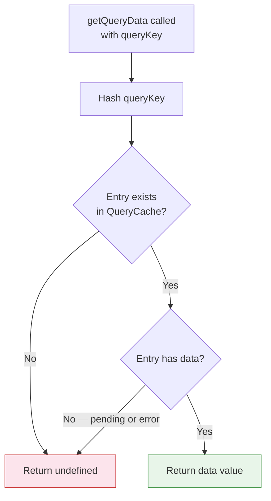

## TanStack Query — Advanced Querying — Reading the Cache with `getQueryData`

### Overview

`getQueryData` is a synchronous, side-effect-free method on `QueryClient` that reads the current `data` value stored in a cache entry. It does not trigger a fetch, does not create a cache entry, does not notify observers, and does not affect staleness. It is a pure memory read — the fastest possible way to access cached values outside of a React component.

It is the standard tool for reading cache values imperatively: in mutation callbacks, in router loaders, before optimistic updates, and in utility functions that need to inspect cache state without subscribing to it.

---

### Basic Usage

```ts
const data = queryClient.getQueryData(queryKey)
```

```ts
const user = queryClient.getQueryData<User>(['user', id])
```

**Key Points**

- Returns the cached `data` value if a cache entry exists and has data
- Returns `undefined` if no cache entry exists, or if the entry exists but has never successfully fetched
- Does not distinguish between a missing entry and an entry in error state — both return `undefined`
- The query key must match the stored entry exactly — the same hashing rules apply as with `useQuery`

---

### Type Parameter

Without a type parameter, `getQueryData` returns `unknown`:

```ts
const data = queryClient.getQueryData(['user', id])
// data: unknown
```

With a type parameter:

```ts
const data = queryClient.getQueryData<User>(['user', id])
// data: User | undefined
```

**Key Points**

- The type parameter is a **cast**, not a verified type — TypeScript trusts the caller that the cache entry holds a value of that shape
- [Inference] If the actual cached value does not match the declared type (e.g., due to a schema change or incorrect generic), TypeScript will not surface an error at the call site. Runtime behavior depends on how the returned value is used. Type safety here relies on discipline, not enforcement.
- Query factory functions with co-located types are the standard mitigation — see the Query Key Factories section below

---

### `getQueryData` vs. `useQuery`

| Concern | `getQueryData` | `useQuery` |
|---|---|---|
| Context | Any — outside React | React component only |
| Subscribes to updates | No | Yes |
| Triggers fetch | No | Yes (if stale or missing) |
| Returns loading/error state | No | Yes |
| Reactivity | None | Re-renders on change |
| Use case | One-time read, callbacks, loaders | Ongoing data subscription |

`getQueryData` is appropriate when a value is needed once, synchronously, without establishing an ongoing subscription. `useQuery` is appropriate when the component needs to stay in sync with cache changes over time.

---

### Common Usage Contexts

#### In `onMutate` — Reading Before Optimistic Update

The most common use of `getQueryData` is snapshotting the current cache value before applying an optimistic update, so it can be restored on failure:

```ts
const mutation = useMutation({
  mutationFn: updateTodo,
  onMutate: async (updatedTodo) => {
    await queryClient.cancelQueries({ queryKey: ['todos'] })

    // Snapshot before optimistic write
    const previousTodos = queryClient.getQueryData<Todo[]>(['todos'])

    queryClient.setQueryData<Todo[]>(['todos'], (prev) => {
      if (!prev) return prev
      return prev.map((t) =>
        t.id === updatedTodo.id ? { ...t, ...updatedTodo } : t
      )
    })

    return { previousTodos }
  },
  onError: (_err, _vars, context) => {
    // Restore snapshot
    queryClient.setQueryData(['todos'], context?.previousTodos)
  },
})
```

#### In Route Loaders — Checking Cache Before Prefetch

```ts
loader: async ({ params }) => {
  const cached = queryClient.getQueryData<Project>(['project', params.id])

  if (cached) {
    // Cache hit — no prefetch needed
    return null
  }

  // Cache miss — prefetch before component mounts
  return queryClient.prefetchQuery({
    queryKey: ['project', params.id],
    queryFn: () => fetchProject(params.id),
  })
}
```

**Key Points**

- This pattern avoids redundant prefetch calls when the cache is already populated
- [Inference] Staleness is not checked here — only presence of data. If fresh data is required, `getQueryState` should be consulted to compare `dataUpdatedAt` against a `staleTime` threshold before deciding to skip prefetch. `getQueryData` alone cannot distinguish fresh from stale data.

#### In Utility Functions — Cross-Query Data Access

```ts
function getFullUserContext(userId: string) {
  const user = queryClient.getQueryData<User>(['user', userId])
  const permissions = queryClient.getQueryData<Permission[]>(['permissions', userId])
  const org = queryClient.getQueryData<Org>(['org', user?.orgId])

  return { user, permissions, org }
}
```

---

### `getQueryState` — Reading Full Query State

When more than just `data` is needed, `getQueryState` returns the complete `QueryState` object:

```ts
const state = queryClient.getQueryState(['user', id])
```

```ts
type QueryState<TData, TError> = {
  data: TData | undefined
  error: TError | null
  status: 'pending' | 'success' | 'error'
  fetchStatus: 'fetching' | 'paused' | 'idle'
  dataUpdatedAt: number
  errorUpdatedAt: number
  fetchFailureCount: number
  fetchFailureReason: TError | null
  isInvalidated: boolean
}
```

**Key Points**

- Returns `undefined` if no cache entry exists for the key
- `dataUpdatedAt` is a Unix timestamp in milliseconds — useful for determining whether data is within a custom freshness window
- `status` and `fetchStatus` are the same axes tracked by `useQuery`

#### Checking Staleness Manually

```ts
const state = queryClient.getQueryState(['projects'])
const STALE_THRESHOLD = 60_000 // 60 seconds

const isStale =
  !state?.dataUpdatedAt ||
  Date.now() - state.dataUpdatedAt > STALE_THRESHOLD

if (isStale) {
  await queryClient.prefetchQuery({
    queryKey: ['projects'],
    queryFn: fetchProjects,
  })
}
```

---

### `getQueriesData` — Reading Multiple Entries

For reading data from all cache entries matching a filter:

```ts
const results = queryClient.getQueriesData<Project>({
  queryKey: ['projects'],
})
// Returns: Array<[QueryKey, Project | undefined]>
```

```ts
results.forEach(([key, data]) => {
  console.log(key, data)
})
```

**Key Points**

- The return type is an array of `[queryKey, data]` tuples — one per matching cache entry
- Fuzzy prefix matching applies — `['projects']` matches `['projects']`, `['projects', 1]`, `['projects', { status: 'active' }]`, etc.
- `data` may be `undefined` for entries that exist but have no data yet
- Useful for aggregating or inspecting cache entries across parameterized query families

---

### Cache Read Flow



---

### Query Key Factories for Type-Safe Reads

Pairing `getQueryData` with a query key factory and co-located types reduces the risk of type mismatches:

```ts
// queries/projects.ts

export const projectKeys = {
  all: () => ['projects'] as const,
  detail: (id: string) => ['projects', id] as const,
}

export type ProjectsData = Project[]
export type ProjectDetailData = Project

// Usage
const projects = queryClient.getQueryData<ProjectsData>(projectKeys.all())
const project = queryClient.getQueryData<ProjectDetailData>(projectKeys.detail(id))
```

**Key Points**

- The factory function guarantees the key shape is consistent between `useQuery` and `getQueryData`
- Co-locating the data type with the key factory creates a single source of truth for both key and type
- [Inference] This pattern does not enforce that the type matches the actual `queryFn` return type at compile time unless the factory also exports typed hook wrappers. It reduces human error but does not eliminate the risk entirely.

---

### Accessing the Query Client Outside React

In contexts without access to `useQueryClient`, the client must be accessed from wherever it was instantiated:

```ts
// queryClient.ts — singleton export
import { QueryClient } from '@tanstack/react-query'

export const queryClient = new QueryClient()
```

```ts
// Any non-React module
import { queryClient } from './queryClient'

const user = queryClient.getQueryData<User>(['user', currentUserId])
```

**Key Points**

- Exporting a singleton `queryClient` is the standard pattern for accessing the cache outside React
- The same instance must be provided to `QueryClientProvider` — a mismatch produces two separate caches
- [Inference] Singleton `QueryClient` instances are appropriate for client-side applications. SSR environments typically create one `QueryClient` per request to avoid shared state across requests. Using a singleton in SSR may cause data leakage between users. This is a critical architectural distinction.

---

### `getQueryData` in Tests

Reading cache state is useful for asserting that mutations updated the cache correctly:

```ts
import { renderHook, waitFor } from '@testing-library/react'

test('mutation updates user cache', async () => {
  const { result } = renderHook(() => useUpdateUser(), { wrapper })

  await result.current.mutateAsync({ id: '1', name: 'Updated' })

  const cached = queryClient.getQueryData<User>(['user', '1'])
  expect(cached?.name).toBe('Updated')
})
```

---

### Common Pitfalls

| Pitfall | Description |
|---|---|
| Assuming non-`undefined` return | Cache may be empty; always guard the returned value |
| Using as a staleness check | `getQueryData` returns data regardless of staleness; use `getQueryState` for `dataUpdatedAt` |
| Key mismatch | Wrong key silently returns `undefined`; verify key matches the `useQuery` call exactly |
| Incorrect type parameter | TypeScript trusts the caller; a wrong generic produces a type-safe lie |
| Singleton in SSR | Shared `QueryClient` across requests leaks data between users |
| Confusing with reactivity | `getQueryData` is a one-time read; it does not subscribe to updates |

---

### Summary

`getQueryData` is a lightweight, synchronous cache read with no side effects. Its key properties:

- **Returns `data` only** — `undefined` for missing entries or entries without data
- **No subscription** — does not trigger fetches, re-renders, or observer registration
- **Type parameter is a cast** — discipline and query key factories are required for type safety
- **`getQueryState`** — the companion method for accessing the full state object including `dataUpdatedAt`, `status`, and `error`
- **`getQueriesData`** — bulk read variant for all entries matching a key filter
- **Optimistic update snapshot** — the canonical use case: read before write, restore on failure

**Next Steps** — Mutations: `useMutation`, lifecycle callbacks, and coordinating server writes