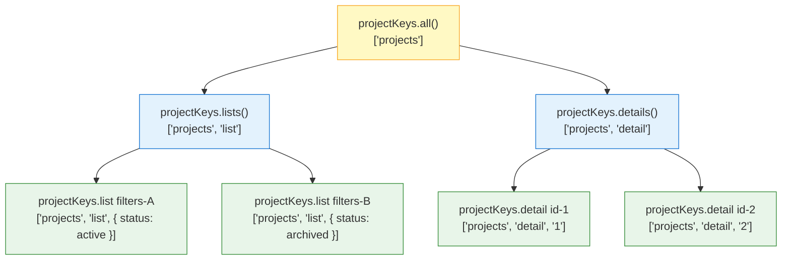
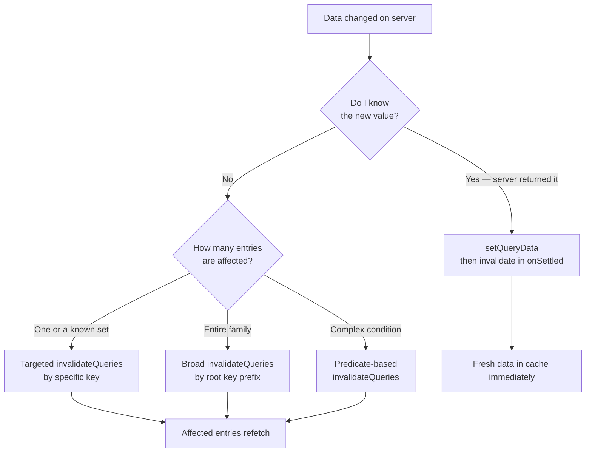

## TanStack Query — Advanced Querying — Cache Invalidation Strategies

### Overview

Cache invalidation is the process of marking cached data as outdated so that the next observation triggers a fresh fetch from the server. TanStack Query's invalidation system is declarative — callers describe *which* entries to invalidate using key filters, and the library determines *when* to refetch based on whether those entries have active observers.

Invalidation is the primary mechanism for keeping client cache state synchronized with server state after writes, and its design determines correctness, network efficiency, and UX consistency across the application.

---

### `invalidateQueries` — Core API

```ts
queryClient.invalidateQueries({ queryKey: ['projects'] })
```

When called:

1. All matching cache entries have `isInvalidated` set to `true`
2. Entries with **active observers** are refetched immediately
3. Entries with **no active observers** are marked stale — they refetch the next time a component mounts and subscribes

**Key Points**

- Invalidation does not delete cache entries — existing data remains visible until the refetch resolves
- The `isInvalidated` flag is separate from `staleTime` — an invalidated query refetches regardless of whether it is within its `staleTime` window
- `invalidateQueries` returns a `Promise<void>` that resolves when all triggered refetches complete

---

### Key Matching and Scope

`invalidateQueries` uses **fuzzy prefix matching** by default — a partial key matches all entries whose key starts with that prefix:

```ts
// Invalidates ALL of the following:
// ['projects']
// ['projects', 1]
// ['projects', { status: 'active' }]
// ['projects', 1, 'tasks']
queryClient.invalidateQueries({ queryKey: ['projects'] })
```

#### Exact Matching

```ts
// Invalidates only ['projects'] — not ['projects', 1]
queryClient.invalidateQueries({
  queryKey: ['projects'],
  exact: true,
})
```

#### Predicate Matching

For fine-grained control, a `predicate` function receives each `Query` object and returns a boolean:

```ts
queryClient.invalidateQueries({
  predicate: (query) =>
    query.queryKey[0] === 'projects' &&
    query.state.dataUpdatedAt < someCutoffTimestamp,
})
```

**Key Points**

- `predicate` is evaluated against every entry in the cache — it is more flexible but also more expensive than key-based matching
- `predicate` and `queryKey` can be combined — entries must satisfy both
- [Inference] For large caches, predicate-based invalidation may be slower than key-based invalidation. This is unlikely to be a bottleneck in typical applications but is worth considering in cache-heavy scenarios.

---

### Query Key Factories and Invalidation Scope

The hierarchical structure of query key factories maps directly to invalidation scope:

```ts
export const projectKeys = {
  all:     ()                  => ['projects']                    as const,
  lists:   ()                  => ['projects', 'list']            as const,
  list:    (filters: Filters)  => ['projects', 'list', filters]   as const,
  details: ()                  => ['projects', 'detail']          as const,
  detail:  (id: string)        => ['projects', 'detail', id]      as const,
}
```

```ts
// Invalidate everything project-related
queryClient.invalidateQueries({ queryKey: projectKeys.all() })

// Invalidate all list variants (all filter combinations)
queryClient.invalidateQueries({ queryKey: projectKeys.lists() })

// Invalidate one specific list
queryClient.invalidateQueries({ queryKey: projectKeys.list({ status: 'active' }) })

// Invalidate one specific detail
queryClient.invalidateQueries({ queryKey: projectKeys.detail(id) })
```

**Key Points**

- The factory hierarchy encodes invalidation scope directly into the key structure
- This is the primary reason query key factories are recommended — they make invalidation scope explicit, consistent, and refactor-safe
- [Inference] Without a factory, invalidation key strings are duplicated across mutation handlers and are prone to drift over time. Factories centralize this and are strongly advisable for any non-trivial application.

---

### Invalidation Scope Diagram



Invalidating at any level cascades to all descendants. Invalidating at a leaf affects only that entry.

---

### Strategy 1 — Broad Invalidation After Mutation

The simplest and most conservative strategy: after any write, invalidate the entire related query family.

```ts
const mutation = useMutation({
  mutationFn: createProject,
  onSuccess: () => {
    queryClient.invalidateQueries({ queryKey: projectKeys.all() })
  },
})
```

**Key Points**

- Simple to reason about — no risk of stale data after a write
- Potentially over-fetches — list and detail queries for other projects refetch even if they were not affected
- Appropriate for low-traffic applications or queries with fast response times
- [Inference] For high-frequency mutations or slow queries, broad invalidation may produce noticeable UI flicker or excessive network traffic. Targeted invalidation is preferable in those cases.

---

### Strategy 2 — Targeted Invalidation

Invalidate only the entries logically affected by the mutation:

```ts
const mutation = useMutation({
  mutationFn: updateProject,
  onSuccess: (updatedProject) => {
    // Only this project's detail is directly affected
    queryClient.invalidateQueries({
      queryKey: projectKeys.detail(updatedProject.id),
    })

    // Lists may show stale summary data (name, status) — invalidate them too
    queryClient.invalidateQueries({
      queryKey: projectKeys.lists(),
    })
  },
})
```

**Key Points**

- More surgical — avoids refetching unrelated detail entries
- Requires understanding of which cache entries are affected by each mutation type
- [Inference] As application complexity grows, maintaining accurate targeted invalidation becomes increasingly difficult. A mismatch between the actual and expected scope of a mutation's effects leads to stale cache entries. Broad invalidation with scoped query key factories is often a better tradeoff than fine-grained per-mutation targeting.

---

### Strategy 3 — Write Then Invalidate

Combine `setQueryData` for immediacy with `invalidateQueries` for correctness:

```ts
const mutation = useMutation({
  mutationFn: updateProject,
  onSuccess: (updatedProject) => {
    // Immediate update — no loading state
    queryClient.setQueryData(
      projectKeys.detail(updatedProject.id),
      updatedProject
    )
  },
  onSettled: () => {
    // Reconcile with server truth regardless of success or failure
    queryClient.invalidateQueries({ queryKey: projectKeys.all() })
  },
})
```

**Key Points**

- `onSuccess` provides the fast path — `data` updates instantly from the server response
- `onSettled` fires on both success and error — it is the safety net that corrects any divergence between the optimistic/direct write and actual server state
- This is the most common production pattern for mutations that return the updated resource
- [Inference] Separating the immediate write (`onSuccess`) from the reconciliation refetch (`onSettled`) means two renders may occur: one from `setQueryData` and one from the refetch completing. Whether this is noticeable depends on how quickly the refetch resolves.

---

### Strategy 4 — Invalidation on Window Focus

TanStack Query refetches stale queries automatically when the window regains focus (`refetchOnWindowFocus: true` by default). This is passive invalidation — no explicit call is needed:

```ts
// Configured globally
const queryClient = new QueryClient({
  defaultOptions: {
    queries: {
      refetchOnWindowFocus: true, // default
      staleTime: 30_000,
    },
  },
})
```

**Key Points**

- Data older than `staleTime` refetches when the user returns to the tab
- Requires no mutation coordination — useful for data that changes server-side independently of user actions
- Combine with a reasonable `staleTime` to avoid refetching on every tab switch

---

### Strategy 5 — Invalidation on Network Reconnect

```ts
const queryClient = new QueryClient({
  defaultOptions: {
    queries: {
      refetchOnReconnect: true, // default
    },
  },
})
```

**Key Points**

- Refetches stale queries when the browser detects a network reconnection
- Critical for applications used in intermittent connectivity environments
- Works in conjunction with `staleTime` — only queries older than `staleTime` are refetched

---

### Strategy 6 — Time-Based Invalidation via `staleTime`

Rather than explicit post-mutation invalidation, some queries are governed purely by time:

```ts
useQuery({
  queryKey: ['exchange-rates'],
  queryFn: fetchExchangeRates,
  staleTime: 5 * 60 * 1000, // treat as fresh for 5 minutes
})
```

**Key Points**

- No explicit `invalidateQueries` call is needed — the query becomes stale after `staleTime` and refetches on the next observation trigger (focus, mount, reconnect)
- Appropriate for data that changes on a predictable server-side schedule and does not depend on user mutations
- Setting `staleTime: Infinity` effectively disables automatic invalidation — the data never becomes stale without an explicit `invalidateQueries` call

---

### Strategy 7 — Predicate-Based Selective Invalidation

For complex invalidation rules that do not map cleanly to key prefixes:

```ts
queryClient.invalidateQueries({
  predicate: (query) => {
    const [entity, , params] = query.queryKey as [string, string, Record<string, unknown>]
    return (
      entity === 'projects' &&
      params?.orgId === currentOrgId
    )
  },
})
```

**Key Points**

- Predicate receives the full `Query` object — `queryKey`, `state`, `options`, and `observers` are all accessible
- Useful when invalidation scope cannot be expressed as a simple key prefix
- [Inference] Accessing `query.observers` in a predicate to check subscriber count is possible but couples invalidation logic to internal cache structure. This should be used with caution and verified against the specific version in use.

---

### Awaiting Invalidation

`invalidateQueries` is async and resolves when all triggered refetches complete:

```ts
const mutation = useMutation({
  mutationFn: deleteProject,
  onSuccess: async () => {
    // Wait for the list to be fully refreshed before navigating
    await queryClient.invalidateQueries({ queryKey: projectKeys.lists() })
    navigate('/projects')
  },
})
```

**Key Points**

- Awaiting is useful when subsequent logic depends on fresh data being in cache (e.g., navigation, downstream updates)
- If not awaited, invalidation fires asynchronously — the mutation callback returns before refetches complete
- [Inference] Awaiting invalidation in `onSuccess` blocks the mutation's settled state until all refetches complete. For slow queries, this may delay UI feedback. Whether to await depends on whether the completion of the refetch is a precondition for the next action.

---

### Invalidation vs. Removal vs. Reset

| Method | Effect on data | Effect on status | Triggers refetch |
|---|---|---|---|
| `invalidateQueries` | Preserved until refetch | `isInvalidated = true` | If observed |
| `removeQueries` | Deleted immediately | Entry gone | On next mount |
| `resetQueries` | Reset to `initialData` or `undefined` | Back to `pending` | If observed |

```ts
// Remove — entry is deleted; next mount starts from scratch
queryClient.removeQueries({ queryKey: ['project', id] })

// Reset — entry reverts to initial state
queryClient.resetQueries({ queryKey: ['project', id] })
```

**Key Points**

- `removeQueries` is appropriate for cache entries that are no longer relevant (e.g., after logout, after deleting a resource)
- `resetQueries` is appropriate for returning a query to its initial loading state without discarding the key — useful for "refresh from zero" UX
- `invalidateQueries` is appropriate for the common case: data may be stale, but it should remain visible until the server responds

---

### Invalidation Decision Map



---

### Common Pitfalls

| Pitfall | Description |
|---|---|
| Invalidating too broadly always | Triggers unnecessary refetches; prefer scoped key factories |
| Invalidating too narrowly | Leaves related entries stale; leads to inconsistent UI |
| Not using `onSettled` | `onSuccess`-only invalidation skips cleanup on mutation failure |
| Forgetting unobserved entries | Invalidation marks them stale but no refetch fires until a component mounts |
| Key mismatch in invalidation | Wrong prefix silently invalidates nothing; test with `getQueryCache().findAll` |
| Over-relying on predicate | Complex predicates are harder to test and maintain than structured key factories |

---

### Summary

Cache invalidation in TanStack Query is a filter-based, observer-aware system layered over the query key hierarchy. Key strategies and their tradeoffs:

- **Broad invalidation** — simple, conservative, may over-fetch
- **Targeted invalidation** — efficient, requires accurate mutation impact analysis
- **Write then invalidate** — immediate UX via `setQueryData`, correctness via `onSettled` invalidation
- **Time-based staleness** — passive; appropriate for data that changes on server schedule
- **Focus / reconnect refetch** — passive; no mutation coordination required
- **Predicate-based** — maximum flexibility, highest maintenance cost
- **Key factories** — the structural foundation that makes all scoped invalidation reliable and refactor-safe

**Next Steps** — Mutations: `useMutation`, lifecycle callbacks, and coordinating server writes